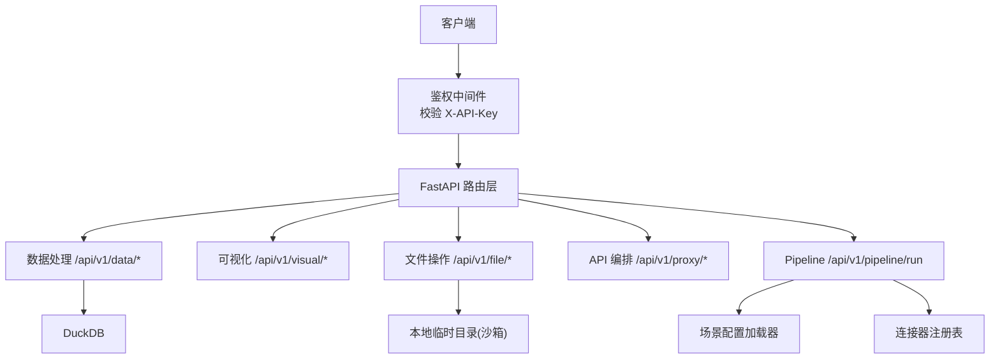
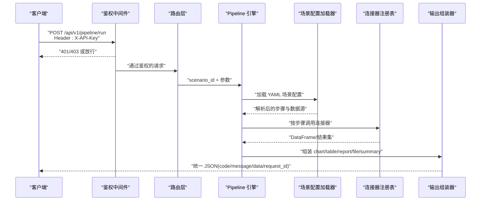
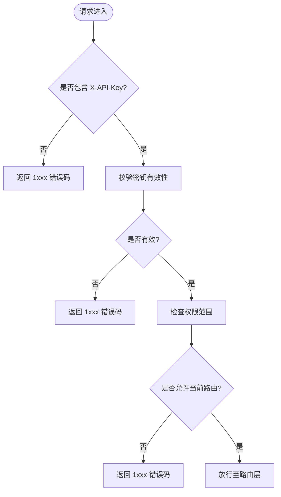
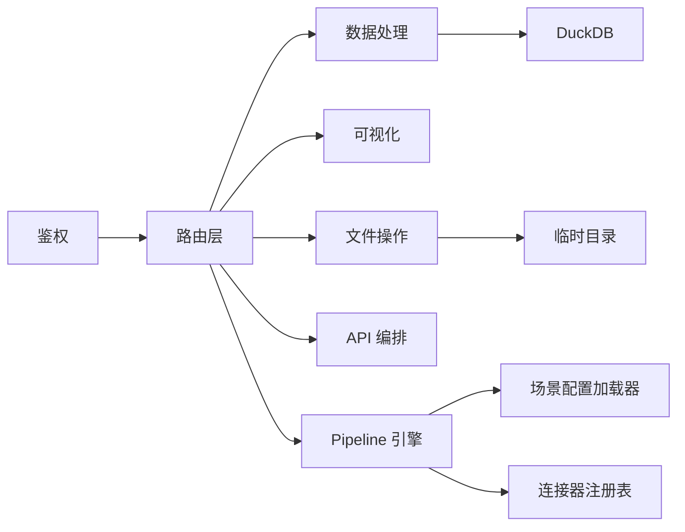

# 认证与安全

<cite>
**本文引用的文件**
- [需求说明文档](file://docs\20260821100000_hiagent辅助Web服务_需求说明.md)
</cite>

## 目录
1. [简介](#简介)
2. [项目结构](#项目结构)
3. [核心组件](#核心组件)
4. [架构总览](#架构总览)
5. [详细组件分析](#详细组件分析)
6. [依赖关系分析](#依赖关系分析)
7. [性能考虑](#性能考虑)
8. [故障排查指南](#故障排查指南)
9. [结论](#结论)
10. [附录](#附录)

## 简介
本章节面向 hiagent 辅助 Web 服务的 API 认证与安全机制，基于需求说明书中的统一接口规范与非功能性需求，梳理并沉淀以下要点：
- API Key 认证机制（X-API-Key Header）的使用方式与接入点
- 密钥管理与权限控制策略
- 安全防护措施：输入验证、SQL 注入防护、文件沙箱、凭据管理
- 错误码分段设计（1xxx/2xxx/3xxx/4xxx/5xxx/6xxx）的规范与使用
- 安全最佳实践与常见问题解决方案

该文档旨在为开发者、运维与审计人员提供可操作的实现指引与排障参考。

## 项目结构
根据需求说明，系统采用 FastAPI 框架，围绕“原子 API + Pipeline 编排”的双模式组织能力。与安全相关的关键位置包括：
- 入口路由层：统一鉴权中间件或依赖注入校验 X-API-Key
- 数据层：DuckDB 查询与 SQL 执行的安全约束
- 文件层：临时目录隔离与生命周期管理
- 配置层：环境变量承载凭据，禁止硬编码
- 响应层：统一 JSON 格式与错误码分段

图示来源
- [需求说明文档:25-30](file://docs\20260821100000_hiagent辅助Web服务_需求说明.md#L25-L30)
- [需求说明文档:71-94](file://docs\20260821100000_hiagent辅助Web服务_需求说明.md#L71-L94)
- [需求说明文档:97-102](file://docs\20260821100000_hiagent辅助Web服务_需求说明.md#L97-L102)

章节来源
- [需求说明文档:25-30](file://docs\20260821100000_hiagent辅助Web服务_需求说明.md#L25-L30)
- [需求说明文档:71-94](file://docs\20260821100000_hiagent辅助Web服务_需求说明.md#L71-L94)
- [需求说明文档:97-102](file://docs\20260821100000_hiagent辅助Web服务_需求说明.md#L97-L102)

## 核心组件
- 鉴权组件
  - 职责：在请求进入路由前校验 X-API-Key，拒绝未授权访问
  - 关键点：Header 名称固定为 X-API-Key；支持多租户/多密钥；失败返回统一错误码
- 输入验证组件
  - 职责：对请求体、路径参数、查询参数进行强类型校验与白名单过滤
  - 关键点：基于 Pydantic 模型；限制字段长度、枚举值、正则匹配
- SQL 安全组件
  - 职责：通过 DuckDB 执行受控查询，防止 SQL 注入
  - 关键点：仅允许只读语句；参数化查询；禁用危险函数/DDL/DML
- 文件沙箱组件
  - 职责：将上传/下载/转换等操作限定在隔离目录，限制大小与类型
  - 关键点：2 小时自动清理；流式下载；禁止绝对路径穿越
- 凭据管理组件
  - 职责：从环境变量读取数据库/API 凭据，禁止代码硬编码
  - 关键点：最小权限原则；敏感信息不落盘；支持轮换

章节来源
- [需求说明文档:25-30](file://docs\20260821100000_hiagent辅助Web服务_需求说明.md#L25-L30)
- [需求说明文档:97-102](file://docs\20260821100000_hiagent辅助Web服务_需求说明.md#L97-L102)

## 架构总览
下图展示一次带认证的 Pipeline 调用流程，体现鉴权、场景加载、连接器与输出组装的协作关系。

图示来源
- [需求说明文档:33-67](file://docs\20260821100000_hiagent辅助Web服务_需求说明.md#L33-L67)
- [需求说明文档:25-30](file://docs\20260821100000_hiagent辅助Web服务_需求说明.md#L25-L30)

## 详细组件分析

### API Key 认证（X-API-Key）
- 接入点
  - 全局中间件或 FastAPI Depends 中拦截所有 /api/v1/* 请求
  - 仅当存在有效 X-API-Key 时放行
- 密钥管理
  - 密钥存储于环境变量或密钥管理服务，运行时动态校验
  - 支持按租户/应用维度绑定密钥与访问范围
- 权限控制
  - 可在密钥元数据中声明允许的路由前缀或模块（如 data/visual/file/proxy/pipeline）
  - 未命中权限则返回对应错误码（见错误码分段）
- 失败处理
  - 缺失 Header：返回通用错误码段（1xxx）
  - 无效/过期密钥：返回通用错误码段（1xxx），记录审计日志

图示来源
- [需求说明文档:25-30](file://docs\20260821100000_hiagent辅助Web服务_需求说明.md#L25-L30)
- [需求说明文档:97-102](file://docs\20260821100000_hiagent辅助Web服务_需求说明.md#L97-L102)

章节来源
- [需求说明文档:25-30](file://docs\20260821100000_hiagent辅助Web服务_需求说明.md#L25-L30)
- [需求说明文档:97-102](file://docs\20260821100000_hiagent辅助Web服务_需求说明.md#L97-L102)

### 输入验证
- 校验策略
  - 使用 Pydantic 模型定义请求体/查询参数，强制类型与必填项
  - 对字符串进行长度、字符集、正则白名单校验
  - 对数值进行范围校验，对枚举进行取值校验
- 防注入
  - 所有外部输入不得直接拼接 SQL
  - 对文件上传名、URL、模板名等进行严格白名单校验
- 异常处理
  - 校验失败统一返回 1xxx 错误码，附带 message 提示

章节来源
- [需求说明文档:25-30](file://docs\20260821100000_hiagent辅助Web服务_需求说明.md#L25-L30)
- [需求说明文档:97-102](file://docs\20260821100000_hiagent辅助Web服务_需求说明.md#L97-L102)

### SQL 注入防护（DuckDB）
- 执行约束
  - 仅允许 SELECT 等只读语句；禁止 DDL/DML
  - 禁用危险函数与系统表访问
- 参数化查询
  - 所有用户输入以参数形式传入，禁止字符串拼接
- 最小权限
  - 数据库账号仅授予必要只读权限
- 审计与限流
  - 记录慢查询与异常查询；对高频查询进行速率限制

章节来源
- [需求说明文档:71-77](file://docs\20260821100000_hiagent辅助Web服务_需求说明.md#L71-L77)
- [需求说明文档:97-102](file://docs\20260821100000_hiagent辅助Web服务_需求说明.md#L97-L102)

### 文件沙箱
- 隔离策略
  - 所有文件操作限制在指定临时目录，禁止路径穿越
  - 限制文件大小、MIME 类型与扩展名白名单
- 生命周期
  - 临时文件 2 小时自动清理；支持流式下载避免大文件内存占用
- 安全扫描
  - 对上传文件进行病毒/恶意内容扫描（可选）
- 审计
  - 记录文件名、大小、操作者、时间戳

章节来源
- [需求说明文档:84-88](file://docs\20260821100000_hiagent辅助Web服务_需求说明.md#L84-L88)
- [需求说明文档:97-102](file://docs\20260821100000_hiagent辅助Web服务_需求说明.md#L97-L102)

### 凭据管理
- 来源与存储
  - 数据库连接串、API Token 等全部来自环境变量或密钥管理服务
  - 禁止在代码或配置文件中硬编码
- 最小权限
  - 每个凭据仅授予最小必要权限
- 轮换与审计
  - 支持凭据轮换；记录访问与变更审计日志

章节来源
- [需求说明文档:97-102](file://docs\20260821100000_hiagent辅助Web服务_需求说明.md#L97-L102)

### 错误码分段设计规范
- 分段规则
  - 1xxx：通用错误（认证失败、参数校验失败、系统异常）
  - 2xxx：数据处理错误（导入失败、SQL 执行失败、清洗异常）
  - 3xxx：可视化错误（图表渲染失败、模板渲染失败）
  - 4xxx：文件文档错误（上传失败、转换失败、路径非法）
  - 5xxx：API 编排错误（代理失败、转换失败、重试失败）
  - 6xxx：Pipeline 引擎错误（场景配置错误、步骤执行失败）
- 使用规范
  - 所有错误响应遵循统一 JSON 格式：code/message/data/request_id
  - 对外不暴露堆栈细节，message 需友好且可定位
  - 服务端记录结构化日志，含 scenario_id、步骤耗时、错误上下文

章节来源
- [需求说明文档:25-30](file://docs\20260821100000_hiagent辅助Web服务_需求说明.md#L25-L30)
- [需求说明文档:97-102](file://docs\20260821100000_hiagent辅助Web服务_需求说明.md#L97-L102)

## 依赖关系分析
- 鉴权依赖
  - 依赖环境变量/密钥服务获取有效密钥集合
  - 依赖路由层将请求分发到各模块
- 数据层依赖
  - DuckDB 作为内嵌数据库，要求只读与参数化查询
- 文件层依赖
  - 文件系统 API 与定时清理任务
- 配置层依赖
  - YAML 场景配置加载器，支持热加载（按需）
- 输出层依赖
  - 图表/报告/表格/文件/摘要组装器

图示来源
- [需求说明文档:33-67](file://docs\20260821100000_hiagent辅助Web服务_需求说明.md#L33-L67)
- [需求说明文档:71-94](file://docs\20260821100000_hiagent辅助Web服务_需求说明.md#L71-L94)

## 性能考虑
- 鉴权开销
  - 建议缓存密钥白名单与权限映射，减少每次请求的 I/O
- SQL 查询
  - 使用索引与分页；限制返回行数；避免全表扫描
- 文件处理
  - 流式读写；限制并发；及时清理临时文件
- Pipeline
  - 步骤级超时与重试上限；并行度可控

[本节为通用指导，无需具体文件引用]

## 故障排查指南
- 认证失败
  - 检查请求是否携带 X-API-Key；确认密钥有效且具备目标路由权限
  - 查看鉴权日志与审计记录
- 参数校验失败
  - 核对 Pydantic 模型定义；检查必填字段与格式
- SQL 执行失败
  - 检查是否触发只读限制或危险函数；查看慢查询日志
- 文件操作失败
  - 检查沙箱目录权限、文件大小与类型限制；确认清理策略
- Pipeline 执行失败
  - 检查场景 YAML 配置；查看步骤日志与错误码分段定位问题

章节来源
- [需求说明文档:25-30](file://docs\20260821100000_hiagent辅助Web服务_需求说明.md#L25-L30)
- [需求说明文档:97-102](file://docs\20260821100000_hiagent辅助Web服务_需求说明.md#L97-L102)

## 结论
本方案以 X-API-Key 为核心认证手段，结合严格的输入验证、SQL 注入防护、文件沙箱与凭据管理，构建了覆盖请求入口到数据与文件处理的完整安全闭环。统一的错误码分段与标准化响应提升了可观测性与可维护性。建议在实施中配合密钥轮换、最小权限、审计日志与速率限制，持续强化系统安全性。

[本节为总结性内容，无需具体文件引用]

## 附录
- 术语
  - API Key：用于标识调用方身份的令牌
  - 沙箱：受限的文件/进程执行环境
  - 参数化查询：以占位符传递参数，避免拼接 SQL
- 参考
  - 统一接口规范与错误码分段
  - 非功能性需求中的安全与部署要点

[本节为补充信息，无需具体文件引用]