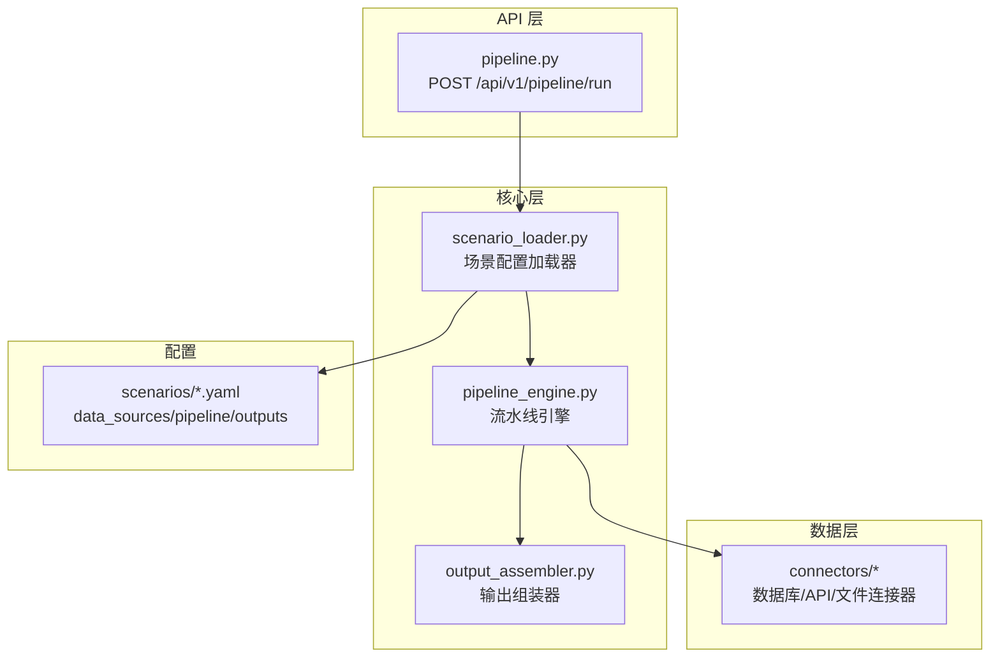
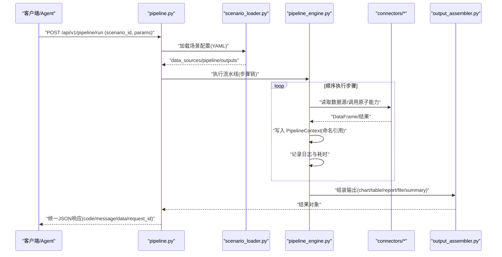
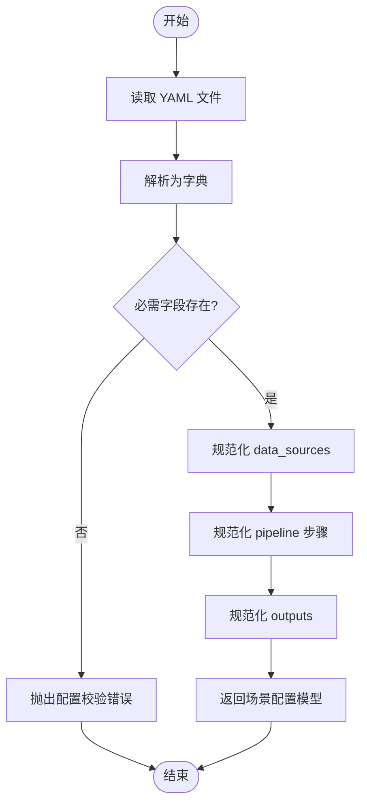
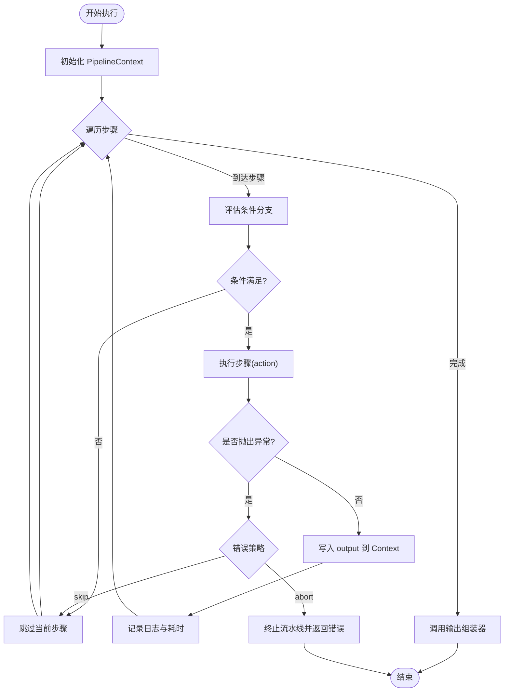
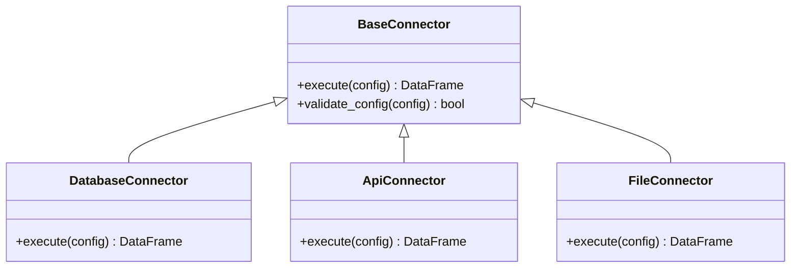
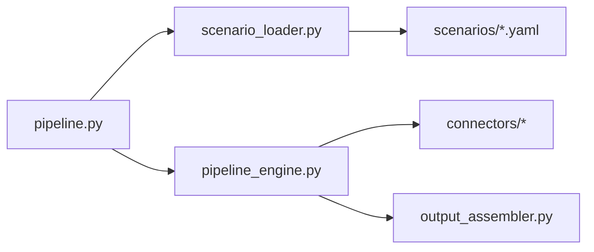

# Pipeline 引擎设计

<cite>
**本文引用的文件**
- [需求说明文档](file://docs/hiagent_辅助_Web_服务需求说明_task-242.md)
</cite>

## 目录
1. [简介](#简介)
2. [项目结构](#项目结构)
3. [核心组件](#核心组件)
4. [架构总览](#架构总览)
5. [详细组件分析](#详细组件分析)
6. [依赖关系分析](#依赖关系分析)
7. [性能考量](#性能考量)
8. [故障排查指南](#故障排查指南)
9. [结论](#结论)
10. [附录：配置与扩展示例](#附录配置与扩展示例)

## 简介
本设计文档围绕“场景驱动的流水线引擎”展开，目标是提供一套可配置、可扩展、可观测的数据处理流水线。其核心思想是：通过 YAML 描述业务场景（数据源、步骤、输出），由引擎按顺序执行步骤，使用命名引用在步骤间传递中间数据；同时支持条件分支与步骤级错误处理（skip/abort），并记录每步日志与耗时，最终由输出组装器生成多种结果类型。

该设计兼顾两种调用模式：
- 模式 A：Pipeline API（一次性完成全流程）
- 模式 B：原子 API（逐步调用，Agent 自行编排）

## 项目结构
根据需求文档，关键新增目录与职责如下：
- app/core/pipeline_engine.py — 流水线引擎：负责解析 pipeline 定义、调度步骤、管理上下文、处理条件分支与错误策略
- app/core/scenario_loader.py — 场景配置加载器：读取 YAML、校验 schema、构建 data_sources/pipeline/outputs 模型
- app/core/connectors/ — 数据连接器：统一 DataFrame 返回，注册表模式扩展
- app/core/output_assembler.py — 输出组装器：chart/table/report/file/summary
- app/scenarios/*.yaml — 场景配置文件
- app/api/v1/pipeline.py — Pipeline 路由：暴露 POST /api/v1/pipeline/run 等接口

图表来源
- [需求说明文档:106-114](file://docs/hiagent_辅助_Web_服务需求说明_task-242.md#L106-L114)

章节来源
- [需求说明文档:106-114](file://docs/hiagent_辅助_Web_服务需求说明_task-242.md#L106-L114)

## 核心组件
- 场景配置加载器（scenario_loader.py）
  - 职责：读取 YAML，校验字段，构建 data_sources、pipeline、outputs 的内存模型，供后续组件消费
  - 关键点：YAML 可读性好、支持注释；schema 校验确保配置安全与一致性
- 流水线引擎（pipeline_engine.py）
  - 职责：解析 pipeline 步骤序列，维护 PipelineContext（命名引用中间数据），执行步骤、处理条件分支与错误策略（skip/abort），记录每步日志与耗时
  - 关键点：顺序执行、命名引用传递、条件分支、错误隔离、可观测性
- 数据连接器（connectors/*）
  - 职责：封装数据库、API、文件等数据获取逻辑，统一返回 DataFrame；凭据从环境变量读取；采用注册表模式便于扩展
- 输出组装器（output_assembler.py）
  - 职责：将上下文中的结果渲染为 chart/table/report/file/summary；其中 summary 专为 Agent 设计
- API 路由（api/v1/pipeline.py）
  - 职责：暴露 Pipeline 入口，接收 scenario_id + 参数，协调加载器、引擎、组装器，返回统一 JSON 响应

章节来源
- [需求说明文档:40-67](file://docs/hiagent_辅助_Web_服务需求说明_task-242.md#L40-L67)
- [需求说明文档:106-114](file://docs/hiagent_辅助_Web_服务需求说明_task-242.md#L106-L114)

## 架构总览
整体流程：Agent 请求进入 Pipeline API 入口，加载场景配置，构建数据源与步骤链，顺序执行步骤并通过 PipelineContext 传递中间数据，遇到错误按策略跳过或中止，最后由输出组装器生成结果并返回统一响应。

图表来源
- [需求说明文档:33-67](file://docs/hiagent_辅助_Web_服务需求说明_task-242.md#L33-L67)

## 详细组件分析

### 场景配置加载器（scenario_loader.py）
- 输入：YAML 文件路径或内容
- 处理：
  - 解析 YAML 为字典
  - 校验必需字段：data_sources、pipeline、outputs
  - 规范化 data_sources（connector 类型、连接配置、SQL/API 参数、请求参数映射）
  - 规范化 pipeline（步骤列表，含 action、input/output 引用、条件、错误策略）
  - 规范化 outputs（类型与数据源引用）
- 输出：场景配置模型（供引擎与组装器使用）
- 错误处理：
  - 缺失字段或类型不匹配时抛出配置校验错误
  - 提供清晰的错误消息以便定位 YAML 问题

图表来源
- [需求说明文档:40-44](file://docs/hiagent_辅助_Web_服务需求说明_task-242.md#L40-L44)

章节来源
- [需求说明文档:40-44](file://docs/hiagent_辅助_Web_服务需求说明_task-242.md#L40-L44)

### 流水线引擎（pipeline_engine.py）
- 核心概念：
  - PipelineContext：命名引用容器，用于在步骤之间传递中间数据
  - 步骤定义：包含 action（调用原子能力）、input（引用上游 output）、output（命名输出）、condition（可选）、error_policy（skip/abort）
- 执行机制：
  - 顺序遍历步骤，解析 input/output 名称，从 Context 中读写
  - 条件分支：基于上下文变量或外部参数计算布尔表达式，决定是否执行当前步骤
  - 错误处理：
    - skip：捕获异常，记录日志，继续执行后续步骤
    - abort：捕获异常，记录日志，终止流水线
  - 可观测性：每步记录日志与耗时，便于追踪与优化
- 扩展点：
  - 新增步骤只需实现标准接口，并在注册表中登记 action 名称

图表来源
- [需求说明文档:57-60](file://docs/hiagent_辅助_Web_服务需求说明_task-242.md#L57-L60)

章节来源
- [需求说明文档:57-60](file://docs/hiagent_辅助_Web_服务需求说明_task-242.md#L57-L60)

### 数据连接器（connectors/*）
- 设计原则：
  - 统一接口：所有连接器返回 DataFrame，屏蔽底层差异
  - 注册表模式：通过类型键（database/api/file_upload/file_url/file_s3）动态实例化
  - 凭据管理：从环境变量读取，避免硬编码
- 扩展方式：
  - 新增连接器类继承基类，实现统一方法
  - 在注册表中登记新类型键
- 典型流程：
  - 解析 connector 配置（连接信息、SQL/API 参数、请求参数映射）
  - 建立连接/发起请求
  - 转换为 DataFrame 返回

图表来源
- [需求说明文档:46-55](file://docs/hiagent_辅助_Web_服务需求说明_task-242.md#L46-L55)

章节来源
- [需求说明文档:46-55](file://docs/hiagent_辅助_Web_服务需求说明_task-242.md#L46-L55)

### 输出组装器（output_assembler.py）
- 支持的输出类型：
  - chart：图表（PNG/SVG/HTML）
  - table：表格（带排序/着色）
  - report：报告（Jinja2 HTML/Markdown 转 HTML）
  - file：文件（格式转换/打包/下载）
  - summary：摘要（专为 Agent 设计）
- 工作机制：
  - 从 PipelineContext 读取所需数据
  - 根据 outputs 配置选择渲染器
  - 生成结构化结果并返回

章节来源
- [需求说明文档:62-63](file://docs/hiagent_辅助_Web_服务需求说明_task-242.md#L62-L63)

### API 路由（api/v1/pipeline.py）
- 入口：POST /api/v1/pipeline/run
- 输入：scenario_id + 参数
- 流程：
  - 鉴权（X-API-Key）
  - 调用场景配置加载器
  - 调用流水线引擎执行
  - 调用输出组装器生成结果
  - 返回统一 JSON 响应（code/message/data/request_id）

章节来源
- [需求说明文档:25-31](file://docs/hiagent_辅助_Web_服务需求说明_task-242.md#L25-L31)
- [需求说明文档:65-67](file://docs/hiagent_辅助_Web_服务需求说明_task-242.md#L65-L67)

## 依赖关系分析
- 低耦合高内聚：
  - 加载器仅关注配置解析与校验
  - 引擎专注步骤调度与上下文管理
  - 连接器封装数据访问细节
  - 组装器专注结果渲染
- 外部依赖：
  - PyYAML：解析 YAML
  - DuckDB：SQL 查询与 DataFrame 操作
  - FastAPI：HTTP 路由与统一响应
  - matplotlib/plotly：图表生成
  - Jinja2：报告模板渲染
- 潜在循环依赖：
  - 通过模块边界清晰划分，避免相互导入
  - 使用注册表模式解耦动作与引擎

图表来源
- [需求说明文档:106-114](file://docs/hiagent_辅助_Web_服务需求说明_task-242.md#L106-L114)

章节来源
- [需求说明文档:106-114](file://docs/hiagent_辅助_Web_服务需求说明_task-242.md#L106-L114)

## 性能考量
- 目标性能：简单接口 < 500ms，数据处理 < 3s，Pipeline 全流程 < 10s
- 优化建议：
  - 数据层：优先使用 DuckDB 进行高效 SQL 查询与聚合
  - 缓存：对重复查询结果进行短期缓存（注意失效策略）
  - 并发：对外部 API 调用采用批量并发与重试机制
  - I/O：文件流式处理，避免大对象驻留内存
  - 监控：每步记录耗时，识别瓶颈步骤

章节来源
- [需求说明文档:97-102](file://docs/hiagent_辅助_Web_服务需求说明_task-242.md#L97-L102)

## 故障排查指南
- 常见错误与处理：
  - 配置错误：YAML 字段缺失或类型不匹配，需检查 schema 与必填项
  - 数据源错误：连接失败、权限不足、SQL 语法错误，需检查凭据与环境变量
  - 步骤执行错误：依据 error_policy 决定 skip 或 abort，查看日志定位具体步骤
  - 输出渲染错误：模板缺失或数据格式不符，检查 outputs 配置与上下文数据
- 可观测性：
  - 结构化日志包含 scenario_id 与步骤耗时
  - 健康检查端点 /health
  - 场景列表端点 /api/v1/pipeline/scenarios

章节来源
- [需求说明文档:25-31](file://docs/hiagent_辅助_Web_服务需求说明_task-242.md#L25-L31)
- [需求说明文档:97-102](file://docs/hiagent_辅助_Web_服务需求说明_task-242.md#L97-L102)

## 结论
本设计以 YAML 驱动的场景配置为核心，结合流水线引擎的顺序执行、命名引用、条件分支与错误策略，实现了高内聚、低耦合、可扩展的数据处理流水线。通过统一的连接器与输出组装器，既保证了灵活性，又提升了可维护性与可观测性。未来可在热加载、缓存、并发等方面持续优化。

## 附录：配置与扩展示例

### 场景配置示例（YAML）
- data_sources：定义数据源类型（database/api/file_*）、连接配置、SQL/API 参数、请求参数映射
- pipeline：定义步骤序列，每个步骤包含 action、input/output 命名引用、可选 condition、error_policy（skip/abort）
- outputs：定义输出类型（chart/table/report/file/summary）及数据来源引用

章节来源
- [需求说明文档:40-44](file://docs/hiagent_辅助_Web_服务需求说明_task-242.md#L40-L44)

### 步骤级错误处理策略
- skip：捕获异常后继续执行后续步骤，适用于非致命错误
- abort：捕获异常后终止流水线，适用于致命错误
- 每步独立记录日志与耗时，便于定位问题

章节来源
- [需求说明文档:57-60](file://docs/hiagent_辅助_Web_服务需求说明_task-242.md#L57-L60)

### 扩展新的处理步骤
- 步骤接口定义：实现标准 execute(context) 方法，读取 input 命名引用，写入 output 命名引用
- 注册机制：在动作注册表中登记 action 名称与处理器映射
- 参数验证：在加载器阶段校验步骤参数，确保类型与必填项正确
- 测试建议：单元测试覆盖正常路径与错误路径，集成测试验证端到端流程

章节来源
- [需求说明文档:46-55](file://docs/hiagent_辅助_Web_服务需求说明_task-242.md#L46-L55)
- [需求说明文档:106-114](file://docs/hiagent_辅助_Web_服务需求说明_task-242.md#L106-L114)