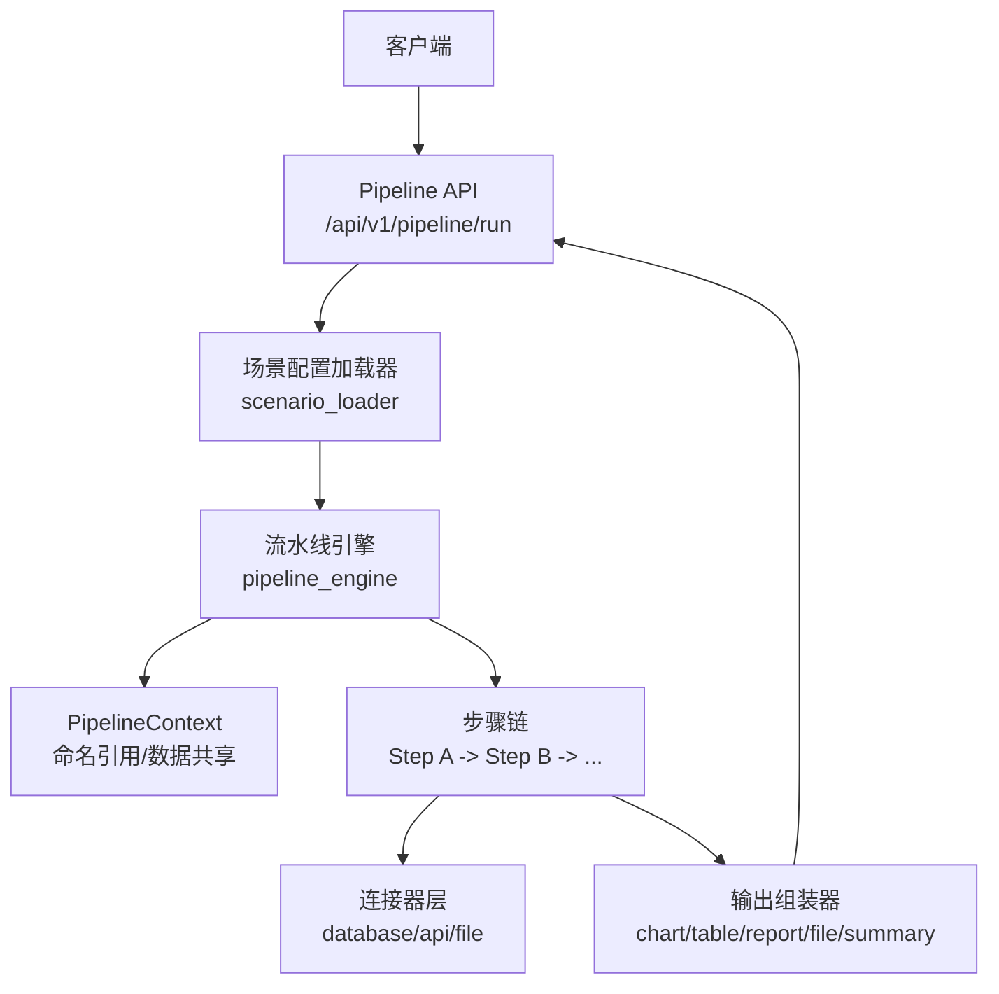
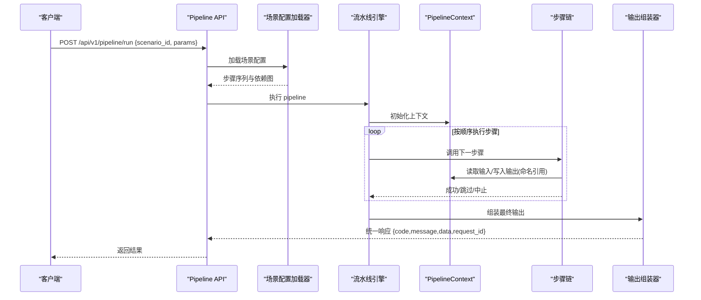
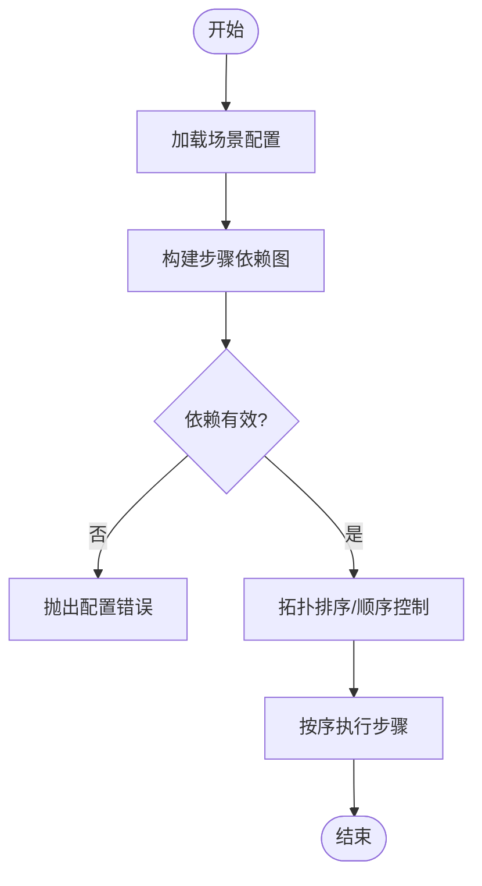
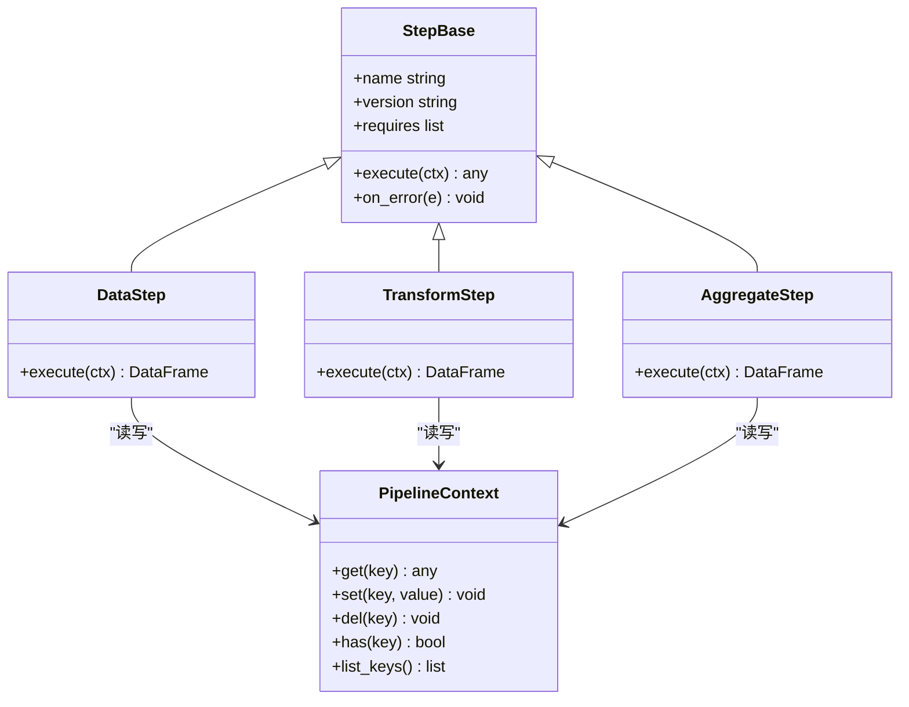
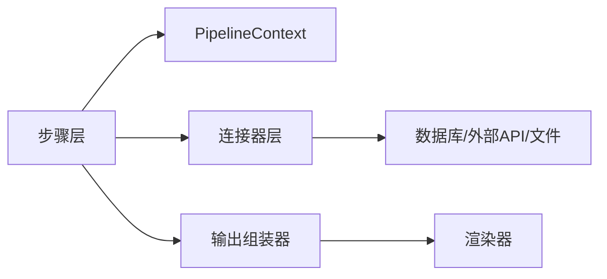

# 处理步骤扩展

<cite>
**本文档引用的文件**
- [hiagent_辅助_Web_服务需求说明_task-242.md](file://docs/20260821100000_hiagent辅助Web服务_需求说明.md)
</cite>

## 目录
1. [简介](#简介)
2. [项目结构](#项目结构)
3. [核心组件](#核心组件)
4. [架构总览](#架构总览)
5. [详细组件分析](#详细组件分析)
6. [依赖关系分析](#依赖关系分析)
7. [性能考虑](#性能考虑)
8. [故障排查指南](#故障排查指南)
9. [结论](#结论)
10. [附录](#附录)

## 简介
本指南面向需要在 hiagent 辅助 Web 服务的 Pipeline 引擎中扩展“处理步骤”的开发者。目标包括：
- 理解并遵循步骤接口定义（基类继承、输入输出参数规范、错误处理）
- 掌握步骤注册机制（类型注册、依赖声明、执行顺序控制）
- 掌握步骤间数据传递方式（PipelineContext 使用、命名引用、数据共享模式）
- 提供完整自定义步骤示例（数据处理、转换、聚合等）
- 给出调试技巧、性能优化建议与最佳实践

该指南严格依据需求说明书中的统一架构与 Pipeline 引擎设计进行展开，确保与后续实现保持一致。

## 项目结构
根据需求文档，关键新增目录与职责如下：
- app/core/pipeline_engine.py：流水线引擎，负责步骤调度、上下文管理、错误处理与日志记录
- app/core/scenario_loader.py：场景配置加载器，解析 YAML 场景配置，生成可执行的步骤序列
- app/core/connectors/：数据连接器层（base/database/api/file），统一返回 DataFrame
- app/core/output_assembler.py：输出组装器，将最终结果渲染为 chart/table/report/file/summary
- app/scenarios/*.yaml：场景配置文件，描述 data_sources、pipeline、outputs
- app/api/v1/pipeline.py：Pipeline API 路由，暴露 /api/v1/pipeline/run 等入口

图表来源
- [hiagent_辅助_Web_服务需求说明.md:33-68](file://docs/20260821100000_hiagent辅助Web服务_需求说明.md#L33-L68)

章节来源
- [hiagent_辅助_Web_服务需求说明.md:106-115](file://docs/20260821100000_hiagent辅助Web服务_需求说明.md#L106-L115)

## 核心组件
- 流水线引擎（Pipeline Engine）
  - 负责步骤的顺序执行、条件分支、步骤级错误处理（skip/abort）、每步独立日志与耗时统计
  - 通过 PipelineContext 在步骤之间传递中间数据，支持命名引用
- 场景配置加载器（Scenario Loader）
  - 解析 YAML 场景配置，提取 data_sources、pipeline、outputs
  - 校验步骤依赖与顺序，生成可执行的任务图
- 连接器层（Connector Layer）
  - 统一抽象数据库、API、文件上传/下载等数据源
  - 所有连接器返回统一的 DataFrame，凭据从环境变量读取，采用注册表模式扩展
- 输出组装器（Output Assembler）
  - 支持 chart/table/report/file/summary 五种输出类型
  - summary 专为 Agent 设计，便于快速消费

章节来源
- [hiagent_辅助_Web_服务需求说明.md:46-68](file://docs/20260821100000_hiagent辅助Web服务_需求说明.md#L46-L68)

## 架构总览
Pipeline 引擎以“配置驱动 + 原子能力”为核心，结合“无状态、单一职责、输入输出标准化、容错优先、安全隔离、场景可配置、组件可复用”的原则，支撑多种业务分析场景。

图表来源
- [hiagent_辅助_Web_服务需求说明.md:33-68](file://docs/20260821100000_hiagent辅助Web服务_需求说明.md#L33-L68)

## 详细组件分析

### 步骤接口定义与基类继承
- 基类继承
  - 所有处理步骤应继承统一的步骤基类，确保一致的输入输出契约与生命周期钩子
  - 基类需提供：
    - 输入参数校验（Pydantic 模型或等价校验）
    - 执行方法（execute）
    - 错误处理策略（异常转码、日志、重试/跳过/中止）
    - 元数据（名称、版本、依赖、排序权重）
- 输入输出参数规范
  - 输入：来自 PipelineContext 的命名引用，如 ctx.get("df_raw")、ctx.get("params.filter")
  - 输出：写回 PipelineContext 的命名键，如 ctx.set("df_clean", df)
  - 数据类型：DataFrame、字典、标量、列表等；复杂对象需可序列化
- 错误处理机制
  - 步骤内捕获异常并转换为统一错误码（2xxx 数据处理、5xxx API 编排、6xxx Pipeline 引擎）
  - 支持 skip（跳过当前步骤继续执行）与 abort（终止整个流程）两种策略
  - 每步记录结构化日志（含 scenario_id、step_name、耗时、错误堆栈摘要）

章节来源
- [hiagent_辅助_Web_服务需求说明.md:25-31](file://docs/20260821100000_hiagent辅助Web服务_需求说明.md#L25-L31)
- [hiagent_辅助_Web_服务需求说明.md:57-61](file://docs/20260821100000_hiagent辅助Web服务_需求说明.md#L57-L61)

### 步骤注册机制
- 步骤类型注册
  - 通过注册表模式维护步骤类型到实现的映射，新增步骤只需注册即可被场景配置引用
  - 注册时附带元数据：名称、版本、依赖、排序权重、描述
- 依赖声明
  - 每个步骤声明其所需的前置步骤输出键（如 requires=["df_raw","params.filter"]）
  - 场景配置加载器在构建步骤图时校验依赖完整性，避免循环依赖
- 执行顺序控制
  - 基于拓扑排序生成执行顺序，支持显式 order 字段与隐式依赖推导
  - 支持条件分支（if/else）与并行执行（当无依赖冲突时）

图表来源
- [hiagent_辅助_Web_服务需求说明.md:40-61](file://docs/20260821100000_hiagent辅助Web服务_需求说明.md#L40-L61)

章节来源
- [hiagent_辅助_Web_服务需求说明.md:40-61](file://docs/20260821100000_hiagent辅助Web服务_需求说明.md#L40-L61)

### 步骤间数据传递与 PipelineContext
- PipelineContext 的作用
  - 作为步骤间的共享内存，提供 get/set/del 等操作
  - 支持命名引用：步骤通过字符串键访问其他步骤的输出
- 命名引用机制
  - 步骤输入通过 ${key} 引用上下文中的值，例如 ${df_raw}、${params.filter}
  - 支持嵌套路径与默认值，缺失时可按策略报错或跳过
- 数据共享模式
  - 推荐“只读输入、只写输出”的单向数据流，避免副作用
  - 大数据集建议使用 DataFrame，小对象使用字典/标量
  - 临时变量使用前缀区分（如 _tmp_xxx），避免污染全局命名空间

图表来源
- [hiagent_辅助_Web_服务需求说明.md:57-61](file://docs/20260821100000_hiagent辅助Web服务_需求说明.md#L57-L61)

章节来源
- [hiagent_辅助_Web_服务需求说明.md:57-61](file://docs/20260821100000_hiagent辅助Web服务_需求说明.md#L57-L61)

### 自定义处理步骤开发示例
以下为三类常见步骤的开发要点与参考路径（不直接展示代码内容）：
- 数据处理步骤（Data Step）
  - 用途：导入、清洗、去重、空值处理、类型转换
  - 输入：原始 DataFrame 或文件路径
  - 输出：清洗后的 DataFrame
  - 参考路径
    - [数据处理步骤实现](file://app/core/steps/data_step.py)
    - [数据清洗工具](file://app/core/utils/cleaner.py)
- 转换步骤（Transform Step）
  - 用途：透视、合并、过滤、排序、特征工程
  - 输入：一个或多个 DataFrame
  - 输出：转换后的 DataFrame
  - 参考路径
    - [转换步骤实现](file://app/core/steps/transform_step.py)
    - [表达式解析器](file://app/core/utils/expression.py)
- 聚合步骤（Aggregate Step）
  - 用途：分组聚合、统计指标计算、时间窗口聚合
  - 输入：DataFrame + 聚合规则
  - 输出：聚合结果 DataFrame 或指标字典
  - 参考路径
    - [聚合步骤实现](file://app/core/steps/aggregate_step.py)
    - [指标计算器](file://app/core/utils/metrics.py)

章节来源
- [hiagent_辅助_Web_服务需求说明.md:73-78](file://docs/20260821100000_hiagent辅助Web服务_需求说明.md#L73-L78)

### 连接器集成与数据获取
- 连接器类型
  - database：直连数据库（MySQL/PostgreSQL/ClickHouse）
  - api：调用外部 REST API
  - file_upload：Agent 上传文件
  - file_url：从 URL 下载文件
  - file_s3：对象存储（后期扩展）
- 统一返回 DataFrame，凭据从环境变量读取，采用注册表模式扩展
- 参考路径
  - [连接器基类](file://app/core/connectors/base.py)
  - [数据库连接器](file://app/core/connectors/database.py)
  - [API 连接器](file://app/core/connectors/api.py)
  - [文件连接器](file://app/core/connectors/file.py)

章节来源
- [hiagent_辅助_Web_服务需求说明.md:46-56](file://docs/20260821100000_hiagent辅助Web服务_需求说明.md#L46-L56)

### 输出组装与报告生成
- 输出类型
  - chart：图表（PNG/SVG/HTML）
  - table：表格（带条件着色、排序）
  - report：报告（Jinja2 HTML、Markdown 转 HTML）
  - file：文件（PDF/Word/Excel/PPT，支持模板）
  - summary：摘要（专为 Agent 设计）
- 参考路径
  - [输出组装器](file://app/core/output_assembler.py)
  - [图表渲染](file://app/core/renderers/chart.py)
  - [报告渲染](file://app/core/renderers/report.py)

章节来源
- [hiagent_辅助_Web_服务需求说明.md:62-64](file://docs/20260821100000_hiagent辅助Web服务_需求说明.md#L62-L64)

## 依赖关系分析
- 组件耦合与内聚
  - 步骤与 PipelineContext 松耦合，仅通过命名键交互
  - 连接器与步骤解耦，步骤通过统一 DataFrame 消费数据
  - 输出组装器与步骤解耦，仅消费最终结果
- 外部依赖
  - FastAPI、pandas/numpy、DuckDB、matplotlib/plotly、WeasyPrint、httpx、Pydantic、PyYAML、SQLAlchemy、jsonpath-ng
- 潜在循环依赖
  - 通过依赖声明与拓扑排序避免循环；场景配置加载器需在构建阶段检测

图表来源
- [hiagent_辅助_Web_服务需求说明.md:19-22](file://docs/20260821100000_hiagent辅助Web服务_需求说明.md#L19-L22)
- [hiagent_辅助_Web_服务需求说明.md:46-68](file://docs/20260821100000_hiagent辅助Web服务_需求说明.md#L46-L68)

章节来源
- [hiagent_辅助_Web_服务需求说明.md:19-22](file://docs/20260821100000_hiagent辅助Web服务_需求说明.md#L19-L22)
- [hiagent_辅助_Web_服务需求说明.md:46-68](file://docs/20260821100000_hiagent辅助Web服务_需求说明.md#L46-L68)

## 性能考虑
- 简单接口 < 500ms，数据处理 < 3s，Pipeline 全流程 < 10s
- 优化建议
  - 使用 DataFrame 向量化操作，避免逐行循环
  - 大表查询走 DuckDB，减少内存占用
  - 步骤级缓存（对幂等步骤）
  - 并行执行无依赖的步骤
  - 限制中间结果大小，及时释放内存
  - 合理设置超时与重试策略

章节来源
- [hiagent_辅助_Web_服务需求说明.md:97-102](file://docs/20260821100000_hiagent辅助Web服务_需求说明.md#L97-L102)

## 故障排查指南
- 错误码分段
  - 1xxx 通用、2xxx 数据处理、3xxx 可视化、4xxx 文件文档、5xxx API 编排、6xxx Pipeline 引擎
- 常见问题定位
  - 步骤执行失败：检查步骤日志、异常堆栈、输入键是否存在
  - 依赖缺失：检查场景配置的 requires 与步骤输出键是否一致
  - 循环依赖：重新审视步骤依赖图，调整 order 或拆分步骤
  - 性能问题：查看每步耗时，定位瓶颈步骤
- 调试技巧
  - 启用详细日志（含 scenario_id、step_name、耗时）
  - 使用 /health 与健康检查
  - 逐步注释步骤，缩小问题范围
  - 使用最小复现场景配置验证

章节来源
- [hiagent_辅助_Web_服务需求说明.md:25-31](file://docs/20260821100000_hiagent辅助Web服务_需求说明.md#L25-L31)
- [hiagent_辅助_Web_服务需求说明.md:57-61](file://docs/20260821100000_hiagent辅助Web服务_需求说明.md#L57-L61)
- [hiagent_辅助_Web_服务需求说明.md:97-102](file://docs/20260821100000_hiagent辅助Web服务_需求说明.md#L97-L102)

## 结论
通过统一的步骤接口、注册机制与 PipelineContext 数据传递，hiagent 的 Pipeline 引擎能够以配置驱动的方式灵活组合原子能力，支撑多变的业务分析场景。遵循本指南的规范与实践，可高效扩展自定义步骤，并确保系统的稳定性、可观测性与性能。

## 附录
- 场景配置示例（YAML）
  - data_sources：定义数据源类型与连接参数
  - pipeline：定义步骤链与输入输出命名引用
  - outputs：定义最终输出类型与数据来源
- 参考路径
  - [场景配置示例](file://app/scenarios/example.yaml)
  - [Pipeline API 路由](file://app/api/v1/pipeline.py)
  - [场景配置加载器](file://app/core/scenario_loader.py)
  - [流水线引擎](file://app/core/pipeline_engine.py)