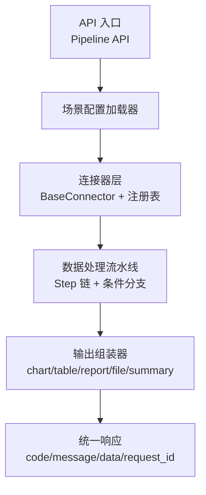
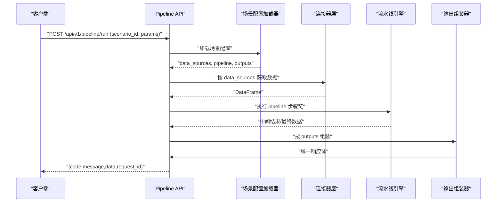
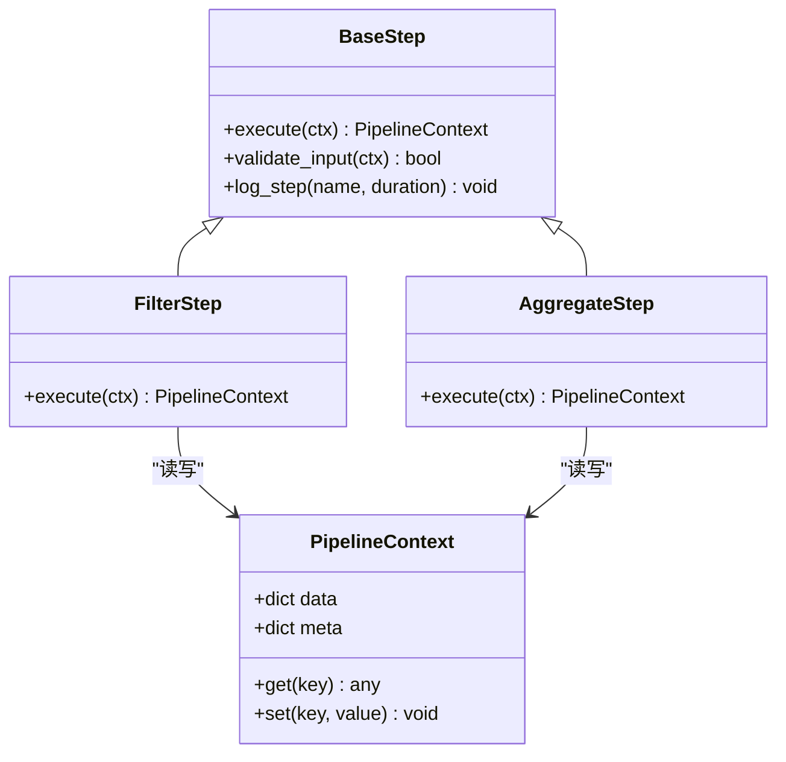
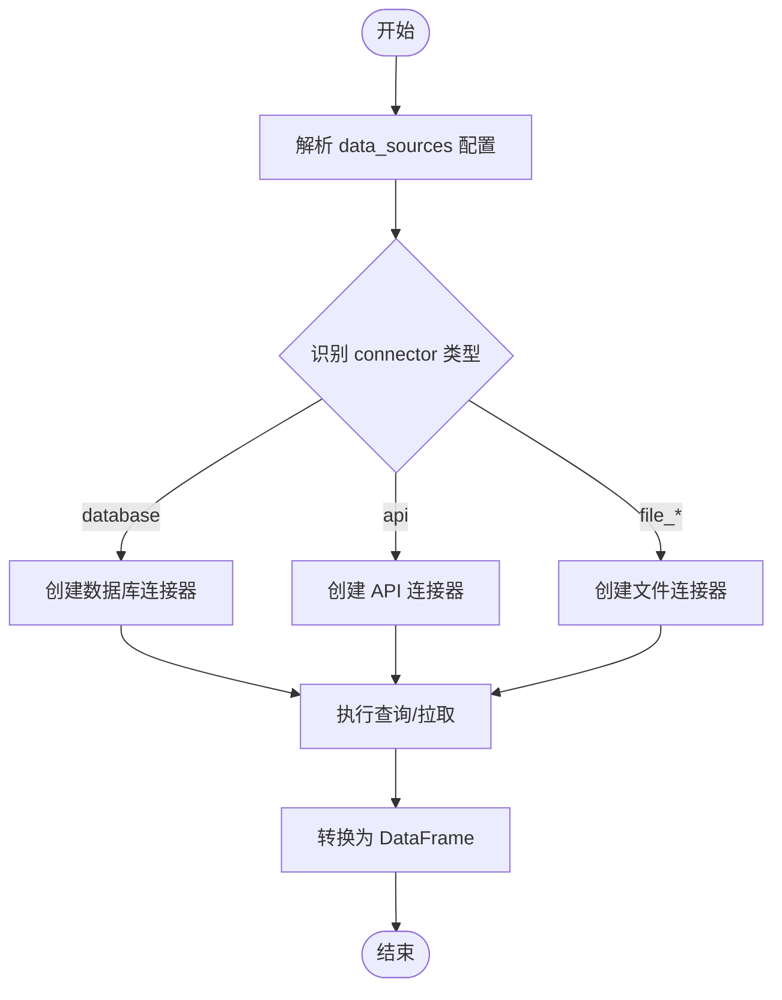
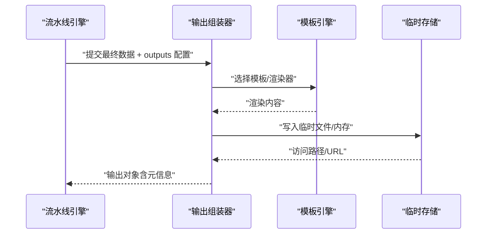
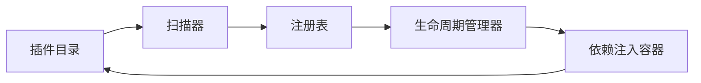
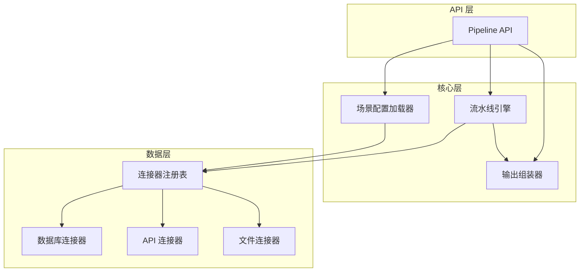

# 扩展机制设计

<cite>
**本文档引用的文件**
- [hiagent辅助Web服务_需求说明.md](file://docs/20260821100000_hiagent辅助Web服务_需求说明.md)
</cite>

## 目录
1. [简介](#简介)
2. [项目结构](#项目结构)
3. [核心组件](#核心组件)
4. [架构总览](#架构总览)
5. [详细组件分析](#详细组件分析)
6. [依赖关系分析](#依赖关系分析)
7. [性能考虑](#性能考虑)
8. [故障排查指南](#故障排查指南)
9. [结论](#结论)
10. [附录](#附录)

## 简介

本指南面向需要扩展 hiagent 辅助 Web 服务 Pipeline 引擎的开发者，围绕“场景驱动、组件可复用”的核心原则，系统阐述如何扩展新的处理步骤、连接器与输出格式化器，并给出插件化架构设计与最佳实践。目标是在统一接口规范下，以配置驱动的方式支撑多种业务分析场景（竞品分析、机构行为分析、产品规模增量分析等），确保无状态、单一职责、输入输出标准化、容错优先与安全隔离。

## 项目结构

根据需求说明，关键新增目录与模块如下：
- app/core/pipeline_engine.py — 流水线引擎
- app/core/scenario_loader.py — 场景配置加载器
- app/core/connectors/ — 数据连接器（base/database/api/file）
- app/core/output_assembler.py — 输出组装器
- app/scenarios/*.yaml — 场景配置文件目录
- app/api/v1/pipeline.py — Pipeline 路由

图表来源
- [hiagent辅助Web服务_需求说明.md:33-68](file://docs/20260821100000_hiagent辅助Web服务_需求说明.md#L33-L68)

章节来源
- [hiagent辅助Web服务_需求说明.md:106-115](file://docs/20260821100000_hiagent辅助Web服务_需求说明.md#L106-L115)

## 核心组件

- 流水线引擎：顺序执行 Step 链，通过命名引用在步骤间传递中间数据；支持条件分支与步骤级错误处理（skip/abort）；每步独立记录日志与耗时。
- 连接器层：提供 database、api、file_upload、file_url、file_s3 等类型；所有连接器返回统一 DataFrame；凭据从环境变量读取；采用注册表模式扩展。
- 输出组装器：支持 chart、table、report、file、summary 五种输出类型；summary 专为 Agent 设计。
- 场景配置加载器：解析 YAML 配置，描述 data_sources、pipeline、outputs 三部分。
- API 路由：暴露 Pipeline API 与原子 API，统一 JSON 响应格式与错误码分段。

章节来源
- [hiagent辅助Web服务_需求说明.md:46-68](file://docs/20260821100000_hiagent辅助Web服务_需求说明.md#L46-L68)
- [hiagent辅助Web服务_需求说明.md:73-88](file://docs/20260821100000_hiagent辅助Web服务_需求说明.md#L73-L88)
- [hiagent辅助Web服务_需求说明.md:25-31](file://docs/20260821100000_hiagent辅助Web服务_需求说明.md#L25-L31)

## 架构总览

图表来源
- [hiagent辅助Web服务_需求说明.md:33-68](file://docs/20260821100000_hiagent辅助Web服务_需求说明.md#L33-L68)
- [hiagent辅助Web服务_需求说明.md:25-31](file://docs/20260821100000_hiagent辅助Web服务_需求说明.md#L25-L31)

## 详细组件分析

### 步骤接口定义与实现规范（Pipeline Step）

- 接口契约
  - 输入：PipelineContext（包含命名引用的中间数据、上下文元信息）
  - 输出：更新后的 PipelineContext 或异常（用于 skip/abort）
  - 能力：数据转换、过滤、聚合、统计、清洗等
- 实现规范
  - 单一职责：每个 Step 只做一件事
  - 无状态：不持有跨请求的全局可变状态
  - 可观测：记录步骤名、输入键、耗时、错误信息
  - 容错：对缺失键、空数据、类型不匹配进行防御性处理
- 注册机制
  - 使用注册表模式：以字符串 action 名称映射到 Step 类或函数
  - 支持动态发现：扫描包内模块自动注册
  - 版本兼容：action 名称向后兼容，废弃字段标记为 deprecated

图表来源
- [hiagent辅助Web服务_需求说明.md:57-61](file://docs/20260821100000_hiagent辅助Web服务_需求说明.md#L57-L61)

章节来源
- [hiagent辅助Web服务_需求说明.md:57-61](file://docs/20260821100000_hiagent辅助Web服务_需求说明.md#L57-L61)

### 连接器扩展方式（BaseConnector + 注册表）

- 基类职责
  - 统一输入：连接配置（YAML 片段）、凭据（环境变量）
  - 统一输出：pandas DataFrame
  - 生命周期：初始化、查询/拉取、关闭资源
- 连接器类型
  - database：直连数据库（MySQL/PostgreSQL/ClickHouse）
  - api：调用外部 REST API
  - file_upload：Agent 上传文件
  - file_url：从 URL 下载文件
  - file_s3：对象存储（后期扩展）
- 注册机制
  - 以 type 字段作为键，将具体连接器类注册到全局注册表
  - 支持热加载：新增连接器无需重启（按需导入）
- 配置参数
  - 连接串/端点、认证信息、超时、重试策略、分页参数
  - 安全：凭据仅从环境变量注入，禁止硬编码

图表来源
- [hiagent辅助Web服务_需求说明.md:46-55](file://docs/20260821100000_hiagent辅助Web服务_需求说明.md#L46-L55)

章节来源
- [hiagent辅助Web服务_需求说明.md:46-55](file://docs/20260821100000_hiagent辅助Web服务_需求说明.md#L46-L55)

### 输出格式化器扩展方法（Output Assembler）

- 输出类型
  - chart：图表（PNG/SVG/HTML）
  - table：表格（带条件着色、排序）
  - report：报告（Jinja2 HTML 模板、Markdown 转 HTML）
  - file：文件（PDF/Word/Excel/PPT，支持模板）
  - summary：摘要（专为 Agent 设计）
- 扩展点
  - 新输出类型：实现渲染器接口，注册到输出装配器
  - 模板引擎集成：Jinja2 模板管理、变量注入、缓存
  - 渲染流程定制：数据预处理、样式主题、导出格式
- 配置驱动
  - outputs 段声明类型、数据源引用、模板路径、渲染选项

图表来源
- [hiagent辅助Web服务_需求说明.md:62-64](file://docs/20260821100000_hiagent辅助Web服务_需求说明.md#L62-L64)
- [hiagent辅助Web服务_需求说明.md:79-88](file://docs/20260821100000_hiagent辅助Web服务_需求说明.md#L79-L88)

章节来源
- [hiagent辅助Web服务_需求说明.md:62-64](file://docs/20260821100000_hiagent辅助Web服务_需求说明.md#L62-L64)
- [hiagent辅助Web服务_需求说明.md:79-88](file://docs/20260821100000_hiagent辅助Web服务_需求说明.md#L79-L88)

### 插件系统架构设计

- 插件发现机制
  - 约定式目录：app/plugins/*，按功能域划分（steps/connectors/renderers）
  - 自动扫描：启动时扫描模块，收集注解/元数据完成注册
  - 版本与兼容性：插件声明最小/最大兼容版本
- 生命周期管理
  - 初始化：加载配置、建立连接池、预热缓存
  - 运行期：按需实例化、线程/进程安全
  - 销毁：释放资源、关闭连接、清理临时文件
- 依赖注入
  - 容器管理：统一的服务容器（配置、日志、存储、HTTP 客户端）
  - 注入点：构造函数或属性注入，避免全局单例耦合
- 安全与隔离
  - 沙箱：限制文件系统、网络访问范围
  - 权限：基于角色/场景的插件启用白名单

图表来源
- [hiagent辅助Web服务_需求说明.md:15-16](file://docs/20260821100000_hiagent辅助Web服务_需求说明.md#L15-L16)
- [hiagent辅助Web服务_需求说明.md:106-115](file://docs/20260821100000_hiagent辅助Web服务_需求说明.md#L106-L115)

章节来源
- [hiagent辅助Web服务_需求说明.md:15-16](file://docs/20260821100000_hiagent辅助Web服务_需求说明.md#L15-L16)
- [hiagent辅助Web服务_需求说明.md:106-115](file://docs/20260821100000_hiagent辅助Web服务_需求说明.md#L106-L115)

### 完整扩展开发示例

- 自定义数据处理步骤
  - 目标：新增“异常值检测与修正”步骤
  - 步骤要点：定义输入键、阈值参数、输出键；实现 validate_input 与 execute；注册 action 名称
  - 参考路径：[pipeline_engine.py](file://app/core/pipeline_engine.py)
- 数据库连接器
  - 目标：新增 ClickHouse 连接器
  - 连接器要点：继承 BaseConnector；实现 connect/query/close；注册 type="clickhouse"；配置连接串与凭据
  - 参考路径：[connectors/base.py](file://app/core/connectors/base.py)、[connectors/database.py](file://app/core/connectors/database.py)
- 可视化图表生成器
  - 目标：新增雷达图渲染器
  - 渲染器要点：实现 chart 渲染接口；接入 matplotlib/plotly；支持 PNG/SVG/HTML；注册到输出组装器
  - 参考路径：[output_assembler.py](file://app/core/output_assembler.py)

章节来源
- [hiagent辅助Web服务_需求说明.md:57-64](file://docs/20260821100000_hiagent辅助Web服务_需求说明.md#L57-L64)
- [hiagent辅助Web服务_需求说明.md:79-88](file://docs/20260821100000_hiagent辅助Web服务_需求说明.md#L79-L88)
- [hiagent辅助Web服务_需求说明.md:106-115](file://docs/20260821100000_hiagent辅助Web服务_需求说明.md#L106-L115)

## 依赖关系分析

图表来源
- [hiagent辅助Web服务_需求说明.md:33-68](file://docs/20260821100000_hiagent辅助Web服务_需求说明.md#L33-L68)

章节来源
- [hiagent辅助Web服务_需求说明.md:33-68](file://docs/20260821100000_hiagent辅助Web服务_需求说明.md#L33-L68)

## 性能考虑

- 简单接口 < 500ms，数据处理 < 3s，Pipeline 全流程 < 10s
- 优化建议
  - 连接器：连接池、批量查询、分页拉取、超时重试
  - 流水线：并行执行无依赖步骤、惰性计算、流式处理大表
  - 输出：模板缓存、异步渲染、分块导出
  - 监控：结构化日志、步骤耗时、错误率、资源占用

章节来源
- [hiagent辅助Web服务_需求说明.md:97-102](file://docs/20260821100000_hiagent辅助Web服务_需求说明.md#L97-L102)

## 故障排查指南

- 常见问题
  - 步骤执行失败：检查输入键是否存在、数据类型是否匹配、阈值/参数是否合法
  - 连接器报错：验证凭据、网络连通性、SQL/API 参数、超时设置
  - 输出渲染失败：确认模板存在、变量注入正确、导出格式受支持
- 定位手段
  - 查看步骤日志与耗时
  - 打印 PipelineContext 快照
  - 启用调试模式，捕获异常堆栈
- 恢复策略
  - 步骤级 skip/abort 控制
  - 重试与降级（如切换备用数据源）
  - 临时文件清理与资源回收

章节来源
- [hiagent辅助Web服务_需求说明.md:57-64](file://docs/20260821100000_hiagent辅助Web服务_需求说明.md#L57-L64)
- [hiagent辅助Web服务_需求说明.md:79-88](file://docs/20260821100000_hiagent辅助Web服务_需求说明.md#L79-L88)

## 结论

通过统一的 Step 接口、BaseConnector 注册表与输出组装器扩展点，结合 YAML 场景配置与插件化架构，hiagent 能够以最小改动成本扩展新的处理步骤、连接器与输出类型。遵循无状态、单一职责、输入输出标准化、容错优先与安全隔离的原则，可实现高内聚、低耦合的可扩展 Pipeline 引擎，支撑多业务场景的快速落地与持续演进。

## 附录

- 统一接口规范
  - JSON 响应格式：{code, message, data, request_id}
  - 错误码分段：1xxx 通用、2xxx 数据处理、3xxx 可视化、4xxx 文件文档、5xxx API 编排、6xxx Pipeline 引擎
  - 认证：X-API-Key Header
- 两种调用模式
  - Pipeline API：POST /api/v1/pipeline/run（传入 scenario_id + 参数）
  - 原子 API：/api/v1/data/*、/api/v1/visual/* 等（逐步调用）

章节来源
- [hiagent辅助Web服务_需求说明.md:25-31](file://docs/20260821100000_hiagent辅助Web服务_需求说明.md#L25-L31)
- [hiagent辅助Web服务_需求说明.md:65-68](file://docs/20260821100000_hiagent辅助Web服务_需求说明.md#L65-L68)