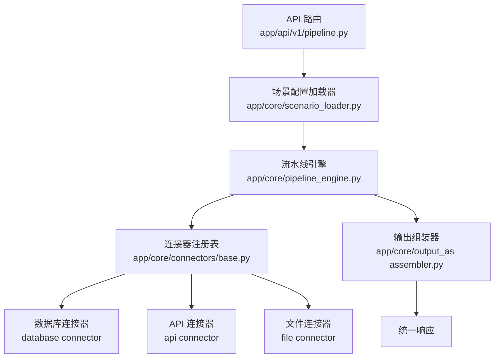
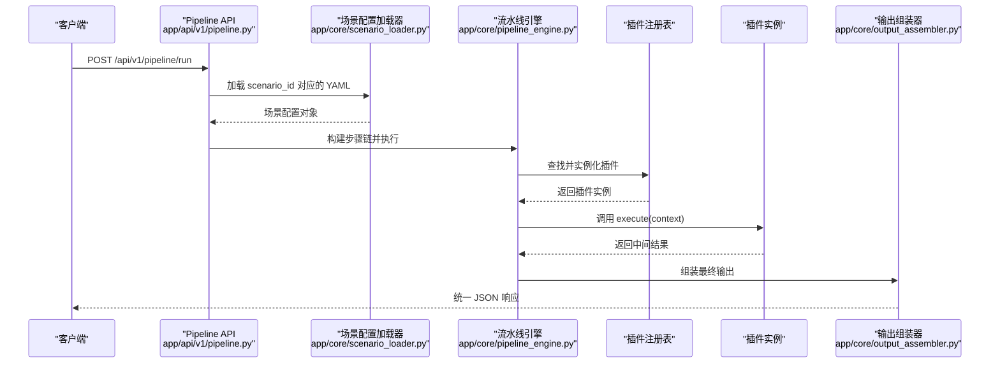
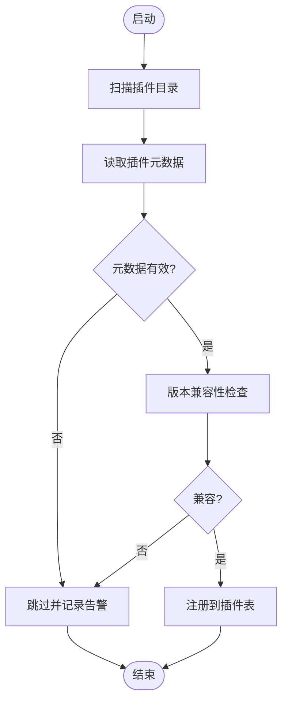
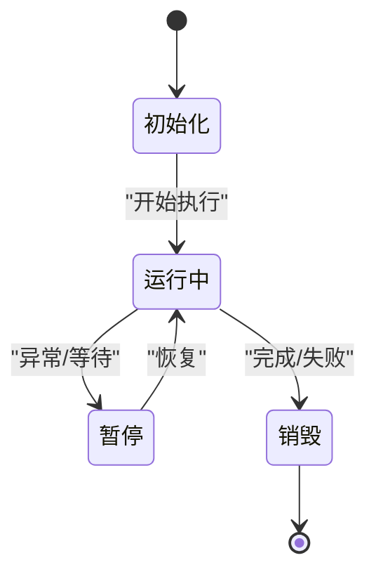
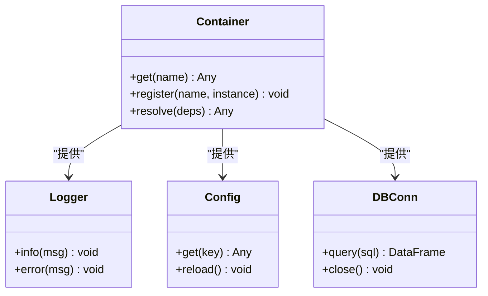
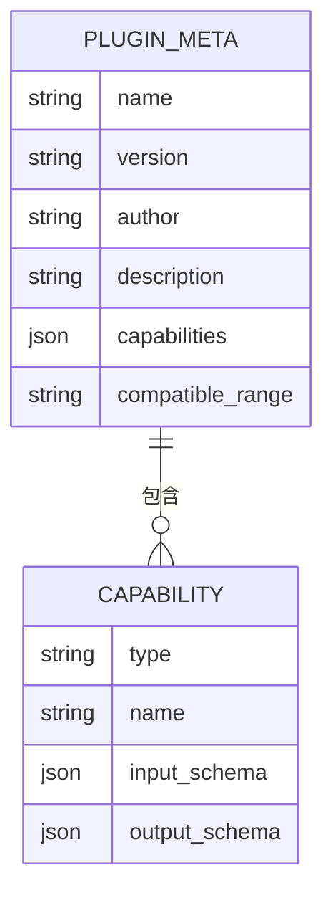
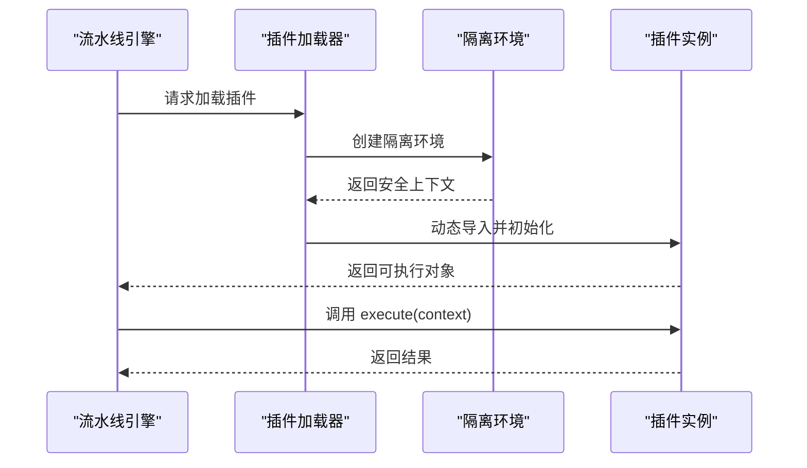
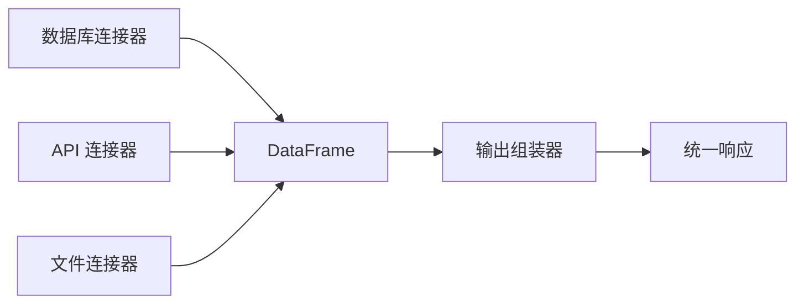
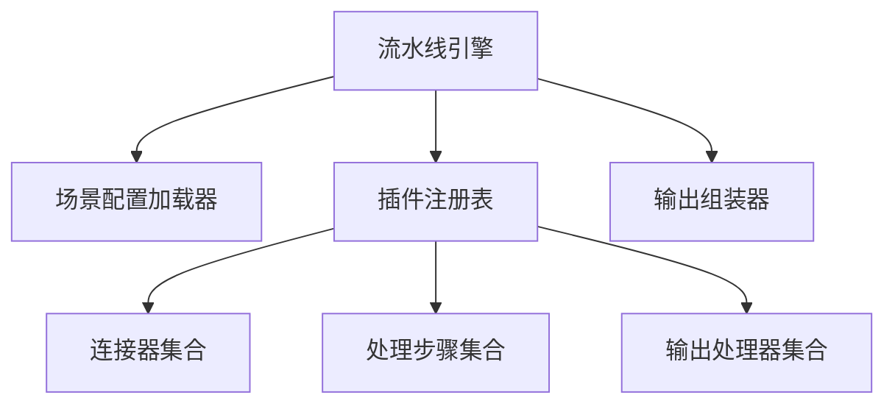

# 插件系统设计

<cite>
**本文引用的文件**
- [20260821100000_hiagent辅助Web服务_需求说明.md](file://docs/20260821100000_hiagent辅助Web服务_需求说明.md)
</cite>

## 目录
1. [引言](#引言)
2. [项目结构](#项目结构)
3. [核心组件](#核心组件)
4. [架构总览](#架构总览)
5. [详细组件分析](#详细组件分析)
6. [依赖关系分析](#依赖关系分析)
7. [性能与可观测性](#性能与可观测性)
8. [故障排查指南](#故障排查指南)
9. [结论](#结论)
10. [附录：插件开发示例与最佳实践](#附录插件开发示例与最佳实践)

## 引言
本设计文档围绕 hiagent 辅助 Web 服务的“插件化扩展”目标，提出一套可扩展、可配置、可隔离的插件系统方案。该方案以现有“场景驱动的流水线引擎”为基础，将数据连接器、处理步骤、输出组装等能力抽象为可插拔组件，通过统一的接口规范、元数据描述、版本兼容性检查与生命周期管理，实现“即插即用”的能力扩展。同时提供打包发布、安装管理与更新升级的最佳实践，确保在生产环境中的稳定性与可维护性。

## 项目结构
根据需求说明书，当前项目的关键新增目录与职责如下：
- app/core/pipeline_engine.py：流水线引擎，负责步骤顺序执行、上下文传递、错误处理与日志记录
- app/core/scenario_loader.py：场景配置加载器，负责 YAML 场景配置的解析与校验
- app/core/connectors/：数据连接器（base/database/api/file），采用注册表模式扩展
- app/core/output_assembler.py：输出组装器，统一生成 chart/table/report/file/summary
- app/scenarios/*.yaml：场景配置文件，描述 data_sources、pipeline、outputs
- app/api/v1/pipeline.py：Pipeline API 路由，暴露 /api/v1/pipeline/run 等入口

这些模块天然具备插件化的基础：连接器层已采用注册表模式；流水线引擎支持步骤链式编排；场景配置驱动行为；输出组装器统一封装结果。基于此，可将“连接器”“处理步骤”“输出类型”“中间件/钩子”等进一步抽象为插件单元，形成完整的插件生态。

图表来源
- [20260821100000_hiagent辅助Web服务_需求说明.md:33-68](file://docs/20260821100000_hiagent辅助Web服务_需求说明.md#L33-L68)
- [20260821100000_hiagent辅助Web服务_需求说明.md:106-115](file://docs/20260821100000_hiagent辅助Web服务_需求说明.md#L106-L115)

章节来源
- [20260821100000_hiagent辅助Web服务_需求说明.md:33-68](file://docs/20260821100000_hiagent辅助Web服务_需求说明.md#L33-L68)
- [20260821100000_hiagent辅助Web服务_需求说明.md:106-115](file://docs/20260821100000_hiagent辅助Web服务_需求说明.md#L106-L115)

## 核心组件
- 插件发现机制
  - 基于文件系统扫描与注册表模式，自动发现并注册连接器、处理步骤、输出处理器
  - 支持按命名空间或包路径组织插件，避免冲突
- 生命周期管理
  - 初始化阶段：读取插件元数据、校验版本兼容性、注入依赖
  - 运行阶段：按需加载、隔离执行、资源申请与释放
  - 销毁阶段：清理临时文件、关闭连接、释放内存
- 依赖注入容器
  - 提供全局容器，集中管理配置、日志、缓存、数据库连接、HTTP 客户端等共享资源
  - 插件通过声明式依赖获取所需服务，降低耦合度
- 插件接口规范
  - 元数据定义：名称、版本、作者、描述、能力清单、兼容范围
  - 能力声明：连接器类型、处理步骤签名、输入输出 schema
  - 版本兼容性检查：语义化版本比较，拒绝不兼容版本
- 加载与执行机制
  - 动态导入：安全地加载插件模块，限制危险操作
  - 隔离执行：在独立进程或沙箱中执行不可信代码（可选）
  - 资源管理：文件句柄、网络连接、临时目录的生命周期管控
- 打包发布与安装管理
  - 标准包格式（如 wheel/zip），包含元数据、能力清单、依赖声明
  - 安装器负责校验签名、安装到指定目录、更新热重载
  - 升级策略：灰度发布、回滚机制、增量更新

章节来源
- [20260821100000_hiagent辅助Web服务_需求说明.md:33-68](file://docs/20260821100000_hiagent辅助Web服务_需求说明.md#L33-L68)
- [20260821100000_hiagent辅助Web服务_需求说明.md:106-115](file://docs/20260821100000_hiagent辅助Web服务_需求说明.md#L106-L115)

## 架构总览
下图展示了插件系统与现有流水线引擎的集成方式：API 路由接收请求后，由场景配置加载器解析 YAML，构建 Pipeline 步骤链；每个步骤可能调用一个或多个插件（连接器、处理步骤、输出处理器）。插件通过注册表被发现和实例化，依赖注入容器提供共享资源，确保插件之间的解耦与复用。

图表来源
- [20260821100000_hiagent辅助Web服务_需求说明.md:33-68](file://docs/20260821100000_hiagent辅助Web服务_需求说明.md#L33-L68)
- [20260821100000_hiagent辅助Web服务_需求说明.md:106-115](file://docs/20260821100000_hiagent辅助Web服务_需求说明.md#L106-L115)

## 详细组件分析

### 插件发现与注册
- 发现策略
  - 扫描指定目录下的插件包，读取元数据文件（如 plugin.json/yaml）
  - 按能力分类（connector/action/output）建立索引
- 注册流程
  - 校验元数据完整性与版本兼容性
  - 将插件能力写入注册表，供流水线引擎按需查找
- 冲突处理
  - 同名能力优先使用高版本或白名单版本
  - 冲突时记录告警并跳过不兼容插件

图表来源
- [20260821100000_hiagent辅助Web服务_需求说明.md:33-68](file://docs/20260821100000_hiagent辅助Web服务_需求说明.md#L33-L68)

### 生命周期管理
- 初始化
  - 读取配置、建立依赖注入容器、预加载必要资源
- 运行期
  - 按步骤调用插件，传递上下文（PipelineContext）
  - 每步记录日志与耗时，支持条件分支与错误处理（skip/abort）
- 销毁
  - 释放连接、清理临时文件、关闭外部资源

图表来源
- [20260821100000_hiagent辅助Web服务_需求说明.md:33-68](file://docs/20260821100000_hiagent辅助Web服务_需求说明.md#L33-L68)

### 依赖注入容器
- 职责
  - 统一管理配置、日志、缓存、数据库连接、HTTP 客户端等
  - 插件通过声明式依赖获取服务，避免硬编码耦合
- 设计要点
  - 单例模式保证全局一致性
  - 支持作用域划分（请求级、会话级、应用级）
  - 提供健康检查与监控指标

图表来源
- [20260821100000_hiagent辅助Web服务_需求说明.md:33-68](file://docs/20260821100000_hiagent辅助Web服务_需求说明.md#L33-L68)

### 插件接口规范
- 元数据定义
  - 名称、版本、作者、描述、能力清单、兼容范围
- 能力声明
  - 连接器类型（database/api/file）、处理步骤签名、输入输出 schema
- 版本兼容性检查
  - 语义化版本比较，拒绝不兼容版本
- 错误码与响应格式
  - 统一 JSON 响应（code/message/data/request_id）
  - 错误码分段：通用、数据处理、可视化、文件文档、API 编排、Pipeline 引擎

图表来源
- [20260821100000_hiagent辅助Web服务_需求说明.md:25-30](file://docs/20260821100000_hiagent辅助Web服务_需求说明.md#L25-L30)
- [20260821100000_hiagent辅助Web服务_需求说明.md:33-68](file://docs/20260821100000_hiagent辅助Web服务_需求说明.md#L33-L68)

### 加载与执行机制
- 动态导入
  - 安全加载插件模块，限制危险操作
  - 支持按需加载，减少启动时间
- 隔离执行
  - 可选进程/沙箱隔离，防止恶意插件影响主进程
- 资源管理
  - 文件句柄、网络连接、临时目录的生命周期管控
  - 超时与重试策略，提升鲁棒性

图表来源
- [20260821100000_hiagent辅助Web服务_需求说明.md:33-68](file://docs/20260821100000_hiagent辅助Web服务_需求说明.md#L33-L68)

### 连接器与输出组装器
- 连接器层
  - 数据库连接器：直连 MySQL/PostgreSQL/ClickHouse，返回统一 DataFrame
  - API 连接器：调用外部 REST API，支持鉴权模板与重试
  - 文件连接器：上传/下载/解析 CSV/Excel/JSON，自动编码检测与类型推断
- 输出组装器
  - 统一生成 chart/table/report/file/summary
  - 支持 HTML 报告、PDF/Word/Excel 生成、数据表格渲染

图表来源
- [20260821100000_hiagent辅助Web服务_需求说明.md:46-64](file://docs/20260821100000_hiagent辅助Web服务_需求说明.md#L46-L64)

章节来源
- [20260821100000_hiagent辅助Web服务_需求说明.md:46-64](file://docs/20260821100000_hiagent辅助Web服务_需求说明.md#L46-L64)
- [20260821100000_hiagent辅助Web服务_需求说明.md:73-94](file://docs/20260821100000_hiagent辅助Web服务_需求说明.md#L73-L94)

## 依赖关系分析
- 组件耦合
  - 流水线引擎依赖场景配置加载器与插件注册表
  - 插件注册表依赖连接器、处理步骤、输出处理器
  - 输出组装器依赖上游步骤的结果
- 外部依赖
  - FastAPI、pandas/numpy、DuckDB、matplotlib/plotly、WeasyPrint、httpx、Pydantic、PyYAML、SQLAlchemy、jsonpath-ng
- 潜在循环依赖
  - 通过注册表与接口抽象避免直接耦合
  - 依赖注入容器统一管理共享资源

图表来源
- [20260821100000_hiagent辅助Web服务_需求说明.md:33-68](file://docs/20260821100000_hiagent辅助Web服务_需求说明.md#L33-L68)
- [20260821100000_hiagent辅助Web服务_需求说明.md:106-115](file://docs/20260821100000_hiagent辅助Web服务_需求说明.md#L106-L115)

章节来源
- [20260821100000_hiagent辅助Web服务_需求说明.md:33-68](file://docs/20260821100000_hiagent辅助Web服务_需求说明.md#L33-L68)
- [20260821100000_hiagent辅助Web服务_需求说明.md:106-115](file://docs/20260821100000_hiagent辅助Web服务_需求说明.md#L106-L115)

## 性能与可观测性
- 性能目标
  - 简单接口 < 500ms，数据处理 < 3s，Pipeline 全流程 < 10s
- 优化建议
  - 连接器层使用连接池与缓存
  - 流水线步骤并行化（在保证顺序的前提下）
  - 输出组装器流式生成大文件
- 可观测性
  - 结构化日志含 scenario_id 与步骤耗时
  - 健康检查端点 /health
  - 场景列表端点 /api/v1/pipeline/scenarios

章节来源
- [20260821100000_hiagent辅助Web服务_需求说明.md:97-102](file://docs/20260821100000_hiagent辅助Web服务_需求说明.md#L97-L102)

## 故障排查指南
- 常见问题
  - 插件版本不兼容：检查元数据中的兼容范围与当前运行环境
  - 连接器连接失败：验证凭据与环境变量配置
  - 输出组装失败：确认上游步骤是否成功产出预期数据
- 定位方法
  - 查看结构化日志中的 scenario_id 与步骤耗时
  - 使用 /health 与健康检查指标判断服务状态
  - 通过 /api/v1/pipeline/scenarios 检查可用场景与插件状态

章节来源
- [20260821100000_hiagent辅助Web服务_需求说明.md:97-102](file://docs/20260821100000_hiagent辅助Web服务_需求说明.md#L97-L102)

## 结论
本插件系统以现有流水线引擎为核心，通过插件发现、生命周期管理、依赖注入容器与统一接口规范，实现了能力的可插拔与可配置。结合打包发布、安装管理与更新升级的最佳实践，能够在生产环境中稳定扩展 hiagent 的业务能力。未来可进一步引入沙箱隔离、插件市场与灰度发布，持续提升系统的灵活性与安全性。

## 附录：插件开发示例与最佳实践

### 功能插件（连接器）
- 目标：新增一种数据源接入方式（如新的数据库或 API）
- 步骤
  - 定义插件元数据与能力清单
  - 实现 BaseConnector 子类，提供统一 DataFrame 输出
  - 注册到连接器注册表
  - 编写单元测试与集成测试
- 最佳实践
  - 凭据从环境变量读取，不硬编码
  - 支持超时与重试，提升鲁棒性
  - 记录结构化日志与指标

### 工具插件（处理步骤）
- 目标：提供通用的数据处理能力（如清洗、统计、转换）
- 步骤
  - 定义输入/输出 schema
  - 实现 execute(context) 方法
  - 在场景 YAML 中引用该步骤
  - 进行性能基准测试
- 最佳实践
  - 无副作用，幂等执行
  - 支持 skip/abort 错误处理
  - 记录步骤耗时与结果摘要

### 业务插件（输出处理器）
- 目标：定制特定业务的输出格式（如行业报告模板）
- 步骤
  - 实现输出处理器，继承统一接口
  - 在场景 YAML 中配置 outputs 引用
  - 验证输出质量与兼容性
- 最佳实践
  - 模板与数据分离，便于维护
  - 支持多格式输出（HTML/PDF/Excel）
  - 提供预览与调试工具

### 打包发布、安装管理与更新升级
- 打包
  - 标准包格式（wheel/zip），包含元数据、能力清单、依赖声明
  - 签名校验，确保来源可信
- 安装
  - 安装器负责校验签名、安装到指定目录、热重载
  - 支持多版本并存与切换
- 升级
  - 灰度发布与回滚机制
  - 增量更新，减少停机时间
  - 升级前兼容性检查与备份

章节来源
- [20260821100000_hiagent辅助Web服务_需求说明.md:46-64](file://docs/20260821100000_hiagent辅助Web服务_需求说明.md#L46-L64)
- [20260821100000_hiagent辅助Web服务_需求说明.md:73-94](file://docs/20260821100000_hiagent辅助Web服务_需求说明.md#L73-L94)
- [20260821100000_hiagent辅助Web服务_需求说明.md:97-102](file://docs/20260821100000_hiagent辅助Web服务_需求说明.md#L97-L102)