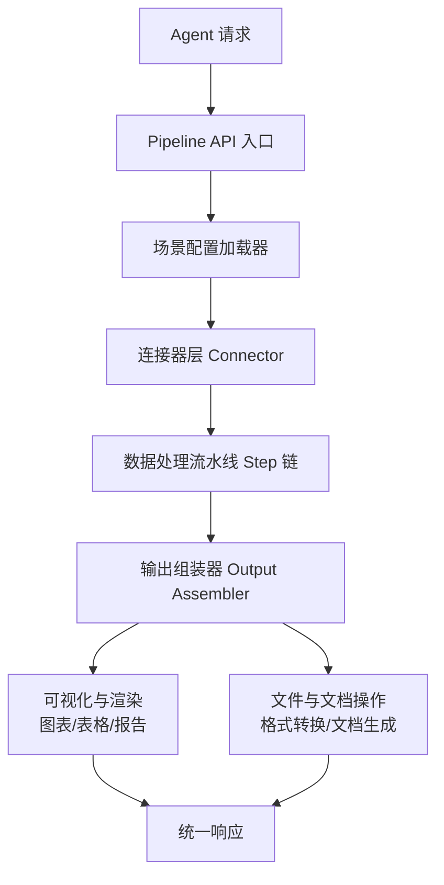
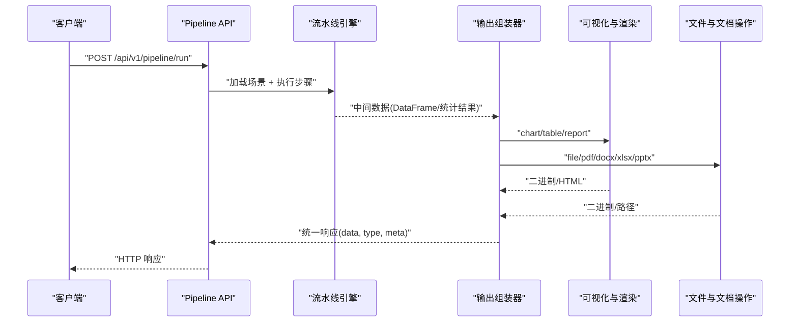
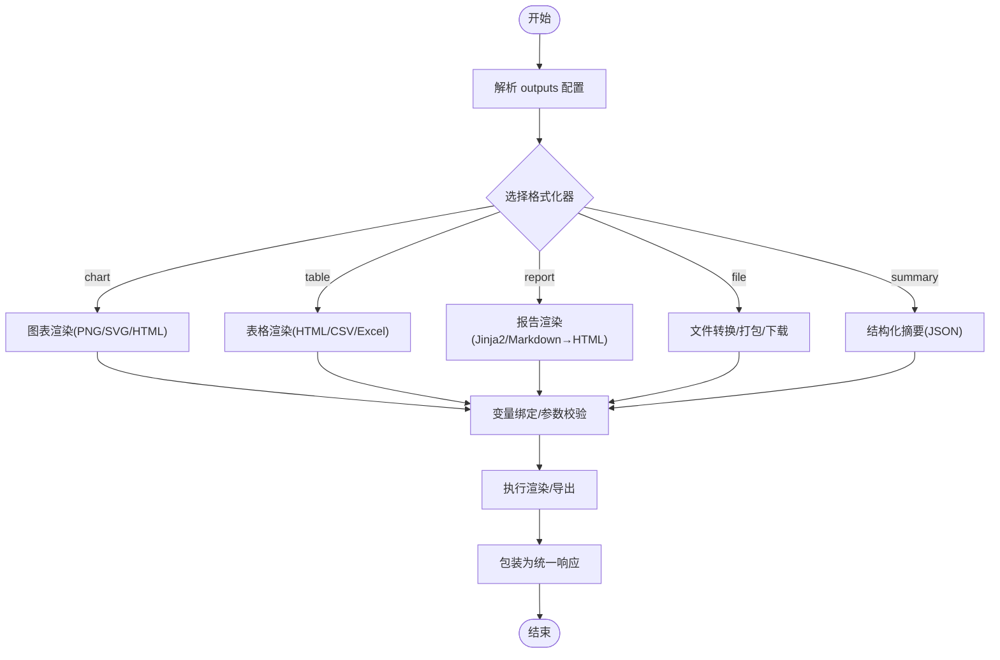
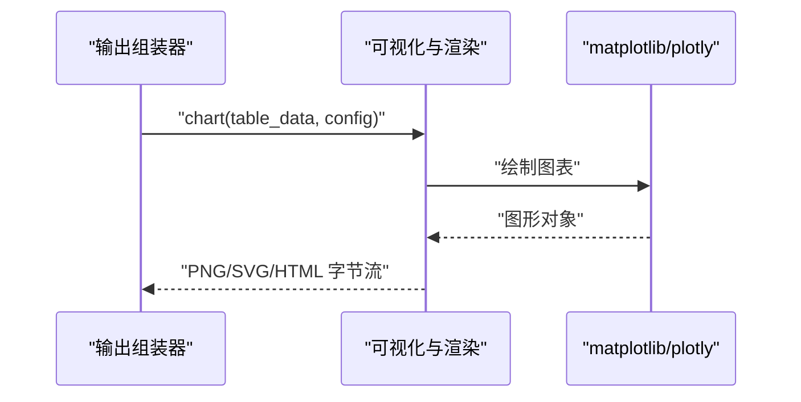
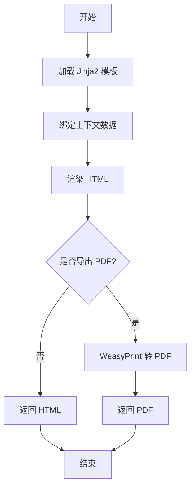
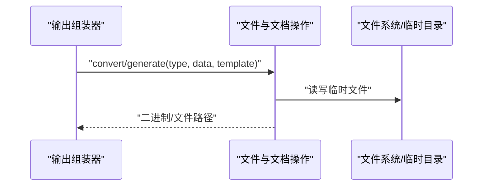
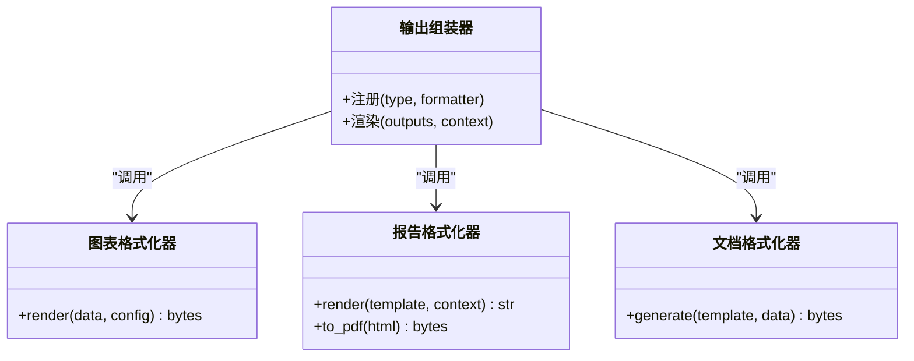
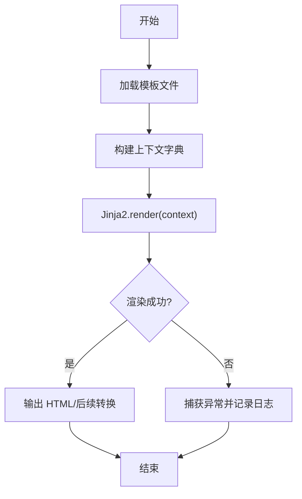
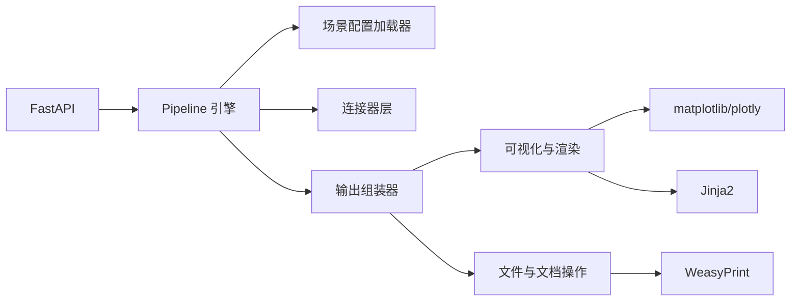

# 输出格式化器扩展

<cite>
**本文引用的文件**
- [需求说明文档](file://docs/20260821100000_hiagent辅助Web服务_需求说明.md)
</cite>

## 目录
1. [引言](#引言)
2. [项目结构](#项目结构)
3. [核心组件](#核心组件)
4. [架构总览](#架构总览)
5. [详细组件分析](#详细组件分析)
6. [依赖关系分析](#依赖关系分析)
7. [性能与缓存策略](#性能与缓存策略)
8. [故障排查指南](#故障排查指南)
9. [结论](#结论)
10. [附录：开发清单与示例指引](#附录开发清单与示例指引)

## 引言
本指南面向需要在 hiagent 辅助 Web 服务中扩展“输出格式化器”的开发者。围绕需求说明书中的可视化与渲染、报告渲染、文件与文档操作等能力，系统阐述输出格式化器的接口设计、渲染流程、模板引擎集成方式，以及新增图表类型、报告模板、文档格式生成器的实现方法。同时给出注册机制、缓存策略与性能优化建议，帮助以最小改动接入新输出类型。

## 项目结构
根据需求说明书，输出相关能力集中在以下位置：
- 可视化与渲染模块：负责图表生成（PNG/SVG/HTML）、报告渲染（Jinja2 HTML、Markdown→HTML）、数据表格渲染
- 文件与文档操作模块：负责格式转换（CSV/Excel/JSON/Markdown/HTML 互转）、文档生成（PDF/Word/Excel/PPT，支持模板）
- 流水线与输出组装：通过 Pipeline 引擎将数据处理结果交给输出组装器，统一产出 chart/table/report/file/summary 等输出类型

图示来源
- [需求说明文档:33-68](file://docs/20260821100000_hiagent辅助Web服务_需求说明.md#L33-L68)
- [需求说明文档:79-88](file://docs/20260821100000_hiagent辅助Web服务_需求说明.md#L79-L88)

章节来源
- [需求说明文档:33-68](file://docs/20260821100000_hiagent辅助Web服务_需求说明.md#L33-L68)
- [需求说明文档:79-88](file://docs/20260821100000_hiagent辅助Web服务_需求说明.md#L79-L88)

## 核心组件
- 输出组装器：负责根据 outputs 配置选择并调用具体格式化器，统一封装 chart/table/report/file/summary 五种输出类型
- 可视化与渲染：基于 matplotlib/plotly 生成图表，使用 Jinja2 渲染 HTML 报告，支持 Markdown→HTML
- 文件与文档操作：提供格式转换与文档生成（PDF/Word/Excel/PPT），可结合模板进行定制
- 连接器层：为上游步骤提供 DataFrame 等标准化数据，供输出格式化器消费
- 流水线引擎：按顺序执行步骤，传递中间数据，支持条件分支与步骤级错误处理

章节来源
- [需求说明文档:46-68](file://docs/20260821100000_hiagent辅助Web服务_需求说明.md#L46-L68)
- [需求说明文档:79-88](file://docs/20260821100000_hiagent辅助Web服务_需求说明.md#L79-L88)

## 架构总览
输出格式化器在整体架构中的职责是“将中间数据转换为最终产物”，包括图像、HTML、PDF、Word、Excel、PPT、Markdown、结构化摘要等。其关键特性：
- 多格式输出：PNG/SVG/HTML 图表；HTML/PDF/Word/Excel/PPT 文档；CSV/Excel/JSON/Markdown 文本
- 模板驱动：Jinja2 模板用于报告与文档内容编排
- 注册表模式：新增输出类型通过注册机制接入，无需修改核心流程
- 可观测性：步骤耗时与日志便于定位问题

图示来源
- [需求说明文档:33-68](file://docs/20260821100000_hiagent辅助Web服务_需求说明.md#L33-L68)
- [需求说明文档:79-88](file://docs/20260821100000_hiagent辅助Web服务_需求说明.md#L79-L88)

## 详细组件分析

### 输出组装器与格式化器接口
- 目标：定义统一的“输出类型 → 格式化器”映射，使新增格式只需注册即可生效
- 输入：outputs 配置（type、data_ref、params、template、format 等）
- 行为：解析配置、选择对应格式化器、绑定变量、渲染/导出、返回统一数据结构
- 扩展点：新增 type/format/template 时仅需注册，不侵入核心流程

图示来源
- [需求说明文档:46-68](file://docs/20260821100000_hiagent辅助Web服务_需求说明.md#L46-L68)
- [需求说明文档:79-88](file://docs/20260821100000_hiagent辅助Web服务_需求说明.md#L79-L88)

章节来源
- [需求说明文档:46-68](file://docs/20260821100000_hiagent辅助Web服务_需求说明.md#L46-L68)
- [需求说明文档:79-88](file://docs/20260821100000_hiagent辅助Web服务_需求说明.md#L79-L88)

### 可视化与渲染（图表/表格）
- 图表：支持柱状图、折线图、饼图、散点图、热力图、雷达图等，输出 PNG/SVG/HTML
- 表格：支持条件着色、排序，输出 HTML/CSV/Excel
- 技术栈：matplotlib/plotly 负责绘图；Jinja2 负责 HTML 报告；Markdown→HTML 用于富文本

图示来源
- [需求说明文档:79-82](file://docs/20260821100000_hiagent辅助Web服务_需求说明.md#L79-L82)

章节来源
- [需求说明文档:79-82](file://docs/20260821100000_hiagent辅助Web服务_需求说明.md#L79-L82)

### 报告渲染（Jinja2 模板与 Markdown）
- 模板：Jinja2 HTML 模板，支持变量绑定、条件渲染、循环、过滤器
- 数据源：来自 Pipeline 中间数据或聚合结果
- 流程：加载模板 → 绑定上下文 → 渲染 HTML → 可选转为 PDF（WeasyPrint）

图示来源
- [需求说明文档:79-82](file://docs/20260821100000_hiagent辅助Web服务_需求说明.md#L79-L82)

章节来源
- [需求说明文档:79-82](file://docs/20260821100000_hiagent辅助Web服务_需求说明.md#L79-L82)

### 文件与文档操作（格式转换与文档生成）
- 格式转换：CSV/Excel/JSON/Markdown/HTML 互转
- 文档生成：PDF/Word/Excel/PPT，支持模板
- 临时文件管理：自动清理与流式下载

图示来源
- [需求说明文档:84-88](file://docs/20260821100000_hiagent辅助Web服务_需求说明.md#L84-L88)

章节来源
- [需求说明文档:84-88](file://docs/20260821100000_hiagent辅助Web服务_需求说明.md#L84-L88)

### 新增输出类型的实现方法
- 图表类型：在可视化与渲染模块新增一种图表类型，注册到输出组装器映射表中，支持 PNG/SVG/HTML 输出
- 报告模板：编写 Jinja2 模板，定义变量与条件逻辑，通过输出组装器绑定上下文渲染
- 文档格式：在文件与文档操作模块新增导出器（如 PPTX），注册到输出组装器，支持模板填充

图示来源
- [需求说明文档:79-88](file://docs/20260821100000_hiagent辅助Web服务_需求说明.md#L79-L88)

章节来源
- [需求说明文档:79-88](file://docs/20260821100000_hiagent辅助Web服务_需求说明.md#L79-L88)

### 模板系统使用（Jinja2）
- 变量绑定：将 Pipeline 中间数据、聚合结果、元信息注入模板上下文
- 条件渲染：根据业务字段控制展示逻辑（如空值、阈值判断）
- 循环与过滤：遍历数据集、应用内置过滤器格式化数值/日期
- 安全建议：限制模板访问范围，避免任意代码执行

图示来源
- [需求说明文档:79-82](file://docs/20260821100000_hiagent辅助Web服务_需求说明.md#L79-L82)

章节来源
- [需求说明文档:79-82](file://docs/20260821100000_hiagent辅助Web服务_需求说明.md#L79-L82)

### 完整自定义示例指引
- 新的图表类型：在可视化与渲染模块新增一种图表渲染函数，并在输出组装器中注册 type→formatter 映射
- 报告模板：在模板目录创建 Jinja2 模板，定义变量占位符与条件块，通过输出组装器绑定上下文渲染
- 文档格式生成器：在文件与文档操作模块新增导出器（如 PPTX），支持模板填充与样式设置，注册到输出组装器

章节来源
- [需求说明文档:79-88](file://docs/20260821100000_hiagent辅助Web服务_需求说明.md#L79-L88)

## 依赖关系分析
- 外部库：FastAPI、pandas/numpy、DuckDB、matplotlib/plotly、WeasyPrint、httpx、Pydantic、PyYAML、SQLAlchemy、jsonpath-ng
- 内部模块：Pipeline 引擎、场景配置加载器、连接器层、输出组装器、可视化与渲染、文件与文档操作

图示来源
- [需求说明文档:19-22](file://docs/20260821100000_hiagent辅助Web服务_需求说明.md#L19-L22)
- [需求说明文档:33-68](file://docs/20260821100000_hiagent辅助Web服务_需求说明.md#L33-L68)
- [需求说明文档:79-88](file://docs/20260821100000_hiagent辅助Web服务_需求说明.md#L79-L88)

章节来源
- [需求说明文档:19-22](file://docs/20260821100000_hiagent辅助Web服务_需求说明.md#L19-L22)
- [需求说明文档:33-68](file://docs/20260821100000_hiagent辅助Web服务_需求说明.md#L33-L68)
- [需求说明文档:79-88](file://docs/20260821100000_hiagent辅助Web服务_需求说明.md#L79-L88)

## 性能与缓存策略
- 性能目标：简单接口 < 500ms，数据处理 < 3s，Pipeline 全流程 < 10s
- 缓存建议：
  - 图表缓存：对相同数据与配置的图表结果进行缓存（键：数据指纹+配置哈希）
  - 模板缓存：Jinja2 模板编译结果缓存，避免重复解析
  - 文档缓存：对大文档生成结果进行短期缓存（结合临时目录清理策略）
- 优化技巧：
  - 批量渲染：合并多次小图表为一次渲染
  - 异步化：I/O 密集任务（网络下载、PDF 转换）采用异步或线程池
  - 资源限制：限制并发度与内存占用，避免 OOM
  - 流式输出：大文件采用流式下载，减少峰值内存

章节来源
- [需求说明文档:97-102](file://docs/20260821100000_hiagent辅助Web服务_需求说明.md#L97-L102)

## 故障排查指南
- 常见问题：
  - 模板渲染失败：检查变量绑定是否正确、模板语法是否合法
  - 图表渲染失败：确认数据维度与图表类型匹配，依赖库版本兼容
  - 文档生成失败：检查模板与数据字段映射，确保 WeasyPrint 环境可用
  - 临时文件未清理：核对清理策略与定时任务
- 诊断手段：
  - 结构化日志：记录 scenario_id、步骤耗时、错误堆栈
  - 健康检查：暴露 /health 端点，监控服务状态
  - 场景列表：/api/v1/pipeline/scenarios 用于验证配置加载

章节来源
- [需求说明文档:97-102](file://docs/20260821100000_hiagent辅助Web服务_需求说明.md#L97-L102)

## 结论
输出格式化器以“输出组装器 + 注册表模式”为核心，结合可视化与渲染、文件与文档操作两大子系统，支撑多种输出类型与模板化报告。通过清晰的接口设计与缓存策略，可在最小改动下扩展新图表、新报告模板与新文档格式，满足多样化业务场景的输出需求。

## 附录：开发清单与示例指引
- 新增图表类型
  - 在可视化与渲染模块实现渲染函数
  - 在输出组装器注册 type→formatter 映射
  - 单元测试覆盖不同数据形态与输出格式
- 新增报告模板
  - 编写 Jinja2 模板，定义变量与条件逻辑
  - 在输出组装器中绑定上下文并渲染
  - 验证 HTML 与 PDF 输出一致性
- 新增文档格式
  - 在文件与文档操作模块实现导出器
  - 支持模板填充与样式设置
  - 注册到输出组装器并测试端到端流程

章节来源
- [需求说明文档:79-88](file://docs/20260821100000_hiagent辅助Web服务_需求说明.md#L79-L88)