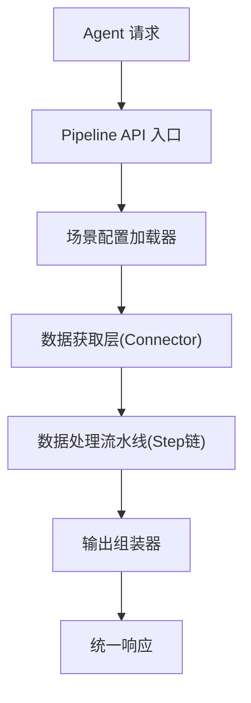
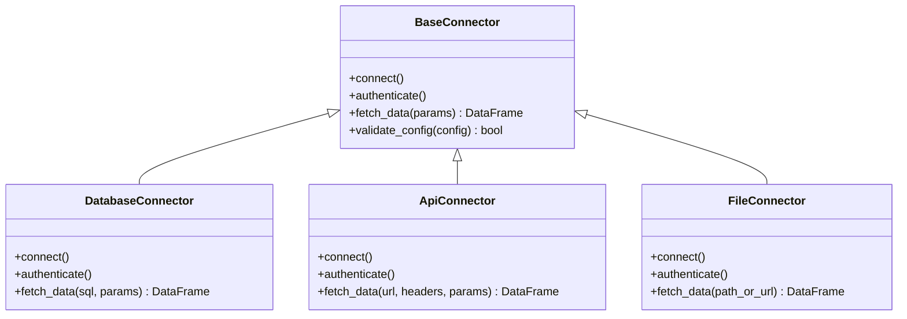
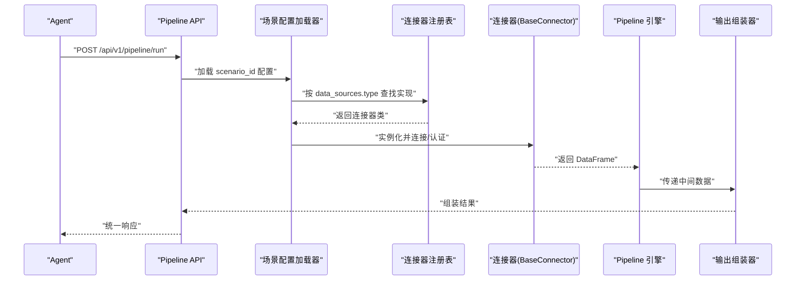

# 连接器扩展

<cite>
**本文引用的文件**
- [20260821100000_hiagent辅助Web服务_需求说明.md](file://docs\20260821100000_hiagent辅助Web服务_需求说明.md)
</cite>

## 目录
1. [简介](#简介)
2. [项目结构](#项目结构)
3. [核心组件](#核心组件)
4. [架构总览](#架构总览)
5. [详细组件分析](#详细组件分析)
6. [依赖关系分析](#依赖关系分析)
7. [性能考虑](#性能考虑)
8. [故障排查指南](#故障排查指南)
9. [结论](#结论)
10. [附录](#附录)

## 简介
本指南面向需要在系统中扩展数据连接器的开发者，围绕 BaseConnector 基类、连接器注册机制、不同连接器类型（数据库、API、文件）的实现规范，以及自定义连接器的开发流程与测试方法展开。文档基于仓库中的需求说明进行提炼，确保与实际设计保持一致。

## 项目结构
根据需求说明，系统采用“Pipeline + 原子 API”的双模式架构，连接器位于 app/core/connectors/ 目录下，包含 base/database/api/file 等模块。场景配置使用 YAML，通过场景加载器解析后交由流水线引擎执行，数据获取层统一由 Connector 提供 DataFrame 结果。

图表来源
- [20260821100000_hiagent辅助Web服务_需求说明.md:37-68](file://docs\20260821100000_hiagent辅助Web服务_需求说明.md#L37-L68)

章节来源
- [20260821100000_hiagent辅助Web服务_需求说明.md:106-115](file://docs\20260821100000_hiagent辅助Web服务_需求说明.md#L106-L115)

## 核心组件
- BaseConnector：所有连接器的抽象基类，定义统一的连接、认证、数据获取接口，返回统一 DataFrame。
- 连接器注册表：以注册表模式管理连接器类型与实现类的映射，支持新增连接器时最小改动。
- 场景配置加载器：解析 YAML 中的 data_sources、pipeline、outputs，驱动 Pipeline 引擎。
- Pipeline 引擎：顺序执行步骤，支持条件分支、步骤级错误处理（skip/abort），记录日志与耗时。
- 输出组装器：将中间数据渲染为 chart/table/report/file/summary 等输出。

章节来源
- [20260821100000_hiagent辅助Web服务_需求说明.md:40-68](file://docs\20260821100000_hiagent辅助Web服务_需求说明.md#L40-L68)
- [20260821100000_hiagent辅助Web服务_需求说明.md:106-115](file://docs\20260821100000_hiagent辅助Web服务_需求说明.md#L106-L115)

## 架构总览
连接器层作为数据获取的统一入口，屏蔽底层差异（数据库、API、文件），向上游暴露一致的 DataFrame 接口。注册表模式使得新增连接器只需实现基类并注册类型映射，无需修改调用方。

图表来源
- [20260821100000_hiagent辅助Web服务_需求说明.md:46-55](file://docs\20260821100000_hiagent辅助Web服务_需求说明.md#L46-L55)
- [20260821100000_hiagent辅助Web服务_需求说明.md:111-112](file://docs\20260821100000_hiagent辅助Web服务_需求说明.md#L111-L112)

## 详细组件分析

### BaseConnector 基类使用方法
- 连接配置：在 YAML 的 data_sources 中声明 connector 类型与连接参数；BaseConnector 负责解析与校验。
- 认证机制：通过 authenticate() 完成凭据校验与令牌获取；凭据从环境变量读取，避免硬编码。
- 数据获取流程：fetch_data() 接收 SQL/API 参数或路径，返回统一 DataFrame；上游 Pipeline 步骤消费该结果。

章节来源
- [20260821100000_hiagent辅助Web服务_需求说明.md:40-55](file://docs\20260821100000_hiagent辅助Web服务_需求说明.md#L40-L55)

### 连接器类型注册机制
- 连接器发现：启动时扫描 connectors/ 目录，自动发现具体实现类。
- 类型映射：维护一个“connector_type -> 实现类”的注册表，供场景加载器按 type 字段实例化。
- 配置验证：每个连接器实现 validate_config()，对必填字段、格式、权限等进行校验，失败则拒绝执行。

章节来源
- [20260821100000_hiagent辅助Web服务_需求说明.md:111-112](file://docs\20260821100000_hiagent辅助Web服务_需求说明.md#L111-L112)
- [20260821100000_hiagent辅助Web服务_需求说明.md:141-142](file://docs\20260821100000_hiagent辅助Web服务_需求说明.md#L141-L142)

### 数据库连接器实现规范
- 适用场景：直连 MySQL/PostgreSQL/ClickHouse 等数据库。
- 配置要点：host/port/db/user/password、SQL 语句、参数绑定、超时与重试策略。
- 数据获取：execute(sql, params) -> DataFrame；支持分页、流式读取大结果集。
- 安全与健壮性：SQL 注入防护、连接池、异常重试、查询超时控制。

章节来源
- [20260821100000_hiagent辅助Web服务_需求说明.md:46-55](file://docs\20260821100000_hiagent辅助Web服务_需求说明.md#L46-L55)

### API 连接器实现规范
- 适用场景：调用外部 REST API。
- 配置要点：base_url、headers、auth模板、速率限制、重试与退避策略。
- 数据获取：request(url, headers, params) -> DataFrame；支持批量并发、链式请求。
- 错误处理：HTTP 状态码映射、幂等重试、限流保护、超时与熔断。

章节来源
- [20260821100000_hiagent辅助Web服务_需求说明.md:46-55](file://docs\20260821100000_hiagent辅助Web服务_需求说明.md#L46-L55)

### 文件连接器实现规范
- 适用场景：本地上传、URL 下载、对象存储（后期扩展）。
- 配置要点：path/url、鉴权（如 S3）、临时目录管理、大小与格式限制。
- 数据获取：read(path_or_url) -> DataFrame；支持流式读取与分块处理。
- 安全与健壮性：沙箱隔离、路径白名单、MIME 校验、临时文件清理。

章节来源
- [20260821100000_hiagent辅助Web服务_需求说明.md:46-55](file://docs\20260821100000_hiagent辅助Web服务_需求说明.md#L46-L55)

### 自定义连接器开发示例
- 新的数据库类型：继承 BaseConnector，实现 connect/authenticate/fetch_data/validate_config；在注册表中登记新类型。
- 外部 API 集成：封装第三方 SDK，统一转换为 DataFrame；增加鉴权模板与重试策略。
- 对象存储连接器：实现 path/url 到流式读取的适配；加入桶名、密钥、区域等配置校验。

章节来源
- [20260821100000_hiagent辅助Web服务_需求说明.md:46-55](file://docs\20260821100000_hiagent辅助Web服务_需求说明.md#L46-L55)
- [20260821100000_hiagent辅助Web服务_需求说明.md:111-112](file://docs\20260821100000_hiagent辅助Web服务_需求说明.md#L111-L112)

### 连接器测试方法
- 单元测试：覆盖 validate_config、authenticate、fetch_data 的正常与异常路径。
- 集成测试：使用内存数据库或 Mock API 模拟真实交互；验证 DataFrame 结构与性能指标。
- 回归测试：针对常见边界（空结果、超大结果、网络抖动）进行稳定性验证。

章节来源
- [20260821100000_hiagent辅助Web服务_需求说明.md:97-102](file://docs\20260821100000_hiagent辅助Web服务_需求说明.md#L97-L102)

### 错误处理策略
- 步骤级错误处理：Pipeline 支持 skip/abort，保证局部失败不影响整体流程的可控性。
- 可观测性：结构化日志包含 scenario_id、步骤耗时、错误堆栈；便于定位问题。
- 安全：API Key 认证、SQL 注入防护、凭据不硬编码（环境变量）。

章节来源
- [20260821100000_hiagent辅助Web服务_需求说明.md:40-68](file://docs\20260821100000_hiagent辅助Web服务_需求说明.md#L40-L68)
- [20260821100000_hiagent辅助Web服务_需求说明.md:97-102](file://docs\20260821100000_hiagent辅助Web服务_需求说明.md#L97-L102)

### 性能优化建议
- 简单接口 < 500ms，数据处理 < 3s，Pipeline 全流程 < 10s。
- 使用连接池、分页/流式读取、缓存热点数据、并行请求（受限于下游限流）。
- 合理设置超时与重试，避免雪崩；监控关键指标（延迟、吞吐、错误率）。

章节来源
- [20260821100000_hiagent辅助Web服务_需求说明.md:97-102](file://docs\20260821100000_hiagent辅助Web服务_需求说明.md#L97-L102)

## 依赖关系分析
- 场景配置加载器依赖连接器注册表，按 data_sources.type 选择具体实现。
- Pipeline 引擎依赖连接器提供的 DataFrame，串联多个 Step 完成数据处理。
- 输出组装器依赖最终 DataFrame，生成多种输出类型。

图表来源
- [20260821100000_hiagent辅助Web服务_需求说明.md:37-68](file://docs\20260821100000_hiagent辅助Web服务_需求说明.md#L37-L68)
- [20260821100000_hiagent辅助Web服务_需求说明.md:106-115](file://docs\20260821100000_hiagent辅助Web服务_需求说明.md#L106-L115)

## 性能考虑
- 遵循非功能性需求目标：简单接口 < 500ms，数据处理 < 3s，Pipeline 全流程 < 10s。
- 推荐实践：连接复用、批处理、异步 I/O、结果集裁剪、缓存与索引。
- 监控与告警：记录步骤耗时、错误率、资源占用，及时扩容或优化。

章节来源
- [20260821100000_hiagent辅助Web服务_需求说明.md:97-102](file://docs\20260821100000_hiagent辅助Web服务_需求说明.md#L97-L102)

## 故障排查指南
- 常见问题：
  - 配置校验失败：检查 data_sources 必填字段与格式。
  - 认证失败：确认环境变量已正确设置且具备访问权限。
  - 数据为空或格式异常：检查 SQL/API 参数、返回结构映射。
  - 超时或限流：调整超时、重试次数与退避策略。
- 定位手段：
  - 查看结构化日志（scenario_id、步骤耗时、错误堆栈）。
  - 使用 /health 与健康检查接口确认服务状态。
  - 逐步缩小范围：先验证连接器单独行为，再回到 Pipeline 链路。

章节来源
- [20260821100000_hiagent辅助Web服务_需求说明.md:97-102](file://docs\20260821100000_hiagent辅助Web服务_需求说明.md#L97-L102)

## 结论
通过 BaseConnector 与注册表模式，系统实现了连接器的低耦合扩展能力。结合 YAML 场景配置与 Pipeline 引擎，可在最小改动下接入新的数据源。遵循统一的数据返回格式、错误处理与性能目标，可保障系统的可维护性与可扩展性。

## 附录
- 连接器类型参考：database、api、file_upload、file_url、file_s3（后期扩展）。
- 关键目录：app/core/connectors/（base/database/api/file）、app/core/pipeline_engine.py、app/core/scenario_loader.py、app/core/output_assembler.py。

章节来源
- [20260821100000_hiagent辅助Web服务_需求说明.md:46-55](file://docs\20260821100000_hiagent辅助Web服务_需求说明.md#L46-L55)
- [20260821100000_hiagent辅助Web服务_需求说明.md:106-115](file://docs\20260821100000_hiagent辅助Web服务_需求说明.md#L106-L115)