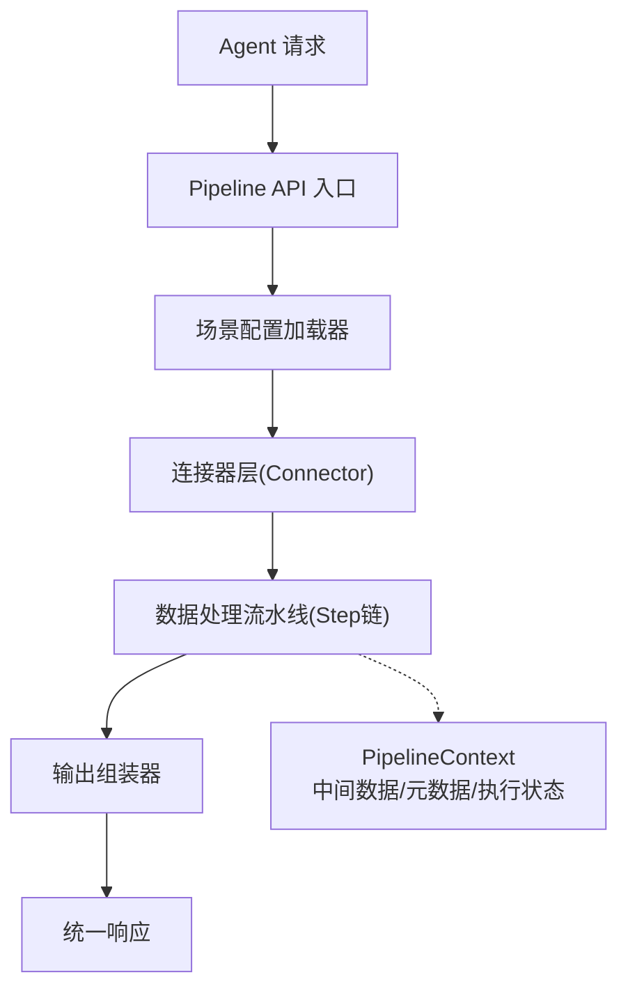
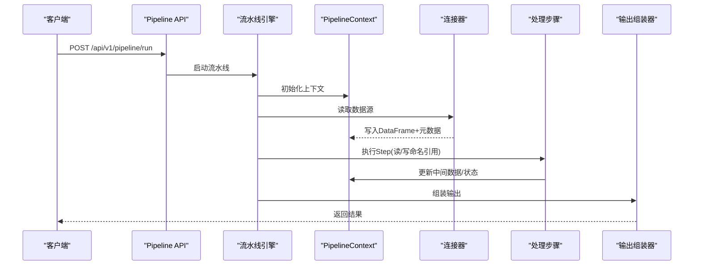
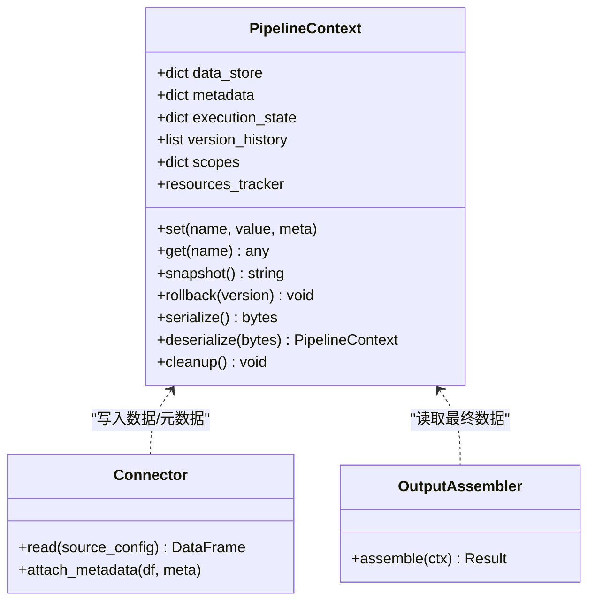
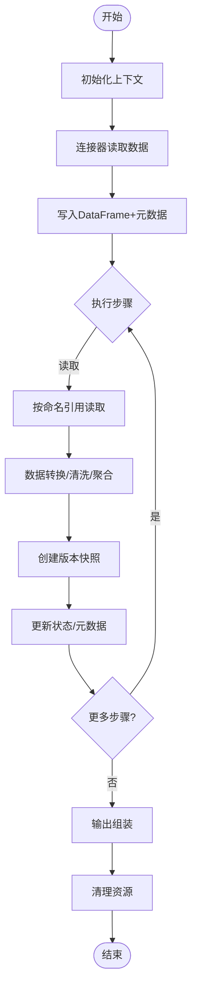
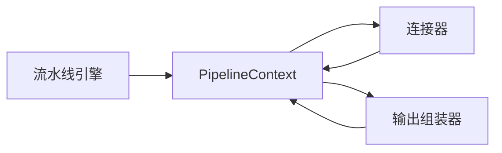

# 数据上下文管理

<cite>
**本文引用的文件**
- [需求说明文档](file://docs\20260821100000_hiagent辅助Web服务_需求说明.md)
</cite>

## 目录
1. [引言](#引言)
2. [项目结构](#项目结构)
3. [核心组件](#核心组件)
4. [架构总览](#架构总览)
5. [详细组件分析](#详细组件分析)
6. [依赖关系分析](#依赖关系分析)
7. [性能考量](#性能考量)
8. [故障排查指南](#故障排查指南)
9. [结论](#结论)
10. [附录：使用示例与最佳实践](#附录使用示例与最佳实践)

## 引言
本设计文档聚焦于 Pipeline 的数据上下文管理系统，围绕 PipelineContext 的设计理念、数据结构、命名引用机制、数据流转生命周期、版本控制与回滚、序列化/持久化/恢复等关键主题展开。该上下文是流水线步骤间传递中间数据、元数据和执行状态的核心载体，确保在复杂多步骤处理中具备可观测性、可恢复性与可扩展性。

## 项目结构
根据需求说明，系统采用“场景驱动的流水线引擎”架构，关键新增目录包括 pipeline_engine、scenario_loader、connectors、output_assembler、scenarios 以及 pipeline API 路由。PipelineContext 作为步骤间共享的上下文对象，贯穿从数据获取到输出组装的全流程。

图表来源
- [需求说明文档:33-67](file://docs\20260821100000_hiagent辅助Web服务_需求说明.md#L33-L67)

章节来源
- [需求说明文档:33-67](file://docs\20260821100000_hiagent辅助Web服务_需求说明.md#L33-L67)
- [需求说明文档:106-114](file://docs\20260821100000_hiagent辅助Web服务_需求说明.md#L106-L114)

## 核心组件
- PipelineContext：承载步骤间的中间数据、元数据与执行状态，提供命名引用访问、作用域隔离、版本快照、序列化与恢复能力。
- 流水线引擎（pipeline_engine）：编排 Step 顺序执行，注入/消费 PipelineContext，支持条件分支与步骤级错误处理（skip/abort）。
- 连接器层（connectors）：将外部数据源统一转换为 DataFrame，写入 Context 并附带元数据（如 schema、行数、耗时）。
- 输出组装器（output_assembler）：从 Context 读取最终数据与元信息，生成 chart/table/report/file/summary。

章节来源
- [需求说明文档:40-67](file://docs\20260821100000_hiagent辅助Web服务_需求说明.md#L40-L67)
- [需求说明文档:106-114](file://docs\20260821100000_hiagent辅助Web服务_需求说明.md#L106-L114)

## 架构总览
PipelineContext 在流水线中的角色如下：
- 创建：API 入口初始化 Context，绑定 scenario_id、request_id、环境变量与临时资源路径。
- 传递：每个 Step 通过命名引用读写 Context 中的数据项；连接器将原始数据以 DataFrame 形式写入 Context。
- 转换：Step 对数据进行清洗、聚合、透视等操作，更新 Context 并记录元数据（如列类型变更、过滤比例）。
- 销毁：流程结束或异常时清理临时文件、释放连接、回收内存。

图表来源
- [需求说明文档:33-67](file://docs\20260821100000_hiagent辅助Web服务_需求说明.md#L33-L67)

## 详细组件分析

### PipelineContext 设计理念与数据结构
- 设计理念
  - 单一职责：仅负责数据的存取、版本管理与元数据维护，不耦合业务逻辑。
  - 安全隔离：按作用域隔离变量，避免跨步骤污染。
  - 可观测性：记录每步执行状态、耗时、错误信息与数据血缘。
  - 可恢复性：支持快照与回滚，便于失败重试与调试。
- 数据结构要点
  - 中间数据存储：以命名空间为键的字典映射，支持 DataFrame、JSON、文件路径等类型。
  - 元数据：包含 schema、行数、列类型、数据来源、处理时间、统计摘要等。
  - 执行状态：当前步骤索引、是否跳过、是否中止、错误堆栈、日志指针。
  - 版本历史：每次写入前自动创建快照，支持按版本号回滚。
  - 作用域：支持全局与作用域两级命名空间，防止冲突。
  - 资源管理：跟踪临时文件、数据库连接、HTTP 会话等，统一释放。

章节来源
- [需求说明文档:40-67](file://docs\20260821100000_hiagent辅助Web服务_需求说明.md#L40-L67)

#### 类图（概念映射）

图表来源
- [需求说明文档:40-67](file://docs\20260821100000_hiagent辅助Web服务_需求说明.md#L40-L67)

### 命名引用的工作机制
- 变量命名规范
  - 采用“作用域.名称”形式，例如 “raw.df”、“filtered.df”、“agg.summary”。
  - 禁止覆盖保留名（如 _meta、_state），避免破坏上下文一致性。
  - 建议遵循小写字母、下划线分隔，长度限制与唯一性校验。
- 引用解析
  - 解析器优先在当前作用域查找，未命中则向上冒泡至父作用域或全局作用域。
  - 支持别名与模板替换（如 ${step_name.output}），在步骤开始前预解析。
- 作用域管理
  - 每个 Step 拥有独立作用域，结束时可选择合并或丢弃其局部变量。
  - 支持嵌套作用域（子任务/并行块），通过层级栈管理。
- 冲突与保护
  - 写入时检测命名冲突，必要时自动重命名或抛出明确错误。
  - 提供只读视图，防止下游误改上游数据。

章节来源
- [需求说明文档:40-67](file://docs\20260821100000_hiagent辅助Web服务_需求说明.md#L40-L67)

### 数据流转的生命周期
- 创建
  - API 入口初始化 Context，分配 request_id、scenario_id、临时目录。
  - 连接器读取数据源，生成 DataFrame 并附加元数据后写入 Context。
- 传递
  - Step 通过命名引用读取上游数据，进行筛选、聚合、透视、排序、去重等操作。
  - 每步更新执行状态与耗时，记录数据血缘（输入/输出引用）。
- 转换
  - 转换过程中保持不可变快照策略：每次写入前创建版本快照。
  - 大对象采用流式处理或分块计算，减少峰值内存占用。
- 销毁
  - 成功完成：输出组装器消费最终数据，清理临时资源。
  - 异常中断：根据错误类型决定 skip 或 abort，并触发回滚或保存部分结果。

图表来源
- [需求说明文档:40-67](file://docs\20260821100000_hiagent辅助Web服务_需求说明.md#L40-L67)

### 版本控制与回滚机制
- 版本快照
  - 每次写入前自动生成快照，记录时间戳、步骤索引、数据指纹（如行数、列哈希）。
  - 快照可持久化到本地临时目录或对象存储，支持按需加载。
- 回滚策略
  - 支持按版本号回滚到指定快照，恢复数据与元数据。
  - 结合步骤级错误处理（skip/abort），在失败时回滚到最近稳定点并重试。
- 一致性保障
  - 原子写入：先写新数据，再更新引用，最后提交快照。
  - 并发安全：同一上下文内串行写入，或通过锁机制保证一致性。

章节来源
- [需求说明文档:40-67](file://docs\20260821100000_hiagent辅助Web服务_需求说明.md#L40-L67)

### 序列化、持久化与恢复
- 序列化格式
  - 结构化元数据采用 JSON/YAML，大数据采用 Parquet/Arrow 等高效格式。
  - 二进制序列化用于快速恢复，文本格式用于可读性与审计。
- 持久化位置
  - 默认本地临时目录，支持扩展至 OSS/S3，按 scenario_id/request_id 组织。
  - 生命周期与请求绑定，超时自动清理。
- 恢复机制
  - 支持从快照恢复上下文，继续执行未完成步骤或重新运行。
  - 断点续跑：记录已执行步骤与最新快照，失败后可从中断处恢复。

章节来源
- [需求说明文档:40-67](file://docs\20260821100000_hiagent辅助Web服务_需求说明.md#L40-L67)

## 依赖关系分析
- 组件耦合
  - PipelineContext 被连接器与输出组装器共同依赖，形成松耦合的数据总线。
  - 流水线引擎通过命名引用解耦步骤实现，增强可测试性与复用性。
- 外部依赖
  - DuckDB 用于 SQL 查询与高性能聚合。
  - pandas/numpy 用于 DataFrame 操作。
  - PyYAML/Pydantic 用于配置与校验。
- 潜在循环依赖
  - 通过接口抽象与事件驱动避免循环依赖，确保模块边界清晰。

图表来源
- [需求说明文档:40-67](file://docs\20260821100000_hiagent辅助Web服务_需求说明.md#L40-L67)

章节来源
- [需求说明文档:40-67](file://docs\20260821100000_hiagent辅助Web服务_需求说明.md#L40-L67)

## 性能考量
- 内存管理
  - 大数据集采用流式读取与分块处理，避免一次性加载导致 OOM。
  - 及时释放临时文件与连接，启用垃圾回收与内存池。
- 计算优化
  - 利用 DuckDB 进行 SQL 级过滤与聚合，减少 Python 层开销。
  - 缓存中间结果，避免重复计算。
- 吞吐与延迟
  - 简单接口 < 500ms，数据处理 < 3s，全流程 < 10s（依据非功能性需求）。
  - 异步 I/O 与批处理提升吞吐，合理设置超时与重试。

章节来源
- [需求说明文档:97-102](file://docs\20260821100000_hiagent辅助Web服务_需求说明.md#L97-L102)

## 故障排查指南
- 常见问题
  - 命名冲突：检查变量命名规范与作用域隔离，避免覆盖保留名。
  - 数据缺失：确认连接器正确写入 DataFrame 与元数据，检查引用解析顺序。
  - 内存溢出：启用流式处理与分块计算，监控峰值内存。
  - 版本不一致：验证快照创建时机与回滚策略，确保原子写入。
- 诊断手段
  - 结构化日志：记录 scenario_id、步骤耗时、错误堆栈与数据血缘。
  - 健康检查：/health 暴露服务状态，/api/v1/pipeline/scenarios 列出可用场景。
  - 快照审计：查看版本历史与数据指纹，定位问题步骤。

章节来源
- [需求说明文档:97-102](file://docs\20260821100000_hiagent辅助Web服务_需求说明.md#L97-L102)

## 结论
PipelineContext 作为数据上下文管理的核心，提供了统一的中间数据、元数据与执行状态管理能力。通过命名引用、作用域隔离、版本快照与序列化恢复，确保了流水线在执行过程中的安全性、可观测性与可恢复性。结合连接器与输出组装器的协作，实现了从数据获取到结果输出的完整闭环。

## 附录：使用示例与最佳实践
- 在不同步骤间安全有效地传递和共享数据
  - 使用命名引用约定：如 “raw.df”、“filtered.df”、“agg.summary”，并通过作用域隔离避免冲突。
  - 在连接器阶段写入 DataFrame 与元数据，后续步骤通过引用读取并进行转换。
  - 输出组装器从 Context 读取最终数据，生成所需输出类型。
- 处理大数据量的内存管理问题
  - 采用流式读取与分块处理，避免一次性加载大表。
  - 及时释放临时文件与连接，启用垃圾回收与内存池。
  - 利用 DuckDB 进行 SQL 级过滤与聚合，降低内存压力。
- 版本控制与回滚
  - 每次写入前创建快照，记录数据指纹与时间戳。
  - 失败时回滚到最近稳定点，结合 skip/abort 策略进行重试。
- 序列化与持久化
  - 结构化元数据使用 JSON/YAML，大数据使用 Parquet/Arrow。
  - 默认本地临时目录，支持扩展至对象存储，按 scenario_id/request_id 组织。
  - 支持断点续跑，从快照恢复上下文继续执行。

章节来源
- [需求说明文档:40-67](file://docs\20260821100000_hiagent辅助Web服务_需求说明.md#L40-L67)
- [需求说明文档:97-102](file://docs\20260821100000_hiagent辅助Web服务_需求说明.md#L97-L102)