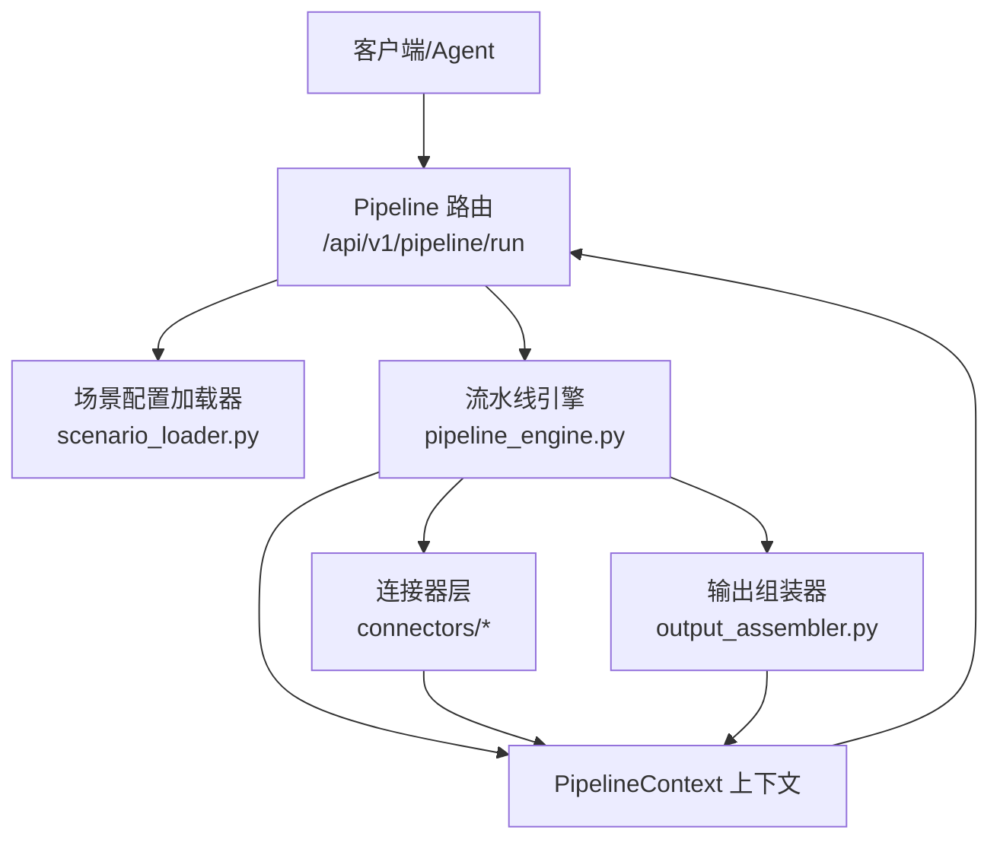
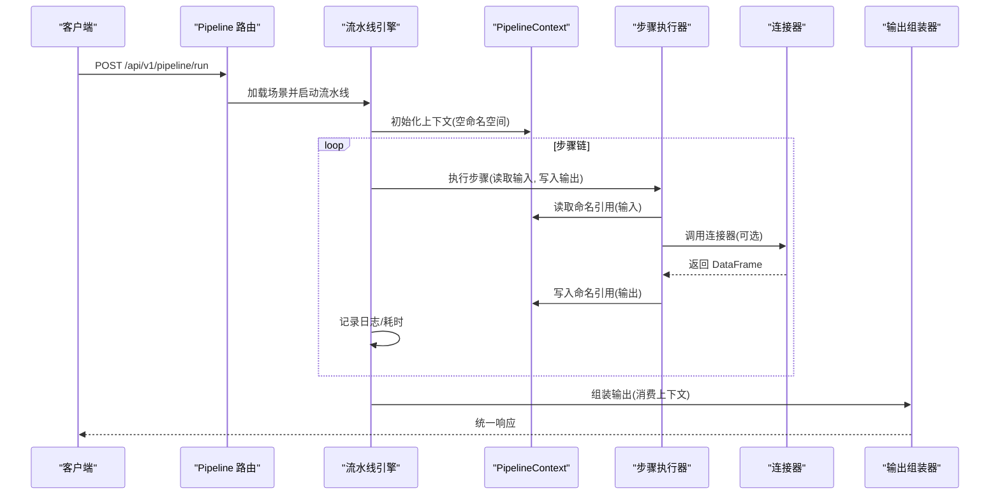
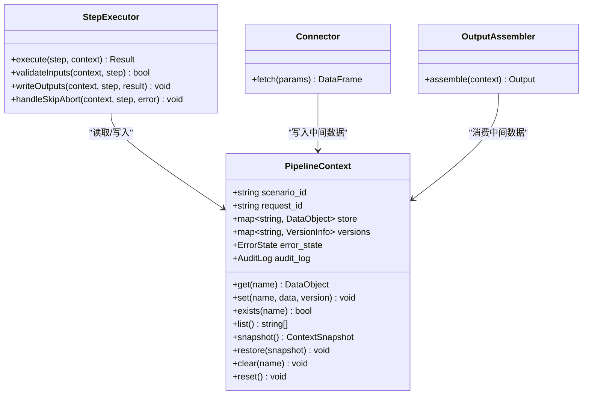
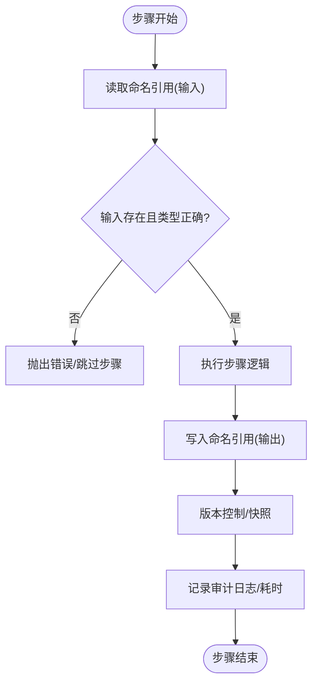
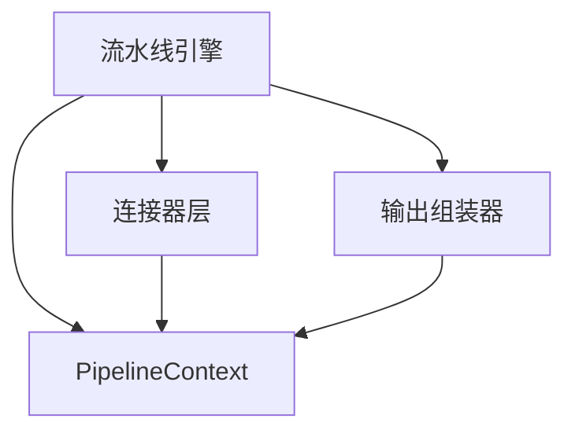

# PipelineContext 上下文对象

<cite>
**本文引用的文件**
- [需求说明文档](file://docs\20260821100000_hiagent辅助Web服务_需求说明.md)
</cite>

## 目录
1. [简介](#简介)
2. [项目结构](#项目结构)
3. [核心组件](#核心组件)
4. [架构总览](#架构总览)
5. [详细组件分析](#详细组件分析)
6. [依赖关系分析](#依赖关系分析)
7. [性能考量](#性能考量)
8. [故障排查指南](#故障排查指南)
9. [结论](#结论)
10. [附录](#附录)

## 简介
本设计文档围绕流水线执行过程中的“PipelineContext 上下文对象”展开，聚焦以下目标：
- 解释上下文在步骤间的数据传递机制，尤其是命名引用系统如何在工作流步骤之间传递中间数据。
- 详细说明上下文对象的属性设计：数据存储结构、生命周期管理、错误状态跟踪。
- 描述上下文与步骤执行器的交互方式：数据读取、写入、共享机制。
- 提供接口定义与使用模式的说明性示例（以路径引用代替具体代码），涵盖跨步骤安全传递、版本控制、隔离与复用策略。

该设计基于需求说明书中的流水线引擎与场景配置模型，确保上下文对象既能支撑顺序执行的步骤链，也能满足条件分支、错误处理与可观测性等非功能性要求。

## 项目结构
根据需求说明，项目采用“场景驱动 + 流水线引擎”的架构，关键新增目录包括：
- 流水线引擎：app/core/pipeline_engine.py
- 场景配置加载器：app/core/scenario_loader.py
- 数据连接器：app/core/connectors/（base/database/api/file）
- 输出组装器：app/core/output_assembler.py
- 场景配置：app/scenarios/*.yaml
- Pipeline 路由：app/api/v1/pipeline.py

这些模块共同协作，通过 PipelineContext 在步骤间传递中间数据，实现从数据获取、处理到输出的端到端流程。

图表来源
- [需求说明文档:40-67](file://docs\20260821100000_hiagent辅助Web服务_需求说明.md#L40-L67)
- [需求说明文档:106-114](file://docs\20260821100000_hiagent辅助Web服务_需求说明.md#L106-L114)

章节来源
- [需求说明文档:40-67](file://docs\20260821100000_hiagent辅助Web服务_需求说明.md#L40-L67)
- [需求说明文档:106-114](file://docs\20260821100000_hiagent辅助Web服务_需求说明.md#L106-L114)

## 核心组件
- PipelineContext 上下文对象：承载步骤间的中间数据、元信息、错误状态与审计日志，提供命名引用访问能力。
- 流水线引擎：负责解析 YAML 场景配置，调度步骤执行，维护上下文生命周期，处理条件分支与错误策略。
- 连接器层：统一返回 DataFrame，将外部数据源接入流水线，并将结果写入上下文。
- 输出组装器：消费上下文中的数据，生成 chart/table/report/file/summary 等输出。

章节来源
- [需求说明文档:40-67](file://docs\20260821100000_hiagent辅助Web服务_需求说明.md#L40-L67)
- [需求说明文档:106-114](file://docs\20260821100000_hiagent辅助Web服务_需求说明.md#L106-L114)

## 架构总览
流水线执行的核心是“步骤顺序执行 + 命名引用传递中间数据”。PipelineContext 作为唯一的数据总线，保证步骤之间的解耦与可测试性。

图表来源
- [需求说明文档:40-67](file://docs\20260821100000_hiagent辅助Web服务_需求说明.md#L40-L67)
- [需求说明文档:106-114](file://docs\20260821100000_hiagent辅助Web服务_需求说明.md#L106-L114)

## 详细组件分析

### PipelineContext 上下文对象设计
- 职责
  - 存储步骤间中间数据：以命名引用为键，值为 DataFrame 或其他结构化数据。
  - 管理生命周期：随流水线实例创建与销毁，支持并发隔离。
  - 错误状态跟踪：记录步骤级错误、跳过/中止标志、异常堆栈摘要。
  - 审计与可观测性：记录每步的输入/输出快照、耗时、状态码。
- 数据结构
  - 命名空间映射：名称 -> 数据对象（DataFrame/字典/列表/文件路径等）。
  - 版本控制：每个命名引用附带版本号或时间戳，支持回滚与增量更新。
  - 元信息：scenario_id、request_id、步骤索引、开始/结束时间、状态码。
  - 错误状态：当前是否 abort/skip、最近错误消息、重试次数。
- 访问模式
  - 读取：get(name)、list()、exists(name)、version(name)。
  - 写入：set(name, data, version)、overwrite(name, data)、append(name, data)。
  - 共享：只读视图（readonly）、作用域隔离（step_scope）。
  - 清理：clear(name)、reset()、snapshot()/restore()。
- 安全性与隔离
  - 线程/进程隔离：每次流水线运行拥有独立上下文实例。
  - 权限控制：步骤仅能访问声明式 input 命名引用；写操作需显式声明 output。
  - 大小限制：对大数据集进行分块/流式处理，避免内存溢出。
- 与步骤执行器的交互
  - 步骤执行前：注入上下文，校验输入是否存在且类型正确。
  - 步骤执行中：允许读取输入、写入输出、追加审计日志。
  - 步骤执行后：提交变更（commit），记录耗时与状态，处理 skip/abort。

图表来源
- [需求说明文档:40-67](file://docs\20260821100000_hiagent辅助Web服务_需求说明.md#L40-L67)
- [需求说明文档:106-114](file://docs\20260821100000_hiagent辅助Web服务_需求说明.md#L106-L114)

章节来源
- [需求说明文档:40-67](file://docs\20260821100000_hiagent辅助Web服务_需求说明.md#L40-L67)
- [需求说明文档:106-114](file://docs\20260821100000_hiagent辅助Web服务_需求说明.md#L106-L114)

### 命名引用系统与数据传递机制
- 命名引用规则
  - 输入：步骤声明 required_inputs 列表，执行时从上下文按名读取。
  - 输出：步骤声明 outputs 列表，执行后将结果写入上下文对应名称。
  - 共享：多个步骤可共享同一命名引用（只读视图），避免意外覆盖。
- 版本控制
  - 每次 set 操作递增版本号；支持 snapshot/restore 实现回滚。
  - 冲突检测：当多步骤同时写入同名数据时，基于版本策略合并或拒绝。
- 隔离与复用
  - 作用域隔离：step_scope 限定命名引用可见范围，防止跨步骤污染。
  - 复用策略：大对象（如 DataFrame）采用引用传递，减少拷贝开销。
- 安全传递
  - 白名单校验：仅允许步骤访问其声明的输入/输出名称。
  - 敏感字段脱敏：在审计日志中对敏感信息进行掩码处理。

图表来源
- [需求说明文档:40-67](file://docs\20260821100000_hiagent辅助Web服务_需求说明.md#L40-L67)

### 生命周期管理与错误状态跟踪
- 生命周期
  - 创建：流水线启动时初始化上下文，清空命名空间。
  - 运行：步骤执行期间读写上下文，记录审计日志。
  - 结束：流水线完成或失败时，释放资源、清理临时文件。
- 错误状态
  - 步骤级错误：记录错误消息、堆栈摘要、重试次数。
  - 全局错误：abort 标志阻止后续步骤执行；skip 标志跳过当前步骤。
  - 恢复策略：支持 checkpoint 与回滚，提升容错能力。
- 可观测性
  - 结构化日志：包含 scenario_id、request_id、步骤索引、耗时、状态码。
  - 指标上报：CPU/内存占用、数据量统计、错误率。

章节来源
- [需求说明文档:40-67](file://docs\20260821100000_hiagent辅助Web服务_需求说明.md#L40-L67)
- [需求说明文档:97-102](file://docs\20260821100000_hiagent辅助Web服务_需求说明.md#L97-L102)

### 与步骤执行器的交互方式
- 数据读取
  - 步骤通过 get(name) 读取输入，若不存在则报错或跳过。
  - 支持批量读取 list() 与过滤 exists(name)。
- 数据写入
  - 步骤通过 set(name, data, version) 写入输出，支持 overwrite/append。
  - 写入前进行类型校验与大小限制检查。
- 共享机制
  - 提供 readonly 视图，允许多步骤只读共享数据。
  - 作用域隔离防止跨步骤污染。
- 错误处理
  - 步骤捕获异常并写入上下文错误状态，引擎根据策略决定 skip/abort。
  - 支持重试与降级策略。

章节来源
- [需求说明文档:40-67](file://docs\20260821100000_hiagent辅助Web服务_需求说明.md#L40-L67)

### 接口定义与使用模式（说明性示例）
以下为接口定义与使用模式的说明性示例，展示如何在不同步骤间安全地传递数据、处理版本控制、实现隔离与复用。注意：此处不直接展示代码内容，仅提供路径引用以便查阅实现细节。

- 接口定义参考
  - 上下文读取/写入：[上下文接口定义:40-67](file://docs\20260821100000_hiagent辅助Web服务_需求说明.md#L40-L67)
  - 步骤执行器交互：[步骤执行与上下文交互:40-67](file://docs\20260821100000_hiagent辅助Web服务_需求说明.md#L40-L67)
- 使用模式
  - 安全传递：步骤仅访问声明的输入/输出名称，避免越权访问。
  - 版本控制：每次写入递增版本，支持快照与回滚。
  - 隔离与复用：使用作用域隔离与只读视图，确保数据一致性。
  - 错误处理：步骤级错误记录与全局 abort/skip 策略。

章节来源
- [需求说明文档:40-67](file://docs\20260821100000_hiagent辅助Web服务_需求说明.md#L40-L67)

## 依赖关系分析
- 组件耦合
  - 流水线引擎强依赖上下文对象，用于数据传递与状态管理。
  - 连接器与输出组装器通过上下文间接耦合，降低直接依赖。
- 外部依赖
  - 数据源：数据库/API/文件等连接器。
  - 工具库：pandas/numpy/DuckDB/matplotlib/plotly/httpx/Pydantic/PyYAML/SQLAlchemy/jsonpath-ng。
- 潜在循环依赖
  - 通过上下文对象解耦步骤与连接器，避免循环依赖。
- 接口契约
  - 上下文提供稳定的读取/写入接口，确保步骤与执行器解耦。

图表来源
- [需求说明文档:40-67](file://docs\20260821100000_hiagent辅助Web服务_需求说明.md#L40-L67)
- [需求说明文档:106-114](file://docs\20260821100000_hiagent辅助Web服务_需求说明.md#L106-L114)

章节来源
- [需求说明文档:40-67](file://docs\20260821100000_hiagent辅助Web服务_需求说明.md#L40-L67)
- [需求说明文档:106-114](file://docs\20260821100000_hiagent辅助Web服务_需求说明.md#L106-L114)

## 性能考量
- 内存管理
  - 大对象引用传递，避免不必要的拷贝。
  - 及时清理临时数据，释放内存。
- 并发与隔离
  - 每次流水线运行独立上下文，确保线程/进程安全。
  - 作用域隔离防止数据竞争。
- I/O 优化
  - 连接器支持流式读取，减少内存峰值。
  - 输出组装器支持分页/分块渲染。
- 监控与调优
  - 记录步骤耗时与数据量，识别瓶颈。
  - 动态调整批大小与并行度。

## 故障排查指南
- 常见问题
  - 命名引用不存在：检查步骤输入声明与上下文写入逻辑。
  - 版本冲突：确认版本策略与快照回滚机制。
  - 内存溢出：监控数据大小，启用流式处理。
  - 错误传播：查看上下文错误状态与审计日志。
- 调试技巧
  - 启用详细日志，记录输入/输出快照。
  - 使用快照功能定位问题步骤。
  - 逐步执行步骤，缩小问题范围。

章节来源
- [需求说明文档:97-102](file://docs\20260821100000_hiagent辅助Web服务_需求说明.md#L97-L102)

## 结论
PipelineContext 作为流水线执行的核心数据总线，通过命名引用系统实现了步骤间的解耦与高效数据传递。其设计涵盖了数据存储结构、生命周期管理、错误状态跟踪以及与步骤执行器的交互机制，确保了系统的可扩展性、可观测性与容错能力。结合版本控制、隔离与复用策略，上下文对象能够有效支撑复杂业务场景的流水线编排。

## 附录
- 术语表
  - 命名引用：步骤间传递数据的键值对机制。
  - 快照：上下文状态的备份与恢复点。
  - 作用域：命名引用的可见范围限制。
- 参考链接
  - 流水线引擎：[流水线引擎:106-114](file://docs\20260821100000_hiagent辅助Web服务_需求说明.md#L106-L114)
  - 连接器层：[连接器层:46-55](file://docs\20260821100000_hiagent辅助Web服务_需求说明.md#L46-L55)
  - 输出组装器：[输出组装器:62-63](file://docs\20260821100000_hiagent辅助Web服务_需求说明.md#L62-L63)