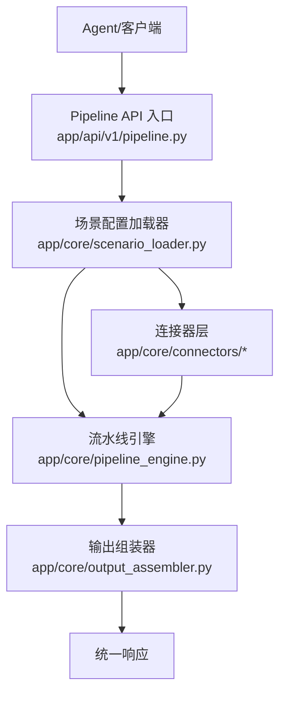
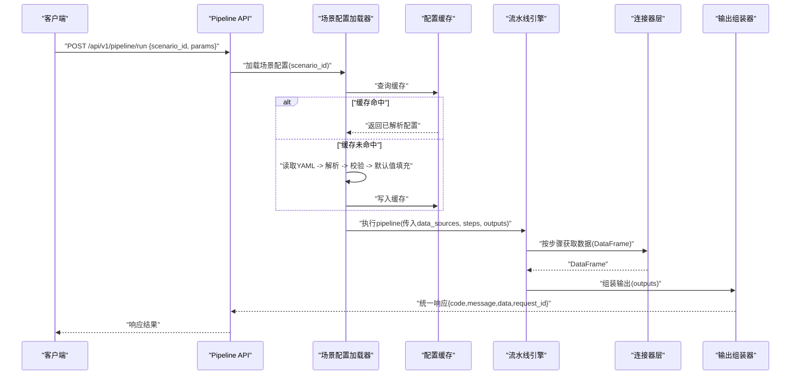
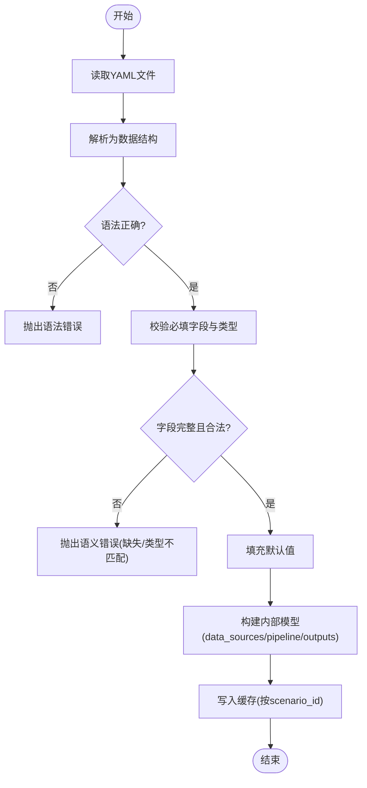
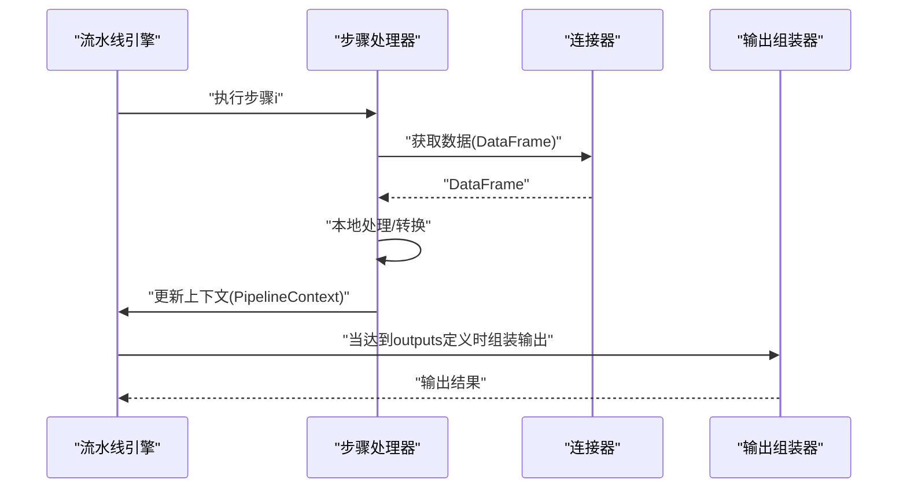
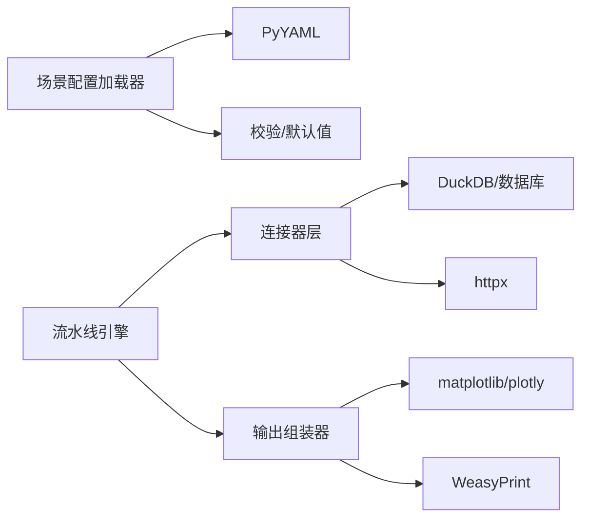
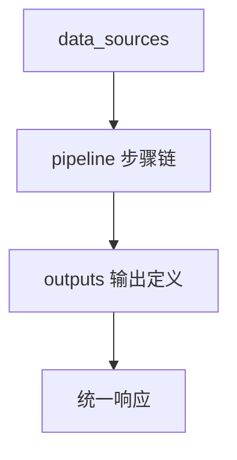

# 场景配置加载器

<cite>
**本文引用的文件**
- [需求说明文档](file://docs\20260821100000_hiagent辅助Web服务_需求说明.md)
</cite>

## 目录
1. [简介](#简介)
2. [项目结构](#项目结构)
3. [核心组件](#核心组件)
4. [架构总览](#架构总览)
5. [详细组件分析](#详细组件分析)
6. [依赖关系分析](#依赖关系分析)
7. [性能考量](#性能考量)
8. [故障排查指南](#故障排查指南)
9. [结论](#结论)
10. [附录：YAML 配置示例与规范](#附录yaml-配置示例与规范)

## 简介
本设计文档围绕“场景配置加载器（ScenarioLoader）”展开，目标是基于 YAML 的场景配置文件，提供可配置、可扩展、可观测的数据处理流水线。该加载器负责解析 YAML 配置、校验字段、填充默认值、构建数据源、组装 Pipeline 步骤与输出定义，并支持缓存与热重载，以满足多业务场景（竞品分析、机构行为分析、产品规模增量分析等）的通用编排需求。

## 项目结构
根据需求说明，系统采用“场景驱动 + 流水线引擎”的架构，关键新增目录与职责如下：
- app/core/scenario_loader.py：场景配置加载器，负责 YAML 解析、校验、默认值填充、缓存与热重载
- app/core/pipeline_engine.py：流水线引擎，按顺序执行步骤，传递中间数据，记录日志与耗时
- app/core/connectors/：连接器层，统一封装数据库、API、文件等数据源，返回 DataFrame
- app/core/output_assembler.py：输出组装器，生成 chart/table/report/file/summary 等输出
- app/scenarios/*.yaml：场景配置文件目录，每个场景一份 YAML
- app/api/v1/pipeline.py：Pipeline API 路由，暴露运行入口与场景列表

图表来源
- [需求说明文档:33-68](file://docs\20260821100000_hiagent辅助Web服务_需求说明.md#L33-L68)

章节来源
- [需求说明文档:33-68](file://docs\20260821100000_hiagent辅助Web服务_需求说明.md#L33-L68)
- [需求说明文档:106-114](file://docs\20260821100000_hiagent辅助Web服务_需求说明.md#L106-L114)

## 核心组件
- 场景配置加载器（ScenarioLoader）
  - 职责：读取 YAML、解析为结构化对象、字段校验、默认值填充、构建 data_sources/pipeline/outputs、缓存与热重载
- 流水线引擎（Pipeline Engine）
  - 职责：顺序执行步骤、条件分支、错误处理（skip/abort）、上下文传递、日志与耗时统计
- 连接器层（Connectors）
  - 职责：database/api/file_upload/file_url/file_s3 等数据源接入，统一返回 DataFrame，凭据从环境变量读取
- 输出组装器（Output Assembler）
  - 职责：根据 outputs 定义生成 chart/table/report/file/summary，其中 summary 专为 Agent 设计

章节来源
- [需求说明文档:40-68](file://docs\20260821100000_hiagent辅助Web服务_需求说明.md#L40-L68)
- [需求说明文档:106-114](file://docs\20260821100000_hiagent辅助Web服务_需求说明.md#L106-L114)

## 架构总览
场景配置加载器处于请求链路的核心位置，承担“配置即代码”的角色。其典型调用流程如下：

图表来源
- [需求说明文档:33-68](file://docs\20260821100000_hiagent辅助Web服务_需求说明.md#L33-L68)

章节来源
- [需求说明文档:33-68](file://docs\20260821100000_hiagent辅助Web服务_需求说明.md#L33-L68)

## 详细组件分析

### 场景配置加载器（ScenarioLoader）
- 解析过程
  - 读取 YAML 文件，解析为 Python 数据结构
  - 校验必填字段与类型约束（如 data_sources、pipeline、outputs）
  - 填充默认值（例如 connector 默认参数、步骤默认行为、输出默认格式）
  - 构建内部模型对象供后续使用
- 层次结构与字段规范
  - data_sources：定义数据源连接方式与参数映射，connector 类型包括 database/api/file_upload/file_url/file_s3
  - pipeline：定义处理步骤链，每步通过 action 调用原子能力，并以命名引用传递输入输出
  - outputs：定义最终输出类型（chart/table/report/file/summary），并引用上游数据源或中间变量
- 错误处理机制
  - 语法错误检测：YAML 解析失败时返回明确的语法错误信息
  - 语义验证：字段缺失、类型不匹配、引用不存在等语义问题需给出定位信息
  - 缺失字段处理：对必填字段进行强制校验，非必填字段提供合理默认值
- 缓存策略
  - 以 scenario_id 为键缓存已解析的配置对象，避免重复 IO 与解析开销
  - 支持按时间或事件触发刷新缓存
- 热重载机制
  - 监听场景配置文件变更事件（文件系统监控或定时扫描）
  - 检测到变更后重建配置对象并替换缓存，保证运行时生效

图表来源
- [需求说明文档:40-68](file://docs\20260821100000_hiagent辅助Web服务_需求说明.md#L40-L68)

章节来源
- [需求说明文档:40-68](file://docs\20260821100000_hiagent辅助Web服务_需求说明.md#L40-L68)

### 流水线引擎（Pipeline Engine）
- 执行模型
  - 步骤顺序执行，通过 PipelineContext 传递中间数据
  - 支持条件分支与步骤级错误处理（skip/abort）
  - 每步独立记录日志与耗时，便于可观测性
- 与加载器的协作
  - 接收由加载器构建的 pipeline 步骤定义
  - 依据步骤中的 action 调用原子能力（数据处理、可视化、文件操作等）

图表来源
- [需求说明文档:57-63](file://docs\20260821100000_hiagent辅助Web服务_需求说明.md#L57-L63)

章节来源
- [需求说明文档:57-63](file://docs\20260821100000_hiagent辅助Web服务_需求说明.md#L57-L63)

### 连接器层（Connectors）
- 支持的 connector 类型
  - database：直连数据库（MySQL/PostgreSQL/ClickHouse）
  - api：调用外部 REST API
  - file_upload：Agent 上传文件
  - file_url：从 URL 下载文件
  - file_s3：对象存储（后期扩展）
- 统一接口
  - 所有连接器返回统一的 DataFrame
  - 凭据从环境变量读取，避免硬编码
  - 注册表模式扩展，新增 connector 改动最小

章节来源
- [需求说明文档:46-55](file://docs\20260821100000_hiagent辅助Web服务_需求说明.md#L46-L55)

### 输出组装器（Output Assembler）
- 输出类型
  - chart：图表（PNG/SVG/HTML）
  - table：表格（含排序、条件着色）
  - report：报告（Jinja2 HTML 模板、Markdown 转 HTML）
  - file：文件（PDF/Word/Excel/PPT，支持模板）
  - summary：摘要（专为 Agent 设计）
- 与 pipeline 的协作
  - 根据 outputs 定义引用上游数据源或中间变量，完成最终输出

章节来源
- [需求说明文档:62-63](file://docs\20260821100000_hiagent辅助Web服务_需求说明.md#L62-L63)

## 依赖关系分析
- 模块耦合
  - ScenarioLoader 依赖 YAML 解析库与校验逻辑，产出内部模型
  - Pipeline Engine 依赖 Connector 与 Output Assembler，消费内部模型
  - API 路由依赖 ScenarioLoader 与 Pipeline Engine，组织请求与响应
- 外部依赖
  - PyYAML：YAML 解析
  - DuckDB：SQL 查询与高性能 DataFrame 操作
  - matplotlib/plotly：图表生成
  - WeasyPrint：PDF 渲染
  - httpx：HTTP 客户端（API 连接器）
  - Pydantic：数据校验（可选，用于严格字段校验）
  - jsonpath-ng：JSON 路径提取（可选）

图表来源
- [需求说明文档:19-22](file://docs\20260821100000_hiagent辅助Web服务_需求说明.md#L19-L22)
- [需求说明文档:46-63](file://docs\20260821100000_hiagent辅助Web服务_需求说明.md#L46-L63)

章节来源
- [需求说明文档:19-22](file://docs\20260821100000_hiagent辅助Web服务_需求说明.md#L19-L22)
- [需求说明文档:46-63](file://docs\20260821100000_hiagent辅助Web服务_需求说明.md#L46-L63)

## 性能考量
- 简单接口 < 500ms，数据处理 < 3s，Pipeline 全流程 < 10s
- 配置缓存减少重复解析与 IO 开销
- 连接器返回统一 DataFrame，利于下游复用与批处理
- 步骤级日志与耗时统计，便于瓶颈定位与优化

章节来源
- [需求说明文档:97-102](file://docs\20260821100000_hiagent辅助Web服务_需求说明.md#L97-L102)

## 故障排查指南
- 语法错误检测
  - YAML 解析失败时，应返回清晰的语法错误信息与行号定位
- 语义验证
  - 必填字段缺失、类型不匹配、引用不存在等，需给出具体字段与期望类型
- 缺失字段处理
  - 对必填字段进行强制校验；非必填字段提供默认值，确保流程可继续
- 可观测性
  - 结构化日志包含 scenario_id、步骤耗时，便于问题追踪
  - 提供健康检查与场景列表接口，便于运维监控

章节来源
- [需求说明文档:97-102](file://docs\20260821100000_hiagent辅助Web服务_需求说明.md#L97-L102)

## 结论
场景配置加载器通过 YAML 驱动的方式，将复杂的多业务场景抽象为可配置、可维护、可扩展的流水线。配合连接器层与输出组装器，实现了数据获取、处理、可视化的全链路编排。通过缓存与热重载机制，系统在运行时具备高可用与快速迭代能力。

## 附录：YAML 配置示例与规范
以下为不同业务场景的 YAML 配置示例与规范说明，展示 data_sources、pipeline、outputs 的写法。注意：此处为概念性示例，实际实现以仓库为准。

- 数据源配置（data_sources）
  - connector 类型：database/api/file_upload/file_url/file_s3
  - 连接配置：凭据从环境变量读取，避免硬编码
  - SQL/API 参数：支持 SQL 语句、URL、请求头、查询参数等
  - 请求参数映射：将上游输入映射到连接器参数

- 处理步骤定义（pipeline）
  - 步骤顺序执行，通过命名引用传递中间数据（PipelineContext）
  - 每步调用原子能力（action），支持条件分支与错误处理（skip/abort）
  - 每步独立记录日志与耗时

- 输出格式设置（outputs）
  - 类型：chart/table/report/file/summary
  - 引用：可引用 data_sources 或 pipeline 中间变量
  - 格式：图表 PNG/SVG/HTML，报告 PDF/HTML，文件 Excel/Word/PPT，摘要 JSON

图表来源
- [需求说明文档:40-68](file://docs\20260821100000_hiagent辅助Web服务_需求说明.md#L40-L68)

章节来源
- [需求说明文档:40-68](file://docs\20260821100000_hiagent辅助Web服务_需求说明.md#L40-L68)