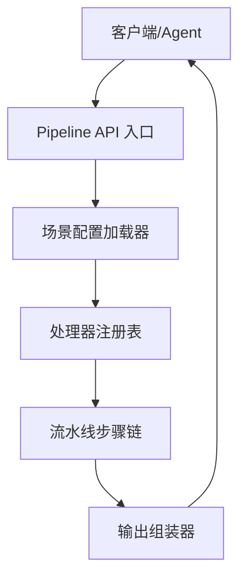
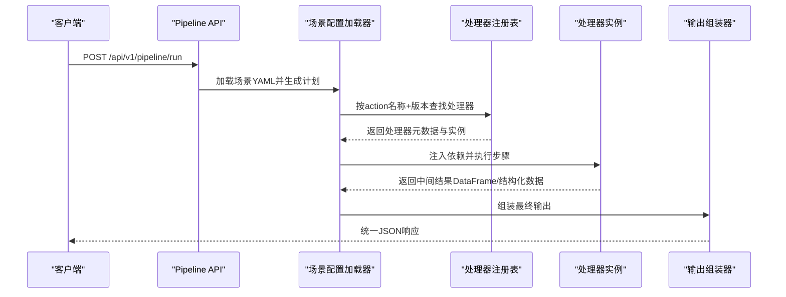
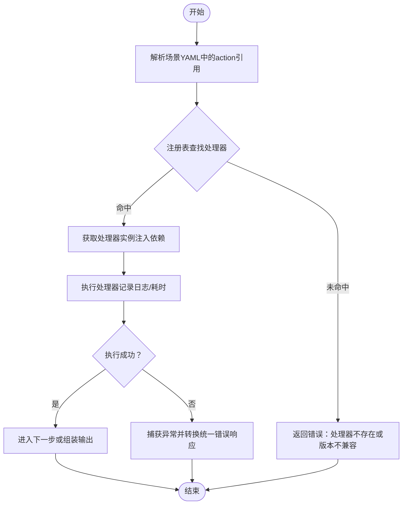
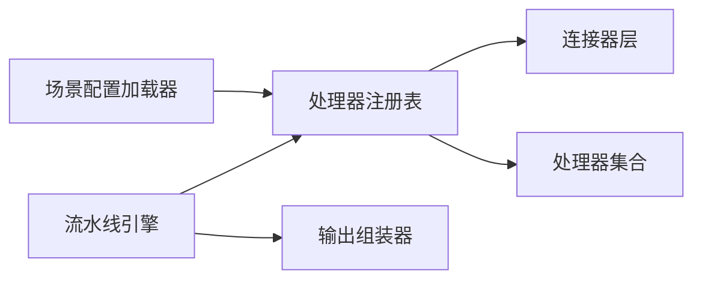

# 处理器注册表

<cite>
**本文引用的文件**
- [需求说明书（20260821100000_hiagent辅助Web服务_需求说明.md）](file://docs\20260821100000_hiagent辅助Web服务_需求说明.md)
</cite>

## 目录
1. [简介](#简介)
2. [项目结构](#项目结构)
3. [核心组件](#核心组件)
4. [架构总览](#架构总览)
5. [详细组件分析](#详细组件分析)
6. [依赖关系分析](#依赖关系分析)
7. [性能考量](#性能考量)
8. [故障排查指南](#故障排查指南)
9. [结论](#结论)
10. [附录](#附录)

## 简介
本设计文档围绕“处理器注册表（ProcessorRegistry）”展开，目标是基于现有需求文档中明确采用的“注册表模式”，为数据处理、可视化、文件与文档操作、API 编排等原子能力提供统一的动态注册、查找与调用机制。该注册表将作为流水线引擎的核心支撑，确保新增处理器无需修改既有流程代码即可扩展系统能力，同时保证输入输出标准化、错误处理一致、生命周期可控、依赖注入清晰以及版本兼容可演进。

## 项目结构
根据需求文档，系统采用场景驱动的流水线引擎，关键目录与职责如下：
- app/core/pipeline_engine.py：流水线引擎，负责步骤顺序执行、上下文传递、条件分支与步骤级错误处理
- app/core/scenario_loader.py：场景配置加载器，解析 YAML 场景定义并生成可执行计划
- app/core/connectors/：数据连接器层，包含 base/database/api/file 等实现，统一返回 DataFrame，通过注册表模式扩展
- app/core/output_assembler.py：输出组装器，支持 chart/table/report/file/summary 五种输出类型
- app/scenarios/*.yaml：场景配置文件，描述 data_sources、pipeline、outputs
- app/api/v1/pipeline.py：Pipeline API 路由，暴露两种调用模式（Pipeline 运行与原子 API）

图表来源
- [需求说明书:33-68](file://docs\20260821100000_hiagent辅助Web服务_需求说明.md#L33-L68)

章节来源
- [需求说明书:33-68](file://docs\20260821100000_hiagent辅助Web服务_需求说明.md#L33-L68)
- [需求说明书:106-115](file://docs\20260821100000_hiagent辅助Web服务_需求说明.md#L106-L115)

## 核心组件
- 处理器注册表（ProcessorRegistry）
  - 职责：集中管理所有处理器（数据、可视化、文件、API 编排等）的注册、查找、版本选择与调用；维护处理器元数据（名称、版本、输入输出契约、依赖、错误码范围）。
  - 关键能力：动态注册、按名称+版本精确或模糊匹配、参数校验、依赖注入、调用拦截（日志、耗时、重试）。
- 流水线引擎（Pipeline Engine）
  - 职责：读取场景 YAML，构建步骤链，顺序执行并通过 PipelineContext 传递中间结果；支持条件分支与步骤级 skip/abort。
- 场景配置加载器（Scenario Loader）
  - 职责：解析 YAML，校验 schema，生成可执行计划（含处理器引用、参数映射、依赖声明）。
- 输出组装器（Output Assembler）
  - 职责：将最终结果封装为 chart/table/report/file/summary 等标准格式，供上层统一响应。
- 连接器层（Connectors）
  - 职责：数据库、API、文件上传/下载/对象存储等数据获取能力，统一返回 DataFrame，通过注册表扩展。

章节来源
- [需求说明书:40-68](file://docs\20260821100000_hiagent辅助Web服务_需求说明.md#L40-L68)
- [需求说明书:71-94](file://docs\20260821100000_hiagent辅助Web服务_需求说明.md#L71-L94)
- [需求说明书:106-115](file://docs\20260821100000_hiagent辅助Web服务_需求说明.md#L106-L115)

## 架构总览
处理器注册表位于流水线引擎与各类原子能力之间，承担“发现—装配—执行”的职责。其典型交互如下：

图表来源
- [需求说明书:33-68](file://docs\20260821100000_hiagent辅助Web服务_需求说明.md#L33-L68)

## 详细组件分析

### 处理器接口规范
- 统一输入输出格式
  - 输入：以 PipelineContext 为中心，包含命名引用的中间数据、请求参数、环境变量、凭据、运行时配置。
  - 输出：标准化数据结构（如 DataFrame、图表二进制、HTML、报告对象、摘要文本），由输出组装器统一封装。
- 错误处理约定
  - 错误码按模块分段：1xxx 通用、2xxx 数据处理、3xxx 可视化、4xxx 文件文档、5xxx API 编排、6xxx Pipeline 引擎。
  - 处理器需抛出领域异常或返回错误对象，由注册表/引擎统一捕获并转换为统一 JSON 响应。
- 元数据定义
  - 处理器元数据包括：名称、版本、描述、输入/输出 Schema、依赖列表、资源限制（超时、内存）、是否幂等、是否可跳过。
- 生命周期
  - 初始化：按需懒加载或启动时预加载，完成依赖注入与资源准备。
  - 执行：接收上下文参数，执行业务逻辑，记录日志与耗时。
  - 销毁：释放资源（连接、临时文件、句柄），在步骤结束或引擎关闭时触发。

章节来源
- [需求说明书:25-30](file://docs\20260821100000_hiagent辅助Web服务_需求说明.md#L25-L30)
- [需求说明书:57-63](file://docs\20260821100000_hiagent辅助Web服务_需求说明.md#L57-L63)
- [需求说明书:71-94](file://docs\20260821100000_hiagent辅助Web服务_需求说明.md#L71-L94)

### 动态注册、查找与调用机制
- 动态注册
  - 通过装饰器或显式 API 将处理器类及其元数据注册到注册表，支持多版本并存。
  - 注册时可声明依赖（其他处理器、外部服务、配置项），由注册表进行装配。
- 查找策略
  - 精确匹配：名称 + 版本号；若未命中则回退到语义版本比较（>= 最低兼容版本）。
  - 模糊匹配：仅名称，默认选择最高稳定版本。
- 调用流程
  - 引擎从场景 YAML 解析出 action 引用，向注册表请求处理器实例。
  - 注册表注入依赖后返回实例，引擎执行并收集结果与指标。

图表来源
- [需求说明书:33-68](file://docs\20260821100000_hiagent辅助Web服务_需求说明.md#L33-L68)

章节来源
- [需求说明书:33-68](file://docs\20260821100000_hiagent辅助Web服务_需求说明.md#L33-L68)

### 处理器的生命周期管理
- 初始化
  - 懒加载：首次调用时初始化，减少启动开销。
  - 预加载：对高频处理器在应用启动时预热。
  - 依赖注入：从配置中心/环境变量注入凭据、连接池、模板路径等。
- 执行
  - 每步独立记录日志与耗时，支持步骤级 skip/abort。
  - 中间数据通过 PipelineContext 命名引用传递，避免全局状态。
- 销毁
  - 步骤结束后释放资源；引擎关闭时清理全局资源。
  - 对文件/网络/数据库连接进行显式关闭与回收。

章节来源
- [需求说明书:57-63](file://docs\20260821100000_hiagent辅助Web服务_需求说明.md#L57-L63)

### 依赖注入与参数传递
- 依赖注入
  - 处理器声明所需依赖（如数据库连接、HTTP 客户端、模板引擎），注册表在实例化时自动注入。
  - 支持可选依赖与降级策略（当依赖不可用时返回友好错误或启用缓存）。
- 参数传递
  - 输入参数来自场景 YAML 的 input/output 命名引用与请求体参数。
  - 中间数据通过 PipelineContext 的键值映射传递，避免隐式耦合。
- 安全隔离
  - 凭据从环境变量读取，禁止硬编码；文件沙箱限制访问范围。

章节来源
- [需求说明书:25-30](file://docs\20260821100000_hiagent辅助Web服务_需求说明.md#L25-L30)
- [需求说明书:57-63](file://docs\20260821100000_hiagent辅助Web服务_需求说明.md#L57-L63)

### 扩展新处理器类型的实践
- 自定义数据处理步骤
  - 定义处理器类，实现统一输入输出契约；在注册表中注册名称与版本。
  - 在场景 YAML 的 pipeline 中引用该 action，并通过 input/output 命名引用串联步骤。
- 可视化生成器
  - 实现图表渲染处理器，支持 PNG/SVG/HTML；注册为 visual.* 系列 action。
  - 输出组装器将图表二进制或 HTML 嵌入统一响应。
- 文件操作器
  - 实现格式转换、打包解压、元信息查询等处理器；注册为 file.* 系列 action。
  - 遵循临时文件管理策略（2小时自动清理、流式下载）。

章节来源
- [需求说明书:71-94](file://docs\20260821100000_hiagent辅助Web服务_需求说明.md#L71-L94)

### 版本兼容性与向后兼容保证
- 版本策略
  - 每个处理器维护语义化版本；注册表支持多版本并存。
  - 场景 YAML 指定最小兼容版本，引擎在选择处理器时进行版本检查。
- 兼容性保障
  - 输入/输出 Schema 变更需保持向后兼容（新增字段可选、删除字段有默认值）。
  - 行为变更通过版本隔离，旧版本继续可用直至迁移完成。
- 回滚与热更新
  - 支持热加载场景配置；处理器升级时保留旧版本实例直到无引用。

章节来源
- [需求说明书:33-68](file://docs\20260821100000_hiagent辅助Web服务_需求说明.md#L33-L68)

## 依赖关系分析
处理器注册表与以下组件存在强依赖：
- 流水线引擎：驱动步骤执行与上下文管理
- 场景配置加载器：提供处理器引用与参数映射
- 输出组装器：统一封装最终结果
- 连接器层：数据获取能力的具体实现，通过注册表扩展

图表来源
- [需求说明书:33-68](file://docs\20260821100000_hiagent辅助Web服务_需求说明.md#L33-L68)
- [需求说明书:106-115](file://docs\20260821100000_hiagent辅助Web服务_需求说明.md#L106-L115)

章节来源
- [需求说明书:33-68](file://docs\20260821100000_hiagent辅助Web服务_需求说明.md#L33-L68)
- [需求说明书:106-115](file://docs\20260821100000_hiagent辅助Web服务_需求说明.md#L106-L115)

## 性能考量
- 简单接口 < 500ms，数据处理 < 3s，Pipeline 全流程 < 10s
- 优化建议
  - 处理器懒加载与连接池复用
  - 中间数据零拷贝传递（使用共享内存或引用）
  - 并行执行可独立步骤（在引擎层面控制）
  - 缓存热点查询结果与模板渲染产物

章节来源
- [需求说明书:97-102](file://docs\20260821100000_hiagent辅助Web服务_需求说明.md#L97-L102)

## 故障排查指南
- 常见问题
  - 处理器未注册或版本不匹配：检查注册表与场景 YAML 的版本声明
  - 依赖注入失败：确认环境变量与配置项是否正确
  - 步骤执行超时：调整处理器超时与重试策略
  - 输出格式错误：核对输出组装器与处理器契约
- 定位手段
  - 查看结构化日志（scenario_id + 步骤耗时）
  - 检查 /health 与 /api/v1/pipeline/scenarios 列表
  - 使用原子 API 逐步验证各处理器

章节来源
- [需求说明书:97-102](file://docs\20260821100000_hiagent辅助Web服务_需求说明.md#L97-L102)

## 结论
处理器注册表通过统一的接口规范、动态注册与查找机制、严格的版本管理与生命周期控制，为 hiagent 辅助 Web 服务的流水线引擎提供了可扩展、可维护、高性能的基础设施。结合场景驱动的 YAML 配置与输出组装器，系统能够灵活支撑多种业务分析场景，并在不断演进中保持向后兼容与稳定交付。

## 附录
- 两种调用模式
  - Pipeline API：POST /api/v1/pipeline/run，传入 scenario_id + 参数，一次完成全流程
  - 原子 API：/api/v1/data/*、/api/v1/visual/* 等，逐步调用，Agent 自行编排
- 连接器扩展
  - 新增连接器只需实现统一接口并注册到注册表，无需改动既有流程

章节来源
- [需求说明书:65-68](file://docs\20260821100000_hiagent辅助Web服务_需求说明.md#L65-L68)
- [需求说明书:46-55](file://docs\20260821100000_hiagent辅助Web服务_需求说明.md#L46-L55)