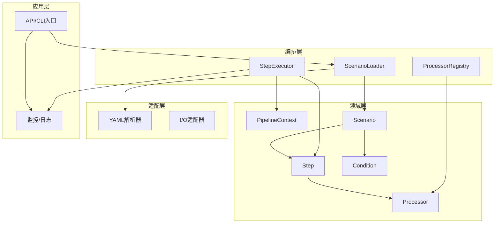
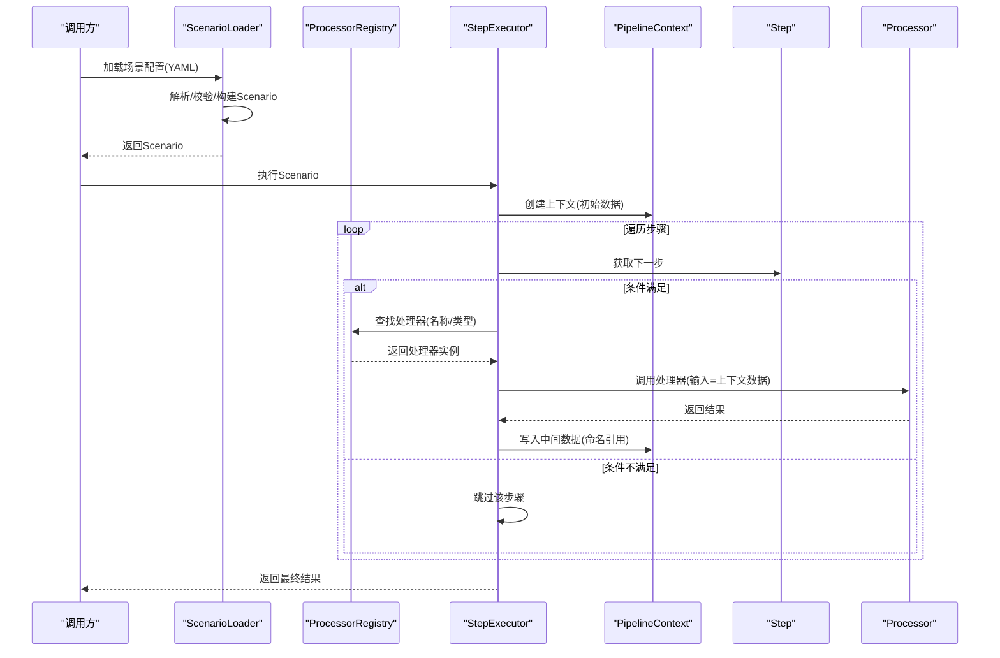
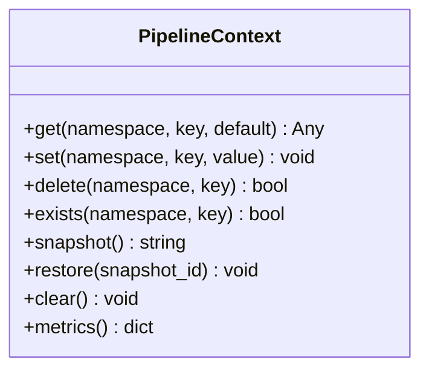
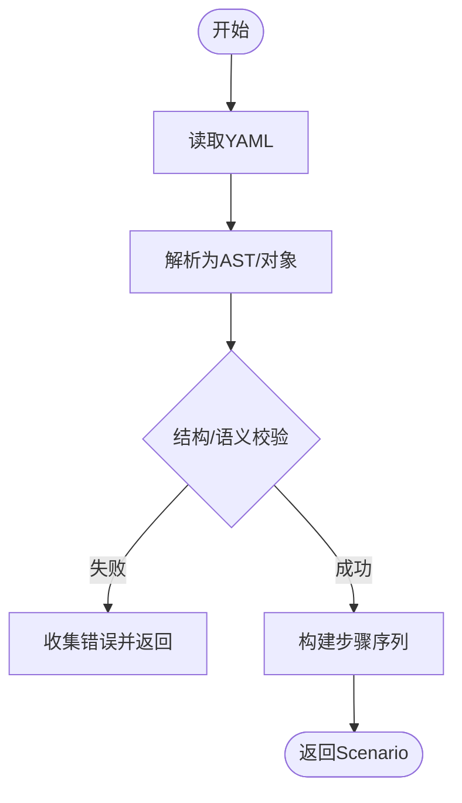
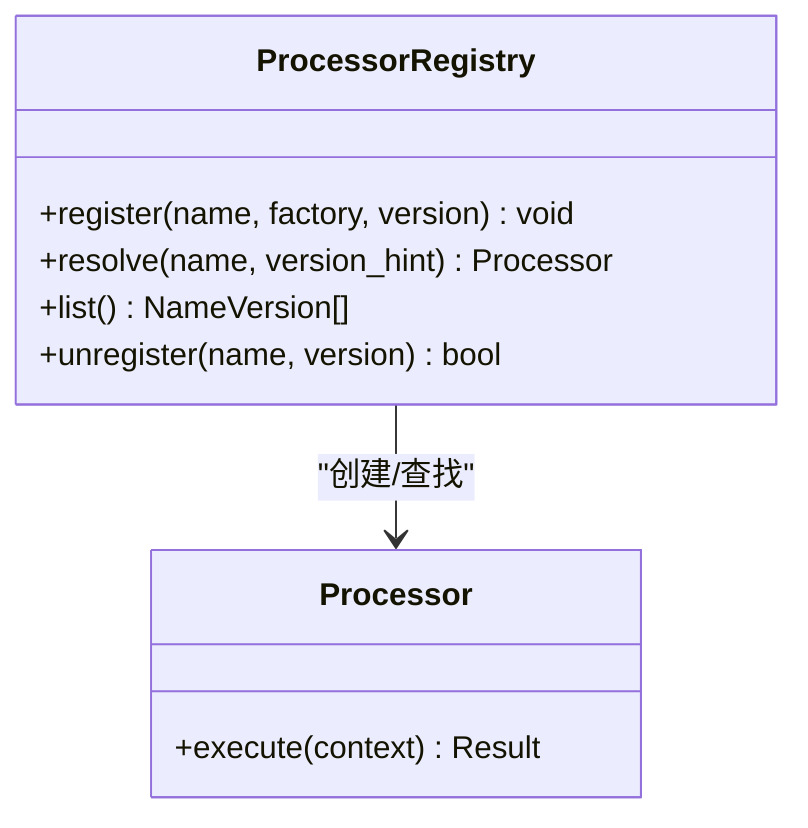
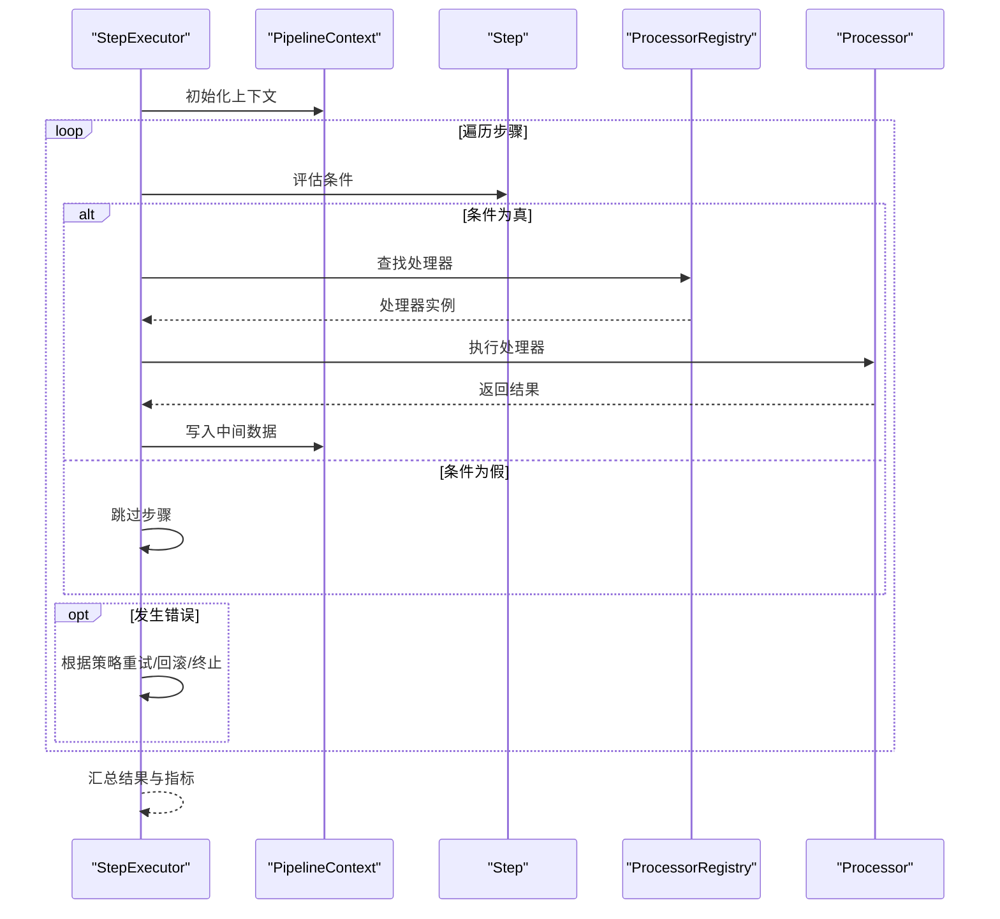
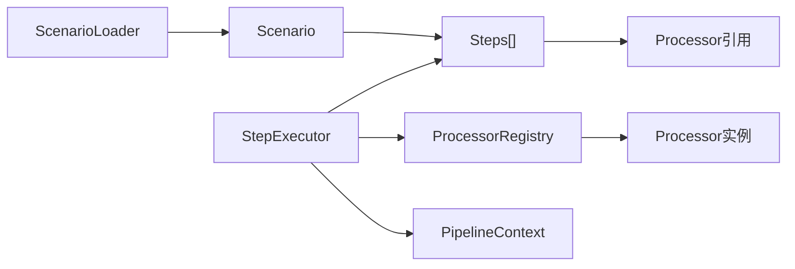

# 核心组件设计

<cite>
**本文引用的文件**   
- [20260821100000_hiagent辅助Web服务_需求说明.md](file://docs\20260821100000_hiagent辅助Web服务_需求说明.md)
</cite>

## 目录
1. [简介](#简介)
2. [项目结构](#项目结构)
3. [核心组件](#核心组件)
4. [架构总览](#架构总览)
5. [详细组件分析](#详细组件分析)
6. [依赖分析](#依赖分析)
7. [性能考虑](#性能考虑)
8. [故障排查指南](#故障排查指南)
9. [结论](#结论)
10. [附录](#附录)

## 简介
本设计文档围绕 Pipeline 引擎的核心组件展开，重点阐述以下方面：
- PipelineContext 上下文对象的数据传递机制，包括命名引用如何在工作流步骤间传递中间数据。
- 场景配置加载器（ScenarioLoader）对 YAML 配置文件的解析、结构定义、验证规则与错误处理。
- 处理器注册表（ProcessorRegistry）的动态注册、查找与调用机制。
- 步骤执行器的实现原理，包括顺序执行、条件分支与错误处理策略。
- 通过接口定义与使用示例帮助开发者理解各组件职责与协作关系。

由于当前仓库未包含具体源代码，本文基于通用工程实践给出可落地的设计与接口约定，便于后续在代码库中落地实现。

## 项目结构
当前仓库主要包含需求说明文档，尚未提供 Pipeline 引擎的源码。为便于后续扩展，建议采用如下分层组织方式：
- 领域层：PipelineContext、Step、Processor、Scenario、Condition 等核心模型。
- 编排层：ScenarioLoader、ProcessorRegistry、StepExecutor。
- 适配层：YAML 解析器、I/O 适配器、日志与指标上报。
- 应用层：API/CLI 入口、任务调度与监控。

[本图为概念性结构示意，不直接映射到具体源文件]

## 核心组件
- PipelineContext：承载工作流运行期的状态与中间数据，支持键值访问、作用域隔离与生命周期管理。
- ScenarioLoader：负责读取并解析 YAML 场景配置，构建 Scenario 对象，进行结构与语义校验，输出可执行的步骤序列。
- ProcessorRegistry：维护处理器集合，支持动态注册、按名称或类型查找、版本兼容与冲突检测。
- StepExecutor：驱动步骤执行，支持顺序执行、条件分支、重试与错误恢复策略。

**章节来源**
- [20260821100000_hiagent辅助Web服务_需求说明.md:1-200](file://docs\20260821100000_hiagent辅助Web服务_需求说明.md#L1-L200)

## 架构总览
下图展示从场景配置到步骤执行的端到端流程：

**图表来源**
- [20260821100000_hiagent辅助Web服务_需求说明.md:1-200](file://docs\20260821100000_hiagent辅助Web服务_需求说明.md#L1-L200)

## 详细组件分析

### PipelineContext：上下文与命名引用
- 职责
  - 维护运行期状态：输入参数、中间变量、输出结果、错误信息、元数据（如耗时、追踪ID）。
  - 提供命名引用：以“命名空间/键”形式存取数据，支持跨步骤共享与隔离。
  - 生命周期管理：初始化、清理、快照与回滚。
- 数据传递机制
  - 读写接口：get/set/delete/exists，支持默认值与类型断言。
  - 作用域：支持全局与局部作用域，避免步骤间污染。
  - 变更事件：可选的事件总线，供监听器记录审计或触发副作用。
- 复杂度与性能
  - 典型操作 O(1)，大量键值时注意内存占用；必要时启用惰性加载或分片存储。
- 错误处理
  - 非法键访问抛出明确异常；支持静默模式用于批量容错。
- 使用示例（接口约定）
  - 初始化：create_context(initial_data)
  - 写入：set(namespace, key, value)
  - 读取：get(namespace, key, default=None)
  - 删除：delete(namespace, key)
  - 快照：snapshot()/restore(snapshot_id)

**图表来源**
- [20260821100000_hiagent辅助Web服务_需求说明.md:1-200](file://docs\20260821100000_hiagent辅助Web服务_需求说明.md#L1-L200)

**章节来源**
- [20260821100000_hiagent辅助Web服务_需求说明.md:1-200](file://docs\20260821100000_hiagent辅助Web服务_需求说明.md#L1-L200)

### ScenarioLoader：场景配置加载器
- 职责
  - 读取 YAML 配置文件，解析为 Scenario 对象。
  - 校验配置结构、必填字段、类型与取值范围。
  - 将抽象步骤描述转换为可执行步骤序列。
- 配置文件结构（建议）
  - scenario: 名称、版本、描述。
  - inputs: 输入参数定义（名称、类型、默认值、是否必填）。
  - steps: 步骤列表，每个步骤包含 id、name、type、condition、inputs、outputs、retry、timeout。
  - processors: 处理器映射（name -> type/version）。
  - error_policy: 全局错误策略（fail_fast、continue_on_error、rollback）。
- 验证规则
  - 语法校验：YAML 格式正确。
  - 结构校验：必填字段存在且类型匹配。
  - 语义校验：步骤依赖无环、处理器已注册、条件表达式合法。
- 错误处理
  - 结构化错误码与消息，定位到具体行号与字段。
  - 提供修复建议（如缺失处理器、循环依赖）。
- 使用示例（接口约定）
  - load(path_or_yaml) -> Scenario
  - validate(scenario) -> ValidationResult
  - build_steps(scenario) -> List<Step>

**图表来源**
- [20260821100000_hiagent辅助Web服务_需求说明.md:1-200](file://docs\20260821100000_hiagent辅助Web服务_需求说明.md#L1-L200)

**章节来源**
- [20260821100000_hiagent辅助Web服务_需求说明.md:1-200](file://docs\20260821100000_hiagent辅助Web服务_需求说明.md#L1-L200)

### ProcessorRegistry：处理器注册表
- 设计模式
  - 工厂+注册表：集中管理处理器实例，支持按名称或类型查找。
  - 版本兼容：同一处理器可注册多个版本，选择最匹配版本。
  - 冲突检测：重复注册时拒绝或覆盖（可配置）。
- 能力
  - register(name, processor_factory, version)
  - resolve(name, version_hint) -> processor
  - list() -> 已注册处理器清单
  - unregister(name, version)
- 线程安全
  - 读多写少场景下使用读写锁或不可变快照。
- 使用示例（接口约定）
  - 注册：register("http_fetch", factory, "v1")
  - 查找：resolve("http_fetch", "v1")
  - 调用：processor.execute(context)

**图表来源**
- [20260821100000_hiagent辅助Web服务_需求说明.md:1-200](file://docs\20260821100000_hiagent辅助Web服务_需求说明.md#L1-L200)

**章节来源**
- [20260821100000_hiagent辅助Web服务_需求说明.md:1-200](file://docs\20260821100000_hiagent辅助Web服务_需求说明.md#L1-L200)

### StepExecutor：步骤执行器
- 职责
  - 驱动步骤顺序执行，支持条件分支、重试、超时与错误恢复。
  - 维护 PipelineContext 的生命周期，确保中间数据一致性与可回滚。
- 执行策略
  - 顺序执行：按步骤顺序依次执行。
  - 条件分支：根据 condition 表达式决定是否执行某步骤。
  - 错误处理：fail_fast（立即失败）、continue_on_error（继续执行）、rollback（回滚上下文）。
  - 重试与退避：可配置最大重试次数与退避策略。
- 使用示例（接口约定）
  - execute(scenario, initial_context) -> ExecutionResult
  - cancel() / is_running()
- 时序图（含条件与错误处理）

**图表来源**
- [20260821100000_hiagent辅助Web服务_需求说明.md:1-200](file://docs\20260821100000_hiagent辅助Web服务_需求说明.md#L1-L200)

**章节来源**
- [20260821100000_hiagent辅助Web服务_需求说明.md:1-200](file://docs\20260821100000_hiagent辅助Web服务_需求说明.md#L1-L200)

## 依赖分析
- 组件耦合
  - StepExecutor 依赖 ProcessorRegistry 与 PipelineContext。
  - ScenarioLoader 依赖 YAML 解析器与校验器，输出 Scenario 给 StepExecutor。
  - Processor 由 ProcessorRegistry 管理，被 StepExecutor 调用。
- 外部依赖
  - YAML 解析库、表达式求值器（用于条件）、日志与指标框架。
- 潜在循环依赖
  - 应避免 Step 直接依赖 Executor；通过接口解耦。

**图表来源**
- [20260821100000_hiagent辅助Web服务_需求说明.md:1-200](file://docs\20260821100000_hiagent辅助Web服务_需求说明.md#L1-L200)

**章节来源**
- [20260821100000_hiagent辅助Web服务_需求说明.md:1-200](file://docs\20260821100000_hiagent辅助Web服务_需求说明.md#L1-L200)

## 性能考虑
- 上下文优化
  - 大对象使用引用传递，避免拷贝；按需序列化。
  - 快照粒度控制，减少频繁快照开销。
- 处理器复用
  - 单例或池化处理器实例，减少创建成本。
- I/O 与并发
  - 网络请求使用连接池与超时控制；异步执行可提升吞吐。
- 资源限制
  - 设置步骤级超时、内存上限与并发度，防止雪崩。

[本节为通用指导，不直接分析具体文件]

## 故障排查指南
- 常见问题
  - 配置错误：YAML 语法或结构校验失败，查看错误定位的行号与字段。
  - 处理器未注册：检查名称与版本是否匹配，确认注册时机。
  - 条件表达式错误：调试表达式求值环境，打印上下文快照。
  - 死锁或超时：检查步骤间依赖与锁粒度，调整超时与重试策略。
- 诊断手段
  - 开启详细日志与追踪 ID，关联上下文快照。
  - 使用只读模式回放问题场景，逐步缩小范围。
- 恢复策略
  - 启用 continue_on_error 与 rollback，保障整体可用性。
  - 对关键步骤增加幂等性与补偿逻辑。

**章节来源**
- [20260821100000_hiagent辅助Web服务_需求说明.md:1-200](file://docs\20260821100000_hiagent辅助Web服务_需求说明.md#L1-L200)

## 结论
本文给出了 Pipeline 引擎核心组件的设计蓝图：以 PipelineContext 为中心的数据流转，以 ScenarioLoader 驱动的声明式配置，以 ProcessorRegistry 实现的处理器生态，以及以 StepExecutor 为核心的执行编排。按照上述接口约定与策略，可在实际工程中快速落地并持续演进。

[本节为总结性内容，不直接分析具体文件]

## 附录
- 术语
  - 命名引用：以“命名空间/键”标识的上下文数据项。
  - 条件分支：基于表达式的步骤执行决策。
  - 错误策略：定义步骤失败时的全局行为。
- 参考
  - 建议在实现时引入单元测试与集成测试，覆盖配置解析、处理器注册与执行路径。

[本节为补充信息，不直接分析具体文件]