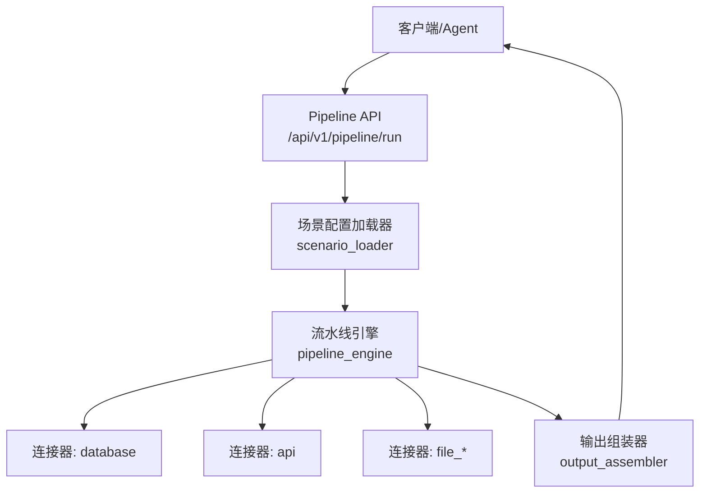
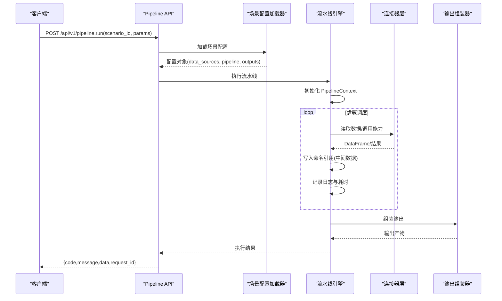
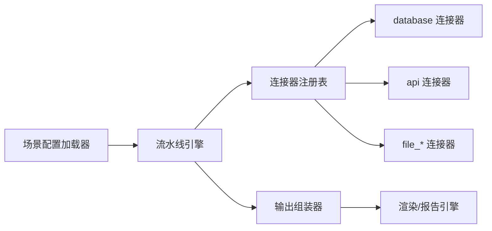

# 步骤执行器

<cite>
**本文引用的文件**
- [需求说明文档](file://docs/20260821100000_hiagent辅助Web服务_需求说明.md)
</cite>

## 目录
1. [引言](#引言)
2. [项目结构](#项目结构)
3. [核心组件](#核心组件)
4. [架构总览](#架构总览)
5. [详细组件分析](#详细组件分析)
6. [依赖关系分析](#依赖关系分析)
7. [性能考量](#性能考量)
8. [故障排查指南](#故障排查指南)
9. [结论](#结论)
10. [附录：配置示例与最佳实践](#附录配置示例与最佳实践)

## 引言
本设计文档围绕“步骤执行器”（Pipeline Engine）展开，目标是提供一套可配置、可扩展、可观测的流水线执行框架，用于驱动多种业务分析场景。该执行器以 YAML 场景配置为驱动，将数据获取、处理、可视化与输出组装串联为可编排的步骤链，支持顺序执行、条件分支、错误处理（skip/abort）、以及每步独立的日志与耗时统计。同时，通过命名引用在步骤间传递中间数据，确保流程清晰、可追踪、可复用。

## 项目结构
根据需求说明，系统采用“场景驱动的流水线引擎”架构，关键新增目录与职责如下：
- app/core/pipeline_engine.py：流水线引擎，负责解析配置、调度步骤、管理上下文、记录日志与耗时
- app/core/scenario_loader.py：场景配置加载器，负责读取并校验 YAML 场景定义
- app/core/connectors/：数据连接器层，封装数据库、API、文件等数据源访问，统一返回 DataFrame
- app/core/output_assembler.py：输出组装器，负责 chart/table/report/file/summary 等输出类型生成
- app/scenarios/*.yaml：场景配置文件，描述 data_sources、pipeline、outputs
- app/api/v1/pipeline.py：Pipeline API 路由，暴露 /api/v1/pipeline/run 等接口



图表来源
- [需求说明文档:33-67](file://docs/20260821100000_hiagent辅助Web服务_需求说明.md#L33-L67)
- [需求说明文档:106-114](file://docs/20260821100000_hiagent辅助Web服务_需求说明.md#L106-L114)

章节来源
- [需求说明文档:33-67](file://docs/20260821100000_hiagent辅助Web服务_需求说明.md#L33-L67)
- [需求说明文档:106-114](file://docs/20260821100000_hiagent辅助Web服务_需求说明.md#L106-L114)

## 核心组件
- 场景配置加载器：从 YAML 中读取 data_sources、pipeline、outputs，并进行基础校验与默认值填充
- 流水线引擎：解析 pipeline 步骤序列，维护 PipelineContext（命名引用空间），按策略调度执行，记录每步日志与耗时
- 连接器层：统一抽象数据源访问，屏蔽底层差异，返回标准 DataFrame；凭据来自环境变量，注册表模式扩展新连接器
- 输出组装器：基于步骤产出的中间数据，生成 chart/table/report/file/summary 等输出
- API 路由：暴露 Pipeline 运行入口，接收 scenario_id 与参数，调用引擎完成全流程

章节来源
- [需求说明文档:40-67](file://docs/20260821100000_hiagent辅助Web服务_需求说明.md#L40-L67)
- [需求说明文档:106-114](file://docs/20260821100000_hiagent辅助Web服务_需求说明.md#L106-L114)

## 架构总览
整体流程：
- 客户端通过 Pipeline API 提交 scenario_id 与入参
- 场景配置加载器读取对应 YAML，构建执行计划
- 流水线引擎创建 PipelineContext，依次调度步骤执行
- 步骤通过连接器获取数据或调用原子能力，产出中间结果写入上下文
- 输出组装器根据 outputs 定义，消费上下文中的数据生成最终产物
- 统一响应格式返回 code/message/data/request_id



图表来源
- [需求说明文档:33-67](file://docs/20260821100000_hiagent辅助Web服务_需求说明.md#L33-L67)
- [需求说明文档:106-114](file://docs/20260821100000_hiagent辅助Web服务_需求说明.md#L106-L114)

## 详细组件分析

### 步骤执行调度机制
- 顺序执行：默认按 pipeline 定义的步骤顺序执行，前一步的输出作为后一步输入（通过命名引用解析）
- 条件分支：在步骤级别支持条件判断，满足条件时执行，否则跳过；可用于动态控制流程走向
- 并行处理：当前阶段以顺序执行为主，后续可扩展为基于 DAG 的并行调度，提升吞吐

调度要点：
- 每步执行前解析 input 引用，从 PipelineContext 中取值
- 每步执行后记录耗时与结构化日志，便于监控与调试
- 条件分支通过表达式或规则引擎评估，决定下一步执行路径

章节来源
- [需求说明文档:57-60](file://docs/20260821100000_hiagent辅助Web服务_需求说明.md#L57-L60)

### 错误处理策略
- skip：当某步骤失败但允许继续时，标记该步骤为跳过，记录错误信息，不影响后续步骤执行
- abort：当某步骤失败且必须中断时，立即终止流水线，返回错误码与消息
- retry：对可重试的错误（如网络超时、限流）进行指数退避重试，达到上限后转为 abort 或 skip（由配置决定）

适用场景建议：
- 非关键步骤失败使用 skip，保证主流程继续
- 关键步骤失败使用 abort，避免产生不一致状态
- 外部依赖不稳定时使用 retry，提高鲁棒性

章节来源
- [需求说明文档:57-60](file://docs/20260821100000_hiagent辅助Web服务_需求说明.md#L57-L60)

### 依赖管理与数据流转
- 命名引用：每个步骤声明 input/output 名称，引擎在运行时解析这些引用，实现步骤间数据传递
- 上下文管理：PipelineContext 作为共享内存，保存中间结果，支持读写隔离与生命周期管理
- 依赖解析：根据步骤的 input 引用构建隐式依赖图，确保数据就绪后再执行

优化点：
- 对大对象使用引用传递而非拷贝，降低内存占用
- 对频繁读写的键做缓存与失效策略

章节来源
- [需求说明文档:40-60](file://docs/20260821100000_hiagent辅助Web服务_需求说明.md#L40-L60)

### 监控与日志记录
- 结构化日志：包含 scenario_id、step_id、耗时、错误信息等字段，便于聚合与分析
- 耗时统计：每步记录开始/结束时间，计算耗时，汇总到请求级指标
- 性能指标：QPS、P95/P99 延迟、错误率、重试次数等
- 调试信息：打印输入输出摘要、引用解析结果、条件分支决策依据

章节来源
- [需求说明文档:57-60](file://docs/20260821100000_hiagent辅助Web服务_需求说明.md#L57-L60)
- [需求说明文档:97-102](file://docs/20260821100000_hiagent辅助Web服务_需求说明.md#L97-L102)

### 可扩展性设计
- 连接器注册表：新增连接器只需实现 BaseConnector 接口并注册，无需改动引擎核心逻辑
- 步骤类型扩展：新增步骤类型（如自定义 action）只需实现标准接口，并在配置中声明
- 调度策略扩展：未来可引入 DAG 调度、资源池化、优先级队列等高级策略

章节来源
- [需求说明文档:46-60](file://docs/20260821100000_hiagent辅助Web服务_需求说明.md#L46-L60)
- [需求说明文档:136-142](file://docs/20260821100000_hiagent辅助Web服务_需求说明.md#L136-L142)

## 依赖关系分析
- 场景配置加载器依赖 YAML 解析与校验库
- 流水线引擎依赖连接器注册表、上下文管理器、日志与指标收集模块
- 连接器依赖具体数据源（数据库、HTTP、文件系统）
- 输出组装器依赖渲染与模板引擎（Jinja2、matplotlib/plotly、WeasyPrint）



图表来源
- [需求说明文档:46-67](file://docs/20260821100000_hiagent辅助Web服务_需求说明.md#L46-L67)
- [需求说明文档:106-114](file://docs/20260821100000_hiagent辅助Web服务_需求说明.md#L106-L114)

章节来源
- [需求说明文档:46-67](file://docs/20260821100000_hiagent辅助Web服务_需求说明.md#L46-L67)
- [需求说明文档:106-114](file://docs/20260821100000_hiagent辅助Web服务_需求说明.md#L106-L114)

## 性能考量
- 简单接口 < 500ms，数据处理 < 3s，Pipeline 全流程 < 10s
- 使用 DuckDB 加速 SQL 查询，减少 pandasql 的性能瓶颈
- 中间数据尽量使用引用传递，避免不必要的数据拷贝
- 对 I/O 密集步骤启用连接池与并发限制，防止资源争用
- 通过结构化日志与指标采集定位热点步骤，持续优化

章节来源
- [需求说明文档:97-102](file://docs/20260821100000_hiagent辅助Web服务_需求说明.md#L97-L102)
- [需求说明文档:136-142](file://docs/20260821100000_hiagent辅助Web服务_需求说明.md#L136-L142)

## 故障排查指南
- 检查 scenario_id 是否正确，确认 YAML 配置是否存在且语法合法
- 查看每步日志中的耗时与错误堆栈，定位失败步骤
- 对于 skip 的情况，检查条件表达式与输入数据是否满足预期
- 对于 abort 的情况，确认是否为关键步骤失败，必要时调整错误处理策略
- 对于 retry 的情况，观察重试次数与间隔，调整超时与退避策略
- 使用 /health 与 /api/v1/pipeline/scenarios 进行健康检查与场景列表验证

章节来源
- [需求说明文档:57-60](file://docs/20260821100000_hiagent辅助Web服务_需求说明.md#L57-L60)
- [需求说明文档:97-102](file://docs/20260821100000_hiagent辅助Web服务_需求说明.md#L97-L102)

## 结论
步骤执行器以 YAML 配置驱动，结合顺序执行、条件分支与错误处理策略，提供了灵活且可靠的业务流程编排能力。通过命名引用与 PipelineContext 实现步骤间数据流转，配合结构化日志与耗时统计，实现了良好的可观测性与可维护性。未来可通过引入 DAG 调度与更多调度策略进一步提升性能与灵活性。

## 附录：配置示例与最佳实践

### 复杂业务流程配置示例（概念性）
以下示例展示如何在 YAML 中定义一个包含条件判断、循环处理与异常恢复的流程。注意：以下为概念性示例，用于说明配置结构与用法，实际实现需遵循项目规范。

```yaml
data_sources:
  - name: "db_main"
    type: "database"
    config:
      driver: "mysql"
      host: "${DB_HOST}"
      port: "${DB_PORT}"
      user: "${DB_USER}"
      password: "${DB_PASS}"
      database: "${DB_NAME}"
  - name: "api_market"
    type: "api"
    config:
      base_url: "${MARKET_API_BASE}"
      headers:
        Authorization: "Bearer ${API_TOKEN}"

pipeline:
  - id: "fetch_data"
    action: "connector.read"
    input:
      source: "db_main"
      query: "SELECT * FROM products WHERE status='active'"
    output: "products_df"
    error_policy: "retry"
    retry:
      max_attempts: 3
      backoff: "exponential"

  - id: "filter_by_region"
    action: "data.filter"
    input:
      df: "products_df"
      condition: "region == 'CN'"
    output: "cn_products_df"
    error_policy: "skip"

  - id: "call_market_api"
    action: "connector.call"
    input:
      source: "api_market"
      endpoint: "/prices"
      params:
        product_ids: "{{ cn_products_df.id.tolist() }}"
    output: "market_prices"
    error_policy: "retry"
    retry:
      max_attempts: 2
      backoff: "linear"

  - id: "merge_and_aggregate"
    action: "data.merge"
    input:
      left: "cn_products_df"
      right: "market_prices"
      on: "id"
    output: "merged_df"

  - id: "generate_summary"
    action: "output.summary"
    input:
      df: "merged_df"
      metrics: ["count", "avg_price", "max_price"]
    output: "summary_result"

outputs:
  - type: "chart"
    title: "价格分布"
    data_ref: "merged_df"
    chart_type: "bar"
    x: "product_name"
    y: "price"

  - type: "report"
    template: "summary_report.html"
    data_ref: "summary_result"
```

说明：
- data_sources 定义数据源，支持环境变量注入
- pipeline 定义步骤链，每步声明 action、input/output、error_policy 与 retry 策略
- outputs 定义最终输出类型与渲染参数

章节来源
- [需求说明文档:40-67](file://docs/20260821100000_hiagent辅助Web服务_需求说明.md#L40-L67)

### 最佳实践
- 将关键步骤设置为 abort，非关键步骤设置为 skip，平衡稳定性与可用性
- 对外部依赖启用 retry，并设置合理的最大重试次数与退避策略
- 使用命名引用保持步骤间数据契约清晰，避免隐式耦合
- 为每步添加结构化日志，便于问题定位与性能分析
- 定期审查 YAML 配置，清理废弃步骤与冗余数据

[无章节来源，因为本节为概念性指导]