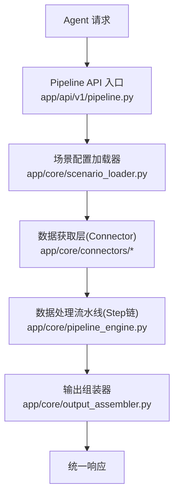
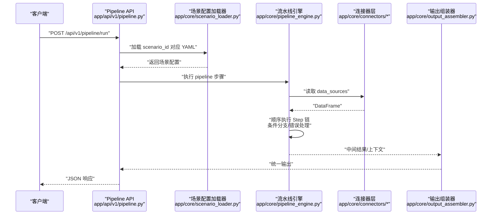
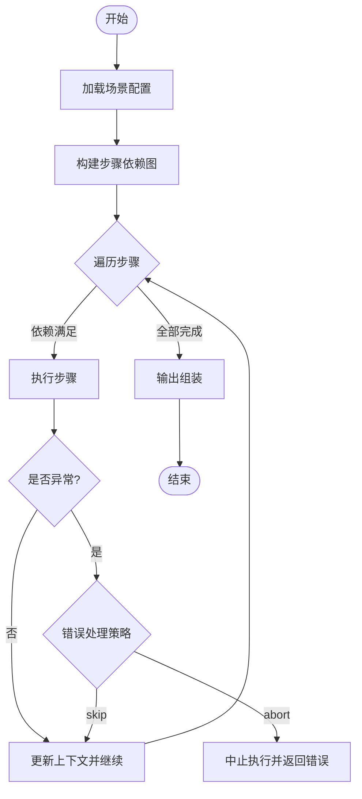
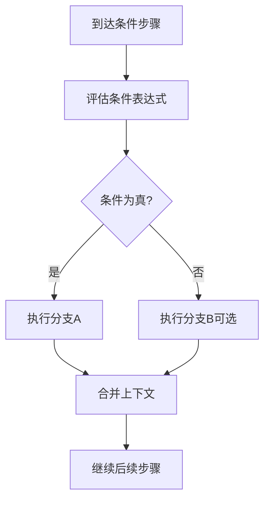
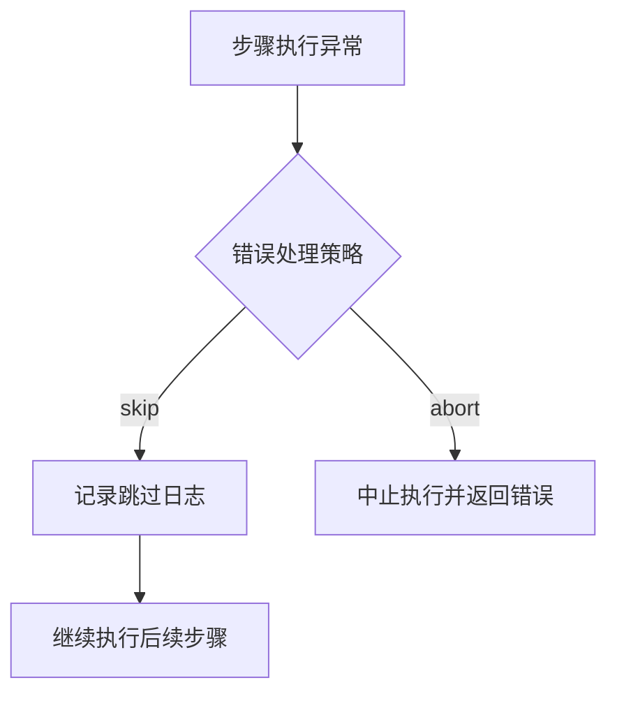
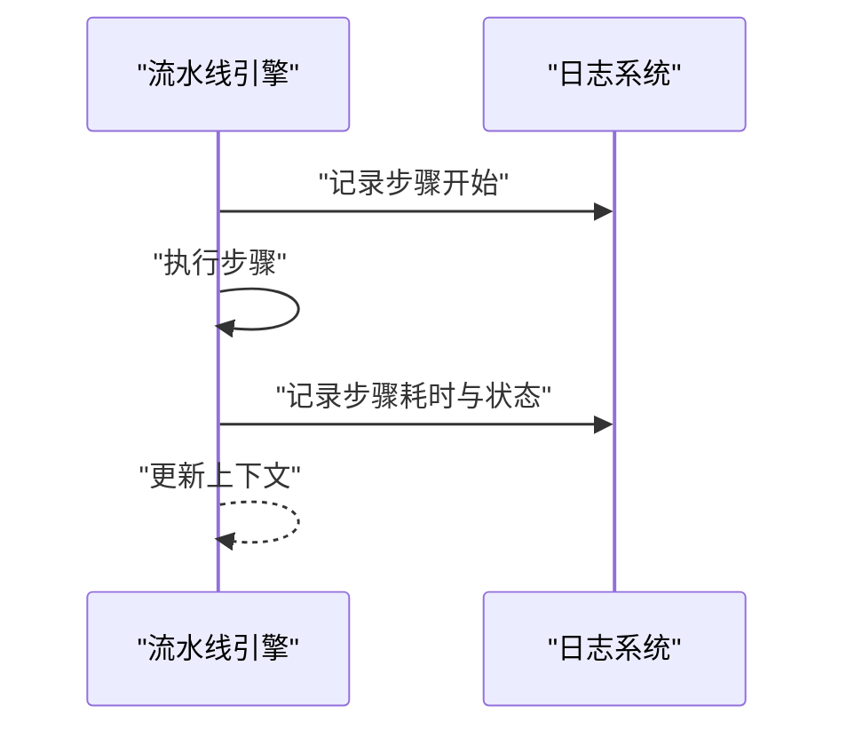
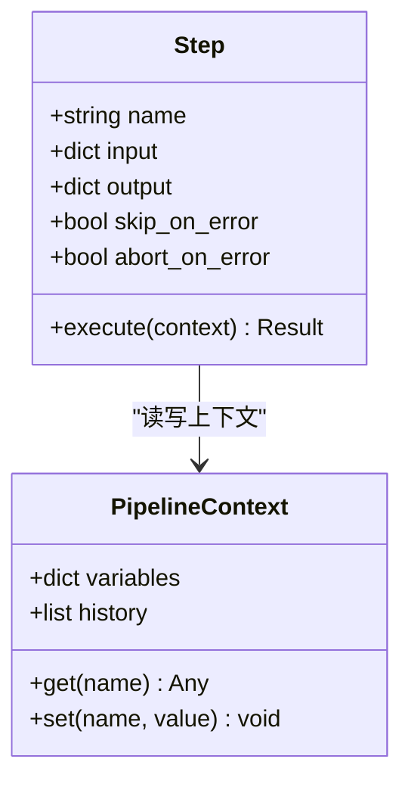
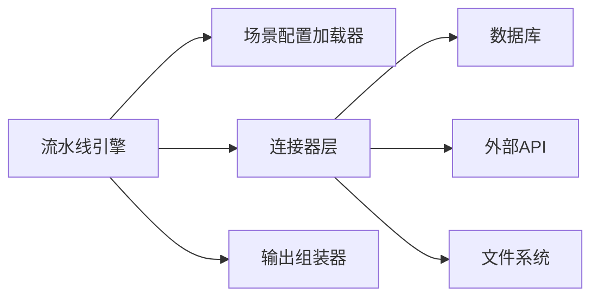

# 步骤执行引擎

<cite>
**本文引用的文件**
- [需求说明文档](file://docs/20260821100000_hiagent辅助Web服务_需求说明.md)
</cite>

## 目录
1. [简介](#简介)
2. [项目结构](#项目结构)
3. [核心组件](#核心组件)
4. [架构总览](#架构总览)
5. [详细组件分析](#详细组件分析)
6. [依赖关系分析](#依赖关系分析)
7. [性能考虑](#性能考虑)
8. [故障排查指南](#故障排查指南)
9. [结论](#结论)
10. [附录](#附录)

## 简介
本技术文档围绕 Pipeline 的步骤执行引擎，系统化阐述其顺序执行机制、条件分支实现、步骤级错误处理策略（skip/abort）、监控与日志记录机制，以及步骤定义的标准接口规范。同时提供配置示例与代码示例的指引路径，帮助开发者快速实现自定义步骤并处理复杂业务逻辑。

## 项目结构
根据需求说明书，Pipeline 相关的关键新增目录与文件如下：
- app/core/pipeline_engine.py — 流水线引擎
- app/core/scenario_loader.py — 场景配置加载器
- app/core/connectors/ — 数据连接器（base/database/api/file）
- app/core/output_assembler.py — 输出组装器
- app/scenarios/*.yaml — 场景配置文件
- app/api/v1/pipeline.py — Pipeline 路由

图表来源
- [需求说明文档:33-38](file://docs/20260821100000_hiagent辅助Web服务_需求说明.md#L33-L38)
- [需求说明文档:106-114](file://docs/20260821100000_hiagent辅助Web服务_需求说明.md#L106-L114)

章节来源
- [需求说明文档:33-38](file://docs/20260821100000_hiagent辅助Web服务_需求说明.md#L33-L38)
- [需求说明文档:106-114](file://docs/20260821100000_hiagent辅助Web服务_需求说明.md#L106-L114)

## 核心组件
- 流水线引擎（pipeline_engine.py）：负责解析 YAML 中的 pipeline 步骤，构建执行图，按依赖关系顺序执行，支持条件分支与步骤级错误处理（skip/abort），并记录每步耗时与状态。
- 场景配置加载器（scenario_loader.py）：加载并校验 YAML 场景配置，包括 data_sources、pipeline、outputs 三部分。
- 连接器层（connectors/*）：统一数据接入抽象，返回 DataFrame；支持 database、api、file_upload、file_url、file_s3 等类型。
- 输出组装器（output_assembler.py）：将最终结果组装为 chart/table/report/file/summary 五种输出类型。
- Pipeline 路由（api/v1/pipeline.py）：暴露两种调用模式（模式 A：Pipeline API；模式 B：原子 API）。

章节来源
- [需求说明文档:40-67](file://docs/20260821100000_hiagent辅助Web服务_需求说明.md#L40-L67)
- [需求说明文档:106-114](file://docs/20260821100000_hiagent辅助Web服务_需求说明.md#L106-L114)

## 架构总览
整体流程从 Agent 请求进入 Pipeline API，经场景配置加载器解析后，通过连接器获取数据，再由流水线引擎按步骤顺序执行，最后由输出组装器生成统一响应。

图表来源
- [需求说明文档:33-38](file://docs/20260821100000_hiagent辅助Web服务_需求说明.md#L33-L38)
- [需求说明文档:40-67](file://docs/20260821100000_hiagent辅助Web服务_需求说明.md#L40-L67)
- [需求说明文档:106-114](file://docs/20260821100000_hiagent辅助Web服务_需求说明.md#L106-L114)

## 详细组件分析

### 步骤顺序执行与依赖解析
- 顺序执行：流水线引擎按 YAML 中定义的步骤顺序依次执行，并通过命名引用在步骤间传递中间数据（PipelineContext）。
- 依赖解析：步骤可声明对前序步骤输出的命名引用，引擎在运行前解析依赖关系，确保前置步骤完成后才执行当前步骤。
- 执行保障：若某步骤失败且未配置 skip，则中止后续步骤；若配置 skip，则跳过该步骤并继续执行后续依赖满足的步骤。

图表来源
- [需求说明文档:40-67](file://docs/20260821100000_hiagent辅助Web服务_需求说明.md#L40-L67)

章节来源
- [需求说明文档:40-67](file://docs/20260821100000_hiagent辅助Web服务_需求说明.md#L40-L67)

### 条件分支实现
- 条件表达式语法：在 YAML 的 pipeline 步骤中，可通过条件字段表达分支选择逻辑，例如基于上游输出或外部参数进行判断。
- 评估机制：引擎在执行到含条件的步骤时，先评估条件表达式，再决定执行哪条分支。
- 分支选择逻辑：当条件为真时执行主分支；否则执行 else 分支（如有）。分支内可包含多个子步骤，共享同一上下文。

图表来源
- [需求说明文档:40-67](file://docs/20260821100000_hiagent辅助Web服务_需求说明.md#L40-L67)

章节来源
- [需求说明文档:40-67](file://docs/20260821100000_hiagent辅助Web服务_需求说明.md#L40-L67)

### 步骤级错误处理策略（skip/abort）
- skip（跳过）：当步骤抛出异常但配置了 skip，引擎记录异常信息并跳过该步骤，继续执行后续步骤。适用于非关键步骤或可降级处理的环节。
- abort（中止）：当步骤异常且配置了 abort，引擎立即中止整个 Pipeline 的执行，并返回错误响应。适用于关键步骤失败必须终止的场景。
- 错误码：遵循统一 JSON 响应格式，错误码按模块分段，Pipeline 引擎使用 6xxx 段错误码。

图表来源
- [需求说明文档:25-29](file://docs/20260821100000_hiagent辅助Web服务_需求说明.md#L25-L29)
- [需求说明文档:57-60](file://docs/20260821100000_hiagent辅助Web服务_需求说明.md#L57-L60)

章节来源
- [需求说明文档:25-29](file://docs/20260821100000_hiagent辅助Web服务_需求说明.md#L25-L29)
- [需求说明文档:57-60](file://docs/20260821100000_hiagent辅助Web服务_需求说明.md#L57-L60)

### 监控与日志记录机制
- 每步独立记录日志和耗时：引擎在执行每个步骤时记录开始时间、结束时间与耗时，便于性能分析与问题定位。
- 结构化日志：日志中包含 scenario_id、步骤标识、耗时等信息，便于追踪与聚合。
- 状态跟踪：引擎维护步骤执行状态（成功、跳过、中止），并在最终响应中体现。

图表来源
- [需求说明文档:57-60](file://docs/20260821100000_hiagent辅助Web服务_需求说明.md#L57-L60)
- [需求说明文档:97-102](file://docs/20260821100000_hiagent辅助Web服务_需求说明.md#L97-L102)

章节来源
- [需求说明文档:57-60](file://docs/20260821100000_hiagent辅助Web服务_需求说明.md#L57-L60)
- [需求说明文档:97-102](file://docs/20260821100000_hiagent辅助Web服务_需求说明.md#L97-L102)

### 步骤定义标准接口规范
- 输入输出参数：步骤通过 YAML 声明 input 与 output 的命名引用，引擎在运行时注入上游输出作为输入，并将当前输出写入上下文供下游使用。
- 错误码定义：遵循统一 JSON 响应格式，错误码按模块分段，Pipeline 引擎使用 6xxx 段。
- 重试机制：对于外部依赖（如 API 连接器），可在步骤或连接器层面配置超时重试与速率限制，提升鲁棒性。

图表来源
- [需求说明文档:40-67](file://docs/20260821100000_hiagent辅助Web服务_需求说明.md#L40-L67)
- [需求说明文档:25-29](file://docs/20260821100000_hiagent辅助Web服务_需求说明.md#L25-L29)

章节来源
- [需求说明文档:40-67](file://docs/20260821100000_hiagent辅助Web服务_需求说明.md#L40-L67)
- [需求说明文档:25-29](file://docs/20260821100000_hiagent辅助Web服务_需求说明.md#L25-L29)

### 配置示例与代码示例指引
- 场景配置示例：在 app/scenarios/*.yaml 中定义 data_sources、pipeline、outputs。参考“场景配置模型”部分了解字段含义。
- 自定义步骤：在 pipeline_engine.py 中扩展步骤执行逻辑，或通过 connectors/* 扩展新的数据源类型。
- 调用方式：
  - 模式 A：POST /api/v1/pipeline/run，传入 scenario_id 与参数，一次完成全流程。
  - 模式 B：调用原子 API（/api/v1/data/*、/api/v1/visual/* 等），逐步编排。

章节来源
- [需求说明文档:40-67](file://docs/20260821100000_hiagent辅助Web服务_需求说明.md#L40-L67)
- [需求说明文档:106-114](file://docs/20260821100000_hiagent辅助Web服务_需求说明.md#L106-L114)

## 依赖关系分析
- 组件耦合：
  - 流水线引擎依赖场景配置加载器与连接器层，解耦数据获取与处理逻辑。
  - 输出组装器依赖引擎产出的上下文，仅关注最终结果格式化。
- 外部依赖：
  - 数据库连接（MySQL/PostgreSQL/ClickHouse）
  - 外部 REST API
  - 文件系统（上传/下载/对象存储）
- 潜在循环依赖：通过明确的职责划分与接口约定避免循环依赖。

图表来源
- [需求说明文档:40-67](file://docs/20260821100000_hiagent辅助Web服务_需求说明.md#L40-L67)
- [需求说明文档:106-114](file://docs/20260821100000_hiagent辅助Web服务_需求说明.md#L106-L114)

章节来源
- [需求说明文档:40-67](file://docs/20260821100000_hiagent辅助Web服务_需求说明.md#L40-L67)
- [需求说明文档:106-114](file://docs/20260821100000_hiagent辅助Web服务_需求说明.md#L106-L114)

## 性能考虑
- 简单接口 < 500ms，数据处理 < 3s，Pipeline 全流程 < 10s。
- 优化建议：
  - 减少不必要的上下文拷贝，尽量使用引用传递。
  - 对 I/O 密集型步骤采用异步或并发策略（在连接器层实现）。
  - 合理设置超时与重试，避免雪崩效应。
  - 利用缓存（如查询结果缓存）降低重复计算。

章节来源
- [需求说明文档:97-102](file://docs/20260821100000_hiagent辅助Web服务_需求说明.md#L97-L102)

## 故障排查指南
- 常见问题：
  - 步骤执行失败：检查步骤的错误处理策略（skip/abort）与日志记录。
  - 条件分支不生效：确认条件表达式语法与上下文变量是否正确。
  - 数据源连接失败：验证环境变量凭据与网络连通性。
- 可观测性：
  - 结构化日志包含 scenario_id、步骤耗时，便于定位问题。
  - 提供 /health 与 /api/v1/pipeline/scenarios 列表用于健康检查与调试。

章节来源
- [需求说明文档:97-102](file://docs/20260821100000_hiagent辅助Web服务_需求说明.md#L97-L102)
- [需求说明文档:57-60](file://docs/20260821100000_hiagent辅助Web服务_需求说明.md#L57-L60)

## 结论
Pipeline 步骤执行引擎以配置驱动为核心，通过顺序执行、条件分支与步骤级错误处理，实现了高内聚、低耦合的数据处理流水线。结合统一的接口规范与完善的监控日志机制，能够有效支撑多种业务分析场景的快速落地与持续演进。

## 附录
- 术语表：
  - Pipeline：指由多个步骤组成的数据处理流程。
  - Connector：数据接入抽象，屏蔽不同数据源的差异。
  - PipelineContext：步骤间共享的上下文对象，用于传递中间数据。
- 参考路径：
  - 场景配置示例：app/scenarios/*.yaml
  - 引擎实现：app/core/pipeline_engine.py
  - 连接器实现：app/core/connectors/*
  - 输出组装：app/core/output_assembler.py
  - API 路由：app/api/v1/pipeline.py