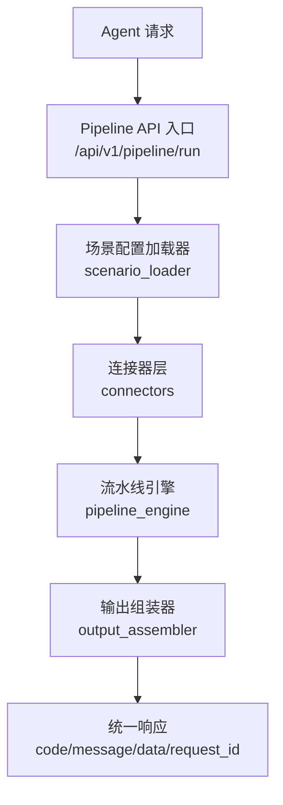
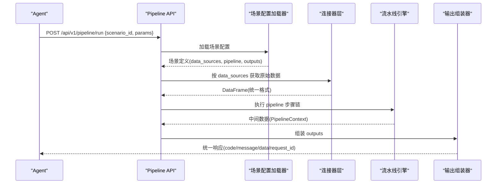
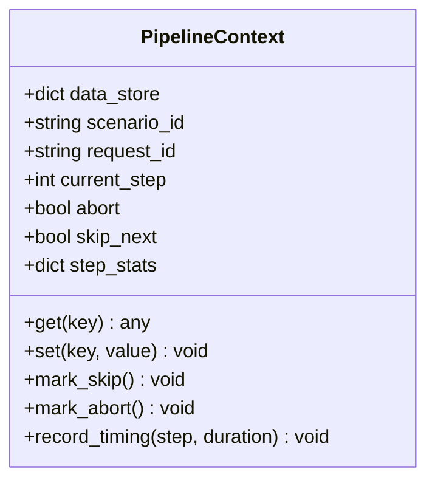
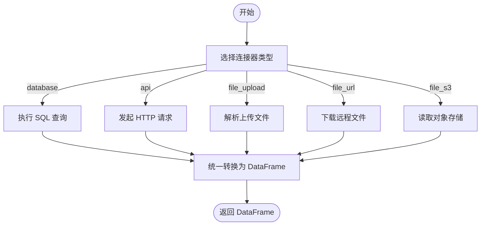
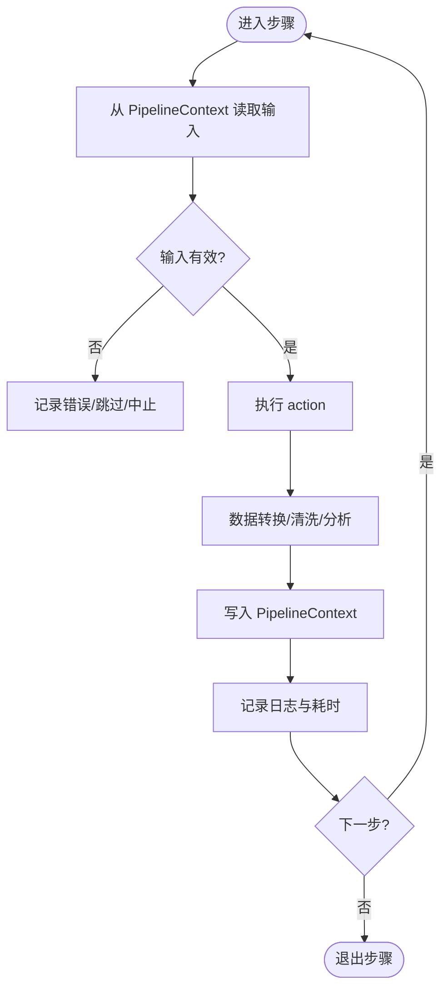
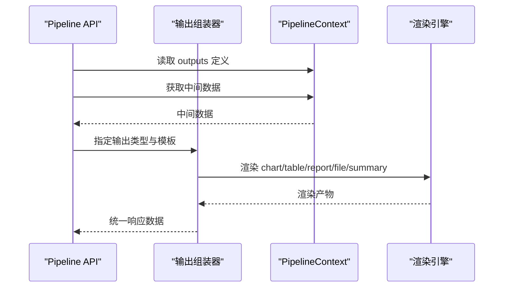
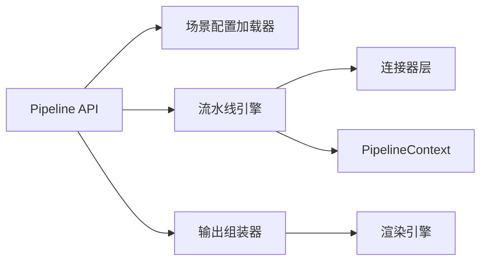
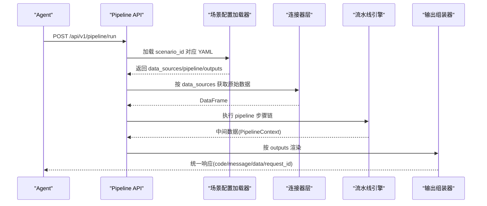
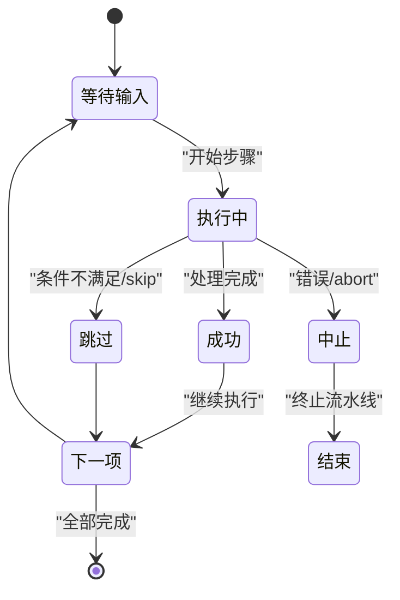

# 数据流设计

<cite>
**本文引用的文件**
- [需求说明文档](file://docs/20260821100000_hiagent辅助Web服务_需求说明.md)
</cite>

## 目录
1. [引言](#引言)
2. [项目结构](#项目结构)
3. [核心组件](#核心组件)
4. [架构总览](#架构总览)
5. [详细组件分析](#详细组件分析)
6. [依赖关系分析](#依赖关系分析)
7. [性能与缓存策略](#性能与缓存策略)
8. [错误处理与数据验证](#错误处理与数据验证)
9. [监控与可观测性](#监控与可观测性)
10. [结论](#结论)
11. [附录：关键流程图与时序图](#附录：关键流程图与时序图)

## 引言
本文件面向 hiagent 辅助 Web 服务的数据流设计，聚焦从 Agent 请求到最终输出的完整流转过程。内容覆盖请求接收、场景配置加载、数据获取、数据处理、输出组装等关键环节；重点解释 PipelineContext 的设计与作用（中间数据传递、步骤间依赖管理），并给出数据在各阶段的转换规则、错误处理与数据验证机制、缓存与性能优化建议以及监控指标。同时提供时序图与状态图，帮助开发者理解数据在组件间的流转。

## 项目结构
根据需求说明，系统采用“场景驱动 + 流水线引擎”的通用架构，关键新增目录与职责如下：
- app/core/pipeline_engine.py：流水线引擎，负责解析 YAML 场景、编排 Step 执行、维护 PipelineContext 生命周期
- app/core/scenario_loader.py：场景配置加载器，负责读取与校验 YAML 场景定义
- app/core/connectors/：连接器层，统一封装数据库、API、文件上传/下载/对象存储等数据源
- app/core/output_assembler.py：输出组装器，将处理结果渲染为 chart/table/report/file/summary
- app/scenarios/*.yaml：场景配置文件，描述 data_sources、pipeline、outputs
- app/api/v1/pipeline.py：Pipeline API 路由，暴露 /api/v1/pipeline/run 等入口

图表来源
- [需求说明文档:33-68](file://docs/20260821100000_hiagent辅助Web服务_需求说明.md#L33-L68)

章节来源
- [需求说明文档:106-114](file://docs/20260821100000_hiagent辅助Web服务_需求说明.md#L106-L114)

## 核心组件
- 场景配置模型（YAML）
  - data_sources：定义 connector 类型、连接参数、SQL/API 参数、请求参数映射
  - pipeline：步骤链，每个 step 通过 action 调用原子能力，并以命名引用传递输入/输出
  - outputs：定义 chart/table/report/file/summary 的输出目标与数据来源引用
- 连接器层（Connector Layer）
  - 支持 database、api、file_upload、file_url、file_s3 等类型
  - 统一返回 DataFrame，凭据从环境变量读取，注册表模式扩展
- 流水线引擎（Pipeline Engine）
  - 顺序执行步骤，通过 PipelineContext 传递中间数据
  - 支持条件分支、步骤级错误处理（skip/abort）
  - 每步独立记录日志和耗时
- 输出组装器（Output Assembler）
  - 支持 chart/table/report/file/summary 五种输出类型
  - summary 专为 Agent 设计，便于后续消费

章节来源
- [需求说明文档:40-64](file://docs/20260821100000_hiagent辅助Web服务_需求说明.md#L40-L64)

## 架构总览
整体数据流遵循“无状态、单一职责、输入输出标准化、容错优先、安全隔离、场景可配置、组件可复用”的原则。请求进入 Pipeline API 后，由场景配置加载器解析 YAML，随后通过连接器获取原始数据，交由流水线引擎按步骤处理，最后由输出组装器生成统一响应。

图表来源
- [需求说明文档:33-68](file://docs/20260821100000_hiagent辅助Web服务_需求说明.md#L33-L68)

## 详细组件分析

### PipelineContext 设计与作用
- 角色定位
  - 作为步骤间共享上下文，承载中间数据、元信息、错误与跳过标记、步骤耗时统计等
- 主要职责
  - 传递中间数据：以命名空间或键值方式保存各步骤产出，供后续步骤引用
  - 管理依赖关系：基于 YAML 中 input/output 引用，构建步骤间依赖图，确保执行顺序正确
  - 控制流程：支持条件分支、步骤级 skip/abort，影响后续步骤执行
  - 记录开销：记录每步开始/结束时间，汇总耗时用于性能分析与优化
- 数据结构要点（概念）
  - 中间数据区：DataFrame/字典/列表等，按步骤名或约定键名存取
  - 元信息区：scenario_id、request_id、当前步骤索引、全局配置
  - 控制区：skip/abort 标志、条件表达式结果
  - 统计区：步骤耗时、错误堆栈、重试次数
- 使用约束
  - 只读/写权限按步骤声明，避免跨步骤污染
  - 大对象尽量以引用传递，减少拷贝开销
  - 异常时保留上下文快照，便于回溯

图表来源
- [需求说明文档:57-64](file://docs/20260821100000_hiagent辅助Web服务_需求说明.md#L57-L64)

章节来源
- [需求说明文档:57-64](file://docs/20260821100000_hiagent辅助Web服务_需求说明.md#L57-L64)

### 数据获取（连接器层）
- 连接器类型
  - database：直连 MySQL/PostgreSQL/ClickHouse，执行 SQL 查询
  - api：调用外部 REST API，支持鉴权模板、超时重试
  - file_upload：接收 Agent 上传的文件（CSV/Excel/JSON）
  - file_url：从 URL 下载文件
  - file_s3：对象存储（后期扩展）
- 统一接口
  - 所有连接器返回统一 DataFrame，屏蔽底层差异
  - 凭据从环境变量读取，不硬编码
  - 注册表模式扩展新连接器，改动最小
- 数据格式
  - 输入：结构化/半结构化数据（SQL 结果、API JSON、文件内容）
  - 输出：pandas DataFrame（列名标准化、类型推断）

图表来源
- [需求说明文档:46-56](file://docs/20260821100000_hiagent辅助Web服务_需求说明.md#L46-L56)

章节来源
- [需求说明文档:46-56](file://docs/20260821100000_hiagent辅助Web服务_需求说明.md#L46-L56)

### 数据处理（流水线引擎）
- 执行模型
  - 顺序执行步骤，通过 YAML 中 pipeline 定义的 action 调用原子能力
  - 每步通过命名引用访问 PipelineContext 中的输入/输出
- 控制流
  - 条件分支：根据上下文变量决定是否执行某步
  - 错误处理：步骤级 skip/abort，不影响其他步骤继续执行（除非 abort）
  - 日志与耗时：每步记录开始/结束时间与异常信息
- 数据转换
  - 清洗：空值处理、类型转换、文本清洗、异常值检测
  - 分析：筛选、聚合、透视、排序、去重、统计分析
  - 可视化准备：为 chart/table/report 准备数据视图

图表来源
- [需求说明文档:57-64](file://docs/20260821100000_hiagent辅助Web服务_需求说明.md#L57-L64)

章节来源
- [需求说明文档:57-64](file://docs/20260821100000_hiagent辅助Web服务_需求说明.md#L57-L64)

### 输出组装（输出组装器）
- 输出类型
  - chart：柱状图/折线图/饼图/散点图/热力图/雷达图等，支持 PNG/SVG/HTML
  - table：数据表格，支持条件着色、排序
  - report：Jinja2 HTML 模板、Markdown 转 HTML
  - file：PDF/Word/Excel/PPT，支持模板
  - summary：专为 Agent 设计的摘要输出
- 数据来源
  - 从 PipelineContext 中按 outputs 定义的数据源引用读取中间数据
- 渲染流程
  - 数据适配：将 DataFrame 转为渲染所需结构
  - 模板填充：使用模板引擎注入数据与样式
  - 资源生成：生成图表/报告/文件并返回二进制或链接

图表来源
- [需求说明文档:62-64](file://docs/20260821100000_hiagent辅助Web服务_需求说明.md#L62-L64)

章节来源
- [需求说明文档:62-64](file://docs/20260821100000_hiagent辅助Web服务_需求说明.md#L62-L64)

### 两种调用模式
- 模式 A：Pipeline API（/api/v1/pipeline/run）
  - 传入 scenario_id + 参数，一次完成全流程
  - 适合 Agent 快速编排，降低复杂度
- 模式 B：原子 API（/api/v1/data/*、/api/v1/visual/* 等）
  - 逐步调用，Agent 自行编排
  - 适合灵活定制与调试

章节来源
- [需求说明文档:65-68](file://docs/20260821100000_hiagent辅助Web服务_需求说明.md#L65-L68)

## 依赖关系分析
- 组件耦合
  - Pipeline API 依赖场景配置加载器与输出组装器
  - 流水线引擎依赖连接器层与 PipelineContext
  - 输出组装器依赖渲染引擎与中间数据
- 外部依赖
  - FastAPI、pandas/numpy、DuckDB、matplotlib/plotly、WeasyPrint、httpx、Pydantic、PyYAML、SQLAlchemy、jsonpath-ng
- 潜在循环依赖
  - 应避免输出组装器反向依赖流水线引擎；通过 PipelineContext 解耦

图表来源
- [需求说明文档:106-114](file://docs/20260821100000_hiagent辅助Web服务_需求说明.md#L106-L114)

章节来源
- [需求说明文档:106-114](file://docs/20260821100000_hiagent辅助Web服务_需求说明.md#L106-L114)

## 性能与缓存策略
- 性能目标
  - 简单接口 < 500ms，数据处理 < 3s，Pipeline 全流程 < 10s
- 缓存策略
  - 场景配置缓存：YAML 热加载，避免重复解析
  - 数据源缓存：对频繁查询的 SQL/API 结果进行短期缓存（TTL 可控）
  - 中间数据缓存：PipelineContext 内大对象引用传递，减少序列化开销
  - 渲染缓存：图表/报告产物缓存，相同输入直接命中
- 优化技巧
  - 批量并发：API 编排支持单次/批量并发/链式请求
  - 流式处理：大文件/大数据集分块处理，降低内存峰值
  - 索引与投影：SQL 查询优化，仅拉取必要字段
  - 超时与限流：对外部 API 设置超时与速率限制，避免雪崩

章节来源
- [需求说明文档:97-102](file://docs/20260821100000_hiagent辅助Web服务_需求说明.md#L97-L102)

## 错误处理与数据验证
- 错误码规范
  - 1xxx 通用、2xxx 数据处理、3xxx 可视化、4xxx 文件文档、5xxx API 编排、6xxx Pipeline 引擎
- 数据验证
  - 输入校验：Pydantic 模型校验请求参数
  - 类型转换：自动类型推断与强制转换，失败时抛出明确错误
  - 完整性检查：必填字段、范围校验、唯一性约束
  - 异常值处理：空值填充、异常值剔除或标记
- 步骤级容错
  - skip：跳过当前步骤，继续后续步骤
  - abort：终止流水线，返回部分结果与错误信息
- 日志与追踪
  - 结构化日志包含 scenario_id、request_id、步骤耗时、错误堆栈

章节来源
- [需求说明文档:27-30](file://docs/20260821100000_hiagent辅助Web服务_需求说明.md#L27-L30)
- [需求说明文档:57-64](file://docs/20260821100000_hiagent辅助Web服务_需求说明.md#L57-L64)

## 监控与可观测性
- 健康检查：/health 提供服务状态
- 场景列表：/api/v1/pipeline/scenarios 列出可用场景
- 结构化日志：包含 scenario_id、步骤耗时、错误信息
- 指标采集：QPS、延迟分布、错误率、缓存命中率、内存/CPU 使用

章节来源
- [需求说明文档:97-102](file://docs/20260821100000_hiagent辅助Web服务_需求说明.md#L97-L102)

## 结论
本数据流设计以场景配置驱动为核心，通过统一的连接器层与流水线引擎实现多场景复用与灵活编排。PipelineContext 作为中间数据载体，保障步骤间依赖管理与流程控制。结合严格的错误处理与数据验证、完善的监控与可观测性，系统在性能、安全与可维护性方面具备良好基础。后续可按路线图逐步完善文档与报告能力，并持续优化性能与扩展性。

## 附录：关键流程图与时序图

### 端到端数据流时序图

图表来源
- [需求说明文档:33-68](file://docs/20260821100000_hiagent辅助Web服务_需求说明.md#L33-L68)

### 流水线步骤状态图

图表来源
- [需求说明文档:57-64](file://docs/20260821100000_hiagent辅助Web服务_需求说明.md#L57-L64)