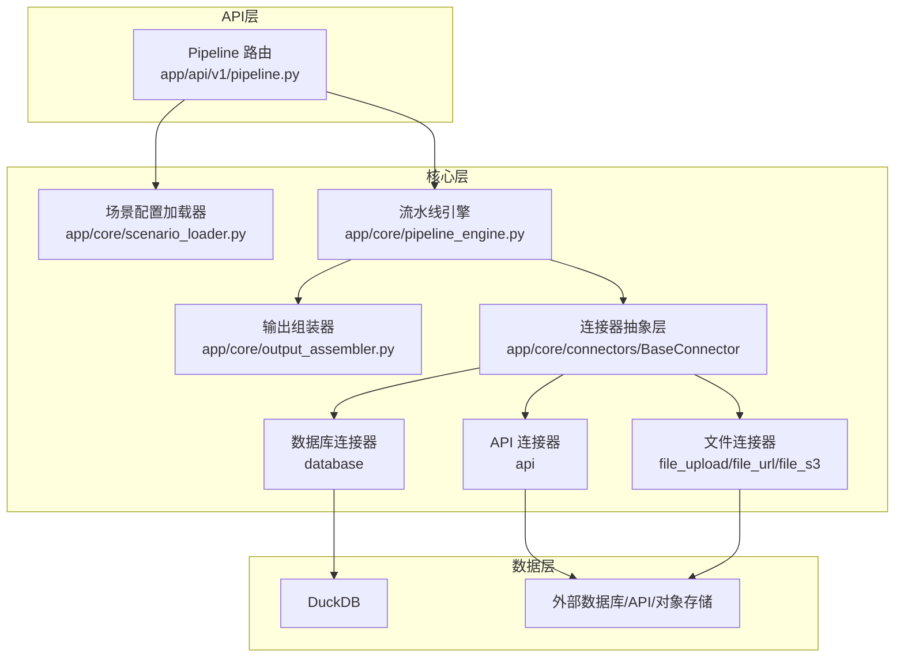
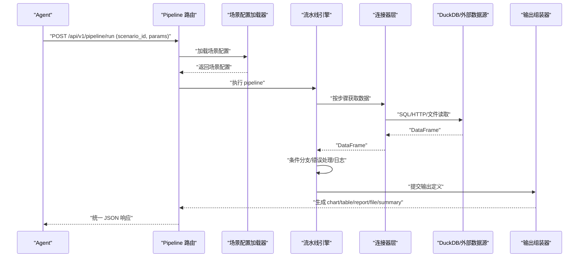
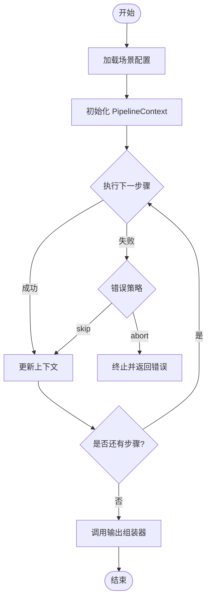
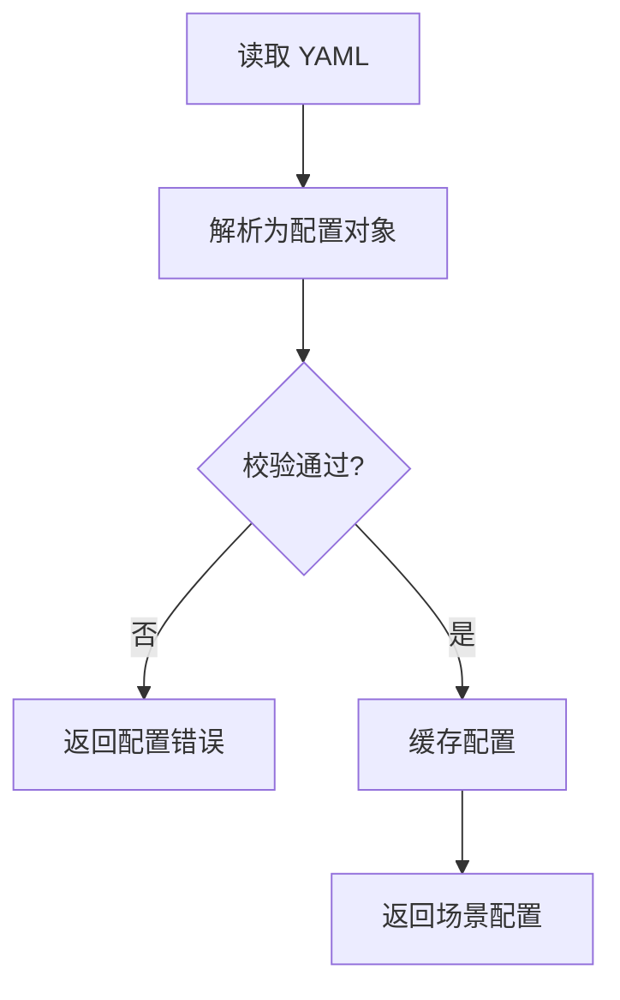
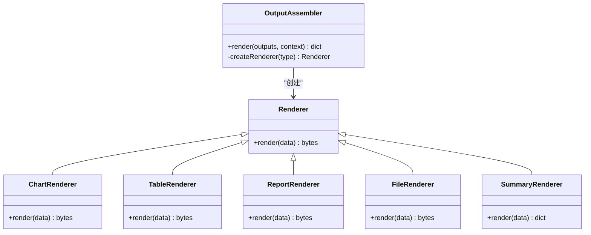
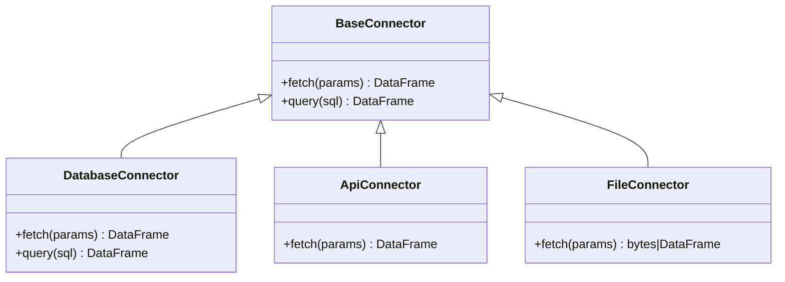
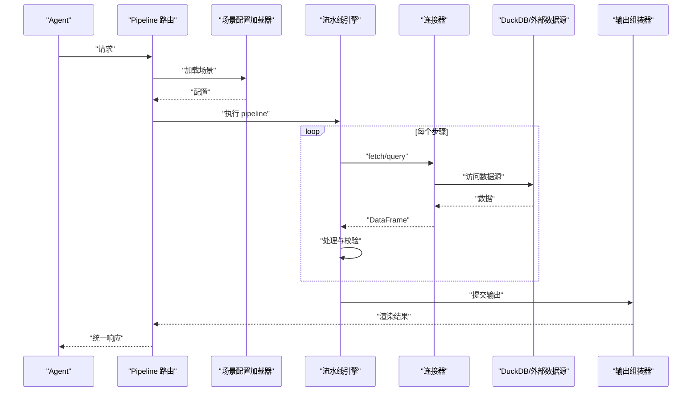
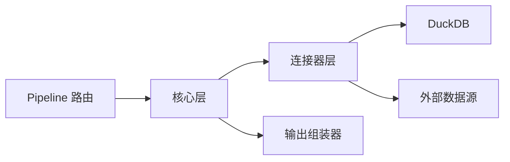

# 架构设计

<cite>
**本文引用的文件**
- [hiagent_辅助_Web_服务需求说明_task-242.md](file://docs\hiagent_辅助_Web_服务需求说明_task-242.md)
</cite>

## 目录
1. [引言](#引言)
2. [项目结构](#项目结构)
3. [核心组件](#核心组件)
4. [架构总览](#架构总览)
5. [详细组件分析](#详细组件分析)
6. [依赖关系分析](#依赖关系分析)
7. [性能考量](#性能考量)
8. [故障排查指南](#故障排查指南)
9. [结论](#结论)
10. [附录](#附录)

## 引言
本架构设计文档面向 hiagent 辅助 Web 服务，目标是基于“场景驱动 + 流水线引擎”的通用架构，支撑多种业务分析场景（竞品分析、机构行为分析、产品规模增量分析等）。系统遵循无状态、单一职责、输入输出标准化、容错优先、安全隔离、场景可配置与组件可复用的原则。通过统一接口规范、连接器抽象层、Pipeline 引擎与输出组装器，实现从 Agent 请求到最终输出的端到端处理流程。

## 项目结构
根据需求说明书，关键新增目录与职责如下：
- app/core/pipeline_engine.py：流水线引擎，负责步骤顺序执行、上下文传递、条件分支与错误处理
- app/core/scenario_loader.py：场景配置加载器，负责 YAML 场景配置的解析与校验
- app/core/connectors/：数据连接器集合，包含 BaseConnector 基类及 database/api/file 等具体实现
- app/core/output_assembler.py：输出组装器，支持 chart/table/report/file/summary 五种输出类型
- app/scenarios/*.yaml：场景配置文件，描述 data_sources、pipeline、outputs
- app/api/v1/pipeline.py：Pipeline API 路由，暴露 POST /api/v1/pipeline/run 等入口

图表来源
- [hiagent_辅助_Web_服务需求说明_task-242.md:106-115](file://docs\hiagent_辅助_Web_服务需求说明_task-242.md#L106-L115)

章节来源
- [hiagent_辅助_Web_服务需求说明_task-242.md:106-115](file://docs\hiagent_辅助_Web_服务需求说明_task-242.md#L106-L115)

## 核心组件
- Pipeline 引擎：按 YAML 中 pipeline 定义的步骤顺序执行，使用 PipelineContext 在步骤间传递中间数据；支持条件分支、步骤级错误处理（skip/abort），并记录每步日志与耗时
- 场景配置加载器：读取 app/scenarios/*.yaml，解析 data_sources、pipeline、outputs，并进行基础校验与缓存
- 输出组装器：将处理结果渲染为 chart/table/report/file/summary，其中 summary 专为 Agent 消费设计
- 连接器抽象层：BaseConnector 定义统一的 fetch/query 接口，各具体连接器实现不同数据源接入，返回统一 DataFrame；凭据从环境变量读取，扩展新连接器只需注册

章节来源
- [hiagent_辅助_Web_服务需求说明_task-242.md:33-68](file://docs\hiagent_辅助_Web_服务需求说明_task-242.md#L33-L68)

## 架构总览
系统采用分层架构与插件化模式：
- API 层：FastAPI 提供统一 JSON 响应格式与 API Key 认证，暴露 Pipeline API 与原子 API
- 核心层：场景配置加载器、Pipeline 引擎、输出组装器、连接器抽象层
- 数据层：DuckDB 用于 SQL 查询与高性能数据处理；外部数据库/API/对象存储通过连接器接入

技术选型权衡：
- FastAPI：异步高并发、自动文档、类型校验友好
- DuckDB：DataFrame 查询性能优于 pandasql，适合本地快速分析
- PyYAML：场景配置可读性好，便于维护与注释
- httpx：HTTP 客户端，便于 API 连接器调用外部服务
- Pydantic：请求/响应模型校验，提升健壮性
- SQLAlchemy：可选持久化或元数据管理
- jsonpath-ng：灵活的数据提取与转换
- WeasyPrint/Plotly/matplotlib：报告与可视化渲染

图表来源
- [hiagent_辅助_Web_服务需求说明_task-242.md:33-68](file://docs\hiagent_辅助_Web_服务需求说明_task-242.md#L33-L68)

## 详细组件分析

### Pipeline 引擎的执行机制
- 步骤顺序执行：按 YAML 中 pipeline 的顺序依次执行每个 Step
- 上下文传递：使用 PipelineContext 在各步骤间共享中间数据，避免全局状态
- 条件分支：支持基于上下文的条件判断，动态选择后续步骤
- 错误处理：步骤级 skip/abort，保证整体流程可控
- 可观测性：每步记录日志与耗时，便于定位瓶颈

图表来源
- [hiagent_辅助_Web_服务需求说明_task-242.md:57-63](file://docs\hiagent_辅助_Web_服务需求说明_task-242.md#L57-L63)

章节来源
- [hiagent_辅助_Web_服务需求说明_task-242.md:57-63](file://docs\hiagent_辅助_Web_服务需求说明_task-242.md#L57-L63)

### 场景配置加载器的工作原理
- 配置结构：data_sources（connector 类型 + 连接配置 + SQL/API 参数 + 请求参数映射）、pipeline（action 调用 + input/output 命名引用）、outputs（chart/table/report/file/summary）
- 加载流程：读取 YAML -> 解析 -> 校验字段与依赖 -> 缓存配置
- 热加载：支持运行时重新加载场景配置，减少重启成本

图表来源
- [hiagent_辅助_Web_服务需求说明_task-242.md:40-45](file://docs\hiagent_辅助_Web_服务需求说明_task-242.md#L40-L45)

章节来源
- [hiagent_辅助_Web_服务需求说明_task-242.md:40-45](file://docs\hiagent_辅助_Web_服务需求说明_task-242.md#L40-L45)

### 输出组装器的设计模式
- 输出类型：chart/table/report/file/summary，每种类型对应不同的渲染逻辑
- 设计模式：策略模式（不同输出类型的渲染策略）、工厂模式（根据 outputs 定义创建具体渲染器）
- 数据绑定：通过命名引用将中间数据绑定到模板或图表配置
- Agent 优化：summary 输出精简结构化信息，便于 Agent 消费

图表来源
- [hiagent_辅助_Web_服务需求说明_task-242.md:62-63](file://docs\hiagent_辅助_Web_服务需求说明_task-242.md#L62-L63)

章节来源
- [hiagent_辅助_Web_服务需求说明_task-242.md:62-63](file://docs\hiagent_辅助_Web_服务需求说明_task-242.md#L62-L63)

### 连接器抽象层的设计
- BaseConnector：定义统一的 fetch/query 接口，屏蔽底层差异
- 具体实现：
  - database：直连 MySQL/PostgreSQL/ClickHouse，执行 SQL 返回 DataFrame
  - api：调用外部 REST API，支持鉴权模板、重试、限流
  - file_upload/file_url/file_s3：上传/下载/对象存储读取，返回 DataFrame 或二进制数据
- 注册表模式：新增连接器只需注册类型与实现，改动最小
- 凭据管理：从环境变量读取，不硬编码

图表来源
- [hiagent_辅助_Web_服务需求说明_task-242.md:46-56](file://docs\hiagent_辅助_Web_服务需求说明_task-242.md#L46-L56)

章节来源
- [hiagent_辅助_Web_服务需求说明_task-242.md:46-56](file://docs\hiagent_辅助_Web_服务需求说明_task-242.md#L46-L56)

### 数据流设计：从 Agent 请求到最终输出
- 入口：POST /api/v1/pipeline/run，携带 scenario_id 与参数
- 配置加载：场景配置加载器解析 YAML，准备 data_sources、pipeline、outputs
- 数据获取：Pipeline 引擎按步骤调用连接器，获取 DataFrame
- 数据处理：在 PipelineContext 中进行筛选、聚合、透视、排序、去重、清洗、统计
- 输出组装：根据 outputs 定义渲染 chart/table/report/file/summary
- 响应：统一 JSON 格式（code/message/data/request_id），附带 request_id 用于追踪

图表来源
- [hiagent_辅助_Web_服务需求说明_task-242.md:33-68](file://docs\hiagent_辅助_Web_服务需求说明_task-242.md#L33-L68)

章节来源
- [hiagent_辅助_Web_服务需求说明_task-242.md:33-68](file://docs\hiagent_辅助_Web_服务需求说明_task-242.md#L33-L68)

## 依赖关系分析
- API 层依赖核心层：Pipeline 路由依赖场景配置加载器与流水线引擎
- 核心层依赖数据层：连接器依赖 DuckDB 与外部数据源
- 插件化扩展：新增连接器或输出类型对现有代码侵入小
- 外部依赖：httpx、PyYAML、Pydantic、jsonpath-ng、WeasyPrint、Plotly、matplotlib

图表来源
- [hiagent_辅助_Web_服务需求说明_task-242.md:106-115](file://docs\hiagent_辅助_Web_服务需求说明_task-242.md#L106-L115)

章节来源
- [hiagent_辅助_Web_服务需求说明_task-242.md:106-115](file://docs\hiagent_辅助_Web_服务需求说明_task-242.md#L106-L115)

## 性能考量
- 简单接口 < 500ms，数据处理 < 3s，Pipeline 全流程 < 10s
- 使用 DuckDB 提升 SQL 查询与 DataFrame 操作性能
- 步骤级日志与耗时记录，便于定位瓶颈
- 临时文件管理：2 小时自动清理，避免磁盘占用
- 并发与限流：API 连接器支持批量并发与速率限制

章节来源
- [hiagent_辅助_Web_服务需求说明_task-242.md:97-103](file://docs\hiagent_辅助_Web_服务需求说明_task-242.md#L97-L103)

## 故障排查指南
- 统一错误码：1xxx 通用、2xxx 数据处理、3xxx 可视化、4xxx 文件文档、5xxx API 编排、6xxx Pipeline 引擎
- 可观测性：结构化日志含 scenario_id 与步骤耗时；提供 /health 与健康检查
- 常见问题：
  - 配置错误：检查 YAML 字段与依赖引用
  - 连接器失败：验证凭据与环境变量
  - 超时/限流：调整 API 连接器重试与限流策略
  - 资源占用：监控临时文件与内存使用

章节来源
- [hiagent_辅助_Web_服务需求说明_task-242.md:25-31](file://docs\hiagent_辅助_Web_服务需求说明_task-242.md#L25-L31)
- [hiagent_辅助_Web_服务需求说明_task-242.md:97-103](file://docs\hiagent_辅助_Web_服务需求说明_task-242.md#L97-L103)

## 结论
本架构以“场景驱动 + 流水线引擎”为核心，结合连接器抽象层与输出组装器，实现了高内聚、低耦合、可扩展的 hiagent 辅助 Web 服务。通过 FastAPI、DuckDB、PyYAML 等技术栈的选择，兼顾了性能、可维护性与易用性。未来可按路线图逐步完善文档与报告能力，并持续扩展更多场景与连接器。

## 附录
- 两种调用模式：
  - Pipeline API：POST /api/v1/pipeline/run，传入 scenario_id 与参数，一次完成全流程
  - 原子 API：/api/v1/data/*、/api/v1/visual/* 等，逐步调用，Agent 自行编排
- 关键决策记录：
  - 核心架构：Pipeline + 原子 API 双模式
  - 场景配置格式：YAML
  - SQL 引擎：DuckDB
  - 连接器模式：注册表模式（BaseConnector）
  - 文件存储：本地临时目录

章节来源
- [hiagent_辅助_Web_服务需求说明_task-242.md:65-68](file://docs\hiagent_辅助_Web_服务需求说明_task-242.md#L65-L68)
- [hiagent_辅助_Web_服务需求说明_task-242.md:134-142](file://docs\hiagent_辅助_Web_服务需求说明_task-242.md#L134-L142)