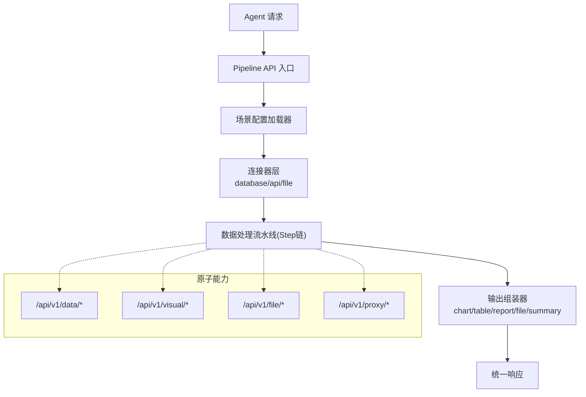
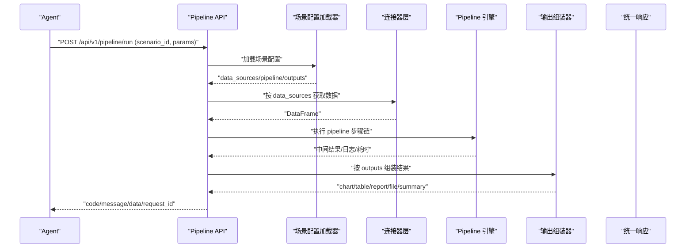
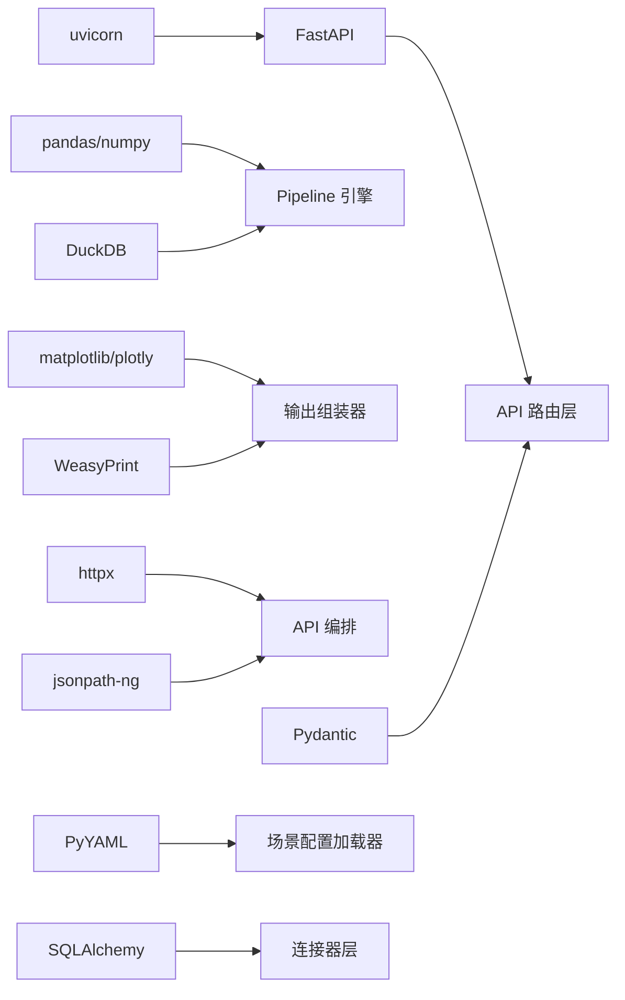

# 系统概览

<cite>
**本文引用的文件**
- [hiagent_辅助_Web_服务需求说明_task-242.md](file://docs\hiagent_辅助_Web_服务需求说明_task-242.md)
</cite>

## 目录
1. [简介](#简介)
2. [项目结构](#项目结构)
3. [核心组件](#核心组件)
4. [架构总览](#架构总览)
5. [详细组件分析](#详细组件分析)
6. [依赖关系分析](#依赖关系分析)
7. [性能与可观测性](#性能与可观测性)
8. [故障排查指南](#故障排查指南)
9. [结论](#结论)
10. [附录：调用模式对比](#附录调用模式对比)

## 简介
本系统为 hiagent 辅助 Web 服务，面向多种业务分析场景的 AI Agent 应用。典型场景包括竞品分析、机构行为分析、产品规模增量分析等。每种场景的数据来源、处理逻辑与输出结果不同，因此采用“配置驱动”的通用架构，以统一接口和流水线引擎支撑多场景快速落地。

核心原则
- 无状态：服务不保存会话状态，便于水平扩展与弹性伸缩。
- 单一职责：各模块职责清晰，数据、可视化、文件、编排各司其职。
- 输入输出标准化：统一 JSON 响应格式与错误码分段，降低集成成本。
- 容错优先：步骤级错误处理（跳过/中止），保障整体流程稳健。
- 安全隔离：API Key 认证、SQL 注入防护、凭据环境变量管理、文件沙箱。
- 场景可配置：通过 YAML 描述数据源、流水线步骤与输出定义。
- 组件可复用：连接器注册表模式，新增能力改动最小。

技术选型与优势
- FastAPI：高性能异步 Web 框架，天然支持 OpenAPI/Swagger，利于 API 治理与文档化。
- DuckDB：内存列式数据库，DataFrame 查询性能优于 pandasql，适合轻量数据分析。
- pandas/numpy：数据处理与分析生态完善，便于清洗、聚合、透视与统计。
- matplotlib/plotly：图表生成能力强，支持 PNG/SVG/HTML 等多格式输出。
- WeasyPrint：将 HTML/Markdown 渲染为 PDF，满足报告输出需求。
- httpx：现代 HTTP 客户端，支持并发与重试，适配外部 API 编排。
- Pydantic：请求/响应模型校验，提升接口契约稳定性。
- PyYAML：场景配置可读性强，支持注释与结构化描述。
- SQLAlchemy：关系型数据访问抽象，便于后续扩展更多数据源。
- jsonpath-ng：灵活的数据提取与转换，适配复杂 JSON 结构。
- Docker/uvicorn：容器化部署与高效 ASGI 服务器，便于交付与运维。

章节来源
- [hiagent_辅助_Web_服务需求说明_task-242.md:5-15](file://docs\hiagent_辅助_Web_服务需求说明_task-242.md#L5-L15)
- [hiagent_辅助_Web_服务需求说明_task-242.md:19-21](file://docs\hiagent_辅助_Web_服务需求说明_task-242.md#L19-L21)

## 项目结构
基于需求说明书，项目采用“核心引擎 + 原子能力 + 场景配置”的分层组织方式：
- 核心引擎：Pipeline 引擎、场景配置加载器、输出组装器
- 数据接入：连接器层（database/api/file_upload/file_url/file_s3）
- 原子能力：数据处理、可视化与渲染、文件与文档操作、API 编排
- 场景配置：按业务场景划分的 YAML 配置文件
- 路由层：Pipeline API 入口与各原子 API 路由

图示来源
- [hiagent_辅助_Web_服务需求说明_task-242.md:33-68](file://docs\hiagent_辅助_Web_服务需求说明_task-242.md#L33-L68)

章节来源
- [hiagent_辅助_Web_服务需求说明_task-242.md:106-115](file://docs\hiagent_辅助_Web_服务需求说明_task-242.md#L106-L115)

## 核心组件
- 场景配置加载器：解析 YAML 中的 data_sources、pipeline、outputs，完成参数映射与依赖解析。
- 连接器层：统一返回 DataFrame，凭据从环境变量读取，支持注册表扩展。
- Pipeline 引擎：顺序执行 Step 链，命名引用传递中间数据，支持条件分支与步骤级错误处理。
- 输出组装器：根据 outputs 定义生成 chart/table/report/file/summary，其中 summary 专为 Agent 设计。
- 原子能力：提供数据导入/查询/清洗/统计、图表渲染、文件转换与打包、HTTP 代理与数据转换等能力。

章节来源
- [hiagent_辅助_Web_服务需求说明_task-242.md:33-68](file://docs\hiagent_辅助_Web_服务需求说明_task-242.md#L33-L68)
- [hiagent_辅助_Web_服务需求说明_task-242.md:71-94](file://docs\hiagent_辅助_Web_服务需求说明_task-242.md#L71-L94)

## 架构总览
下图展示从 Agent 请求到最终输出的完整处理流程，涵盖两种调用模式：Pipeline 模式（端到端）与原子 API 模式（逐步编排）。

图示来源
- [hiagent_辅助_Web_服务需求说明_task-242.md:33-68](file://docs\hiagent_辅助_Web_服务需求说明_task-242.md#L33-L68)

## 详细组件分析

### 场景配置模型（YAML）
- data_sources：定义 connector 类型、连接配置、SQL/API 参数与请求参数映射。
- pipeline：步骤链，每个步骤调用原子能力，并通过命名引用传递中间数据。
- outputs：定义输出类型（chart/table/report/file/summary）及数据来源引用。

章节来源
- [hiagent_辅助_Web_服务需求说明_task-242.md:40-44](file://docs\hiagent_辅助_Web_服务需求说明_task-242.md#L40-L44)

### 连接器层（Connector Layer）
- 类型覆盖：database、api、file_upload、file_url、file_s3（后期扩展）。
- 统一返回 DataFrame，凭据从环境变量读取，注册表模式便于扩展。

章节来源
- [hiagent_辅助_Web_服务需求说明_task-242.md:46-55](file://docs\hiagent_辅助_Web_服务需求说明_task-242.md#L46-L55)

### Pipeline 引擎
- 顺序执行 Step 链，通过 PipelineContext 命名引用传递中间数据。
- 支持条件分支与步骤级错误处理（skip/abort）。
- 每步独立记录日志与耗时，便于追踪与优化。

章节来源
- [hiagent_辅助_Web_服务需求说明_task-242.md:57-61](file://docs\hiagent_辅助_Web_服务需求说明_task-242.md#L57-L61)

### 输出组装器
- 支持 chart/table/report/file/summary 五种输出类型。
- summary 专为 Agent 设计，便于下游消费与二次加工。

章节来源
- [hiagent_辅助_Web_服务需求说明_task-242.md:62-64](file://docs\hiagent_辅助_Web_服务需求说明_task-242.md#L62-L64)

### 原子能力
- 数据处理：导入解析（CSV/Excel/JSON）、SQL 查询（DuckDB）、筛选/聚合/透视/排序/去重、清洗、统计分析。
- 可视化与渲染：图表生成（PNG/SVG/HTML）、报告渲染（Jinja2/Markdown）、表格渲染（条件着色/排序）。
- 文件与文档：格式互转、文档生成（PDF/Word/Excel/PPT）、打包解压、元信息查询、临时文件管理（2小时清理/流式下载）。
- API 编排：HTTP 代理（单次/批量并发/链式）、数据转换（jq/XML-JSON/扁平化）、超时重试、速率限制、鉴权模板。

章节来源
- [hiagent_辅助_Web_服务需求说明_task-242.md:71-94](file://docs\hiagent_辅助_Web_服务需求说明_task-242.md#L71-L94)

### 统一接口规范
- 统一 JSON 响应格式：code/message/data/request_id。
- 错误码分段：1xxx 通用、2xxx 数据处理、3xxx 可视化、4xxx 文件文档、5xxx API 编排、6xxx Pipeline 引擎。
- 认证：X-API-Key Header。

章节来源
- [hiagent_辅助_Web_服务需求说明_task-242.md:25-30](file://docs\hiagent_辅助_Web_服务需求说明_task-242.md#L25-L30)

## 依赖关系分析
- 运行时依赖：FastAPI、pandas/numpy、DuckDB、matplotlib/plotly、WeasyPrint、httpx、Pydantic、PyYAML、SQLAlchemy、jsonpath-ng、uvicorn。
- 部署依赖：Docker 容器化，环境变量配置，场景配置热加载。

图示来源
- [hiagent_辅助_Web_服务需求说明_task-242.md:19-21](file://docs\hiagent_辅助_Web_服务需求说明_task-242.md#L19-L21)
- [hiagent_辅助_Web_服务需求说明_task-242.md:97-102](file://docs\hiagent_辅助_Web_服务需求说明_task-242.md#L97-L102)

章节来源
- [hiagent_辅助_Web_服务需求说明_task-242.md:19-21](file://docs\hiagent_辅助_Web_服务需求说明_task-242.md#L19-L21)
- [hiagent_辅助_Web_服务需求说明_task-242.md:97-102](file://docs\hiagent_辅助_Web_服务需求说明_task-242.md#L97-L102)

## 性能与可观测性
- 性能目标：简单接口 < 500ms；数据处理 < 3s；Pipeline 全流程 < 10s。
- 可观测性：结构化日志包含 scenario_id 与步骤耗时；提供 /health 健康检查；暴露 /api/v1/pipeline/scenarios 列表接口。
- 部署：Docker 容器化，环境变量配置，场景配置热加载。

章节来源
- [hiagent_辅助_Web_服务需求说明_task-242.md:97-102](file://docs\hiagent_辅助_Web_服务需求说明_task-242.md#L97-L102)

## 故障排查指南
- 认证失败：检查 X-API-Key Header 是否携带有效密钥。
- 数据源异常：确认连接器配置与凭据环境变量是否正确；验证 SQL/API 参数映射。
- 步骤失败：查看步骤级日志与耗时，依据 skip/abort 策略定位问题。
- 输出异常：核对 outputs 定义与数据来源引用；检查图表/报告模板与依赖。
- 性能瓶颈：关注数据处理与可视化阶段耗时，考虑分页/采样/缓存策略。

章节来源
- [hiagent_辅助_Web_服务需求说明_task-242.md:25-30](file://docs\hiagent_辅助_Web_服务需求说明_task-242.md#L25-L30)
- [hiagent_辅助_Web_服务需求说明_task-242.md:57-61](file://docs\hiagent_辅助_Web_服务需求说明_task-242.md#L57-L61)
- [hiagent_辅助_Web_服务需求说明_task-242.md:97-102](file://docs\hiagent_辅助_Web_服务需求说明_task-242.md#L97-L102)

## 结论
hiagent 辅助 Web 服务通过“配置驱动的流水线引擎 + 原子能力”的架构，实现了多业务分析场景的统一接入与高效交付。借助 FastAPI、DuckDB、pandas 等技术栈，系统在性能、可扩展性与可维护性方面具备良好基础。通过两种调用模式（Pipeline 与原子 API），既能降低 Agent 编排复杂度，又保留灵活定制空间。

## 附录：调用模式对比
- Pipeline API 模式
  - 入口：POST /api/v1/pipeline/run
  - 输入：scenario_id + 参数
  - 特点：一次完成全流程，减少 Agent 编排复杂度
  - 适用：标准场景的快速交付与批量任务
- 原子 API 模式
  - 入口：/api/v1/data/*、/api/v1/visual/*、/api/v1/file/*、/api/v1/proxy/*
  - 特点：逐步调用，Agent 自行编排
  - 适用：复杂定制流程、细粒度控制与动态组合

章节来源
- [hiagent_辅助_Web_服务需求说明_task-242.md:65-68](file://docs\hiagent_辅助_Web_服务需求说明_task-242.md#L65-L68)