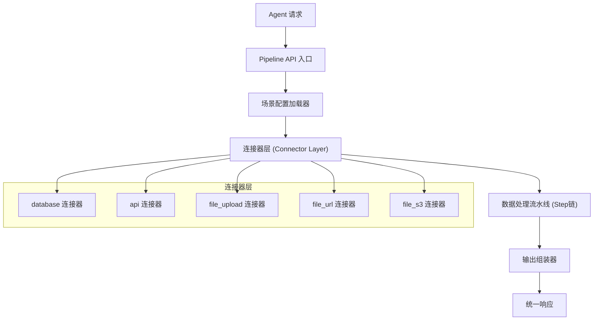
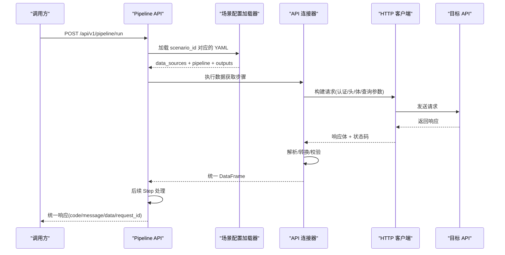
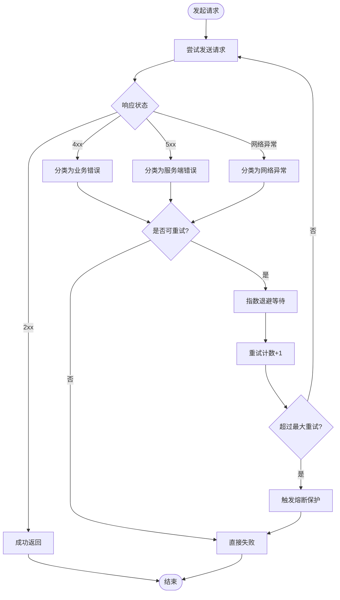
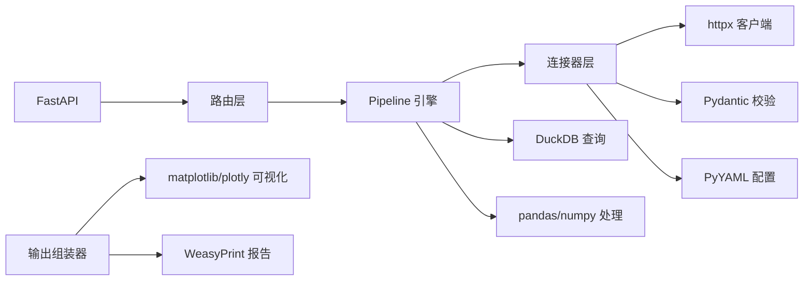

# API连接器

<cite>
**本文档中引用的文件**
- [20260821100000_hiagent辅助Web服务_需求说明.md](file://docs/20260821100000_hiagent辅助Web服务_需求说明.md)
</cite>

## 目录
1. [简介](#简介)
2. [项目结构](#项目结构)
3. [核心组件](#核心组件)
4. [架构总览](#架构总览)
5. [详细组件分析](#详细组件分析)
6. [依赖关系分析](#依赖关系分析)
7. [性能与并发控制](#性能与并发控制)
8. [错误处理与可观测性](#错误处理与可观测性)
9. [调用示例](#调用示例)
10. [故障排查指南](#故障排查指南)
11. [结论](#结论)

## 简介
本文件面向“hiagent 辅助 Web 服务”的 API 连接器（Connector）模块，聚焦于外部 REST API 调用的完整实现方案：包括 HTTP 客户端配置、请求构建、响应解析、认证方式（API Key、OAuth2、JWT Token）、重试机制（指数退避、失败分类、熔断保护）、速率限制与并发控制、数据格式转换（JSON/XML/表单）、错误处理与日志记录最佳实践，以及完整的调用示例与故障排查指南。该设计遵循需求说明书中的统一接口规范与场景驱动流水线架构，确保无状态、单一职责、输入输出标准化、容错优先与安全隔离。

## 项目结构
根据需求说明书，连接器层位于 app/core/connectors/，其中 api 类型连接器负责调用外部 REST API；Pipeline 引擎通过场景 YAML 加载 data_sources 配置，将 connector 作为数据获取层接入流水线。整体流程为：Agent 请求 -> Pipeline API 入口 -> 场景配置加载器 -> 数据获取层（Connector）-> 数据处理流水线（Step链）-> 输出组装器 -> 统一响应。

图表来源
- [20260821100000_hiagent辅助Web服务_需求说明.md:33-67](file://docs/20260821100000_hiagent辅助Web服务_需求说明.md#L33-L67)

章节来源
- [20260821100000_hiagent辅助Web服务_需求说明.md:33-67](file://docs/20260821100000_hiagent辅助Web服务_需求说明.md#L33-L67)

## 核心组件
- 统一响应模型：code/message/data/request_id，用于所有 API 返回，便于上层编排与错误码分段管理。
- 连接器基类：BaseConnector，采用注册表模式扩展新增连接器，保证最小改动接入新数据源。
- API 连接器：对外部 REST API 进行封装，支持多种认证、重试、限流、超时、数据格式转换等能力。
- Pipeline 上下文：在步骤间传递中间数据，支持命名引用、条件分支与步骤级错误处理（skip/abort）。
- 输出组装器：chart/table/report/file/summary 五种输出类型，summary 专为 Agent 设计。

章节来源
- [20260821100000_hiagent辅助Web服务_需求说明.md:25-31](file://docs/20260821100000_hiagent辅助Web服务_需求说明.md#L25-L31)
- [20260821100000_hiagent辅助Web服务_需求说明.md:46-63](file://docs/20260821100000_hiagent辅助Web服务_需求说明.md#L46-L63)

## 架构总览
API 连接器在 Pipeline 中承担“数据获取层”的职责，从外部 REST API 拉取数据并转换为统一的 DataFrame，供后续数据处理流水线使用。其关键特性包括：
- 认证模板化：API Key、OAuth2、JWT Token 等常见认证模式可配置。
- 重试与熔断：指数退避、失败分类、熔断保护，避免雪崩。
- 速率限制与并发控制：令牌桶/漏桶限流，连接池与并发度控制，避免对第三方 API 造成压力。
- 数据格式转换：自动识别 JSON/XML/表单，并进行扁平化、字段映射与类型推断。
- 可观测性：结构化日志包含 scenario_id、步骤耗时、request_id 等。

图表来源
- [20260821100000_hiagent辅助Web服务_需求说明.md:33-67](file://docs/20260821100000_hiagent辅助Web服务_需求说明.md#L33-L67)
- [20260821100000_hiagent辅助Web服务_需求说明.md:25-31](file://docs/20260821100000_hiagent辅助Web服务_需求说明.md#L25-L31)

## 详细组件分析

### HTTP 客户端配置
- 连接池与超时：合理设置连接池大小、连接/读取/写入超时，避免资源耗尽与长时间阻塞。
- TLS 与证书：启用 HTTPS，必要时配置自定义 CA 或跳过验证（仅测试环境）。
- 代理与网络：支持 HTTP/HTTPS 代理，适配企业内网环境。
- 用户代理与追踪：设置 User-Agent，开启请求 ID 透传以便链路追踪。

章节来源
- [20260821100000_hiagent辅助Web服务_需求说明.md:97-102](file://docs/20260821100000_hiagent辅助Web服务_需求说明.md#L97-L102)

### 请求构建
- 路径与查询参数：从 YAML 的 data_sources 中读取 endpoint、query、headers、body 映射。
- 内容类型：根据目标 API 要求设置 Content-Type（application/json、application/xml、application/x-www-form-urlencoded）。
- 认证注入：按认证模板注入 Header、Query、Body 或 Cookie。
- 幂等与去重：GET/HEAD/OPTIONS 默认幂等，支持请求签名与防抖。

章节来源
- [20260821100000_hiagent辅助Web服务_需求说明.md:40-55](file://docs/20260821100000_hiagent辅助Web服务_需求说明.md#L40-L55)

### 响应解析
- 自动格式识别：根据 Content-Type 或响应体特征识别 JSON/XML/表单。
- 字段映射与类型推断：将响应映射到 DataFrame，进行空值处理、类型转换、枚举校验。
- 分页与增量：支持分页游标、时间戳增量拉取，减少带宽与压力。
- 数据校验：使用 Pydantic 模型对关键字段进行强校验，提升健壮性。

章节来源
- [20260821100000_hiagent辅助Web服务_需求说明.md:25-31](file://docs/20260821100000_hiagent辅助Web服务_需求说明.md#L25-L31)
- [20260821100000_hiagent辅助Web服务_需求说明.md:73-77](file://docs/20260821100000_hiagent辅助Web服务_需求说明.md#L73-L77)

### 认证方式支持
- API Key：通过 X-API-Key 头部注入，支持多键轮换与环境变量管理。
- OAuth2：支持 Authorization Code、Client Credentials 等流程，缓存 Access Token，刷新策略可配置。
- JWT Token：支持 Bearer Token 注入，支持签名校验与过期检测。
- 安全隔离：凭据不硬编码，全部来自环境变量或密钥管理服务。

章节来源
- [20260821100000_hiagent辅助Web服务_需求说明.md:25-31](file://docs/20260821100000_hiagent辅助Web服务_需求说明.md#L25-L31)
- [20260821100000_hiagent辅助Web服务_需求说明.md:97-102](file://docs/20260821100000_hiagent辅助Web服务_需求说明.md#L97-L102)

### 请求重试机制
- 指数退避：失败时按指数增长等待时间重试，避免瞬时拥塞。
- 失败分类：区分网络异常、超时、服务端错误（如 5xx）、业务错误（如 4xx），仅对可重试错误进行重试。
- 熔断保护：连续失败达到阈值后进入熔断态，快速失败，周期性探测恢复。
- 最大重试次数与退避上限：防止无限重试与资源占用。

图表来源
- [20260821100000_hiagent辅助Web服务_需求说明.md:90-94](file://docs/20260821100000_hiagent辅助Web服务_需求说明.md#L90-L94)

章节来源
- [20260821100000_hiagent辅助Web服务_需求说明.md:90-94](file://docs/20260821100000_hiagent辅助Web服务_需求说明.md#L90-L94)

### 速率限制与并发控制
- 令牌桶/漏桶：按目标 API 的 QPS/TPM 限制进行限速，避免超限被封禁。
- 连接池与并发度：限制最大并发请求数与连接池大小，防止资源耗尽。
- 队列与背压：当下游处理能力不足时，通过队列缓冲与背压机制降低压力。
- 分片与批量：对大数据集进行分片拉取与批量合并，提高吞吐与稳定性。

章节来源
- [20260821100000_hiagent辅助Web服务_需求说明.md:90-94](file://docs/20260821100000_hiagent辅助Web服务_需求说明.md#L90-L94)

### 数据格式转换
- JSON：自动解析嵌套结构，扁平化处理，字段映射与类型推断。
- XML：支持 XPath/JsonPath 风格提取，转换为 DataFrame。
- 表单：application/x-www-form-urlencoded 与 multipart/form-data 支持。
- 编码检测：自动检测字符编码，避免乱码问题。

章节来源
- [20260821100000_hiagent辅助Web服务_需求说明.md:73-77](file://docs/20260821100000_hiagent辅助Web服务_需求说明.md#L73-L77)
- [20260821100000_hiagent辅助Web服务_需求说明.md:90-94](file://docs/20260821100000_hiagent辅助Web服务_需求说明.md#L90-L94)

### 错误处理与日志记录最佳实践
- 统一错误码：按模块分段（通用、数据处理、可视化、文件、API 编排、Pipeline 引擎），便于定位。
- 结构化日志：包含 scenario_id、步骤耗时、request_id、错误堆栈与上下文信息。
- 健康检查：提供 /health 端点，监控服务可用性。
- 可观测性：指标上报（QPS、延迟、错误率、熔断状态），便于告警与容量规划。

章节来源
- [20260821100000_hiagent辅助Web服务_需求说明.md:25-31](file://docs/20260821100000_hiagent辅助Web服务_需求说明.md#L25-L31)
- [20260821100000_hiagent辅助Web服务_需求说明.md:97-102](file://docs/20260821100000_hiagent辅助Web服务_需求说明.md#L97-L102)

## 依赖关系分析
- 技术选型：FastAPI、httpx、Pydantic、PyYAML、DuckDB、pandas/numpy、matplotlib/plotly、WeasyPrint、SQLAlchemy、jsonpath-ng、Docker/uvicorn。
- 连接器依赖：BaseConnector 抽象，api 连接器依赖 httpx 进行 HTTP 通信，依赖 Pydantic 进行数据校验，依赖 PyYAML 读取场景配置。
- 流水线依赖：Pipeline 引擎协调各 Step，输出组装器生成最终结果。

图表来源
- [20260821100000_hiagent辅助Web服务_需求说明.md:19-22](file://docs/20260821100000_hiagent辅助Web服务_需求说明.md#L19-L22)
- [20260821100000_hiagent辅助Web服务_需求说明.md:33-67](file://docs/20260821100000_hiagent辅助Web服务_需求说明.md#L33-L67)

章节来源
- [20260821100000_hiagent辅助Web服务_需求说明.md:19-22](file://docs/20260821100000_hiagent辅助Web服务_需求说明.md#L19-L22)
- [20260821100000_hiagent辅助Web服务_需求说明.md:33-67](file://docs/20260821100000_hiagent辅助Web服务_需求说明.md#L33-L67)

## 性能与并发控制
- 简单接口 < 500ms，数据处理 < 3s，Pipeline 全流程 < 10s。
- 通过连接池、并发度限制、速率限制与重试退避，平衡吞吐与稳定性。
- 使用 DuckDB 提升查询性能，pandas/numpy 加速数据处理。
- 临时文件管理与流式下载，减少内存占用。

章节来源
- [20260821100000_hiagent辅助Web服务_需求说明.md:97-102](file://docs/20260821100000_hiagent辅助Web服务_需求说明.md#L97-L102)
- [20260821100000_hiagent辅助Web服务_需求说明.md:84-89](file://docs/20260821100000_hiagent辅助Web服务_需求说明.md#L84-L89)

## 错误处理与可观测性
- 统一响应格式：code/message/data/request_id，便于上层统一处理。
- 错误码分段：1xxx 通用、2xxx 数据处理、3xxx 可视化、4xxx 文件文档、5xxx API 编排、6xxx Pipeline 引擎。
- 结构化日志：包含 scenario_id、步骤耗时、request_id，便于追踪与排障。
- 健康检查：/health 端点，监控服务状态。

章节来源
- [20260821100000_hiagent辅助Web服务_需求说明.md:25-31](file://docs/20260821100000_hiagent辅助Web服务_需求说明.md#L25-L31)
- [20260821100000_hiagent辅助Web服务_需求说明.md:97-102](file://docs/20260821100000_hiagent辅助Web服务_需求说明.md#L97-L102)

## 调用示例
- Pipeline API：POST /api/v1/pipeline/run，传入 scenario_id 与参数，一次完成全流程。
- 原子 API：/api/v1/data/*、/api/v1/visual/* 等，逐步调用，Agent 自行编排。
- 认证：通过 X-API-Key 头部进行 API Key 认证。
- 错误处理：根据 code 与 message 判断成功与否，data 中包含返回数据或错误详情。

章节来源
- [20260821100000_hiagent辅助Web服务_需求说明.md:25-31](file://docs/20260821100000_hiagent辅助Web服务_需求说明.md#L25-L31)
- [20260821100000_hiagent辅助Web服务_需求说明.md:65-67](file://docs/20260821100000_hiagent辅助Web服务_需求说明.md#L65-L67)

## 故障排查指南
- 网络异常：检查连接池、超时、代理、TLS 配置；查看日志中的 request_id 与错误堆栈。
- 认证失败：确认 API Key/OAuth2/JWT Token 是否正确注入；检查凭据来源与有效期。
- 速率限制：调整令牌桶/漏桶参数，降低并发度；观察目标 API 的 QPS/TPM 限制。
- 熔断触发：查看熔断状态与恢复探测；检查连续失败原因与阈值配置。
- 数据解析错误：检查 Content-Type 与响应体格式；使用 Pydantic 模型校验关键字段。
- 性能瓶颈：优化连接池大小、超时设置；使用 DuckDB 与 pandas/numpy 提升处理速度。

章节来源
- [20260821100000_hiagent辅助Web服务_需求说明.md:90-94](file://docs/20260821100000_hiagent辅助Web服务_需求说明.md#L90-L94)
- [20260821100000_hiagent辅助Web服务_需求说明.md:97-102](file://docs/20260821100000_hiagent辅助Web服务_需求说明.md#L97-L102)

## 结论
API 连接器作为 hiagent 辅助 Web 服务的核心数据获取层，通过统一的认证、重试、限流、格式转换与错误处理机制，确保了对外部 REST API 的稳定、高效与安全访问。结合 Pipeline 引擎与场景化配置，可实现多业务场景的快速接入与复用。建议在生产环境中严格遵循统一接口规范、强化可观测性与安全防护，持续优化性能与稳定性。