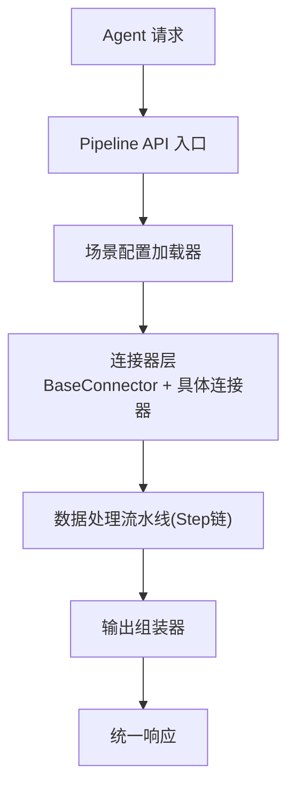
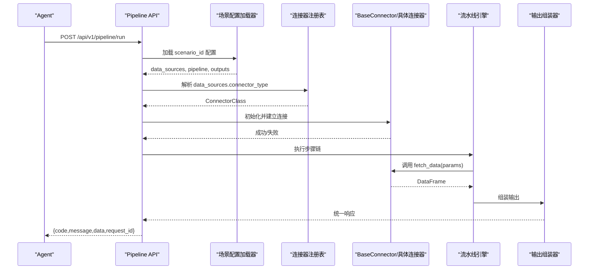
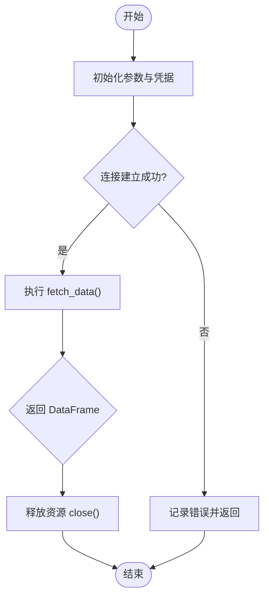
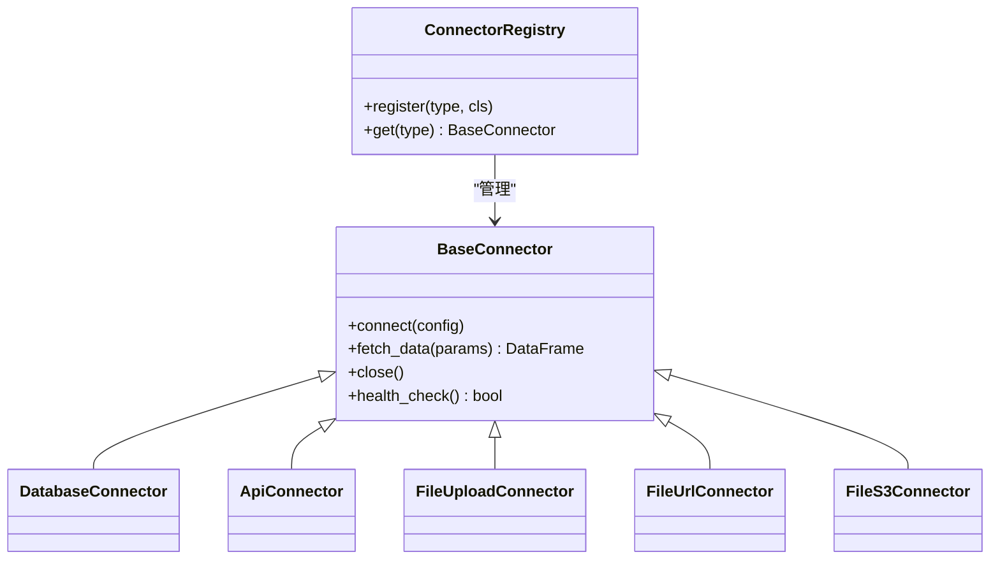

# 基础连接器设计

<cite>
**本文引用的文件**
- [需求说明文档](file://docs\20260821100000_hiagent辅助Web服务_需求说明.md)
</cite>

## 目录
1. [引言](#引言)
2. [项目结构](#项目结构)
3. [核心组件](#核心组件)
4. [架构总览](#架构总览)
5. [详细组件分析](#详细组件分析)
6. [依赖关系分析](#依赖关系分析)
7. [性能考量](#性能考量)
8. [故障排查指南](#故障排查指南)
9. [结论](#结论)
10. [附录：最佳实践与示例路径](#附录最佳实践与示例路径)

## 引言
本技术文档围绕“基础连接器”的设计与实现展开，目标是解释 BaseConnector 基类的设计理念、抽象接口定义、统一的数据返回格式（DataFrame）、异常处理规范、凭据管理机制以及连接器注册表模式的实现细节。该设计服务于 hiagent 辅助 Web 服务的多数据源接入层，支撑数据库、REST API、文件上传/下载/对象存储等多种数据源，并通过统一的连接生命周期管理确保可维护性与可扩展性。

## 项目结构
根据需求说明，连接器位于 app/core/connectors/ 目录下，包含 base、database、api、file 等模块；流水线引擎、场景配置加载器、输出组装器等位于 app/core/ 下；API 路由在 app/api/v1/pipeline.py。整体采用“场景驱动 + 流水线编排 + 连接器抽象”的分层架构。

图表来源
- [需求说明文档:33-67](file://docs\20260821100000_hiagent辅助Web服务_需求说明.md#L33-L67)

章节来源
- [需求说明文档:33-67](file://docs\20260821100000_hiagent辅助Web服务_需求说明.md#L33-L67)
- [需求说明文档:106-114](file://docs\20260821100000_hiagent辅助Web服务_需求说明.md#L106-L114)

## 核心组件
- BaseConnector 基类：定义统一的连接方法、数据获取接口、生命周期钩子、错误处理与日志记录约定。
- 具体连接器：DatabaseConnector、ApiConnector、FileUploadConnector、FileUrlConnector、FileS3Connector 等，继承 BaseConnector 并实现各自的数据获取逻辑。
- 连接器注册表：通过装饰器或工厂模式集中管理连接器类型到实现的映射，支持动态扩展。
- 流水线引擎：按步骤顺序执行，使用命名引用传递中间数据（PipelineContext），支持条件分支与步骤级错误处理。
- 输出组装器：将 DataFrame 转换为 chart/table/report/file/summary 等输出。

章节来源
- [需求说明文档:46-67](file://docs\20260821100000_hiagent辅助Web服务_需求说明.md#L46-L67)
- [需求说明文档:106-114](file://docs\20260821100000_hiagent辅助Web服务_需求说明.md#L106-L114)

## 架构总览
连接器层作为数据获取的统一抽象，屏蔽不同数据源的差异，向上提供一致的 DataFrame 返回。流水线引擎负责编排多个步骤，每个步骤可以调用不同的连接器，最终由输出组装器生成结果。

图表来源
- [需求说明文档:33-67](file://docs\20260821100000_hiagent辅助Web服务_需求说明.md#L33-L67)

## 详细组件分析

### BaseConnector 基类设计与抽象接口
- 设计理念
  - 单一职责：每个连接器只关注一种数据源的获取与转换。
  - 统一接口：所有连接器对外暴露相同的连接方法与数据获取方法，便于流水线编排。
  - 生命周期管理：初始化、连接建立、资源释放三个阶段清晰分离，避免资源泄漏。
  - 安全优先：凭据从环境变量读取，禁止硬编码敏感信息。
  - 可观测性：每步记录日志与耗时，便于问题定位与性能优化。
- 抽象接口定义
  - 连接方法：connect(config)，用于建立底层连接（如数据库连接、HTTP 客户端初始化）。
  - 数据获取：fetch_data(query_params)，返回统一 DataFrame。
  - 资源释放：close()，确保连接关闭、句柄释放。
  - 健康检查：health_check()，用于监控与告警。
- 错误处理机制
  - 统一异常类型：网络超时、认证失败、权限不足、数据格式错误等分类抛出。
  - 错误码规范：遵循全局错误码分段（通用、数据处理、可视化、文件文档、API 编排、Pipeline 引擎）。
  - 重试与降级：对瞬时错误支持重试策略，必要时降级为缓存或空结果。
- 日志与追踪
  - 结构化日志：包含 connector_type、scenario_id、step_id、耗时等字段。
  - 指标上报：连接耗时、查询耗时、错误率等关键指标。

章节来源
- [需求说明文档:46-67](file://docs\20260821100000_hiagent辅助Web服务_需求说明.md#L46-L67)
- [需求说明文档:25-30](file://docs\20260821100000_hiagent辅助Web服务_需求说明.md#L25-L30)

### 连接器生命周期管理
- 初始化阶段
  - 参数校验：验证 config 必填项（如 host、port、db_name、api_key 等）。
  - 凭据注入：从环境变量读取敏感配置，进行脱敏与校验。
  - 预连接检查：可选的连通性探测，提前发现配置错误。
- 连接建立阶段
  - 建立连接：创建数据库连接或 HTTP 客户端会话。
  - 资源分配：分配连接池、线程池、缓冲区等资源。
  - 健康检查：执行 health_check()，失败则快速失败并记录原因。
- 运行阶段
  - 数据获取：调用 fetch_data()，返回 DataFrame。
  - 错误处理：捕获并转换异常为统一错误模型。
  - 日志记录：记录输入参数、耗时、结果行数等。
- 资源释放阶段
  - 关闭连接：显式调用 close()，确保资源释放。
  - 清理状态：清空内部缓存、断开外部会话。
  - 异常兜底：在 finally 块中确保释放逻辑执行。

图表来源
- [需求说明文档:46-67](file://docs\20260821100000_hiagent辅助Web服务_需求说明.md#L46-L67)

### 统一数据返回格式（DataFrame）
- 所有连接器必须返回 pandas.DataFrame，保证下游步骤无需关心数据来源。
- 列名标准化：建议统一列名语义（如 id、name、value、timestamp 等）。
- 数据类型约束：数值型、时间型、字符串型明确，避免混合类型导致后续处理异常。
- 空值与去重：在连接器层尽量完成基本清洗，减少上游负担。
- 分页与流式：大数据量时支持分页或流式读取，避免内存溢出。

章节来源
- [需求说明文档:46-67](file://docs\20260821100000_hiagent辅助Web服务_需求说明.md#L46-L67)

### 异常处理规范
- 统一错误码：遵循全局错误码分段，便于上层统一处理。
- 异常分类：网络异常、认证异常、权限异常、数据异常、业务异常。
- 重试策略：指数退避、最大重试次数、熔断开关。
- 降级策略：缓存命中、默认值、空结果集。
- 日志与追踪：记录异常堆栈、上下文信息、关联 ID。

章节来源
- [需求说明文档:25-30](file://docs\20260821100000_hiagent辅助Web服务_需求说明.md#L25-L30)

### 凭据管理机制
- 环境变量读取：数据库连接串、用户名、密码、API Key、Token 等从环境变量读取。
- 安全校验：非空校验、格式校验、最小权限原则。
- 脱敏日志：禁止在日志中打印敏感信息。
- 密钥轮换：支持热更新或重启后生效的策略。
- 多环境隔离：开发、测试、生产环境使用不同环境变量前缀。

章节来源
- [需求说明文档:97-102](file://docs\20260821100000_hiagent辅助Web服务_需求说明.md#L97-L102)

### 连接器注册表模式
- 目标：新增连接器类型时，只需注册映射，无需修改调用方代码。
- 实现方式
  - 装饰器注册：@register_connector("type") 自动将类型名与类绑定。
  - 工厂模式：ConnectorFactory.get(type) 返回实例，封装创建逻辑。
  - 配置驱动：YAML 中 data_sources.connector_type 直接映射到具体类。
- 扩展点
  - 类型校验：防止非法类型注入。
  - 版本兼容：支持同一类型的多版本实现。
  - 插件化：支持动态加载第三方连接器。

图表来源
- [需求说明文档:46-67](file://docs\20260821100000_hiagent辅助Web服务_需求说明.md#L46-L67)

## 依赖关系分析
- 连接器与流水线引擎：连接器被流水线步骤调用，返回 DataFrame 供后续步骤处理。
- 连接器与输出组装器：最终 DataFrame 被组装为多种输出形式。
- 连接器与配置加载器：YAML 中的 data_sources 决定连接器类型与参数。
- 连接器与认证：API Key 认证贯穿整个链路，确保访问控制。

图表来源
- [需求说明文档:33-67](file://docs\20260821100000_hiagent辅助Web服务_需求说明.md#L33-L67)

## 性能考量
- 连接复用：数据库连接池、HTTP 会话复用，减少握手开销。
- 批量操作：尽可能使用批量查询与写入，降低往返次数。
- 分页与流式：大数据集分片处理，避免内存峰值。
- 缓存策略：热点数据缓存，减少重复请求。
- 超时与限流：设置合理的超时时间与速率限制，保护后端服务。

[本节为通用指导，不直接分析具体文件]

## 故障排查指南
- 常见问题
  - 连接失败：检查环境变量配置、网络连通性、防火墙规则。
  - 认证失败：确认 API Key 是否正确、是否过期、权限是否足够。
  - 数据为空：检查 SQL/API 参数、过滤条件、分页起始位置。
  - 性能瓶颈：查看慢查询、连接池大小、并发度。
- 诊断手段
  - 启用详细日志：记录请求参数、响应体、耗时。
  - 健康检查：定期调用 health_check() 监控服务状态。
  - 指标采集：收集错误率、延迟、吞吐量等指标。
  - 链路追踪：使用 request_id 串联全链路日志。

章节来源
- [需求说明文档:97-102](file://docs\20260821100000_hiagent辅助Web服务_需求说明.md#L97-L102)

## 结论
BaseConnector 基类通过统一的抽象接口、严格的生命周期管理、标准化的数据返回格式与异常处理规范，为 hiagent 的多数据源接入提供了稳定、可扩展的基础能力。结合连接器注册表模式与环境变量凭据管理，系统能够在保持高内聚低耦合的同时，快速扩展新的数据源类型，满足复杂业务场景的需求。

[本节为总结性内容，不直接分析具体文件]

## 附录：最佳实践与示例路径
- 新增连接器步骤
  - 在 app/core/connectors/ 下新建模块，继承 BaseConnector。
  - 实现 connect、fetch_data、close、health_check 方法。
  - 使用 @register_connector 或 ConnectorFactory 注册新类型。
  - 在 YAML 配置中声明 data_sources.connector_type。
- 示例路径参考
  - 连接器基类与实现：app/core/connectors/base.py、app/core/connectors/database.py、app/core/connectors/api.py、app/core/connectors/file.py
  - 流水线引擎：app/core/pipeline_engine.py
  - 场景配置加载器：app/core/scenario_loader.py
  - 输出组装器：app/core/output_assembler.py
  - Pipeline API：app/api/v1/pipeline.py

章节来源
- [需求说明文档:106-114](file://docs\20260821100000_hiagent辅助Web服务_需求说明.md#L106-L114)