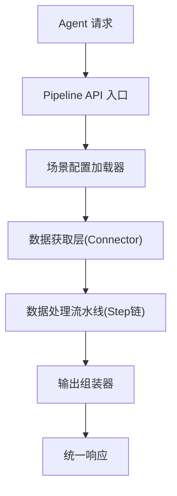
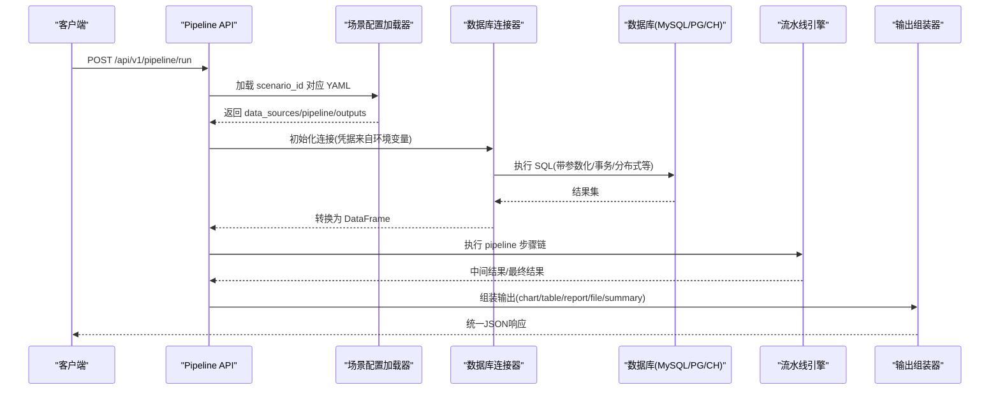
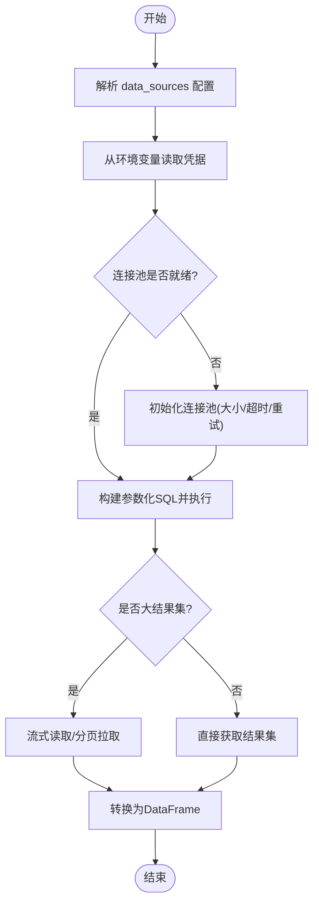
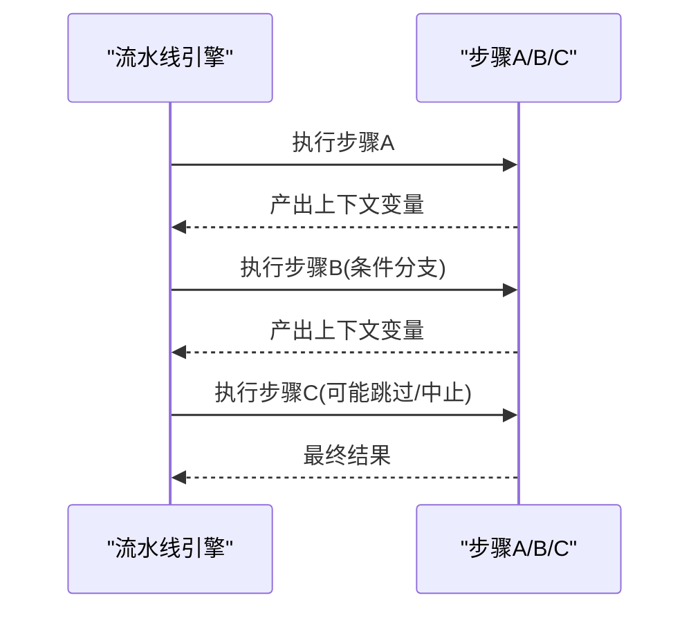
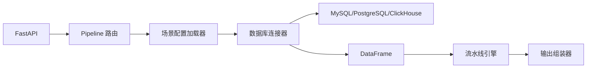

# 数据库连接器

<cite>
**本文引用的文件**
- [需求说明文档](file://docs\20260821100000_hiagent辅助Web服务_需求说明.md)
</cite>

## 目录
1. [简介](#简介)
2. [项目结构](#项目结构)
3. [核心组件](#核心组件)
4. [架构总览](#架构总览)
5. [详细组件分析](#详细组件分析)
6. [依赖关系分析](#依赖关系分析)
7. [性能考虑](#性能考虑)
8. [故障排查指南](#故障排查指南)
9. [结论](#结论)
10. [附录：配置与使用示例](#附录配置与使用示例)

## 简介
本文件面向“数据库连接器”的实现与使用，覆盖 MySQL、PostgreSQL、ClickHouse 三类数据库的连接配置、参数设置、SQL 执行流程（连接池管理、查询优化、结果集处理）、特定功能支持（如 ClickHouse 分布式查询、MySQL 事务处理）、安全配置（SSL/TLS、超时、防注入）以及性能优化建议（连接池调优、缓存策略、批量操作）。内容基于仓库中的需求说明进行梳理与扩展，便于在 Phase 2 落地时按统一接口规范实现。

## 项目结构
根据需求说明，系统采用“场景驱动的流水线引擎”，数据获取层通过 Connector 抽象直连数据库并返回统一的 DataFrame。关键新增目录包括：
- app/core/pipeline_engine.py — 流水线引擎
- app/core/scenario_loader.py — 场景配置加载器
- app/core/connectors/ — 数据连接器（base/database/api/file）
- app/core/output_assembler.py — 输出组装器
- app/scenarios/*.yaml — 场景配置文件
- app/api/v1/pipeline.py — Pipeline 路由

图表来源
- [需求说明文档:35-38](file://docs\20260821100000_hiagent辅助Web服务_需求说明.md#L35-L38)

章节来源
- [需求说明文档:35-67](file://docs\20260821100000_hiagent辅助Web服务_需求说明.md#L35-L67)
- [需求说明文档:106-114](file://docs\20260821100000_hiagent辅助Web服务_需求说明.md#L106-L114)

## 核心组件
- 连接器基类 BaseConnector：定义统一接口，所有数据源返回 DataFrame；凭据从环境变量读取；注册表模式扩展新连接器。
- 数据库连接器 DatabaseConnector：实现 MySQL、PostgreSQL、ClickHouse 的直连能力，封装连接池、SQL 执行、结果集转换。
- 流水线引擎 PipelineEngine：顺序执行步骤，通过命名引用传递中间数据，支持条件分支与步骤级错误处理（skip/abort），每步记录日志与耗时。
- 场景配置加载器 ScenarioLoader：解析 YAML 场景配置，提取 data_sources、pipeline、outputs。
- 输出组装器 OutputAssembler：将最终数据渲染为 chart/table/report/file/summary。

章节来源
- [需求说明文档:40-67](file://docs\20260821100000_hiagent辅助Web服务_需求说明.md#L40-L67)
- [需求说明文档:106-114](file://docs\20260821100000_hiagent辅助Web服务_需求说明.md#L106-L114)

## 架构总览
整体采用“无状态、单一职责、输入输出标准化、容错优先、安全隔离、场景可配置、组件可复用”的设计原则。API Key 认证与统一 JSON 响应格式贯穿全链路。

图表来源
- [需求说明文档:35-67](file://docs\20260821100000_hiagent辅助Web服务_需求说明.md#L35-L67)

## 详细组件分析

### 数据库连接器（DatabaseConnector）
- 支持的数据库类型：MySQL、PostgreSQL、ClickHouse。
- 连接配置：通过 YAML data_sources 指定 connector 类型与连接参数；凭据从环境变量读取，避免硬编码。
- 连接池管理：为每个数据库类型维护连接池，控制最大连接数、空闲回收、超时重试等。
- SQL 执行流程：
  - 参数化查询，防止 SQL 注入。
  - 针对读多写少场景启用只读副本或查询缓存（由数据库侧配置）。
  - 大结果集采用流式读取与分页拉取，降低内存占用。
- 结果集处理：统一转换为 DataFrame，列名规范化、类型推断、空值处理。
- 特定功能：
  - ClickHouse：支持分布式查询（如 distributed table 或集群分片语法），注意跨节点聚合与网络开销。
  - PostgreSQL：支持事务、CTE、窗口函数、JSONB 等高级特性。
  - MySQL：支持事务、索引提示、分区表等。

图表来源
- [需求说明文档:40-55](file://docs\20260821100000_hiagent辅助Web服务_需求说明.md#L40-L55)

章节来源
- [需求说明文档:40-55](file://docs\20260821100000_hiagent辅助Web服务_需求说明.md#L40-L55)

### 流水线引擎（PipelineEngine）
- 步骤顺序执行，通过命名引用传递中间数据（PipelineContext）。
- 支持条件分支、步骤级错误处理（skip/abort）。
- 每步独立记录日志和耗时，便于定位瓶颈。

图表来源
- [需求说明文档:57-60](file://docs\20260821100000_hiagent辅助Web服务_需求说明.md#L57-L60)

章节来源
- [需求说明文档:57-60](file://docs\20260821100000_hiagent辅助Web服务_需求说明.md#L57-L60)

### 场景配置加载器（ScenarioLoader）
- 解析 YAML 场景配置，提取 data_sources、pipeline、outputs。
- 校验必填字段与类型，提供默认值与回退策略。

章节来源
- [需求说明文档:40-44](file://docs\20260821100000_hiagent辅助Web服务_需求说明.md#L40-L44)

### 输出组装器（OutputAssembler）
- 支持 chart/table/report/file/summary 五种输出类型。
- summary 专为 Agent 设计，便于下游消费。

章节来源
- [需求说明文档:62-63](file://docs\20260821100000_hiagent辅助Web服务_需求说明.md#L62-L63)

## 依赖关系分析
- 技术栈：FastAPI + pandas/numpy + DuckDB + matplotlib/plotly + WeasyPrint + httpx + Pydantic + PyYAML + SQLAlchemy + jsonpath-ng + Docker/uvicorn。
- 连接器模式：注册表模式（BaseConnector），新增数据库类型只需扩展 database 连接器实现。
- 数据流：Connector -> DataFrame -> Pipeline -> OutputAssembler -> 统一响应。

图表来源
- [需求说明文档:19-21](file://docs\20260821100000_hiagent辅助Web服务_需求说明.md#L19-L21)
- [需求说明文档:106-114](file://docs\20260821100000_hiagent辅助Web服务_需求说明.md#L106-L114)

章节来源
- [需求说明文档:19-21](file://docs\20260821100000_hiagent辅助Web服务_需求说明.md#L19-L21)
- [需求说明文档:106-114](file://docs\20260821100000_hiagent辅助Web服务_需求说明.md#L106-L114)

## 性能考虑
- 连接池大小调优：根据并发量与数据库资源上限设定 max_connections、min_idle、max_lifetime 等参数，避免连接泄漏。
- 查询优化：
  - 使用参数化查询与必要索引，减少全表扫描。
  - 对大结果集采用流式读取与分页，限制单次返回行数。
  - 利用数据库侧缓存（如 PG query cache、CH 查询缓存）提升重复查询性能。
- 批量操作优化：
  - 批量写入时使用事务包裹，减少往返次数。
  - 合并多次小写入为大批次，降低锁竞争。
- 流水线优化：
  - 步骤级耗时监控，识别瓶颈步骤。
  - 条件分支短路，避免不必要的计算。
- 非功能性目标：简单接口 < 500ms，数据处理 < 3s，Pipeline 全流程 < 10s。

章节来源
- [需求说明文档:97-102](file://docs\20260821100000_hiagent辅助Web服务_需求说明.md#L97-L102)

## 故障排查指南
- 常见问题：
  - 连接失败：检查凭据、网络连通性、防火墙策略、数据库白名单。
  - 查询超时：调整超时时间、优化 SQL、增加索引、拆分查询。
  - 内存溢出：改用流式读取、限制结果集大小、分页拉取。
  - 事务异常：捕获异常并回滚，记录事务 ID 与错误堆栈。
- 可观测性：
  - 结构化日志包含 scenario_id 与步骤耗时。
  - 暴露 /health 端点用于健康检查。
  - 提供 /api/v1/pipeline/scenarios 列表接口用于调试。

章节来源
- [需求说明文档:97-102](file://docs\20260821100000_hiagent辅助Web服务_需求说明.md#L97-L102)

## 结论
本项目以“场景驱动 + 连接器抽象 + 流水线编排”的方式，统一对接 MySQL、PostgreSQL、ClickHouse 等数据库，并通过环境变量管理凭据、注册表模式扩展新连接器。结合参数化查询、连接池管理、流式结果集与步骤级监控，满足高可用、高性能与安全合规要求。后续可在 Phase 2 中完成具体实现与第一个场景落地。

## 附录：配置与使用示例
以下为通用配置与使用要点（不展示具体代码内容，仅给出结构与路径指引）：

- 场景配置（YAML）data_sources 示例结构
  - connector: "database"
  - type: "mysql|postgresql|clickhouse"
  - connection: { host, port, database, user, password }
  - options: { ssl_mode, timeout, pool_size, read_only }
  - sql: 参数化查询语句（使用占位符）
  - 参考路径：[需求说明文档:40-44](file://docs\20260821100000_hiagent辅助Web服务_需求说明.md#L40-L44)

- 环境变量（凭据）
  - 数据库凭据从环境变量读取，避免硬编码。
  - 参考路径：[需求说明文档:46-55](file://docs\20260821100000_hiagent辅助Web服务_需求说明.md#L46-L55)

- 调用方式
  - 模式 A：POST /api/v1/pipeline/run，传入 scenario_id 与参数，一次完成全流程。
  - 模式 B：原子 API（/api/v1/data/*、/api/v1/visual/* 等），逐步调用，Agent 自行编排。
  - 参考路径：[需求说明文档:65-67](file://docs\20260821100000_hiagent辅助Web服务_需求说明.md#L65-L67)

- 安全与性能
  - 安全：API Key 认证、SQL 注入防护、凭据不硬编码。
  - 性能：简单接口 < 500ms，数据处理 < 3s，Pipeline 全流程 < 10s。
  - 参考路径：[需求说明文档:25-30](file://docs\20260821100000_hiagent辅助Web服务_需求说明.md#L25-L30)
  - 参考路径：[需求说明文档:97-102](file://docs\20260821100000_hiagent辅助Web服务_需求说明.md#L97-L102)