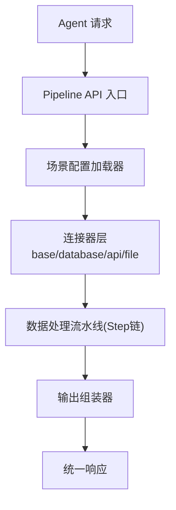
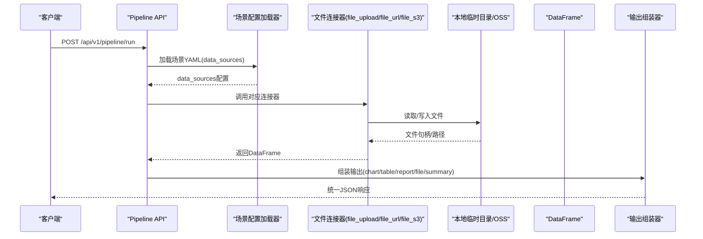
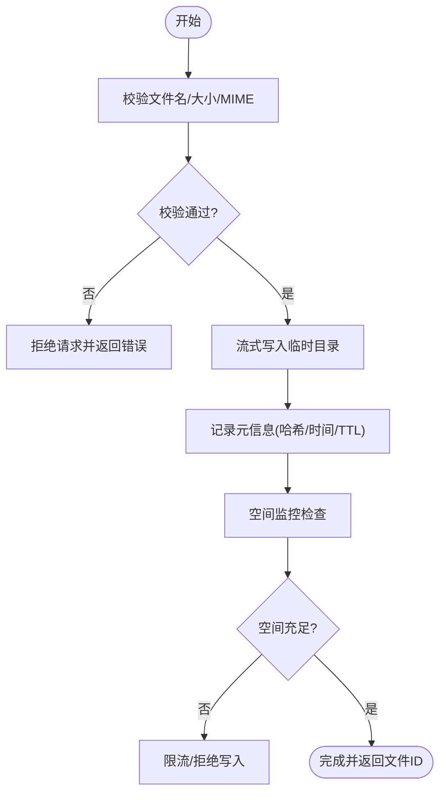
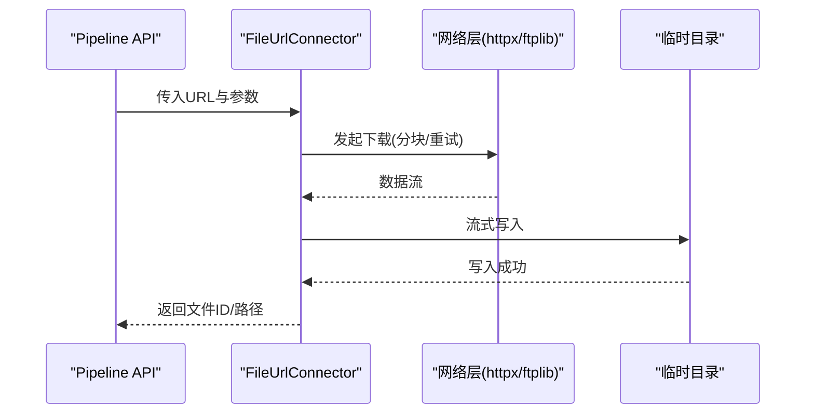
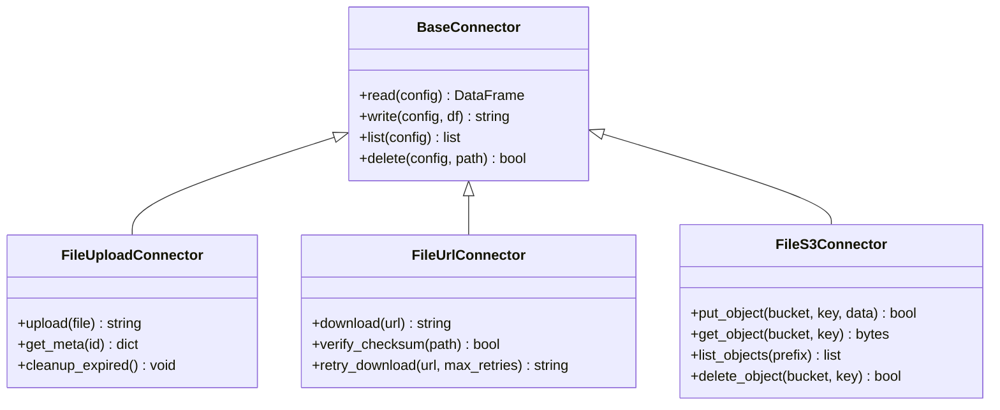
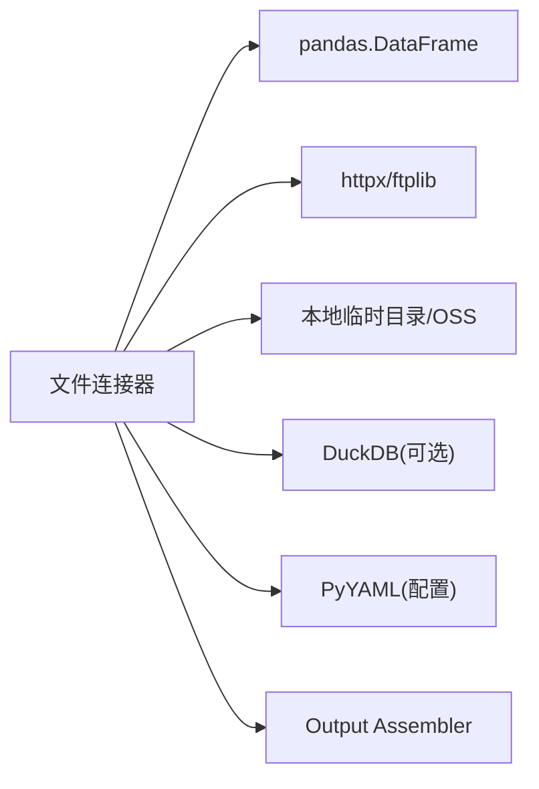

# 文件连接器

<cite>
**本文引用的文件**
- [20260821100000_hiagent辅助Web服务_需求说明.md](file://docs\20260821100000_hiagent辅助Web服务_需求说明.md)
</cite>

## 目录
1. [简介](#简介)
2. [项目结构](#项目结构)
3. [核心组件](#核心组件)
4. [架构总览](#架构总览)
5. [详细组件分析](#详细组件分析)
6. [依赖关系分析](#依赖关系分析)
7. [性能考虑](#性能考虑)
8. [故障排查指南](#故障排查指南)
9. [结论](#结论)
10. [附录：使用示例与常见问题](#附录使用示例与常见问题)

## 简介
本文件连接器文档面向 hiagent 辅助 Web 服务的“文件类”数据连接器，覆盖三种类型：
- file_upload：Agent 上传文件的存储与管理
- file_url：从指定 URL 下载文件并处理多种协议（HTTP/HTTPS/FTP）
- file_s3：对象存储服务（S3 兼容）的文件操作

同时说明文件格式支持（CSV、Excel、JSON、PDF、Word 等读写）、文件生命周期管理（临时文件清理、存储空间监控、大文件流式处理）、安全机制（病毒扫描、访问权限控制、路径遍历防护），以及性能优化建议（分块下载、并行处理、内存管理）。

## 项目结构
根据需求说明书，系统采用“场景驱动的流水线引擎”，连接器层位于 app/core/connectors/，包含 base/database/api/file 等实现。文件连接器属于 file 子模块，统一返回 DataFrame，凭据通过环境变量读取，并通过注册表模式扩展。

图表来源
- [20260821100000_hiagent辅助Web服务_需求说明.md:33-67](file://docs\20260821100000_hiagent辅助Web服务_需求说明.md#L33-L67)

章节来源
- [20260821100000_hiagent辅助Web服务_需求说明.md:33-67](file://docs\20260821100000_hiagent辅助Web服务_需求说明.md#L33-L67)
- [20260821100000_hiagent辅助Web服务_需求说明.md:106-114](file://docs\20260821100000_hiagent辅助Web服务_需求说明.md#L106-L114)

## 核心组件
- BaseConnector：所有连接器的基类，定义统一的接口契约与注册表机制，新增连接器改动最小。
- FileUploadConnector：负责接收 Agent 上传的文件，进行校验、落盘、元信息记录与生命周期管理。
- FileUrlConnector：从 HTTP/HTTPS/FTP 等 URL 下载文件，支持分块下载、断点续传、超时重试与错误恢复。
- FileS3Connector：对接 S3 兼容对象存储，提供上传、下载、列举、删除等操作，支持凭据与环境变量注入。
- PipelineContext：在流水线步骤间传递中间数据与上下文（如 scenario_id、request_id、临时文件路径等）。
- Output Assembler：将最终结果以 chart/table/report/file/summary 等格式输出。

章节来源
- [20260821100000_hiagent辅助Web服务_需求说明.md:46-55](file://docs\20260821100000_hiagent辅助Web服务_需求说明.md#L46-L55)
- [20260821100000_hiagent辅助Web服务_需求说明.md:57-67](file://docs\20260821100000_hiagent辅助Web服务_需求说明.md#L57-L67)

## 架构总览
文件连接器作为数据获取层的一部分，统一返回 DataFrame，供后续数据处理流水线消费。其关键交互如下：

图表来源
- [20260821100000_hiagent辅助Web服务_需求说明.md:33-67](file://docs\20260821100000_hiagent辅助Web服务_需求说明.md#L33-L67)

## 详细组件分析

### file_upload：Agent 上传文件的存储与管理
- 功能要点
  - 接收 multipart/form-data 或二进制流，进行文件名、大小、MIME 类型校验
  - 落盘到受控的临时目录，生成唯一标识，记录元信息（哈希、创建时间、过期时间）
  - 与 PipelineContext 关联，便于后续步骤引用
  - 支持流式写入，避免一次性加载大文件到内存
- 生命周期管理
  - 临时文件自动清理策略（例如 2 小时 TTL），后台定时任务扫描并删除过期文件
  - 存储空间监控：当磁盘使用率超过阈值时触发告警并拒绝新写入
- 安全机制
  - 路径规范化与白名单校验，防止路径遍历攻击
  - 可选集成病毒扫描（如 clamd 或云扫描服务），失败则拒绝入库
  - 访问权限控制：仅允许授权角色/用户访问上传文件
- 性能优化
  - 分块写入与异步 I/O，降低阻塞
  - 并发上传限流与队列化，避免资源争用
  - 压缩与去重：对重复内容做指纹比对，减少冗余存储

图表来源
- [20260821100000_hiagent辅助Web服务_需求说明.md:84-88](file://docs\20260821100000_hiagent辅助Web服务_需求说明.md#L84-L88)

章节来源
- [20260821100000_hiagent辅助Web服务_需求说明.md:84-88](file://docs\20260821100000_hiagent辅助Web服务_需求说明.md#L84-L88)

### file_url：从指定 URL 下载文件并处理多种协议
- 功能要点
  - 支持 HTTP/HTTPS/FTP 协议，解析 URL、构造请求头、处理重定向与鉴权
  - 支持分块下载、断点续传、超时重试与速率限制
  - 下载完成后进行完整性校验（如 MD5/SHA256）
- 生命周期管理
  - 下载产物进入临时目录，纳入统一清理策略
  - 可配置缓存策略，避免重复下载相同资源
- 安全机制
  - URL 白名单与协议限制，禁止危险协议（如 file://）
  - 证书校验与主机名验证，防范中间人攻击
  - 下载前进行病毒扫描，失败则丢弃
- 性能优化
  - 多线程/多进程并行下载不同文件
  - 连接池复用与 Keep-Alive，减少握手开销
  - 流式处理，边下边写，降低内存占用

图表来源
- [20260821100000_hiagent辅助Web服务_需求说明.md:84-88](file://docs\20260821100000_hiagent辅助Web服务_需求说明.md#L84-L88)

章节来源
- [20260821100000_hiagent辅助Web服务_需求说明.md:84-88](file://docs\20260821100000_hiagent辅助Web服务_需求说明.md#L84-L88)

### file_s3：对象存储服务（S3 兼容）的文件操作
- 功能要点
  - 封装 S3 SDK，提供上传、下载、列举、删除、复制等操作
  - 支持分块上传/下载、断点续传、并发控制
  - 凭据通过环境变量注入，避免硬编码
- 生命周期管理
  - 结合生命周期规则（Lifecycle）自动归档/清理旧版本
  - 与本地临时目录联动，短期文件优先走本地，长期归档至 S3
- 安全机制
  - 最小权限原则的 IAM 策略，限制桶/前缀级访问
  - 传输加密（TLS）与静态加密（服务端加密）
  - 访问日志与审计，异常行为告警
- 性能优化
  - 合理设置分块大小与并发度，平衡吞吐与延迟
  - 使用预签名 URL 直传/直下，减轻服务器带宽压力

图表来源
- [20260821100000_hiagent辅助Web服务_需求说明.md:46-55](file://docs\20260821100000_hiagent辅助Web服务_需求说明.md#L46-L55)

章节来源
- [20260821100000_hiagent辅助Web服务_需求说明.md:46-55](file://docs\20260821100000_hiagent辅助Web服务_需求说明.md#L46-L55)

## 依赖关系分析
- 外部依赖
  - httpx：HTTP/HTTPS 请求与流式处理
  - pandas/numpy：DataFrame 构建与分析
  - DuckDB：SQL 查询与高性能计算
  - PyYAML：场景配置加载
  - WeasyPrint：报告渲染（PDF）
  - matplotlib/plotly：可视化
- 内部依赖
  - Pipeline Engine：编排步骤、传递上下文
  - Scenario Loader：加载 YAML 配置
  - Output Assembler：统一输出格式

图表来源
- [20260821100000_hiagent辅助Web服务_需求说明.md:19-22](file://docs\20260821100000_hiagent辅助Web服务_需求说明.md#L19-L22)
- [20260821100000_hiagent辅助Web服务_需求说明.md:33-67](file://docs\20260821100000_hiagent辅助Web服务_需求说明.md#L33-L67)

章节来源
- [20260821100000_hiagent辅助Web服务_需求说明.md:19-22](file://docs\20260821100000_hiagent辅助Web服务_需求说明.md#L19-L22)
- [20260821100000_hiagent辅助Web服务_需求说明.md:33-67](file://docs\20260821100000_hiagent辅助Web服务_需求说明.md#L33-L67)

## 性能考虑
- 分块下载/上传：按固定大小分片，提升大文件稳定性与吞吐
- 并行处理：对独立文件/分片进行并发处理，注意限流与资源配额
- 内存管理：流式读写、惰性加载、及时释放句柄，避免 OOM
- 缓存与去重：基于内容指纹缓存热点资源，减少重复 IO
- 连接复用：HTTP 连接池、S3 客户端复用，降低握手与认证开销
- 监控与告警：QPS、延迟、错误率、磁盘使用率、内存使用率指标上报

[本节为通用指导，不直接分析具体文件]

## 故障排查指南
- 常见错误
  - 网络超时/重试失败：检查代理、DNS、证书与目标可达性
  - 权限不足：核对 API Key、IAM 策略、桶/前缀权限
  - 磁盘空间不足：清理过期临时文件，扩容或迁移
  - 病毒扫描失败：确认扫描服务状态，必要时降级放行并标记风险
- 定位方法
  - 查看结构化日志（含 scenario_id、request_id、步骤耗时）
  - 检查健康检查端点与指标面板
  - 复现最小用例，逐步隔离问题域（网络/存储/解析）

章节来源
- [20260821100000_hiagent辅助Web服务_需求说明.md:97-102](file://docs\20260821100000_hiagent辅助Web服务_需求说明.md#L97-L102)

## 结论
文件连接器通过统一的基类与注册表模式，实现了 file_upload、file_url、file_s3 三类能力，配合流水线引擎与输出组装器，形成端到端的文件数据处理链路。系统在安全性、性能与可维护性方面具备良好基础，建议在后续迭代中完善病毒扫描、权限控制与监控告警，持续优化大文件处理体验。

[本节为总结，不直接分析具体文件]

## 附录：使用示例与常见问题

### 使用示例
- file_upload
  - 场景：Agent 上传 CSV/Excel/JSON/PDF/Word 等文件进行分析
  - 步骤：调用上传接口 -> 校验与落盘 -> 生成文件ID -> 在 Pipeline 中引用该 ID 进行后续处理
- file_url
  - 场景：从公开或受保护的 URL 下载数据文件
  - 步骤：传入 URL 与鉴权信息 -> 分块下载与校验 -> 存入临时目录 -> 返回文件ID
- file_s3
  - 场景：从 S3 桶读取历史数据或归档报表
  - 步骤：配置凭据与环境变量 -> 列举/下载对象 -> 转换为 DataFrame -> 进入流水线

[本节为概念性示例，不直接分析具体文件]

### 常见问题解决方案
- 大文件导致内存溢出
  - 解决：启用流式读写、分块处理、及时释放资源；调整批处理大小
- 下载不稳定
  - 解决：启用重试与退避、校验完整性、切换镜像源或代理
- 权限报错
  - 解决：核对 API Key/IAM 策略、最小权限原则、网络 ACL
- 临时文件堆积
  - 解决：确保 TTL 清理任务运行正常，增加监控与告警

[本节为通用指导，不直接分析具体文件]