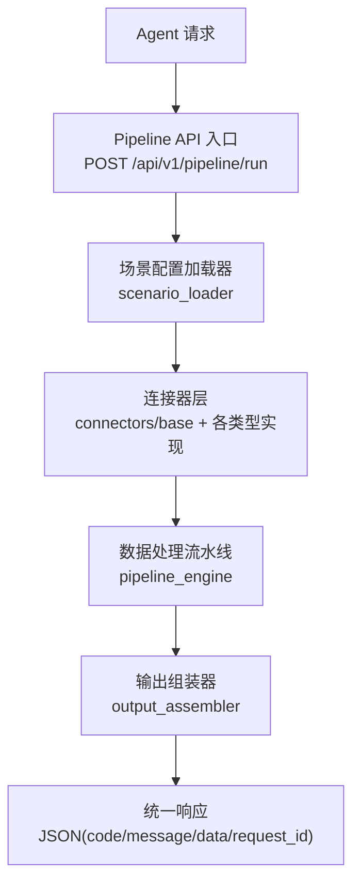
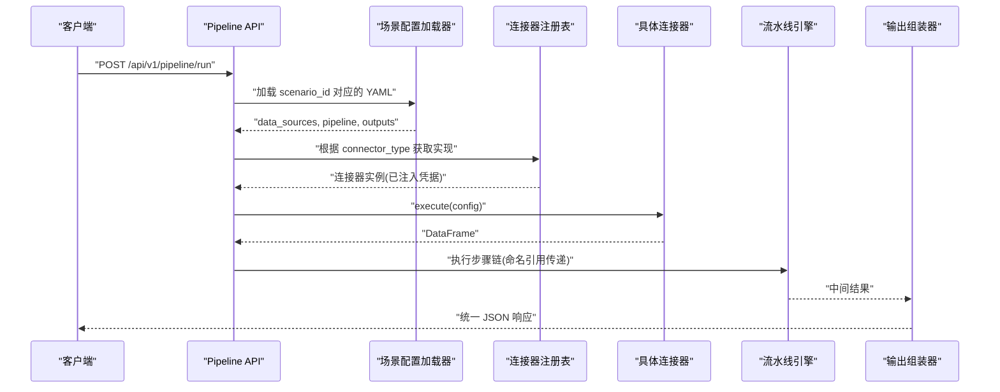
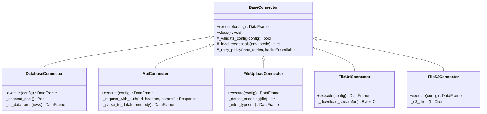
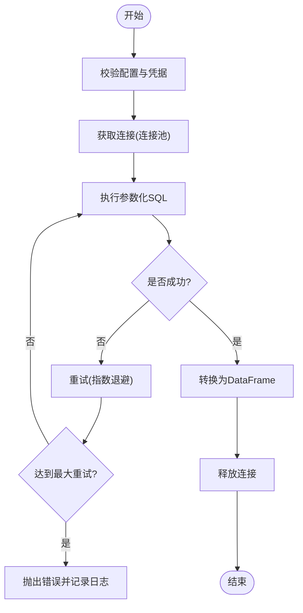
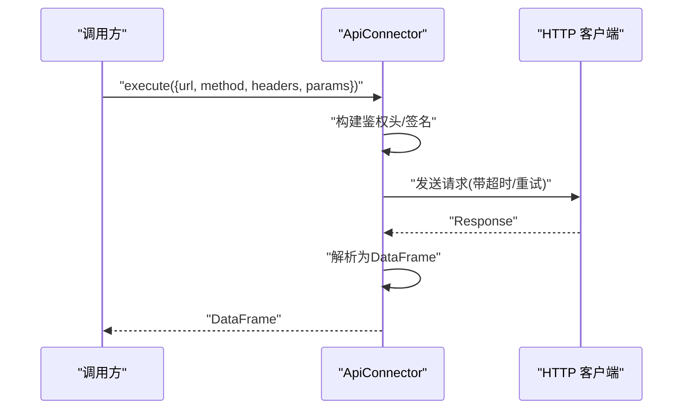
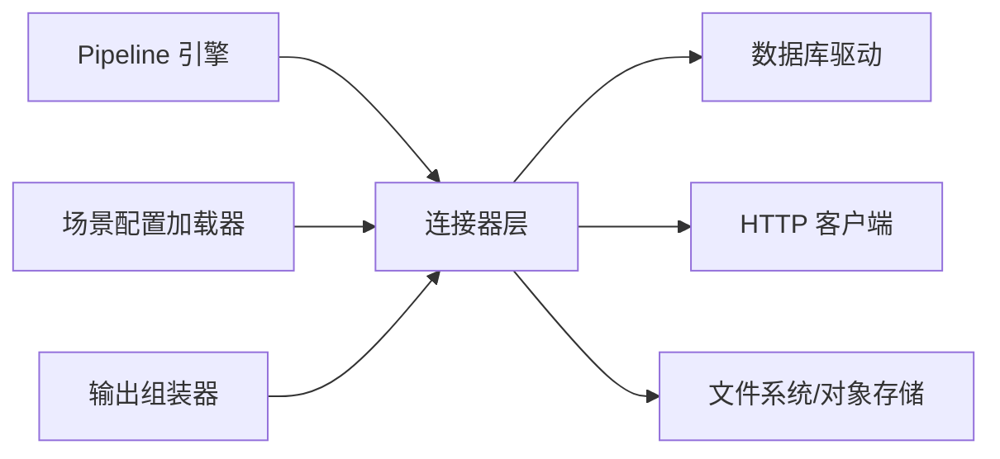

# 连接器层架构

<cite>
**本文引用的文件**
- [需求说明文档](file://docs\hiagent_辅助_Web_服务需求说明_task-242.md)
</cite>

## 目录
1. [引言](#引言)
2. [项目结构](#项目结构)
3. [核心组件](#核心组件)
4. [架构总览](#架构总览)
5. [详细组件分析](#详细组件分析)
6. [依赖关系分析](#依赖关系分析)
7. [性能考量](#性能考量)
8. [故障排查指南](#故障排查指南)
9. [结论](#结论)
10. [附录：连接器开发指南与最佳实践](#附录连接器开发指南与最佳实践)

## 引言
本章节面向连接器层的整体设计目标与约束，基于需求说明文档中“连接器层（Connector Layer）”的规划，阐述以下要点：
- 统一抽象：通过 BaseConnector 基类定义统一的连接、查询/读取、关闭等接口，屏蔽底层差异。
- 统一数据格式：所有连接器返回 DataFrame，便于下游流水线与输出组装器统一处理。
- 凭据管理：凭据从环境变量读取，避免硬编码，满足安全要求。
- 注册表模式：通过注册机制扩展新的连接器类型，新增连接器改动最小。
- 生命周期与健壮性：明确连接器的创建、初始化、使用、释放的生命周期；结合重试与错误处理提升稳定性。
- 可扩展性：支持 database、api、file_upload、file_url、file_s3 等多种数据源。

本节为概念性概述，不直接分析具体代码文件。

## 项目结构
根据需求说明文档，连接器层位于 app/core/connectors/ 目录下，配合 pipeline_engine、scenario_loader、output_assembler 等模块共同构成场景驱动的流水线引擎。关键目录与职责如下：
- app/core/pipeline_engine.py：流水线引擎，负责步骤顺序执行、上下文传递、条件分支与错误处理。
- app/core/scenario_loader.py：场景配置加载器，解析 YAML 中的 data_sources、pipeline、outputs。
- app/core/connectors/：数据连接器集合，包含 base、database、api、file 等实现。
- app/core/output_assembler.py：输出组装器，将中间结果渲染为 chart/table/report/file/summary。
- app/api/v1/pipeline.py：Pipeline API 路由，暴露 POST /api/v1/pipeline/run 等入口。

图表来源
- [需求说明文档:35-67](file://docs\hiagent_辅助_Web_服务需求说明_task-242.md#L35-L67)

章节来源
- [需求说明文档:35-67](file://docs\hiagent_辅助_Web_服务需求说明_task-242.md#L35-L67)
- [需求说明文档:106-115](file://docs\hiagent_辅助_Web_服务需求说明_task-242.md#L106-L115)

## 核心组件
- BaseConnector（基类）
  - 职责：定义统一的连接、查询/读取、关闭等接口；提供公共能力如日志、超时、重试策略、错误封装。
  - 设计要点：工厂方法或注册表模式用于实例化；统一返回 DataFrame；凭据从环境变量注入。
- 数据库连接器（database）
  - 支持 MySQL、PostgreSQL、ClickHouse 直连；参数化 SQL 执行；连接池复用；结果集转换为 DataFrame。
- API 连接器（api）
  - 调用外部 REST API；支持鉴权模板、超时重试、速率限制；响应体转换为 DataFrame。
- 文件上传连接器（file_upload）
  - 接收 Agent 上传的文件；自动编码检测与类型推断；转换为 DataFrame。
- URL 下载连接器（file_url）
  - 从 URL 下载文件；支持流式下载与断点续传；转换为 DataFrame。
- 对象存储连接器（file_s3）
  - 对接对象存储（后期扩展）；按路径/桶名访问文件；转换为 DataFrame。
- 注册表（Registry）
  - 维护 connector_type -> ConnectorClass 映射；支持动态加载与热插拔；减少新增连接器的侵入性。

章节来源
- [需求说明文档:46-55](file://docs\hiagent_辅助_Web_服务需求说明_task-242.md#L46-L55)
- [需求说明文档:106-115](file://docs\hiagent_辅助_Web_服务需求说明_task-242.md#L106-L115)

## 架构总览
连接器层作为数据获取的统一入口，向上为 Pipeline 引擎提供标准化的 DataFrame 数据，向下屏蔽不同数据源的差异。其核心流程包括：
- 配置驱动：YAML 中 data_sources 指定 connector_type、连接配置、SQL/API 参数、请求参数映射。
- 实例化：通过注册表根据 connector_type 选择具体实现并注入凭据。
- 执行：执行连接、查询/读取、转换，返回 DataFrame。
- 错误处理：捕获异常、记录结构化日志、支持重试与降级策略。
- 资源管理：连接池复用、超时控制、及时释放资源。

图表来源
- [需求说明文档:35-67](file://docs\hiagent_辅助_Web_服务需求说明_task-242.md#L35-L67)

章节来源
- [需求说明文档:35-67](file://docs\hiagent_辅助_Web_服务需求说明_task-242.md#L35-L67)

## 详细组件分析

### BaseConnector 基类与注册表模式
- 设计模式
  - 模板方法：在基类中定义 execute() 的标准流程（校验输入、获取凭据、建立连接、执行操作、转换结果、释放资源），子类仅实现具体逻辑。
  - 注册表：维护 connector_type 到类的映射，新增连接器只需注册，无需修改调用方。
- 统一数据格式
  - 所有连接器返回 DataFrame，确保下游处理一致。
- 凭据管理
  - 从环境变量读取敏感信息（如数据库连接串、API Key、S3 密钥），避免硬编码。
- 生命周期
  - 创建：由注册表实例化并注入配置与凭据。
  - 初始化：建立连接或准备资源（连接池、HTTP 会话）。
  - 使用：执行 execute() 返回 DataFrame。
  - 释放：关闭连接、回收资源。

图表来源
- [需求说明文档:46-55](file://docs\hiagent_辅助_Web_服务需求说明_task-242.md#L46-L55)

章节来源
- [需求说明文档:46-55](file://docs\hiagent_辅助_Web_服务需求说明_task-242.md#L46-L55)

### 数据库连接器（MySQL/PostgreSQL/ClickHouse）
- 功能要点
  - 参数化 SQL 执行，防止注入。
  - 连接池复用，降低握手开销。
  - 结果集高效转换为 DataFrame。
- 错误处理
  - 捕获网络/认证/权限/语法错误，记录结构化日志。
  - 支持重试（指数退避）与熔断（失败阈值）。
- 性能优化
  - 分页查询、列裁剪、索引提示。
  - 批量写入/读取优化。

图表来源
- [需求说明文档:46-55](file://docs\hiagent_辅助_Web_服务需求说明_task-242.md#L46-L55)

章节来源
- [需求说明文档:46-55](file://docs\hiagent_辅助_Web_服务需求说明_task-242.md#L46-L55)

### API 连接器（REST）
- 功能要点
  - 支持鉴权模板（Header、Query、Body 注入）。
  - 超时、重试、速率限制。
  - 响应体解析为 DataFrame（JSON/CSV/XML）。
- 错误处理
  - HTTP 状态码分类处理，区分可重试与不可重试错误。
  - 记录请求/响应摘要（脱敏）。
- 性能优化
  - 连接复用（Session）、并发控制、缓存热点响应。

图表来源
- [需求说明文档:90-94](file://docs\hiagent_辅助_Web_服务需求说明_task-242.md#L90-L94)

章节来源
- [需求说明文档:90-94](file://docs\hiagent_辅助_Web_服务需求说明_task-242.md#L90-L94)

### 文件上传连接器（file_upload）
- 功能要点
  - 接收多格式文件（CSV/Excel/JSON），自动编码检测与类型推断。
  - 转换为 DataFrame 供后续步骤使用。
- 错误处理
  - 文件格式不支持、编码错误、空文件等异常处理。
- 性能优化
  - 流式读取大文件，分块处理，内存友好。

章节来源
- [需求说明文档:84-88](file://docs\hiagent_辅助_Web_服务需求说明_task-242.md#L84-L88)

### URL 下载连接器（file_url）
- 功能要点
  - 从 URL 下载文件，支持流式下载与断点续传。
  - 自动识别格式并转换为 DataFrame。
- 错误处理
  - 网络异常、权限不足、URL 无效等。
- 性能优化
  - 并发下载、限速、缓存命中。

章节来源
- [需求说明文档:51-53](file://docs\hiagent_辅助_Web_服务需求说明_task-242.md#L51-L53)

### 对象存储连接器（file_s3）
- 功能要点
  - 对接对象存储（桶/路径/密钥），读取文件并转换为 DataFrame。
  - 支持分片读取与并行拉取。
- 错误处理
  - 鉴权失败、路径不存在、网络超时等。
- 性能优化
  - 预取、压缩传输、本地缓存。

章节来源
- [需求说明文档:53-55](file://docs\hiagent_辅助_Web_服务需求说明_task-242.md#L53-L55)

## 依赖关系分析
- 内部依赖
  - Pipeline 引擎依赖连接器层提供的 DataFrame。
  - 场景配置加载器解析 YAML 并生成连接器配置。
  - 输出组装器消费 DataFrame 进行渲染。
- 外部依赖
  - 数据库驱动（MySQL/PostgreSQL/ClickHouse）。
  - HTTP 客户端（httpx）。
  - 文件处理库（pandas、openpyxl、json）。
  - 对象存储 SDK（boto3/s3fs 等）。

图表来源
- [需求说明文档:106-115](file://docs\hiagent_辅助_Web_服务需求说明_task-242.md#L106-L115)

章节来源
- [需求说明文档:106-115](file://docs\hiagent_辅助_Web_服务需求说明_task-242.md#L106-L115)

## 性能考量
- 连接池
  - 数据库连接池复用，减少握手成本；合理设置池大小与超时。
- 重试与退避
  - 对瞬时错误采用指数退避重试；对幂等请求更安全。
- 并发与限流
  - API 连接器支持并发请求与速率限制，避免压垮上游服务。
- 内存与流式处理
  - 大文件采用流式读取与分块处理，降低内存峰值。
- 缓存
  - 对热点数据或响应进行缓存，减少重复计算与请求。

[本节为通用指导，不直接分析具体文件]

## 故障排查指南
- 常见问题
  - 凭据缺失或错误：检查环境变量是否正确注入。
  - 连接超时：调整超时与重试策略，检查网络与防火墙。
  - 权限不足：确认数据库/对象存储权限与白名单。
  - 数据格式异常：检查文件编码与类型推断，必要时显式指定 schema。
- 日志与观测
  - 记录结构化日志（含 scenario_id、步骤耗时、connector_type）。
  - 暴露 /health 与健康检查端点。
- 错误码规范
  - 遵循统一 JSON 响应格式与错误码分段（1xxx 通用、2xxx 数据处理、3xxx 可视化、4xxx 文件文档、5xxx API 编排、6xxx Pipeline 引擎）。

章节来源
- [需求说明文档:25-30](file://docs\hiagent_辅助_Web_服务需求说明_task-242.md#L25-L30)
- [需求说明文档:97-102](file://docs\hiagent_辅助_Web_服务需求说明_task-242.md#L97-L102)

## 结论
连接器层通过 BaseConnector 抽象与注册表模式，实现了统一的数据接入与标准化输出（DataFrame），支撑多种数据源（数据库、API、文件、对象存储）。结合凭据管理、重试机制、连接池与结构化日志，提升了系统的可维护性与健壮性。该设计使新增连接器改动最小，便于快速扩展与落地业务场景。

[本节为总结性内容，不直接分析具体文件]

## 附录：连接器开发指南与最佳实践

### 如何实现自定义连接器
- 步骤
  - 继承 BaseConnector，实现 execute() 与 close()。
  - 在注册表中注册新类型（connector_type -> 类）。
  - 在 YAML 的 data_sources 中声明 connector_type 与连接配置。
- 注意事项
  - 始终返回 DataFrame，保持下游一致性。
  - 使用参数化查询/请求，避免注入风险。
  - 合理设置超时与重试策略。

章节来源
- [需求说明文档:46-55](file://docs\hiagent_辅助_Web_服务需求说明_task-242.md#L46-L55)
- [需求说明文档:106-115](file://docs\hiagent_辅助_Web_服务需求说明_task-242.md#L106-L115)

### 如何处理认证
- 数据库：通过环境变量注入连接串或用户名/密码。
- API：通过 Header/Query/BODY 注入 API Key 或签名。
- 对象存储：通过环境变量注入 AccessKey/SecretKey/Endpoint。
- 安全建议：不在代码中硬编码凭据；使用环境变量或密钥管理服务。

章节来源
- [需求说明文档:25-30](file://docs\hiagent_辅助_Web_服务需求说明_task-242.md#L25-L30)
- [需求说明文档:97-102](file://docs\hiagent_辅助_Web_服务需求说明_task-242.md#L97-L102)

### 如何进行性能优化
- 连接池：数据库连接池复用，合理配置池大小与超时。
- 重试与退避：对瞬时错误采用指数退避重试。
- 并发与限流：API 连接器支持并发与速率限制。
- 流式处理：大文件分块读取，降低内存占用。
- 缓存：对热点数据或响应进行缓存。

章节来源
- [需求说明文档:97-102](file://docs\hiagent_辅助_Web_服务需求说明_task-242.md#L97-L102)

### 使用示例与最佳实践
- 场景配置（YAML）
  - data_sources 中声明 connector_type、连接配置、SQL/API 参数、请求参数映射。
  - pipeline 中通过命名引用传递中间数据。
  - outputs 中定义最终输出类型与数据来源。
- 调用方式
  - 模式 A：Pipeline API（POST /api/v1/pipeline/run），传入 scenario_id 与参数，一次完成全流程。
  - 模式 B：原子 API（/api/v1/data/*、/api/v1/visual/* 等），逐步调用，Agent 自行编排。
- 最佳实践
  - 统一错误码与响应格式。
  - 结构化日志记录 scenario_id 与步骤耗时。
  - 定期清理临时文件，避免磁盘膨胀。

章节来源
- [需求说明文档:40-67](file://docs\hiagent_辅助_Web_服务需求说明_task-242.md#L40-L67)
- [需求说明文档:65-67](file://docs\hiagent_辅助_Web_服务需求说明_task-242.md#L65-L67)
- [需求说明文档:84-94](file://docs\hiagent_辅助_Web_服务需求说明_task-242.md#L84-L94)