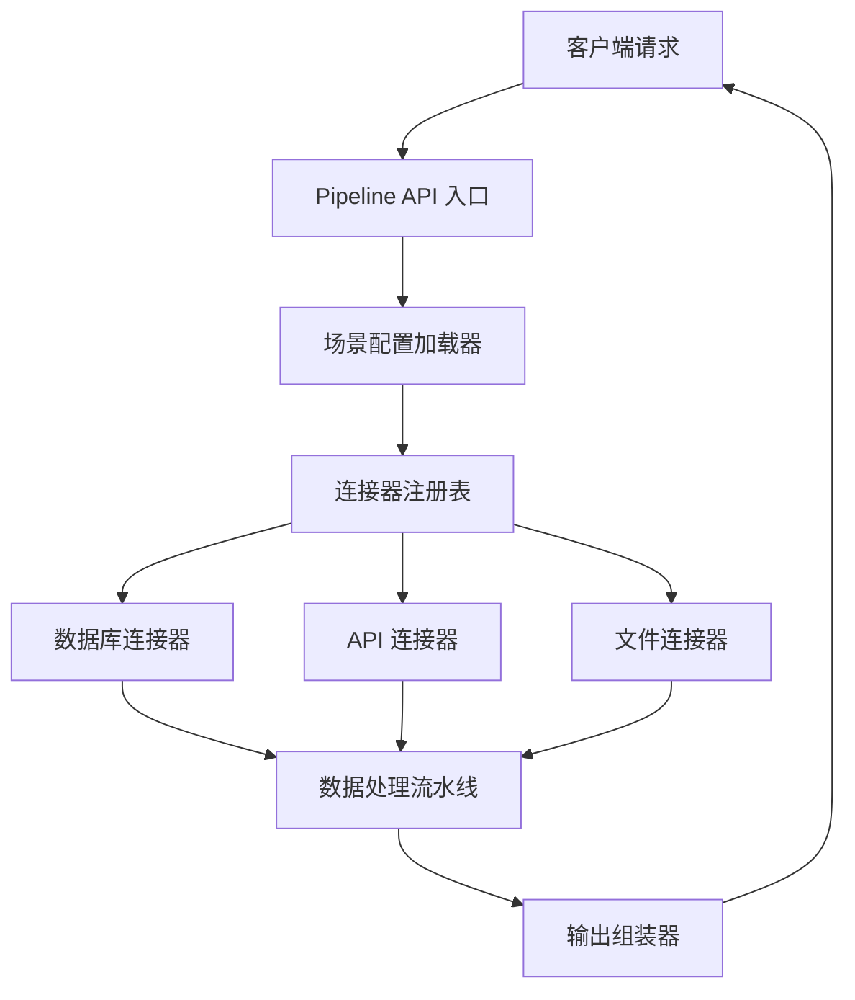
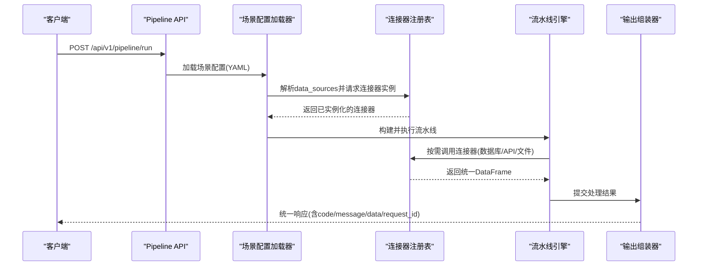
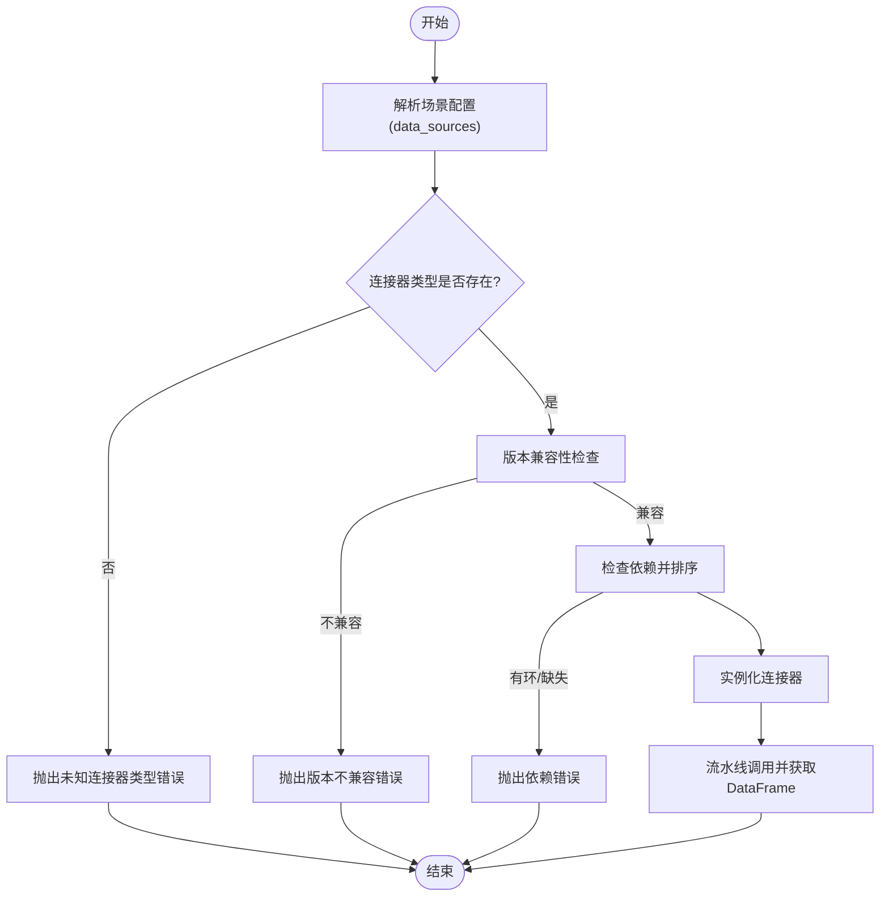
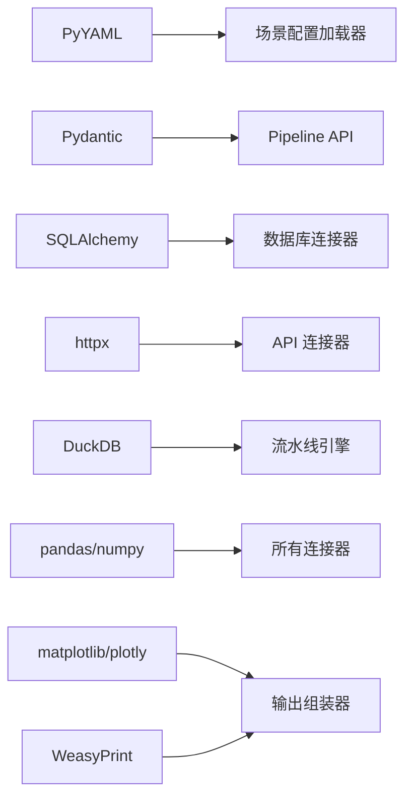

# 连接器注册表

<cite>
**本文引用的文件**
- [需求说明文档](file://docs\20260821100000_hiagent辅助Web服务_需求说明.md)
</cite>

## 目录
1. [引言](#引言)
2. [项目结构](#项目结构)
3. [核心组件](#核心组件)
4. [架构总览](#架构总览)
5. [详细组件分析](#详细组件分析)
6. [依赖关系分析](#依赖关系分析)
7. [性能考量](#性能考量)
8. [故障排查指南](#故障排查指南)
9. [结论](#结论)
10. [附录：扩展新连接器的完整指南](#附录扩展新连接器的完整指南)

## 引言
本文件围绕“连接器注册表”的架构设计，系统化阐述如何通过中心化的注册机制管理所有连接器类型，覆盖静态与动态注册、自动发现与实例化、版本管理与兼容性检查、依赖管理与初始化顺序控制，以及扩展新连接器的完整实践。内容基于仓库中的需求说明进行提炼与结构化，确保读者既能把握整体架构，也能落地实现。

## 项目结构
根据需求说明，系统采用场景驱动的流水线引擎，连接器层位于数据获取层，负责从多种数据源（数据库、API、文件等）统一拉取数据并返回统一的 DataFrame。关键目录包括：
- app/core/pipeline_engine.py — 流水线引擎
- app/core/scenario_loader.py — 场景配置加载器
- app/core/connectors/ — 数据连接器（base/database/api/file）
- app/core/output_assembler.py — 输出组装器
- app/scenarios/*.yaml — 场景配置文件
- app/api/v1/pipeline.py — Pipeline 路由

图表来源
- [需求说明文档:33-67](file://docs\20260821100000_hiagent辅助Web服务_需求说明.md#L33-L67)
- [需求说明文档:106-114](file://docs\20260821100000_hiagent辅助Web服务_需求说明.md#L106-L114)

章节来源
- [需求说明文档:33-67](file://docs\20260821100000_hiagent辅助Web服务_需求说明.md#L33-L67)
- [需求说明文档:106-114](file://docs\20260821100000_hiagent辅助Web服务_需求说明.md#L106-L114)

## 核心组件
- BaseConnector（抽象基类）：定义统一的连接器接口与生命周期方法，保证所有连接器返回统一 DataFrame，屏蔽底层差异。
- 连接器注册表（Registry）：集中管理所有连接器类型，提供注册、查找、实例化、版本兼容校验等功能。
- 场景配置加载器（ScenarioLoader）：解析 YAML 场景配置，识别 data_sources 中使用的 connector 类型，驱动注册表完成自动发现与实例化。
- 流水线引擎（PipelineEngine）：按步骤执行数据处理流程，通过命名上下文传递中间结果，并在每一步调用已注册的连接器。
- 输出组装器（OutputAssembler）：将处理结果渲染为 chart/table/report/file/summary 等统一输出格式。

章节来源
- [需求说明文档:40-67](file://docs\20260821100000_hiagent辅助Web服务_需求说明.md#L40-L67)
- [需求说明文档:106-114](file://docs\20260821100000_hiagent辅助Web服务_需求说明.md#L106-L114)

## 架构总览
连接器注册表作为数据获取层的中心枢纽，承担以下职责：
- 统一管理连接器类型与版本
- 支持静态注册（启动时）与动态注册（运行时）
- 依据场景配置自动发现并实例化所需连接器
- 进行版本兼容性与依赖关系检查
- 向流水线引擎暴露稳定的查询接口

图表来源
- [需求说明文档:33-67](file://docs\20260821100000_hiagent辅助Web服务_需求说明.md#L33-L67)

## 详细组件分析

### 连接器抽象与统一接口
- 目标：所有连接器对外暴露一致的查询方法，输入为配置参数，输出为统一 DataFrame。
- 关键点：
  - 统一错误码与异常模型，便于上层容错与重试
  - 凭据读取自环境变量，避免硬编码
  - 支持超时、重试、限流等横切能力（由框架注入或连接器内部实现）

章节来源
- [需求说明文档:46-55](file://docs\20260821100000_hiagent辅助Web服务_需求说明.md#L46-L55)

### 注册表模式设计与实现要点
- 静态注册：应用启动时扫描 connectors 包，自动发现并注册所有实现了 BaseConnector 的类型；同时读取内置默认版本策略。
- 动态注册：在运行时允许新增连接器类型并立即生效，适用于插件式扩展或热更新场景。
- 查找与实例化：根据场景配置中的 connector 类型字符串，定位具体实现并创建实例；若存在多版本，则依据版本选择策略决定使用哪个实现。
- 版本管理与兼容性检查：
  - 每个连接器声明其支持的最低/最高版本范围
  - 注册表维护版本映射表，冲突时优先满足场景配置的版本约束
  - 不兼容时给出明确错误信息，阻止运行期失败
- 依赖管理与初始化顺序：
  - 连接器可声明对其他连接器的依赖（如 file_s3 依赖认证服务）
  - 注册表在实例化前进行拓扑排序，确保依赖先于被依赖者初始化
  - 循环依赖检测与报错，防止死锁

章节来源
- [需求说明文档:46-55](file://docs\20260821100000_hiagent辅助Web服务_需求说明.md#L46-L55)

### 自动发现与实例化流程
- 场景配置加载器解析 YAML 中的 data_sources，提取 connector 类型及连接配置
- 注册表根据类型查找实现，校验版本与依赖后实例化
- 流水线引擎在执行步骤时按需调用连接器，获取统一 DataFrame 并继续后续处理

图表来源
- [需求说明文档:40-67](file://docs\20260821100000_hiagent辅助Web服务_需求说明.md#L40-L67)

### 版本管理与兼容性检查
- 版本声明：每个连接器实现需声明其版本信息及兼容范围
- 选择策略：当同一类型存在多个版本时，优先选择满足场景配置版本约束的最新可用版本
- 降级与回滚：在不兼容时尝试降级到兼容版本；若无可兼容版本，则拒绝运行并提供诊断信息
- 共存机制：不同版本的连接器可在注册表中并存，互不影响

章节来源
- [需求说明文档:46-55](file://docs\20260821100000_hiagent辅助Web服务_需求说明.md#L46-L55)

### 依赖管理与初始化顺序控制
- 依赖声明：连接器可通过元数据声明对其他组件或连接器的依赖
- 拓扑排序：注册表在实例化前计算依赖图并进行拓扑排序，确保依赖先于被依赖者初始化
- 循环检测：检测到循环依赖时立即报错，避免运行时死锁
- 资源清理：在流水线结束时按逆序释放资源，确保连接关闭、临时文件清理

章节来源
- [需求说明文档:57-67](file://docs\20260821100000_hiagent辅助Web服务_需求说明.md#L57-L67)

## 依赖关系分析
- 外部依赖：FastAPI、Pydantic、PyYAML、SQLAlchemy、httpx、DuckDB、pandas/numpy、matplotlib/plotly、WeasyPrint
- 模块耦合：
  - 场景配置加载器依赖 PyYAML 解析 YAML
  - 连接器注册表依赖各连接器实现及其版本元数据
  - 流水线引擎依赖注册表与连接器，协调数据流转
  - 输出组装器依赖可视化与文档生成库

图表来源
- [需求说明文档:19-22](file://docs\20260821100000_hiagent辅助Web服务_需求说明.md#L19-L22)
- [需求说明文档:46-67](file://docs\20260821100000_hiagent辅助Web服务_需求说明.md#L46-L67)

章节来源
- [需求说明文档:19-22](file://docs\20260821100000_hiagent辅助Web服务_需求说明.md#L19-L22)
- [需求说明文档:46-67](file://docs\20260821100000_hiagent辅助Web服务_需求说明.md#L46-L67)

## 性能考量
- 简单接口 < 500ms，数据处理 < 3s，Pipeline 全流程 < 10s
- 建议优化点：
  - 连接池复用：数据库与 HTTP 连接池减少握手开销
  - 批量查询：聚合多次小查询为大查询，降低网络与 I/O 次数
  - 缓存策略：对热点数据设置短期缓存，减轻下游压力
  - 异步并发：对独立步骤使用异步并发提升吞吐
  - 资源回收：及时关闭连接、清理临时文件，避免内存泄漏

章节来源
- [需求说明文档:97-102](file://docs\20260821100000_hiagent辅助Web服务_需求说明.md#L97-L102)

## 故障排查指南
- 常见错误与定位：
  - 未知连接器类型：检查 YAML 中 data_sources 的 connector 字段是否拼写正确，确认注册表是否包含该类型
  - 版本不兼容：查看连接器版本声明与场景配置版本约束，必要时调整版本或升级连接器
  - 依赖缺失或循环依赖：检查连接器元数据中的依赖声明，修正依赖图
  - 凭据错误：确认环境变量是否正确配置，避免硬编码
- 观测手段：
  - 结构化日志：记录 scenario_id、步骤耗时、错误堆栈
  - 健康检查：/health 接口用于服务可用性探测
  - 场景列表：/api/v1/pipeline/scenarios 列出可用场景，便于调试

章节来源
- [需求说明文档:25-31](file://docs\20260821100000_hiagent辅助Web服务_需求说明.md#L25-L31)
- [需求说明文档:97-102](file://docs\20260821100000_hiagent辅助Web服务_需求说明.md#L97-L102)

## 结论
连接器注册表通过统一接口、中心化注册、版本兼容与依赖管理，实现了可扩展、可维护的数据获取层。结合场景驱动的流水线引擎，系统能够以配置方式快速接入新的数据源与处理能力，满足多样化业务分析场景的需求。

## 附录：扩展新连接器的完整指南
- 接口实现
  - 继承 BaseConnector，实现统一的查询方法与生命周期钩子
  - 声明版本信息与依赖关系，确保注册表能正确管理与排序
  - 从环境变量读取凭据，避免硬编码
- 注册配置
  - 静态注册：将新连接器放入 connectors 包，应用启动时自动发现并注册
  - 动态注册：在运行时调用注册表的动态注册接口，立即生效
  - 场景配置：在 YAML 的 data_sources 中指定 connector 类型与连接参数
- 测试验证
  - 单元测试：验证连接器在不同配置下的行为与错误路径
  - 集成测试：端到端验证场景配置加载、流水线执行与输出组装
  - 性能测试：评估连接池、并发与缓存效果，确保满足性能指标
- 最佳实践
  - 保持连接器无状态，便于水平扩展
  - 使用统一错误码与异常模型，便于上层处理
  - 合理设置超时与重试策略，增强鲁棒性
  - 定期审查版本兼容性与依赖变更，避免技术债累积

章节来源
- [需求说明文档:46-67](file://docs\20260821100000_hiagent辅助Web服务_需求说明.md#L46-L67)
- [需求说明文档:97-102](file://docs\20260821100000_hiagent辅助Web服务_需求说明.md#L97-L102)