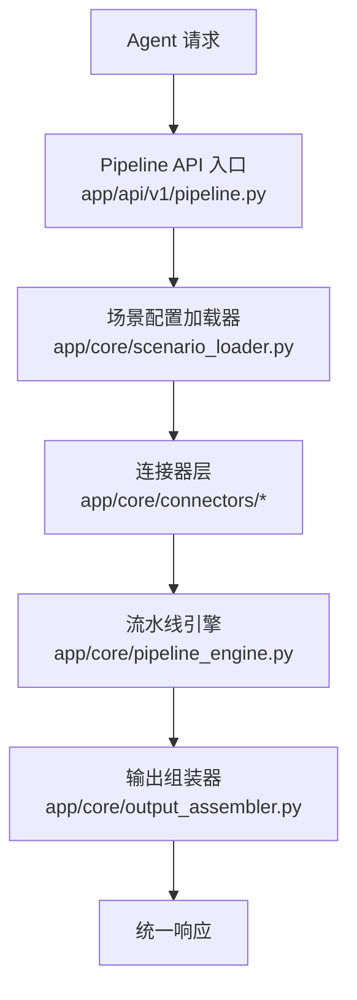
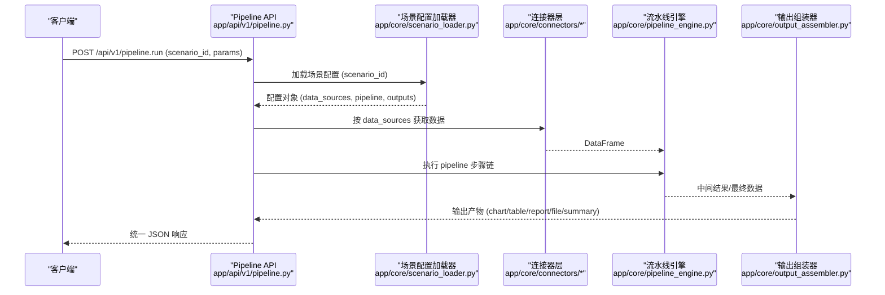
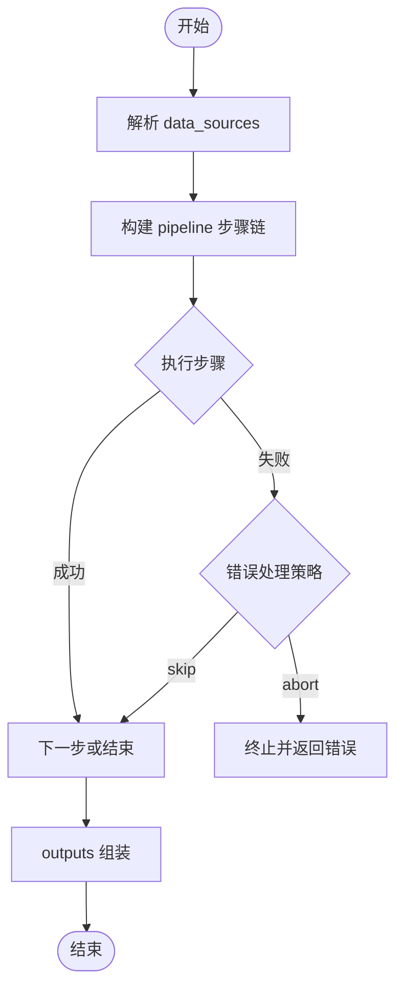
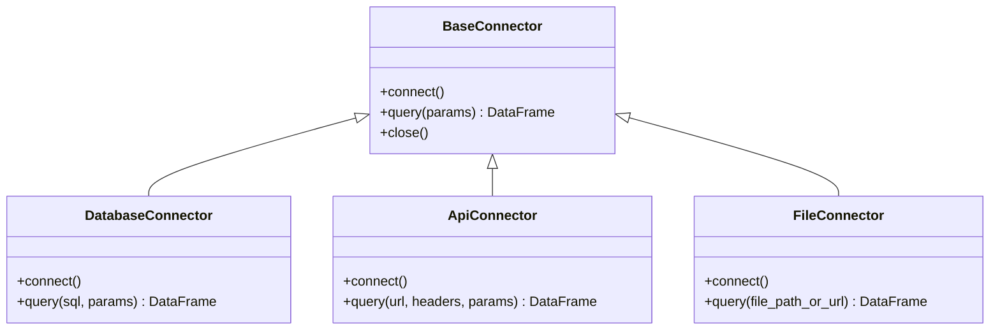
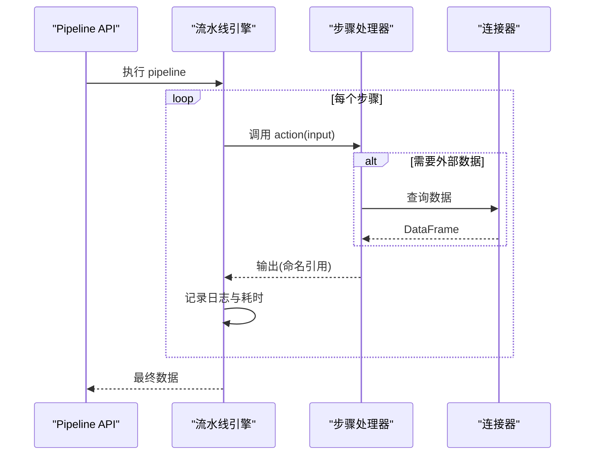

# 配置管理设计

<cite>
**本文引用的文件**
- [需求说明文档](file://docs/20260821100000_hiagent辅助Web服务_需求说明.md)
</cite>

## 目录
1. [简介](#简介)
2. [项目结构](#项目结构)
3. [核心组件](#核心组件)
4. [架构总览](#架构总览)
5. [详细组件分析](#详细组件分析)
6. [依赖关系分析](#依赖关系分析)
7. [性能与可观测性](#性能与可观测性)
8. [故障排查指南](#故障排查指南)
9. [结论](#结论)
10. [附录：模板与示例、迁移与兼容性](#附录模板与示例迁移与兼容性)

## 简介
本设计文档围绕“场景驱动的流水线引擎”展开，聚焦配置管理的设计与实现策略。目标是为多种业务分析场景提供统一、可扩展、可维护的配置体系，通过 YAML 描述数据源、处理流水线和输出产物，结合环境变量管理敏感信息，支持热加载与版本化演进，确保在安全隔离、容错优先的前提下高效交付。

## 项目结构
根据需求文档，系统采用模块化组织方式，关键新增目录如下：
- app/core/pipeline_engine.py：流水线引擎，负责步骤顺序执行、上下文传递、条件分支与错误处理
- app/core/scenario_loader.py：场景配置加载器，负责读取、校验、缓存与热更新场景配置
- app/core/connectors/：连接器层（base/database/api/file），统一抽象数据接入
- app/core/output_assembler.py：输出组装器，生成 chart/table/report/file/summary
- app/scenarios/*.yaml：场景配置文件目录，按场景拆分 YAML
- app/api/v1/pipeline.py：Pipeline API 路由，暴露 /api/v1/pipeline/run 等接口

图表来源
- [需求说明文档:33-38](file://docs/20260821100000_hiagent辅助Web服务_需求说明.md#L33-L38)
- [需求说明文档:106-114](file://docs/20260821100000_hiagent辅助Web服务_需求说明.md#L106-L114)

章节来源
- [需求说明文档:106-114](file://docs/20260821100000_hiagent辅助Web服务_需求说明.md#L106-L114)

## 核心组件
- 场景配置模型（YAML）
  - data_sources：定义数据源类型（connector）、连接参数、SQL/API 参数、请求参数映射
  - pipeline：处理流水线步骤，调用原子能力，使用命名引用传递中间数据
  - outputs：输出定义，包含 chart/table/report/file/summary 及数据来源引用
- 连接器层（Connector Layer）
  - 支持 database、api、file_upload、file_url、file_s3 等类型
  - 凭据从环境变量读取，返回统一 DataFrame，注册表模式扩展
- 流水线引擎（Pipeline Engine）
  - 步骤顺序执行，支持条件分支、步骤级错误处理（skip/abort）
  - 每步独立记录日志和耗时
- 输出组装器（Output Assembler）
  - 支持 chart/table/report/file/summary 五种输出类型
- 两种调用模式
  - Pipeline API：POST /api/v1/pipeline/run，传入 scenario_id + 参数，一次完成全流程
  - 原子 API：/api/v1/data/*、/api/v1/visual/* 等，逐步调用，由 Agent 编排

章节来源
- [需求说明文档:40-67](file://docs/20260821100000_hiagent辅助Web服务_需求说明.md#L40-L67)

## 架构总览
整体流程为：Agent 请求进入 Pipeline API 入口，由场景配置加载器读取并校验 YAML 配置；随后通过连接器获取数据，交由流水线引擎按步骤处理；最终由输出组装器生成结果并返回统一 JSON 响应。该架构强调无状态、单一职责、输入输出标准化、容错优先与安全隔离。

图表来源
- [需求说明文档:33-38](file://docs/20260821100000_hiagent辅助Web服务_需求说明.md#L33-L38)
- [需求说明文档:106-114](file://docs/20260821100000_hiagent辅助Web服务_需求说明.md#L106-L114)

## 详细组件分析

### 场景配置模型（YAML）结构与语法
- data_sources
  - 字段包括 connector 类型（database/api/file_*）、连接配置、SQL/API 参数、请求参数映射
  - 用于声明数据从哪里来、如何取数、如何映射到统一 DataFrame
- pipeline
  - 字段包括步骤序列、action 调用（原子能力）、input/output 命名引用
  - 支持条件分支与步骤级错误处理（skip/abort）
  - 每步独立记录日志与耗时，便于追踪与诊断
- outputs
  - 字段包括输出类型（chart/table/report/file/summary）与数据来源引用
  - summary 专为 Agent 设计，便于后续对话或自动化消费

图表来源
- [需求说明文档:40-63](file://docs/20260821100000_hiagent辅助Web服务_需求说明.md#L40-L63)

章节来源
- [需求说明文档:40-63](file://docs/20260821100000_hiagent辅助Web服务_需求说明.md#L40-L63)

### 连接器层（Connector Layer）
- 支持的连接器类型：database、api、file_upload、file_url、file_s3
- 所有连接器返回统一 DataFrame，凭据从环境变量读取
- 采用注册表模式扩展，新增连接器改动最小

图表来源
- [需求说明文档:46-55](file://docs/20260821100000_hiagent辅助Web服务_需求说明.md#L46-L55)

章节来源
- [需求说明文档:46-55](file://docs/20260821100000_hiagent辅助Web服务_需求说明.md#L46-L55)

### 流水线引擎（Pipeline Engine）
- 步骤顺序执行，通过命名引用传递中间数据（PipelineContext）
- 支持条件分支、步骤级错误处理（skip/abort）
- 每步独立记录日志和耗时

图表来源
- [需求说明文档:57-60](file://docs/20260821100000_hiagent辅助Web服务_需求说明.md#L57-L60)

章节来源
- [需求说明文档:57-60](file://docs/20260821100000_hiagent辅助Web服务_需求说明.md#L57-L60)

### 输出组装器（Output Assembler）
- 支持 chart/table/report/file/summary 五种输出类型
- summary 专为 Agent 设计，便于后续自动化消费

章节来源
- [需求说明文档:62-63](file://docs/20260821100000_hiagent辅助Web服务_需求说明.md#L62-L63)

### 调用模式
- 模式 A：Pipeline API（POST /api/v1/pipeline/run），传入 scenario_id + 参数，一次完成全流程
- 模式 B：原子 API（/api/v1/data/*、/api/v1/visual/* 等），逐步调用，由 Agent 自行编排

章节来源
- [需求说明文档:65-67](file://docs/20260821100000_hiagent辅助Web服务_需求说明.md#L65-L67)

## 依赖关系分析
- 模块耦合
  - Pipeline API 依赖场景配置加载器与流水线引擎
  - 流水线引擎依赖连接器层与输出组装器
  - 连接器层通过环境变量获取凭据，降低硬编码风险
- 外部依赖
  - FastAPI、PyYAML、DuckDB、pandas/numpy、httpx、Pydantic、SQLAlchemy、jsonpath-ng
- 潜在循环依赖
  - 当前设计为单向依赖（API -> Loader -> Connector -> Pipeline -> Output），避免循环

图表来源
- [需求说明文档:33-38](file://docs/20260821100000_hiagent辅助Web服务_需求说明.md#L33-L38)
- [需求说明文档:106-114](file://docs/20260821100000_hiagent辅助Web服务_需求说明.md#L106-L114)

章节来源
- [需求说明文档:33-38](file://docs/20260821100000_hiagent辅助Web服务_需求说明.md#L33-L38)
- [需求说明文档:106-114](file://docs/20260821100000_hiagent辅助Web服务_需求说明.md#L106-L114)

## 性能与可观测性
- 性能目标
  - 简单接口 < 500ms，数据处理 < 3s，Pipeline 全流程 < 10s
- 可观测性
  - 结构化日志含 scenario_id + 步骤耗时
  - 健康检查 /health
  - 场景列表接口 /api/v1/pipeline/scenarios

章节来源
- [需求说明文档:97-102](file://docs/20260821100000_hiagent辅助Web服务_需求说明.md#L97-L102)

## 故障排查指南
- 常见问题定位
  - 配置加载失败：检查 YAML 语法与必填字段
  - 连接器连接失败：检查环境变量与网络连通性
  - 步骤执行异常：查看步骤日志与耗时，确认 skip/abort 策略
  - 输出组装失败：核对 outputs 的数据源引用与格式要求
- 建议的调试方法
  - 启用详细日志，关注 scenario_id 与步骤耗时
  - 使用 /api/v1/pipeline/scenarios 验证可用场景
  - 分步调用原子 API 以缩小问题范围

章节来源
- [需求说明文档:97-102](file://docs/20260821100000_hiagent辅助Web服务_需求说明.md#L97-L102)

## 结论
本配置管理设计以 YAML 为核心，结合连接器层、流水线引擎与输出组装器，形成可配置、可扩展、可观测的场景驱动架构。通过环境变量管理敏感信息、支持热加载与版本化演进，满足多业务场景的统一治理与高效交付。

## 附录：模板与示例、迁移与兼容性

### 配置文件组织结构与命名规范
- 存放位置
  - 场景配置文件位于 app/scenarios/*.yaml，每个场景一份 YAML
- 命名规范
  - 文件名建议使用场景标识（如 competitor_analysis.yaml）
  - 保持小写、下划线分隔，避免特殊字符
- 版本管理策略
  - 建议对 YAML 进行版本控制（Git），配合变更评审与回滚机制
  - 重大变更时增加版本号或后缀（如 v2_*.yaml），保证向后兼容

章节来源
- [需求说明文档:106-114](file://docs/20260821100000_hiagent辅助Web服务_需求说明.md#L106-L114)

### 配置加载机制
- 热加载支持
  - 非功能性需求中明确“场景配置热加载”，建议在部署阶段启用监听与增量更新
- 配置验证
  - 基于 Pydantic 与 PyYAML 进行结构校验与类型检查
- 默认值处理
  - 对可选字段提供合理默认值，减少配置复杂度

章节来源
- [需求说明文档:97-102](file://docs/20260821100000_hiagent辅助Web服务_需求说明.md#L97-L102)

### 环境变量配置管理
- 敏感信息的安全存储
  - 凭据从环境变量读取，不硬编码在配置或代码中
- 多环境配置管理
  - 通过不同环境的环境变量区分数据库连接、API 密钥等
  - 结合 Docker 部署，便于环境隔离与传播

章节来源
- [需求说明文档:46-55](file://docs/20260821100000_hiagent辅助Web服务_需求说明.md#L46-L55)
- [需求说明文档:97-102](file://docs/20260821100000_hiagent辅助Web服务_需求说明.md#L97-L102)

### 配置模板与示例
- 不同业务场景的配置样例
  - 竞品分析、机构行为分析、产品规模增量分析等场景分别对应独立 YAML
- 连接器配置示例
  - database：指定数据库类型与连接参数
  - api：指定 URL、请求头与参数映射
  - file_upload/file_url/file_s3：指定文件路径或 URL
- 输出配置示例
  - chart/table/report/file/summary：指定输出类型与数据来源引用

章节来源
- [需求说明文档:40-63](file://docs/20260821100000_hiagent辅助Web服务_需求说明.md#L40-L63)

### 最佳实践
- 配置拆分策略
  - 按场景拆分 YAML，保持单一职责与高内聚
- 配置继承机制
  - 可通过公共片段与环境变量复用通用配置，减少重复
- 配置调试方法
  - 启用详细日志、使用 /api/v1/pipeline/scenarios 验证、分步调用原子 API 定位问题

章节来源
- [需求说明文档:97-102](file://docs/20260821100000_hiagent辅助Web服务_需求说明.md#L97-L102)

### 配置迁移指南与兼容性说明
- 迁移指南
  - 新增场景时复制模板并修改 data_sources/pipeline/outputs
  - 升级连接器或引擎时，注意 YAML 字段变更与默认值调整
- 兼容性说明
  - 保持向后兼容，新增字段提供默认值
  - 重大变更通过版本化文件或开关控制，避免破坏现有场景

章节来源
- [需求说明文档:97-102](file://docs/20260821100000_hiagent辅助Web服务_需求说明.md#L97-L102)