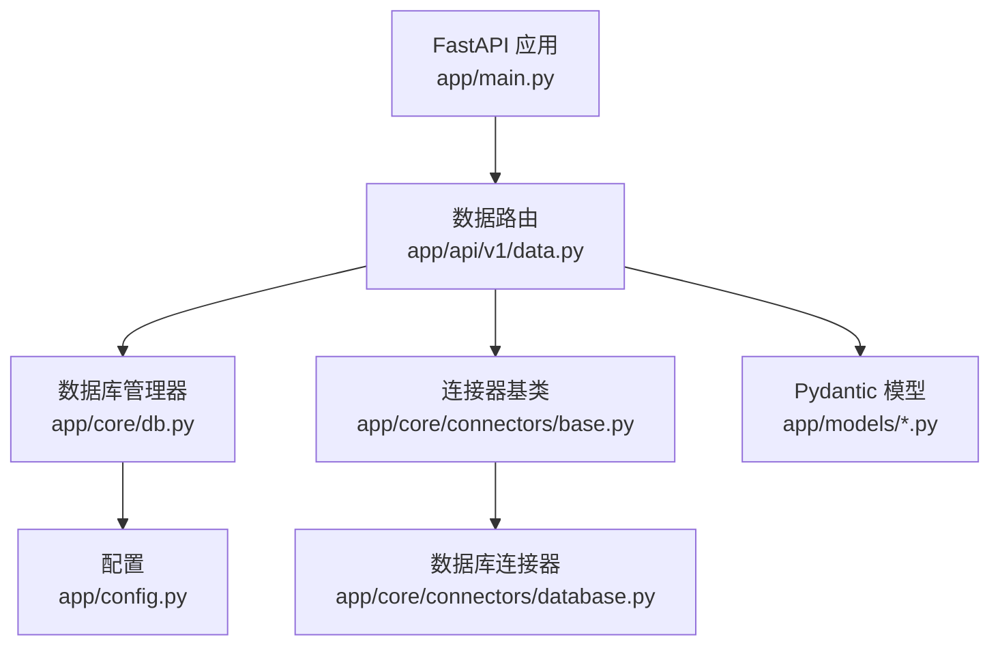
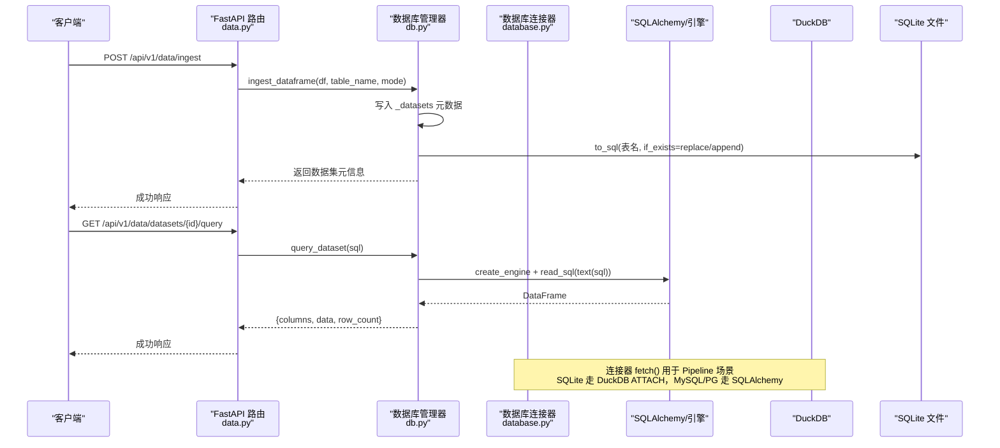
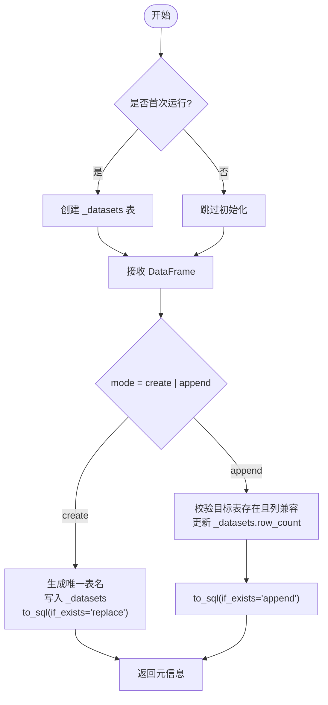
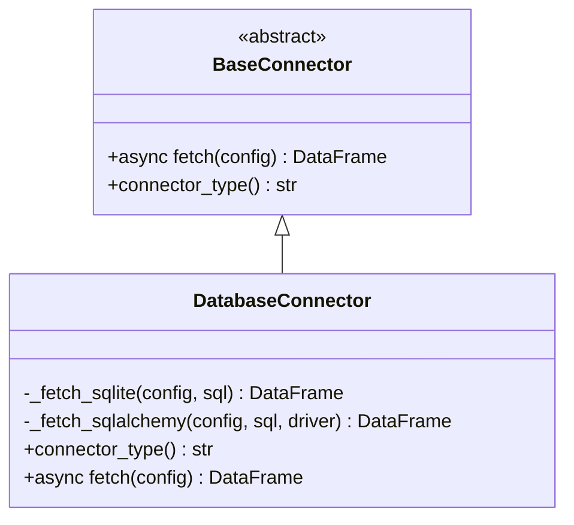
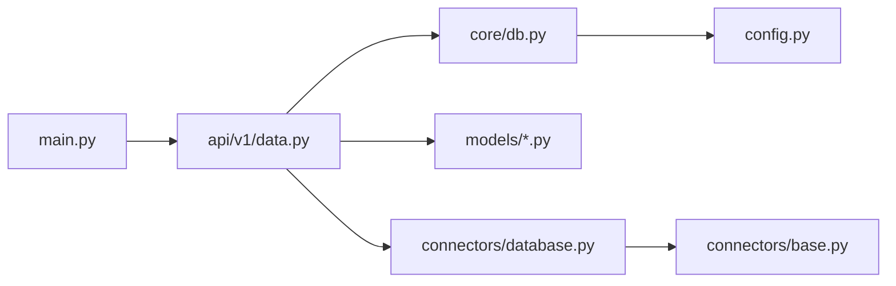

# 数据库层

<cite>
**本文引用的文件**
- [app/core/db.py](file://app/core/db.py)
- [app/core/connectors/database.py](file://app/core/connectors/database.py)
- [app/core/connectors/base.py](file://app/core/connectors/base.py)
- [app/config.py](file://app/config.py)
- [app/models/data_models.py](file://app/models/data_models.py)
- [app/models/pipeline_models.py](file://app/models/pipeline_models.py)
- [app/models/report_models.py](file://app/models/report_models.py)
- [app/models/visual_models.py](file://app/models/visual_models.py)
- [app/api/v1/data.py](file://app/api/v1/data.py)
- [app/main.py](file://app/main.py)
- [scripts/import_data.py](file://scripts/import_data.py)
</cite>

## 目录
1. [简介](#简介)
2. [项目结构](#项目结构)
3. [核心组件](#核心组件)
4. [架构总览](#架构总览)
5. [详细组件分析](#详细组件分析)
6. [依赖关系分析](#依赖关系分析)
7. [性能与连接池](#性能与连接池)
8. [故障排查指南](#故障排查指南)
9. [结论](#结论)
10. [附录：示例与最佳实践](#附录示例与最佳实践)

## 简介
本文件聚焦于项目的数据库层设计与连接管理，覆盖以下方面：
- 数据库连接的建立、配置与生命周期管理（SQLite 为主，支持 MySQL/PostgreSQL 查询）
- SQLAlchemy 的使用方式（引擎创建、连接上下文、SQL 执行）
- 模型定义与数据流（Pydantic 请求/响应模型，非 ORM 实体）
- 会话与事务处理策略（基于 sqlite3 的事务与 SQLite 表级操作）
- 连接池与高并发优化建议（当前实现与改进方向）
- 迁移与版本管理机制现状与建议
- 数据库操作示例与最佳实践（查询优化、错误处理）

## 项目结构
本项目采用分层组织：
- API 层：FastAPI 路由暴露数据入库、查询、清洗等能力
- 核心层：数据库持久化（SQLite）、连接器抽象与具体实现
- 模型层：Pydantic 数据模型用于请求/响应校验
- 配置层：应用配置（含数据库路径）
- 入口层：应用启动时初始化数据库并注册中间件与路由

图表来源
- [app/main.py:29-43](file://app/main.py#L29-L43)
- [app/api/v1/data.py:39-134](file://app/api/v1/data.py#L39-L134)
- [app/core/db.py:59-84](file://app/core/db.py#L59-L84)
- [app/core/connectors/base.py:11-24](file://app/core/connectors/base.py#L11-L24)
- [app/core/connectors/database.py:19-112](file://app/core/connectors/database.py#L19-L112)
- [app/config.py:6-22](file://app/config.py#L6-L22)

章节来源
- [app/main.py:29-43](file://app/main.py#L29-L43)
- [app/api/v1/data.py:39-134](file://app/api/v1/data.py#L39-L134)
- [app/core/db.py:59-84](file://app/core/db.py#L59-L84)
- [app/core/connectors/base.py:11-24](file://app/core/connectors/base.py#L11-L24)
- [app/core/connectors/database.py:19-112](file://app/core/connectors/database.py#L19-L112)
- [app/config.py:6-22](file://app/config.py#L6-L22)

## 核心组件
- 数据库管理器（SQLite 数据集）：负责数据集元数据表 _datasets 的初始化、写入、读取、查询与删除
- 数据库连接器：统一封装 SQLite（DuckDB）与 MySQL/PostgreSQL（SQLAlchemy）的数据获取
- 配置中心：集中管理数据库路径等设置
- Pydantic 模型：规范接口输入输出，确保类型安全

章节来源
- [app/core/db.py:59-323](file://app/core/db.py#L59-L323)
- [app/core/connectors/database.py:19-112](file://app/core/connectors/database.py#L19-L112)
- [app/config.py:6-22](file://app/config.py#L6-L22)
- [app/models/data_models.py:13-145](file://app/models/data_models.py#L13-L145)

## 架构总览
系统通过 FastAPI 暴露 REST 接口，调用核心数据库管理器完成 SQLite 数据集的持久化与查询；同时提供通用数据库连接器以支持外部 MySQL/PostgreSQL 的只读查询。

图表来源
- [app/api/v1/data.py:39-134](file://app/api/v1/data.py#L39-L134)
- [app/core/db.py:89-189](file://app/core/db.py#L89-L189)
- [app/core/db.py:262-296](file://app/core/db.py#L262-L296)
- [app/core/connectors/database.py:43-112](file://app/core/connectors/database.py#L43-L112)

## 详细组件分析

### 数据库管理器（SQLite 数据集）
职责：
- 应用启动时初始化 _datasets 元数据表
- 将 DataFrame 持久化为 SQLite 表，并记录元数据
- 提供列表、详情、预览、SQL 查询、删除等能力
- 对 SQL 进行安全限制（仅允许 SELECT/WITH）

关键流程：
- 初始化：异步线程中创建 _datasets 表
- 写入：根据模式（create/append）更新元数据并写入数据表
- 查询：使用 SQLAlchemy 引擎执行只读 SQL，返回列、数据与行数
- 删除：删除对应表与元数据记录

图表来源
- [app/core/db.py:59-84](file://app/core/db.py#L59-L84)
- [app/core/db.py:89-189](file://app/core/db.py#L89-L189)

章节来源
- [app/core/db.py:59-323](file://app/core/db.py#L59-L323)

### 数据库连接器（BaseConnector 与 DatabaseConnector）
职责：
- 抽象数据获取接口，统一返回 DataFrame
- 支持 SQLite（DuckDB ATTACH）与 MySQL/PostgreSQL（SQLAlchemy）
- 从配置中解析驱动、连接参数与 SQL

关键点：
- SQLite：内存 DuckDB 实例 ATTACH 外部 .db 文件后执行 SQL
- MySQL/PostgreSQL：动态构建 URL，使用 create_engine 连接并执行 SQL
- 异常包装：统一转换为 AppException 并附带 ErrorCode

图表来源
- [app/core/connectors/base.py:11-24](file://app/core/connectors/base.py#L11-L24)
- [app/core/connectors/database.py:19-112](file://app/core/connectors/database.py#L19-L112)

章节来源
- [app/core/connectors/base.py:11-24](file://app/core/connectors/base.py#L11-L24)
- [app/core/connectors/database.py:19-112](file://app/core/connectors/database.py#L19-L112)

### 配置与生命周期
- 配置项：包含数据库文件路径 db_path，默认 ./data/hiagent.db
- 生命周期：应用启动时调用 init_db() 确保 _datasets 表存在；关闭时取消后台任务

章节来源
- [app/config.py:6-22](file://app/config.py#L6-L22)
- [app/main.py:29-43](file://app/main.py#L29-L43)
- [app/core/db.py:59-84](file://app/core/db.py#L59-L84)

### 模型与数据流
- Pydantic 模型用于接口校验与文档生成，不涉及 ORM 映射
- 数据在 API 层被解析为 DataFrame，再交由数据库管理器或连接器处理
- 报告与可视化模块也通过 Pydantic 模型约束输入输出

章节来源
- [app/models/data_models.py:13-145](file://app/models/data_models.py#L13-L145)
- [app/models/report_models.py:11-36](file://app/models/report_models.py#L11-L36)
- [app/models/visual_models.py:15-107](file://app/models/visual_models.py#L15-L107)
- [app/models/pipeline_models.py:11-46](file://app/models/pipeline_models.py#L11-L46)

## 依赖关系分析
- API 层依赖数据库管理器与 Pydantic 模型
- 数据库管理器依赖配置与应用异常体系
- 连接器依赖基础抽象与错误码
- 入口层负责应用生命周期与中间件注册

图表来源
- [app/main.py:29-43](file://app/main.py#L29-L43)
- [app/api/v1/data.py:39-134](file://app/api/v1/data.py#L39-L134)
- [app/core/db.py:59-323](file://app/core/db.py#L59-L323)
- [app/core/connectors/database.py:19-112](file://app/core/connectors/database.py#L19-L112)
- [app/core/connectors/base.py:11-24](file://app/core/connectors/base.py#L11-L24)
- [app/config.py:6-22](file://app/config.py#L6-L22)

章节来源
- [app/main.py:29-43](file://app/main.py#L29-L43)
- [app/api/v1/data.py:39-134](file://app/api/v1/data.py#L39-L134)
- [app/core/db.py:59-323](file://app/core/db.py#L59-L323)
- [app/core/connectors/database.py:19-112](file://app/core/connectors/database.py#L19-L112)
- [app/core/connectors/base.py:11-24](file://app/core/connectors/base.py#L11-L24)
- [app/config.py:6-22](file://app/config.py#L6-L22)

## 性能与连接池
当前实现特点：
- SQLite 写入：每次写入使用独立 sqlite3 连接，避免跨线程问题；数据表写入通过 SQLAlchemy 临时引擎 with 上下文管理
- SQLite 查询：每次查询创建新引擎并 dispose，未复用连接
- MySQL/PostgreSQL 查询：每次请求创建新引擎并在 with 块内连接，结束后 dispose

潜在瓶颈：
- 频繁创建/销毁引擎带来开销
- 无显式连接池配置，在高并发下可能成为瓶颈

优化建议（不改变现有代码的前提下）：
- 引入全局 Engine 并配置连接池参数（如 pool_size、max_overflow、pool_recycle），减少连接创建成本
- 对于高频只读查询，可考虑连接池预热与连接复用
- 对大结果集查询增加分页与列裁剪，降低网络与序列化开销
- 针对 SQLite 的高并发写，考虑 WAL 模式与适当的锁策略（需评估业务一致性要求）

章节来源
- [app/core/db.py:142-172](file://app/core/db.py#L142-L172)
- [app/core/db.py:285-296](file://app/core/db.py#L285-L296)
- [app/core/connectors/database.py:105-111](file://app/core/connectors/database.py#L105-L111)

## 故障排查指南
常见问题与定位：
- SQL 安全限制报错：仅允许 SELECT/WITH 开头的语句，检查传入 SQL 是否包含危险关键字
- 追加模式失败：确认目标表存在且列兼容，检查 _datasets 中的 columns 字段
- 资源不存在：数据集 ID 无效或已被删除
- 连接器错误：缺少必要配置（如 path、host、port、user、password、database、sql）

错误处理策略：
- 统一抛出 AppException 并携带 ErrorCode，便于上层捕获与标准化响应
- 日志记录关键步骤（入库、删除、查询）以便追踪

章节来源
- [app/core/db.py:256-296](file://app/core/db.py#L256-L296)
- [app/core/db.py:301-323](file://app/core/db.py#L301-L323)
- [app/core/connectors/database.py:43-68](file://app/core/connectors/database.py#L43-L68)
- [app/api/v1/data.py:52-83](file://app/api/v1/data.py#L52-L83)
- [app/api/v1/data.py:108-134](file://app/api/v1/data.py#L108-L134)

## 结论
- 本项目以 SQLite 为核心存储，提供数据集的持久化与只读查询能力，并通过通用连接器扩展至 MySQL/PostgreSQL
- 数据库层采用轻量设计：无 ORM 实体，使用 Pydantic 模型进行接口校验；SQL 通过 SQLAlchemy 文本执行
- 连接管理简单直接，适合中小规模场景；在高并发环境下建议引入连接池与引擎复用以提升性能
- 迁移机制尚未内置，建议后续引入 Alembic 或等效工具进行版本化管理

## 附录：示例与最佳实践

- 应用启动时初始化数据库
  - 参考路径：[应用生命周期初始化:29-43](file://app/main.py#L29-L43)

- 数据入库（create/append）
  - 参考路径：[入库接口与逻辑:39-83](file://app/api/v1/data.py#L39-L83)
  - 参考路径：[DataFrame 入库实现:89-189](file://app/core/db.py#L89-L189)

- 列出与查询数据集
  - 参考路径：[列表接口:86-90](file://app/api/v1/data.py#L86-L90)
  - 参考路径：[详情与预览:93-105](file://app/api/v1/data.py#L93-L105)
  - 参考路径：[SQL 查询接口:108-122](file://app/api/v1/data.py#L108-L122)
  - 参考路径：[只读 SQL 执行:262-296](file://app/core/db.py#L262-L296)

- 删除数据集
  - 参考路径：[删除接口:125-134](file://app/api/v1/data.py#L125-L134)
  - 参考路径：[删除实现:301-323](file://app/core/db.py#L301-L323)

- 批量导入脚本
  - 参考路径：[导入脚本主流程:84-120](file://scripts/import_data.py#L84-L120)

- 连接器使用（Pipeline 场景）
  - 参考路径：[连接器 fetch 流程:43-112](file://app/core/connectors/database.py#L43-L112)
  - 参考路径：[连接器抽象:11-24](file://app/core/connectors/base.py#L11-L24)

最佳实践建议：
- 始终使用只读 SQL 查询，避免在用户输入中拼接危险语句
- 对大数据集查询增加 LIMIT 与列选择，减少传输与序列化成本
- 在高并发场景下，为 SQLAlchemy 引擎配置连接池参数并复用引擎实例
- 使用 Pydantic 模型严格校验输入，提升接口健壮性与可维护性
- 记录关键操作的日志，便于问题定位与审计