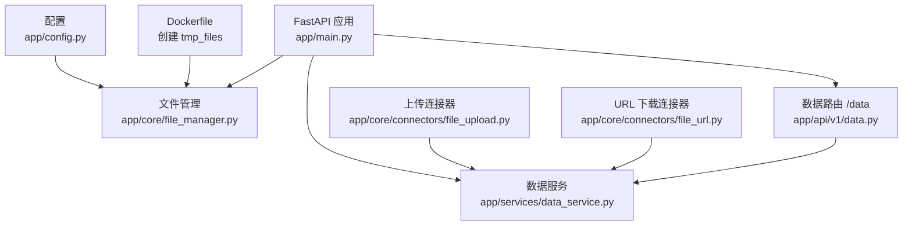
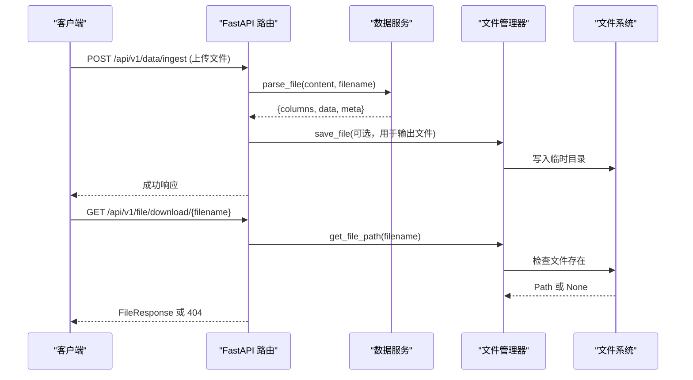
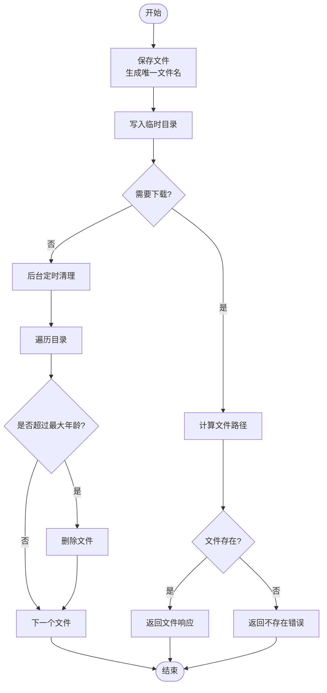
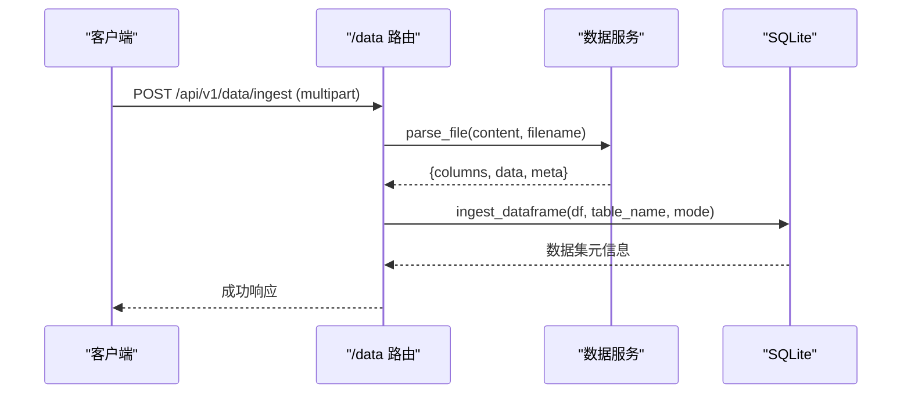
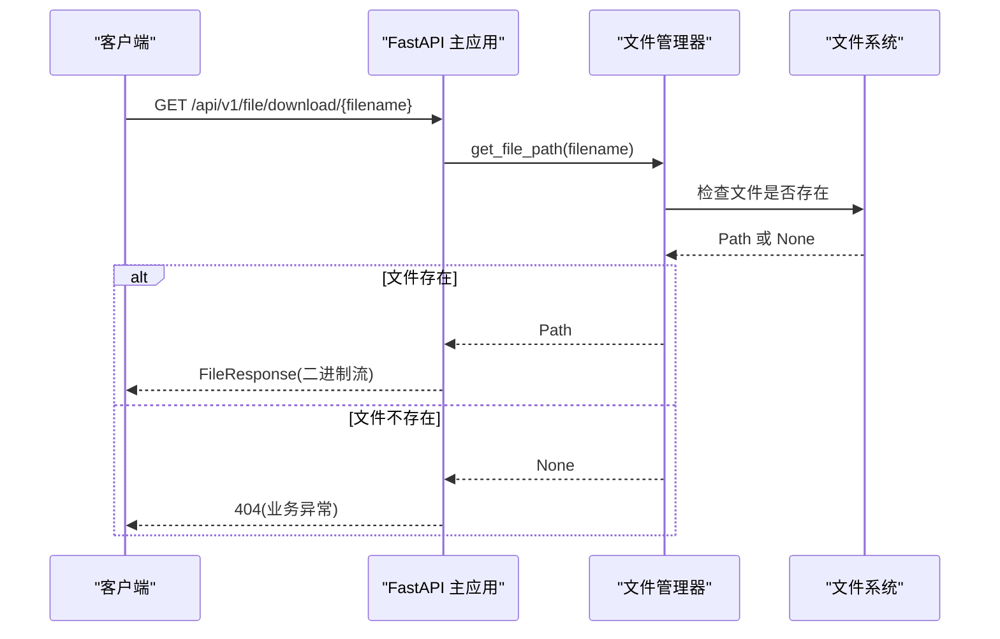
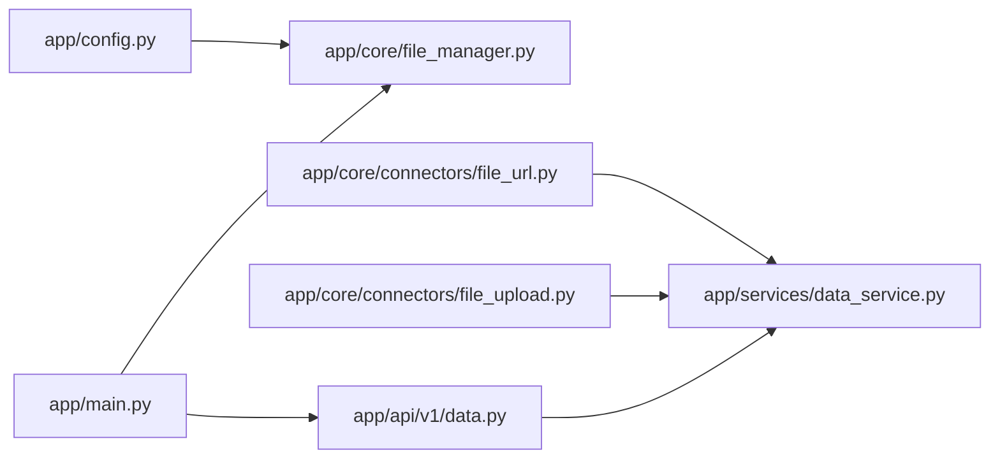

# 文件管理

<cite>
**本文引用的文件**
- [app/core/file_manager.py](file://app/core/file_manager.py)
- [app/main.py](file://app/main.py)
- [app/config.py](file://app/config.py)
- [app/services/data_service.py](file://app/services/data_service.py)
- [app/api/v1/data.py](file://app/api/v1/data.py)
- [app/core/connectors/file_upload.py](file://app/core/connectors/file_upload.py)
- [app/core/connectors/file_url.py](file://app/core/connectors/file_url.py)
- [app/core/response.py](file://app/core/response.py)
- [Dockerfile](file://Dockerfile)
</cite>

## 目录
1. [简介](#简介)
2. [项目结构](#项目结构)
3. [核心组件](#核心组件)
4. [架构总览](#架构总览)
5. [详细组件分析](#详细组件分析)
6. [依赖关系分析](#依赖关系分析)
7. [性能考量](#性能考量)
8. [故障排查指南](#故障排查指南)
9. [结论](#结论)
10. [附录：API 使用示例与最佳实践](#附录api-使用示例与最佳实践)

## 简介
本文件系统面向数据处理与报表生成场景，提供临时文件的创建、存储、访问与自动清理能力；支持通过上传或 URL 下载方式获取数据文件并进行解析入库；同时提供统一的文件下载接口。系统采用 FastAPI 构建，结合异步任务实现后台定时清理，确保临时文件生命周期可控、可观测且安全。

## 项目结构
- 应用入口与中间件、异常处理、路由挂载位于主程序模块。
- 文件管理核心逻辑集中在独立模块，负责临时文件存储路径、保存、读取、删除与过期清理。
- 数据服务层统一处理文件格式解析、编码检测、SQL 查询限制等。
- 连接器抽象了不同来源的数据接入（本地上传、URL 下载）。
- 配置集中管理，包括临时文件目录、清理周期等。
- Docker 镜像中预建临时文件目录，便于容器化部署。

图表来源
- [app/main.py:29-95](file://app/main.py#L29-L95)
- [app/core/file_manager.py:15-77](file://app/core/file_manager.py#L15-L77)
- [app/services/data_service.py:77-117](file://app/services/data_service.py#L77-L117)
- [app/api/v1/data.py:39-83](file://app/api/v1/data.py#L39-L83)
- [app/core/connectors/file_upload.py:18-64](file://app/core/connectors/file_upload.py#L18-L64)
- [app/core/connectors/file_url.py:19-83](file://app/core/connectors/file_url.py#L19-L83)
- [app/config.py:6-22](file://app/config.py#L6-L22)
- [Dockerfile:18-19](file://Dockerfile#L18-L19)

章节来源
- [app/main.py:29-95](file://app/main.py#L29-L95)
- [app/config.py:6-22](file://app/config.py#L6-L22)
- [Dockerfile:18-19](file://Dockerfile#L18-L19)

## 核心组件
- 临时文件管理器：提供保存、读取、删除与过期清理能力，基于配置的路径进行文件组织。
- 数据服务：统一解析 CSV/Excel/JSON，自动编码检测，并执行 SQL 查询（仅允许 SELECT/WITH），保障数据安全。
- 上传连接器：接收 base64 编码的文件内容，解码后交由数据服务解析。
- URL 下载连接器：从指定 URL 下载文件，支持自定义请求头与超时，解析后返回 DataFrame。
- 应用入口：注册路由、启动后台清理任务、暴露文件下载接口。

章节来源
- [app/core/file_manager.py:15-77](file://app/core/file_manager.py#L15-L77)
- [app/services/data_service.py:77-158](file://app/services/data_service.py#L77-L158)
- [app/core/connectors/file_upload.py:18-64](file://app/core/connectors/file_upload.py#L18-L64)
- [app/core/connectors/file_url.py:19-83](file://app/core/connectors/file_url.py#L19-L83)
- [app/main.py:29-95](file://app/main.py#L29-L95)

## 架构总览
系统以 FastAPI 为入口，通过路由将请求分发到数据服务或文件管理模块。上传与 URL 下载两种数据源最终都汇聚到数据服务进行解析；生成的结果可用于后续处理或直接落盘为临时文件；后台定时任务按配置周期清理过期临时文件；文件下载接口直接提供已保存的临时文件下载。

图表来源
- [app/api/v1/data.py:39-83](file://app/api/v1/data.py#L39-L83)
- [app/services/data_service.py:77-117](file://app/services/data_service.py#L77-L117)
- [app/core/file_manager.py:22-35](file://app/core/file_manager.py#L22-L35)
- [app/main.py:81-93](file://app/main.py#L81-L93)

## 详细组件分析

### 临时文件生命周期管理
- 创建：调用保存函数生成唯一文件名并写入配置的临时目录。
- 存储：所有临时文件集中存放在配置项指定的目录，默认在应用根目录下的 tmp_files。
- 访问：根据文件名计算完整路径，若文件存在则返回路径供下载。
- 清理：后台任务周期性扫描目录，删除超过最大存活时间的文件，记录清理数量。

图表来源
- [app/core/file_manager.py:22-77](file://app/core/file_manager.py#L22-L77)
- [app/main.py:81-93](file://app/main.py#L81-L93)

章节来源
- [app/core/file_manager.py:15-77](file://app/core/file_manager.py#L15-L77)
- [app/config.py:6-22](file://app/config.py#L6-L22)
- [app/main.py:29-43](file://app/main.py#L29-L43)

### 文件上传处理流程
- 输入：支持 multipart/form-data 上传文件，或通过连接器传入 base64 编码内容与文件名。
- 格式验证：数据服务根据扩展名判断支持的格式（CSV/Excel/JSON），不支持时返回错误码。
- 大小限制：当前代码未显式限制文件大小，建议在网关或中间件层增加限制以避免内存溢出。
- 安全检查：SQL 查询仅允许 SELECT/WITH；上传文件解析失败会抛出业务异常并返回统一错误码。

图表来源
- [app/api/v1/data.py:39-83](file://app/api/v1/data.py#L39-L83)
- [app/services/data_service.py:77-117](file://app/services/data_service.py#L77-L117)

章节来源
- [app/api/v1/data.py:39-83](file://app/api/v1/data.py#L39-L83)
- [app/services/data_service.py:77-117](file://app/services/data_service.py#L77-L117)
- [app/core/connectors/file_upload.py:18-64](file://app/core/connectors/file_upload.py#L18-L64)

### 文件下载服务实现
- 临时链接：当前实现为直接下载已保存的临时文件，未实现带过期时间的临时链接。
- 权限控制：当前未实现鉴权，任何知道文件名的客户端均可下载。
- 过期时间：通过后台任务按配置周期清理过期文件，但下载接口本身不校验过期时间。

图表来源
- [app/main.py:81-93](file://app/main.py#L81-L93)
- [app/core/file_manager.py:30-35](file://app/core/file_manager.py#L30-L35)

章节来源
- [app/main.py:81-93](file://app/main.py#L81-L93)
- [app/core/file_manager.py:30-35](file://app/core/file_manager.py#L30-L35)

### 文件存储策略与目录结构设计
- 存储位置：由配置项指定，默认应用根目录下的 tmp_files。
- 命名策略：使用 UUID 生成唯一文件名，避免冲突。
- 组织结构：扁平目录结构，便于快速遍历与清理。
- 安全性：建议对临时目录设置合适的文件系统权限，并在网关层限制访问范围。

章节来源
- [app/config.py:6-22](file://app/config.py#L6-L22)
- [app/core/file_manager.py:15-27](file://app/core/file_manager.py#L15-L27)
- [Dockerfile:18-19](file://Dockerfile#L18-L19)

## 依赖关系分析
- 主应用依赖文件管理器、数据库初始化、路由与异常处理器。
- 数据路由依赖数据服务进行解析与处理。
- 连接器依赖数据服务进行解析，统一错误处理。
- 配置被文件管理器与应用启动参数使用。

图表来源
- [app/main.py:29-95](file://app/main.py#L29-L95)
- [app/api/v1/data.py:39-83](file://app/api/v1/data.py#L39-L83)
- [app/services/data_service.py:77-158](file://app/services/data_service.py#L77-L158)
- [app/core/connectors/file_upload.py:18-64](file://app/core/connectors/file_upload.py#L18-L64)
- [app/core/connectors/file_url.py:19-83](file://app/core/connectors/file_url.py#L19-L83)
- [app/config.py:6-22](file://app/config.py#L6-L22)

章节来源
- [app/main.py:29-95](file://app/main.py#L29-L95)
- [app/api/v1/data.py:39-83](file://app/api/v1/data.py#L39-L83)
- [app/services/data_service.py:77-158](file://app/services/data_service.py#L77-L158)
- [app/core/connectors/file_upload.py:18-64](file://app/core/connectors/file_upload.py#L18-L64)
- [app/core/connectors/file_url.py:19-83](file://app/core/connectors/file_url.py#L19-L83)
- [app/config.py:6-22](file://app/config.py#L6-L22)

## 性能考量
- 临时文件清理：后台任务默认每 30 分钟执行一次，可按需调整间隔；清理过程遍历目录，文件数量较大时可能带来 I/O 压力。
- 大文件上传：当前未限制文件大小，建议在网关或中间件层限制请求体大小，防止内存占用过高。
- 并发下载：FileResponse 直接返回文件流，注意磁盘 I/O 与网络带宽瓶颈。
- SQL 查询：仅允许 SELECT/WITH，减少执行风险；大量数据查询建议使用分页与索引优化。

[本节为通用指导，不直接分析具体文件]

## 故障排查指南
- 文件解析失败：检查文件格式是否受支持（CSV/Excel/JSON），确认编码是否正确；查看错误码与消息定位问题。
- SQL 执行错误：确认语句以 SELECT 或 WITH 开头，避免危险关键字；检查表名与列名匹配。
- 文件不存在：下载接口返回业务异常，确认文件名是否正确以及文件是否已被清理。
- 连接失败：URL 下载连接器可能因网络或权限问题失败，检查 URL、请求头与超时设置。

章节来源
- [app/services/data_service.py:77-158](file://app/services/data_service.py#L77-L158)
- [app/core/connectors/file_url.py:34-72](file://app/core/connectors/file_url.py#L34-L72)
- [app/core/response.py:12-68](file://app/core/response.py#L12-L68)

## 结论
本文件系统提供了完整的临时文件生命周期管理能力，并通过统一的数据服务与连接器实现了灵活的数据接入与解析。后台定时清理确保资源释放，下载接口简化了文件访问。当前版本未实现临时链接与权限控制，可在后续迭代中增强安全性与可审计性。

[本节为总结，不直接分析具体文件]

## 附录：API 使用示例与最佳实践

- 上传并入库
  - 端点：POST /api/v1/data/ingest
  - 说明：上传 CSV/Excel/JSON 文件，解析后持久化到 SQLite；支持 create 与 append 模式。
  - 参考路径：[app/api/v1/data.py:39-83](file://app/api/v1/data.py#L39-L83)

- 解析文件为 DataFrame
  - 端点：POST /api/v1/data/parse
  - 说明：返回列名、数据与元信息，便于后续处理。
  - 参考路径：[app/api/v1/data.py:139-144](file://app/api/v1/data.py#L139-L144)

- SQL 查询
  - 端点：POST /api/v1/data/query
  - 说明：仅允许 SELECT/WITH 语句，具备注入防护。
  - 参考路径：[app/api/v1/data.py:147-151](file://app/api/v1/data.py#L147-L151)

- 数据筛选、聚合、透视、排序、去重、清洗、统计
  - 端点：/filter、/aggregate、/pivot、/sort、/dedup、/clean、/statistics
  - 说明：各端点对应数据服务的相应功能。
  - 参考路径：[app/api/v1/data.py:154-200](file://app/api/v1/data.py#L154-L200)

- 文件下载
  - 端点：GET /api/v1/file/download/{filename}
  - 说明：直接下载已保存的临时文件；当前无过期时间与权限控制。
  - 参考路径：[app/main.py:81-93](file://app/main.py#L81-L93)

- 最佳实践
  - 在网关层限制上传文件大小与请求频率，避免资源滥用。
  - 为临时目录设置最小权限，限制外部访问。
  - 定期审查清理策略与日志，确保存储空间健康。
  - 对下载接口增加鉴权与访问审计，必要时引入带过期时间的临时链接。

章节来源
- [app/api/v1/data.py:39-200](file://app/api/v1/data.py#L39-L200)
- [app/main.py:81-93](file://app/main.py#L81-L93)
- [app/services/data_service.py:77-158](file://app/services/data_service.py#L77-L158)
- [app/core/response.py:12-68](file://app/core/response.py#L12-L68)