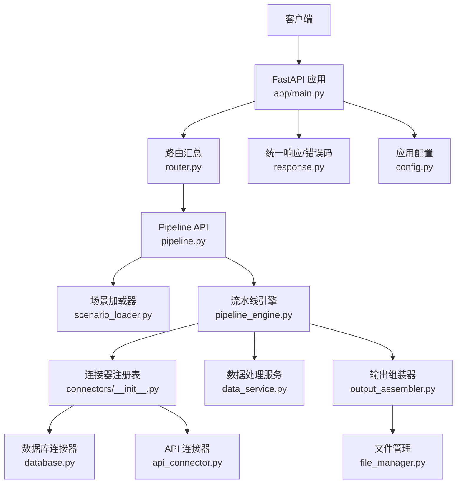
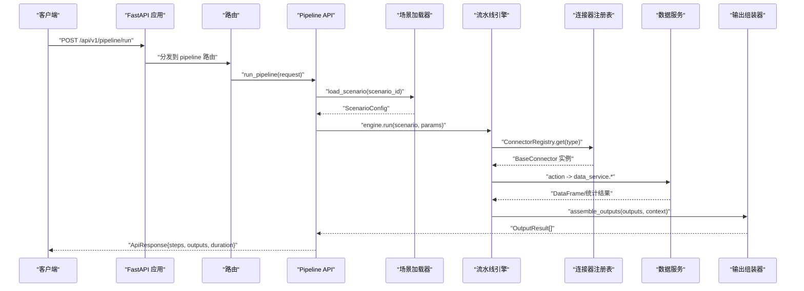
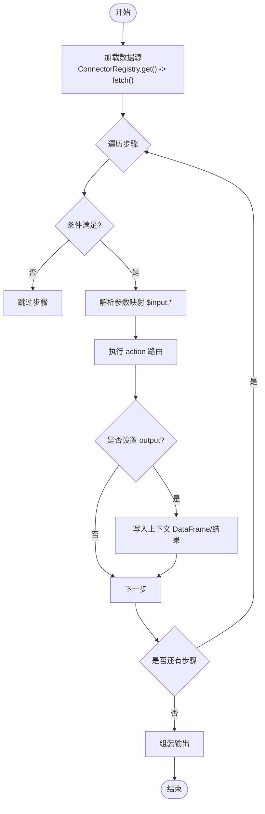
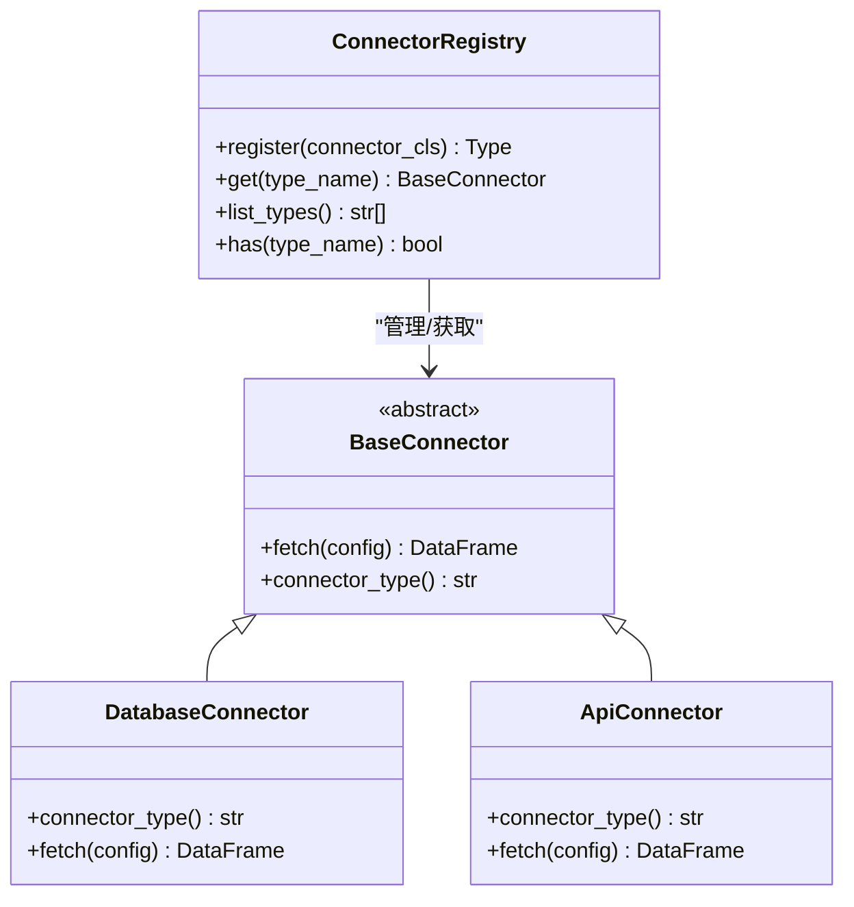
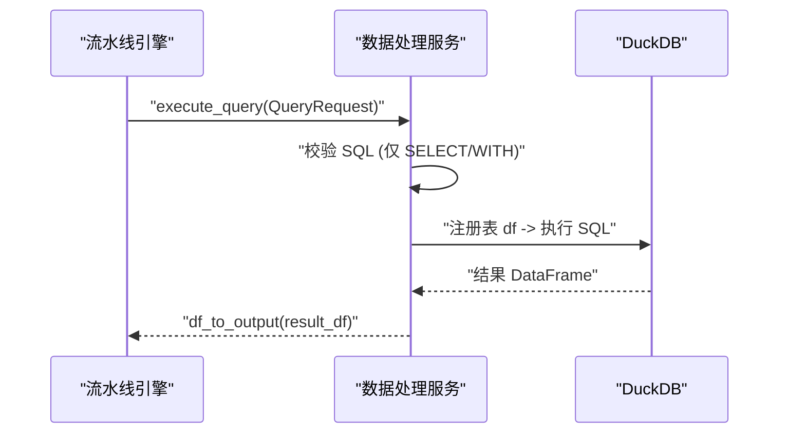
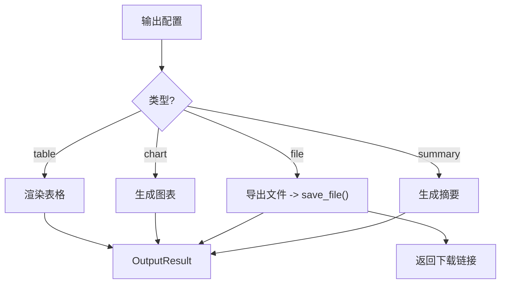
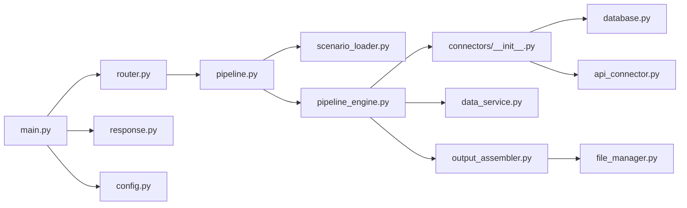

# 核心架构

<cite>
**本文引用的文件**
- [app/main.py](file://app/main.py)
- [app/config.py](file://app/config.py)
- [app/api/v1/router.py](file://app/api/v1/router.py)
- [app/api/v1/pipeline.py](file://app/api/v1/pipeline.py)
- [app/core/scenario_loader.py](file://app/core/scenario_loader.py)
- [app/core/pipeline_engine.py](file://app/core/pipeline_engine.py)
- [app/core/connectors/__init__.py](file://app/core/connectors/__init__.py)
- [app/core/connectors/base.py](file://app/core/connectors/base.py)
- [app/core/connectors/database.py](file://app/core/connectors/database.py)
- [app/core/connectors/api_connector.py](file://app/core/connectors/api_connector.py)
- [app/services/data_service.py](file://app/services/data_service.py)
- [app/core/output_assembler.py](file://app/core/output_assembler.py)
- [app/core/file_manager.py](file://app/core/file_manager.py)
- [app/core/response.py](file://app/core/response.py)
- [app/scenarios/sample_analysis.yaml](file://app/scenarios/sample_analysis.yaml)
</cite>

## 目录
1. [简介](#简介)
2. [项目结构](#项目结构)
3. [核心组件](#核心组件)
4. [架构总览](#架构总览)
5. [详细组件分析](#详细组件分析)
6. [依赖关系分析](#依赖关系分析)
7. [性能考量](#性能考量)
8. [故障排查指南](#故障排查指南)
9. [结论](#结论)
10. [附录](#附录)

## 简介
本文件深入解析 hiagent 辅助 Web 服务的核心架构设计，围绕分层架构（API 层、服务层、核心引擎层、数据访问层）展开，重点说明流水线引擎的设计原理与执行机制（YAML 场景配置解析、步骤编排、条件分支、错误处理），连接器系统的抽象设计与扩展机制（统一接入多种数据源），以及文件管理、数据库连接、错误处理和响应封装等基础设施。文末提供架构图与数据流转图，帮助开发者理解系统内部工作机制。

## 项目结构
- API 层：基于 FastAPI 的 HTTP 路由与中间件，负责请求/响应、跨域、异常处理、下载接口等。
- 服务层：数据处理、可视化、报表等业务逻辑。
- 核心引擎层：流水线引擎、场景加载器、输出组装器、连接器注册表与抽象基类。
- 数据访问层：数据库连接器、API 连接器、文件上传/URL 连接器等。
- 配置与基础设施：应用配置、统一响应模型、错误码、临时文件管理。

**图表来源**
- [app/main.py:29-95](file://app/main.py#L29-L95)
- [app/api/v1/router.py:1-18](file://app/api/v1/router.py#L1-L18)
- [app/api/v1/pipeline.py:14-48](file://app/api/v1/pipeline.py#L14-L48)
- [app/core/scenario_loader.py:68-105](file://app/core/scenario_loader.py#L68-L105)
- [app/core/pipeline_engine.py:249-357](file://app/core/pipeline_engine.py#L249-L357)
- [app/core/connectors/__init__.py:13-59](file://app/core/connectors/__init__.py#L13-L59)
- [app/core/connectors/database.py:19-112](file://app/core/connectors/database.py#L19-L112)
- [app/core/connectors/api_connector.py:18-129](file://app/core/connectors/api_connector.py#L18-L129)
- [app/services/data_service.py:128-159](file://app/services/data_service.py#L128-L159)
- [app/core/output_assembler.py:19-189](file://app/core/output_assembler.py#L19-L189)
- [app/core/file_manager.py:22-78](file://app/core/file_manager.py#L22-L78)
- [app/core/response.py:12-103](file://app/core/response.py#L12-L103)
- [app/config.py:6-23](file://app/config.py#L6-L23)

**章节来源**
- [app/main.py:29-95](file://app/main.py#L29-L95)
- [app/api/v1/router.py:1-18](file://app/api/v1/router.py#L1-L18)
- [app/config.py:6-23](file://app/config.py#L6-L23)

## 核心组件
- 应用入口与生命周期：创建 FastAPI 应用、注册中间件、异常处理器、挂载路由、启动时初始化数据库与后台清理任务。
- 场景加载器：从 YAML 读取并校验场景配置，定义数据源、流水线步骤、输出项。
- 流水线引擎：按场景配置执行数据源加载、步骤编排、条件判断、错误处理、结果收集与输出组装。
- 连接器系统：抽象基类 + 注册表模式，支持数据库、REST API、文件上传/URL 等多种数据源统一接入。
- 数据处理服务：SQL 查询、筛选、聚合、透视、排序、去重、清洗、统计分析等。
- 输出组装器：将上下文中的 DataFrame/结果渲染为表格、图表、文件、摘要等输出。
- 文件管理：临时文件保存、路径获取、删除与定时清理。
- 统一响应与错误码：标准化返回结构与错误码映射。

**章节来源**
- [app/main.py:29-95](file://app/main.py#L29-L95)
- [app/core/scenario_loader.py:21-56](file://app/core/scenario_loader.py#L21-L56)
- [app/core/pipeline_engine.py:39-70](file://app/core/pipeline_engine.py#L39-L70)
- [app/core/connectors/base.py:11-24](file://app/core/connectors/base.py#L11-L24)
- [app/core/connectors/__init__.py:13-59](file://app/core/connectors/__init__.py#L13-L59)
- [app/services/data_service.py:35-73](file://app/services/data_service.py#L35-L73)
- [app/core/output_assembler.py:19-189](file://app/core/output_assembler.py#L19-L189)
- [app/core/file_manager.py:15-78](file://app/core/file_manager.py#L15-L78)
- [app/core/response.py:12-103](file://app/core/response.py#L12-L103)

## 架构总览
系统采用分层架构：
- API 层：接收请求、参数校验、调用服务层、统一响应。
- 服务层：业务逻辑实现（数据处理、可视化、报表）。
- 核心引擎层：编排执行（场景加载、流水线运行、输出组装）。
- 数据访问层：多数据源接入（数据库、API、文件）。

**图表来源**
- [app/api/v1/pipeline.py:14-48](file://app/api/v1/pipeline.py#L14-L48)
- [app/core/scenario_loader.py:68-105](file://app/core/scenario_loader.py#L68-L105)
- [app/core/pipeline_engine.py:249-357](file://app/core/pipeline_engine.py#L249-L357)
- [app/core/connectors/__init__.py:13-59](file://app/core/connectors/__init__.py#L13-L59)
- [app/services/data_service.py:128-159](file://app/services/data_service.py#L128-L159)
- [app/core/output_assembler.py:19-189](file://app/core/output_assembler.py#L19-L189)

## 详细组件分析

### 流水线引擎与场景编排
- 场景配置：通过 YAML 定义 scenario_id、name、description、version、data_sources、pipeline、outputs。
- 参数映射：支持 $input.xxx 引用，在步骤参数中动态替换。
- 条件分支：支持 has:ref、not_empty:ref 等简单条件表达式。
- 错误处理：每个步骤可配置 on_error=skip|abort；捕获 AppException 与通用异常，记录步骤状态与耗时。
- 输出组装：根据 outputs 配置生成 table/chart/file/summary。

**图表来源**
- [app/core/pipeline_engine.py:77-119](file://app/core/pipeline_engine.py#L77-L119)
- [app/core/pipeline_engine.py:131-234](file://app/core/pipeline_engine.py#L131-L234)
- [app/core/pipeline_engine.py:249-357](file://app/core/pipeline_engine.py#L249-L357)
- [app/core/output_assembler.py:19-189](file://app/core/output_assembler.py#L19-L189)

**章节来源**
- [app/core/scenario_loader.py:21-56](file://app/core/scenario_loader.py#L21-L56)
- [app/core/pipeline_engine.py:77-119](file://app/core/pipeline_engine.py#L77-L119)
- [app/core/pipeline_engine.py:131-234](file://app/core/pipeline_engine.py#L131-L234)
- [app/core/pipeline_engine.py:249-357](file://app/core/pipeline_engine.py#L249-L357)
- [app/scenarios/sample_analysis.yaml:1-68](file://app/scenarios/sample_analysis.yaml#L1-L68)

### 连接器系统与扩展机制
- 抽象基类：BaseConnector 定义 fetch(config) 与 connector_type()。
- 注册表：ConnectorRegistry 单例维护类型到类的映射，支持装饰器式注册与类型查询。
- 内置连接器：
  - DatabaseConnector：SQLite（DuckDB）、MySQL/PostgreSQL（SQLAlchemy）。
  - ApiConnector：HTTP GET/POST，支持重试、超时、JSON 路径提取、转 DataFrame。
  - FileUploadConnector/FileUrlConnector：文件上传与 URL 拉取（由注册表导入并注册）。
- 扩展方式：新增连接器类实现 BaseConnector，并在 __init__ 末尾注册即可被引擎发现。

**图表来源**
- [app/core/connectors/base.py:11-24](file://app/core/connectors/base.py#L11-L24)
- [app/core/connectors/__init__.py:13-59](file://app/core/connectors/__init__.py#L13-L59)
- [app/core/connectors/database.py:19-112](file://app/core/connectors/database.py#L19-L112)
- [app/core/connectors/api_connector.py:18-129](file://app/core/connectors/api_connector.py#L18-L129)

**章节来源**
- [app/core/connectors/base.py:11-24](file://app/core/connectors/base.py#L11-L24)
- [app/core/connectors/__init__.py:13-59](file://app/core/connectors/__init__.py#L13-L59)
- [app/core/connectors/database.py:19-112](file://app/core/connectors/database.py#L19-L112)
- [app/core/connectors/api_connector.py:18-129](file://app/core/connectors/api_connector.py#L18-L129)

### 数据处理服务
- SQL 查询：使用 DuckDB 内存库执行 SELECT/WITH，包含安全限制（仅允许 SELECT/WITH，过滤危险关键字）。
- 筛选：支持多种运算符与 and/or 组合。
- 聚合/透视/排序/去重/清洗：基于 pandas 实现，统一输入输出格式。
- 统计分析：描述性统计、相关性、频率分布。
- 序列化：DataFrame 与元信息转换为可序列化的字典，便于 JSON 传输。

**图表来源**
- [app/services/data_service.py:128-159](file://app/services/data_service.py#L128-L159)
- [app/services/data_service.py:35-73](file://app/services/data_service.py#L35-L73)

**章节来源**
- [app/services/data_service.py:35-73](file://app/services/data_service.py#L35-L73)
- [app/services/data_service.py:128-159](file://app/services/data_service.py#L128-L159)
- [app/services/data_service.py:178-210](file://app/services/data_service.py#L178-L210)
- [app/services/data_service.py:218-243](file://app/services/data_service.py#L218-L243)
- [app/services/data_service.py:248-272](file://app/services/data_service.py#L248-L272)
- [app/services/data_service.py:277-284](file://app/services/data_service.py#L277-L284)
- [app/services/data_service.py:289-295](file://app/services/data_service.py#L289-L295)
- [app/services/data_service.py:300-395](file://app/services/data_service.py#L300-L395)
- [app/services/data_service.py:400-446](file://app/services/data_service.py#L400-L446)

### 输出组装与文件管理
- 输出类型：table、chart、file、summary。
- 文件导出：CSV/XLSX/JSON，保存到临时目录，返回文件名与下载链接。
- 定时清理：后台任务定期扫描并删除过期临时文件。

**图表来源**
- [app/core/output_assembler.py:19-189](file://app/core/output_assembler.py#L19-L189)
- [app/core/file_manager.py:22-78](file://app/core/file_manager.py#L22-L78)

**章节来源**
- [app/core/output_assembler.py:19-189](file://app/core/output_assembler.py#L19-L189)
- [app/core/file_manager.py:22-78](file://app/core/file_manager.py#L22-L78)

### 应用入口与中间件
- 生命周期：启动时初始化数据库、创建后台清理任务；关闭时取消任务。
- 中间件：CORS、request_id 注入（请求头 X-Request-ID）。
- 异常处理：AppException、RequestValidationError、通用 Exception 的统一处理器。
- 文件下载：/api/v1/file/download/{filename} 提供临时文件下载。

**章节来源**
- [app/main.py:29-95](file://app/main.py#L29-L95)

### 配置管理
- Settings：应用名称、文件存储路径、清理间隔、端口、日志级别、场景目录、数据库路径。
- 环境变量：支持 .env 文件与环境变量覆盖。

**章节来源**
- [app/config.py:6-23](file://app/config.py#L6-L23)

## 依赖关系分析
- API 层依赖路由汇总，路由汇总聚合健康、数据、可视化、Pipeline、报表模块。
- Pipeline API 依赖场景加载器与流水线引擎。
- 流水线引擎依赖连接器注册表、数据处理服务、输出组装器。
- 连接器注册表依赖各具体连接器实现。
- 输出组装器依赖文件管理与可视化服务。
- 统一响应与错误码贯穿全链路。

**图表来源**
- [app/main.py:29-95](file://app/main.py#L29-L95)
- [app/api/v1/router.py:1-18](file://app/api/v1/router.py#L1-L18)
- [app/api/v1/pipeline.py:14-48](file://app/api/v1/pipeline.py#L14-L48)
- [app/core/scenario_loader.py:68-105](file://app/core/scenario_loader.py#L68-L105)
- [app/core/pipeline_engine.py:249-357](file://app/core/pipeline_engine.py#L249-L357)
- [app/core/connectors/__init__.py:13-59](file://app/core/connectors/__init__.py#L13-L59)
- [app/core/connectors/database.py:19-112](file://app/core/connectors/database.py#L19-L112)
- [app/core/connectors/api_connector.py:18-129](file://app/core/connectors/api_connector.py#L18-L129)
- [app/services/data_service.py:128-159](file://app/services/data_service.py#L128-L159)
- [app/core/output_assembler.py:19-189](file://app/core/output_assembler.py#L19-L189)
- [app/core/file_manager.py:22-78](file://app/core/file_manager.py#L22-L78)
- [app/core/response.py:12-103](file://app/core/response.py#L12-L103)

**章节来源**
- [app/api/v1/router.py:1-18](file://app/api/v1/router.py#L1-L18)
- [app/core/pipeline_engine.py:249-357](file://app/core/pipeline_engine.py#L249-L357)
- [app/core/connectors/__init__.py:13-59](file://app/core/connectors/__init__.py#L13-L59)

## 性能考量
- 数据流以 DataFrame 为核心，避免重复转换；服务层统一 df_to_output 序列化。
- SQL 查询使用内存 DuckDB，减少外部依赖开销；严格限制 SQL 语句类型防止注入与滥用。
- 连接器支持重试与超时控制（API 连接器），提高鲁棒性。
- 输出文件异步保存与后台定时清理，避免阻塞主流程与磁盘膨胀。
- 流水线步骤计时与状态记录，便于性能分析与问题定位。

[本节为通用指导，不直接分析具体文件]

## 故障排查指南
- 场景配置错误：检查 YAML 根节点是否为字典、字段是否符合 Pydantic 模型；查看加载失败日志。
- 连接器错误：确认 connector_type 已注册、必要配置项齐全（如 url/path/sql/driver）。
- SQL 执行错误：确保仅使用 SELECT/WITH，避免危险关键字；检查列名与数据类型。
- 文件解析错误：确认文件格式受支持（csv/xlsx/json），编码检测正确。
- 输出组装失败：检查输出 source 是否存在于上下文、类型是否匹配。
- 临时文件未清理：确认后台任务正常运行与清理间隔配置。

**章节来源**
- [app/core/scenario_loader.py:68-105](file://app/core/scenario_loader.py#L68-L105)
- [app/core/connectors/database.py:43-68](file://app/core/connectors/database.py#L43-L68)
- [app/core/connectors/api_connector.py:37-92](file://app/core/connectors/api_connector.py#L37-L92)
- [app/services/data_service.py:128-159](file://app/services/data_service.py#L128-L159)
- [app/core/output_assembler.py:19-38](file://app/core/output_assembler.py#L19-L38)
- [app/core/file_manager.py:47-78](file://app/core/file_manager.py#L47-L78)

## 结论
hiagent 辅助 Web 服务通过清晰的分层架构与可扩展的连接器体系，实现了以 YAML 驱动的场景化数据处理流水线。引擎层负责编排与容错，服务层专注数据处理能力，API 层提供统一的 HTTP 接口与响应规范。该设计兼顾了易用性与扩展性，适合快速集成多种数据源并灵活编排分析流程。

[本节为总结性内容，不直接分析具体文件]

## 附录
- 示例场景：sample_analysis.yaml 演示了从文件上传、清洗、排序、统计到多类型输出的完整流程。
- 关键路径参考：
  - 流水线执行入口：[app/api/v1/pipeline.py:14-48](file://app/api/v1/pipeline.py#L14-L48)
  - 场景加载与校验：[app/core/scenario_loader.py:68-105](file://app/core/scenario_loader.py#L68-L105)
  - 引擎运行与错误处理：[app/core/pipeline_engine.py:249-357](file://app/core/pipeline_engine.py#L249-L357)
  - 连接器注册与实现：[app/core/connectors/__init__.py:13-59](file://app/core/connectors/__init__.py#L13-L59)、[app/core/connectors/database.py:19-112](file://app/core/connectors/database.py#L19-L112)、[app/core/connectors/api_connector.py:18-129](file://app/core/connectors/api_connector.py#L18-L129)
  - 数据处理服务：[app/services/data_service.py:128-159](file://app/services/data_service.py#L128-L159)
  - 输出组装与文件管理：[app/core/output_assembler.py:19-189](file://app/core/output_assembler.py#L19-L189)、[app/core/file_manager.py:22-78](file://app/core/file_manager.py#L22-L78)
  - 统一响应与错误码：[app/core/response.py:12-103](file://app/core/response.py#L12-L103)

**章节来源**
- [app/scenarios/sample_analysis.yaml:1-68](file://app/scenarios/sample_analysis.yaml#L1-L68)
- [app/api/v1/pipeline.py:14-48](file://app/api/v1/pipeline.py#L14-L48)
- [app/core/scenario_loader.py:68-105](file://app/core/scenario_loader.py#L68-L105)
- [app/core/pipeline_engine.py:249-357](file://app/core/pipeline_engine.py#L249-L357)
- [app/core/connectors/__init__.py:13-59](file://app/core/connectors/__init__.py#L13-L59)
- [app/core/connectors/database.py:19-112](file://app/core/connectors/database.py#L19-L112)
- [app/core/connectors/api_connector.py:18-129](file://app/core/connectors/api_connector.py#L18-L129)
- [app/services/data_service.py:128-159](file://app/services/data_service.py#L128-L159)
- [app/core/output_assembler.py:19-189](file://app/core/output_assembler.py#L19-L189)
- [app/core/file_manager.py:22-78](file://app/core/file_manager.py#L22-L78)
- [app/core/response.py:12-103](file://app/core/response.py#L12-L103)