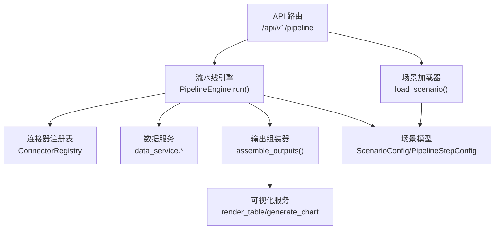
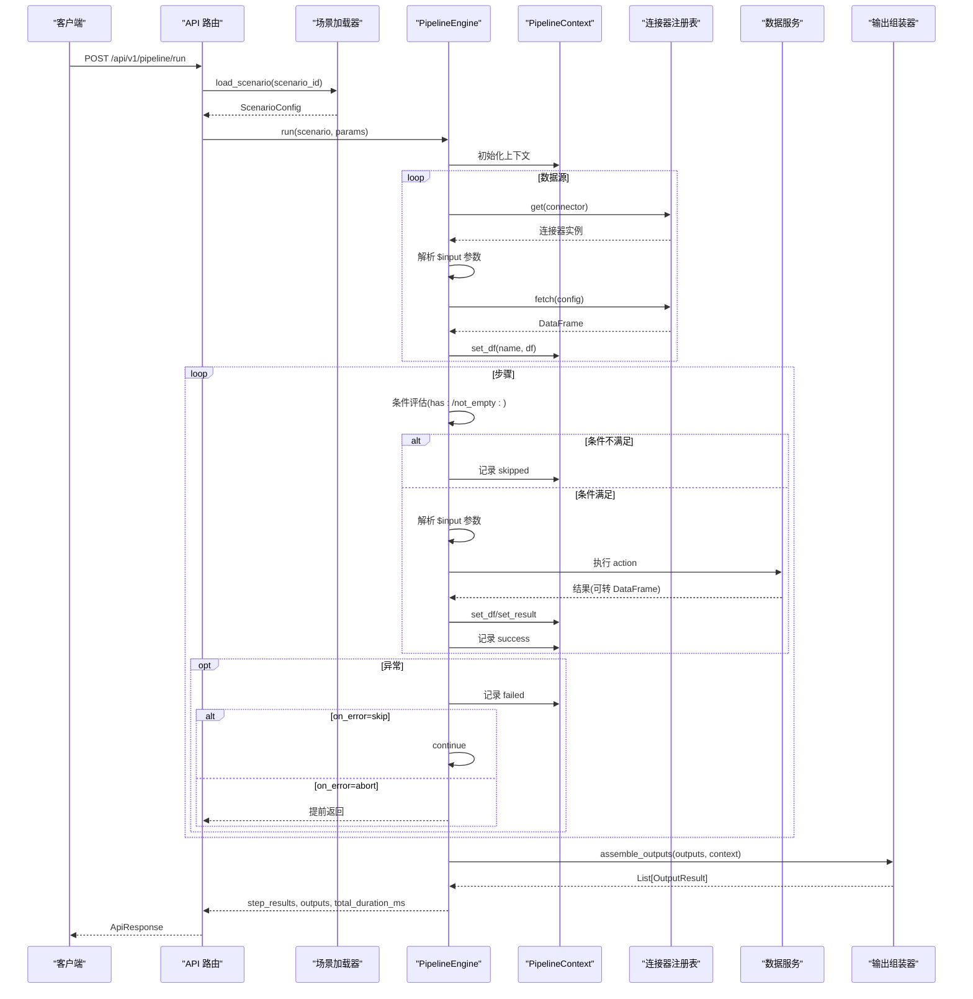
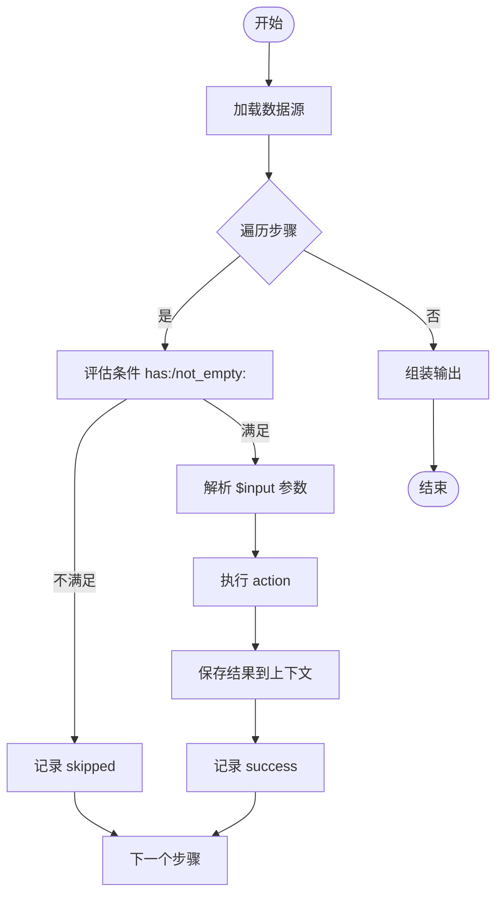
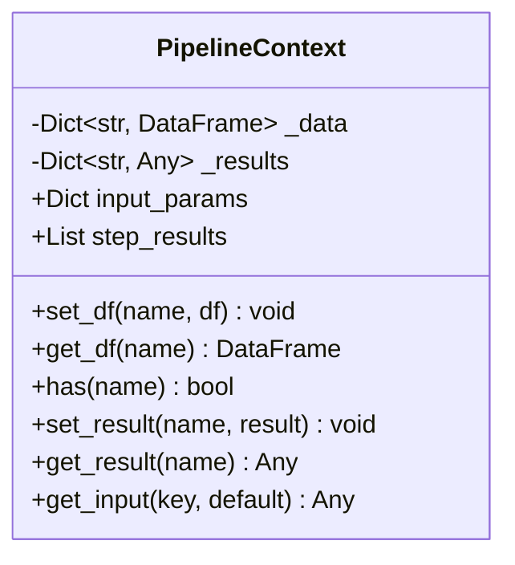
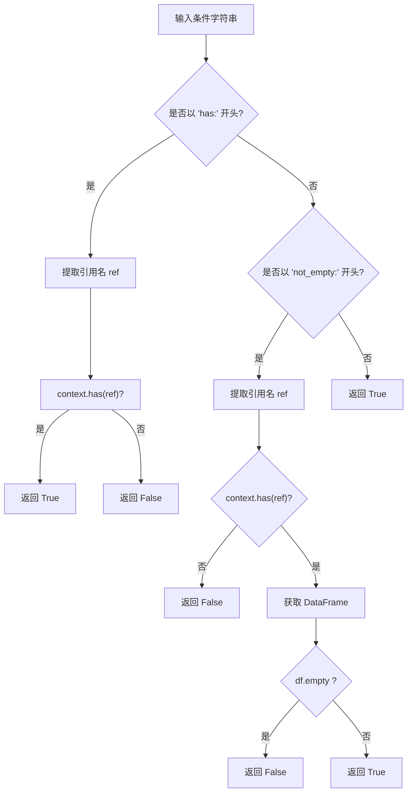
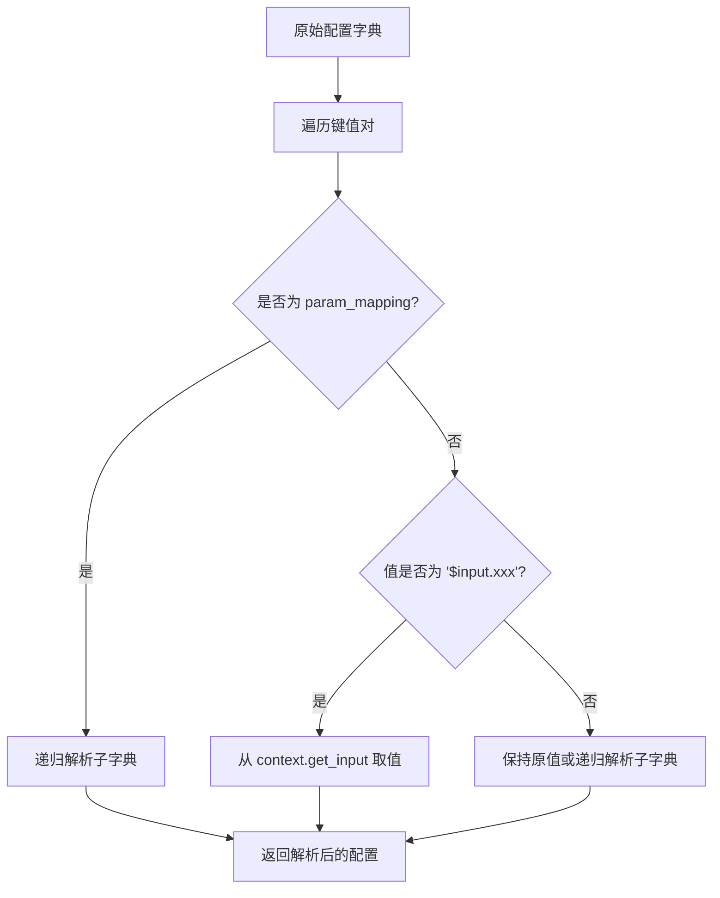
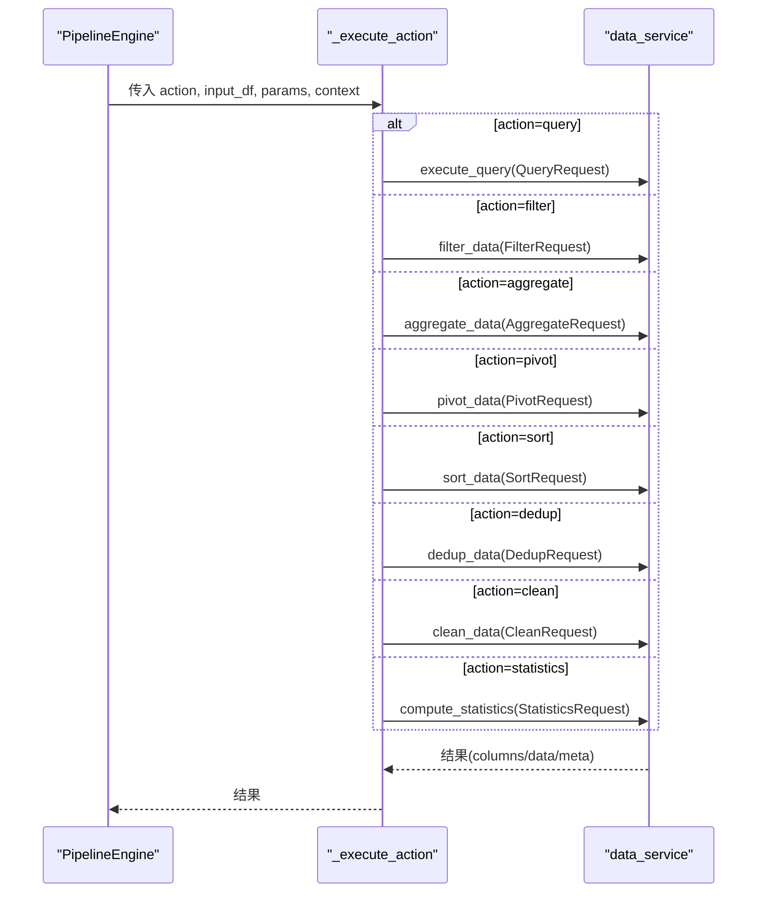
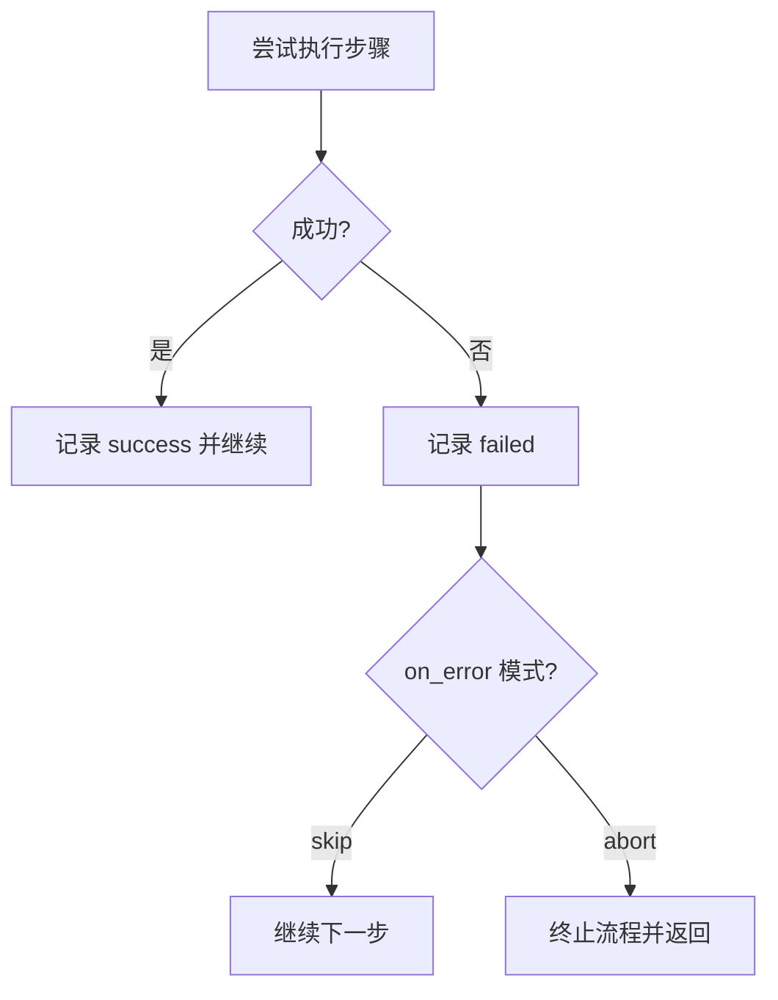
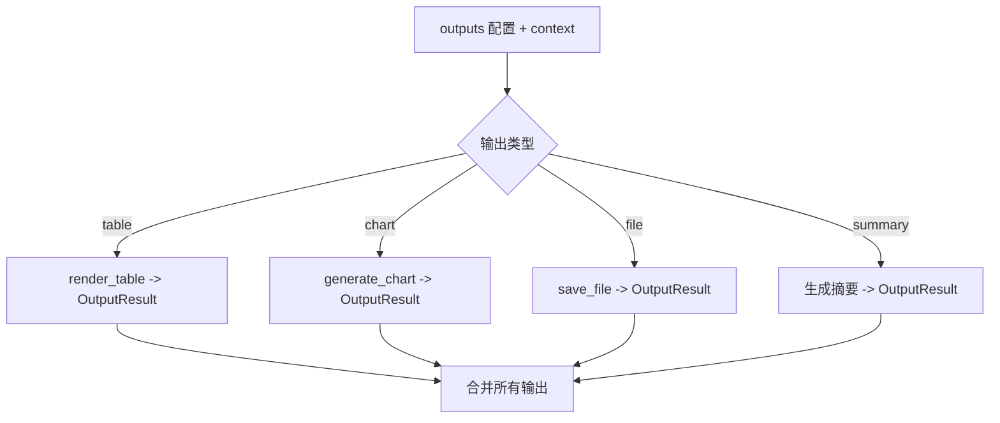
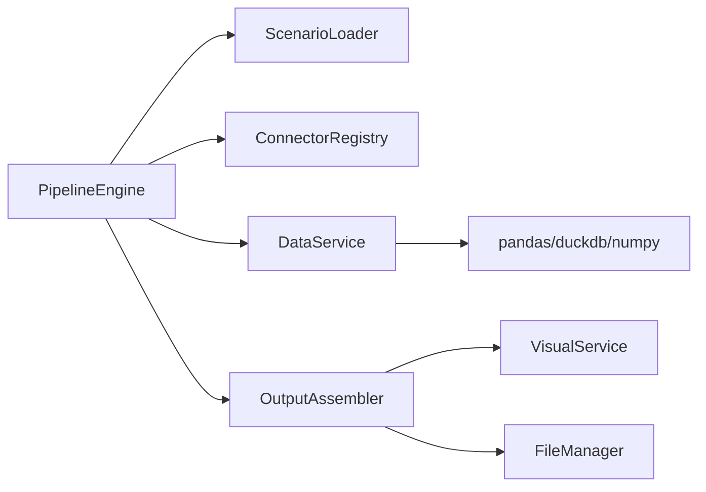

# 流水线引擎

<cite>
**本文引用的文件**
- [pipeline_engine.py](file://app/core/pipeline_engine.py)
- [scenario_loader.py](file://app/core/scenario_loader.py)
- [pipeline_models.py](file://app/models/pipeline_models.py)
- [output_assembler.py](file://app/core/output_assembler.py)
- [connectors/__init__.py](file://app/core/connectors/__init__.py)
- [data_service.py](file://app/services/data_service.py)
- [errors.py](file://app/core/errors.py)
- [pipeline.py](file://app/api/v1/pipeline.py)
- [product_increment_analysis.yaml](file://app/scenarios/product_increment_analysis.yaml)
- [sample_analysis.yaml](file://app/scenarios/sample_analysis.yaml)
</cite>

## 目录
1. [简介](#简介)
2. [项目结构](#项目结构)
3. [核心组件](#核心组件)
4. [架构总览](#架构总览)
5. [详细组件分析](#详细组件分析)
6. [依赖关系分析](#依赖关系分析)
7. [性能考量](#性能考量)
8. [故障排查指南](#故障排查指南)
9. [结论](#结论)
10. [附录：YAML 配置与执行流程示例](#附录yaml-配置与执行流程示例)

## 简介
本文件深入解析流水线引擎的核心设计与实现机制，重点围绕 PipelineEngine 类的工作原理展开，涵盖场景配置加载、数据源连接、步骤执行编排与结果输出。同时详细说明 PipelineContext 上下文管理机制（中间数据的存储与传递）、条件表达式评估机制（has:、not_empty:）以及参数映射系统（$input.xxx 引用）。文档还解释了错误处理策略（on_error 的 skip 与 abort 模式），并提供完整的 YAML 配置示例和执行流程图，帮助开发者构建复杂的自动化数据处理流程。

## 项目结构
仓库采用分层组织方式：API 层暴露 HTTP 接口；核心层包含流水线引擎、场景加载器、连接器注册表、输出组装器等；服务层封装数据处理逻辑；模型层定义请求/响应与领域对象；场景以 YAML 声明式配置；测试覆盖关键路径。

图表来源
- [pipeline.py:14-38](file://app/api/v1/pipeline.py#L14-L38)
- [scenario_loader.py:68-105](file://app/core/scenario_loader.py#L68-L105)
- [pipeline_engine.py:249-357](file://app/core/pipeline_engine.py#L249-L357)
- [connectors/__init__.py:13-59](file://app/core/connectors/__init__.py#L13-L59)
- [output_assembler.py:19-38](file://app/core/output_assembler.py#L19-L38)

章节来源
- [pipeline.py:14-48](file://app/api/v1/pipeline.py#L14-L48)
- [scenario_loader.py:1-128](file://app/core/scenario_loader.py#L1-L128)
- [pipeline_engine.py:1-357](file://app/core/pipeline_engine.py#L1-L357)

## 核心组件
- PipelineEngine：负责从场景配置中加载数据源、按顺序执行步骤、管理上下文、组装输出并返回执行结果与耗时。
- PipelineContext：维护中间 DataFrame 与非 DataFrame 结果、输入参数、步骤执行结果记录。
- ScenarioLoader：从 YAML 加载并校验场景配置，提供场景列表能力。
- ConnectorRegistry：基于注册表模式统一管理数据源连接器（数据库、API、文件上传、URL 等）。
- DataService：封装 SQL 查询、筛选、聚合、透视、排序、去重、清洗、统计等数据处理能力。
- OutputAssembler：将上下文中的结果渲染为表格、图表、文件或摘要等最终输出。
- 模型与异常：统一的数据/请求/响应模型与全局异常处理器。

章节来源
- [pipeline_engine.py:37-357](file://app/core/pipeline_engine.py#L37-L357)
- [scenario_loader.py:19-105](file://app/core/scenario_loader.py#L19-L105)
- [connectors/__init__.py:13-59](file://app/core/connectors/__init__.py#L13-L59)
- [data_service.py:35-447](file://app/services/data_service.py#L35-L447)
- [output_assembler.py:19-189](file://app/core/output_assembler.py#L19-L189)
- [pipeline_models.py:11-46](file://app/models/pipeline_models.py#L11-L46)
- [errors.py:15-74](file://app/core/errors.py#L15-L74)

## 架构总览
流水线执行的主流程如下：
- API 接收执行请求，调用场景加载器获取配置。
- 引擎创建上下文，依次加载数据源到上下文。
- 遍历步骤，根据条件决定是否执行；解析参数映射；执行 action；保存结果。
- 异常时依据 on_error 策略跳过或终止。
- 最后通过输出组装器生成最终结果。

图表来源
- [pipeline.py:14-38](file://app/api/v1/pipeline.py#L14-L38)
- [scenario_loader.py:68-105](file://app/core/scenario_loader.py#L68-L105)
- [pipeline_engine.py:249-357](file://app/core/pipeline_engine.py#L249-L357)
- [connectors/__init__.py:13-59](file://app/core/connectors/__init__.py#L13-L59)
- [output_assembler.py:19-38](file://app/core/output_assembler.py#L19-L38)

## 详细组件分析

### PipelineEngine 工作原理
- 场景配置加载：由 API 层调用场景加载器读取 YAML 并校验为 Pydantic 模型。
- 数据源连接：遍历 data_sources，通过 ConnectorRegistry 获取对应连接器，解析参数映射后异步 fetch，将 DataFrame 写入上下文。
- 步骤执行编排：对每个步骤先评估条件，再取输入 DataFrame，解析参数映射，执行 action，保存结果到上下文。
- 结果输出：完成后调用输出组装器，根据 outputs 配置生成表格、图表、文件或摘要。
- 错误处理：捕获 AppException 与通用异常，记录失败信息；若 on_error=skip 则继续后续步骤；若 abort 则立即终止并返回已执行步骤结果。

图表来源
- [pipeline_engine.py:249-357](file://app/core/pipeline_engine.py#L249-L357)

章节来源
- [pipeline_engine.py:249-357](file://app/core/pipeline_engine.py#L249-L357)

### PipelineContext 上下文管理
- 数据结构：内部维护 _data（DataFrame 字典）、_results（非 DataFrame 中间结果）、input_params（外部传入参数）、step_results（步骤执行记录）。
- 存取接口：set_df/get_df 用于 DataFrame 读写；set_result/get_result 用于任意类型结果；get_input 用于读取外部参数；has 判断是否存在于 _data 或 _results。
- 错误处理：get_df 在不存在时抛出业务异常，便于上游统一处理。

图表来源
- [pipeline_engine.py:37-70](file://app/core/pipeline_engine.py#L37-L70)

章节来源
- [pipeline_engine.py:37-70](file://app/core/pipeline_engine.py#L37-L70)

### 条件表达式评估机制
- has:ref：检查上下文中是否存在名为 ref 的 DataFrame 或非 DataFrame 结果。
- not_empty:ref：检查 ref 是否存在且对应的 DataFrame 非空；若不存在或异常则视为不满足。
- 默认行为：未匹配到已知前缀的条件视为真，允许无条件的步骤直接执行。

图表来源
- [pipeline_engine.py:100-119](file://app/core/pipeline_engine.py#L100-L119)

章节来源
- [pipeline_engine.py:100-119](file://app/core/pipeline_engine.py#L100-L119)

### 参数映射系统（$input.xxx 引用）
- 支持在配置项中使用 $input.<key> 引用外部传入的参数。
- 递归解析嵌套字典中的 param_mapping 与值，确保深层配置也能正确替换。
- 典型用法：数据源的 file_content/filename、步骤的 sort_column 等动态参数。

图表来源
- [pipeline_engine.py:74-97](file://app/core/pipeline_engine.py#L74-L97)

章节来源
- [pipeline_engine.py:74-97](file://app/core/pipeline_engine.py#L74-L97)

### Action 执行与数据服务集成
- 支持的 action：query、filter、aggregate、pivot、sort、dedup、clean、statistics。
- 每个 action 将输入 DataFrame 转换为服务层所需模型，调用 data_service 对应方法，得到可序列化的输出（columns/data/meta）。
- 引擎将结果转为 DataFrame 并保存到上下文，供后续步骤使用。

图表来源
- [pipeline_engine.py:131-234](file://app/core/pipeline_engine.py#L131-L234)
- [data_service.py:128-447](file://app/services/data_service.py#L128-L447)

章节来源
- [pipeline_engine.py:131-234](file://app/core/pipeline_engine.py#L131-L234)
- [data_service.py:128-447](file://app/services/data_service.py#L128-L447)

### 错误处理策略（on_error: skip / abort）
- 当步骤抛出 AppException 或通用异常时，记录失败信息与耗时。
- on_error=skip：记录失败后继续执行后续步骤。
- on_error=abort：记录失败后立即终止整个流水线，返回已执行的步骤结果与空输出列表。

图表来源
- [pipeline_engine.py:317-349](file://app/core/pipeline_engine.py#L317-L349)

章节来源
- [pipeline_engine.py:317-349](file://app/core/pipeline_engine.py#L317-L349)

### 输出组装与可视化
- 输出类型：table、chart、file、summary。
- table：调用可视化服务渲染表格。
- chart：根据配置生成柱状图等图表，支持 png/svg/html 格式。
- file：导出 CSV/Excel/JSON 并持久化，返回下载链接与元信息。
- summary：生成精简 JSON 摘要，包含行列数、列类型、数值列统计与前 N 行预览。

图表来源
- [output_assembler.py:19-189](file://app/core/output_assembler.py#L19-L189)

章节来源
- [output_assembler.py:19-189](file://app/core/output_assembler.py#L19-L189)

## 依赖关系分析
- 模块耦合：
  - PipelineEngine 依赖场景加载器、连接器注册表、数据服务、输出组装器与模型。
  - 数据服务依赖 pandas、duckdb、numpy 等库进行数据处理。
  - 输出组装器依赖可视化服务与文件管理器。
- 外部依赖：
  - YAML 解析、Pydantic 模型校验、FastAPI 路由与异常处理。
- 潜在循环导入规避：输出组装器中对 visual_service 的延迟导入以避免循环依赖。

图表来源
- [pipeline_engine.py:1-357](file://app/core/pipeline_engine.py#L1-L357)
- [data_service.py:1-447](file://app/services/data_service.py#L1-L447)
- [output_assembler.py:1-189](file://app/core/output_assembler.py#L1-L189)

章节来源
- [pipeline_engine.py:1-357](file://app/core/pipeline_engine.py#L1-L357)
- [data_service.py:1-447](file://app/services/data_service.py#L1-L447)
- [output_assembler.py:1-189](file://app/core/output_assembler.py#L1-L189)

## 性能考量
- 数据源加载阶段：批量加载多个数据源，避免重复 IO；建议对大表使用分页或过滤以减少内存占用。
- 步骤执行：尽量复用上下文中的 DataFrame，减少不必要的复制；SQL 查询通过 DuckDB 内存引擎执行，注意复杂查询的性能。
- 输出组装：summary 仅保留必要统计与前 N 行预览，避免全量序列化；文件导出按需选择格式。
- 错误处理：abort 模式可快速失败，减少无效计算；skip 模式适合容错型流水线。

## 故障排查指南
- 常见错误与定位：
  - 数据源不存在或连接失败：检查 connector 类型与配置（如数据库路径、SQL 语句）。
  - 步骤参数缺失或类型错误：检查 params 与 action 要求，确认 $input 引用是否正确。
  - SQL 注入防护触发：确保 SQL 仅包含 SELECT/WITH，避免危险关键字。
  - 输出组装失败：检查 source 是否在上下文存在，图表配置字段是否合法。
- 日志与诊断：
  - 关注步骤执行耗时与状态（success/skipped/failed）。
  - 查看异常消息与错误码，结合 on_error 策略调整流程健壮性。

章节来源
- [errors.py:15-74](file://app/core/errors.py#L15-L74)
- [pipeline_engine.py:317-349](file://app/core/pipeline_engine.py#L317-L349)
- [data_service.py:128-158](file://app/services/data_service.py#L128-L158)

## 结论
该流水线引擎通过声明式 YAML 配置驱动数据处理流程，具备灵活的条件控制、参数映射、多数据源接入与丰富的数据处理动作。PipelineContext 作为中间状态载体，使步骤间数据流转清晰可控。错误处理策略支持容错与快速失败两种模式，适配不同业务需求。配合输出组装器，可将结果以表格、图表、文件或摘要形式交付，满足多样化消费场景。

## 附录：YAML 配置与执行流程示例

### 示例一：产品增量分析
- 数据源：从 SQLite 加载每日余额、每日增量明细、每月增量目标三张表。
- 步骤：按产品系列汇总余额、按产品系列/映射汇总增量、余额统计等。
- 输出：表格与摘要，便于前端展示与分析。

章节来源
- [product_increment_analysis.yaml:1-126](file://app/scenarios/product_increment_analysis.yaml#L1-L126)

### 示例二：示例分析场景
- 数据源：通过文件上传连接器读取 CSV/Excel/JSON，支持 $input.file_content/$input.filename 动态参数。
- 步骤：数据清洗、排序、描述性统计。
- 输出：统计表格、导出文件、数据摘要。

章节来源
- [sample_analysis.yaml:1-68](file://app/scenarios/sample_analysis.yaml#L1-L68)

### 执行流程参考
- API 入口：POST /api/v1/pipeline/run，传入 scenario_id 与 params。
- 引擎执行：加载场景、连接数据源、执行步骤、组装输出。
- 返回：步骤结果、输出列表与总耗时。

章节来源
- [pipeline.py:14-48](file://app/api/v1/pipeline.py#L14-L48)
- [pipeline_engine.py:249-357](file://app/core/pipeline_engine.py#L249-L357)