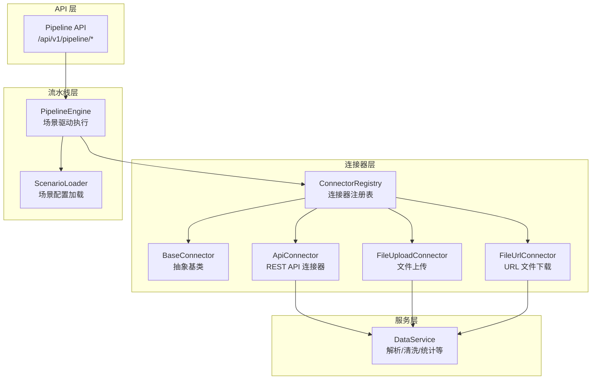
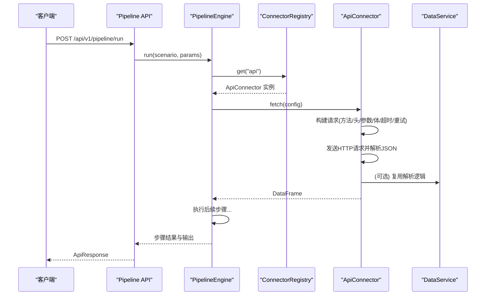
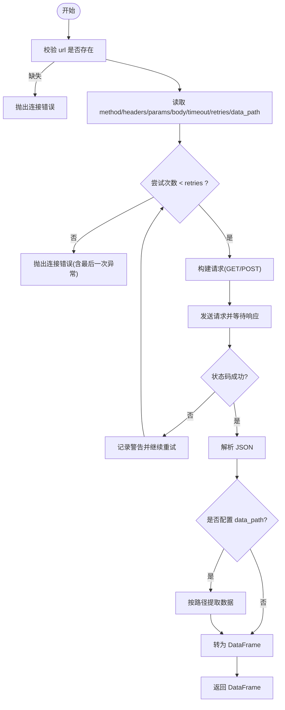
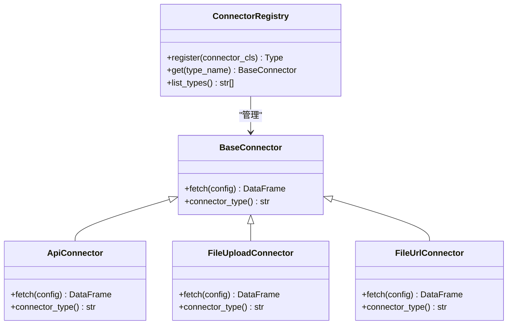

# API 连接器

<cite>
**本文引用的文件**
- [api_connector.py](file://app/core/connectors/api_connector.py)
- [base.py](file://app/core/connectors/base.py)
- [__init__.py](file://app/core/connectors/__init__.py)
- [file_upload.py](file://app/core/connectors/file_upload.py)
- [file_url.py](file://app/core/connectors/file_url.py)
- [errors.py](file://app/core/errors.py)
- [response.py](file://app/core/response.py)
- [data_service.py](file://app/services/data_service.py)
- [pipeline_engine.py](file://app/core/pipeline_engine.py)
- [pipeline.py](file://app/api/v1/pipeline.py)
- [sample_analysis.yaml](file://app/scenarios/sample_analysis.yaml)
- [product_increment_analysis.yaml](file://app/scenarios/product_increment_analysis.yaml)
</cite>

## 目录
1. [简介](#简介)
2. [项目结构](#项目结构)
3. [核心组件](#核心组件)
4. [架构总览](#架构总览)
5. [详细组件分析](#详细组件分析)
6. [依赖关系分析](#依赖关系分析)
7. [性能与可靠性](#性能与可靠性)
8. [故障排查指南](#故障排查指南)
9. [结论](#结论)
10. [附录：配置示例与用法](#附录配置示例与用法)

## 简介
本章节面向“API 连接器”的具体实现与使用方法，覆盖 HTTP/HTTPS 请求配置、认证方式（通过请求头注入）、超时与重试机制、支持的数据格式与响应处理逻辑、HTTP 方法调用方式，以及错误处理与状态码检查。同时给出在 Pipeline 场景中的使用方式与常见集成模式（RESTful API、OAuth 认证、文件上传下载）的配置思路。

## 项目结构
API 连接器位于数据连接器层，遵循统一的抽象基类并通过注册表进行动态加载。Pipeline 引擎负责按场景配置加载数据源并执行步骤，最终输出统一结果。

图表来源
- [base.py:11-23](file://app/core/connectors/base.py#L11-L23)
- [__init__.py:13-41](file://app/core/connectors/__init__.py#L13-L41)
- [api_connector.py:18-129](file://app/core/connectors/api_connector.py#L18-L129)
- [file_upload.py:18-64](file://app/core/connectors/file_upload.py#L18-L64)
- [file_url.py:19-83](file://app/core/connectors/file_url.py#L19-L83)
- [pipeline_engine.py:247-357](file://app/core/pipeline_engine.py#L247-L357)
- [pipeline.py:14-47](file://app/api/v1/pipeline.py#L14-L47)

章节来源
- [base.py:11-23](file://app/core/connectors/base.py#L11-L23)
- [__init__.py:13-41](file://app/core/connectors/__init__.py#L13-L41)
- [pipeline_engine.py:247-357](file://app/core/pipeline_engine.py#L247-L357)
- [pipeline.py:14-47](file://app/api/v1/pipeline.py#L14-L47)

## 核心组件
- 抽象基类 BaseConnector：定义 fetch(config) -> DataFrame 的统一接口与 connector_type() 标识。
- REST API 连接器 ApiConnector：基于 httpx 异步发起 HTTP/HTTPS 请求，支持 GET/POST、查询参数、请求体、超时、重试、JSON 路径提取与 DataFrame 转换。
- 文件上传连接器 FileUploadConnector：接收 base64 编码的文件内容，复用 data_service 的解析能力。
- URL 文件下载连接器 FileUrlConnector：从 URL 下载文件并解析为 DataFrame。
- 连接器注册表 ConnectorRegistry：以注册表模式管理所有连接器类型，提供 get(type_name) 获取实例。
- Pipeline 引擎 PipelineEngine：按场景配置加载数据源（可包含 api 连接器），执行步骤并组装输出。

章节来源
- [base.py:11-23](file://app/core/connectors/base.py#L11-L23)
- [api_connector.py:18-129](file://app/core/connectors/api_connector.py#L18-L129)
- [file_upload.py:18-64](file://app/core/connectors/file_upload.py#L18-L64)
- [file_url.py:19-83](file://app/core/connectors/file_url.py#L19-L83)
- [__init__.py:13-41](file://app/core/connectors/__init__.py#L13-L41)
- [pipeline_engine.py:247-357](file://app/core/pipeline_engine.py#L247-L357)

## 架构总览
API 连接器作为数据源接入点，被 Pipeline 引擎在“加载数据源”阶段调用。其返回的 DataFrame 将进入后续的数据处理步骤（过滤、聚合、排序、统计等）。错误通过 AppException 抛出，并由全局异常处理器转换为统一 ApiResponse。

图表来源
- [pipeline.py:14-47](file://app/api/v1/pipeline.py#L14-L47)
- [pipeline_engine.py:247-357](file://app/core/pipeline_engine.py#L247-L357)
- [__init__.py:13-41](file://app/core/connectors/__init__.py#L13-L41)
- [api_connector.py:37-92](file://app/core/connectors/api_connector.py#L37-L92)

## 详细组件分析

### ApiConnector（REST API 连接器）
- 支持的配置项
  - url: 必填，目标 API 地址
  - method: 默认 GET，当前实现支持 GET、POST；其他方法会抛出连接错误
  - headers: 字典，用于设置请求头（如认证、Content-Type 等）
  - params: 字典，URL 查询参数
  - body: 字典或列表，POST 请求体（以 JSON 形式发送）
  - timeout: 秒数，默认 30
  - retries: 重试次数，默认 1
  - data_path: 点号分隔的 JSON 路径，用于从响应中提取子对象或数组
- 请求流程
  - 校验 url
  - 读取 method、headers、params、body、timeout、retries、data_path
  - 循环重试：创建 AsyncClient，根据 method 发起请求，调用 raise_for_status()，解析 JSON
  - 若配置了 data_path，则按路径提取数据
  - 将数据转为 DataFrame 返回
- 错误处理
  - 缺少 url 或非法 method 直接抛出业务异常
  - 网络或 HTTP 错误记录日志并继续重试，全部失败后抛出统一异常
  - 无法转为 DataFrame 时抛出连接错误
- 认证方式
  - 通过 headers 注入认证信息，例如 Bearer Token、Basic Auth 等
  - 注意：Basic Auth 需由调用方构造 Authorization 头；当前未内置 BasicAuth 辅助函数
- 数据格式
  - 仅支持 JSON 响应；XML 或表单数据不在当前实现范围内
- 超时与重试
  - 每次请求独立设置 timeout
  - 重试策略为固定次数循环，无退避策略

图表来源
- [api_connector.py:37-92](file://app/core/connectors/api_connector.py#L37-L92)
- [api_connector.py:94-129](file://app/core/connectors/api_connector.py#L94-L129)

章节来源
- [api_connector.py:18-129](file://app/core/connectors/api_connector.py#L18-L129)

### FileUploadConnector（文件上传连接器）
- 配置项
  - file_content: base64 编码的文件内容
  - filename: 文件名（用于判断格式）
- 处理逻辑
  - 解码 base64 内容
  - 复用 data_service.parse_file 解析 CSV/Excel/JSON
  - 将解析结果转为 DataFrame
- 错误处理
  - 缺少 file_content 抛出连接错误
  - base64 解码失败抛出连接错误
  - 文件解析失败抛出连接错误

章节来源
- [file_upload.py:18-64](file://app/core/connectors/file_upload.py#L18-L64)
- [data_service.py:77-117](file://app/services/data_service.py#L77-L117)

### FileUrlConnector（URL 文件下载连接器）
- 配置项
  - url: 文件下载地址
  - filename: 可选，用于判断文件格式；为空则从 URL 推断
  - headers: 可选，请求头
  - timeout: 秒数，默认 60
- 处理逻辑
  - 下载文件内容（支持重定向）
  - 复用 data_service.parse_file 解析
  - 转为 DataFrame
- 错误处理
  - 缺少 url 抛出连接错误
  - 下载失败抛出连接错误
  - 解析失败抛出连接错误

章节来源
- [file_url.py:19-83](file://app/core/connectors/file_url.py#L19-L83)
- [data_service.py:77-117](file://app/services/data_service.py#L77-L117)

### 连接器注册表与 Pipeline 集成
- 注册表模式
  - 通过 ConnectorRegistry.register 注册连接器类型
  - 通过 ConnectorRegistry.get(type_name) 获取实例
- Pipeline 引擎
  - 在“加载数据源”阶段，根据 data_sources 配置的 connector 类型获取对应连接器并调用 fetch
  - 支持 $input.xxx 参数映射，便于动态传入配置

章节来源
- [__init__.py:13-41](file://app/core/connectors/__init__.py#L13-L41)
- [pipeline_engine.py:247-357](file://app/core/pipeline_engine.py#L247-L357)

## 依赖关系分析
- ApiConnector 依赖 httpx 进行异步 HTTP 请求，依赖 pandas 将响应转为 DataFrame
- FileUploadConnector 与 FileUrlConnector 依赖 data_service.parse_file 进行多格式解析
- 所有连接器均继承自 BaseConnector，并通过 ConnectorRegistry 统一管理
- PipelineEngine 通过注册表动态选择连接器，并将结果纳入上下文供后续步骤使用

图表来源
- [base.py:11-23](file://app/core/connectors/base.py#L11-L23)
- [__init__.py:13-41](file://app/core/connectors/__init__.py#L13-L41)
- [api_connector.py:18-129](file://app/core/connectors/api_connector.py#L18-L129)
- [file_upload.py:18-64](file://app/core/connectors/file_upload.py#L18-L64)
- [file_url.py:19-83](file://app/core/connectors/file_url.py#L19-L83)

章节来源
- [base.py:11-23](file://app/core/connectors/base.py#L11-L23)
- [__init__.py:13-41](file://app/core/connectors/__init__.py#L13-L41)

## 性能与可靠性
- 异步 I/O：使用 httpx.AsyncClient，提升并发与吞吐
- 超时控制：每次请求独立设置 timeout，避免长尾阻塞
- 重试机制：固定次数重试，适合瞬时错误恢复；如需指数退避可在上层封装
- 数据转换：DataFrame 转换对空列表、单行字典有兼容处理
- 可扩展性：新增连接器只需实现 BaseConnector 并注册

[本节为通用指导，不直接分析具体文件]

## 故障排查指南
- 常见错误与定位
  - 缺少 url：检查配置中是否提供 url
  - 不支持的 HTTP 方法：当前仅支持 GET、POST；如需 PUT/DELETE 等，请扩展 ApiConnector
  - 认证失败：确认 headers 中是否正确设置 Authorization（Bearer Token 或 Basic Auth）
  - 超时：增大 timeout 或优化下游 API 性能
  - 重试耗尽：检查重试次数与下游稳定性
  - 响应格式不符：确保响应为 JSON，且 data_path 指向有效字段
- 错误码与消息
  - 连接器错误统一使用 ErrorCode.CONNECTOR_ERROR
  - 全局异常处理器将 AppException 转换为 ApiResponse，便于前端统一处理

章节来源
- [errors.py:15-74](file://app/core/errors.py#L15-L74)
- [response.py:12-103](file://app/core/response.py#L12-L103)
- [api_connector.py:37-92](file://app/core/connectors/api_connector.py#L37-L92)

## 结论
API 连接器提供了简洁、异步、可重试的 REST API 调用能力，并通过统一的 DataFrame 输出与 Pipeline 引擎无缝集成。通过 headers 注入认证信息，结合 data_path 灵活提取响应数据，可满足大多数 RESTful API 集成需求。对于 XML、PUT/DELETE 等方法及更复杂的认证流程，可在现有基础上扩展。

[本节为总结，不直接分析具体文件]

## 附录：配置示例与用法

### 基本 RESTful API 调用（GET/POST）
- 关键配置项
  - url、method、headers、params、body、timeout、retries、data_path
- 说明
  - GET：使用 params 传递查询参数
  - POST：使用 body 传递 JSON 请求体
  - data_path：用于从嵌套响应中提取数据（如 "data.items"）

章节来源
- [api_connector.py:22-31](file://app/core/connectors/api_connector.py#L22-L31)
- [api_connector.py:37-92](file://app/core/connectors/api_connector.py#L37-L92)

### 认证方式（Bearer Token、Basic Auth）
- Bearer Token
  - 在 headers 中添加 Authorization: Bearer <token>
- Basic Auth
  - 在 headers 中添加 Authorization: Basic <base64(username:password)>
- 说明
  - 当前连接器不内置认证助手，需由调用方构造 Authorization 头

章节来源
- [api_connector.py:22-31](file://app/core/connectors/api_connector.py#L22-L31)

### 超时与重试
- timeout：默认 30 秒，可按需调整
- retries：默认 1 次，表示最多尝试 1 次；设置为 N 表示最多尝试 N 次

章节来源
- [api_connector.py:22-31](file://app/core/connectors/api_connector.py#L22-L31)
- [api_connector.py:54-92](file://app/core/connectors/api_connector.py#L54-L92)

### 数据格式与响应处理
- 支持 JSON 响应
- 通过 data_path 提取子对象或数组
- 自动将列表或字典转为 DataFrame

章节来源
- [api_connector.py:94-129](file://app/core/connectors/api_connector.py#L94-L129)

### 文件上传与下载
- 文件上传（FileUploadConnector）
  - 配置 file_content（base64）、filename
  - 支持 CSV、Excel、JSON
- 文件下载（FileUrlConnector）
  - 配置 url、filename（可选）、headers、timeout
  - 支持从 URL 下载并解析

章节来源
- [file_upload.py:18-64](file://app/core/connectors/file_upload.py#L18-L64)
- [file_url.py:19-83](file://app/core/connectors/file_url.py#L19-L83)
- [data_service.py:77-117](file://app/services/data_service.py#L77-L117)

### 在 Pipeline 中使用 API 连接器
- 场景配置
  - 在 data_sources 中声明 connector: "api"，并提供 config（url、method、headers 等）
  - 可通过 param_mapping 将 $input.xxx 映射到配置项
- 执行流程
  - PipelineEngine 在“加载数据源”阶段调用 ApiConnector.fetch
  - 返回的 DataFrame 进入后续步骤（过滤、聚合、统计等）

章节来源
- [pipeline_engine.py:247-357](file://app/core/pipeline_engine.py#L247-L357)
- [sample_analysis.yaml:9-17](file://app/scenarios/sample_analysis.yaml#L9-L17)
- [product_increment_analysis.yaml:18-48](file://app/scenarios/product_increment_analysis.yaml#L18-L48)

### 常见集成场景建议
- RESTful API 调用：使用 ApiConnector，配置 url、method、headers、params/body、timeout、retries、data_path
- OAuth 认证：在 headers 中注入 Access Token（Bearer），或在请求前通过上游服务获取 Token
- 文件上传下载：使用 FileUploadConnector 与 FileUrlConnector，配合 data_service 解析

[本节为概念性指导，不直接分析具体文件]