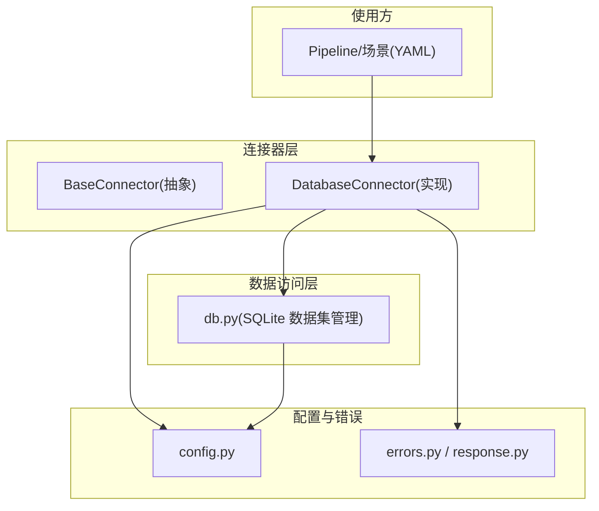
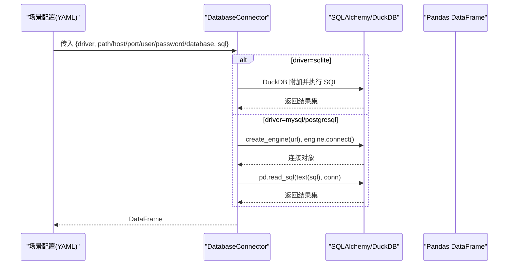
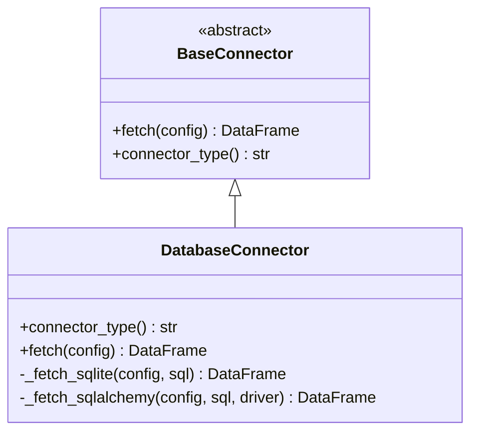
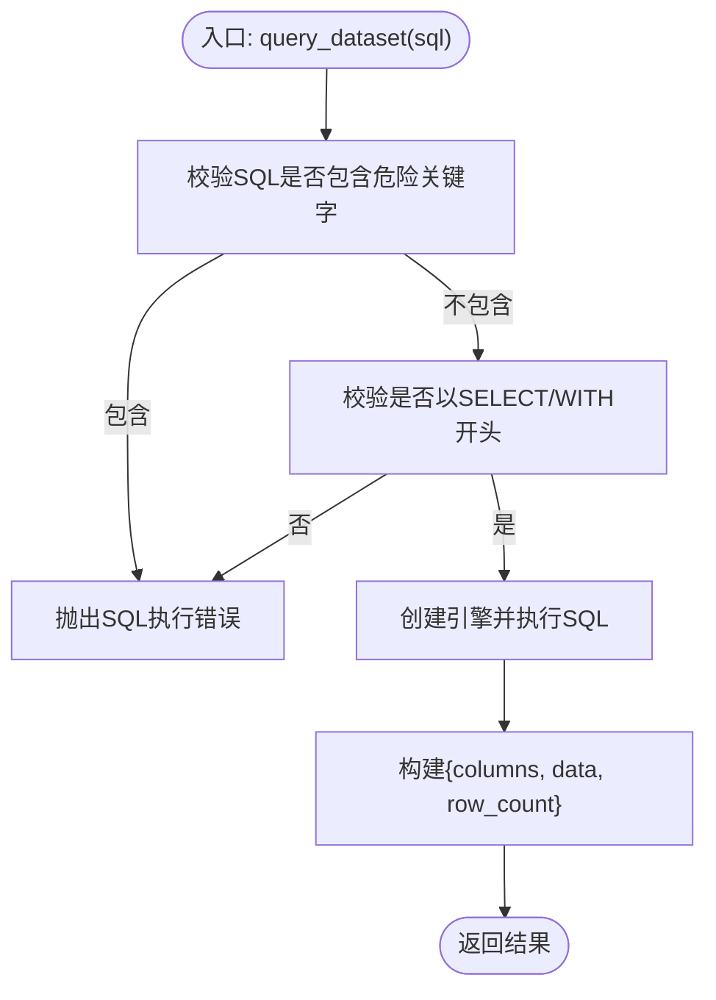
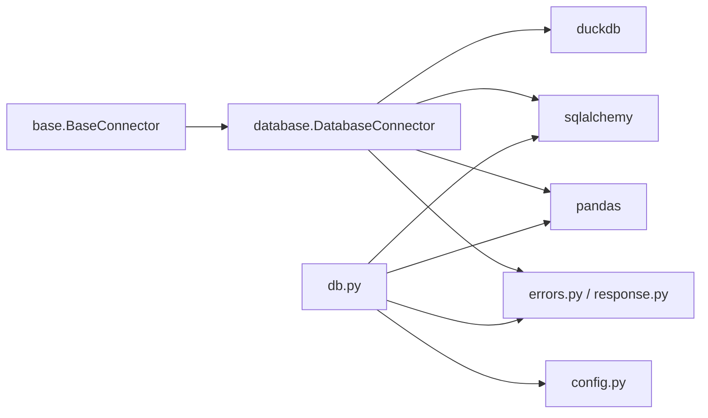

# 数据库连接器

<cite>
**本文引用的文件**
- [app/core/connectors/database.py](file://app/core/connectors/database.py)
- [app/core/connectors/base.py](file://app/core/connectors/base.py)
- [app/core/db.py](file://app/core/db.py)
- [app/config.py](file://app/config.py)
- [app/core/errors.py](file://app/core/errors.py)
- [app/core/response.py](file://app/core/response.py)
- [app/scenarios/product_increment_analysis.yaml](file://app/scenarios/product_increment_analysis.yaml)
</cite>

## 目录
1. [简介](#简介)
2. [项目结构](#项目结构)
3. [核心组件](#核心组件)
4. [架构总览](#架构总览)
5. [详细组件分析](#详细组件分析)
6. [依赖关系分析](#依赖关系分析)
7. [性能与连接池](#性能与连接池)
8. [故障排查指南](#故障排查指南)
9. [结论](#结论)
10. [附录：配置示例](#附录配置示例)

## 简介
本文件围绕“数据库连接器”的实现与使用进行系统化说明，覆盖以下要点：
- 支持的数据库类型与连接配置格式（SQLite、MySQL、PostgreSQL）
- SQLAlchemy 引擎的创建与管理机制（当前实现为请求级创建与释放）
- SQL 查询执行流程（参数化、结果集转换、安全限制）
- 事务处理现状与建议
- 错误处理机制与重试策略现状
- 完整配置示例（不同数据库的连接字符串、认证方式、高级选项）

## 项目结构
数据库相关能力主要分布在以下模块：
- 连接器抽象与实现：BaseConnector、DatabaseConnector
- SQLite 数据集管理：db.py（写入、读取、查询、删除）
- 应用配置：config.py（默认数据库路径等）
- 错误与响应：errors.py、response.py
- 场景配置示例：product_increment_analysis.yaml（展示如何通过 YAML 配置 database 连接器）

图表来源
- [app/core/connectors/base.py:11-23](file://app/core/connectors/base.py#L11-L23)
- [app/core/connectors/database.py:19-111](file://app/core/connectors/database.py#L19-L111)
- [app/core/db.py:59-296](file://app/core/db.py#L59-L296)
- [app/config.py:6-22](file://app/config.py#L6-L22)
- [app/core/errors.py:15-73](file://app/core/errors.py#L15-L73)
- [app/core/response.py:12-103](file://app/core/response.py#L12-L103)

章节来源
- [app/core/connectors/base.py:11-23](file://app/core/connectors/base.py#L11-L23)
- [app/core/connectors/database.py:19-111](file://app/core/connectors/database.py#L19-L111)
- [app/core/db.py:59-296](file://app/core/db.py#L59-L296)
- [app/config.py:6-22](file://app/config.py#L6-L22)
- [app/core/errors.py:15-73](file://app/core/errors.py#L15-L73)
- [app/core/response.py:12-103](file://app/core/response.py#L12-L103)

## 核心组件
- BaseConnector：定义所有连接器的统一接口 fetch(config) -> DataFrame 和 connector_type()。
- DatabaseConnector：实现 database 类型的连接器，支持 SQLite（通过 DuckDB 直接查询 .db）、MySQL/PostgreSQL（通过 SQLAlchemy）。
- db.py：提供 SQLite 数据集的入库、查询、删除等能力，供 Pipeline 或 API 消费；同时暴露 query_dataset 用于只读 SELECT 查询。
- config.py：集中管理应用配置，如 SQLite 文件路径。
- errors.py / response.py：统一的异常与响应模型，错误码涵盖连接器错误、SQL 执行错误等。

章节来源
- [app/core/connectors/base.py:11-23](file://app/core/connectors/base.py#L11-L23)
- [app/core/connectors/database.py:19-111](file://app/core/connectors/database.py#L19-L111)
- [app/core/db.py:59-296](file://app/core/db.py#L59-L296)
- [app/config.py:6-22](file://app/config.py#L6-L22)
- [app/core/errors.py:15-73](file://app/core/errors.py#L15-L73)
- [app/core/response.py:12-103](file://app/core/response.py#L12-L103)

## 架构总览
下图展示了从场景配置到数据库连接的调用链路与数据流向。

图表来源
- [app/core/connectors/database.py:43-111](file://app/core/connectors/database.py#L43-L111)
- [app/core/db.py:285-296](file://app/core/db.py#L285-L296)

## 详细组件分析

### 连接器基类与实现
- BaseConnector 定义了 fetch(config) 必须返回 DataFrame，以及 connector_type() 标识连接器类型。
- DatabaseConnector 根据 driver 分派到 SQLite 或 SQLAlchemy 路径：
  - SQLite：通过 DuckDB 以内存引擎附加外部 .db 文件后执行 SQL，返回 DataFrame。
  - MySQL/PostgreSQL：构造连接 URL，创建引擎，使用上下文管理器获取连接，执行 SQL 并返回 DataFrame，最后释放引擎。

图表来源
- [app/core/connectors/base.py:11-23](file://app/core/connectors/base.py#L11-L23)
- [app/core/connectors/database.py:19-111](file://app/core/connectors/database.py#L19-L111)

章节来源
- [app/core/connectors/base.py:11-23](file://app/core/connectectors/base.py#L11-L23)
- [app/core/connectors/database.py:19-111](file://app/core/connectors/database.py#L19-L111)

### SQLite 数据集管理（db.py）
- 初始化：启动时创建 _datasets 元数据表，记录每个数据集的表名、列信息、行数等。
- 写入：将 DataFrame 持久化为 SQLite 表，支持 create/append 模式，并更新元数据。
- 读取：列出数据集、按 id 获取详情（可选预览前 N 行）。
- 查询：仅允许 SELECT/WITH 开头的只读查询，返回 columns、data、row_count。
- 删除：删除元数据及对应表。

图表来源
- [app/core/db.py:262-296](file://app/core/db.py#L262-L296)

章节来源
- [app/core/db.py:59-296](file://app/core/db.py#L59-L296)

### 配置与使用（YAML）
- 场景配置中通过 data_sources 声明 database 连接器，指定 driver、path/host/port/user/password/database、sql。
- 示例：产品增量分析场景从 SQLite 加载三张基础表，并在 pipeline 步骤中对 DataFrame 进行查询、聚合、统计等操作。

章节来源
- [app/scenarios/product_increment_analysis.yaml:18-48](file://app/scenarios/product_increment_analysis.yaml#L18-L48)

## 依赖关系分析
- DatabaseConnector 依赖：
  - base.BaseConnector（抽象接口）
  - duckdb（SQLite 文件直查）
  - sqlalchemy（MySQL/PostgreSQL 连接）
  - pandas（结果集转换为 DataFrame）
  - app.core.errors、app.core.response（统一异常与错误码）
- db.py 依赖：
  - sqlite3、sqlalchemy、pandas
  - app.config.settings（读取 db_path）
  - app.core.errors、app.core.response（统一异常与错误码）

图表来源
- [app/core/connectors/database.py:1-111](file://app/core/connectors/database.py#L1-L111)
- [app/core/db.py:1-296](file://app/core/db.py#L1-L296)
- [app/config.py:6-22](file://app/config.py#L6-L22)
- [app/core/errors.py:15-73](file://app/core/errors.py#L15-L73)
- [app/core/response.py:12-103](file://app/core/response.py#L12-L103)

章节来源
- [app/core/connectors/database.py:1-111](file://app/core/connectors/database.py#L1-L111)
- [app/core/db.py:1-296](file://app/core/db.py#L1-L296)
- [app/config.py:6-22](file://app/config.py#L6-L22)
- [app/core/errors.py:15-73](file://app/core/errors.py#L15-L73)
- [app/core/response.py:12-103](file://app/core/response.py#L12-L103)

## 性能与连接池
- 当前实现特点：
  - 每次执行 SQL 时创建新的 SQLAlchemy 引擎，并在完成后释放（engine.dispose），未显式配置连接池大小、超时、回收策略等。
  - SQLite 通过 DuckDB 在内存中附加外部 .db 文件执行查询，适合轻量离线分析。
- 影响与建议：
  - 高频并发下频繁创建/销毁引擎会带来开销。建议在生产环境引入可复用的引擎实例，并配置连接池参数（如 pool_size、max_overflow、pool_timeout、connect_args 中的 connect_timeout 等），以提升吞吐与稳定性。
  - 对于长事务或批量写入，建议在 db.py 中基于 SQLAlchemy 的事务边界封装，确保一致性。

[本节为通用性能讨论，不直接分析具体代码片段]

## 故障排查指南
- 常见错误与定位：
  - 缺少必要配置：如未提供 sql、SQLite 未提供 path、MySQL/PostgreSQL 未提供 host/port/user/password/database 等，会抛出连接器错误。
  - 不支持的驱动：driver 不在支持列表中会报错。
  - SQL 安全限制：db.py 对非 SELECT/WITH 开头的语句拒绝执行，避免写操作风险。
  - 资源不存在：查询或操作的数据集不存在时报资源未找到错误。
- 错误处理机制：
  - 业务异常统一通过 AppException 抛出，携带 ErrorCode 与消息，由全局异常处理器转换为统一 JSON 响应。
  - 连接器内部捕获未知异常并包装为 CONNECTOR_ERROR，便于上层统一处理。
- 重试策略：
  - 当前代码未实现连接重试逻辑。若需增强健壮性，可在外层增加指数退避重试（针对网络抖动、临时不可用等），并结合连接池超时配置。

章节来源
- [app/core/connectors/database.py:43-68](file://app/core/connectors/database.py#L43-L68)
- [app/core/db.py:262-296](file://app/core/db.py#L262-L296)
- [app/core/errors.py:15-73](file://app/core/errors.py#L15-L73)
- [app/core/response.py:12-103](file://app/core/response.py#L12-L103)

## 结论
- 该数据库连接器提供了简洁一致的 DataFrame 输出接口，支持 SQLite（DuckDB）与 MySQL/PostgreSQL（SQLAlchemy）。
- 当前实现采用请求级引擎创建与释放，适合简单场景；生产环境建议引入连接池与超时配置以提升性能与稳定性。
- SQL 执行具备基本的安全限制（仅 SELECT/WITH），并通过统一异常体系对外暴露错误。
- 建议后续扩展：
  - 显式连接池配置与连接生命周期管理
  - 事务封装与重试策略
  - 更多数据库驱动（如 ClickHouse、Oracle 等）

[本节为总结性内容，不直接分析具体代码片段]

## 附录：配置示例
以下为不同数据库类型的连接配置要点与示例位置（不直接粘贴代码，参考对应源码行号）：

- SQLite（通过 DuckDB）
  - 关键配置字段：driver="sqlite"、path（.db 文件路径）、sql（SELECT 语句）
  - 示例位置：
    - [app/scenarios/product_increment_analysis.yaml:20-48](file://app/scenarios/product_increment_analysis.yaml#L20-L48)
  - 行为说明：
    - 连接器会在内存中附加外部 .db 文件并执行 SQL，返回 DataFrame。
    - 参考实现：[app/core/connectors/database.py:70-84](file://app/core/connectors/database.py#L70-L84)

- MySQL
  - 关键配置字段：driver="mysql"、host、port（默认 3306）、user、password 或 password_env（环境变量优先）、database、sql
  - 连接字符串格式：mysql+pymysql://{user}:{password}@{host}:{port}/{database}
  - 参考实现：
    - [app/core/connectors/database.py:92-103](file://app/core/connectors/database.py#L92-L103)
    - [app/core/connectors/database.py:105-111](file://app/core/connectors/database.py#L105-L111)

- PostgreSQL
  - 关键配置字段：driver="postgresql" 或 "postgres"、host、port（默认 5432）、user、password 或 password_env、database、sql
  - 连接字符串格式：postgresql+psycopg2://{user}:{password}@{host}:{port}/{database}
  - 参考实现：
    - [app/core/connectors/database.py:92-103](file://app/core/connectors/database.py#L92-L103)
    - [app/core/connectors/database.py:105-111](file://app/core/connectors/database.py#L105-L111)

- 认证方式
  - 密码可通过配置项 password 或直接通过环境变量 password_env 注入，后者优先级更高。
  - 参考实现：[app/core/connectors/database.py:95-98](file://app/core/connectors/database.py#L95-L98)

- 高级选项
  - 当前未显式暴露连接池、超时等高级选项。如需调整，可在 create_engine 处添加连接池参数与 connect_args（例如 pool_size、max_overflow、pool_timeout、connect_timeout 等）。
  - 参考位置：[app/core/connectors/database.py:105-111](file://app/core/connectors/database.py#L105-L111)

- 参数化查询与结果集转换
  - 使用 SQLAlchemy text 包裹 SQL，并通过 pandas.read_sql 将结果转换为 DataFrame。
  - 参考实现：
    - [app/core/connectors/database.py:107-109](file://app/core/connectors/database.py#L107-L109)
    - [app/core/db.py:285-296](file://app/core/db.py#L285-L296)

- 事务处理
  - 当前连接器未显式开启事务；如需事务，建议在 db.py 中基于 SQLAlchemy 事务边界封装，或在连接器层引入事务上下文。
  - 参考位置：[app/core/db.py:142-172](file://app/core/db.py#L142-L172)

- 错误处理与重试
  - 连接器内部将异常统一包装为 AppException 并携带错误码；全局异常处理器将其转为统一响应。
  - 当前未实现重试；可在上层增加重试逻辑（指数退避）并结合连接池超时配置。
  - 参考实现：
    - [app/core/connectors/database.py:62-68](file://app/core/connectors/database.py#L62-L68)
    - [app/core/errors.py:30-73](file://app/core/errors.py#L30-L73)
    - [app/core/response.py:71-103](file://app/core/response.py#L71-L103)