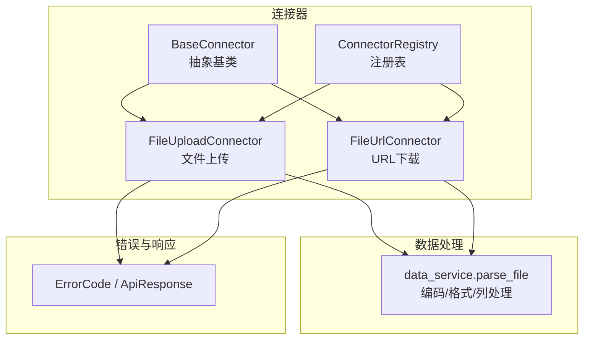
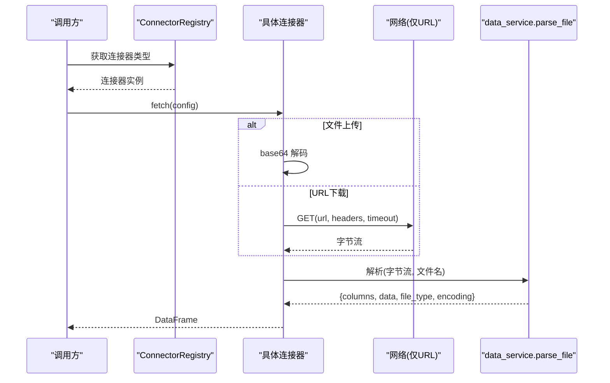
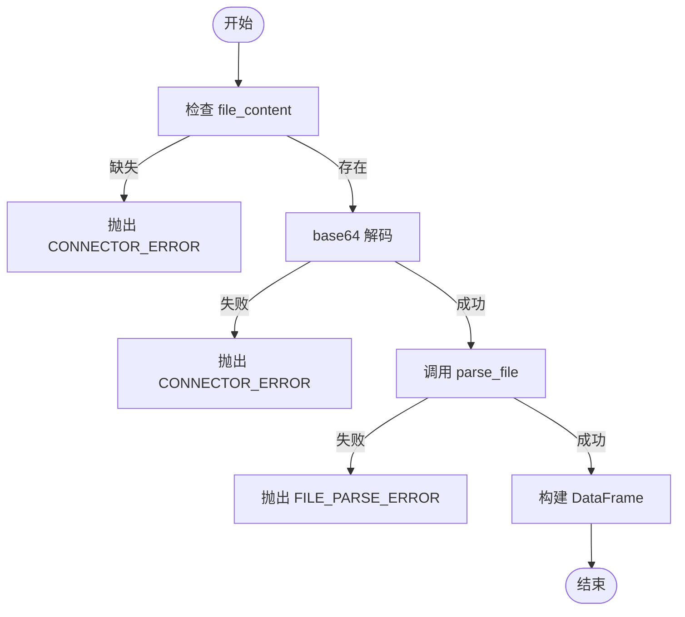
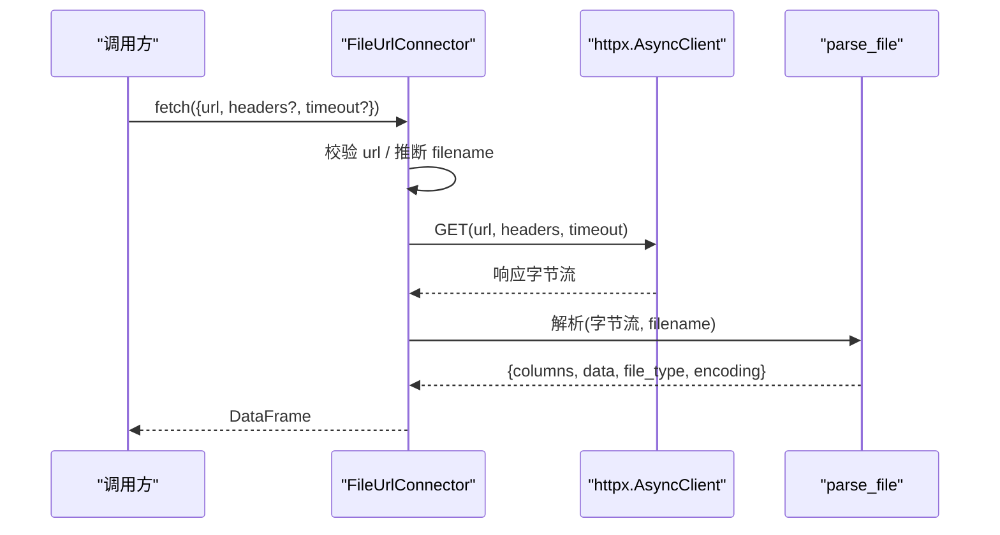
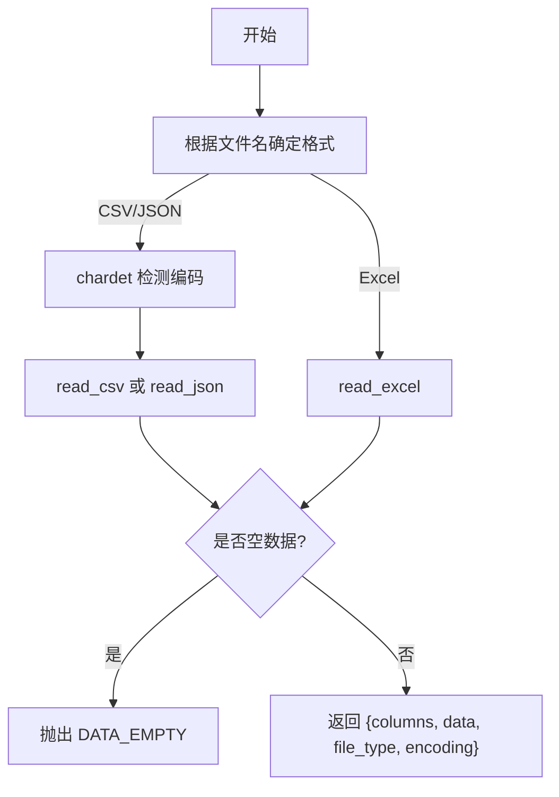
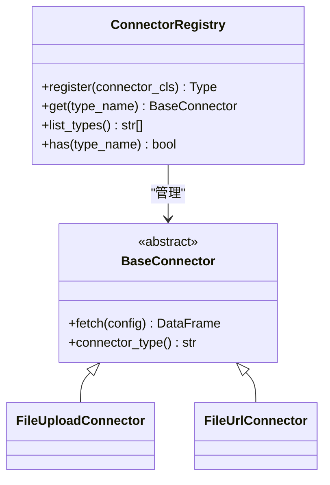
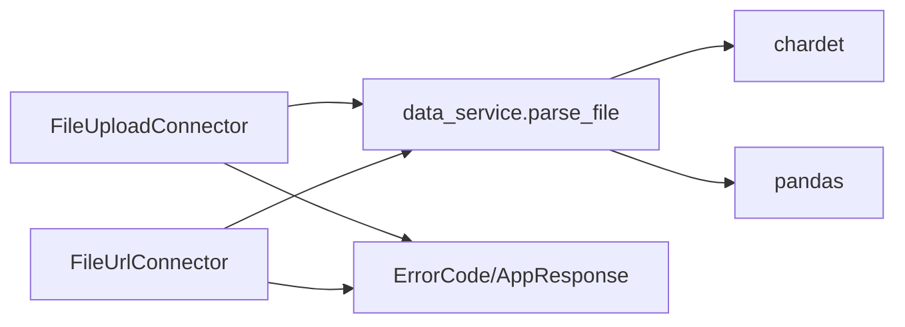

# 文件连接器

<cite>
**本文引用的文件**
- [app/core/connectors/base.py](file://app/core/connectors/base.py)
- [app/core/connectors/file_upload.py](file://app/core/connectors/file_upload.py)
- [app/core/connectors/file_url.py](file://app/core/connectors/file_url.py)
- [app/core/connectors/__init__.py](file://app/core/connectors/__init__.py)
- [app/services/data_service.py](file://app/services/data_service.py)
- [app/core/errors.py](file://app/core/errors.py)
- [app/core/response.py](file://app/core/response.py)
- [app/api/v1/data.py](file://app/api/v1/data.py)
</cite>

## 目录
1. [简介](#简介)
2. [项目结构](#项目结构)
3. [核心组件](#核心组件)
4. [架构总览](#架构总览)
5. [详细组件分析](#详细组件分析)
6. [依赖关系分析](#依赖关系分析)
7. [性能与配置建议](#性能与配置建议)
8. [故障排查指南](#故障排查指南)
9. [结论](#结论)

## 简介
本章节聚焦“文件相关连接器”的具体实现，包括：
- 文件上传连接器：接收 base64 编码的文件内容并解析为 DataFrame，支持 CSV、Excel、JSON。
- URL 文件连接器：从远程地址下载文件并解析，支持超时控制、请求头传递、自动推断文件名等。
- 统一的数据解析能力：通过数据服务层完成编码检测、格式识别、列名映射与异常处理。
- 连接器注册机制：集中管理连接器类型，便于扩展与调用。

## 项目结构
连接器位于 app/core/connectors 下，采用抽象基类 + 具体实现的模式；数据解析集中在 app/services/data_service.py；错误码与响应体在 app/core/response.py 中定义；API 路由示例见 app/api/v1/data.py。

图表来源
- [app/core/connectors/base.py:11-23](file://app/core/connectors/base.py#L11-L23)
- [app/core/connectors/file_upload.py:18-63](file://app/core/connectors/file_upload.py#L18-L63)
- [app/core/connectors/file_url.py:19-82](file://app/core/connectors/file_url.py#L19-L82)
- [app/core/connectors/__init__.py:13-59](file://app/core/connectors/__init__.py#L13-L59)
- [app/services/data_service.py:77-117](file://app/services/data_service.py#L77-L117)
- [app/core/response.py:12-68](file://app/core/response.py#L12-L68)

章节来源
- [app/core/connectors/base.py:11-23](file://app/core/connectors/base.py#L11-L23)
- [app/core/connectors/file_upload.py:18-63](file://app/core/connectors/file_upload.py#L18-L63)
- [app/core/connectors/file_url.py:19-82](file://app/core/connectors/file_url.py#L19-L82)
- [app/core/connectors/__init__.py:13-59](file://app/core/connectors/__init__.py#L13-L59)
- [app/services/data_service.py:77-117](file://app/services/data_service.py#L77-L117)
- [app/core/response.py:12-68](file://app/core/response.py#L12-L68)

## 核心组件
- 抽象基类 BaseConnector：定义 fetch(config) -> DataFrame 的异步接口与 connector_type() 标识。
- FileUploadConnector：读取 base64 编码内容，解码后交给 data_service.parse_file 解析。
- FileUrlConnector：使用 httpx 异步下载文件，支持 headers、timeout，自动推断文件名，再交由 parse_file 解析。
- ConnectorRegistry：单例注册表，集中管理所有连接器类型并提供 get/list_types/has 等方法。
- data_service.parse_file：统一解析入口，负责编码检测（CSV/JSON）、格式识别（CSV/Excel/JSON）、空数据校验、输出标准化。

章节来源
- [app/core/connectors/base.py:11-23](file://app/core/connectors/base.py#L11-L23)
- [app/core/connectors/file_upload.py:18-63](file://app/core/connectors/file_upload.py#L18-L63)
- [app/core/connectors/file_url.py:19-82](file://app/core/connectors/file_url.py#L19-L82)
- [app/core/connectors/__init__.py:13-59](file://app/core/connectors/__init__.py#L13-L59)
- [app/services/data_service.py:77-117](file://app/services/data_service.py#L77-L117)

## 架构总览
连接器的调用流程如下：上层通过 ConnectorRegistry 获取具体连接器实例，传入配置执行 fetch，内部复用 data_service.parse_file 完成解析，最终返回 DataFrame。

图表来源
- [app/core/connectors/__init__.py:13-59](file://app/core/connectors/__init__.py#L13-L59)
- [app/core/connectors/file_upload.py:31-63](file://app/core/connectors/file_upload.py#L31-L63)
- [app/core/connectors/file_url.py:34-72](file://app/core/connectors/file_url.py#L34-L72)
- [app/services/data_service.py:77-117](file://app/services/data_service.py#L77-L117)

## 详细组件分析

### 文件上传连接器（FileUploadConnector）
- 输入配置
  - file_content: 字符串形式的 base64 编码文件内容
  - filename: 文件名（用于判断格式），默认 data.csv
- 处理逻辑
  - 校验 file_content 是否存在
  - base64 解码为字节流
  - 调用 data_service.parse_file 进行解析
  - 将解析结果转换为 pandas.DataFrame 返回
- 错误处理
  - 缺少参数或 base64 解码失败：抛出业务异常，携带 CONNECTOR_ERROR 错误码
  - 解析失败：抛出业务异常，携带 FILE_PARSE_ERROR 错误码

图表来源
- [app/core/connectors/file_upload.py:31-63](file://app/core/connectors/file_upload.py#L31-L63)
- [app/services/data_service.py:77-117](file://app/services/data_service.py#L77-L117)
- [app/core/response.py:12-68](file://app/core/response.py#L12-L68)

章节来源
- [app/core/connectors/file_upload.py:18-63](file://app/core/connectors/file_upload.py#L18-L63)
- [app/services/data_service.py:77-117](file://app/services/data_service.py#L77-L117)
- [app/core/response.py:12-68](file://app/core/response.py#L12-L68)

### URL 文件连接器（FileUrlConnector）
- 输入配置
  - url: 必填，文件下载地址
  - filename: 可选，用于判断格式；为空则从 URL 路径推断
  - headers: 可选，HTTP 请求头
  - timeout: 可选，超时秒数，默认 60
- 处理逻辑
  - 校验 url 是否存在
  - 使用 httpx.AsyncClient 发起 GET 请求，允许跟随重定向
  - 若未提供 filename，则从 URL 路径末尾提取文件名，否则默认 data.csv
  - 调用 data_service.parse_file 解析字节流
  - 将解析结果转换为 DataFrame 返回
- 错误处理
  - 缺少 url：抛出 CONNECTOR_ERROR
  - 下载失败：捕获网络异常并抛出 CONNECTOR_ERROR
  - 解析失败：抛出 FILE_PARSE_ERROR

图表来源
- [app/core/connectors/file_url.py:34-82](file://app/core/connectors/file_url.py#L34-L82)
- [app/services/data_service.py:77-117](file://app/services/data_service.py#L77-L117)

章节来源
- [app/core/connectors/file_url.py:19-82](file://app/core/connectors/file_url.py#L19-L82)
- [app/services/data_service.py:77-117](file://app/services/data_service.py#L77-L117)

### 数据解析与编码处理（data_service.parse_file）
- 支持的格式
  - CSV：根据文件名后缀识别，自动检测编码（chardet），使用 pandas.read_csv
  - Excel：.xlsx/.xls，使用 pandas.read_excel
  - JSON：根据文件名后缀识别，自动检测编码，使用 pandas.read_json
- 编码策略
  - 对 CSV/JSON：先通过 chardet 检测编码，再传入 read_csv/read_json
  - 对 Excel：二进制格式，无需编码参数
- 列名映射
  - 由 pandas 读取时保留原始列名；后续可通过清洗/转换操作调整
- 空数据校验
  - 若结果为空，抛出 DATA_EMPTY 错误
- 输出结构
  - columns: 列名列表
  - data: 二维数据列表
  - file_type: csv/excel/json
  - encoding: 实际使用的编码（CSV/JSON）

图表来源
- [app/services/data_service.py:77-117](file://app/services/data_service.py#L77-L117)

章节来源
- [app/services/data_service.py:77-117](file://app/services/data_service.py#L77-L117)

### 连接器注册与调度（ConnectorRegistry）
- 功能
  - 以单例方式维护已注册的连接器类型到类的映射
  - 提供 register/get/list_types/has 方法
- 行为
  - 重复注册会记录警告日志
  - 获取未知类型会抛出 ValueError，提示可用类型列表
- 初始化
  - 模块导入时自动注册 DatabaseConnector、ApiConnector、FileUploadConnector、FileUrlConnector

图表来源
- [app/core/connectors/__init__.py:13-59](file://app/core/connectors/__init__.py#L13-L59)
- [app/core/connectors/base.py:11-23](file://app/core/connectors/base.py#L11-L23)

章节来源
- [app/core/connectors/__init__.py:13-59](file://app/core/connectors/__init__.py#L13-L59)
- [app/core/connectors/base.py:11-23](file://app/core/connectors/base.py#L11-L23)

## 依赖关系分析
- 连接器依赖
  - FileUploadConnector 依赖 base64 解码与 data_service.parse_file
  - FileUrlConnector 依赖 httpx 网络请求与 data_service.parse_file
- 数据服务依赖
  - chardet 用于编码检测
  - pandas 用于 CSV/Excel/JSON 解析与 DataFrame 构建
- 错误体系
  - AppException 与 ErrorCode 统一错误码与消息
  - API 层异常处理器将业务异常转为标准响应

图表来源
- [app/core/connectors/file_upload.py:31-63](file://app/core/connectors/file_upload.py#L31-L63)
- [app/core/connectors/file_url.py:34-72](file://app/core/connectors/file_url.py#L34-L72)
- [app/services/data_service.py:77-117](file://app/services/data_service.py#L77-L117)
- [app/core/response.py:12-68](file://app/core/response.py#L12-L68)

章节来源
- [app/core/connectors/file_upload.py:31-63](file://app/core/connectors/file_upload.py#L31-L63)
- [app/core/connectors/file_url.py:34-72](file://app/core/connectors/file_url.py#L34-L72)
- [app/services/data_service.py:77-117](file://app/services/data_service.py#L77-L117)
- [app/core/response.py:12-68](file://app/core/response.py#L12-L68)

## 性能与配置建议
- 大文件处理
  - 优先使用 CSV 格式，避免 Excel 的大内存占用；必要时可分片上传或分批处理
  - URL 下载时合理设置 timeout，避免长时间阻塞
  - 解析完成后尽快释放临时字节流，减少内存峰值
- 错误恢复
  - 对网络请求增加重试与退避策略（可在上层封装）
  - 对解析失败提供回退方案（如尝试不同编码或分隔符）
- 性能优化
  - CSV/JSON 使用自动编码检测，可减少手动指定编码的开销
  - 对于超大文件，考虑流式解析或增量写入数据库（当前实现为一次性加载至内存）
- 配置差异与选择
  - 文件上传连接器：适合本地文件直接上传场景，配置简单，仅需 base64 内容与文件名
  - URL 文件连接器：适合远程文件拉取场景，支持自定义请求头与超时，适合集成第三方数据源

[本节为通用指导，不直接分析具体代码文件]

## 故障排查指南
- 常见错误与定位
  - 缺少必要配置：如 file_content 或 url 缺失，会抛出 CONNECTOR_ERROR
  - base64 解码失败：检查前端或上游是否正确编码
  - 下载失败：检查网络连通性、URL 有效性、headers 鉴权、超时设置
  - 解析失败：检查文件格式与后缀是否匹配、内容是否为空、编码是否正确
  - 空数据：确认文件是否包含有效行与列
- 错误码参考
  - CONNECTOR_ERROR：连接器层面错误（参数缺失、网络异常、解析异常）
  - FILE_PARSE_ERROR：文件解析失败（格式不支持、内容损坏）
  - DATA_EMPTY：解析结果为空
- 排查步骤
  - 确认配置字段完整且类型正确
  - 打印或记录请求 URL、headers、timeout 与返回状态码
  - 验证文件后缀与实际内容一致
  - 针对 CSV/JSON 尝试切换编码或使用工具校验
  - 查看 API 层的异常处理器返回的统一响应体

章节来源
- [app/core/errors.py:15-73](file://app/core/errors.py#L15-L73)
- [app/core/response.py:12-68](file://app/core/response.py#L12-L68)
- [app/core/connectors/file_upload.py:31-63](file://app/core/connectors/file_upload.py#L31-L63)
- [app/core/connectors/file_url.py:34-72](file://app/core/connectors/file_url.py#L34-L72)
- [app/services/data_service.py:77-117](file://app/services/data_service.py#L77-L117)

## 结论
- 文件上传与 URL 下载两种连接器均复用统一的解析能力，确保一致的编码检测、格式识别与列名处理。
- 通过抽象基类与注册表，连接器具备良好扩展性与可维护性。
- 错误处理采用统一异常与错误码体系，便于上层统一捕获与响应。
- 在生产环境中，建议结合业务规模选择合适的连接器与配置，关注内存与网络稳定性，完善重试与监控。

[本节为总结性内容，不直接分析具体代码文件]