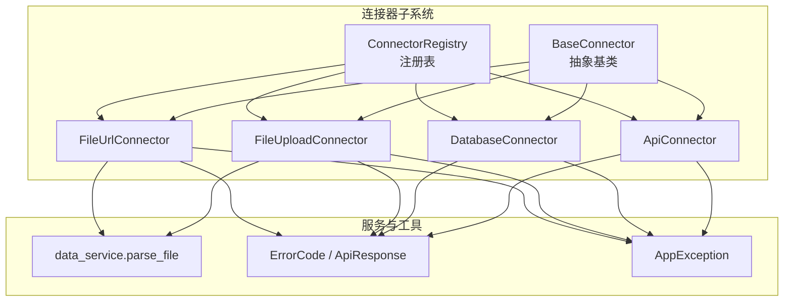
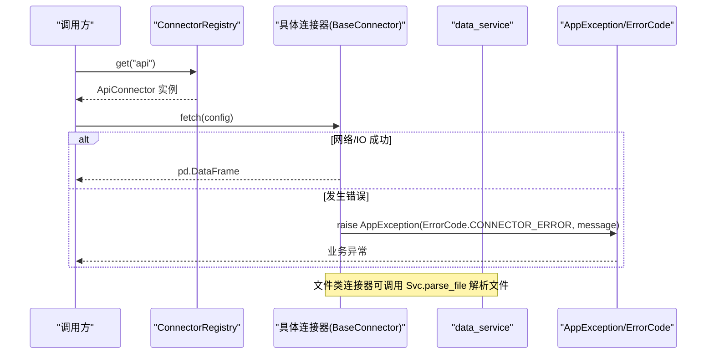
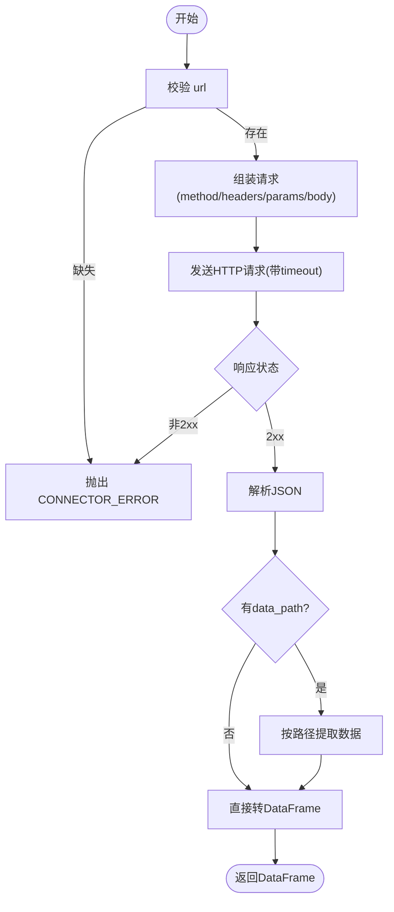
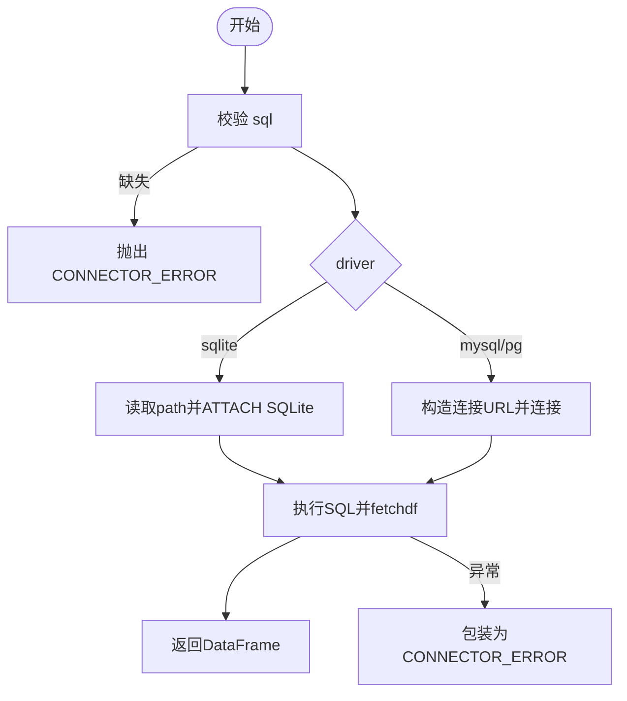
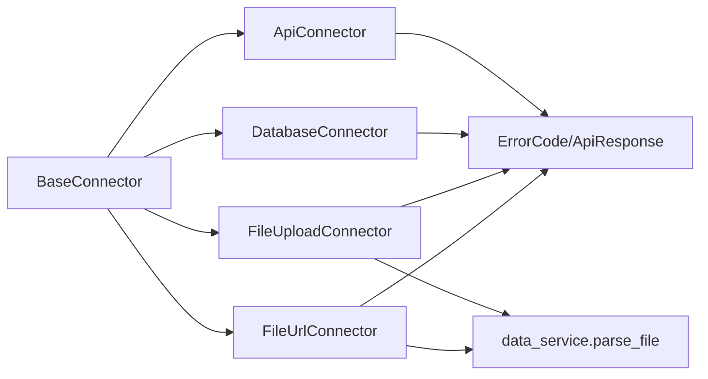

# 连接器基类设计

<cite>
**本文引用的文件**
- [app/core/connectors/base.py](file://app/core/connectors/base.py)
- [app/core/connectors/__init__.py](file://app/core/connectors/__init__.py)
- [app/core/connectors/api_connector.py](file://app/core/connectors/api_connector.py)
- [app/core/connectors/database.py](file://app/core/connectors/database.py)
- [app/core/connectors/file_upload.py](file://app/core/connectors/file_upload.py)
- [app/core/connectors/file_url.py](file://app/core/connectors/file_url.py)
- [app/services/data_service.py](file://app/services/data_service.py)
- [app/core/response.py](file://app/core/response.py)
- [app/core/errors.py](file://app/core/errors.py)
</cite>

## 目录
1. [简介](#简介)
2. [项目结构](#项目结构)
3. [核心组件](#核心组件)
4. [架构总览](#架构总览)
5. [详细组件分析](#详细组件分析)
6. [依赖关系分析](#依赖关系分析)
7. [性能考量](#性能考量)
8. [故障排查指南](#故障排查指南)
9. [结论](#结论)
10. [附录：自定义连接器实现指南](#附录自定义连接器实现指南)

## 简介
本文件深入解析数据连接器基类 BaseConnector 的设计与抽象接口，统一了所有内置连接器的契约：通过异步方法 fetch() 获取数据并返回统一的 pandas.DataFrame；通过类方法 connector_type() 提供类型标识。同时说明注册表模式如何集中管理连接器、错误码体系如何规范异常处理，以及配置参数格式与数据返回标准。文末提供实现自定义连接器的完整步骤与示例路径。

## 项目结构
连接器子系统位于 app/core/connectors 下，采用“基类 + 具体实现 + 注册表”的分层组织：
- base.py：定义抽象基类 BaseConnector，强制实现 fetch() 与 connector_type()
- __init__.py：实现 ConnectorRegistry 注册表，并在模块末尾导入并注册所有内置连接器
- api_connector.py、database.py、file_upload.py、file_url.py：四种内置连接器实现
- data_service.py：文件解析与数据处理服务，被文件类连接器复用
- response.py、errors.py：统一错误码与异常处理

图表来源
- [app/core/connectors/base.py:11-24](file://app/core/connectors/base.py#L11-L24)
- [app/core/connectors/__init__.py:13-45](file://app/core/connectors/__init__.py#L13-L45)
- [app/core/connectors/api_connector.py:18-36](file://app/core/connectors/api_connector.py#L18-L36)
- [app/core/connectors/database.py:19-42](file://app/core/connectors/database.py#L19-L42)
- [app/core/connectors/file_upload.py:18-30](file://app/core/connectors/file_upload.py#L18-L30)
- [app/core/connectors/file_url.py:19-33](file://app/core/connectors/file_url.py#L19-L33)
- [app/services/data_service.py:77-117](file://app/services/data_service.py#L77-L117)
- [app/core/response.py:12-68](file://app/core/response.py#L12-L68)
- [app/core/errors.py:15-42](file://app/core/errors.py#L15-L42)

章节来源
- [app/core/connectors/base.py:11-24](file://app/core/connectors/base.py#L11-L24)
- [app/core/connectors/__init__.py:13-45](file://app/core/connectors/__init__.py#L13-L45)

## 核心组件
- BaseConnector（抽象基类）
  - 强制子类实现：
    - async def fetch(config) -> pd.DataFrame：根据配置异步获取数据，返回统一 DataFrame
    - @classmethod def connector_type() -> str：返回唯一类型标识字符串，如 "api"、"database"、"file_upload"、"file_url"
- ConnectorRegistry（注册表）
  - register(connector_cls)：按 connector_type() 注册连接器类
  - get(type_name)：根据类型名实例化对应连接器
  - list_types()：列出已注册类型
  - has(type_name)：判断是否已注册
- 内置连接器
  - ApiConnector：HTTP 请求外部 API，支持 GET/POST、重试、JSON 路径提取、转 DataFrame
  - DatabaseConnector：SQLite（DuckDB）、MySQL/PostgreSQL（SQLAlchemy），执行 SELECT 查询返回 DataFrame
  - FileUploadConnector：接收 base64 编码文件内容，解析为 DataFrame
  - FileUrlConnector：从 URL 下载文件，解析为 DataFrame
- 数据服务
  - parse_file(content, filename)：统一解析 CSV/Excel/JSON，返回包含 columns、data、meta 的结构，供文件类连接器复用

章节来源
- [app/core/connectors/base.py:11-24](file://app/core/connectors/base.py#L11-L24)
- [app/core/connectors/__init__.py:13-45](file://app/core/connectors/__init__.py#L13-L45)
- [app/core/connectors/api_connector.py:18-129](file://app/core/connectors/api_connector.py#L18-L129)
- [app/core/connectors/database.py:19-112](file://app/core/connectors/database.py#L19-L112)
- [app/core/connectors/file_upload.py:18-64](file://app/core/connectors/file_upload.py#L18-L64)
- [app/core/connectors/file_url.py:19-83](file://app/core/connectors/file_url.py#L19-L83)
- [app/services/data_service.py:77-117](file://app/services/data_service.py#L77-L117)

## 架构总览
连接器子系统遵循“统一接口 + 注册表”的模式：
- 调用方通过 ConnectorRegistry.get(type_name) 获取具体连接器实例
- 调用其异步方法 fetch(config) 获取 DataFrame
- 所有错误以 AppException 抛出，携带 ErrorCode.CONNECTOR_ERROR 等统一错误码
- 文件类连接器复用 data_service.parse_file 完成多格式解析

图表来源
- [app/core/connectors/__init__.py:27-36](file://app/core/connectors/__init__.py#L27-L36)
- [app/core/connectors/api_connector.py:37-92](file://app/core/connectors/api_connector.py#L37-L92)
- [app/core/connectors/file_upload.py:31-63](file://app/core/connectors/file_upload.py#L31-L63)
- [app/core/connectors/file_url.py:34-72](file://app/core/connectors/file_url.py#L34-L72)
- [app/core/errors.py:15-42](file://app/core/errors.py#L15-L42)
- [app/core/response.py:12-68](file://app/core/response.py#L12-L68)

## 详细组件分析

### BaseConnector 抽象接口
- fetch(config) -> pd.DataFrame
  - 输入：字典型配置，不同连接器有不同字段
  - 输出：pandas.DataFrame，列名为数据字段，行为记录
  - 要求：必须异步，内部错误需抛出 AppException，使用 ErrorCode.CONNECTOR_ERROR
- connector_type() -> str
  - 返回值：唯一字符串标识，用于注册表查找
  - 约定：避免重复，建议语义化命名（如 "api"、"database"、"file_upload"、"file_url"）

章节来源
- [app/core/connectors/base.py:11-24](file://app/core/connectors/base.py#L11-L24)

### ApiConnector
- 用途：通过 HTTP 拉取 JSON 数据并转为 DataFrame
- 配置字段
  - url：必填
  - method：GET/POST，默认 GET
  - headers、params、body：请求头、查询参数、请求体
  - timeout：超时秒数，默认 30
  - retries：重试次数，默认 1
  - data_path：点号分隔的 JSON 路径，用于提取数组或对象
- 关键流程
  - 校验 url
  - 构建 AsyncClient 发起请求
  - 可选按 data_path 提取数据
  - 将结果转为 DataFrame
  - 失败时记录日志并重试，最终抛错
- 错误处理
  - 不支持的 HTTP 方法、网络异常、JSON 转换失败均抛出 AppException

图表来源
- [app/core/connectors/api_connector.py:37-92](file://app/core/connectors/api_connector.py#L37-L92)
- [app/core/connectors/api_connector.py:94-129](file://app/core/connectors/api_connector.py#L94-L129)
- [app/core/response.py:12-68](file://app/core/response.py#L12-L68)

章节来源
- [app/core/connectors/api_connector.py:18-129](file://app/core/connectors/api_connector.py#L18-L129)

### DatabaseConnector
- 用途：执行 SQL 查询并返回 DataFrame
- 支持驱动
  - sqlite：通过 DuckDB 附加 .db 文件执行 SQL
  - mysql/postgresql/postgres：通过 SQLAlchemy 连接数据库执行 SQL
- 配置字段
  - driver：sqlite/mysql/postgresql/postgres
  - sql：SELECT 语句（必填）
  - SQLite：path（.db 文件路径）
  - MySQL/PG：host、port、user、password/password_env、database
- 关键流程
  - 校验 sql
  - 根据 driver 选择 SQLite 或 SQLAlchemy 路径
  - 执行 SQL 并返回 DataFrame
  - 捕获异常并转换为 AppException

图表来源
- [app/core/connectors/database.py:43-68](file://app/core/connectors/database.py#L43-L68)
- [app/core/connectors/database.py:70-84](file://app/core/connectors/database.py#L70-L84)
- [app/core/connectors/database.py:86-112](file://app/core/connectors/database.py#L86-L112)
- [app/core/response.py:12-68](file://app/core/response.py#L12-L68)

章节来源
- [app/core/connectors/database.py:19-112](file://app/core/connectors/database.py#L19-L112)

### FileUploadConnector
- 用途：接收 base64 编码的文件内容并解析为 DataFrame
- 配置字段
  - file_content：base64 字符串（必填）
  - filename：文件名（用于推断格式，默认 data.csv）
- 关键流程
  - 校验 file_content
  - base64 解码
  - 调用 data_service.parse_file 解析
  - 将解析结果转为 DataFrame
- 错误处理
  - base64 解码失败、文件格式不支持、内容为空等抛出 AppException

章节来源
- [app/core/connectors/file_upload.py:18-64](file://app/core/connectors/file_upload.py#L18-L64)
- [app/services/data_service.py:77-117](file://app/services/data_service.py#L77-L117)

### FileUrlConnector
- 用途：从 URL 下载文件并解析为 DataFrame
- 配置字段
  - url：文件下载地址（必填）
  - filename：可选，未提供则从 URL 路径推断
  - headers：可选请求头
  - timeout：超时秒数，默认 60
- 关键流程
  - 校验 url
  - 下载文件内容
  - 调用 data_service.parse_file 解析
  - 将解析结果转为 DataFrame
- 错误处理
  - 下载失败、解析失败抛出 AppException

章节来源
- [app/core/connectors/file_url.py:19-83](file://app/core/connectors/file_url.py#L19-L83)
- [app/services/data_service.py:77-117](file://app/services/data_service.py#L77-L117)

### 注册表 ConnectorRegistry
- 职责
  - 维护类型到连接器类的映射
  - 提供注册、获取、列举、存在性检查
- 生命周期
  - 模块加载时自动导入并注册所有内置连接器
- 使用方式
  - ConnectorRegistry.get("api") 获取 ApiConnector 实例
  - ConnectorRegistry.list_types() 查看可用类型

章节来源
- [app/core/connectors/__init__.py:13-45](file://app/core/connectors/__init__.py#L13-L45)
- [app/core/connectors/__init__.py:48-60](file://app/core/connectors/__init__.py#L48-L60)

## 依赖关系分析
- 耦合度
  - 各连接器仅依赖 BaseConnector 抽象，低耦合
  - 文件类连接器依赖 data_service.parse_file，复用解析逻辑
  - 所有连接器共享错误码与异常体系
- 内聚性
  - 每个连接器聚焦单一数据源，职责清晰
- 外部依赖
  - httpx：API 与 URL 文件下载
  - duckdb：SQLite 查询
  - sqlalchemy+pymysql/psycopg2：MySQL/PostgreSQL 连接
  - pandas：统一数据返回格式
  - chardet：编码检测（文件解析）

图表来源
- [app/core/connectors/base.py:11-24](file://app/core/connectors/base.py#L11-L24)
- [app/core/connectors/api_connector.py:18-129](file://app/core/connectors/api_connector.py#L18-L129)
- [app/core/connectors/database.py:19-112](file://app/core/connectors/database.py#L19-L112)
- [app/core/connectors/file_upload.py:18-64](file://app/core/connectors/file_upload.py#L18-L64)
- [app/core/connectors/file_url.py:19-83](file://app/core/connectors/file_url.py#L19-L83)
- [app/services/data_service.py:77-117](file://app/services/data_service.py#L77-L117)
- [app/core/response.py:12-68](file://app/core/response.py#L12-L68)

章节来源
- [app/core/connectors/__init__.py:48-60](file://app/core/connectors/__init__.py#L48-L60)
- [app/core/response.py:12-68](file://app/core/response.py#L12-L68)

## 性能考量
- 异步 I/O：API 与 URL 下载使用 httpx.AsyncClient，减少阻塞
- 重试机制：ApiConnector 支持 retries，提升网络稳定性
- 资源释放：数据库连接在 finally 中关闭或 dispose，避免连接泄漏
- 内存效率：DuckDB 内存引擎用于 SQLite 查询，减少磁盘 IO
- 数据标准化：统一返回 DataFrame，便于后续处理与序列化

[本节为通用指导，不直接分析具体代码]

## 故障排查指南
- 常见错误
  - 缺少必要配置：如 url、sql、file_content，会抛出 CONNECTOR_ERROR
  - 不支持的驱动或方法：如 database 的 driver、api 的 method
  - 网络异常：超时、状态码非 2xx、DNS 解析失败
  - 文件解析失败：格式不支持、内容为空、编码问题
- 定位方法
  - 检查 config 字段是否齐全且类型正确
  - 查看日志中的重试次数与错误信息
  - 确认外部服务可达性与权限
  - 对文件类连接器，确认文件名后缀与内容一致
- 错误码参考
  - ErrorCode.CONNECTOR_ERROR：连接器相关错误
  - ErrorCode.FILE_PARSE_ERROR：文件解析错误
  - ErrorCode.SQL_EXECUTION_ERROR：SQL 执行错误
  - ErrorCode.DATA_EMPTY：数据为空

章节来源
- [app/core/response.py:12-68](file://app/core/response.py#L12-L68)
- [app/core/errors.py:15-42](file://app/core/errors.py#L15-L42)
- [app/core/connectors/api_connector.py:37-92](file://app/core/connectors/api_connector.py#L37-L92)
- [app/core/connectors/database.py:43-68](file://app/core/connectors/database.py#L43-L68)
- [app/core/connectors/file_upload.py:31-63](file://app/core/connectors/file_upload.py#L31-L63)
- [app/core/connectors/file_url.py:34-72](file://app/core/connectors/file_url.py#L34-L72)

## 结论
BaseConnector 通过抽象接口统一了数据获取方式，使不同数据源以一致的异步 fetch() 暴露数据，并以 connector_type() 进行类型标识。注册表模式简化了连接器的发现与实例化。所有内置连接器严格遵循统一契约：配置参数明确、错误处理规范、返回 DataFrame。该设计便于扩展新连接器并保持系统一致性。

[本节为总结，不直接分析具体代码]

## 附录：自定义连接器实现指南
以下为实现自定义连接器的步骤与要点（以新增一个“CSV 直读连接器”为例）：

- 必要导入
  - 从 app.core.connectors.base 继承 BaseConnector
  - 从 app.core.errors 引入 AppException
  - 从 app.core.response 引入 ErrorCode
  - 使用 pandas 作为数据载体

- 类定义与类型标识
  - 实现类方法 connector_type()，返回唯一字符串，例如 "csv_reader"
  - 确保不与已有类型冲突

- 实现 fetch(config) -> pd.DataFrame
  - 校验 config 必需字段（如 csv_path）
  - 读取文件并解析为 DataFrame
  - 若失败，抛出 AppException(code=ErrorCode.CONNECTOR_ERROR, message="...")
  - 成功返回 DataFrame

- 注册连接器
  - 在 app/core/connectors/__init__.py 末尾导入新连接器类
  - 调用 ConnectorRegistry.register(YourConnector)

- 配置参数格式
  - 以字典形式传入 fetch(config)
  - 字段命名应具描述性，如 csv_path、delimiter、encoding 等

- 数据返回标准
  - 始终返回 pandas.DataFrame
  - 列名应为字符串，行数为数据记录
  - 空数据集返回空 DataFrame 而非 None

- 参考路径
  - 基类定义：[app/core/connectors/base.py:11-24](file://app/core/connectors/base.py#L11-L24)
  - 注册表用法：[app/core/connectors/__init__.py:48-60](file://app/core/connectors/__init__.py#L48-L60)
  - 错误处理示例：[app/core/connectors/api_connector.py:37-92](file://app/core/connectors/api_connector.py#L37-L92)
  - 文件解析复用：[app/services/data_service.py:77-117](file://app/services/data_service.py#L77-L117)

[本节为操作指南，不直接展示代码片段]