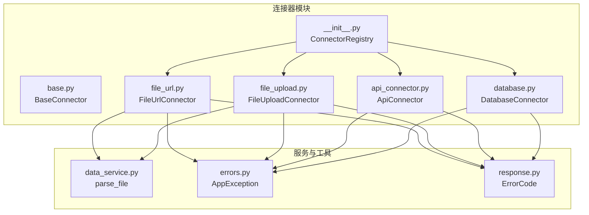
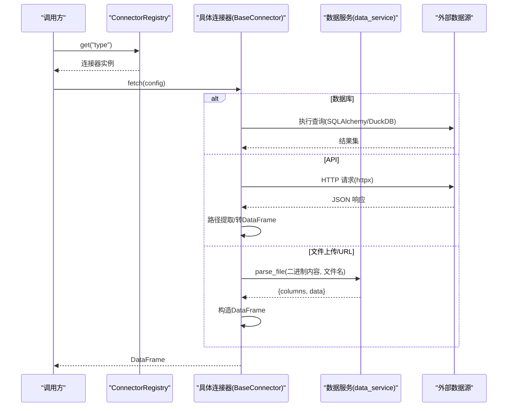
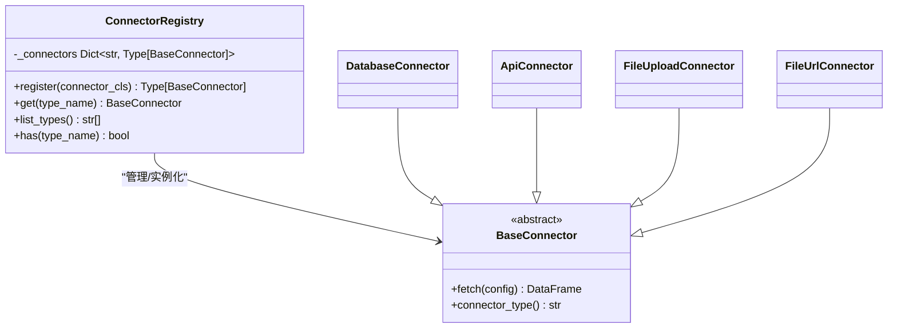
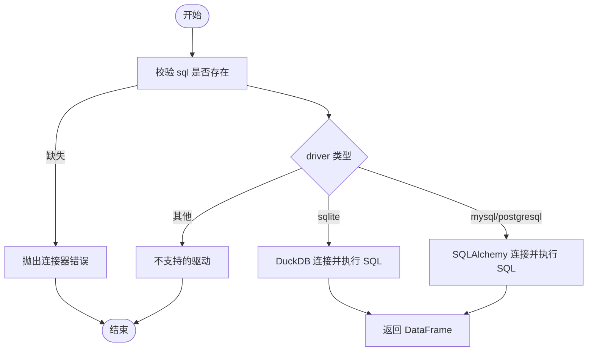
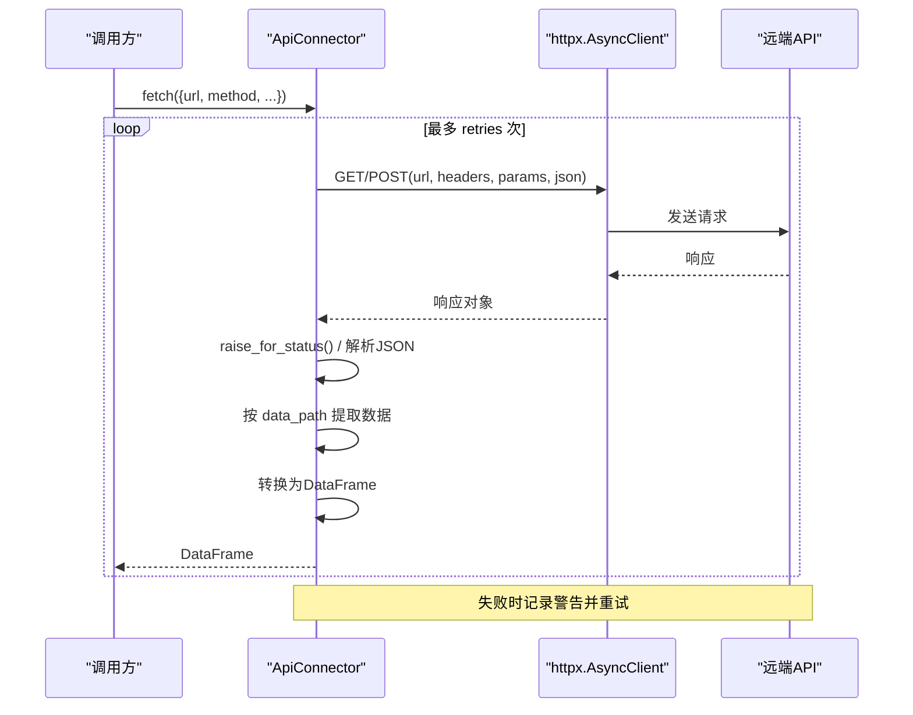
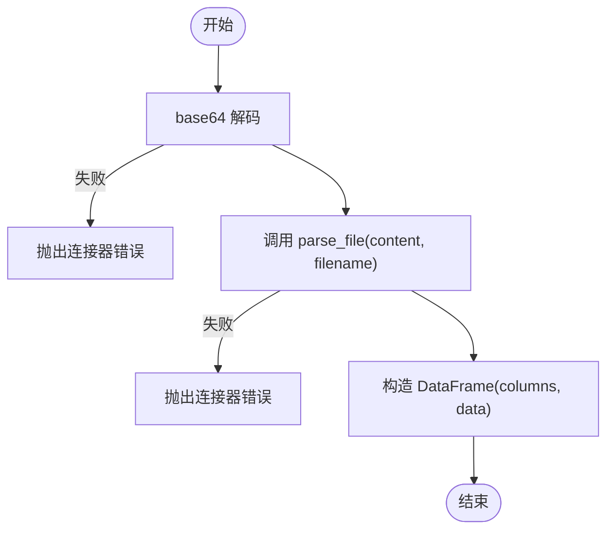
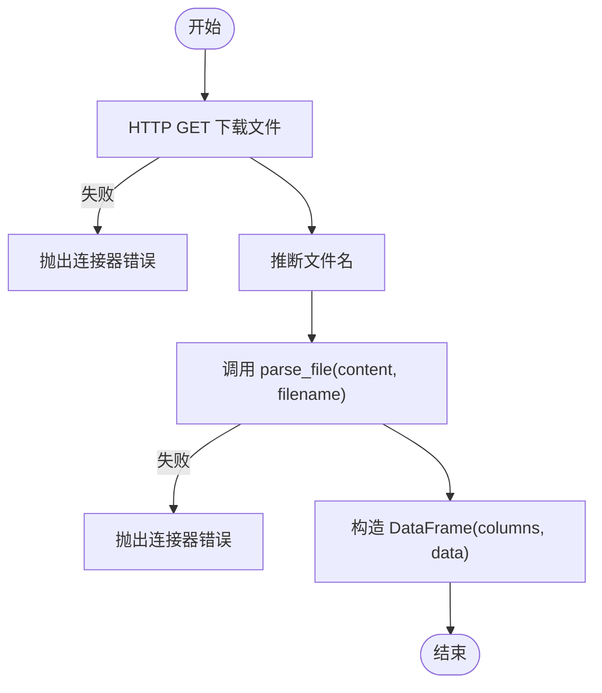
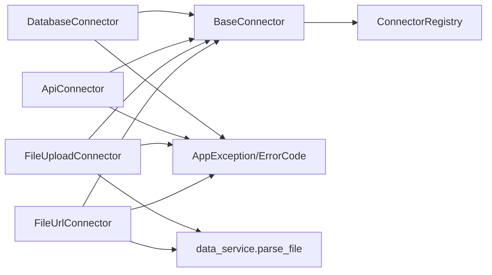

# 连接器系统

<cite>
**本文引用的文件**
- [app/core/connectors/__init__.py](file://app/core/connectors/__init__.py)
- [app/core/connectors/base.py](file://app/core/connectors/base.py)
- [app/core/connectors/database.py](file://app/core/connectors/database.py)
- [app/core/connectors/api_connector.py](file://app/core/connectors/api_connector.py)
- [app/core/connectors/file_upload.py](file://app/core/connectors/file_upload.py)
- [app/core/connectors/file_url.py](file://app/core/connectors/file_url.py)
- [app/services/data_service.py](file://app/services/data_service.py)
- [app/core/errors.py](file://app/core/errors.py)
- [app/core/response.py](file://app/core/response.py)
</cite>

## 目录
1. [简介](#简介)
2. [项目结构](#项目结构)
3. [核心组件](#核心组件)
4. [架构总览](#架构总览)
5. [详细组件分析](#详细组件分析)
6. [依赖关系分析](#依赖关系分析)
7. [性能考量](#性能考量)
8. [故障排查指南](#故障排查指南)
9. [结论](#结论)
10. [附录：自定义连接器开发指南](#附录自定义连接器开发指南)

## 简介
本文件系统性地解析连接器子系统的设计与扩展机制。该子系统通过抽象基类统一数据获取接口，借助注册表模式动态发现并实例化具体连接器，内置支持数据库（SQLAlchemy/DuckDB）、API（HTTP）、本地文件上传、URL 远程文件等数据源。所有连接器以异步方式获取数据，并统一返回 pandas DataFrame，便于后续数据处理流水线消费。

## 项目结构
连接器子系统位于 app/core/connectors 目录下，采用“抽象基类 + 多实现 + 注册表”的分层组织方式：
- base.py：定义抽象基类 BaseConnector，规定 fetch 和 connector_type 两个强制方法。
- database.py：数据库连接器，支持 SQLite（DuckDB）与 MySQL/PostgreSQL（SQLAlchemy）。
- api_connector.py：REST API 连接器，使用 httpx 发起异步请求并解析 JSON。
- file_upload.py：文件上传连接器，接收 base64 编码内容并调用通用解析逻辑。
- file_url.py：URL 文件连接器，下载远程文件并复用通用解析逻辑。
- __init__.py：ConnectorRegistry 注册表，集中导入并自动注册所有内置连接器类型。

图表来源
- [app/core/connectors/__init__.py:13-59](file://app/core/connectors/__init__.py#L13-L59)
- [app/core/connectors/base.py:11-23](file://app/core/connectors/base.py#L11-L23)
- [app/core/connectors/database.py:19-112](file://app/core/connectors/database.py#L19-L112)
- [app/core/connectors/api_connector.py:18-129](file://app/core/connectors/api_connector.py#L18-L129)
- [app/core/connectors/file_upload.py:18-64](file://app/core/connectors/file_upload.py#L18-L64)
- [app/core/connectors/file_url.py:19-83](file://app/core/connectors/file_url.py#L19-L83)
- [app/services/data_service.py:77-117](file://app/services/data_service.py#L77-L117)
- [app/core/errors.py:15-42](file://app/core/errors.py#L15-L42)
- [app/core/response.py:12-68](file://app/core/response.py#L12-L68)

章节来源
- [app/core/connectors/__init__.py:1-60](file://app/core/connectors/__init__.py#L1-L60)
- [app/core/connectors/base.py:1-24](file://app/core/connectors/base.py#L1-L24)

## 核心组件
- BaseConnector 抽象基类：定义统一的异步数据获取接口 fetch(config) -> DataFrame 与类型标识 connector_type()。
- ConnectorRegistry 注册表：单例式静态字典维护“类型名 -> 连接器类”的映射，提供 register/get/list_types/has 等方法，并在模块加载时自动完成内置连接器的注册。
- 内置连接器：
  - DatabaseConnector：根据 driver 分支处理 SQLite（DuckDB）或 MySQL/PostgreSQL（SQLAlchemy），统一返回 DataFrame。
  - ApiConnector：基于 httpx 异步 GET/POST，支持重试、超时、响应路径提取与 DataFrame 转换。
  - FileUploadConnector：解码 base64 文件内容，调用 parse_file 解析为 DataFrame。
  - FileUrlConnector：从 URL 下载文件，推断文件名后调用 parse_file 解析为 DataFrame。

章节来源
- [app/core/connectors/base.py:11-23](file://app/core/connectors/base.py#L11-L23)
- [app/core/connectors/__init__.py:13-59](file://app/core/connectors/__init__.py#L13-L59)
- [app/core/connectors/database.py:19-112](file://app/core/connectors/database.py#L19-L112)
- [app/core/connectors/api_connector.py:18-129](file://app/core/connectors/api_connector.py#L18-L129)
- [app/core/connectors/file_upload.py:18-64](file://app/core/connectors/file_upload.py#L18-L64)
- [app/core/connectors/file_url.py:19-83](file://app/core/connectors/file_url.py#L19-L83)

## 架构总览
连接器子系统遵循“抽象 + 注册表 + 插件化”的模式：
- 抽象层：BaseConnector 定义统一契约。
- 实现层：各具体连接器实现 fetch 与 connector_type。
- 注册与发现：ConnectorRegistry 在模块导入时自动注册所有内置类型；运行时通过 get(type_name) 动态实例化。
- 数据流：上层业务通过注册表获取连接器实例，传入配置执行 fetch，得到标准 DataFrame 供后续处理。

图表来源
- [app/core/connectors/__init__.py:27-36](file://app/core/connectors/__init__.py#L27-L36)
- [app/core/connectors/database.py:43-112](file://app/core/connectors/database.py#L43-L112)
- [app/core/connectors/api_connector.py:37-92](file://app/core/connectors/api_connector.py#L37-L92)
- [app/core/connectors/file_upload.py:31-64](file://app/core/connectors/file_upload.py#L31-L64)
- [app/core/connectors/file_url.py:34-72](file://app/core/connectors/file_url.py#L34-L72)
- [app/services/data_service.py:77-117](file://app/services/data_service.py#L77-L117)

## 详细组件分析

### BaseConnector 抽象基类
- 职责：定义所有连接器必须实现的异步数据获取方法与类型标识。
- 关键方法：
  - fetch(config): 异步读取数据，返回 DataFrame。
  - connector_type(): 返回字符串类型标识，用于注册表路由。

章节来源
- [app/core/connectors/base.py:11-23](file://app/core/connectors/base.py#L11-L23)

### ConnectorRegistry 注册表机制
- 设计要点：
  - 使用类级字典存储“类型名 -> 连接器类”。
  - register(connector_cls)：将连接器类按 connector_type() 返回值注册，若重复则覆盖并记录警告。
  - get(type_name)：根据类型名实例化对应连接器；未知类型抛出异常并提示可用类型列表。
  - list_types()/has(type_name)：列出已注册类型与存在性检查。
  - 模块末尾集中导入并注册所有内置连接器，确保启动即可用。
- 扩展点：新增连接器只需实现 BaseConnector，并在模块末尾调用 register 或在 __init__ 中导入该类触发注册。

图表来源
- [app/core/connectors/__init__.py:13-59](file://app/core/connectors/__init__.py#L13-L59)
- [app/core/connectors/base.py:11-23](file://app/core/connectors/base.py#L11-L23)

章节来源
- [app/core/connectors/__init__.py:13-59](file://app/core/connectors/__init__.py#L13-L59)

### 数据库连接器（DatabaseConnector）
- 功能：
  - 支持 SQLite（通过 DuckDB 直接查询 .db 文件）与 MySQL/PostgreSQL（通过 SQLAlchemy）。
  - 配置字段：driver、path（SQLite）、host/port/user/password/password_env/database/sql。
  - 错误处理：缺失 sql/driver/path 等参数抛出自定义异常；其他异常统一包装为连接器错误。
- 流程要点：
  - 校验必填项（如 sql）。
  - 根据 driver 选择 SQLite 或 SQLAlchemy 分支。
  - SQLite：内存 DuckDB 引擎 ATTACH 目标库并执行 SQL。
  - MySQL/PostgreSQL：构建连接串，创建 engine，执行 SQL 并返回 DataFrame。

图表来源
- [app/core/connectors/database.py:43-112](file://app/core/connectors/database.py#L43-L112)

章节来源
- [app/core/connectors/database.py:19-112](file://app/core/connectors/database.py#L19-L112)

### API 连接器（ApiConnector）
- 功能：
  - 使用 httpx.AsyncClient 发起 GET/POST 请求，支持 headers、params、body、timeout、retries。
  - 支持 data_path 点号路径提取嵌套 JSON 数据。
  - 将响应数据转换为 DataFrame（列表/字典/空列表等情形）。
- 流程要点：
  - 校验 url。
  - 循环重试，捕获异常并记录日志。
  - 成功响应后按 data_path 提取数据，再转为 DataFrame。

图表来源
- [app/core/connectors/api_connector.py:37-92](file://app/core/connectors/api_connector.py#L37-L92)

章节来源
- [app/core/connectors/api_connector.py:18-129](file://app/core/connectors/api_connector.py#L18-L129)

### 文件上传连接器（FileUploadConnector）
- 功能：
  - 接收 base64 编码的文件内容与文件名，解码后调用 parse_file 解析为 DataFrame。
  - 支持 CSV/Excel/JSON 格式（由 parse_file 决定）。
- 流程要点：
  - 校验 file_content。
  - base64 解码失败抛出连接器错误。
  - 调用 parse_file 并将结果封装为 DataFrame。

图表来源
- [app/core/connectors/file_upload.py:31-64](file://app/core/connectors/file_upload.py#L31-L64)
- [app/services/data_service.py:77-117](file://app/services/data_service.py#L77-L117)

章节来源
- [app/core/connectors/file_upload.py:18-64](file://app/core/connectors/file_upload.py#L18-L64)

### URL 文件连接器（FileUrlConnector）
- 功能：
  - 从 URL 下载文件，支持自定义 headers 与超时。
  - 自动推断文件名（若无显式指定），然后调用 parse_file 解析。
- 流程要点：
  - 校验 url。
  - 下载文件并检查状态码。
  - 推断文件名后调用 parse_file，封装为 DataFrame。

图表来源
- [app/core/connectors/file_url.py:34-83](file://app/core/connectors/file_url.py#L34-L83)
- [app/services/data_service.py:77-117](file://app/services/data_service.py#L77-L117)

章节来源
- [app/core/connectors/file_url.py:19-83](file://app/core/connectors/file_url.py#L19-L83)

## 依赖关系分析
- 模块耦合：
  - 所有连接器均依赖 BaseConnector 抽象与 AppException/ErrorCode 进行错误上报。
  - 文件类连接器依赖 data_service.parse_file 统一解析逻辑，降低重复实现。
  - 注册表集中管理类型到类的映射，避免硬编码分支。
- 外部依赖：
  - httpx 用于异步网络请求（API 与 URL 文件）。
  - SQLAlchemy 与 psycopg2/pymysql 用于关系型数据库连接。
  - DuckDB 用于 SQLite 直连与内存 SQL 执行。
  - pandas 作为统一数据载体。

图表来源
- [app/core/connectors/__init__.py:13-59](file://app/core/connectors/__init__.py#L13-L59)
- [app/core/connectors/database.py:19-112](file://app/core/connectors/database.py#L19-L112)
- [app/core/connectors/api_connector.py:18-129](file://app/core/connectors/api_connector.py#L18-L129)
- [app/core/connectors/file_upload.py:18-64](file://app/core/connectors/file_upload.py#L18-L64)
- [app/core/connectors/file_url.py:19-83](file://app/core/connectors/file_url.py#L19-L83)
- [app/services/data_service.py:77-117](file://app/services/data_service.py#L77-L117)
- [app/core/errors.py:15-42](file://app/core/errors.py#L15-L42)
- [app/core/response.py:12-68](file://app/core/response.py#L12-L68)

章节来源
- [app/core/connectors/__init__.py:13-59](file://app/core/connectors/__init__.py#L13-L59)
- [app/core/connectors/database.py:19-112](file://app/core/connectors/database.py#L19-L112)
- [app/core/connectors/api_connector.py:18-129](file://app/core/connectors/api_connector.py#L18-L129)
- [app/core/connectors/file_upload.py:18-64](file://app/core/connectors/file_upload.py#L18-L64)
- [app/core/connectors/file_url.py:19-83](file://app/core/connectors/file_url.py#L19-L83)

## 性能考量
- 数据库连接器：
  - SQLite 通过 DuckDB 内存引擎 ATTACH 文件，减少磁盘 IO 开销。
  - SQLAlchemy 每次 fetch 创建 engine 并 dispose，避免长连接占用；在高并发场景可考虑连接池优化。
- API 连接器：
  - 使用 httpx.AsyncClient 异步 I/O，提升并发能力。
  - 支持重试与超时控制，增强鲁棒性；可根据业务调整 retries 与 timeout。
- 文件连接器：
  - 复用 parse_file，避免重复解析逻辑；对大文件建议分块处理或限制大小。
- 通用：
  - 所有连接器返回 DataFrame，注意内存占用；必要时可进行列裁剪或分页拉取。

## 故障排查指南
- 常见错误与定位：
  - 缺少必要配置（如 sql/url/file_content）：检查 config 字段是否完整。
  - 不支持的驱动或文件格式：确认 driver 与文件名后缀。
  - 网络请求失败：检查 URL、headers、认证信息、超时与重试策略。
  - 数据库连接失败：核对 host/port/user/password/database 及环境变量密码。
- 错误处理机制：
  - 各连接器统一抛出 AppException，携带 ErrorCode 与消息，便于上层统一处理与日志追踪。
  - 全局异常处理器会将业务异常转换为统一响应体，便于前端展示。

章节来源
- [app/core/errors.py:15-42](file://app/core/errors.py#L15-L42)
- [app/core/response.py:12-68](file://app/core/response.py#L12-L68)
- [app/core/connectors/database.py:43-112](file://app/core/connectors/database.py#L43-L112)
- [app/core/connectors/api_connector.py:37-92](file://app/core/connectors/api_connector.py#L37-L92)
- [app/core/connectors/file_upload.py:31-64](file://app/core/connectors/file_upload.py#L31-L64)
- [app/core/connectors/file_url.py:34-72](file://app/core/connectors/file_url.py#L34-L72)

## 结论
连接器系统通过抽象基类与注册表实现了高内聚、低耦合的数据接入能力。内置连接器覆盖了常见的数据源类型，并通过统一的 DataFrame 输出与标准化错误模型，简化了上层集成。扩展新连接器仅需继承基类并注册类型，即可无缝融入现有体系。

## 附录：自定义连接器开发指南
- 步骤概览：
  1. 新建连接器类并继承 BaseConnector。
  2. 实现 connector_type() 返回唯一类型标识。
  3. 实现 async fetch(config) -> DataFrame，内部完成数据获取与异常包装。
  4. 在模块末尾调用 ConnectorRegistry.register(YourConnector) 完成注册；或在 __init__ 中导入该类触发注册。
- 配置与参数验证：
  - 在 fetch 开头校验必需参数，缺失时抛出 AppException（ErrorCode.CONNECTOR_ERROR）。
  - 对于可选参数设置合理默认值，保证健壮性。
- 示例说明（以伪代码描述流程）：
  - 定义 YourConnector.connector_type() 返回 "your_type"。
  - fetch(config) 中：
    - 校验 config 中的必要字段。
    - 根据业务逻辑获取数据（网络/本地/缓存等）。
    - 将数据转换为 pandas DataFrame。
    - 捕获异常并包装为 AppException。
  - 在模块末尾：ConnectorRegistry.register(YourConnector)。
- 注意事项：
  - 保持异步风格，避免阻塞事件循环。
  - 复用 data_service.parse_file 处理文件解析，避免重复造轮子。
  - 使用 ErrorCode 明确错误类别，便于上层统一处理。

章节来源
- [app/core/connectors/base.py:11-23](file://app/core/connectors/base.py#L11-L23)
- [app/core/connectors/__init__.py:13-59](file://app/core/connectors/__init__.py#L13-L59)
- [app/services/data_service.py:77-117](file://app/services/data_service.py#L77-L117)
- [app/core/errors.py:15-42](file://app/core/errors.py#L15-L42)
- [app/core/response.py:12-68](file://app/core/response.py#L12-L68)