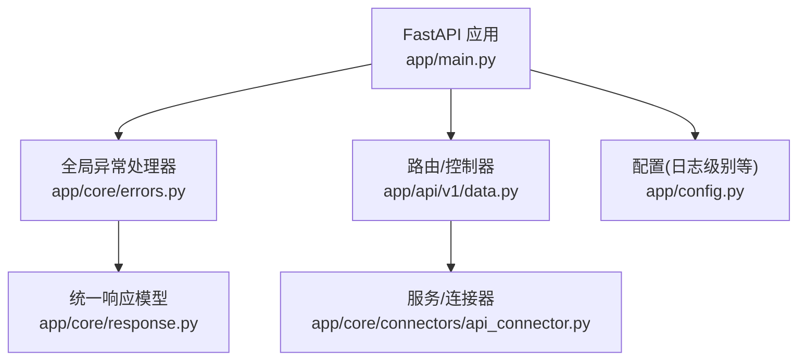
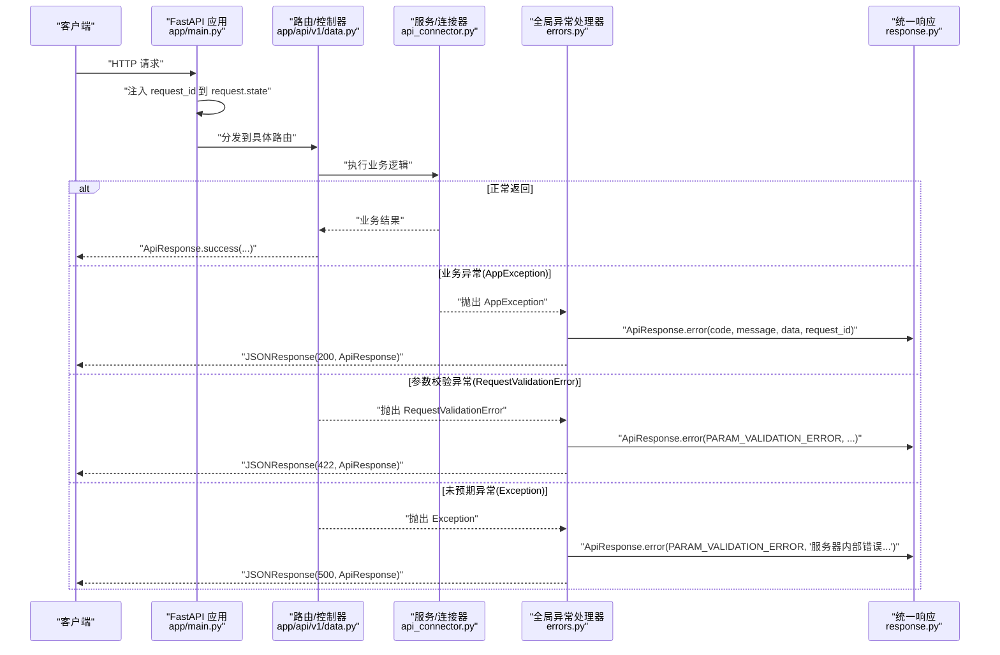
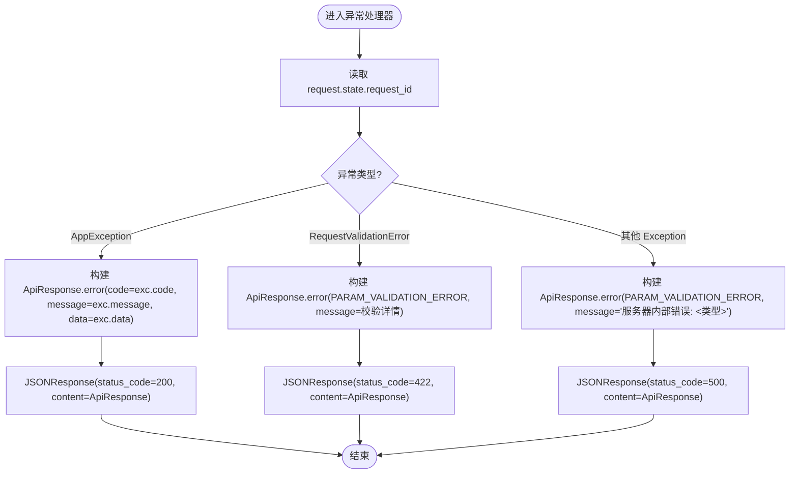
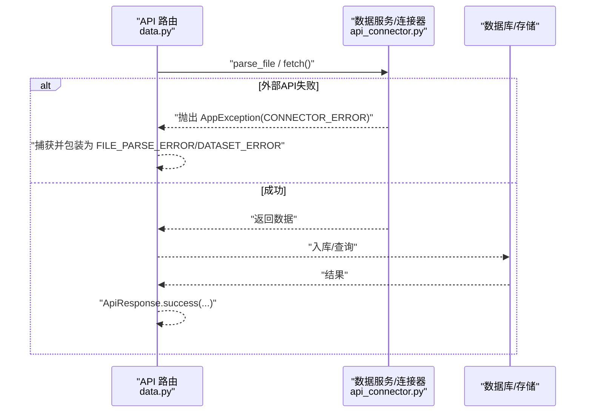
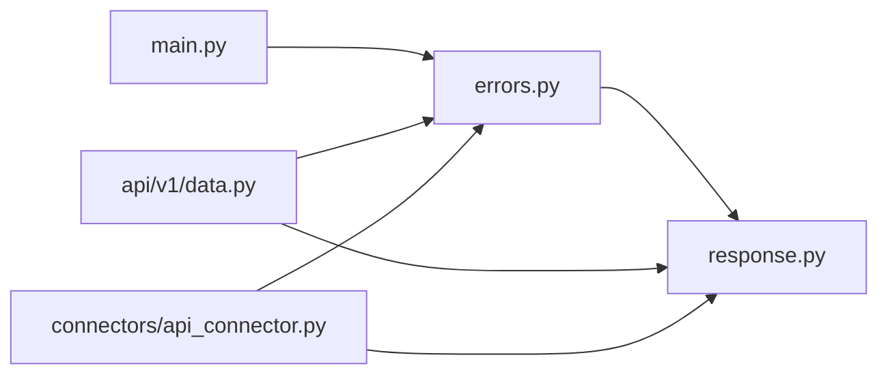

# 错误处理

<cite>
**本文引用的文件**
- [app/core/errors.py](file://app/core/errors.py)
- [app/core/response.py](file://app/core/response.py)
- [app/main.py](file://app/main.py)
- [app/api/v1/data.py](file://app/api/v1/data.py)
- [app/core/connectors/api_connector.py](file://app/core/connectors/api_connector.py)
- [app/config.py](file://app/config.py)
</cite>

## 目录
1. [简介](#简介)
2. [项目结构](#项目结构)
3. [核心组件](#核心组件)
4. [架构总览](#架构总览)
5. [详细组件分析](#详细组件分析)
6. [依赖关系分析](#依赖关系分析)
7. [性能考虑](#性能考虑)
8. [故障排查指南](#故障排查指南)
9. [结论](#结论)
10. [附录](#附录)

## 简介
本文件系统性说明应用的错误处理架构与异常管理机制，覆盖自定义异常层次、统一响应格式、全局异常处理器、日志记录与错误追踪策略，以及最佳实践与调试技巧。目标是帮助开发者在业务层正确抛出异常、在服务层捕获并转换、在网关层统一输出标准响应，并通过请求ID实现端到端追踪。

## 项目结构
错误处理相关代码集中在 core 层与入口应用：
- 统一响应与错误码定义：app/core/response.py
- 自定义异常与全局异常处理器：app/core/errors.py
- 应用启动与异常注册：app/main.py
- API 层使用示例：app/api/v1/data.py
- 连接器层使用示例：app/core/connectors/api_connector.py
- 配置（含日志级别）：app/config.py

图表来源
- [app/main.py:46-79](file://app/main.py#L46-L79)
- [app/core/errors.py:15-73](file://app/core/errors.py#L15-L73)
- [app/core/response.py:12-102](file://app/core/response.py#L12-L102)
- [app/api/v1/data.py:1-200](file://app/api/v1/data.py#L1-L200)
- [app/core/connectors/api_connector.py:1-129](file://app/core/connectors/api_connector.py#L1-L129)
- [app/config.py:1-23](file://app/config.py#L1-L23)

章节来源
- [app/main.py:46-79](file://app/main.py#L46-L79)
- [app/core/errors.py:15-73](file://app/core/errors.py#L15-L73)
- [app/core/response.py:12-102](file://app/core/response.py#L12-L102)
- [app/api/v1/data.py:1-200](file://app/api/v1/data.py#L1-L200)
- [app/core/connectors/api_connector.py:1-129](file://app/core/connectors/api_connector.py#L1-L129)
- [app/config.py:1-23](file://app/config.py#L1-L23)

## 核心组件
- 统一响应体 ApiResponse：提供 success/error 两种构造方式，包含 code、message、data、request_id 字段，用于所有成功与错误响应的标准化封装。
- 错误码枚举 ErrorCode：按模块分段定义错误码（如通用、数据处理、可视化、文件文档、API 编排、Pipeline 引擎），并提供默认消息映射。
- 自定义异常 AppException：携带 code、message、data，便于业务层显式表达错误语义。
- 全局异常处理器：
  - app_exception_handler：将 AppException 转换为统一响应，HTTP 状态码固定为 200（通过 code/message 区分）。
  - validation_exception_handler：将 Pydantic 参数校验异常转换为统一响应，HTTP 状态码 422。
  - generic_exception_handler：兜底处理未预期异常，返回 HTTP 500。
- 请求追踪 request_id：中间件注入 X-Request-ID 到 request.state，并在响应头回写；异常处理器使用该 ID 关联一次请求的完整链路。

章节来源
- [app/core/response.py:12-102](file://app/core/response.py#L12-L102)
- [app/core/errors.py:15-73](file://app/core/errors.py#L15-L73)
- [app/main.py:64-76](file://app/main.py#L64-L76)

## 架构总览
下图展示一次请求从进入 FastAPI 到被异常处理器统一包装为 ApiResponse 的完整流程，包括 request_id 注入与三种异常路径。

图表来源
- [app/main.py:64-76](file://app/main.py#L64-L76)
- [app/core/errors.py:30-73](file://app/core/errors.py#L30-L73)
- [app/core/response.py:71-102](file://app/core/response.py#L71-L102)
- [app/api/v1/data.py:52-83](file://app/api/v1/data.py#L52-L83)
- [app/core/connectors/api_connector.py:37-92](file://app/core/connectors/api_connector.py#L37-L92)

## 详细组件分析

### 自定义异常 AppException 与错误码规范
- AppException：
  - 属性：code（int）、message（str|None）、data（Any）
  - 用途：业务层显式表达可预期的错误，由全局处理器统一转为 ApiResponse
- ErrorCode：
  - 分段设计：1xxx 通用、2xxx 数据处理、3xxx 可视化、4xxx 文件文档、5xxx API 编排、6xxx Pipeline 引擎
  - 默认消息：_ERROR_MESSAGES 提供中文默认提示，error() 方法在未指定 message 时自动回填
- 建议：
  - 新增错误码时，同步更新 _ERROR_MESSAGES
  - 业务层优先抛 AppException，避免裸 Exception 泄漏

章节来源
- [app/core/errors.py:15-28](file://app/core/errors.py#L15-L28)
- [app/core/response.py:12-68](file://app/core/response.py#L12-L68)

### 统一响应格式 ApiResponse
- 字段：
  - code：整数错误码（0 表示成功）
  - message：人类可读的错误信息或“success”
  - data：任意业务数据
  - request_id：本次请求的唯一标识，便于全链路追踪
- 工厂方法：
  - success(data=None, request_id=None)
  - error(code, message=None, data=None, request_id=None)
- 行为：
  - 当 message 为空时，error() 根据 code 查找默认消息
  - request_id 若未传入则自动生成 UUID

章节来源
- [app/core/response.py:71-102](file://app/core/response.py#L71-L102)

### 全局异常处理器工作机制
- 注册位置：应用创建时通过 add_exception_handler 注册三类处理器
- 处理策略：
  - AppException：返回 HTTP 200，内容 ApiResponse.error(...)，由 code/message 表达错误
  - RequestValidationError：返回 HTTP 422，内容 ApiResponse.error(PARAM_VALIDATION_ERROR, ...)
  - 其他 Exception：返回 HTTP 500，内容 ApiResponse.error(PARAM_VALIDATION_ERROR, "服务器内部错误: <异常类型>")
- 请求追踪：
  - 从 request.state 读取 request_id（由中间件注入），写入 ApiResponse.request_id
  - 响应头 X-Request-ID 回写同一 ID

图表来源
- [app/core/errors.py:30-73](file://app/core/errors.py#L30-L73)
- [app/main.py:64-76](file://app/main.py#L64-L76)

章节来源
- [app/core/errors.py:30-73](file://app/core/errors.py#L30-L73)
- [app/main.py:64-76](file://app/main.py#L64-L76)

### API 与服务层的错误使用模式
- API 层（以数据处理为例）：
  - 参数/模式校验失败：直接 raise AppException(ErrorCode.DATASET_ERROR, ...)
  - 资源不存在：raise AppException(ErrorCode.RESOURCE_NOT_FOUND, ...)
  - 文件解析异常：捕获底层异常后包装为 AppException(ErrorCode.FILE_PARSE_ERROR, ...)
  - 成功路径：return ApiResponse.success(data=...)
- 连接器层（REST API 调用）：
  - 配置缺失或不支持的方法：raise AppException(ErrorCode.CONNECTOR_ERROR, ...)
  - 网络/协议错误：记录警告日志并重试，最终仍包装为 AppException(ErrorCode.CONNECTOR_ERROR, ...)
  - 响应数据无法转 DataFrame：raise AppException(ErrorCode.CONNECTOR_ERROR, ...)

图表来源
- [app/api/v1/data.py:52-83](file://app/api/v1/data.py#L52-L83)
- [app/core/connectors/api_connector.py:37-92](file://app/core/connectors/api_connector.py#L37-L92)

章节来源
- [app/api/v1/data.py:52-83](file://app/api/v1/data.py#L52-L83)
- [app/core/connectors/api_connector.py:37-92](file://app/core/connectors/api_connector.py#L37-L92)

### 日志记录策略与错误追踪机制
- 日志级别：通过配置项 log_level 控制（默认 INFO），可在 .env 中覆盖
- 日志位置：
  - 连接器层对网络请求失败进行 warning 级别记录，包含重试次数与错误信息
  - 应用生命周期事件（启动/关闭）记录 info 日志
- 错误追踪：
  - 每次请求生成/透传 request_id（X-Request-ID）
  - 所有 ApiResponse 均携带 request_id，便于前端/网关侧聚合日志与问题定位
  - 建议在后续扩展中结合结构化日志（JSON）与集中式日志系统，将 request_id 作为关键索引字段

章节来源
- [app/config.py:6-19](file://app/config.py#L6-L19)
- [app/core/connectors/api_connector.py:83-86](file://app/core/connectors/api_connector.py#L83-L86)
- [app/main.py:64-71](file://app/main.py#L64-L71)

## 依赖关系分析
- 模块耦合：
  - errors.py 依赖 response.py（统一响应与错误码）
  - main.py 注册 errors.py 中的处理器，并注入 request_id 中间件
  - api 层与服务层通过 AppException 与 ErrorCode 协作，保持错误语义一致
- 潜在风险：
  - 未预期的 Exception 会被 generic_exception_handler 捕获并返回 500，但当前未记录堆栈，不利于排障
  - 部分场景下错误码复用（如 PARAM_VALIDATION_ERROR 同时用于参数校验与未知异常），可能降低错误分类精度

图表来源
- [app/main.py:46-79](file://app/main.py#L46-L79)
- [app/core/errors.py:15-73](file://app/core/errors.py#L15-L73)
- [app/core/response.py:12-102](file://app/core/response.py#L12-L102)
- [app/api/v1/data.py:1-200](file://app/api/v1/data.py#L1-L200)
- [app/core/connectors/api_connector.py:1-129](file://app/core/connectors/api_connector.py#L1-L129)

章节来源
- [app/main.py:46-79](file://app/main.py#L46-L79)
- [app/core/errors.py:15-73](file://app/core/errors.py#L15-L73)
- [app/core/response.py:12-102](file://app/core/response.py#L12-L102)
- [app/api/v1/data.py:1-200](file://app/api/v1/data.py#L1-L200)
- [app/core/connectors/api_connector.py:1-129](file://app/core/connectors/api_connector.py#L1-L129)

## 性能考虑
- 异常路径开销：
  - 正常路径仅构造 ApiResponse.success，开销极低
  - 异常路径会构造 JSONResponse 并序列化，属于 I/O 密集操作，应尽量避免频繁触发
- 重试与超时：
  - 连接器层已实现重试与超时控制，避免长时间阻塞
- 建议：
  - 对高频接口增加限流与熔断，减少异常风暴
  - 将错误日志异步落盘或上报，避免阻塞主流程

[本节为通用指导，不直接分析具体文件]

## 故障排查指南
- 快速定位：
  - 查看响应体中的 request_id，结合日志系统检索该 ID 下的全部日志
  - 检查 HTTP 状态码与 code：
    - 200 + 非零 code：业务错误（AppException）
    - 422：参数校验失败（RequestValidationError）
    - 500：未预期异常（需补充堆栈日志）
- 常见问题：
  - 参数校验失败：检查请求体结构与类型约束
  - 连接器请求失败：检查 URL、认证、超时与重试策略
  - 资源不存在：确认 ID 是否正确、数据是否已入库
- 改进建议：
  - 在 generic_exception_handler 中记录异常堆栈（例如 logging.exception），便于定位根因
  - 细化错误码，避免用 PARAM_VALIDATION_ERROR 掩盖真实错误类型
  - 引入结构化日志（JSON）并统一包含 request_id、endpoint、method、status_code、code、message

章节来源
- [app/core/errors.py:62-73](file://app/core/errors.py#L62-L73)
- [app/core/connectors/api_connector.py:83-86](file://app/core/connectors/api_connector.py#L83-L86)
- [app/main.py:64-76](file://app/main.py#L64-L76)

## 结论
本项目建立了清晰的错误处理体系：通过 AppException 表达业务错误、通过 ErrorCode 统一错误分类、通过 ApiResponse 统一响应格式、通过全局异常处理器将各类异常转换为一致的 HTTP 响应，并以 request_id 贯穿全链路追踪。建议后续增强未预期异常的堆栈记录、细化错误码粒度，并结合结构化日志与集中式日志平台提升可观测性。

[本节为总结性内容，不直接分析具体文件]

## 附录
- 编程最佳实践
  - 业务层优先抛出 AppException，附带明确的 code 与 message
  - 服务/连接器层捕获底层异常并包装为 AppException，保留上下文信息
  - 路由层只做薄转发，复杂逻辑下沉至服务层
  - 使用 ApiResponse.success/error 构造响应，避免散落的字典拼装
- 调试技巧
  - 本地开启更详细的日志级别（log_level=DEBUG）
  - 借助 X-Request-ID 在浏览器/网关/后端日志中串联一次请求
  - 对连接器调用增加临时日志打印，观察重试与失败原因
  - 使用测试用例验证错误分支（如非法参数、资源不存在、外部 API 失败）

[本节为通用指导，不直接分析具体文件]