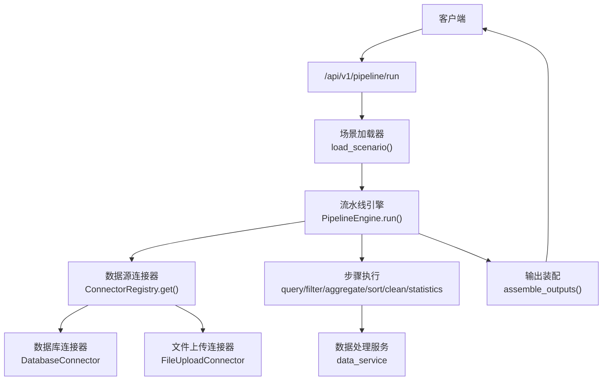
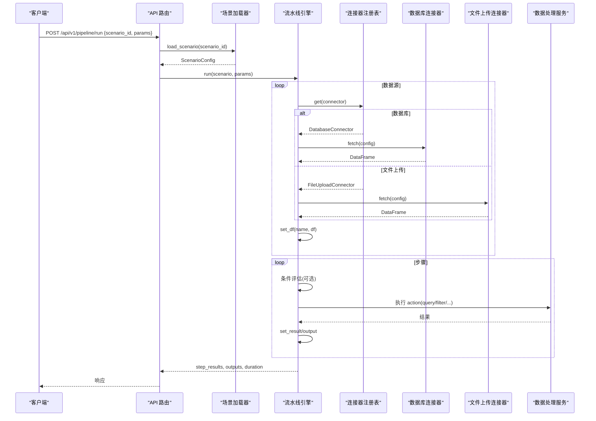
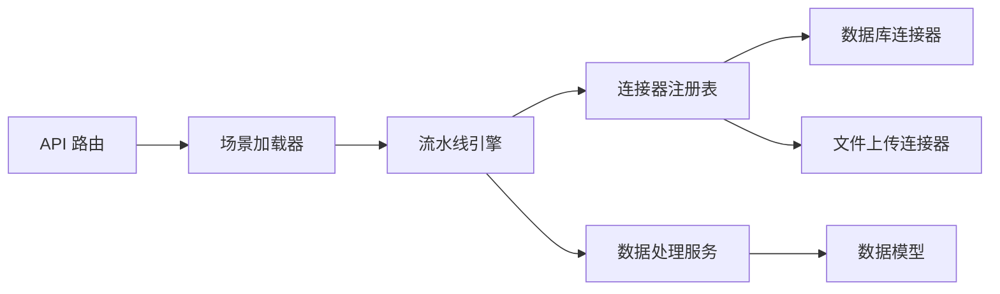

# YAML 配置语法

<cite>
**本文引用的文件**
- [product_increment_analysis.yaml](file://app/scenarios/product_increment_analysis.yaml)
- [sample_analysis.yaml](file://app/scenarios/sample_analysis.yaml)
- [scenario_loader.py](file://app/core/scenario_loader.py)
- [pipeline_engine.py](file://app/core/pipeline_engine.py)
- [database.py](file://app/core/connectors/database.py)
- [file_upload.py](file://app/core/connectors/file_upload.py)
- [base.py](file://app/core/connectors/base.py)
- [__init__.py](file://app/core/connectors/__init__.py)
- [data_models.py](file://app/models/data_models.py)
- [pipeline_models.py](file://app/models/pipeline_models.py)
- [pipeline.py](file://app/api/v1/pipeline.py)
- [config.py](file://app/config.py)
</cite>

## 目录
1. [简介](#简介)
2. [项目结构](#项目结构)
3. [核心组件](#核心组件)
4. [架构总览](#架构总览)
5. [详细组件分析](#详细组件分析)
6. [依赖关系分析](#依赖关系分析)
7. [性能考量](#性能考量)
8. [故障排查指南](#故障排查指南)
9. [结论](#结论)
10. [附录：YAML 语法与最佳实践](#附录yaml-语法与最佳实践)

## 简介
本文件面向使用 YAML 场景配置驱动数据 Pipeline 的用户与开发者，系统性地说明配置语法规则、高级特性（如 $input 引用、条件分支、错误处理）、以及在不同业务场景下的最佳实践。内容基于仓库中实际实现的加载器、引擎与连接器，确保所有规则均可在代码中找到对应实现依据。

## 项目结构
本项目通过 YAML 定义“场景”，每个场景包含数据源、Pipeline 步骤和输出定义。运行时由 API 路由触发，加载器解析 YAML 并校验为 Pydantic 模型，引擎按顺序执行步骤，连接器负责从不同来源获取数据，最终组装输出。

图表来源
- [pipeline.py:14-38](file://app/api/v1/pipeline.py#L14-L38)
- [scenario_loader.py:68-105](file://app/core/scenario_loader.py#L68-L105)
- [pipeline_engine.py:252-356](file://app/core/pipeline_engine.py#L252-L356)
- [__init__.py:51-59](file://app/core/connectors/__init__.py#L51-L59)
- [database.py:43-68](file://app/core/connectors/database.py#L43-L68)
- [file_upload.py:31-63](file://app/core/connectors/file_upload.py#L31-L63)

章节来源
- [pipeline.py:14-48](file://app/api/v1/pipeline.py#L14-L48)
- [scenario_loader.py:68-127](file://app/core/scenario_loader.py#L68-L127)
- [pipeline_engine.py:252-356](file://app/core/pipeline_engine.py#L252-L356)

## 核心组件
- 场景加载器：将 YAML 解析为强类型模型，提供场景列表能力。
- 流水线引擎：维护上下文、执行步骤、处理条件与错误、组装输出。
- 连接器注册表：统一管理多种数据源接入方式。
- 数据模型：统一 DataFrame 输入/输出及各类操作请求的 Pydantic 模型。
- API 路由：暴露执行与列举场景的接口。

章节来源
- [scenario_loader.py:21-55](file://app/core/scenario_loader.py#L21-L55)
- [pipeline_engine.py:39-70](file://app/core/pipeline_engine.py#L39-L70)
- [__init__.py:13-45](file://app/core/connectors/__init__.py#L13-L45)
- [data_models.py:13-145](file://app/models/data_models.py#L13-L145)
- [pipeline_models.py:11-46](file://app/models/pipeline_models.py#L11-L46)
- [pipeline.py:14-48](file://app/api/v1/pipeline.py#L14-L48)

## 架构总览
下图展示了从请求到输出的完整调用链，包括参数映射、条件判断、错误处理等关键路径。

图表来源
- [pipeline.py:14-38](file://app/api/v1/pipeline.py#L14-L38)
- [scenario_loader.py:68-105](file://app/core/scenario_loader.py#L68-L105)
- [pipeline_engine.py:252-356](file://app/core/pipeline_engine.py#L252-L356)
- [database.py:43-68](file://app/core/connectors/database.py#L43-L68)
- [file_upload.py:31-63](file://app/core/connectors/file_upload.py#L31-L63)

## 详细组件分析

### 数据源配置（data_sources）
- 字段说明
  - name：数据源名称，用于后续步骤 input 引用。
  - connector：连接器类型，如 database、file_upload。
  - config：连接器特定配置，例如 SQL、文件路径或 base64 内容。
- 示例参考
  - 产品增量分析：三个 SQLite 数据源，分别查询余额、增量明细、月度目标。
  - 样本分析：通过 file_upload 接收 base64 编码的文件内容，并使用 param_mapping 将外部参数注入。

章节来源
- [product_increment_analysis.yaml:18-48](file://app/scenarios/product_increment_analysis.yaml#L18-L48)
- [sample_analysis.yaml:10-17](file://app/scenarios/sample_analysis.yaml#L10-L17)
- [database.py:25-37](file://app/core/connectors/database.py#L25-L37)
- [file_upload.py:22-25](file://app/core/connectors/file_upload.py#L22-L25)

### Pipeline 步骤定义（pipeline）
- 字段说明
  - name：步骤名。
  - action：动作类型，支持 query、filter、aggregate、pivot、sort、dedup、clean、statistics。
  - input：上游数据源或中间结果名称。
  - params：动作参数，可包含 SQL、分组列、聚合函数、排序列、清洗操作等。
  - output：将结果写入上下文供后续步骤引用。
  - on_error：错误处理策略，skip 表示跳过继续，abort 表示终止流程。
  - condition：可选的条件表达式，用于控制步骤是否执行。
- 示例参考
  - 产品增量分析：按系列汇总余额、按系列/映射聚合增量、描述性统计。
  - 样本分析：清洗、排序、统计，并通过 param_mapping 动态传入 sort_column。

章节来源
- [product_increment_analysis.yaml:53-96](file://app/scenarios/product_increment_analysis.yaml#L53-L96)
- [sample_analysis.yaml:19-47](file://app/scenarios/sample_analysis.yaml#L19-L47)
- [pipeline_engine.py:131-234](file://app/core/pipeline_engine.py#L131-L234)
- [scenario_loader.py:28-36](file://app/core/scenario_loader.py#L28-L36)

### 参数映射与 $input 引用机制
- 机制说明
  - 在 data_sources.config 或 pipeline.params 中使用 "$input.xxx" 形式引用外部传入的参数。
  - 引擎会递归解析嵌套字典中的映射，并将占位符替换为实际值。
- 典型用法
  - 文件上传场景：将外部传入的 file_content、filename 映射到连接器配置。
  - 排序场景：将外部传入的 sort_column 作为排序列。
- 注意事项
  - 仅支持字符串形式的 "$input." 前缀引用；非字符串值直接透传。
  - 若参数缺失，将得到 None，需在上游保证必填项存在。

章节来源
- [pipeline_engine.py:77-97](file://app/core/pipeline_engine.py#L77-L97)
- [sample_analysis.yaml:14-16](file://app/scenarios/sample_analysis.yaml#L14-L16)
- [sample_analysis.yaml:35-37](file://app/scenarios/sample_analysis.yaml#L35-L37)

### 条件表达式与分支控制
- 支持的表达式
  - has:<ref>：检查上下文中是否存在指定名称的数据或结果。
  - not_empty:<ref>：检查指定名称对应的 DataFrame 是否非空。
- 行为
  - 当条件不满足时，步骤状态记录为 skipped，并继续执行后续步骤。
  - 可通过 on_error 控制异常时的整体流程行为。

章节来源
- [pipeline_engine.py:100-119](file://app/core/pipeline_engine.py#L100-L119)
- [pipeline_engine.py:275-288](file://app/core/pipeline_engine.py#L275-L288)

### 错误处理配置
- 步骤级错误策略
  - on_error=skip：捕获异常后记录失败信息，跳过该步骤继续执行。
  - on_error=abort：捕获异常后记录失败信息，立即终止整个流程。
- 异常分类
  - AppException：业务异常，携带错误码与消息。
  - 未预期异常：包装为失败步骤并依据 on_error 决定后续行为。
- 日志与度量
  - 每步执行耗时记录，便于定位瓶颈与问题。

章节来源
- [pipeline_engine.py:317-349](file://app/core/pipeline_engine.py#L317-L349)
- [scenario_loader.py:73-103](file://app/core/scenario_loader.py#L73-L103)

### 输出定义（outputs）
- 字段说明
  - name：输出名称。
  - type：输出类型，table、file、summary、chart。
  - source：数据来源，通常为步骤 output 或数据源名称。
  - config：输出相关配置，如标题、格式、最大行数等。
- 示例参考
  - 表格输出：展示余额排名、增量汇总等。
  - 文件输出：导出清洗后的 CSV。
  - 摘要输出：限制最大行数，生成简要统计。

章节来源
- [product_increment_analysis.yaml:101-126](file://app/scenarios/product_increment_analysis.yaml#L101-L126)
- [sample_analysis.yaml:50-68](file://app/scenarios/sample_analysis.yaml#L50-L68)
- [scenario_loader.py:39-44](file://app/core/scenario_loader.py#L39-L44)

### 连接器实现要点
- 数据库连接器
  - 支持 SQLite（通过 DuckDB 直接读取 .db），MySQL/PostgreSQL（通过 SQLAlchemy）。
  - 必须提供 sql 配置；SQLite 需提供 path。
- 文件上传连接器
  - 接收 base64 编码的文件内容，根据文件名解析为 DataFrame。
- 抽象基类与注册表
  - BaseConnector 定义统一接口；ConnectorRegistry 管理连接器类型与实例化。

章节来源
- [database.py:43-112](file://app/core/connectors/database.py#L43-L112)
- [file_upload.py:31-63](file://app/core/connectors/file_upload.py#L31-L63)
- [base.py:11-24](file://app/core/connectors/base.py#L11-L24)
- [__init__.py:51-59](file://app/core/connectors/__init__.py#L51-L59)

### 数据模型与动作参数
- 通用数据载体
  - DataFrameInput：以 JSON 形式传递列名与二维数据。
  - DataFrameOutput/DataFrameMeta：描述输出结构与元信息。
- 动作请求模型
  - QueryRequest、FilterRequest、AggregateRequest、PivotRequest、SortRequest、DedupRequest、CleanRequest、StatisticsRequest。
- 作用
  - 统一各动作的参数结构，便于引擎与服务层解耦。

章节来源
- [data_models.py:13-145](file://app/models/data_models.py#L13-L145)
- [pipeline_engine.py:131-234](file://app/core/pipeline_engine.py#L131-L234)

## 依赖关系分析
- 模块耦合
  - API 路由依赖场景加载器与引擎。
  - 引擎依赖连接器注册表与数据处理服务。
  - 连接器依赖具体数据库驱动或文件解析逻辑。
- 外部依赖
  - PyYAML：解析 YAML。
  - Pydantic：配置与请求/响应模型校验。
  - Pandas/DuckDB/SQLAlchemy：数据处理与数据库访问。

图表来源
- [pipeline.py:14-38](file://app/api/v1/pipeline.py#L14-L38)
- [scenario_loader.py:68-105](file://app/core/scenario_loader.py#L68-L105)
- [pipeline_engine.py:252-356](file://app/core/pipeline_engine.py#L252-L356)
- [__init__.py:51-59](file://app/core/connectors/__init__.py#L51-L59)

章节来源
- [pipeline.py:14-48](file://app/api/v1/pipeline.py#L14-L48)
- [scenario_loader.py:68-127](file://app/core/scenario_loader.py#L68-L127)
- [pipeline_engine.py:252-356](file://app/core/pipeline_engine.py#L252-L356)

## 性能考量
- 数据源选择
  - SQLite 通过 DuckDB 内存连接，适合小中型数据集；大表建议分页或预聚合。
  - MySQL/PostgreSQL 通过 SQLAlchemy，注意连接池与超时设置。
- 步骤优化
  - 尽量在 SQL 层完成过滤与聚合，减少内存 DataFrame 体积。
  - 合理使用去重与清洗操作，避免重复计算。
- 监控与诊断
  - 利用步骤耗时与日志快速定位瓶颈。
  - 对高频场景考虑缓存中间结果。

[本节为通用指导，不直接分析具体文件]

## 故障排查指南
- 常见错误与原因
  - 场景配置不存在：scenario_id 错误或 YAML 文件缺失。
  - YAML 解析失败：缩进、引号、键名拼写错误。
  - 缺少必填参数：connector 配置不完整（如数据库缺少 sql、SQLite 缺少 path）。
  - 数据源引用错误：步骤 input 指向的名称不存在。
  - 条件表达式错误：has/not_empty 后接的名称不存在或类型不符。
  - 错误处理策略不当：on_error=abort 导致流程提前终止。
- 定位方法
  - 查看步骤执行结果中的 status 与 message。
  - 检查日志中的警告与错误信息。
  - 验证 YAML 根节点是否为字典，字段是否符合模型定义。
- 修复建议
  - 修正 YAML 语法与键名。
  - 补充缺失的配置项。
  - 调整 on_error 策略以适应容错需求。
  - 在数据源层增加 WHERE 条件以减少数据量。

章节来源
- [scenario_loader.py:73-103](file://app/core/scenario_loader.py#L73-L103)
- [pipeline_engine.py:317-349](file://app/core/pipeline_engine.py#L317-L349)
- [database.py:43-68](file://app/core/connectors/database.py#L43-L68)
- [file_upload.py:31-63](file://app/core/connectors/file_upload.py#L31-L63)

## 结论
本项目的 YAML 场景配置提供了声明式的数据管线编排能力，结合参数映射、条件分支与错误处理，能够灵活支撑多种数据分析场景。遵循本文的语法规则与最佳实践，可以高效构建稳定、可维护的分析流程。

[本节为总结，不直接分析具体文件]

## 附录：YAML 语法与最佳实践
- 基本语法
  - 使用缩进表示层级，键值对用冒号分隔。
  - 多行文本可使用 > 折叠块标量。
  - 列表使用短横线加空格。
- 推荐结构
  - 顶层字段：scenario_id、name、description、version。
  - data_sources：定义数据源与连接器配置。
  - pipeline：定义步骤序列，明确 input/output 与 on_error。
  - outputs：定义最终输出类型与配置。
- 最佳实践
  - 数据源命名清晰，避免歧义。
  - 在 SQL 中尽早过滤与聚合，降低内存占用。
  - 使用 $input 引用外部参数，提高复用性。
  - 合理设置 on_error，平衡容错与稳定性。
  - 为复杂场景编写注释，说明业务意图。
- 验证规则
  - YAML 根节点必须为字典。
  - 字段类型与枚举值需符合模型定义。
  - 连接器类型需在注册表中存在。
  - 必填字段不可为空或缺失。

[本节为通用指导，不直接分析具体文件]