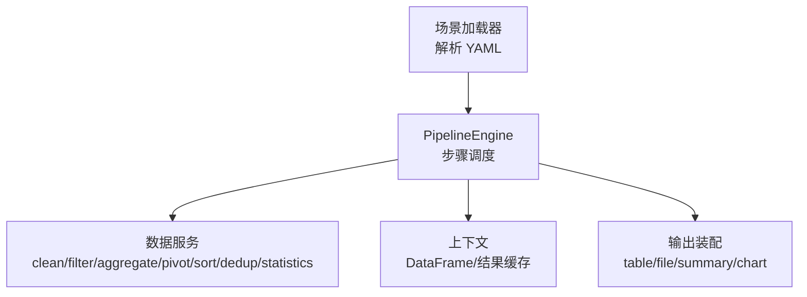
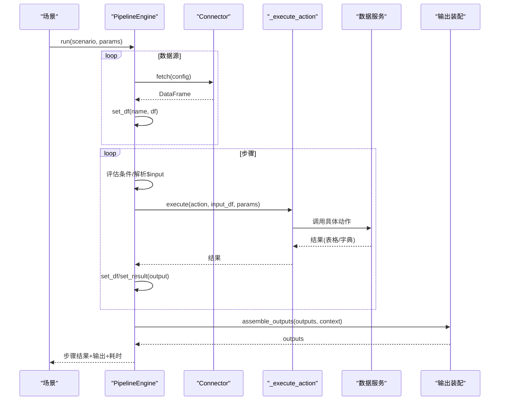
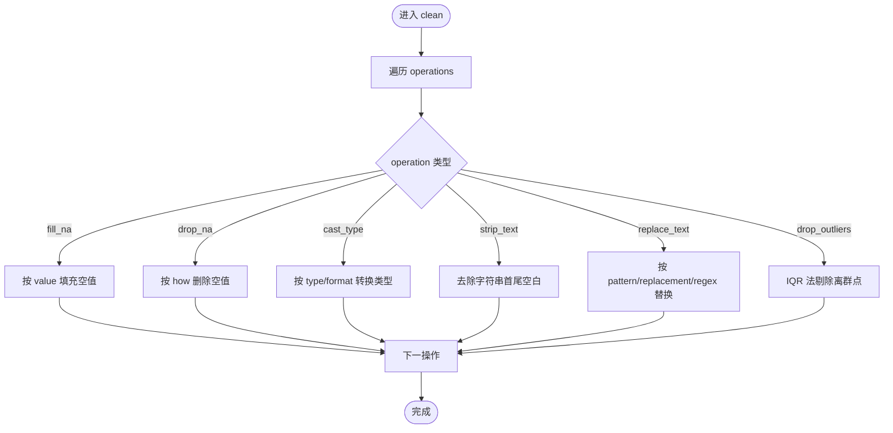
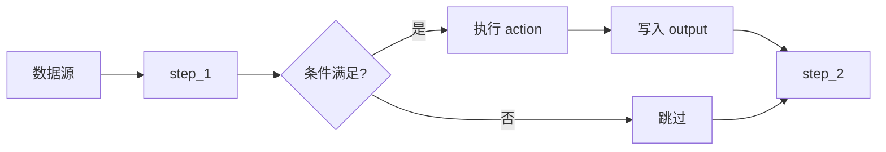

# 动作参考

<cite>
**本文引用的文件**
- [pipeline_engine.py](file://app/core/pipeline_engine.py)
- [data_service.py](file://app/services/data_service.py)
- [data_models.py](file://app/models/data_models.py)
- [scenario_loader.py](file://app/core/scenario_loader.py)
- [sample_analysis.yaml](file://app/scenarios/sample_analysis.yaml)
- [product_increment_analysis.yaml](file://app/scenarios/product_increment_analysis.yaml)
- [test_pipeline.py](file://tests/test_pipeline.py)
</cite>

## 目录
1. [简介](#简介)
2. [项目结构](#项目结构)
3. [核心组件](#核心组件)
4. [架构总览](#架构总览)
5. [详细动作说明](#详细动作说明)
6. [依赖关系与执行顺序](#依赖关系与执行顺序)
7. [性能考量](#性能考量)
8. [故障排查指南](#故障排查指南)
9. [结论](#结论)
10. [附录：YAML 配置示例](#附录yaml-配置示例)

## 简介
本参考文档面向 Pipeline 引擎的“动作（Action）”能力，系统梳理并说明所有内置动作类型、参数定义、取值范围、默认值、验证规则以及使用方法。重点覆盖 clean、sort、statistics、filter、aggregate（group_by）、pivot（pivot_table）等动作，并结合场景 YAML 给出可复用的配置思路与最佳实践。

## 项目结构
Pipeline 引擎由“场景加载器 + 引擎调度 + 数据处理服务”构成：
- 场景加载器负责解析 YAML 场景配置，生成数据源、步骤、输出等结构化模型。
- 引擎按步骤顺序执行 action，维护上下文中的 DataFrame 中间结果，处理条件、错误策略和耗时统计。
- 数据处理服务实现具体动作逻辑，包括清洗、筛选、聚合、透视、排序、去重、统计分析等。

图表来源
- [scenario_loader.py:19-56](file://app/core/scenario_loader.py#L19-L56)
- [pipeline_engine.py:249-357](file://app/core/pipeline_engine.py#L249-L357)
- [data_service.py:128-447](file://app/services/data_service.py#L128-L447)

章节来源
- [scenario_loader.py:19-56](file://app/core/scenario_loader.py#L19-L56)
- [pipeline_engine.py:249-357](file://app/core/pipeline_engine.py#L249-L357)

## 核心组件
- PipelineContext：保存输入参数、中间 DataFrame 与非 DataFrame 结果，提供 get/set 接口。
- _execute_action：根据 action 名称路由到对应服务函数，构造请求对象并返回结果。
- data_service.*：各动作的具体实现，包含参数校验、异常处理与结果序列化。
- ScenarioConfig/PipelineStepConfig：YAML 中 step 的结构化表示，含 name、action、input、params、output、on_error、condition。

章节来源
- [pipeline_engine.py:37-98](file://app/core/pipeline_engine.py#L37-L98)
- [pipeline_engine.py:131-234](file://app/core/pipeline_engine.py#L131-L234)
- [scenario_loader.py:21-56](file://app/core/scenario_loader.py#L21-L56)

## 架构总览
Pipeline 执行流程：
1. 加载数据源：根据 connector 类型读取数据，写入上下文。
2. 遍历步骤：评估条件、解析 $input 引用、获取输入 DataFrame、执行 action、存储输出。
3. 组装输出：将上下文中的数据或结果转换为 table/file/summary/chart 等输出。

图表来源
- [pipeline_engine.py:252-357](file://app/core/pipeline_engine.py#L252-L357)
- [data_service.py:128-447](file://app/services/data_service.py#L128-L447)

## 详细动作说明

### 通用约定
- 每个数据处理类 action 均需要输入 DataFrame；若未提供，将抛出步骤失败异常。
- 参数支持通过 $input.xxx 在 YAML 中引用外部参数，引擎会在执行前进行替换。
- 步骤可设置 on_error：abort（终止）或 skip（跳过继续）。
- 步骤可设置 condition：支持 has:ref 与 not_empty:ref 两种简单表达式。

章节来源
- [pipeline_engine.py:74-119](file://app/core/pipeline_engine.py#L74-L119)
- [pipeline_engine.py:131-234](file://app/core/pipeline_engine.py#L131-L234)
- [scenario_loader.py:28-36](file://app/core/scenario_loader.py#L28-L36)

### clean（数据清洗）
- 作用：对数据进行空值填充、删除空值、类型转换、文本清洗、文本替换、异常值过滤等操作。
- 参数：
  - operations：列表，每项为 CleanOperation，包含 operation、column、params。
  - operation 取值：fill_na、drop_na、cast_type、strip_text、replace_text、drop_outliers。
  - column：可选，部分操作必须指定列。
  - params：操作级参数，如 fill_na.value、drop_na.how、cast_type.type/format、replace_text.pattern/replacement/regex、drop_outliers.factor。
- 默认值与验证：
  - fill_na：value 默认 0；column 为空时全列填充。
  - drop_na：how 默认 any；subset 可为单列或空。
  - cast_type：必须指定 column；type 支持 int/int64/float/float64/str/string/datetime/bool 及自定义类型；datetime 可通过 format 指定格式。
  - strip_text：column 为空时对 object/string 列全部 strip。
  - replace_text：必须指定 column；pattern/replacement 默认空串；regex 默认 false。
  - drop_outliers：必须指定 column；factor 默认 1.5，基于 IQR 方法剔除离群点。
- 复杂度与性能：
  - 逐操作串行应用，时间复杂度近似 O(N×M)，N 为行数，M 为操作数；注意大表上多次类型转换与正则替换的性能开销。
- 错误处理：
  - 非法操作名、缺失必填列、类型转换失败会抛出参数校验或数据类型错误。

图表来源
- [data_service.py:300-395](file://app/services/data_service.py#L300-L395)

章节来源
- [data_service.py:300-395](file://app/services/data_service.py#L300-L395)
- [data_models.py:115-129](file://app/models/data_models.py#L115-L129)

### sort（排序）
- 作用：按一个或多个列排序，支持升序/降序。
- 参数：
  - sort_by：排序列名列表。
  - ascending：布尔或布尔列表，长度需与 sort_by 一致；默认 True。
- 默认值与验证：
  - 列不存在时会触发下游异常；建议在执行前确保列存在。
- 复杂度与性能：
  - 基于 Pandas sort_values，时间复杂度近似 O(N log N)。

章节来源
- [pipeline_engine.py:187-195](file://app/core/pipeline_engine.py#L187-L195)
- [data_service.py:277-284](file://app/services/data_service.py#L277-L284)
- [data_models.py:97-102](file://app/models/data_models.py#L97-L102)

### statistics（统计分析）
- 作用：描述性统计、相关性矩阵、频率分布。
- 参数：
  - stat_type：descriptive、correlation、frequency。
  - columns：目标列；为空时自动选择数值列（descriptive/correlation），frequency 至少需指定一列。
  - extra_params：额外参数，如 frequency.bins 默认 10。
- 默认值与验证：
  - descriptive：返回 describe() 结果，index 重命名为 stat。
  - correlation：至少需要 2 个数值列，否则报错。
  - frequency：数值列使用 cut 分箱，类别列直接计数；计算百分比列 percentage。
- 复杂度与性能：
  - describe/corr 均为 O(N×M)；frequency 分箱 O(N)。

章节来源
- [pipeline_engine.py:219-228](file://app/core/pipeline_engine.py#L219-L228)
- [data_service.py:400-447](file://app/services/data_service.py#L400-L447)
- [data_models.py:133-145](file://app/models/data_models.py#L133-L145)

### filter（筛选）
- 作用：按多条件筛选行，支持 and/or 组合。
- 参数：
  - conditions：FilterCondition 列表，包含 column、operator、value。
  - logic：and 或 or，默认 and。
- 运算符 operator 取值：eq、ne、gt、ge、lt、le、in、not_in、contains、startswith、endswith。
- 默认值与验证：
  - 列不存在或不支持的运算符会抛出参数校验错误。
- 复杂度与性能：
  - 构建掩码并合并，近似 O(N×K)，K 为条件数。

章节来源
- [pipeline_engine.py:151-162](file://app/core/pipeline_engine.py#L151-L162)
- [data_service.py:163-210](file://app/services/data_service.py#L163-L210)
- [data_models.py:57-69](file://app/models/data_models.py#L57-L69)

### group_by / aggregate（分组聚合）
- 作用：按一组列分组并对目标列进行聚合计算。
- 参数：
  - group_by：分组列列表。
  - agg_columns：聚合目标列列表。
  - agg_funcs：聚合函数列表，支持 sum、mean、count、min、max、median、std、var。
- 默认值与验证：
  - 不支持的聚合函数会抛出参数校验错误；执行失败会抛出数据类型错误。
- 复杂度与性能：
  - 基于 groupby().agg，近似 O(N×M)。

章节来源
- [pipeline_engine.py:164-173](file://app/core/pipeline_engine.py#L164-L173)
- [data_service.py:215-243](file://app/services/data_service.py#L215-L243)
- [data_models.py:73-82](file://app/models/data_models.py#L73-L82)

### pivot / pivot_table（透视表）
- 作用：将数据重塑为透视表，支持行索引、列展开、值列与聚合函数。
- 参数：
  - index：行索引列列表。
  - columns：列展开列列表。
  - values：值列列表。
  - agg_func：聚合函数，默认 sum。
- 默认值与验证：
  - 列不存在或数据不兼容会抛出数据类型错误；结果列名会被扁平化处理。
- 复杂度与性能：
  - 基于 pandas.pivot_table，复杂度取决于分组与聚合规模。

章节来源
- [pipeline_engine.py:175-185](file://app/core/pipeline_engine.py#L175-L185)
- [data_service.py:248-272](file://app/services/data_service.py#L248-L272)
- [data_models.py:86-93](file://app/models/data_models.py#L86-L93)

### query（SQL 查询）
- 作用：在内存 DuckDB 中对 DataFrame 执行 SQL 查询。
- 参数：
  - sql：SELECT 语句，表名为 df；仅允许 SELECT/WITH 开头。
  - table_name：虚拟表名，默认 df。
- 安全限制：
  - 禁止 INSERT/UPDATE/DELETE/DROP/CREATE/ALTER/TRUNCATE/EXEC/EXPORT/IMPORT 等危险关键字。
- 复杂度与性能：
  - 取决于 SQL 复杂度与数据规模。

章节来源
- [pipeline_engine.py:140-149](file://app/core/pipeline_engine.py#L140-L149)
- [data_service.py:122-158](file://app/services/data_service.py#L122-L158)

### dedup（去重）
- 作用：按指定列或全列去重，支持保留策略。
- 参数：
  - subset：去重依据列；为空则全列去重。
  - keep：first、last、false；默认 first。
- 默认值与验证：
  - keep 非合法值会被纠正为 first。
- 复杂度与性能：
  - 近似 O(N)。

章节来源
- [pipeline_engine.py:197-205](file://app/core/pipeline_engine.py#L197-L205)
- [data_service.py:289-295](file://app/services/data_service.py#L289-L295)
- [data_models.py:106-111](file://app/models/data_models.py#L106-L111)

## 依赖关系与执行顺序
- 数据依赖：
  - 每个步骤通过 input 字段引用上下文中的 DataFrame 名称；若无输入且 action 需要数据，将抛出步骤失败。
  - 步骤 output 可将结果写回上下文，供后续步骤使用。
- 执行顺序：
  - 严格按 YAML 中 pipeline 的顺序执行；条件不满足的步骤将被跳过。
- 错误策略：
  - on_error=abort：遇到异常立即终止整个流程。
  - on_error=skip：记录失败并继续执行后续步骤。
- 参数注入：
  - 支持 $input.xxx 在 YAML 中引用运行参数，引擎在执行前统一替换。

图表来源
- [pipeline_engine.py:266-349](file://app/core/pipeline_engine.py#L266-L349)
- [scenario_loader.py:28-36](file://app/core/scenario_loader.py#L28-L36)

章节来源
- [pipeline_engine.py:266-349](file://app/core/pipeline_engine.py#L266-L349)

## 性能考量
- 大数据集清洗：
  - 避免在循环中进行多次类型转换；尽量批量 cast_type。
  - 文本替换使用 regex 时谨慎，优先预编译或使用更简单的模式。
- 聚合与透视：
  - 合理选择 group_by 与 values 列数量，减少高基数分组带来的内存压力。
  - 透视表前可对列进行必要筛选与类型转换。
- 排序：
  - 多列排序时，ascending 列表长度应与 sort_by 一致，避免隐式广播导致意外行为。
- 统计：
  - frequency 分箱 bins 过大可能产生大量区间；根据数据分布调整。

[本节为通用指导，不直接分析具体文件]

## 故障排查指南
- 常见错误与定位：
  - “不支持的 action”：检查 YAML 中 action 名称是否拼写正确。
  - “需要输入数据”：确认 input 字段指向的 DataFrame 是否存在。
  - “列不存在”：检查列名是否与数据一致，必要时先做列映射或清洗。
  - “不支持的运算符/聚合函数”：核对 operator 与 agg_funcs 取值。
  - “SQL 安全限制”：仅允许 SELECT/WITH 开头的查询。
- 调试建议：
  - 使用 on_error=skip 逐步定位问题步骤。
  - 在关键步骤后增加 summary 输出，观察中间数据形态。
  - 利用测试用例快速验证端到端流程。

章节来源
- [pipeline_engine.py:131-234](file://app/core/pipeline_engine.py#L131-L234)
- [data_service.py:122-158](file://app/services/data_service.py#L122-L158)
- [data_service.py:163-210](file://app/services/data_service.py#L163-L210)
- [data_service.py:215-243](file://app/services/data_service.py#L215-L243)
- [data_service.py:248-272](file://app/services/data_service.py#L248-L272)
- [data_service.py:277-295](file://app/services/data_service.py#L277-L295)
- [data_service.py:300-395](file://app/services/data_service.py#L300-L395)
- [data_service.py:400-447](file://app/services/data_service.py#L400-L447)

## 结论
Pipeline 引擎提供了完整的数据处理动作集合，涵盖清洗、筛选、聚合、透视、排序、去重、统计与 SQL 查询。通过 YAML 场景配置，用户可以以声明式方式编排复杂的数据流水线，结合条件判断与错误策略，实现稳定可控的执行流程。建议在生产环境中合理使用参数校验、日志记录与输出摘要，以提升可观测性与可维护性。

[本节为总结，不直接分析具体文件]

## 附录：YAML 配置示例
以下示例展示如何在 YAML 中配置常用动作。请根据实际数据列名与业务需求调整参数。

- 清洗（clean）
  - 参考路径：[sample_analysis.yaml:20-30](file://app/scenarios/sample_analysis.yaml#L20-L30)
  - 要点：operations 中包含 fill_na、strip_text；可添加 cast_type、replace_text、drop_outliers 等。

- 排序（sort）
  - 参考路径：[sample_analysis.yaml:32-39](file://app/scenarios/sample_analysis.yaml#L32-L39)
  - 要点：sort_by 可使用 $input 引用动态列；ascending 控制升降序。

- 统计（statistics）
  - 参考路径：[sample_analysis.yaml:41-47](file://app/scenarios/sample_analysis.yaml#L41-L47)
  - 要点：stat_type 支持 descriptive；可指定 columns 与 extra_params（如 frequency.bins）。

- 筛选（filter）
  - 参考路径：[data_models.py:57-69](file://app/models/data_models.py#L57-L69)
  - 要点：conditions 数组，每个元素包含 column、operator、value；logic 支持 and/or。

- 分组聚合（aggregate/group_by）
  - 参考路径：[product_increment_analysis.yaml:67-86](file://app/scenarios/product_increment_analysis.yaml#L67-L86)
  - 要点：group_by、agg_columns、agg_funcs；支持多种聚合函数。

- 透视表（pivot/pivot_table）
  - 参考路径：[data_models.py:86-93](file://app/models/data_models.py#L86-L93)
  - 要点：index、columns、values、agg_func；用于行列重塑与汇总。

- 查询（query）
  - 参考路径：[product_increment_analysis.yaml:55-65](file://app/scenarios/product_increment_analysis.yaml#L55-L65)
  - 要点：sql 仅允许 SELECT/WITH；table_name 默认为 df。

- 去重（dedup）
  - 参考路径：[data_models.py:106-111](file://app/models/data_models.py#L106-L111)
  - 要点：subset 与 keep；常用于清理重复记录。

章节来源
- [sample_analysis.yaml:20-68](file://app/scenarios/sample_analysis.yaml#L20-L68)
- [product_increment_analysis.yaml:55-126](file://app/scenarios/product_increment_analysis.yaml#L55-L126)
- [data_models.py:57-111](file://app/models/data_models.py#L57-L111)