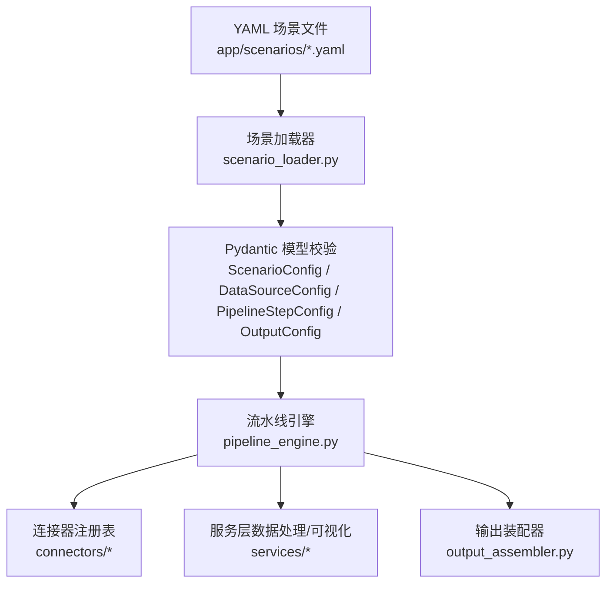
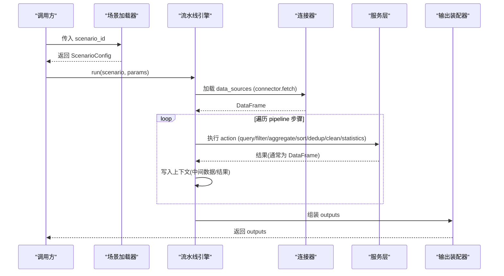
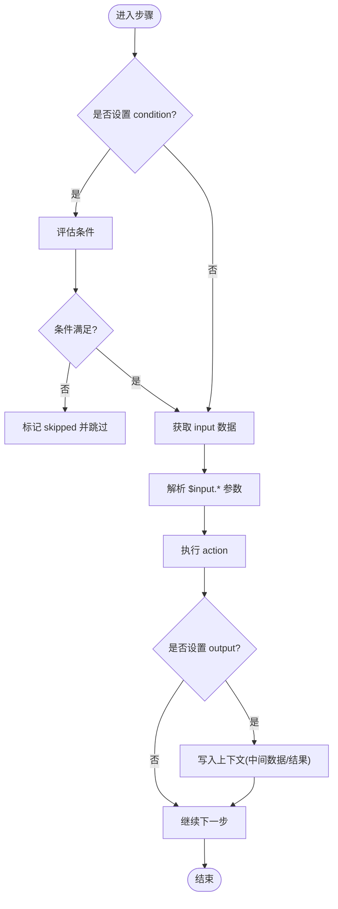
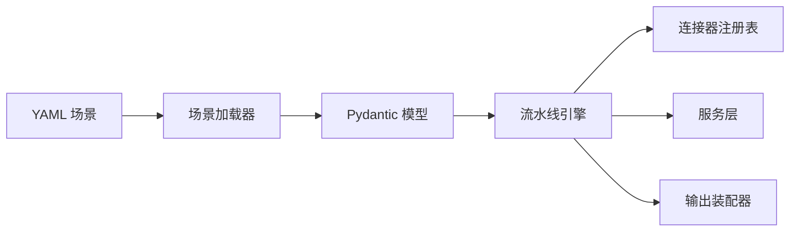
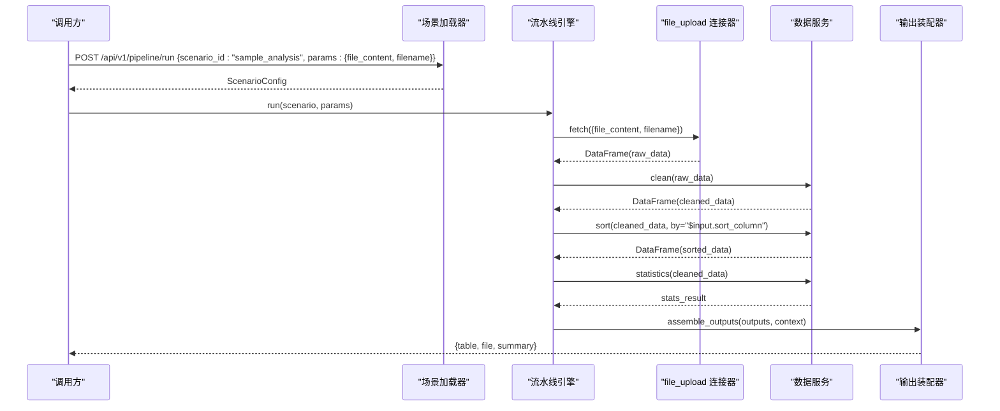

# 基础语法

<cite>
**本文引用的文件**
- [product_increment_analysis.yaml](file://app/scenarios/product_increment_analysis.yaml)
- [sample_analysis.yaml](file://app/scenarios/sample_analysis.yaml)
- [scenario_loader.py](file://app/core/scenario_loader.py)
- [pipeline_models.py](file://app/models/pipeline_models.py)
- [pipeline_engine.py](file://app/core/pipeline_engine.py)
- [base.py](file://app/core/connectors/base.py)
- [config.py](file://app/config.py)
</cite>

## 目录
1. [简介](#简介)
2. [项目结构](#项目结构)
3. [核心组件](#核心组件)
4. [架构总览](#架构总览)
5. [详细组件分析](#详细组件分析)
6. [依赖关系分析](#依赖关系分析)
7. [性能注意事项](#性能注意事项)
8. [故障排查指南](#故障排查指南)
9. [结论](#结论)
10. [附录：第一个可用的流水线配置示例](#附录第一个可用的流水线配置示例)

## 简介
本章节面向首次接触系统的用户，系统性地介绍 YAML 配置文件的基础语法与关键元素，包括数据源定义、Pipeline 步骤声明、输出配置等。通过两个真实场景的 YAML 示例，说明必填字段与可选字段的含义、数据类型要求，以及如何使用 scenario_id、name、description、version 等元数据字段组织可复用的分析流程。

## 项目结构
仓库中用于描述“场景”的 YAML 文件位于 scenarios 目录下；加载器负责读取并校验这些 YAML；引擎根据 YAML 编排执行数据连接、数据处理动作与输出组装。

图表来源
- [scenario_loader.py:68-105](file://app/core/scenario_loader.py#L68-L105)
- [pipeline_engine.py:249-357](file://app/core/pipeline_engine.py#L249-L357)
- [base.py:11-23](file://app/core/connectors/base.py#L11-L23)

章节来源
- [config.py:6-22](file://app/config.py#L6-L22)
- [scenario_loader.py:60-105](file://app/core/scenario_loader.py#L60-L105)

## 核心组件
- 场景配置模型：定义了 YAML 根节点及子结构的类型约束，确保配置的正确性与一致性。
- 数据源定义：描述如何从数据库、API、文件上传等连接器获取数据，支持参数映射。
- Pipeline 步骤：声明一系列有序的数据处理动作（查询、过滤、聚合、排序、去重、清洗、统计等），每个步骤可指定输入、参数、输出名称与错误处理策略。
- 输出配置：将中间结果以表格、文件、摘要或图表形式暴露给调用方。

章节来源
- [scenario_loader.py:21-55](file://app/core/scenario_loader.py#L21-L55)
- [pipeline_models.py:11-46](file://app/models/pipeline_models.py#L11-L46)

## 架构总览
下图展示了从 YAML 到执行的端到端流程：加载器解析并校验 YAML，引擎按顺序执行数据源加载与 Pipeline 步骤，最后组装输出。

图表来源
- [scenario_loader.py:68-105](file://app/core/scenario_loader.py#L68-L105)
- [pipeline_engine.py:249-357](file://app/core/pipeline_engine.py#L249-L357)
- [base.py:11-23](file://app/core/connectors/base.py#L11-L23)

## 详细组件分析

### 元数据字段：scenario_id、name、description、version
- scenario_id：字符串，唯一标识一个场景，对应 YAML 文件名（不含扩展名）。在请求中作为入口键。
- name：字符串，场景显示名称。
- description：字符串，场景用途说明，可为多行文本。
- version：字符串，场景版本，默认值由模型提供。

这些字段在加载时会被 Pydantic 模型校验，缺失或类型不符会抛出异常。

章节来源
- [scenario_loader.py:47-55](file://app/core/scenario_loader.py#L47-L55)
- [pipeline_models.py:11-14](file://app/models/pipeline_models.py#L11-L14)
- [product_increment_analysis.yaml:8-13](file://app/scenarios/product_increment_analysis.yaml#L8-L13)
- [sample_analysis.yaml:4-7](file://app/scenarios/sample_analysis.yaml#L4-L7)

### 数据源 data_sources：数组定义方式
- 结构：data_sources 为数组，每项包含 name、connector、config。
- connector：字符串，表示连接器类型，如 database、file_upload、api 等。
- config：字典，具体连接参数。不同连接器有不同的字段：
  - database：driver、path、sql 等。
  - file_upload：param_mapping 将 $input.xxx 映射到连接器参数。
- 参数映射：支持在 config 中使用 $input.key 引用上游传入的参数，引擎会在执行前进行替换。

章节来源
- [scenario_loader.py:21-26](file://app/core/scenario_loader.py#L21-L26)
- [pipeline_engine.py:74-97](file://app/core/pipeline_engine.py#L74-L97)
- [product_increment_analysis.yaml:18-48](file://app/scenarios/product_increment_analysis.yaml#L18-L48)
- [sample_analysis.yaml:10-17](file://app/scenarios/sample_analysis.yaml#L10-L17)

### Pipeline 步骤：基本结构与动作
- 基本字段：
  - name：步骤名称，必须。
  - action：动作类型，必须。支持的类型包括 query、filter、aggregate、pivot、sort、dedup、clean、statistics。
  - input：引用上一个步骤的输出或数据源名称，可选。
  - params：动作参数，字典，随 action 变化。
  - output：当前步骤的结果名称，可选。若存在且结果为 DataFrame，则写入上下文供后续步骤使用。
  - on_error：错误处理策略，可选，值为 skip 或 abort（默认 abort）。
  - condition：条件表达式，可选，支持 has:ref 与 not_empty:ref。
- 执行流程：
  - 若未提供 input，则尝试从上下文查找同名数据源或中间结果。
  - 参数中的 $input.* 会被解析为实际值。
  - 执行完成后，若设置了 output，则将结果存入上下文。

图表来源
- [pipeline_engine.py:274-349](file://app/core/pipeline_engine.py#L274-L349)

章节来源
- [scenario_loader.py:28-37](file://app/core/scenario_loader.py#L28-L37)
- [pipeline_engine.py:131-234](file://app/core/pipeline_engine.py#L131-L234)
- [product_increment_analysis.yaml:53-96](file://app/scenarios/product_increment_analysis.yaml#L53-L96)
- [sample_analysis.yaml:19-47](file://app/scenarios/sample_analysis.yaml#L19-L47)

### 输出 outputs：格式规范
- 结构：outputs 为数组，每项包含 name、type、source、config。
- type：输出类型，支持 table、file、summary、chart。
- source：引用上下文中的数据或结果名称。
- config：输出相关配置，例如：
  - table：title 等展示配置。
  - file：format 等导出格式。
  - summary：max_rows 等摘要行数限制。
- 引擎在执行完所有步骤后，调用输出装配器将 context 中的数据转换为最终输出。

章节来源
- [scenario_loader.py:39-45](file://app/core/scenario_loader.py#L39-L45)
- [pipeline_engine.py:351-353](file://app/core/pipeline_engine.py#L351-L353)
- [product_increment_analysis.yaml:101-126](file://app/scenarios/product_increment_analysis.yaml#L101-L126)
- [sample_analysis.yaml:50-68](file://app/scenarios/sample_analysis.yaml#L50-L68)

### 连接器与数据获取
- 抽象基类：BaseConnector 定义了 fetch(config) 接口，返回 pandas.DataFrame。
- 注册表：ConnectorRegistry 根据 connector 字符串选择具体实现。
- 常见连接器：
  - database：通过 SQL 查询数据库表。
  - file_upload：从上传的文件内容读取数据，支持 param_mapping。
  - api：通过 API 拉取数据（具体实现见 connectors/api_connector.py）。

章节来源
- [base.py:11-23](file://app/core/connectors/base.py#L11-L23)
- [pipeline_engine.py:266-272](file://app/core/pipeline_engine.py#L266-L272)
- [product_increment_analysis.yaml:20-48](file://app/scenarios/product_increment_analysis.yaml#L20-L48)
- [sample_analysis.yaml:11-17](file://app/scenarios/sample_analysis.yaml#L11-L17)

## 依赖关系分析
- YAML 文件依赖场景加载器进行解析与校验。
- 场景加载器依赖配置项（如 scenarios_dir）定位 YAML 目录。
- 引擎依赖连接器注册表与服务层完成数据获取与处理。
- 输出装配器依赖上下文中的中间结果生成最终输出。

图表来源
- [scenario_loader.py:60-105](file://app/core/scenario_loader.py#L60-L105)
- [pipeline_engine.py:249-357](file://app/core/pipeline_engine.py#L249-L357)

章节来源
- [config.py:6-22](file://app/config.py#L6-L22)
- [scenario_loader.py:60-105](file://app/core/scenario_loader.py#L60-L105)

## 性能注意事项
- 数据源加载阶段：SQL 查询应尽量精简列与行，避免全表扫描。
- 步骤执行阶段：合理选择 action，优先使用聚合与筛选减少数据量。
- 中间结果管理：仅在必要时设置 output，避免过多 DataFrame 驻留内存。
- 错误处理：对关键步骤使用 on_error=abort，快速失败；对非关键步骤使用 skip，提升鲁棒性。

[本节为通用指导，不直接分析具体文件]

## 故障排查指南
- 场景不存在：检查 scenario_id 是否与 YAML 文件名一致，确认 scenarios_dir 路径正确。
- YAML 解析失败：检查缩进、引号、特殊字符，确保根节点为字典。
- 数据源加载失败：核对 connector 类型与 config 字段，确认数据库路径、SQL 语句有效。
- 步骤执行失败：查看 action 所需参数是否完整，input 是否存在，$input.* 是否正确映射。
- 输出为空：确认 source 指向的上下文键是否存在，type 与 config 是否匹配。

章节来源
- [scenario_loader.py:68-105](file://app/core/scenario_loader.py#L68-L105)
- [pipeline_engine.py:317-349](file://app/core/pipeline_engine.py#L317-L349)

## 结论
YAML 场景配置通过清晰的元数据、数据源、Pipeline 步骤与输出定义，实现了可复用、可编排的分析流程。借助 Pydantic 模型校验与引擎的强类型处理，能够保证配置的准确性与执行的可控性。掌握基础语法与关键字段后，即可快速构建自己的分析流水线。

## 附录：第一个可用的流水线配置示例
以下以一个最小化的 CSV 上传与分析场景为例，演示如何创建第一个可用的流水线配置。该示例来自 sample_analysis.yaml，涵盖数据源、清洗、排序、统计与多种输出。

- 元数据
  - scenario_id：字符串，唯一标识场景。
  - name：字符串，场景名称。
  - description：字符串，简要说明。
  - version：字符串，版本号。
- 数据源
  - connector：file_upload。
  - config.param_mapping：将 $input.file_content 与 $input.filename 映射到连接器参数。
- Pipeline 步骤
  - clean：填充空值、去除文本空白。
  - sort：按指定列排序，支持升序/降序。
  - statistics：描述性统计。
- 输出
  - table：展示统计摘要。
  - file：导出 cleaned_data 为 csv。
  - summary：输出 cleaned_data 的摘要片段。

图表来源
- [sample_analysis.yaml:4-68](file://app/scenarios/sample_analysis.yaml#L4-L68)
- [pipeline_engine.py:249-357](file://app/core/pipeline_engine.py#L249-L357)

章节来源
- [sample_analysis.yaml:4-68](file://app/scenarios/sample_analysis.yaml#L4-L68)
- [pipeline_engine.py:74-97](file://app/core/pipeline_engine.py#L74-L97)
- [pipeline_engine.py:266-353](file://app/core/pipeline_engine.py#L266-L353)