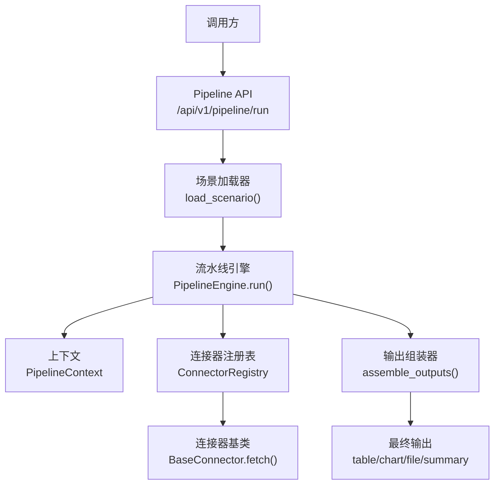
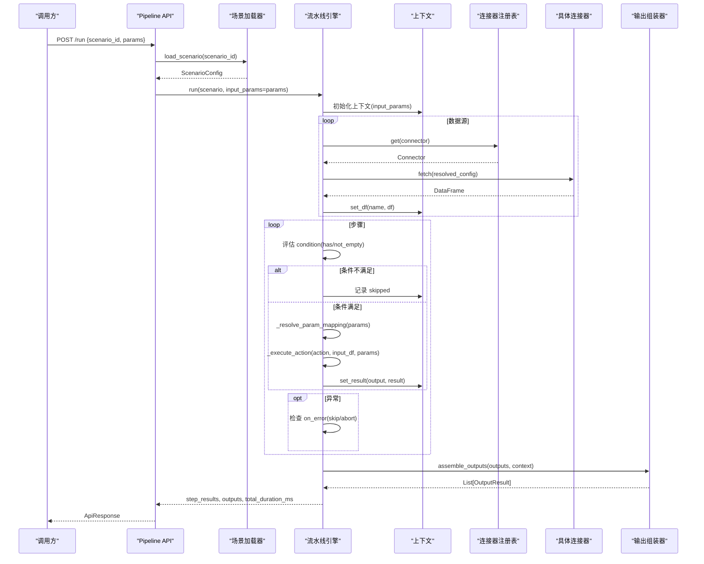
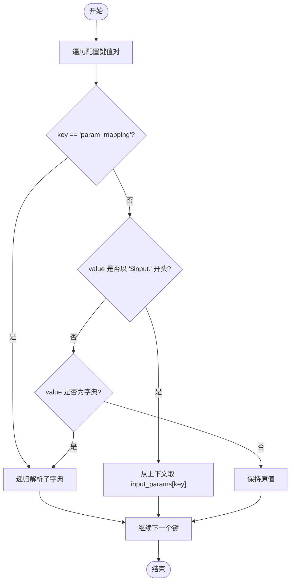
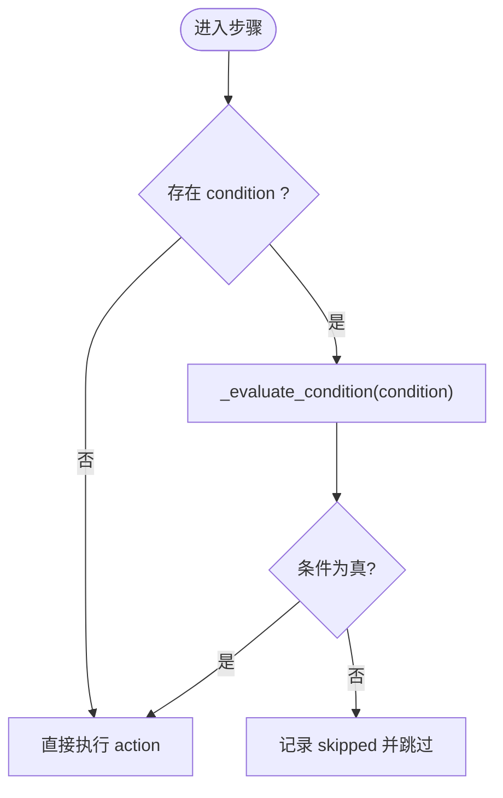
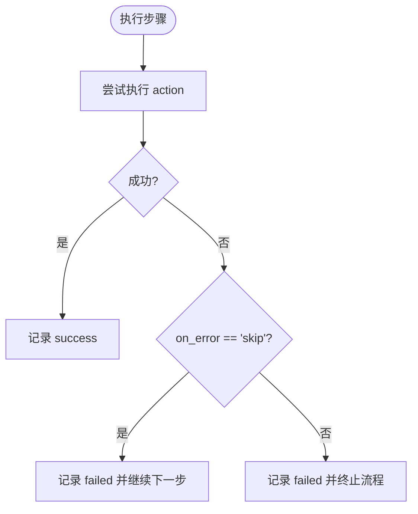
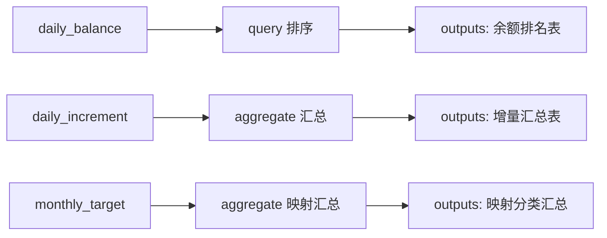
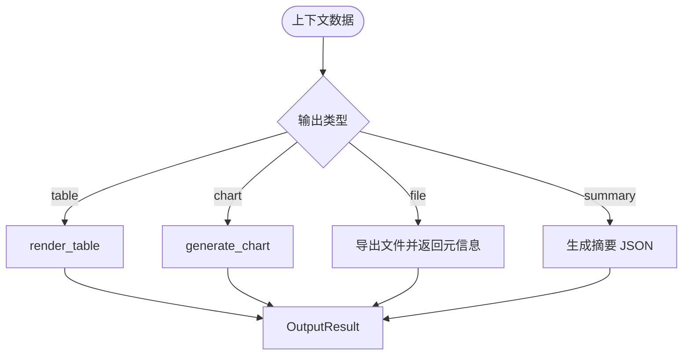
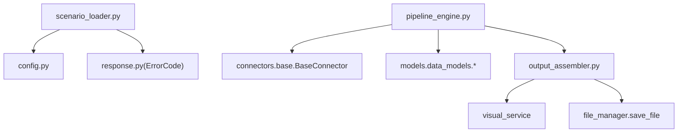

# 高级特性

<cite>
**本文引用的文件**
- [pipeline_engine.py](file://app/core/pipeline_engine.py)
- [scenario_loader.py](file://app/core/scenario_loader.py)
- [output_assembler.py](file://app/core/output_assembler.py)
- [base.py](file://app/core/connectors/base.py)
- [data_models.py](file://app/models/data_models.py)
- [pipeline_models.py](file://app/models/pipeline_models.py)
- [response.py](file://app/core/response.py)
- [product_increment_analysis.yaml](file://app/scenarios/product_increment_analysis.yaml)
- [sample_analysis.yaml](file://app/scenarios/sample_analysis.yaml)
- [pipeline.py](file://app/api/v1/pipeline.py)
</cite>

## 目录
1. [简介](#简介)
2. [项目结构](#项目结构)
3. [核心组件](#核心组件)
4. [架构总览](#架构总览)
5. [详细组件分析](#详细组件分析)
6. [依赖关系分析](#依赖关系分析)
7. [性能考量](#性能考量)
8. [故障排查指南](#故障排查指南)
9. [结论](#结论)
10. [附录](#附录)

## 简介
本章节聚焦 YAML 配置的高级特性，围绕以下主题展开：
- $input 引用机制：在数据源与步骤参数中动态注入运行时参数
- 条件表达式语法：has:、not_empty: 的分支控制
- 参数映射功能：param_mapping 与嵌套参数的递归解析
- 复杂业务场景技巧：动态参数传递、条件分支处理、错误恢复策略（on_error）
- 高级用法：on_error 选项、复杂 params 嵌套、多数据源关联与输出组装

## 项目结构
系统通过“场景 YAML + Pipeline 引擎 + 连接器 + 输出组装”的方式实现可编排的数据处理流程。YAML 定义数据源、步骤与输出；引擎负责加载、解析、执行与结果组装；连接器统一返回 DataFrame；输出组装器将中间结果渲染为表格、图表、文件或摘要。

**图示来源**
- [pipeline.py:14-38](file://app/api/v1/pipeline.py#L14-L38)
- [scenario_loader.py:68-105](file://app/core/scenario_loader.py#L68-L105)
- [pipeline_engine.py:249-356](file://app/core/pipeline_engine.py#L249-L356)
- [base.py:11-23](file://app/core/connectors/base.py#L11-L23)
- [output_assembler.py:19-38](file://app/core/output_assembler.py#L19-L38)

**章节来源**
- [pipeline.py:14-38](file://app/api/v1/pipeline.py#L14-L38)
- [scenario_loader.py:68-105](file://app/core/scenario_loader.py#L68-L105)
- [pipeline_engine.py:249-356](file://app/core/pipeline_engine.py#L249-L356)
- [base.py:11-23](file://app/core/connectors/base.py#L11-L23)
- [output_assembler.py:19-38](file://app/core/output_assembler.py#L19-L38)

## 核心组件
- 场景加载器：从 YAML 读取并校验场景配置，构建 ScenarioConfig
- 流水线引擎：按顺序执行数据源加载、步骤处理、输出组装，支持条件与错误处理
- 连接器抽象：统一 fetch 接口，返回 DataFrame
- 输出组装器：根据 outputs 配置生成 table/chart/file/summary
- 模型层：定义请求/响应与数据处理模型，保证类型安全

**章节来源**
- [scenario_loader.py:19-56](file://app/core/scenario_loader.py#L19-L56)
- [pipeline_engine.py:39-97](file://app/core/pipeline_engine.py#L39-L97)
- [base.py:11-23](file://app/core/connectors/base.py#L11-L23)
- [output_assembler.py:19-59](file://app/core/output_assembler.py#L19-L59)
- [data_models.py:13-145](file://app/models/data_models.py#L13-L145)
- [pipeline_models.py:11-46](file://app/models/pipeline_models.py#L11-L46)

## 架构总览
下图展示一次完整的 Pipeline 执行流程，包括 $input 解析、条件判断、动作执行与 on_error 策略。

**图示来源**
- [pipeline.py:14-38](file://app/api/v1/pipeline.py#L14-L38)
- [scenario_loader.py:68-105](file://app/core/scenario_loader.py#L68-L105)
- [pipeline_engine.py:249-356](file://app/core/pipeline_engine.py#L249-L356)
- [output_assembler.py:19-38](file://app/core/output_assembler.py#L19-L38)

## 详细组件分析

### $input 引用机制与参数映射
- 作用域：可用于数据源的 config 与 pipeline 步骤的 params
- 语法：字符串值以 "$input." 开头时，会被替换为输入参数中的同名值
- 递归解析：支持 param_mapping 子字典以及任意嵌套结构的递归替换
- 典型用法：
  - 数据源上传：file_upload 连接器通过 param_mapping 将 file_content、filename 映射到 $input.file_content、$input.filename
  - 步骤参数：sort_by 等数组字段可直接引用 $input.sort_column

**图示来源**
- [pipeline_engine.py:77-97](file://app/core/pipeline_engine.py#L77-L97)
- [sample_analysis.yaml:10-16](file://app/scenarios/sample_analysis.yaml#L10-L16)
- [sample_analysis.yaml:32-39](file://app/scenarios/sample_analysis.yaml#L32-L39)

**章节来源**
- [pipeline_engine.py:77-97](file://app/core/pipeline_engine.py#L77-L97)
- [sample_analysis.yaml:10-16](file://app/scenarios/sample_analysis.yaml#L10-L16)
- [sample_analysis.yaml:32-39](file://app/scenarios/sample_analysis.yaml#L32-L39)

### 条件表达式语法：has: 与 not_empty:
- has:ref — 检查上下文中是否存在名为 ref 的数据或结果
- not_empty:ref — 检查 ref 对应的 DataFrame 是否非空
- 使用位置：pipeline 步骤的 condition 字段
- 行为：条件不满足时，步骤状态记为 skipped，不影响后续步骤

**图示来源**
- [pipeline_engine.py:100-119](file://app/core/pipeline_engine.py#L100-L119)
- [pipeline_engine.py:274-288](file://app/core/pipeline_engine.py#L274-L288)

**章节来源**
- [pipeline_engine.py:100-119](file://app/core/pipeline_engine.py#L100-L119)
- [pipeline_engine.py:274-288](file://app/core/pipeline_engine.py#L274-L288)

### 错误恢复策略：on_error
- 取值：skip、abort（默认 abort）
- skip：记录失败并继续执行后续步骤
- abort：记录失败并立即终止整个流程，返回已执行的步骤结果
- 适用：关键步骤建议 abort，辅助步骤建议 skip

**图示来源**
- [pipeline_engine.py:317-349](file://app/core/pipeline_engine.py#L317-L349)
- [scenario_loader.py:28-36](file://app/core/scenario_loader.py#L28-L36)

**章节来源**
- [pipeline_engine.py:317-349](file://app/core/pipeline_engine.py#L317-L349)
- [scenario_loader.py:28-36](file://app/core/scenario_loader.py#L28-L36)

### 复杂 params 嵌套结构与多数据源关联
- 嵌套结构：operations、conditions、agg_columns 等列表/字典均可包含 $input 引用
- 多数据源：data_sources 可定义多个数据源，步骤通过 input 字段引用前一步的输出名
- 示例：
  - sample_analysis：file_upload 数据源通过 param_mapping 注入 $input.file_content、$input.filename；clean -> sort -> statistics 串联
  - product_increment_analysis：三个数据库数据源，分别进行查询、聚合、统计，并通过 outputs 输出表格与摘要

**图示来源**
- [product_increment_analysis.yaml:18-48](file://app/scenarios/product_increment_analysis.yaml#L18-L48)
- [product_increment_analysis.yaml:53-96](file://app/scenarios/product_increment_analysis.yaml#L53-L96)
- [product_increment_analysis.yaml:101-126](file://app/scenarios/product_increment_analysis.yaml#L101-L126)

**章节来源**
- [product_increment_analysis.yaml:18-48](file://app/scenarios/product_increment_analysis.yaml#L18-L48)
- [product_increment_analysis.yaml:53-96](file://app/scenarios/product_increment_analysis.yaml#L53-L96)
- [product_increment_analysis.yaml:101-126](file://app/scenarios/product_increment_analysis.yaml#L101-L126)

### 输出组装与摘要
- 类型：table、chart、file、summary
- summary：专为 Agent 设计的简洁 JSON 摘要，包含行数、列数、数据类型、数值列统计与前 N 行预览
- 文件导出：支持 csv/xlsx/json，并返回下载链接与行列计数

**图示来源**
- [output_assembler.py:19-59](file://app/core/output_assembler.py#L19-L59)
- [output_assembler.py:62-189](file://app/core/output_assembler.py#L62-L189)

**章节来源**
- [output_assembler.py:19-59](file://app/core/output_assembler.py#L19-L59)
- [output_assembler.py:62-189](file://app/core/output_assembler.py#L62-L189)

## 依赖关系分析
- 场景加载器依赖配置与错误码，负责 YAML 解析与 Pydantic 校验
- 流水线引擎依赖连接器注册表、数据服务、可视化服务与输出组装器
- 连接器基于抽象基类，确保统一接口
- 模型层提供强类型约束，避免运行时错误

**图示来源**
- [scenario_loader.py:68-105](file://app/core/scenario_loader.py#L68-L105)
- [pipeline_engine.py:12-32](file://app/core/pipeline_engine.py#L12-L32)
- [output_assembler.py:1-18](file://app/core/output_assembler.py#L1-L18)

**章节来源**
- [scenario_loader.py:68-105](file://app/core/scenario_loader.py#L68-L105)
- [pipeline_engine.py:12-32](file://app/core/pipeline_engine.py#L12-L32)
- [output_assembler.py:1-18](file://app/core/output_assembler.py#L1-L18)

## 性能考量
- 数据源加载：优先在 SQL 层过滤与投影，减少内存占用
- 步骤执行：action 内部尽量使用向量化操作（如 pandas/DuckDB），避免逐行循环
- 输出组装：summary 限制预览行数，避免大表序列化开销
- 日志与耗时：每步记录 duration_ms，便于定位瓶颈

[本节为通用指导，不直接分析具体文件]

## 故障排查指南
- 常见错误码：
  - SCENARIO_NOT_FOUND：场景不存在或 YAML 解析失败
  - PIPELINE_STEP_FAILED：步骤执行失败（如缺少输入数据、不支持的 action）
  - CONNECTOR_ERROR：连接器连接或数据获取失败
- 排查要点：
  - 检查 YAML 结构是否符合模型定义
  - 确认 $input 引用键名与传入 params 一致
  - 验证 condition 的 has/not_empty 目标是否存在且非空
  - 根据 on_error 策略判断是否应改为 skip 或保留 abort
  - 查看步骤级 message 与日志定位问题

**章节来源**
- [response.py:12-68](file://app/core/response.py#L12-L68)
- [pipeline_engine.py:317-349](file://app/core/pipeline_engine.py#L317-L349)
- [scenario_loader.py:68-105](file://app/core/scenario_loader.py#L68-L105)

## 结论
该方案通过 YAML 声明式配置实现了灵活、可维护的数据处理流水线。$input 引用与条件表达式提供了强大的动态能力；on_error 策略保障了流程的健壮性；多数据源与复杂 params 嵌套支撑了丰富的业务场景。结合输出组装器，可快速生成面向人类与 Agent 的多形态结果。

[本节为总结性内容，不直接分析具体文件]

## 附录

### 实际业务案例与最佳实践
- 动态参数传递
  - 使用 $input 在数据源与步骤参数中注入运行时值，避免硬编码
  - 推荐在 data_sources.config.param_mapping 中集中映射，提高可读性
- 条件分支处理
  - 使用 has: 检查上游数据是否存在，避免无效计算
  - 使用 not_empty: 确保数据量满足后续处理要求
- 错误恢复策略
  - 关键步骤设置 on_error: abort，防止错误扩散
  - 辅助步骤设置 on_error: skip，提升容错性
- 复杂 params 嵌套
  - 将 operations、conditions、group_by 等结构化配置，便于复用与测试
- 多数据源关联
  - 通过 input 字段引用前一步输出名，形成清晰的数据流图
  - 在 outputs 中按需选择 table/chart/file/summary，满足不同消费方需求

**章节来源**
- [sample_analysis.yaml:10-47](file://app/scenarios/sample_analysis.yaml#L10-L47)
- [product_increment_analysis.yaml:18-96](file://app/scenarios/product_increment_analysis.yaml#L18-L96)
- [pipeline_engine.py:77-119](file://app/core/pipeline_engine.py#L77-L119)
- [pipeline_engine.py:274-349](file://app/core/pipeline_engine.py#L274-L349)