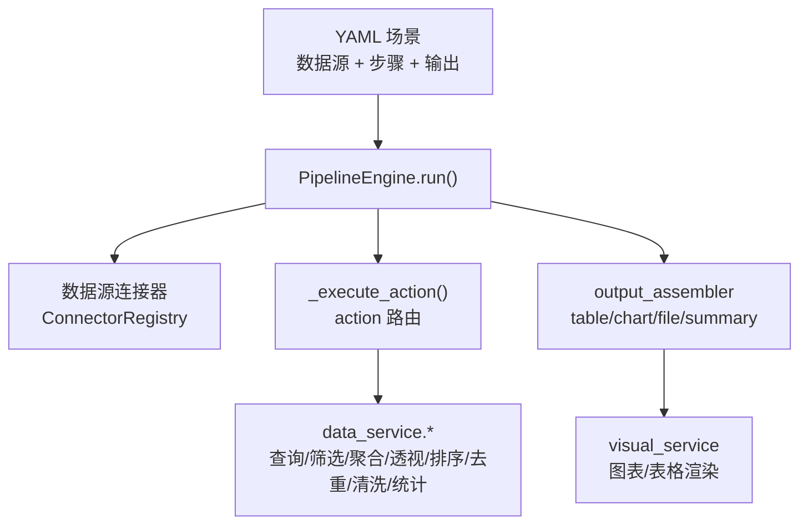
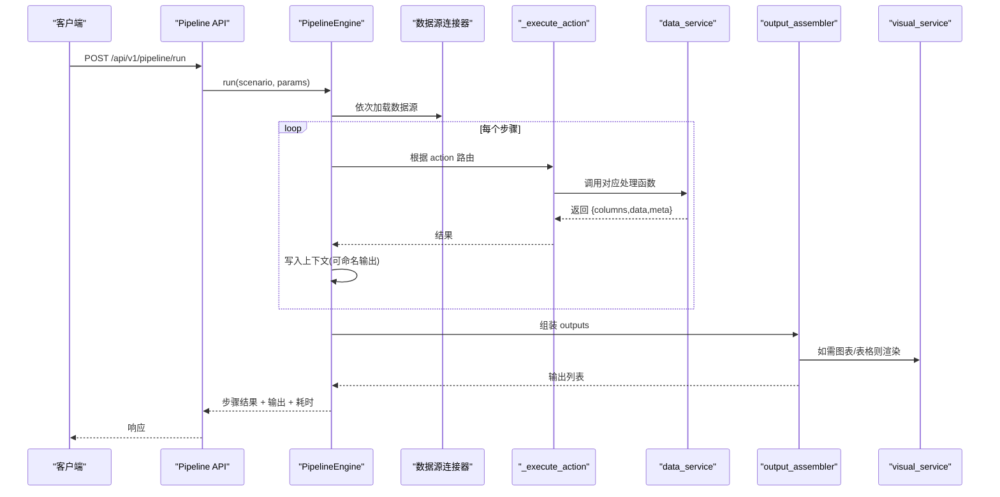
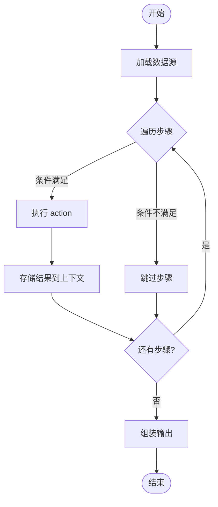

# 内置动作

<cite>
**本文引用的文件**
- [pipeline_engine.py](file://app/core/pipeline_engine.py)
- [data_service.py](file://app/services/data_service.py)
- [visual_service.py](file://app/services/visual_service.py)
- [output_assembler.py](file://app/core/output_assembler.py)
- [data_models.py](file://app/models/data_models.py)
- [visual_models.py](file://app/models/visual_models.py)
- [pipeline_models.py](file://app/models/pipeline_models.py)
- [pipeline.py](file://app/api/v1/pipeline.py)
- [product_increment_analysis.yaml](file://app/scenarios/product_increment_analysis.yaml)
- [sample_analysis.yaml](file://app/scenarios/sample_analysis.yaml)
</cite>

## 目录
1. [简介](#简介)
2. [项目结构](#项目结构)
3. [核心组件](#核心组件)
4. [架构总览](#架构总览)
5. [详细动作说明](#详细动作说明)
6. [依赖关系与执行顺序](#依赖关系与执行顺序)
7. [性能考虑](#性能考虑)
8. [故障排查指南](#故障排查指南)
9. [结论](#结论)
10. [附录：参数与返回值速查](#附录参数与返回值速查)

## 简介
本文件系统性介绍流水线引擎支持的所有内置动作类型，覆盖数据处理类动作（query、filter、aggregate、pivot、sort、dedup、clean、statistics）以及可视化动作。对每个动作提供功能说明、参数配置、使用方法、返回值格式、使用示例路径和注意事项，并解释动作间的依赖关系与执行顺序要求。

## 项目结构
- 场景驱动：通过 YAML 场景定义数据源、Pipeline 步骤与输出；引擎按顺序加载数据源、执行步骤、组装输出。
- 动作路由：引擎根据 action 名称将请求分发到对应服务函数，统一返回 DataFrame 风格的字典结果。
- 可视化：图表与表格渲染由独立服务完成，可在 Pipeline 输出阶段自动调用。

**图示来源**
- [pipeline_engine.py:249-356](file://app/core/pipeline_engine.py#L249-L356)
- [data_service.py:128-447](file://app/services/data_service.py#L128-L447)
- [output_assembler.py:78-119](file://app/core/output_assembler.py#L78-L119)
- [visual_service.py:51-205](file://app/services/visual_service.py#L51-L205)

**章节来源**
- [pipeline_engine.py:249-356](file://app/core/pipeline_engine.py#L249-L356)
- [pipeline.py:14-38](file://app/api/v1/pipeline.py#L14-L38)

## 核心组件
- PipelineContext：维护中间 DataFrame 与结果，供后续步骤引用。
- _execute_action：根据 action 名称路由到具体处理函数，构造请求对象并调用 data_service。
- data_service：实现所有数据处理动作的核心逻辑，统一输入输出为 DataFrameInput/输出字典。
- visual_service：生成图表（PNG/SVG/HTML）与 HTML 表格，支持条件样式与排序。
- output_assembler：在 Pipeline 结束时按 outputs 配置生成最终输出（table/chart/file/summary）。

**章节来源**
- [pipeline_engine.py:37-97](file://app/core/pipeline_engine.py#L37-L97)
- [pipeline_engine.py:131-234](file://app/core/pipeline_engine.py#L131-L234)
- [data_service.py:35-72](file://app/services/data_service.py#L35-L72)
- [visual_service.py:51-205](file://app/services/visual_service.py#L51-L205)
- [output_assembler.py:78-119](file://app/core/output_assembler.py#L78-L119)

## 架构总览

**图示来源**
- [pipeline.py:14-38](file://app/api/v1/pipeline.py#L14-L38)
- [pipeline_engine.py:249-356](file://app/core/pipeline_engine.py#L249-L356)
- [output_assembler.py:78-119](file://app/core/output_assembler.py#L78-L119)
- [visual_service.py:51-205](file://app/services/visual_service.py#L51-L205)

## 详细动作说明

### 通用约定
- 输入：大多数数据处理动作接收上游步骤输出的 DataFrame（通过 context 的 input 字段引用），或从数据源直接读取。
- 输出：统一返回包含 columns、data、meta 的字典；若步骤声明了 output 名称，引擎会将其转回 DataFrame 存入上下文，便于后续步骤引用。
- 错误：参数校验失败、列不存在、SQL 非法等会抛出应用异常，可通过 on_error 控制跳过或中止。

#### query（SQL 查询）
- 功能：基于 DuckDB 在内存中注册虚拟表，执行 SELECT/WITH 查询。
- 关键参数
  - sql：SELECT 语句，默认表名为 df。
  - table_name：虚拟表名，默认 df。
- 行为与安全
  - 仅允许 SELECT/WITH 开头；拦截危险关键字。
  - 表名可自定义，避免注入风险。
- 返回值：{columns, data, meta}。
- 使用示例路径
  - [product_increment_analysis.yaml:55-65](file://app/scenarios/product_increment_analysis.yaml#L55-L65)
- 依赖与顺序
  - 需要上游已存在 DataFrame（input 指向的数据源或前一步输出）。
  - 常用于过滤、投影、排序前的数据准备。

**章节来源**
- [pipeline_engine.py:139-149](file://app/core/pipeline_engine.py#L139-L149)
- [data_service.py:128-158](file://app/services/data_service.py#L128-L158)
- [product_increment_analysis.yaml:55-65](file://app/scenarios/product_increment_analysis.yaml#L55-L65)

#### filter（条件筛选）
- 功能：按多条件组合筛选行，支持 and/or 逻辑。
- 关键参数
  - conditions：条件列表，每项含 column、operator、value。
  - logic：and 或 or。
- 运算符
  - eq, ne, gt, ge, lt, le, in, not_in, contains, startswith, endswith。
- 返回值：{columns, data, meta}。
- 使用示例路径
  - 参考模型定义与映射位置：[data_models.py:57-69](file://app/models/data_models.py#L57-L69)
- 依赖与顺序
  - 需要输入 DataFrame；通常放在 clean 之后、aggregate/pivot 之前。

**章节来源**
- [pipeline_engine.py:151-162](file://app/core/pipeline_engine.py#L151-L162)
- [data_service.py:178-210](file://app/services/data_service.py#L178-L210)
- [data_models.py:57-69](file://app/models/data_models.py#L57-L69)

#### aggregate（分组聚合）
- 功能：按一组列分组并对目标列进行聚合计算。
- 关键参数
  - group_by：分组列。
  - agg_columns：聚合目标列。
  - agg_funcs：聚合函数列表，支持 sum, mean, count, min, max, median, std, var。
- 返回值：{columns, data, meta}，列名扁平化为“列_函数”。
- 使用示例路径
  - [product_increment_analysis.yaml:67-87](file://app/scenarios/product_increment_analysis.yaml#L67-L87)
- 依赖与顺序
  - 需要输入 DataFrame；常接在 filter/query 之后。

**章节来源**
- [pipeline_engine.py:164-173](file://app/core/pipeline_engine.py#L164-L173)
- [data_service.py:218-243](file://app/services/data_service.py#L218-L243)
- [product_increment_analysis.yaml:67-87](file://app/scenarios/product_increment_analysis.yaml#L67-L87)

#### pivot（透视表）
- 功能：将数据重塑为二维透视表，支持聚合函数。
- 关键参数
  - index：行索引列。
  - columns：列展开列。
  - values：值列。
  - agg_func：聚合函数，默认 sum。
- 返回值：{columns, data, meta}，MultiIndex 列会被扁平化。
- 使用示例路径
  - 路由与模型定义：[data.py:169-172](file://app/api/v1/data.py#L169-L172), [data_models.py:86-93](file://app/models/data_models.py#L86-L93)
- 依赖与顺序
  - 需要输入 DataFrame；通常在聚合或清洗后进行。

**章节来源**
- [pipeline_engine.py:175-185](file://app/core/pipeline_engine.py#L175-L185)
- [data_service.py:248-272](file://app/services/data_service.py#L248-L272)
- [data_models.py:86-93](file://app/models/data_models.py#L86-L93)

#### sort（排序）
- 功能：按指定列排序，支持升序/降序或多列排序。
- 关键参数
  - sort_by：排序列列表。
  - ascending：布尔或布尔列表，表示每列是否升序。
- 返回值：{columns, data, meta}。
- 使用示例路径
  - [sample_analysis.yaml:32-39](file://app/scenarios/sample_analysis.yaml#L32-L39)
- 依赖与顺序
  - 需要输入 DataFrame；常用于展示前排序。

**章节来源**
- [pipeline_engine.py:187-195](file://app/core/pipeline_engine.py#L187-L195)
- [data_service.py:277-284](file://app/services/data_service.py#L277-L284)
- [sample_analysis.yaml:32-39](file://app/scenarios/sample_analysis.yaml#L32-L39)

#### dedup（去重）
- 功能：去除重复行，支持按子集列去重与保留策略。
- 关键参数
  - subset：去重依据列，为空则全列。
  - keep：first/last/false。
- 返回值：{columns, data, meta}。
- 使用示例路径
  - 路由与模型定义：[data.py:182-186](file://app/api/v1/data.py#L182-L186), [data_models.py:106-111](file://app/models/data_models.py#L106-L111)
- 依赖与顺序
  - 需要输入 DataFrame；建议在清洗后、分析前执行。

**章节来源**
- [pipeline_engine.py:197-205](file://app/core/pipeline_engine.py#L197-L205)
- [data_service.py:289-295](file://app/services/data_service.py#L289-L295)
- [data_models.py:106-111](file://app/models/data_models.py#L106-L111)

#### clean（数据清洗）
- 功能：批量执行清洗操作，包括空值填充/删除、类型转换、文本清洗、替换、异常值剔除等。
- 关键参数
  - operations：操作列表，每项含 operation、column、params。
  - 支持的操作
    - fill_na：填充空值，可选 value。
    - drop_na：删除空值，可选 how=any/all。
    - cast_type：类型转换，type 支持 int/float/str/datetime/bool 等。
    - strip_text：去除字符串两端空白。
    - replace_text：正则或字面量替换。
    - drop_outliers：基于 IQR 剔除数值异常值，可配 factor。
- 返回值：{columns, data, meta}。
- 使用示例路径
  - [sample_analysis.yaml:20-30](file://app/scenarios/sample_analysis.yaml#L20-L30)
- 依赖与顺序
  - 需要输入 DataFrame；建议作为早期步骤，确保后续分析数据质量。

**章节来源**
- [pipeline_engine.py:207-217](file://app/core/pipeline_engine.py#L207-L217)
- [data_service.py:300-395](file://app/services/data_service.py#L300-L395)
- [data_models.py:115-129](file://app/models/data_models.py#L115-L129)
- [sample_analysis.yaml:20-30](file://app/scenarios/sample_analysis.yaml#L20-L30)

#### statistics（统计分析）
- 功能：描述性统计、相关性矩阵、频率分布。
- 关键参数
  - stat_type：descriptive/correlation/frequency。
  - columns：目标列，为空时自动选择数值列（除 frequency 需至少一列）。
  - params：额外参数，如 frequency 的 bins。
- 返回值：{columns, data, meta}。
- 使用示例路径
  - [product_increment_analysis.yaml:89-96](file://app/scenarios/product_increment_analysis.yaml#L89-L96)
  - [sample_analysis.yaml:41-47](file://app/scenarios/sample_analysis.yaml#L41-L47)
- 依赖与顺序
  - 需要输入 DataFrame；适合在清洗后、可视化前使用。

**章节来源**
- [pipeline_engine.py:219-228](file://app/core/pipeline_engine.py#L219-L228)
- [data_service.py:400-446](file://app/services/data_service.py#L400-L446)
- [product_increment_analysis.yaml:89-96](file://app/scenarios/product_increment_analysis.yaml#L89-L96)
- [sample_analysis.yaml:41-47](file://app/scenarios/sample_analysis.yaml#L41-L47)

#### 可视化动作（chart/table）
- 功能：在 Pipeline 输出阶段，根据 outputs 配置生成图表或表格。
- 图表类型
  - bar、line、pie、scatter、heatmap、radar、area、histogram、box。
- 输出格式
  - png（base64）、svg（SVG 文本）、html（交互式 Plotly）。
- 表格能力
  - 标题、排序、最大行数、条件样式、列宽、显示索引。
- 使用示例路径
  - 图表输出装配：[output_assembler.py:83-115](file://app/core/output_assembler.py#L83-L115)
  - 表格渲染：[visual_service.py:333-401](file://app/services/visual_service.py#L333-L401)
  - 场景中的 table/summary 输出：[product_increment_analysis.yaml:101-126](file://app/scenarios/product_increment_analysis.yaml#L101-L126)
- 依赖与顺序
  - 依赖上游步骤产生的 DataFrame；在 Pipeline 末尾统一产出。

**章节来源**
- [output_assembler.py:83-115](file://app/core/output_assembler.py#L83-L115)
- [visual_service.py:51-205](file://app/services/visual_service.py#L51-L205)
- [visual_service.py:333-401](file://app/services/visual_service.py#L333-L401)
- [product_increment_analysis.yaml:101-126](file://app/scenarios/product_increment_analysis.yaml#L101-L126)

## 依赖关系与执行顺序
- 数据依赖
  - 每个动作通过 input 字段引用上下文中的 DataFrame；若无 input，则无法执行（部分动作会报错）。
  - 步骤可将结果写入上下文（output），供后续步骤引用，形成有向无环图。
- 典型顺序
  - clean → filter → aggregate/pivot → sort → statistics → chart/table。
- 条件执行
  - 支持 condition 表达式（has:/not_empty:），不满足则跳过该步骤。
- 错误处理
  - on_error 支持 skip（继续）与 abort（终止流程）。

**图示来源**
- [pipeline_engine.py:266-356](file://app/core/pipeline_engine.py#L266-L356)

**章节来源**
- [pipeline_engine.py:266-356](file://app/core/pipeline_engine.py#L266-L356)

## 性能考虑
- SQL 查询在内存 DuckDB 中执行，避免外部数据库压力；注意 SQL 复杂度与数据规模。
- 聚合与透视在大表上可能产生较多中间列，建议先 filter/clean 减少数据量。
- 可视化渲染 PNG/SVG 会占用内存，HTML 交互图体积更大；按需选择输出格式。
- 批量清洗操作链式执行，尽量合并同类操作以减少多次 DataFrame 拷贝。

## 故障排查指南
- 常见错误
  - 不支持的 action：检查 YAML 中 action 名称拼写。
  - 列不存在：确认 column 名称与数据一致。
  - SQL 非法：仅允许 SELECT/WITH；避免危险关键字。
  - 数据类型错误：cast_type 或聚合函数与列类型不匹配。
- 定位方法
  - 查看步骤结果 status 与 message。
  - 检查 on_error 策略，必要时改为 abort 快速失败。
  - 逐步缩小范围：在 YAML 中增加临时步骤验证中间结果。

**章节来源**
- [pipeline_engine.py:317-349](file://app/core/pipeline_engine.py#L317-L349)
- [data_service.py:128-158](file://app/services/data_service.py#L128-L158)
- [data_service.py:218-243](file://app/services/data_service.py#L218-L243)
- [data_service.py:300-395](file://app/services/data_service.py#L300-L395)

## 结论
本引擎以 YAML 场景驱动，提供统一的内置动作集合，覆盖数据获取、清洗、变换、分析与可视化全流程。通过上下文传递与输出装配，用户可灵活编排复杂分析流程，并以表格、图表、文件或摘要形式交付结果。遵循推荐执行顺序与错误处理策略，可获得稳定高效的流水线体验。

## 附录：参数与返回值速查
- query
  - 参数：sql, table_name
  - 返回：{columns, data, meta}
  - 示例：[product_increment_analysis.yaml:55-65](file://app/scenarios/product_increment_analysis.yaml#L55-L65)
- filter
  - 参数：conditions[], logic
  - 返回：{columns, data, meta}
  - 模型：[data_models.py:57-69](file://app/models/data_models.py#L57-L69)
- aggregate
  - 参数：group_by[], agg_columns[], agg_funcs[]
  - 返回：{columns, data, meta}
  - 示例：[product_increment_analysis.yaml:67-87](file://app/scenarios/product_increment_analysis.yaml#L67-L87)
- pivot
  - 参数：index[], columns[], values[], agg_func
  - 返回：{columns, data, meta}
  - 模型：[data_models.py:86-93](file://app/models/data_models.py#L86-L93)
- sort
  - 参数：sort_by[], ascending
  - 返回：{columns, data, meta}
  - 示例：[sample_analysis.yaml:32-39](file://app/scenarios/sample_analysis.yaml#L32-L39)
- dedup
  - 参数：subset[], keep
  - 返回：{columns, data, meta}
  - 模型：[data_models.py:106-111](file://app/models/data_models.py#L106-L111)
- clean
  - 参数：operations[{operation, column, params}]
  - 返回：{columns, data, meta}
  - 示例：[sample_analysis.yaml:20-30](file://app/scenarios/sample_analysis.yaml#L20-L30)
- statistics
  - 参数：stat_type, columns[], params
  - 返回：{columns, data, meta}
  - 示例：[product_increment_analysis.yaml:89-96](file://app/scenarios/product_increment_analysis.yaml#L89-L96)
- 可视化（chart/table）
  - 图表类型：bar/line/pie/scatter/heatmap/radar/area/histogram/box
  - 输出格式：png/svg/html
  - 表格能力：title/sort/max_rows/conditional_styles/column_widths/show_index
  - 装配入口：[output_assembler.py:83-115](file://app/core/output_assembler.py#L83-L115)
  - 渲染实现：[visual_service.py:51-205](file://app/services/visual_service.py#L51-L205), [visual_service.py:333-401](file://app/services/visual_service.py#L333-L401)