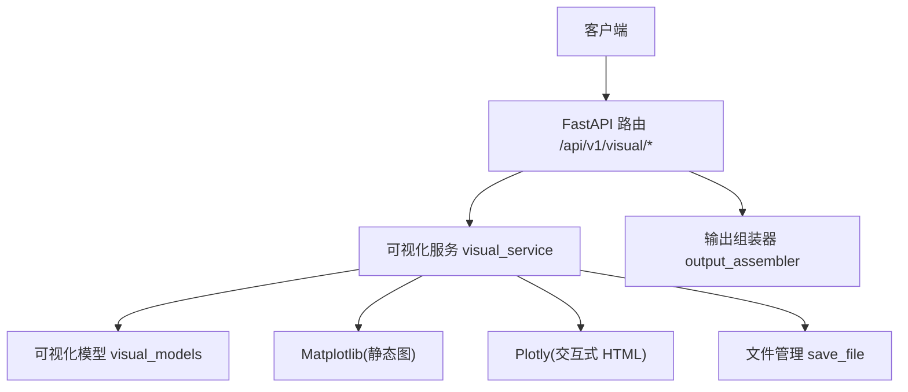
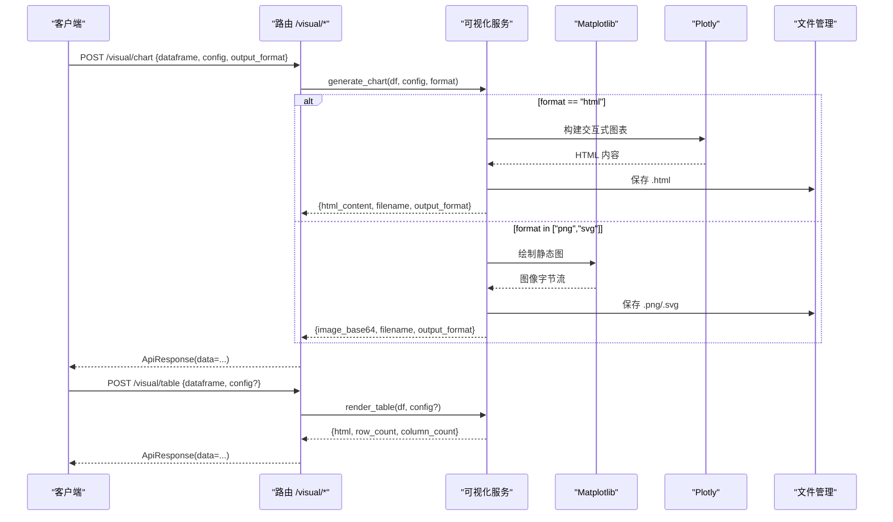
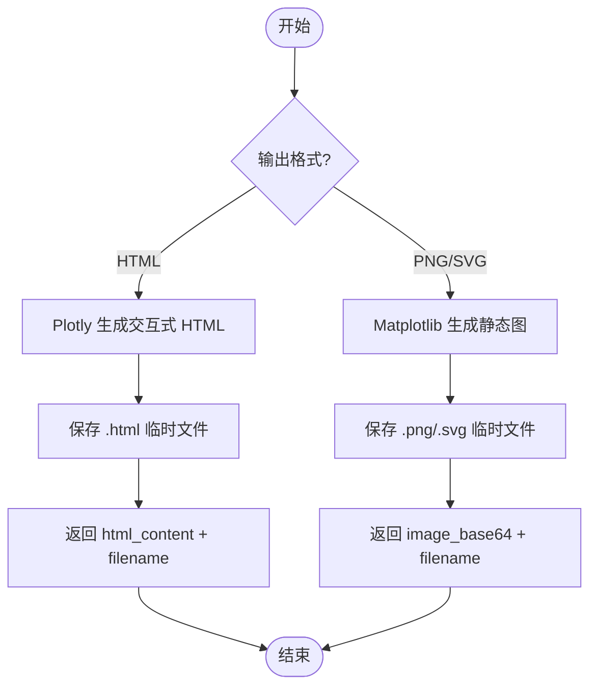
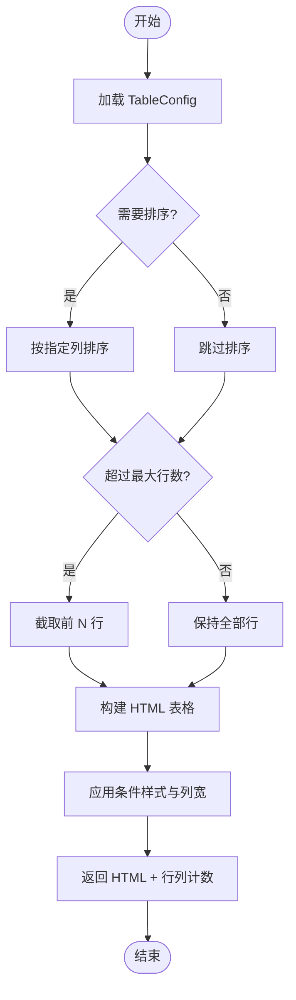
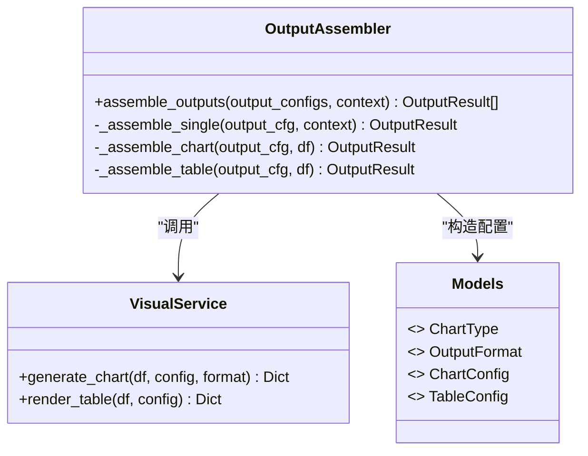
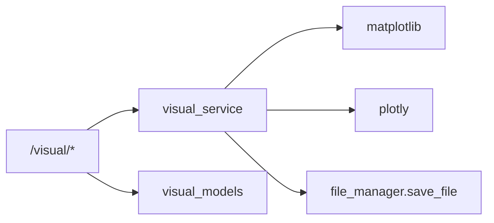

# 可视化动作

<cite>
**本文引用的文件**
- [app/models/visual_models.py](file://app/models/visual_models.py)
- [app/services/visual_service.py](file://app/services/visual_service.py)
- [app/api/v1/visual.py](file://app/api/v1/visual.py)
- [app/core/output_assembler.py](file://app/core/output_assembler.py)
- [tests/test_visual_api.py](file://tests/test_visual_api.py)
</cite>

## 目录
1. [简介](#简介)
2. [项目结构](#项目结构)
3. [核心组件](#核心组件)
4. [架构总览](#架构总览)
5. [详细组件分析](#详细组件分析)
6. [依赖关系分析](#依赖关系分析)
7. [性能考虑](#性能考虑)
8. [故障排查指南](#故障排查指南)
9. [结论](#结论)
10. [附录：配置与使用示例](#附录：配置与使用示例)

## 简介
本章节面向“可视化相关动作”的配置与使用，覆盖图表生成（chart）与表格渲染（table）两大能力。内容包括：
- 图表类型选择、样式配置、输出格式设置
- 数据绑定方式（x/y 列映射、多系列支持）
- 自定义样式方法（颜色、坐标轴、尺寸等）
- 导出格式支持（PNG/SVG/HTML）
- 不同业务场景下的配置示例与最佳实践

## 项目结构
可视化功能由以下模块协作完成：
- API 路由层：接收请求并调用服务层
- 服务层：实现图表绘制与表格渲染的核心逻辑
- 模型层：定义请求/响应结构与配置项
- 输出组装器：在 Pipeline 场景中按配置产出可视化结果

**图示来源**
- [app/api/v1/visual.py:13-29](file://app/api/v1/visual.py#L13-L29)
- [app/services/visual_service.py:51-205](file://app/services/visual_service.py#L51-L205)
- [app/core/output_assembler.py:83-115](file://app/core/output_assembler.py#L83-L115)

**章节来源**
- [app/api/v1/visual.py:1-29](file://app/api/v1/visual.py#L1-L29)
- [app/services/visual_service.py:1-430](file://app/services/visual_service.py#L1-L430)
- [app/models/visual_models.py:1-107](file://app/models/visual_models.py#L1-L107)
- [app/core/output_assembler.py:1-189](file://app/core/output_assembler.py#L1-L189)

## 核心组件
- 图表类型与输出格式枚举：集中定义支持的图表种类与导出格式
- 图表配置对象：描述 x/y 列、标题、坐标轴、颜色、尺寸、额外参数等
- 表格配置对象：排序、最大行数、条件样式、列宽、是否显示索引等
- 服务函数：generate_chart、render_table
- API 端点：/visual/chart、/visual/table
- 输出组装器：将 Pipeline 中的 chart/table 输出转换为最终结果

**章节来源**
- [app/models/visual_models.py:15-107](file://app/models/visual_models.py#L15-L107)
- [app/services/visual_service.py:51-430](file://app/services/visual_service.py#L51-L430)
- [app/api/v1/visual.py:13-29](file://app/api/v1/visual.py#L13-L29)
- [app/core/output_assembler.py:62-115](file://app/core/output_assembler.py#L62-L115)

## 架构总览
下图展示了从请求到可视化的完整流程，包括 PNG/SVG/HTML 三种输出路径及表格渲染路径。

**图示来源**
- [app/api/v1/visual.py:13-29](file://app/api/v1/visual.py#L13-L29)
- [app/services/visual_service.py:51-205](file://app/services/visual_service.py#L51-L205)
- [app/services/visual_service.py:333-401](file://app/services/visual_service.py#L333-L401)

## 详细组件分析

### 图表生成（chart）
- 支持的图表类型：柱状图、折线图、饼图、散点图、热力图、雷达图、面积图、直方图、箱线图
- 输出格式：PNG（base64）、SVG（矢量）、HTML（Plotly 交互）
- 数据绑定：
  - x：X 轴列名或分类维度
  - y：Y 轴列名，支持单列或多列（多系列）
- 样式配置：
  - 标题、坐标轴标签、颜色序列、画布宽高
  - 坐标轴刻度旋转、数值范围限制
  - extra：扩展参数（如直方图的 bins）
- 错误处理：
  - 不支持的图表类型抛出异常
  - 渲染失败统一包装为应用异常

**图示来源**
- [app/services/visual_service.py:51-205](file://app/services/visual_service.py#L51-L205)

**章节来源**
- [app/models/visual_models.py:15-74](file://app/models/visual_models.py#L15-L74)
- [app/services/visual_service.py:51-205](file://app/services/visual_service.py#L51-L205)
- [tests/test_visual_api.py:5-116](file://tests/test_visual_api.py#L5-L116)

### 表格渲染（table）
- 功能：将 DataFrame 渲染为带样式的 HTML 表格
- 配置项：
  - 标题、排序字段与方向、最大显示行数
  - 条件样式：基于列值表达式高亮单元格
  - 列宽控制、是否显示行索引
- 数据处理：
  - NaN 显示为空
  - 浮点数保留两位小数
  - 自动统计行列数

**图示来源**
- [app/services/visual_service.py:333-401](file://app/services/visual_service.py#L333-L401)
- [app/services/visual_service.py:404-430](file://app/services/visual_service.py#L404-L430)

**章节来源**
- [app/models/visual_models.py:78-107](file://app/models/visual_models.py#L78-L107)
- [app/services/visual_service.py:333-430](file://app/services/visual_service.py#L333-L430)
- [tests/test_visual_api.py:119-166](file://tests/test_visual_api.py#L119-L166)

### 输出组装器中的可视化集成
- 在 Pipeline 中，通过 outputs 定义 chart/table 输出
- 根据配置动态构造 ChartConfig/TableConfig 并调用服务层
- 将结果封装为 OutputResult，便于后续消费

**图示来源**
- [app/core/output_assembler.py:62-115](file://app/core/output_assembler.py#L62-L115)
- [app/services/visual_service.py:51-430](file://app/services/visual_service.py#L51-L430)
- [app/models/visual_models.py:15-107](file://app/models/visual_models.py#L15-L107)

**章节来源**
- [app/core/output_assembler.py:1-189](file://app/core/output_assembler.py#L1-L189)

## 依赖关系分析
- API 路由依赖服务层与模型层
- 服务层依赖：
  - Matplotlib：用于 PNG/SVG 静态图
  - Plotly：用于 HTML 交互图
  - 文件管理：保存临时文件并返回文件名
- 模型层提供统一的配置与校验
- 测试用例验证了关键路径（PNG/SVG/HTML 图表、表格条件样式）

**图示来源**
- [app/api/v1/visual.py:13-29](file://app/api/v1/visual.py#L13-L29)
- [app/services/visual_service.py:10-27](file://app/services/visual_service.py#L10-L27)
- [app/services/visual_service.py:128-147](file://app/services/visual_service.py#L128-L147)
- [app/services/visual_service.py:150-205](file://app/services/visual_service.py#L150-L205)

**章节来源**
- [app/api/v1/visual.py:1-29](file://app/api/v1/visual.py#L1-L29)
- [app/services/visual_service.py:1-430](file://app/services/visual_service.py#L1-L430)
- [tests/test_visual_api.py:1-166](file://tests/test_visual_api.py#L1-L166)

## 性能考虑
- 静态图（PNG/SVG）：使用无头模式渲染，适合批量生成；注意画布尺寸与 DPI 对内存与渲染时间的影响
- 交互图（HTML）：基于 Plotly，体积较大但可交互；适合嵌入网页或报告
- 表格渲染：大量数据时建议设置 max_rows 限制展示规模，避免前端渲染压力
- 字体与中文：已内置中文字体检测与设置，确保标签可读性

[本节为通用指导，不直接分析具体文件]

## 故障排查指南
- 图表类型不支持：检查 chart_type 是否为枚举值；非法值会在请求阶段被拒绝
- 渲染失败：服务层捕获异常并包装为应用异常；查看日志定位具体原因
- 条件样式无效：确认条件表达式语法与数据类型匹配；NaN 不参与比较
- 中文乱码：确认运行环境存在中文字体；服务层会尝试自动设置

**章节来源**
- [app/services/visual_service.py:69-87](file://app/services/visual_service.py#L69-L87)
- [app/services/visual_service.py:33-46](file://app/services/visual_service.py#L33-L46)
- [app/services/visual_service.py:404-430](file://app/services/visual_service.py#L404-L430)

## 结论
该可视化子系统提供了统一的图表与表格渲染能力，支持多种图表类型与输出格式，并通过配置化方式灵活定制样式与行为。结合 Pipeline 的输出组装器，可在复杂分析流程中便捷地生成可视化结果。

[本节为总结性内容，不直接分析具体文件]

## 附录：配置与使用示例

### 图表生成（chart）
- 接口：POST /api/v1/visual/chart
- 请求体关键字段：
  - dataframe：数据源（列名与数据）
  - config.chart_type：bar/line/pie/scatter/heatmap/radar/area/histogram/box
  - config.x/config.y：数据绑定列（y 可为列表表示多系列）
  - config.title/xlabel/ylabel/colors/width/height：样式与尺寸
  - config.x_axis.tick_rotation/min_value/max_value：坐标轴控制
  - config.extra：扩展参数（例如 histogram.bins）
  - output_format：png/svg/html
- 响应：
  - PNG/SVG：image_base64 + filename
  - HTML：html_content + filename
- 参考测试用例：
  - 柱状图 PNG：[tests/test_visual_api.py:5-29](file://tests/test_visual_api.py#L5-L29)
  - 折线图 SVG：[tests/test_visual_api.py:31-54](file://tests/test_visual_api.py#L31-L54)
  - 饼图 PNG：[tests/test_visual_api.py:56-76](file://tests/test_visual_api.py#L56-L76)
  - HTML 交互图：[tests/test_visual_api.py:94-116](file://tests/test_visual_api.py#L94-L116)

**章节来源**
- [app/api/v1/visual.py:13-21](file://app/api/v1/visual.py#L13-L21)
- [app/models/visual_models.py:15-74](file://app/models/visual_models.py#L15-L74)
- [tests/test_visual_api.py:5-116](file://tests/test_visual_api.py#L5-L116)

### 表格渲染（table）
- 接口：POST /api/v1/visual/table
- 请求体关键字段：
  - dataframe：数据源
  - config.title：表格标题
  - config.sort_by/sort_ascending：排序
  - config.max_rows：最大显示行数
  - config.conditional_styles：条件样式（column/condition/style）
  - config.column_widths：列宽
  - config.show_index：是否显示行索引
- 响应：
  - html：格式化 HTML 表格
  - row_count/column_count：行列统计
- 参考测试用例：
  - 基础表格：[tests/test_visual_api.py:119-136](file://tests/test_visual_api.py#L119-L136)
  - 条件样式与排序：[tests/test_visual_api.py:138-166](file://tests/test_visual_api.py#L138-L166)

**章节来源**
- [app/api/v1/visual.py:24-29](file://app/api/v1/visual.py#L24-L29)
- [app/models/visual_models.py:78-107](file://app/models/visual_models.py#L78-L107)
- [tests/test_visual_api.py:119-166](file://tests/test_visual_api.py#L119-L166)

### 在 Pipeline 中使用可视化输出
- 通过 outputs 定义 chart/table 输出，系统会自动构造配置并调用服务层
- 示例：
  - table 输出：[app/core/output_assembler.py:62-80](file://app/core/output_assembler.py#L62-L80)
  - chart 输出：[app/core/output_assembler.py:83-115](file://app/core/output_assembler.py#L83-L115)

**章节来源**
- [app/core/output_assembler.py:62-115](file://app/core/output_assembler.py#L62-L115)

### 常见业务场景与最佳实践
- 销售趋势对比（多系列折线图）：
  - 使用 line 图表，y 传入多个数值列以展示多条线
  - 设置 colors 统一品牌色，xlabel/ylabel 明确含义
  - 参考：[app/services/visual_service.py:226-236](file://app/services/visual_service.py#L226-L236)
- 占比分布（饼图）：
  - 使用 pie 图表，x 为类别列，y 为数值列
  - 注意类别数量不宜过多，必要时合并小类
  - 参考：[app/services/visual_service.py:239-250](file://app/services/visual_service.py#L239-L250)
- 相关性分析（热力图）：
  - 使用 heatmap 图表，自动计算数值列的相关矩阵
  - 适合多维指标关联洞察
  - 参考：[app/services/visual_service.py:262-271](file://app/services/visual_service.py#L262-L271)
- 分布探索（直方图/箱线图）：
  - histogram：通过 extra.bins 调整分箱粒度
  - box：观察离群值与四分位数
  - 参考：[app/services/visual_service.py:309-329](file://app/services/visual_service.py#L309-L329)
- 表格高亮关键指标：
  - 使用 conditional_styles 对阈值进行着色，提升可读性
  - 参考：[app/services/visual_service.py:376-382](file://app/services/visual_service.py#L376-L382)

[本节为实践指导，引用了服务层的具体实现位置]