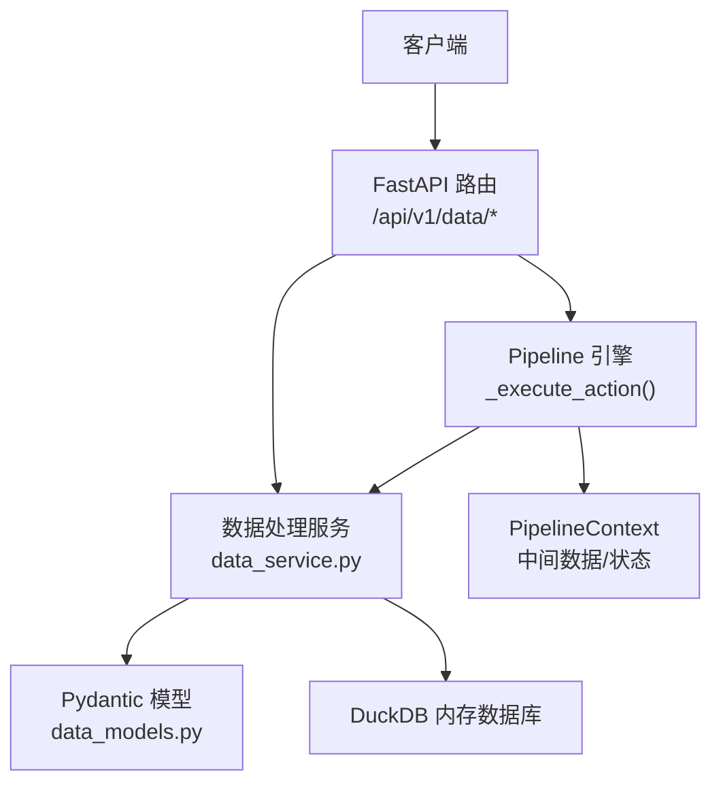
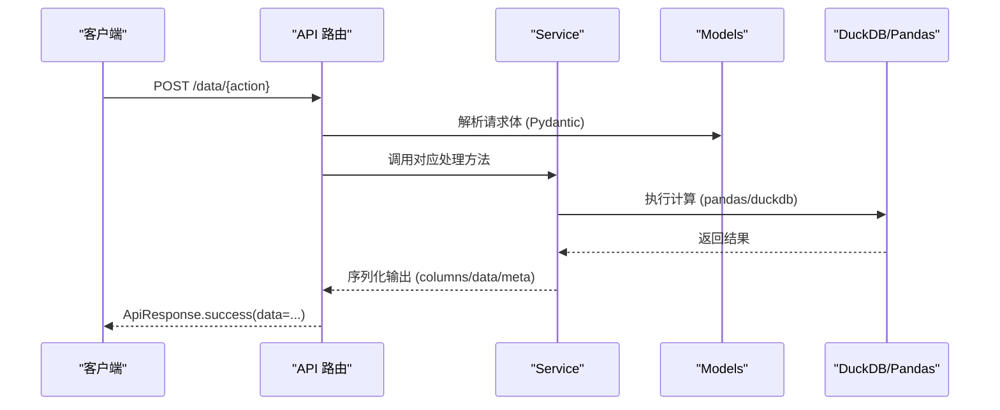
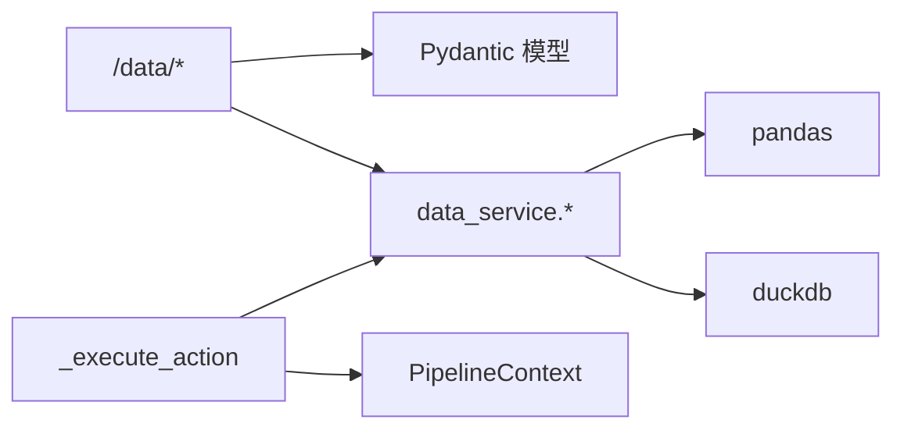

# 数据处理动作

<cite>
**本文引用的文件**
- [pipeline_engine.py](file://app/core/pipeline_engine.py)
- [data_service.py](file://app/services/data_service.py)
- [data_models.py](file://app/models/data_models.py)
- [data.py](file://app/api/v1/data.py)
- [response.py](file://app/core/response.py)
- [errors.py](file://app/core/errors.py)
- [sample_analysis.yaml](file://app/scenarios/sample_analysis.yaml)
</cite>

## 目录
1. [简介](#简介)
2. [项目结构](#项目结构)
3. [核心组件](#核心组件)
4. [架构总览](#架构总览)
5. [详细动作说明](#详细动作说明)
6. [依赖关系分析](#依赖关系分析)
7. [性能考虑](#性能考虑)
8. [故障排查指南](#故障排查指南)
9. [结论](#结论)
10. [附录：API 与参数速查](#附录api-与参数速查)

## 简介
本文件系统化介绍数据处理类动作的使用方法，涵盖 SQL 查询（query）、数据筛选（filter）、聚合统计（aggregate）、透视表生成（pivot）、排序（sort）、去重（dedup）、数据清洗（clean）和统计分析（statistics）。对每个动作提供：
- 输入/输出格式
- 支持的配置选项
- 使用示例路径
- 常见场景
- 错误处理与异常
- 性能优化建议

这些动作既可通过 API 直接调用，也可在 Pipeline 引擎中以 action 形式编排执行。

## 项目结构
数据处理能力由三层组成：
- API 层：暴露 REST 接口，接收请求并返回统一响应体
- Service 层：实现具体数据处理逻辑（基于 pandas、duckdb）
- Models 层：定义请求/响应的 Pydantic 模型，保证参数校验与类型安全
- Pipeline 引擎：将 action 与 service 方法解耦，支持条件执行、上下文传递、结果存储与错误策略

图表来源
- [data.py:147-200](file://app/api/v1/data.py#L147-L200)
- [data_service.py:128-446](file://app/services/data_service.py#L128-L446)
- [data_models.py:13-145](file://app/models/data_models.py#L13-L145)
- [pipeline_engine.py:131-234](file://app/core/pipeline_engine.py#L131-L234)

章节来源
- [data.py:1-201](file://app/api/v1/data.py#L1-L201)
- [data_service.py:1-447](file://app/services/data_service.py#L1-L447)
- [data_models.py:1-145](file://app/models/data_models.py#L1-L145)
- [pipeline_engine.py:1-357](file://app/core/pipeline_engine.py#L1-L357)

## 核心组件
- 统一响应与错误码：ApiResponse、ErrorCode
- 自定义异常：AppException 及全局异常处理器
- 数据载体：DataFrameInput/DataFrameOutput/DataFrameMeta
- 各动作的请求模型：QueryRequest、FilterRequest、AggregateRequest、PivotRequest、SortRequest、DedupRequest、CleanRequest、StatisticsRequest
- 执行器：_execute_action 将 action 路由到对应 service 函数
- 上下文：PipelineContext 管理中间 DataFrame 与结果

章节来源
- [response.py:12-103](file://app/core/response.py#L12-L103)
- [errors.py:15-74](file://app/core/errors.py#L15-L74)
- [data_models.py:13-145](file://app/models/data_models.py#L13-L145)
- [pipeline_engine.py:37-70](file://app/core/pipeline_engine.py#L37-L70)
- [pipeline_engine.py:131-234](file://app/core/pipeline_engine.py#L131-L234)

## 架构总览
下图展示了从 API 到 Service 的调用链，以及 Pipeline 引擎如何复用同一套 service 方法。

图表来源
- [data.py:147-200](file://app/api/v1/data.py#L147-L200)
- [data_service.py:128-446](file://app/services/data_service.py#L128-L446)
- [data_models.py:13-145](file://app/models/data_models.py#L13-L145)

## 详细动作说明

### SQL 查询（query）
- 作用：在内存中注册虚拟表，执行 SELECT/WITH 语句进行过滤、连接、窗口函数等复杂查询
- 输入
  - dataframe：二维数据（列名 + 行数据），可选 dtypes 提示
  - sql：SELECT 或 WITH 开头的 SQL 语句，默认表名为 df
  - table_name：虚拟表名（默认 df）
- 输出
  - columns：列名列表
  - data：二维数据
  - meta：元信息（行数、列数、列名、列类型）
- 关键行为与安全
  - 仅允许 SELECT/WITH；拦截危险关键字（INSERT/UPDATE/DELETE/DROP/CREATE/ALTER/TRUNCATE/EXEC/EXPORT/IMPORT 等）
  - 通过 DuckDB 内存库执行，避免外部写入风险
- 使用示例路径
  - API：POST /data/query
  - Pipeline：action="query"，params.sql、params.table_name
- 常见场景
  - 多列过滤、条件拼接、跨表连接（多个 DataFrame 分别注册为不同表名）
  - 窗口函数、子查询、CTE（WITH）
- 性能建议
  - 尽量在 SQL 中完成过滤与投影，减少后续操作的数据量
  - 大表查询时，优先选择必要列，避免 SELECT *
  - 合理设置索引不适用（内存表），但可借助 WHERE 提前下推过滤
- 错误与异常
  - 非 SELECT/WITH 开头：SQL_EXECUTION_ERROR
  - SQL 语法错误或执行失败：SQL_EXECUTION_ERROR
  - 未预期异常：PIPELINE_STEP_FAILED（在 Pipeline 中）

章节来源
- [data.py:147-151](file://app/api/v1/data.py#L147-L151)
- [data_service.py:128-158](file://app/services/data_service.py#L128-L158)
- [data_models.py:48-53](file://app/models/data_models.py#L48-L53)
- [pipeline_engine.py:140-149](file://app/core/pipeline_engine.py#L140-L149)

### 数据筛选（filter）
- 作用：按条件组合筛选行，支持 AND/OR 逻辑
- 输入
  - conditions：条件列表，每项包含 column、operator、value
  - logic：and/or（默认 and）
- 运算符
  - eq, ne, gt, ge, lt, le, in, not_in, contains, startswith, endswith
- 输出：同 query 的输出结构
- 使用示例路径
  - API：POST /data/filter
  - Pipeline：action="filter"，params.conditions、params.logic
- 常见场景
  - 多条件组合筛选（如年龄区间、类别包含、前缀匹配）
  - 文本模糊匹配（contains/startswith/endswith）
- 性能建议
  - 将选择性高的条件放在前面（框架内部会合并掩码，顺序不影响最终结果）
  - 对字符串列使用 contains/startswith 时注意大小写与编码
- 错误与异常
  - 列不存在：PARAM_VALIDATION_ERROR
  - 不支持的运算符：PARAM_VALIDATION_ERROR

章节来源
- [data.py:154-158](file://app/api/v1/data.py#L154-L158)
- [data_service.py:178-210](file://app/services/data_service.py#L178-L210)
- [data_models.py:57-69](file://app/models/data_models.py#L57-L69)
- [pipeline_engine.py:151-162](file://app/core/pipeline_engine.py#L151-L162)

### 聚合统计（aggregate）
- 作用：按一组列分组并对目标列执行聚合函数
- 输入
  - group_by：分组列
  - agg_columns：聚合目标列
  - agg_funcs：聚合函数列表，支持 sum, mean, count, min, max, median, std, var
- 输出：扁平化列名的结果表（列名为“原列_函数”）
- 使用示例路径
  - API：POST /data/aggregate
  - Pipeline：action="aggregate"，params.group_by、params.agg_columns、params.agg_funcs
- 常见场景
  - 按部门/地区汇总销售额、平均值、标准差等
- 性能建议
  - 先 filter 再 aggregate，减少分组基数
  - 对数值列做 cast_type 后再聚合，避免隐式转换开销
- 错误与异常
  - 不支持的聚合函数：PARAM_VALIDATION_ERROR
  - 聚合执行失败（类型不兼容等）：DATA_TYPE_ERROR

章节来源
- [data.py:161-165](file://app/api/v1/data.py#L161-L165)
- [data_service.py:218-243](file://app/services/data_service.py#L218-L243)
- [data_models.py:73-82](file://app/models/data_models.py#L73-L82)
- [pipeline_engine.py:164-173](file://app/core/pipeline_engine.py#L164-L173)

### 透视表生成（pivot）
- 作用：将长表转为宽表，指定行索引、列展开、值列与聚合函数
- 输入
  - index：行索引列
  - columns：列展开列
  - values：值列
  - agg_func：聚合函数（默认 sum）
- 输出：扁平化列名的透视结果
- 使用示例路径
  - API：POST /data/pivot
  - Pipeline：action="pivot"，params.index/columns/values/agg_func
- 常见场景
  - 时间序列×产品维度的指标透视
- 性能建议
  - 确保 index/columns/values 均为合适类型（日期、分类等）
  - 大数据集建议先 filter/groupby 降维再 pivot
- 错误与异常
  - 透视生成失败（维度冲突、类型不兼容）：DATA_TYPE_ERROR

章节来源
- [data.py:168-172](file://app/api/v1/data.py#L168-L172)
- [data_service.py:248-272](file://app/services/data_service.py#L248-L272)
- [data_models.py:86-93](file://app/models/data_models.py#L86-L93)
- [pipeline_engine.py:175-185](file://app/core/pipeline_engine.py#L175-L185)

### 排序（sort）
- 作用：按一列或多列排序，支持升/降序
- 输入
  - sort_by：排序列列表
  - ascending：布尔或布尔列表（每列一个）
- 输出：排序后的结果表
- 使用示例路径
  - API：POST /data/sort
  - Pipeline：action="sort"，params.sort_by、params.ascending
- 常见场景
  - 按时间倒序、按指标正序/倒序
- 性能建议
  - 大数据集排序成本较高，建议先 filter/dedup 减少行数
  - 多列排序时，尽量将区分度高的列放前面
- 错误与异常
  - 无特殊业务异常；类型不兼容可能触发 DATA_TYPE_ERROR（底层抛错）

章节来源
- [data.py:175-179](file://app/api/v1/data.py#L175-L179)
- [data_service.py:277-284](file://app/services/data_service.py#L277-L284)
- [data_models.py:97-102](file://app/models/data_models.py#L97-L102)
- [pipeline_engine.py:187-195](file://app/core/pipeline_engine.py#L187-L195)

### 去重（dedup）
- 作用：基于指定列或全列去重，支持保留首条/末条/删除全部重复
- 输入
  - subset：去重依据列（为空则全列）
  - keep：first/last/false（默认 first）
- 输出：去重后的结果表
- 使用示例路径
  - API：POST /data/dedup
  - Pipeline：action="dedup"，params.subset、params.keep
- 常见场景
  - 主键去重、日志去重、临时表清理
- 性能建议
  - 大数据集先去重再排序/聚合，降低后续成本
  - 明确 subset 可减少比较开销
- 错误与异常
  - 无特殊业务异常；keep 非法会被规范化为默认值

章节来源
- [data.py:182-186](file://app/api/v1/data.py#L182-L186)
- [data_service.py:289-295](file://app/services/data_service.py#L289-L295)
- [data_models.py:106-111](file://app/models/data_models.py#L106-L111)
- [pipeline_engine.py:197-205](file://app/core/pipeline_engine.py#L197-L205)

### 数据清洗（clean）
- 作用：批量清洗操作，包括空值填充/删除、类型转换、文本清洗、异常值剔除
- 输入
  - operations：操作列表，每项包含 operation、column（可选）、params（可选）
- 支持的操作
  - fill_na：填充空值（value 默认 0；column 为空表示全列）
  - drop_na：删除含空值的行（how: any/all；subset 可选）
  - cast_type：类型转换（int/int64/float/float64/str/string/datetime/bool/自定义类型；datetime 可带 format）
  - strip_text：去除空白字符（object/string 列）
  - replace_text：正则或非正则替换（pattern/replacement/regex）
  - drop_outliers：基于 IQR 剔除异常值（factor 默认 1.5）
- 输出：清洗后的结果表
- 使用示例路径
  - API：POST /data/clean
  - Pipeline：action="clean"，params.operations
- 常见场景
  - 缺失值处理、类型标准化、文本规范化、异常值过滤
- 性能建议
  - 将高代价操作（drop_outliers、replace_text）放在后面，减少不必要计算
  - 对大文本列使用 replace_text 时谨慎开启 regex
- 错误与异常
  - 不支持的操作：PARAM_VALIDATION_ERROR
  - 类型转换失败：DATA_TYPE_ERROR
  - 必须指定 column 的操作未指定：PARAM_VALIDATION_ERROR

章节来源
- [data.py:189-193](file://app/api/v1/data.py#L189-L193)
- [data_service.py:300-395](file://app/services/data_service.py#L300-L395)
- [data_models.py:115-129](file://app/models/data_models.py#L115-L129)
- [pipeline_engine.py:207-217](file://app/core/pipeline_engine.py#L207-L217)

### 统计分析（statistics）
- 作用：描述性统计、相关性矩阵、频率分布
- 输入
  - stat_type：descriptive/correlation/frequency
  - columns：目标列（为空时自动选择数值列）
  - params：额外参数（frequency 可用 bins 控制分箱数量）
- 输出
  - descriptive：统计摘要（index 重命名为 stat）
  - correlation：相关系数矩阵（index 重命名为 column）
  - frequency：频数与百分比（数值列自动分箱，非数值列按唯一值计数）
- 使用示例路径
  - API：POST /data/statistics
  - Pipeline：action="statistics"，params.stat_type、params.columns、params.extra_params
- 常见场景
  - 快速了解数据分布、变量间相关性、类别频次
- 性能建议
  - 仅在必要列上计算，避免全表 describe
  - correlation 需要至少两个数值列
- 错误与异常
  - 没有可用于统计的数值列：DATA_EMPTY
  - 相关性分析列数不足：PARAM_VALIDATION_ERROR
  - 频率分布需至少一列：PARAM_VALIDATION_ERROR
  - 不支持的统计类型：PARAM_VALIDATION_ERROR

章节来源
- [data.py:196-200](file://app/api/v1/data.py#L196-L200)
- [data_service.py:400-446](file://app/services/data_service.py#L400-L446)
- [data_models.py:133-145](file://app/models/data_models.py#L133-L145)
- [pipeline_engine.py:219-228](file://app/core/pipeline_engine.py#L219-L228)

## 依赖关系分析
- API 路由依赖 models 进行参数校验，再调用 service 执行业务逻辑
- service 依赖 pandas/duckdb 执行计算，并通过统一的 df_to_output 输出结构化结果
- pipeline_engine 将 action 映射到 service 方法，同时维护上下文与步骤结果
- 错误通过 AppException 抛出，并由全局异常处理器转换为 ApiResponse

图表来源
- [data.py:147-200](file://app/api/v1/data.py#L147-L200)
- [data_service.py:128-446](file://app/services/data_service.py#L128-L446)
- [pipeline_engine.py:131-234](file://app/core/pipeline_engine.py#L131-L234)

章节来源
- [data.py:1-201](file://app/api/v1/data.py#L1-L201)
- [data_service.py:1-447](file://app/services/data_service.py#L1-L447)
- [pipeline_engine.py:1-357](file://app/core/pipeline_engine.py#L1-L357)

## 性能考虑
- 数据量与内存
  - 所有动作均在内存中进行，超大表可能导致内存压力。建议在上游进行初步过滤与采样
- 计算顺序
  - 推荐顺序：filter → clean（类型转换/去空）→ dedup → sort/aggregate/pivot → statistics
- 列选择
  - 尽可能只选择必要列，减少后续操作的内存与 CPU 消耗
- SQL 下推
  - 使用 query 尽早过滤与投影，避免后续动作处理冗余数据
- 聚合与透视
  - 先 groupby 或 pivot 前尽量缩小数据规模；对高频透视可考虑缓存中间结果
- 文本操作
  - replace_text 的正则匹配开销较大，必要时限制范围或预清洗

[本节为通用性能指导，不直接分析具体文件]

## 故障排查指南
- 常见错误码与含义
  - PARAM_VALIDATION_ERROR：参数校验失败（列不存在、运算符不支持、统计类型不支持等）
  - SQL_EXECUTION_ERROR：SQL 安全限制或执行失败
  - DATA_EMPTY：数据为空或无可用的数值列
  - DATA_TYPE_ERROR：数据类型不兼容（聚合/透视/类型转换失败）
  - PIPELINE_STEP_FAILED：Pipeline 步骤执行失败（缺少输入数据、不支持的 action 等）
- 定位步骤
  - 检查请求体是否符合 Pydantic 模型定义
  - 确认列名与类型是否与操作要求一致
  - 查看 Pipeline 步骤的 on_error 策略（abort/skip）
- 调试建议
  - 逐步执行：先 filter/clean，再 aggregate/pivot，便于定位问题
  - 使用 statistics 的 descriptive 快速检查数据类型与缺失情况
  - 对 SQL 查询先用简单 SELECT 验证表结构与列名

章节来源
- [response.py:12-68](file://app/core/response.py#L12-L68)
- [errors.py:15-74](file://app/core/errors.py#L15-L74)
- [pipeline_engine.py:317-349](file://app/core/pipeline_engine.py#L317-L349)

## 结论
本系统提供了完整的数据处理动作集合，覆盖查询、筛选、聚合、透视、排序、去重、清洗与统计分析。通过统一的模型与响应规范，结合 Pipeline 引擎的条件执行与错误策略，能够灵活构建端到端的数据处理流程。遵循本文的参数说明、使用示例路径与性能建议，可在保证稳定性的前提下获得良好的执行效率。

[本节为总结性内容，不直接分析具体文件]

## 附录：API 与参数速查
- 入口路由
  - POST /data/query：SQL 查询
  - POST /data/filter：数据筛选
  - POST /data/aggregate：聚合统计
  - POST /data/pivot：透视表
  - POST /data/sort：排序
  - POST /data/dedup：去重
  - POST /data/clean：数据清洗
  - POST /data/statistics：统计分析
- 公共输入结构
  - DataFrameInput：columns、data、dtypes（可选）
- 公共输出结构
  - DataFrameOutput：columns、data、meta（row_count、column_count、columns、dtypes）
- Pipeline 动作映射
  - action="query"/"filter"/"aggregate"/"pivot"/"sort"/"dedup"/"clean"/"statistics"
  - 参数通过 params 传入，部分字段支持 $input.xxx 引用
- 示例场景
  - sample_analysis.yaml：演示 clean → sort → statistics 的流水线编排

章节来源
- [data.py:147-200](file://app/api/v1/data.py#L147-L200)
- [data_models.py:13-145](file://app/models/data_models.py#L13-L145)
- [pipeline_engine.py:131-234](file://app/core/pipeline_engine.py#L131-L234)
- [sample_analysis.yaml:1-68](file://app/scenarios/sample_analysis.yaml#L1-L68)