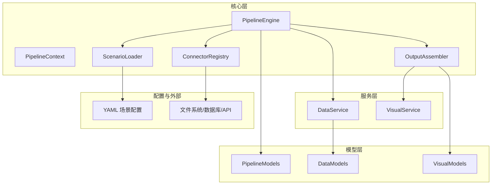
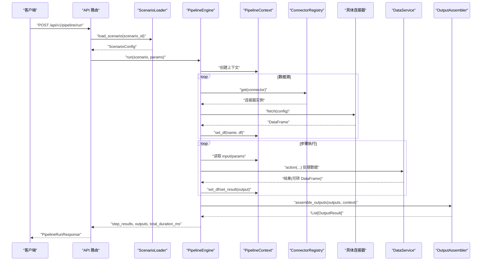
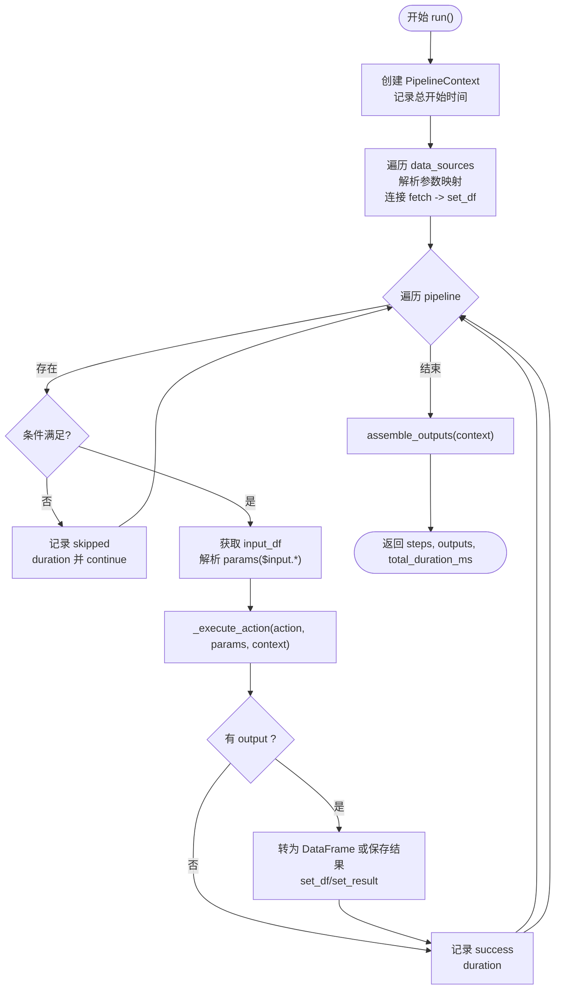
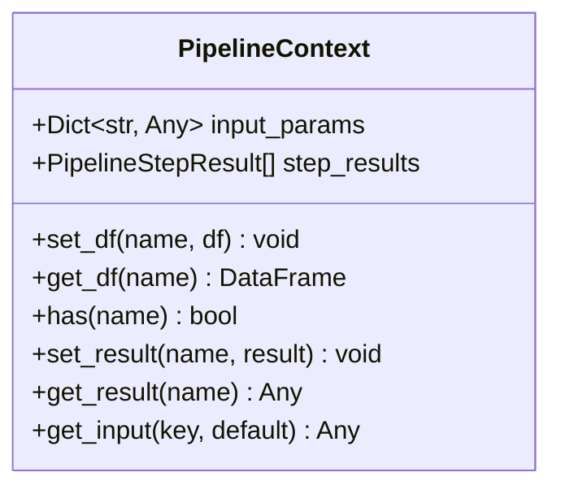
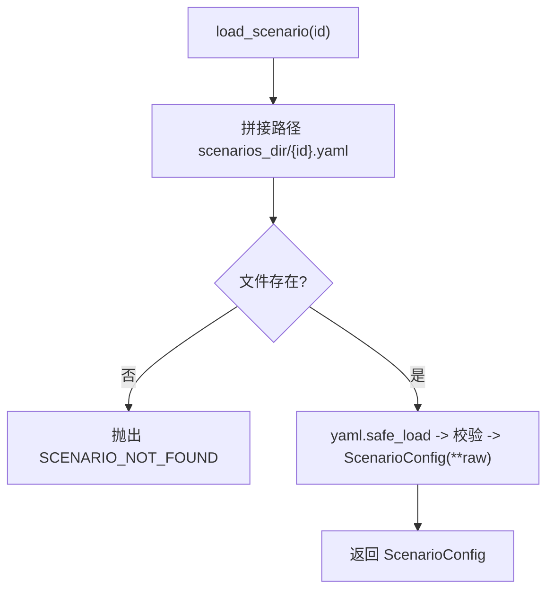
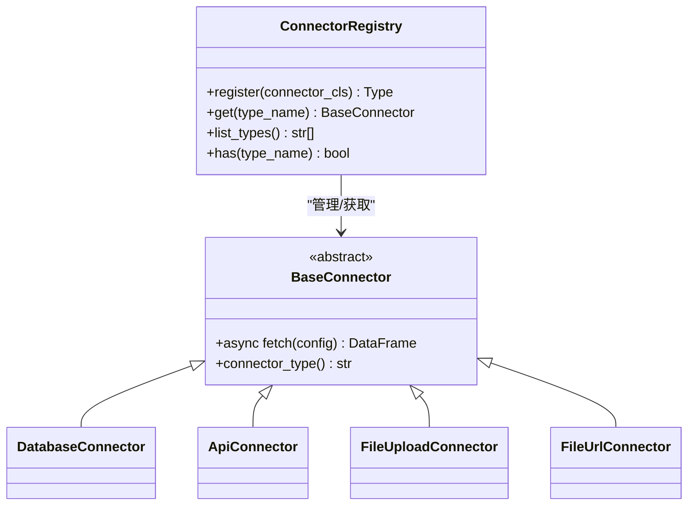
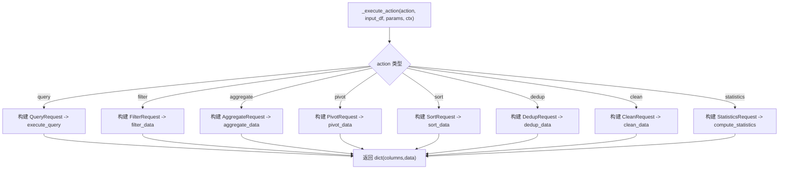
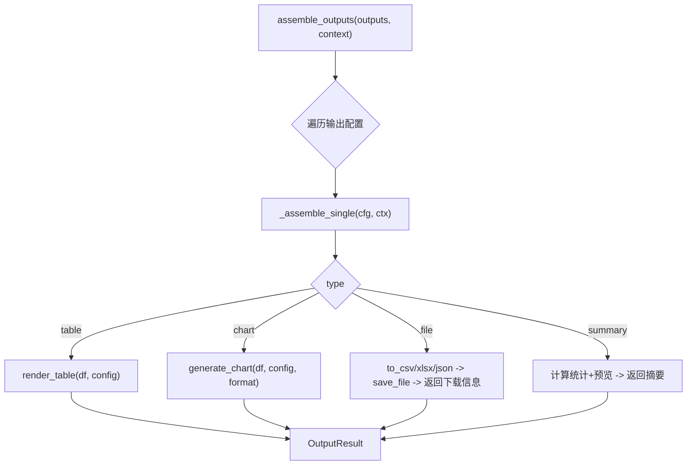
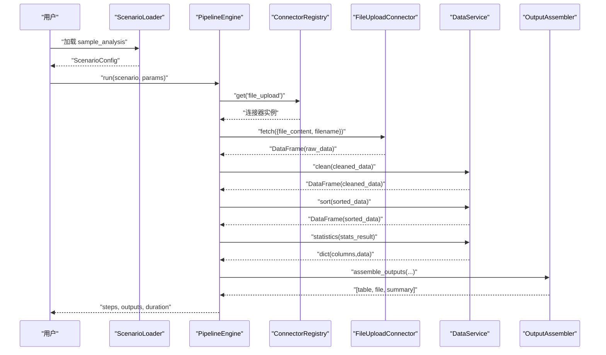
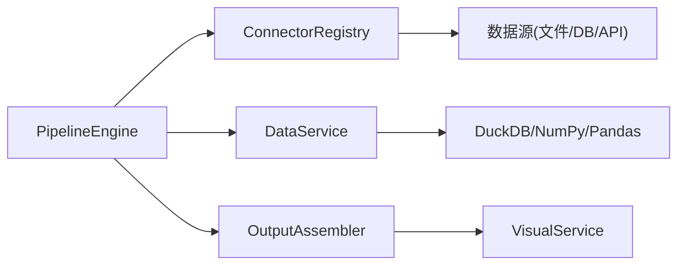

# 引擎架构设计

<cite>
**本文引用的文件**
- [pipeline_engine.py](file://app/core/pipeline_engine.py)
- [scenario_loader.py](file://app/core/scenario_loader.py)
- [pipeline_models.py](file://app/models/pipeline_models.py)
- [output_assembler.py](file://app/core/output_assembler.py)
- [connectors/__init__.py](file://app/core/connectors/__init__.py)
- [connectors/base.py](file://app/core/connectors/base.py)
- [data_service.py](file://app/services/data_service.py)
- [errors.py](file://app/core/errors.py)
- [response.py](file://app/core/response.py)
- [sample_analysis.yaml](file://app/scenarios/sample_analysis.yaml)
- [test_pipeline.py](file://tests/test_pipeline.py)
</cite>

## 目录
1. [简介](#简介)
2. [项目结构](#项目结构)
3. [核心组件](#核心组件)
4. [架构总览](#架构总览)
5. [详细组件分析](#详细组件分析)
6. [依赖关系分析](#依赖关系分析)
7. [性能考量](#性能考量)
8. [故障排查指南](#故障排查指南)
9. [结论](#结论)
10. [附录](#附录)

## 简介
本文件围绕“场景驱动的流水线引擎”展开，重点解析 PipelineEngine 的核心职责与执行流程，说明 PipelineContext 的上下文管理模式，以及从场景加载、数据源接入、步骤调度执行到结果组装的完整生命周期。文档同时提供架构图与交互时序图，帮助开发者快速理解整体设计与扩展点。

## 项目结构
该工程采用分层与模块化组织：
- 核心引擎位于 app/core，包含 PipelineEngine、PipelineContext、场景加载器、输出组装器、连接器注册表等
- 业务服务位于 app/services，封装数据处理、可视化渲染等能力
- 模型定义位于 app/models，统一请求/响应与中间数据结构
- 场景配置以 YAML 形式置于 app/scenarios，声明数据源、步骤与输出
- API 路由在 app/api/v1，对外暴露场景列表与运行接口（测试覆盖）

图表来源
- [pipeline_engine.py:249-357](file://app/core/pipeline_engine.py#L249-L357)
- [scenario_loader.py:68-105](file://app/core/scenario_loader.py#L68-L105)
- [output_assembler.py:19-38](file://app/core/output_assembler.py#L19-L38)
- [connectors/__init__.py:13-41](file://app/core/connectors/__init__.py#L13-L41)

章节来源
- [pipeline_engine.py:1-357](file://app/core/pipeline_engine.py#L1-L357)
- [scenario_loader.py:1-128](file://app/core/scenario_loader.py#L1-L128)
- [output_assembler.py:1-189](file://app/core/output_assembler.py#L1-L189)
- [connectors/__init__.py:1-60](file://app/core/connectors/__init__.py#L1-L60)

## 核心组件
- PipelineEngine：编排执行入口，负责生命周期管理、步骤调度、错误处理与耗时统计
- PipelineContext：运行时上下文，集中管理 DataFrame 中间数据、非 DataFrame 中间结果、输入参数与步骤执行记录
- ScenarioLoader：从 YAML 加载并校验场景配置，生成可执行的场景对象
- ConnectorRegistry：连接器注册表，按类型动态获取数据接入实现
- OutputAssembler：根据输出定义将上下文中的中间数据渲染为表格、图表、文件或摘要
- DataService：数据处理服务，提供 SQL、过滤、聚合、透视、排序、去重、清洗、统计等操作
- 模型层：统一描述请求、响应、步骤结果、输出结果等数据结构

章节来源
- [pipeline_engine.py:39-70](file://app/core/pipeline_engine.py#L39-L70)
- [scenario_loader.py:21-56](file://app/core/scenario_loader.py#L21-L56)
- [connectors/__init__.py:13-41](file://app/core/connectors/__init__.py#L13-L41)
- [output_assembler.py:19-38](file://app/core/output_assembler.py#L19-L38)
- [data_service.py:35-72](file://app/services/data_service.py#L35-L72)
- [pipeline_models.py:11-46](file://app/models/pipeline_models.py#L11-L46)

## 架构总览
下图展示了从场景加载到结果输出的端到端流程，以及各组件之间的调用关系。

图表来源
- [pipeline_engine.py:252-357](file://app/core/pipeline_engine.py#L252-L357)
- [scenario_loader.py:68-105](file://app/core/scenario_loader.py#L68-L105)
- [connectors/__init__.py:13-41](file://app/core/connectors/__init__.py#L13-L41)
- [output_assembler.py:19-38](file://app/core/output_assembler.py#L19-L38)
- [data_service.py:128-158](file://app/services/data_service.py#L128-L158)

## 详细组件分析

### PipelineEngine：执行编排与错误处理
- 职责
  - 生命周期管理：初始化上下文、计时、顺序执行步骤、最终组装输出
  - 数据源接入：通过 ConnectorRegistry 动态获取连接器，拉取数据并写入上下文
  - 步骤调度：支持条件跳过、输入数据绑定、参数映射、action 分发、结果落盘
  - 错误处理：区分 AppException 与未预期异常，支持 on_error=skip/abort
  - 性能统计：记录每步耗时与总耗时
- 关键流程
  - 参数映射：将 $input.xxx 替换为实际输入值
  - 条件评估：支持 has:/not_empty: 简单表达式
  - action 路由：query/filter/aggregate/pivot/sort/dedup/clean/statistics
  - 结果存储：DataFrame 与非 DataFrame 结果分别存入上下文
  - 输出组装：委托 OutputAssembler 完成表格/图表/文件/摘要
- 错误策略
  - 步骤失败时记录 step_results 状态
  - on_error=skip 继续后续步骤；on_error=abort 立即终止并返回已执行步骤

图表来源
- [pipeline_engine.py:252-357](file://app/core/pipeline_engine.py#L252-L357)

章节来源
- [pipeline_engine.py:77-119](file://app/core/pipeline_engine.py#L77-L119)
- [pipeline_engine.py:131-244](file://app/core/pipeline_engine.py#L131-L244)
- [pipeline_engine.py:249-357](file://app/core/pipeline_engine.py#L249-L357)

### PipelineContext：中间数据与执行状态管理
- 设计要点
  - 统一存储 DataFrame 与非 DataFrame 中间结果，避免散乱全局变量
  - 提供 get/set 方法，缺失引用时抛出业务异常，便于定位问题
  - 保留原始输入参数，供参数映射使用
  - 维护步骤执行结果列表，用于审计与调试
- 复杂度
  - 存取操作均为 O(1)，适合高频读写
  - 内存占用与 DataFrame 数量成正比，建议合理命名与复用

图表来源
- [pipeline_engine.py:39-70](file://app/core/pipeline_engine.py#L39-L70)
- [pipeline_models.py:17-23](file://app/models/pipeline_models.py#L17-L23)

章节来源
- [pipeline_engine.py:39-70](file://app/core/pipeline_engine.py#L39-L70)
- [pipeline_models.py:17-23](file://app/models/pipeline_models.py#L17-L23)

### 场景加载与配置模型
- 配置项
  - data_sources：name/connector/config，支持 param_mapping 注入 $input.*
  - pipeline：name/action/input/params/output/on_error/condition
  - outputs：name/type/source/config，type 支持 table/chart/file/summary
- 加载过程
  - 读取 YAML，校验根节点与字段，构造 Pydantic 模型
  - 若不存在或格式错误，抛出业务异常

图表来源
- [scenario_loader.py:60-105](file://app/core/scenario_loader.py#L60-L105)

章节来源
- [scenario_loader.py:21-56](file://app/core/scenario_loader.py#L21-L56)
- [scenario_loader.py:60-105](file://app/core/scenario_loader.py#L60-L105)

### 连接器注册表与数据接入
- 模式
  - BaseConnector 抽象出 fetch 与 connector_type
  - ConnectorRegistry 单例注册表，按类型获取连接器实例
  - 模块导入时自动注册内置连接器（数据库、API、文件上传、URL 文件）
- 扩展点
  - 新增连接器需继承 BaseConnector，实现 fetch 与 connector_type，并在注册表中注册

图表来源
- [connectors/base.py:11-24](file://app/core/connectors/base.py#L11-L24)
- [connectors/__init__.py:13-41](file://app/core/connectors/__init__.py#L13-L41)

章节来源
- [connectors/base.py:1-24](file://app/core/connectors/base.py#L1-24)
- [connectors/__init__.py:1-60](file://app/core/connectors/__init__.py#L1-L60)

### 数据处理服务与 Action 路由
- Action 类型
  - query：DuckDB 内存库执行 SELECT/WITH
  - filter：多条件组合 with and/or
  - aggregate：分组聚合
  - pivot：透视表
  - sort：排序
  - dedup：去重
  - clean：填充、清理等
  - statistics：描述性统计
- 安全与健壮性
  - SQL 白名单限制仅允许 SELECT/WITH，防止注入
  - 参数校验失败抛业务异常，便于上层捕获

图表来源
- [pipeline_engine.py:131-234](file://app/core/pipeline_engine.py#L131-L234)
- [data_service.py:128-158](file://app/services/data_service.py#L128-L158)
- [data_service.py:178-200](file://app/services/data_service.py#L178-L200)

章节来源
- [pipeline_engine.py:131-234](file://app/core/pipeline_engine.py#L131-L234)
- [data_service.py:128-158](file://app/services/data_service.py#L128-L158)
- [data_service.py:178-200](file://app/services/data_service.py#L178-L200)

### 输出组装器：表格/图表/文件/摘要
- 能力
  - table：基于 TableConfig 渲染表格
  - chart：基于 ChartConfig 与 OutputFormat 生成图表
  - file：导出 CSV/XLSX/JSON 并持久化，返回下载信息
  - summary：生成精简 JSON 摘要，便于 Agent 消费
- 容错
  - 单个输出失败不影响其他输出，记录警告并返回错误片段

图表来源
- [output_assembler.py:19-38](file://app/core/output_assembler.py#L19-L38)
- [output_assembler.py:62-188](file://app/core/output_assembler.py#L62-L188)

章节来源
- [output_assembler.py:19-38](file://app/core/output_assembler.py#L19-L38)
- [output_assembler.py:62-188](file://app/core/output_assembler.py#L62-L188)

### 执行流程示例：从 YAML 到结果
以下以 sample_analysis.yaml 为例，展示典型执行路径：
- 数据源：file_upload，通过 param_mapping 注入上传内容与文件名
- 步骤：clean -> sort -> statistics，逐步产出 cleaned_data/sorted_data/stats_result
- 输出：stats_table（表格）、data_export（CSV 文件）、data_summary（摘要）

图表来源
- [sample_analysis.yaml:1-68](file://app/scenarios/sample_analysis.yaml#L1-L68)
- [pipeline_engine.py:252-357](file://app/core/pipeline_engine.py#L252-L357)
- [output_assembler.py:19-38](file://app/core/output_assembler.py#L19-L38)

章节来源
- [sample_analysis.yaml:1-68](file://app/scenarios/sample_analysis.yaml#L1-L68)
- [pipeline_engine.py:252-357](file://app/core/pipeline_engine.py#L252-L357)

## 依赖关系分析
- 低耦合高内聚
  - PipelineEngine 仅依赖抽象的 ConnectorRegistry 与统一的 DataService，屏蔽数据源差异
  - OutputAssembler 通过 Service 层渲染，不直接耦合第三方库
- 循环依赖规避
  - OutputAssembler 对 PipelineContext 使用 Any 类型注释，避免循环导入
- 可扩展性
  - 新增 action：在 _execute_action 中增加分支并对接 DataService
  - 新增连接器：实现 BaseConnector 并注册
  - 新增输出类型：在 assemble_outputs 中扩展分支

图表来源
- [pipeline_engine.py:249-357](file://app/core/pipeline_engine.py#L249-L357)
- [connectors/__init__.py:13-41](file://app/core/connectors/__init__.py#L13-L41)
- [output_assembler.py:19-38](file://app/core/output_assembler.py#L19-L38)
- [data_service.py:128-158](file://app/services/data_service.py#L128-L158)

章节来源
- [pipeline_engine.py:249-357](file://app/core/pipeline_engine.py#L249-L357)
- [connectors/__init__.py:13-41](file://app/core/connectors/__init__.py#L13-L41)
- [output_assembler.py:19-38](file://app/core/output_assembler.py#L19-L38)
- [data_service.py:128-158](file://app/services/data_service.py#L128-L158)

## 性能考量
- 内存与 DataFrame 复制
  - 每个步骤可能产生新的 DataFrame，注意控制中间变量数量，及时释放无用引用
- I/O 与序列化
  - 文件输出涉及磁盘写入，建议在批量场景下合并或异步处理
- 查询优化
  - SQL 查询在内存 DuckDB 中执行，尽量利用索引与谓词下推（由 DuckDB 内部优化）
- 条件与短路
  - 合理使用 condition 与 on_error=skip，减少无效计算
- 监控与度量
  - 利用 step_results 与 total_duration_ms 进行性能分析与瓶颈定位

## 故障排查指南
- 常见错误与定位
  - 场景不存在：检查 YAML 文件名与 scenario_id 是否一致
  - 连接器未知：确认已在注册表中注册且名称匹配
  - 步骤失败：查看 step_results 中对应步骤的 message，定位参数或数据问题
  - SQL 执行错误：确认仅使用 SELECT/WITH，避免危险关键字
- 日志与断点
  - 关注 logger 输出，结合步骤耗时定位慢步骤
  - 在 _execute_action 与 assemble_outputs 处设置断点，观察中间数据
- 恢复策略
  - 将关键步骤 on_error=skip，保证主流程继续
  - 对关键步骤 on_error=abort，快速失败避免污染后续数据

章节来源
- [errors.py:15-74](file://app/core/errors.py#L15-L74)
- [response.py:12-68](file://app/core/response.py#L12-L68)
- [pipeline_engine.py:317-349](file://app/core/pipeline_engine.py#L317-L349)
- [data_service.py:128-158](file://app/services/data_service.py#L128-L158)

## 结论
该流水线引擎以“场景驱动”为核心，通过 PipelineEngine 统一编排、PipelineContext 集中管理中间状态、ConnectorRegistry 解耦数据源、OutputAssembler 灵活组装输出，形成高内聚、低耦合、易扩展的执行框架。配合 YAML 配置与丰富的 action，能够快速搭建数据分析与报表生成的自动化流程。

## 附录
- 端到端测试参考：验证场景加载、API 调用、步骤执行与输出完整性
  - [test_pipeline.py:7-32](file://tests/test_pipeline.py#L7-L32)
  - [test_pipeline.py:34-108](file://tests/test_pipeline.py#L34-L108)

章节来源
- [test_pipeline.py:7-32](file://tests/test_pipeline.py#L7-L32)
- [test_pipeline.py:34-108](file://tests/test_pipeline.py#L34-L108)