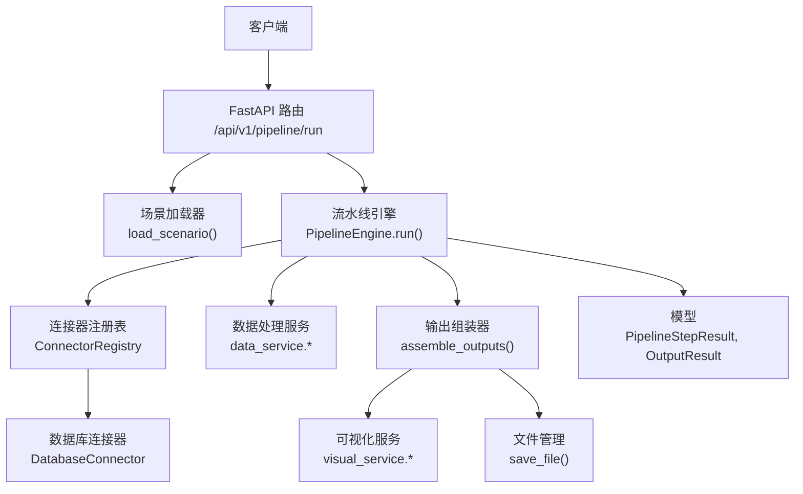
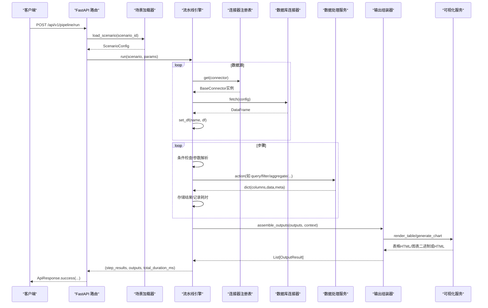
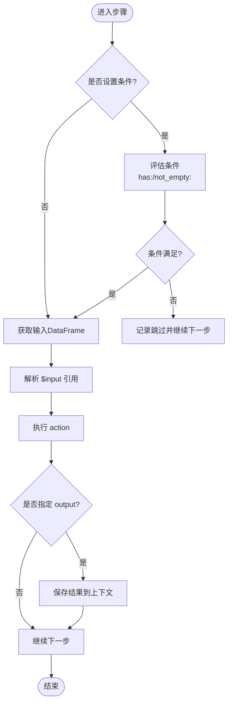
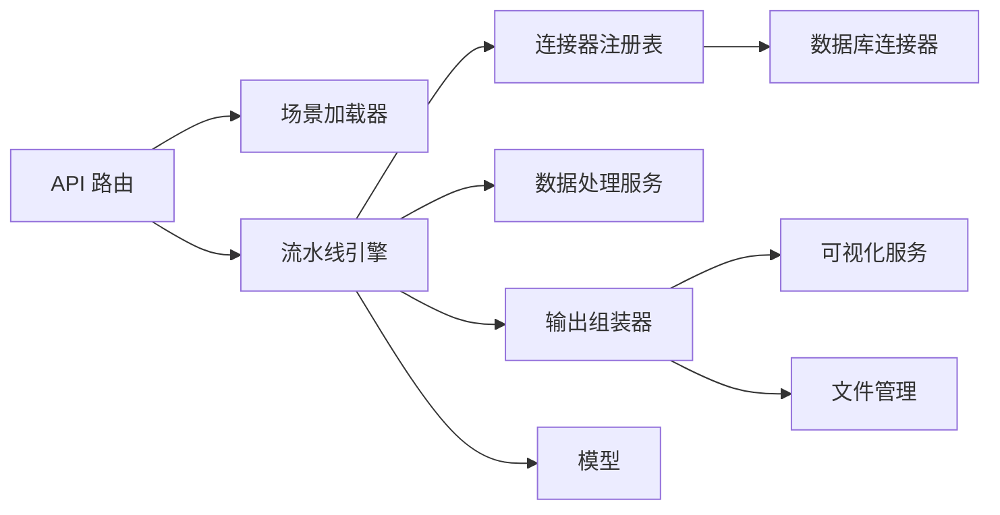

# 执行流程

<cite>
**本文引用的文件**
- [pipeline_engine.py](file://app/core/pipeline_engine.py)
- [scenario_loader.py](file://app/core/scenario_loader.py)
- [pipeline.py](file://app/api/v1/pipeline.py)
- [pipeline_models.py](file://app/models/pipeline_models.py)
- [connectors/__init__.py](file://app/core/connectors/__init__.py)
- [connectors/base.py](file://app/core/connectors/base.py)
- [connectors/database.py](file://app/core/connectors/database.py)
- [output_assembler.py](file://app/core/output_assembler.py)
- [data_service.py](file://app/services/data_service.py)
- [visual_service.py](file://app/services/visual_service.py)
- [errors.py](file://app/core/errors.py)
- [config.py](file://app/config.py)
- [sample_analysis.yaml](file://app/scenarios/sample_analysis.yaml)
- [product_increment_analysis.yaml](file://app/scenarios/product_increment_analysis.yaml)
</cite>

## 目录
1. [简介](#简介)
2. [项目结构](#项目结构)
3. [核心组件](#核心组件)
4. [架构总览](#架构总览)
5. [详细组件分析](#详细组件分析)
6. [依赖关系分析](#依赖关系分析)
7. [性能考量](#性能考量)
8. [故障排查指南](#故障排查指南)
9. [结论](#结论)
10. [附录](#附录)

## 简介
本文件围绕“场景驱动的流水线”完整执行流程展开，覆盖从场景加载、数据源连接、步骤执行到结果组装的全链路。重点解释条件检查机制、错误处理策略、性能监控与数据流转过程，并提供执行流程图与调试技巧，帮助开发者理解并优化流水线性能。

## 项目结构
该流水线由 API 路由触发，通过场景配置驱动，使用连接器获取数据，经引擎编排执行多个数据处理步骤，最终按输出定义生成表格、图表、文件或摘要等结果。

**图示来源**
- [pipeline.py:14-38](file://app/api/v1/pipeline.py#L14-L38)
- [scenario_loader.py:68-105](file://app/core/scenario_loader.py#L68-L105)
- [pipeline_engine.py:249-356](file://app/core/pipeline_engine.py#L249-L356)
- [connectors/__init__.py:13-60](file://app/core/connectors/__init__.py#L13-L60)
- [connectors/database.py:19-112](file://app/core/connectors/database.py#L19-L112)
- [output_assembler.py:19-38](file://app/core/output_assembler.py#L19-L38)
- [visual_service.py:51-87](file://app/services/visual_service.py#L51-L87)

**章节来源**
- [pipeline.py:14-38](file://app/api/v1/pipeline.py#L14-L38)
- [scenario_loader.py:68-105](file://app/core/scenario_loader.py#L68-L105)
- [pipeline_engine.py:249-356](file://app/core/pipeline_engine.py#L249-L356)

## 核心组件
- 场景加载器：从 YAML 读取场景配置，校验并构建 ScenarioConfig（包含 data_sources、pipeline、outputs）。
- 连接器注册表：统一管理多种数据源连接器（数据库、API、文件上传、文件 URL），提供统一 fetch 接口返回 DataFrame。
- 流水线引擎：编排执行数据源加载、步骤执行（含条件判断、参数解析、action 路由）、错误处理与性能计时，最后组装输出。
- 数据处理服务：封装 SQL 查询、筛选、聚合、透视、排序、去重、清洗、统计分析等能力。
- 输出组装器：根据 outputs 配置将上下文中的 DataFrame/结果渲染为 table/chart/file/summary。
- 可视化服务：基于 matplotlib/plotly 生成图表，支持 HTML/PNG/SVG；渲染 HTML 表格。
- 异常与响应：统一的 AppException、全局异常处理器与 ApiResponse。

**章节来源**
- [scenario_loader.py:21-56](file://app/core/scenario_loader.py#L21-L56)
- [connectors/__init__.py:13-60](file://app/core/connectors/__init__.py#L13-L60)
- [pipeline_engine.py:39-70](file://app/core/pipeline_engine.py#L39-L70)
- [data_service.py:35-73](file://app/services/data_service.py#L35-L73)
- [output_assembler.py:19-38](file://app/core/output_assembler.py#L19-L38)
- [visual_service.py:51-87](file://app/services/visual_service.py#L51-L87)
- [errors.py:15-42](file://app/core/errors.py#L15-L42)

## 架构总览
下图展示了从请求到响应的端到端调用序列，包括场景加载、数据源连接、步骤执行、输出组装与响应封装。

**图示来源**
- [pipeline.py:14-38](file://app/api/v1/pipeline.py#L14-L38)
- [scenario_loader.py:68-105](file://app/core/scenario_loader.py#L68-L105)
- [pipeline_engine.py:252-356](file://app/core/pipeline_engine.py#L252-L356)
- [connectors/__init__.py:13-60](file://app/core/connectors/__init__.py#L13-L60)
- [connectors/database.py:43-112](file://app/core/connectors/database.py#L43-L112)
- [data_service.py:128-158](file://app/services/data_service.py#L128-L158)
- [output_assembler.py:19-38](file://app/core/output_assembler.py#L19-L38)
- [visual_service.py:51-87](file://app/services/visual_service.py#L51-L87)

## 详细组件分析

### 场景加载与配置
- 场景配置文件位于 app/scenarios/*.yaml，包含 scenario_id、name、description、version、data_sources、pipeline、outputs。
- 加载器负责读取 YAML、校验结构、填充默认值并返回 Pydantic 模型对象。
- 示例场景演示了“上传 CSV -> 清洗 -> 统计 -> 输出表格/文件/摘要”的完整流程；产品增量分析场景则展示多数据源（SQLite）与多步骤聚合/统计。

**章节来源**
- [scenario_loader.py:21-56](file://app/core/scenario_loader.py#L21-L56)
- [scenario_loader.py:68-105](file://app/core/scenario_loader.py#L68-L105)
- [sample_analysis.yaml:1-68](file://app/scenarios/sample_analysis.yaml#L1-L68)
- [product_increment_analysis.yaml:1-126](file://app/scenarios/product_increment_analysis.yaml#L1-L126)

### 数据源连接
- 连接器通过注册表模式集中管理，支持 database、api、file_upload、file_url。
- 数据库连接器支持 SQLite（通过 DuckDB 直接查询 .db）与 MySQL/PostgreSQL（通过 SQLAlchemy）。
- 引擎在数据源阶段调用 connector.fetch(config)，将返回的 DataFrame 以 name 键存入上下文，供后续步骤引用。

**章节来源**
- [connectors/__init__.py:13-60](file://app/core/connectors/__init__.py#L13-L60)
- [connectors/base.py:11-24](file://app/core/connectors/base.py#L11-L24)
- [connectors/database.py:19-112](file://app/core/connectors/database.py#L19-L112)
- [pipeline_engine.py:266-272](file://app/core/pipeline_engine.py#L266-L272)

### 步骤执行与条件检查
- 每个步骤包含 name、action、input、params、output、on_error、condition。
- 条件表达式支持 has:ref 与 not_empty:ref，用于跳过不满足条件的步骤。
- 参数映射支持 $input.xxx 引用，自动替换为请求参数。
- action 路由至数据处理服务，如 query、filter、aggregate、pivot、sort、dedup、clean、statistics。
- 每步执行前后记录耗时，成功时写入 PipelineStepResult，失败时依据 on_error 决定 skip 或 abort。

**图示来源**
- [pipeline_engine.py:100-119](file://app/core/pipeline_engine.py#L100-L119)
- [pipeline_engine.py:131-234](file://app/core/pipeline_engine.py#L131-L234)
- [pipeline_engine.py:274-315](file://app/core/pipeline_engine.py#L274-L315)

**章节来源**
- [pipeline_engine.py:100-119](file://app/core/pipeline_engine.py#L100-L119)
- [pipeline_engine.py:131-234](file://app/core/pipeline_engine.py#L131-L234)
- [pipeline_engine.py:274-315](file://app/core/pipeline_engine.py#L274-L315)

### 数据处理服务
- 统一将 DataFrameInput 转换为 pandas DataFrame，并将结果转为可序列化字典（columns、data、meta）。
- 安全限制：SQL 仅允许 SELECT/WITH，防止注入。
- 提供筛选、聚合、透视、排序、去重、清洗、统计分析等丰富能力，并对参数进行校验与错误包装。

**章节来源**
- [data_service.py:35-73](file://app/services/data_service.py#L35-L73)
- [data_service.py:128-158](file://app/services/data_service.py#L128-L158)
- [data_service.py:178-210](file://app/services/data_service.py#L178-L210)
- [data_service.py:218-243](file://app/services/data_service.py#L218-L243)
- [data_service.py:248-272](file://app/services/data_service.py#L248-L272)
- [data_service.py:277-284](file://app/services/data_service.py#L277-L284)
- [data_service.py:289-295](file://app/services/data_service.py#L289-L295)
- [data_service.py:300-395](file://app/services/data_service.py#L300-L395)
- [data_service.py:400-446](file://app/services/data_service.py#L400-L446)

### 输出组装与可视化
- 输出类型：table、chart、file、summary。
- table：渲染 HTML 表格，支持排序、最大行数、列宽、条件样式。
- chart：支持 PNG/SVG/HTML，内置多种图表类型，自动保存到临时文件并返回下载信息。
- file：导出 CSV/XLSX/JSON，返回文件名、格式、下载链接与行列数。
- summary：生成精简 JSON 摘要，便于 Agent 消费。

**章节来源**
- [output_assembler.py:19-38](file://app/core/output_assembler.py#L19-L38)
- [output_assembler.py:62-80](file://app/core/output_assembler.py#L62-L80)
- [output_assembler.py:83-115](file://app/core/output_assembler.py#L83-L115)
- [output_assembler.py:118-151](file://app/core/output_assembler.py#L118-L151)
- [output_assembler.py:154-188](file://app/core/output_assembler.py#L154-L188)
- [visual_service.py:51-87](file://app/services/visual_service.py#L51-L87)
- [visual_service.py:333-401](file://app/services/visual_service.py#L333-L401)

### 错误处理与响应
- 业务异常统一使用 AppException，携带 code、message、data。
- 全局异常处理器将业务异常、参数校验异常、未预期异常分别映射为 ApiResponse。
- 流水线步骤中捕获 AppException 与普通 Exception，按 on_error 策略决定是否继续或终止。

**章节来源**
- [errors.py:15-42](file://app/core/errors.py#L15-L42)
- [errors.py:45-73](file://app/core/errors.py#L45-L73)
- [pipeline_engine.py:317-349](file://app/core/pipeline_engine.py#L317-L349)

## 依赖关系分析
- API 层依赖场景加载器与流水线引擎。
- 引擎依赖连接器注册表与具体连接器、数据处理服务、输出组装器。
- 输出组装器依赖可视化服务与文件管理。
- 所有模块通过 Pydantic 模型进行数据契约约束，保证类型安全与可序列化。

**图示来源**
- [pipeline.py:14-38](file://app/api/v1/pipeline.py#L14-L38)
- [scenario_loader.py:68-105](file://app/core/scenario_loader.py#L68-L105)
- [pipeline_engine.py:249-356](file://app/core/pipeline_engine.py#L249-L356)
- [connectors/__init__.py:13-60](file://app/core/connectors/__init__.py#L13-L60)
- [connectors/database.py:19-112](file://app/core/connectors/database.py#L19-L112)
- [output_assembler.py:19-38](file://app/core/output_assembler.py#L19-L38)
- [visual_service.py:51-87](file://app/services/visual_service.py#L51-L87)

**章节来源**
- [pipeline.py:14-38](file://app/api/v1/pipeline.py#L14-L38)
- [pipeline_engine.py:249-356](file://app/core/pipeline_engine.py#L249-L356)
- [connectors/__init__.py:13-60](file://app/core/connectors/__init__.py#L13-L60)
- [output_assembler.py:19-38](file://app/core/output_assembler.py#L19-L38)

## 性能考量
- 步骤级计时：每个步骤开始与结束时计算耗时，累计到 step_results 中，便于定位瓶颈。
- 总时长统计：run 方法记录整体执行时间，返回 total_duration_ms。
- 数据转换开销：多次 DataFrame 转换与序列化可能带来开销，建议减少不必要的中间结果。
- SQL 安全与性能：仅允许 SELECT/WITH，避免危险操作；复杂查询建议在数据库侧优化。
- 图表渲染：HTML 模式依赖 plotly，PNG/SVG 使用 matplotlib，注意内存与 CPU 占用。
- 文件输出：大文件导出会占用磁盘与内存，建议合理设置 max_rows 与分页。

[本节为通用指导，无需特定文件引用]

## 故障排查指南
- 场景未找到或 YAML 解析失败：检查 scenarios_dir 路径与 YAML 格式，确认 scenario_id 与文件名一致。
- 连接器未知类型：确认已注册对应连接器类型，或在配置中使用支持的类型。
- SQL 执行错误：确保 SQL 以 SELECT/WITH 开头，且不含危险关键字；检查数据库连接与权限。
- 步骤失败：查看 step_results 中的 status 与 message，结合 on_error 策略判断是否继续。
- 输出组装失败：检查 outputs.source 是否存在于上下文，以及输出类型与配置是否匹配。
- 日志与调试：启用 INFO 级别日志，关注“数据源加载完成”“步骤执行成功/失败”等关键日志。

**章节来源**
- [scenario_loader.py:68-105](file://app/core/scenario_loader.py#L68-L105)
- [connectors/__init__.py:27-36](file://app/core/connectors/__init__.py#L27-L36)
- [connectors/database.py:43-68](file://app/core/connectors/database.py#L43-L68)
- [data_service.py:128-158](file://app/services/data_service.py#L128-L158)
- [pipeline_engine.py:317-349](file://app/core/pipeline_engine.py#L317-L349)
- [output_assembler.py:19-38](file://app/core/output_assembler.py#L19-L38)

## 结论
该流水线通过 YAML 场景配置实现声明式编排，具备灵活的数据源接入、丰富的数据处理动作、完善的条件控制与错误处理机制，并能生成多样化的输出形式。借助步骤级与总体性能指标，开发者可快速定位瓶颈并进行优化。

[本节为总结性内容，无需特定文件引用]

## 附录
- 配置项说明：应用配置（端口、日志级别、场景目录、数据库路径等）通过 Settings 管理，支持环境变量与 .env 文件。
- 模型定义：PipelineRunRequest、PipelineStepResult、OutputResult 等模型定义了请求与响应的数据结构。
- 示例场景：sample_analysis.yaml 与 product_increment_analysis.yaml 提供了典型用法参考。

**章节来源**
- [config.py:6-22](file://app/config.py#L6-L22)
- [pipeline_models.py:11-46](file://app/models/pipeline_models.py#L11-L46)
- [sample_analysis.yaml:1-68](file://app/scenarios/sample_analysis.yaml#L1-L68)
- [product_increment_analysis.yaml:1-126](file://app/scenarios/product_increment_analysis.yaml#L1-L126)