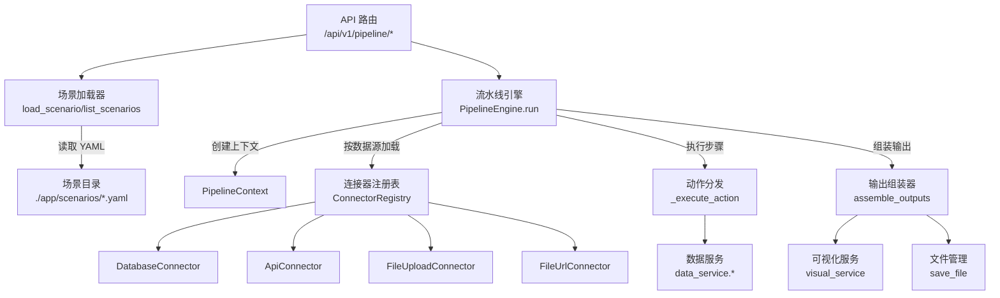
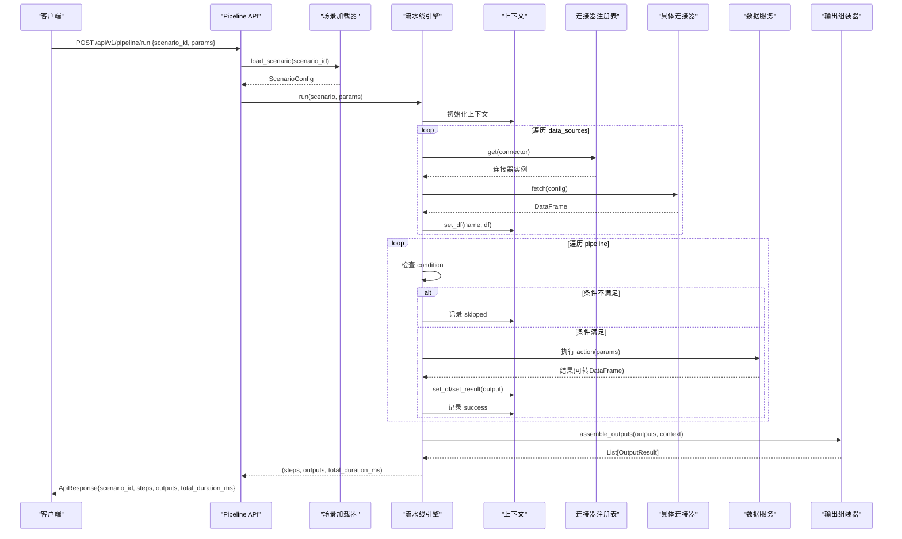
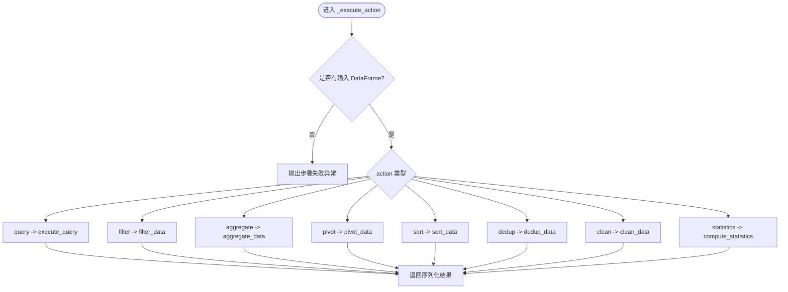
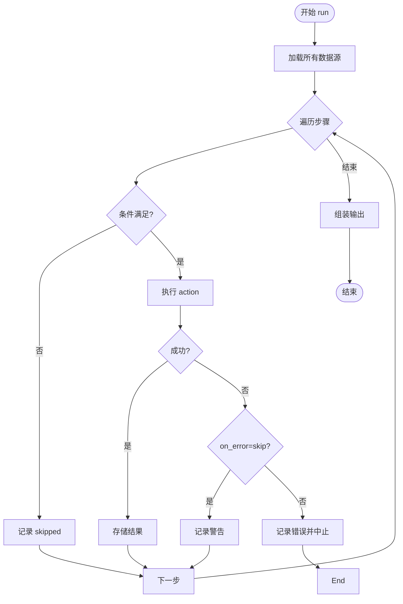
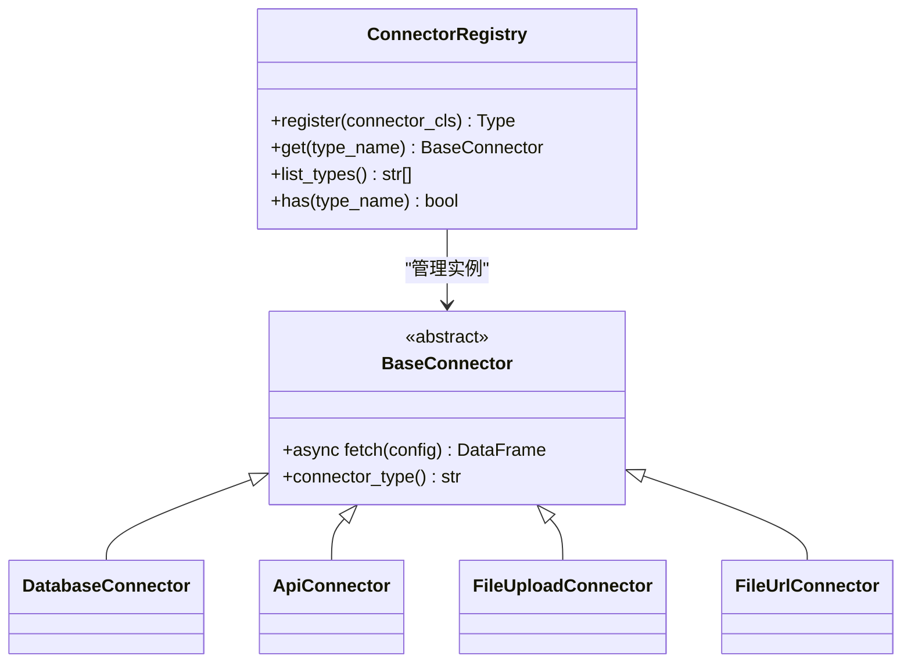
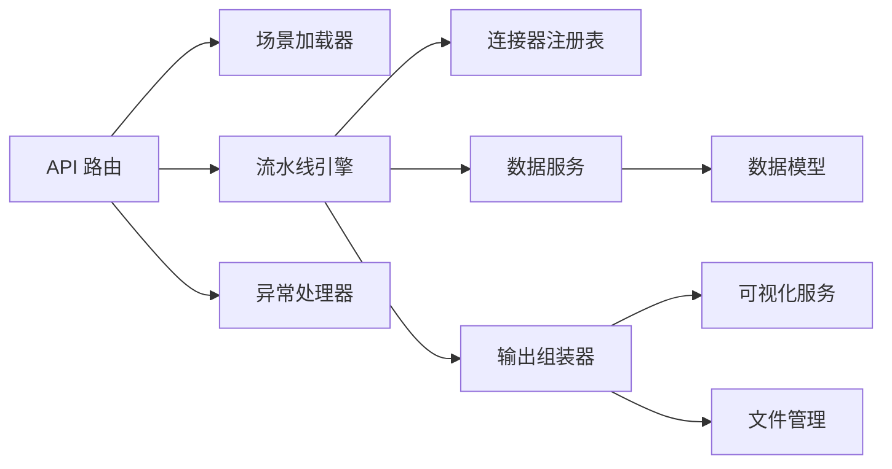

# 流水线引擎

<cite>
**本文引用的文件**
- [pipeline_engine.py](file://app/core/pipeline_engine.py)
- [scenario_loader.py](file://app/core/scenario_loader.py)
- [output_assembler.py](file://app/core/output_assembler.py)
- [connectors/__init__.py](file://app/core/connectors/__init__.py)
- [connectors/base.py](file://app/core/connectors/base.py)
- [data_service.py](file://app/services/data_service.py)
- [data_models.py](file://app/models/data_models.py)
- [pipeline_models.py](file://app/models/pipeline_models.py)
- [pipeline_api.py](file://app/api/v1/pipeline.py)
- [product_increment_analysis.yaml](file://app/scenarios/product_increment_analysis.yaml)
- [sample_analysis.yaml](file://app/scenarios/sample_analysis.yaml)
- [errors.py](file://app/core/errors.py)
- [response.py](file://app/core/response.py)
- [config.py](file://app/config.py)
</cite>

## 目录
1. [简介](#简介)
2. [项目结构](#项目结构)
3. [核心组件](#核心组件)
4. [架构总览](#架构总览)
5. [详细组件分析](#详细组件分析)
6. [依赖关系分析](#依赖关系分析)
7. [性能考量](#性能考量)
8. [故障排查指南](#故障排查指南)
9. [结论](#结论)
10. [附录](#附录)

## 简介
本仓库实现了一个“场景驱动”的流水线引擎：通过 YAML 定义数据源、处理步骤与输出，引擎自动完成从数据加载、条件分支、动作执行到结果组装的全流程。支持多种内置数据处理动作（查询、筛选、聚合、透视、排序、去重、清洗、统计），并可通过连接器扩展新的数据接入方式。文档将深入解析其设计原理、YAML 语法、执行流程、错误处理机制，并提供产品增量分析与样本数据分析两个业务示例，同时给出自定义扩展、调试技巧与性能优化建议。

## 项目结构
- 入口与路由：FastAPI 提供 /api/v1/pipeline/run 执行接口与 /api/v1/pipeline/scenarios 列出场景。
- 场景配置：YAML 位于 app/scenarios，描述数据源、步骤与输出。
- 引擎核心：PipelineEngine 负责上下文管理、参数解析、条件评估、动作调度与错误处理。
- 数据服务：封装 SQL、筛选、聚合、透视、排序、去重、清洗、统计等能力。
- 连接器：统一抽象 BaseConnector + 注册表 ConnectorRegistry，支持数据库、API、文件上传/URL 等。
- 输出组装：根据输出类型渲染表格、图表、文件或摘要。
- 模型与响应：Pydantic 模型定义请求/响应结构；统一错误码与异常处理器。

**图示来源**
- [pipeline_api.py:14-47](file://app/api/v1/pipeline.py#L14-L47)
- [scenario_loader.py:68-128](file://app/core/scenario_loader.py#L68-L128)
- [pipeline_engine.py:249-357](file://app/core/pipeline_engine.py#L249-L357)
- [connectors/__init__.py:13-60](file://app/core/connectors/__init__.py#L13-L60)
- [output_assembler.py:19-189](file://app/core/output_assembler.py#L19-L189)

**章节来源**
- [pipeline_api.py:1-48](file://app/api/v1/pipeline.py#L1-L48)
- [scenario_loader.py:1-128](file://app/core/scenario_loader.py#L1-L128)
- [pipeline_engine.py:1-357](file://app/core/pipeline_engine.py#L1-L357)
- [connectors/__init__.py:1-60](file://app/core/connectors/__init__.py#L1-L60)
- [output_assembler.py:1-189](file://app/core/output_assembler.py#L1-L189)

## 核心组件
- PipelineEngine：编排执行，维护中间数据与步骤结果，支持条件分支与错误策略。
- ScenarioLoader：加载并校验 YAML 场景配置，提供场景列表。
- ConnectorRegistry：注册与获取连接器实例，解耦数据接入。
- Data Service：统一的 DataFrame 处理能力（SQL、过滤、聚合、透视、排序、去重、清洗、统计）。
- Output Assembler：将上下文中的 DataFrame/结果渲染为 table/chart/file/summary。
- Models & Response：标准化输入输出与错误码，配合全局异常处理器返回一致格式。

**章节来源**
- [pipeline_engine.py:37-357](file://app/core/pipeline_engine.py#L37-L357)
- [scenario_loader.py:19-128](file://app/core/scenario_loader.py#L19-L128)
- [connectors/__init__.py:13-60](file://app/core/connectors/__init__.py#L13-L60)
- [data_service.py:33-447](file://app/services/data_service.py#L33-L447)
- [output_assembler.py:19-189](file://app/core/output_assembler.py#L19-L189)
- [pipeline_models.py:11-46](file://app/models/pipeline_models.py#L11-L46)
- [response.py:12-103](file://app/core/response.py#L12-L103)

## 架构总览
下图展示了从 API 调用到最终输出的完整时序，包括场景加载、数据源接入、步骤执行、条件分支、错误处理与输出组装。

**图示来源**
- [pipeline_api.py:14-47](file://app/api/v1/pipeline.py#L14-L47)
- [scenario_loader.py:68-128](file://app/core/scenario_loader.py#L68-L128)
- [pipeline_engine.py:249-357](file://app/core/pipeline_engine.py#L249-L357)
- [connectors/__init__.py:13-60](file://app/core/connectors/__init__.py#L13-L60)
- [output_assembler.py:19-189](file://app/core/output_assembler.py#L19-L189)

## 详细组件分析

### 场景与 YAML 配置
- 场景元信息：scenario_id、name、description、version。
- 数据源 data_sources：每个数据源包含 name、connector、config。connector 由注册表管理，config 由具体连接器解释（如 database 的 driver/path/sql）。
- 步骤 pipeline：每个步骤包含 name、action、input、params、output、on_error、condition。
- 输出 outputs：type 可为 table/chart/file/summary，source 引用上下文中的名称，config 控制渲染细节。

YAML 示例要点：
- 参数传递：在 connector config 或 step params 中使用 $input.xxx 占位符，引擎会替换为请求参数。
- 条件分支：condition 支持 has:ref 与 not_empty:ref 两种简单表达式。
- 错误处理：on_error 支持 skip（跳过）与 abort（终止）。

**章节来源**
- [scenario_loader.py:21-56](file://app/core/scenario_loader.py#L21-L56)
- [product_increment_analysis.yaml:1-126](file://app/scenarios/product_increment_analysis.yaml#L1-L126)
- [sample_analysis.yaml:1-68](file://app/scenarios/sample_analysis.yaml#L1-L68)
- [pipeline_engine.py:77-119](file://app/core/pipeline_engine.py#L77-L119)

### 参数解析与条件评估
- 参数解析：递归扫描配置字典，遇到字符串值以 $input. 开头则从上下文 input_params 中取值替换；param_mapping 子字典也会被展开。
- 条件评估：
  - has:ref — 判断上下文中是否存在 ref（DataFrame 或非 DataFrame 结果）。
  - not_empty:ref — 若存在且为 DataFrame，则判断是否非空。

**章节来源**
- [pipeline_engine.py:77-119](file://app/core/pipeline_engine.py#L77-L119)

### 动作执行器与数据服务
- 动作类型：query、filter、aggregate、pivot、sort、dedup、clean、statistics。
- 执行流程：将输入 DataFrame 转换为标准输入模型，构造对应 Request，调用 data_service 对应函数，返回可序列化的 dict（含 columns/data/meta）。
- 安全限制：SQL 仅允许 SELECT/WITH，防止注入与危险操作。
- 清洗操作：fill_na、drop_na、cast_type、strip_text、replace_text、drop_outliers 等，支持列级与全列操作。

**图示来源**
- [pipeline_engine.py:131-234](file://app/core/pipeline_engine.py#L131-L234)
- [data_service.py:128-447](file://app/services/data_service.py#L128-L447)

**章节来源**
- [pipeline_engine.py:124-244](file://app/core/pipeline_engine.py#L124-L244)
- [data_service.py:33-447](file://app/services/data_service.py#L33-L447)
- [data_models.py:13-145](file://app/models/data_models.py#L13-L145)

### 执行流程与错误处理
- 数据源加载：按顺序连接并 fetch，将结果存入上下文，记录行数日志。
- 步骤执行：
  - 先评估 condition，不满足则记录 skipped。
  - 解析 params 中的 $input 引用。
  - 执行 action，捕获 AppException 与通用异常。
  - 根据 on_error 决定继续或中止。
  - 将结果写入上下文（DataFrame 或普通结果）。
- 输出组装：遍历 outputs，按 type 渲染为 table/chart/file/summary，单个输出失败不影响其他输出。

**图示来源**
- [pipeline_engine.py:249-357](file://app/core/pipeline_engine.py#L249-L357)
- [output_assembler.py:19-38](file://app/core/output_assembler.py#L19-L38)

**章节来源**
- [pipeline_engine.py:249-357](file://app/core/pipeline_engine.py#L249-L357)
- [output_assembler.py:19-189](file://app/core/output_assembler.py#L19-L189)

### 连接器扩展
- 基类：BaseConnector 要求实现 async fetch(config) 和 classmethod connector_type()。
- 注册表：ConnectorRegistry.register 注册连接器类型，get(type_name) 获取实例。
- 扩展方式：新建连接器类继承 BaseConnector，实现 fetch 逻辑，并在模块导入时注册到注册表。

**图示来源**
- [connectors/base.py:11-24](file://app/core/connectors/base.py#L11-L24)
- [connectors/__init__.py:13-60](file://app/core/connectors/__init__.py#L13-L60)

**章节来源**
- [connectors/base.py:1-24](file://app/core/connectors/base.py#L1-L24)
- [connectors/__init__.py:1-60](file://app/core/connectors/__init__.py#L1-L60)

### 输出类型与渲染
- table：调用 visual_service.render_table，返回格式化表格数据。
- chart：根据 chart_type/x/y/title 等生成图表，支持 png/svg/html。
- file：导出 csv/xlsx/json，保存文件并返回下载链接与行列数。
- summary：生成精简 JSON 摘要，包含行列数、列名、数据类型、数值列统计与前 N 行预览。

**章节来源**
- [output_assembler.py:62-189](file://app/core/output_assembler.py#L62-L189)

## 依赖关系分析
- API 层依赖场景加载器与引擎。
- 引擎依赖连接器注册表、数据服务、输出组装器。
- 数据服务依赖 Pydantic 模型进行参数校验与转换。
- 输出组装器依赖可视化服务与文件管理。
- 全局异常处理器统一错误响应格式。

**图示来源**
- [pipeline_api.py:14-47](file://app/api/v1/pipeline.py#L14-L47)
- [pipeline_engine.py:249-357](file://app/core/pipeline_engine.py#L249-L357)
- [data_service.py:33-447](file://app/services/data_service.py#L33-L447)
- [output_assembler.py:19-189](file://app/core/output_assembler.py#L19-L189)
- [errors.py:15-74](file://app/core/errors.py#L15-L74)

**章节来源**
- [pipeline_api.py:1-48](file://app/api/v1/pipeline.py#L1-L48)
- [pipeline_engine.py:1-357](file://app/core/pipeline_engine.py#L1-L357)
- [data_service.py:1-447](file://app/services/data_service.py#L1-L447)
- [output_assembler.py:1-189](file://app/core/output_assembler.py#L1-L189)
- [errors.py:1-74](file://app/core/errors.py#L1-L74)

## 性能考量
- 数据源批量加载：按顺序加载，避免并行竞争资源；如需并发，可在连接器层引入异步并发与限流。
- SQL 查询：使用内存 DuckDB，适合中小规模数据；大数据集建议下推过滤/聚合至数据库。
- 中间结果缓存：PipelineContext 已缓存 DataFrame 与结果，避免重复计算；注意内存占用。
- 输出渲染：table/summary 轻量；chart 可能较重，按需启用。
- 日志与度量：记录每步耗时与总耗时，便于定位瓶颈。
- 参数解析：$input 替换为浅拷贝，避免深拷贝开销；大对象尽量引用而非复制。

[本节为通用指导，无需特定文件来源]

## 故障排查指南
- 常见错误码：
  - 6001 场景不存在：检查 scenario_id 与 YAML 文件名一致。
  - 6002 步骤执行失败：查看步骤日志与 on_error 策略。
  - 2001 文件解析失败：确认文件格式与编码。
  - 2002 SQL 执行错误：确保仅 SELECT/WITH，检查表名与列名。
  - 2003 数据为空：检查数据源与过滤条件。
  - 2004 数据类型错误：检查列类型与转换参数。
- 调试技巧：
  - 开启日志级别 INFO/DEBUG，观察步骤耗时与消息。
  - 使用 sample_analysis.yaml 快速验证流程。
  - 逐步缩小问题范围：先运行单一 action，再组合多步骤。
  - 检查 $input 映射是否正确，确认上下文是否存在所需引用。
- 恢复策略：
  - on_error=skip 用于容错，保证后续步骤继续。
  - on_error=abort 用于关键步骤失败立即终止，避免污染下游。

**章节来源**
- [response.py:12-103](file://app/core/response.py#L12-L103)
- [errors.py:15-74](file://app/core/errors.py#L15-L74)
- [pipeline_engine.py:317-349](file://app/core/pipeline_engine.py#L317-L349)
- [data_service.py:128-158](file://app/services/data_service.py#L128-L158)

## 结论
该流水线引擎以 YAML 为中心，实现了声明式的数据处理编排。通过连接器注册表与数据服务解耦了数据接入与处理逻辑，结合条件分支与错误策略，提供了灵活可靠的执行框架。配合输出组装器，可快速生成表格、图表、文件与摘要，满足多样化业务需求。通过合理配置与扩展，可支撑产品增量分析、样本数据分析等多种场景。

[本节为总结性内容，无需特定文件来源]

## 附录

### YAML 语法与结构速查
- 顶层字段：scenario_id、name、description、version。
- data_sources：数组，每项包含 name、connector、config。
- pipeline：数组，每项包含 name、action、input、params、output、on_error、condition。
- outputs：数组，每项包含 name、type、source、config。
- 参数占位符：$input.key，将在执行时替换为请求参数。
- 条件表达式：has:ref、not_empty:ref。

**章节来源**
- [scenario_loader.py:21-56](file://app/core/scenario_loader.py#L21-L56)
- [pipeline_engine.py:77-119](file://app/core/pipeline_engine.py#L77-L119)

### 业务场景示例

#### 产品增量分析
- 目标：基于已入库的每日余额、增量明细与月度目标，进行余额排名、增量汇总与目标对比。
- 数据源：database 连接器，driver=sqlite，path 指向 hiagent.db，sql 查询各表。
- 步骤：
  - query：按产品系列/期限分类/日期维度排序余额。
  - aggregate：按产品系列/映射分组汇总增长/流失/净增长。
  - statistics：对余额数据进行描述性统计。
- 输出：table（余额排名、增量汇总、映射汇总）、summary（余额摘要）。

**章节来源**
- [product_increment_analysis.yaml:1-126](file://app/scenarios/product_increment_analysis.yaml#L1-L126)
- [pipeline_engine.py:249-357](file://app/core/pipeline_engine.py#L249-L357)
- [data_service.py:128-447](file://app/services/data_service.py#L128-L447)

#### 样本数据分析
- 目标：上传 CSV，自动清洗、排序与统计分析，输出表格、文件与摘要。
- 数据源：file_upload 连接器，通过 param_mapping 将 $input.file_content/$input.filename 传入。
- 步骤：
  - clean：填充缺失值、去除文本空格。
  - sort：按指定列降序排序。
  - statistics：描述性统计。
- 输出：table（统计摘要）、file（导出 cleaned_data）、summary（数据摘要）。

**章节来源**
- [sample_analysis.yaml:1-68](file://app/scenarios/sample_analysis.yaml#L1-L68)
- [pipeline_engine.py:249-357](file://app/core/pipeline_engine.py#L249-L357)
- [data_service.py:300-395](file://app/services/data_service.py#L300-L395)

### 自定义动作与处理逻辑扩展
- 新增数据动作：
  - 在 _execute_action 中添加新 action 分支，构造对应 Request，调用 data_service 新函数。
  - 在 data_service 中实现处理逻辑，返回 df_to_output 的结果。
  - 在 models/data_models.py 中补充请求/响应模型。
- 新增连接器：
  - 新建类继承 BaseConnector，实现 fetch 与 connector_type。
  - 在 connectors/__init__.py 中导入并注册。
- 新增输出类型：
  - 在 output_assembler._assemble_single 中增加分支，实现渲染逻辑。
  - 在 models/visual_models.py 中补充配置模型（如有）。

**章节来源**
- [pipeline_engine.py:131-234](file://app/core/pipeline_engine.py#L131-L234)
- [data_service.py:33-447](file://app/services/data_service.py#L33-L447)
- [connectors/base.py:11-24](file://app/core/connectors/base.py#L11-L24)
- [connectors/__init__.py:48-60](file://app/core/connectors/__init__.py#L48-L60)
- [output_assembler.py:41-59](file://app/core/output_assembler.py#L41-L59)

### 调试技巧与性能优化建议
- 调试：
  - 使用 sample_analysis.yaml 快速验证端到端流程。
  - 逐步启用步骤，定位问题步骤。
  - 检查 $input 映射与条件表达式。
  - 关注日志中的步骤耗时与错误消息。
- 优化：
  - 将过滤/聚合下推到数据库层，减少数据传输。
  - 合理使用 on_error=skip 提升鲁棒性。
  - 控制输出类型，避免不必要的图表渲染。
  - 监控内存使用，及时释放大型 DataFrame。

[本节为通用指导，无需特定文件来源]