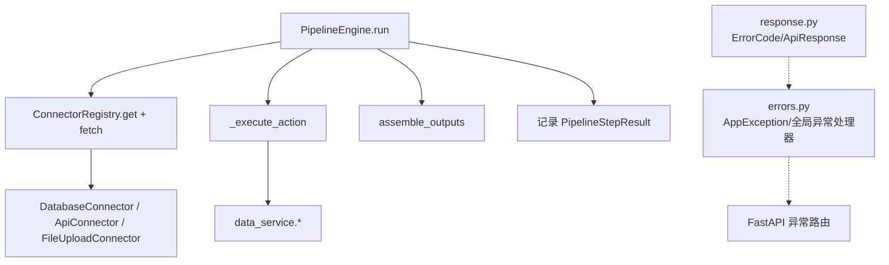
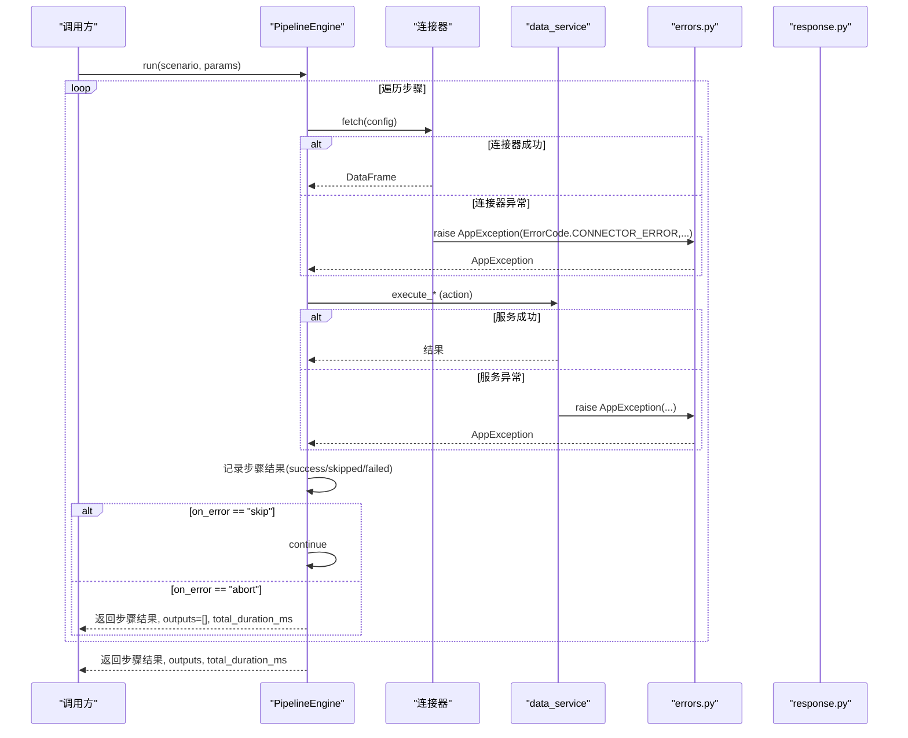
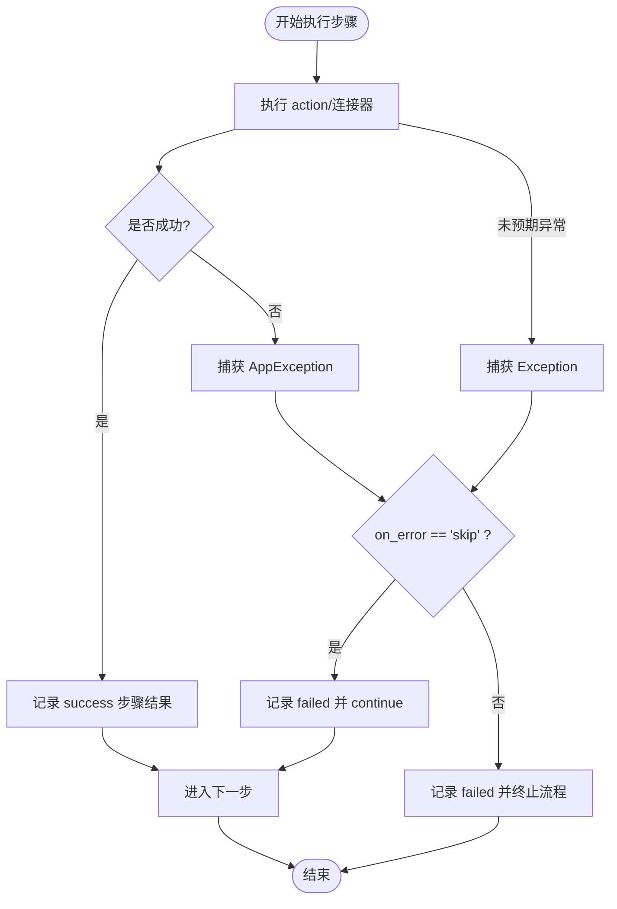
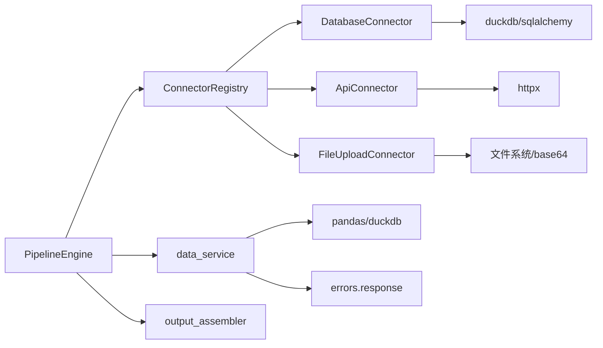

# 错误处理

<cite>
**本文引用的文件**
- [pipeline_engine.py](file://app/core/pipeline_engine.py)
- [errors.py](file://app/core/errors.py)
- [response.py](file://app/core/response.py)
- [scenario_loader.py](file://app/core/scenario_loader.py)
- [database.py](file://app/core/connectors/database.py)
- [api_connector.py](file://app/core/connectors/api_connector.py)
- [file_upload.py](file://app/core/connectors/file_upload.py)
- [data_service.py](file://app/services/data_service.py)
- [pipeline_models.py](file://app/models/pipeline_models.py)
- [sample_analysis.yaml](file://app/scenarios/sample_analysis.yaml)
</cite>

## 目录
1. [简介](#简介)
2. [项目结构](#项目结构)
3. [核心组件](#核心组件)
4. [架构总览](#架构总览)
5. [详细组件分析](#详细组件分析)
6. [依赖关系分析](#依赖关系分析)
7. [性能与稳定性考量](#性能与稳定性考量)
8. [故障诊断指南](#故障诊断指南)
9. [结论](#结论)
10. [附录](#附录)

## 简介
本文件系统性说明流水线引擎的错误处理机制，覆盖错误类型分类、异常捕获策略、错误恢复选项（skip/abort）、on_error 配置的作用与使用场景，并给出常见错误的诊断方法与解决方案，包括数据源连接失败、SQL 语法错误、数据处理异常等。

## 项目结构
围绕错误处理的关键模块分布如下：
- 流水线执行与步骤控制：pipeline_engine.py
- 统一错误码与响应封装：response.py
- 自定义异常与全局异常处理器：errors.py
- 场景配置加载与 on_error 默认值：scenario_loader.py
- 数据连接器（数据库/API/文件上传）：connectors/*
- 数据处理服务（SQL、清洗、统计等）：services/data_service.py
- 模型定义（步骤结果、输出等）：models/pipeline_models.py
- 示例场景配置（含 on_error 用法）：scenarios/sample_analysis.yaml

图表来源
- [pipeline_engine.py:249-356](file://app/core/pipeline_engine.py#L249-L356)
- [database.py:43-68](file://app/core/connectors/database.py#L43-L68)
- [api_connector.py:37-92](file://app/core/connectors/api_connector.py#L37-L92)
- [file_upload.py:31-63](file://app/core/connectors/file_upload.py#L31-L63)
- [data_service.py:128-158](file://app/services/data_service.py#L128-L158)
- [errors.py:15-73](file://app/core/errors.py#L15-L73)
- [response.py:12-103](file://app/core/response.py#L12-L103)

章节来源
- [pipeline_engine.py:249-356](file://app/core/pipeline_engine.py#L249-L356)
- [scenario_loader.py:28-36](file://app/core/scenario_loader.py#L28-L36)

## 核心组件
- PipelineEngine：负责加载数据源、按步骤执行 action、捕获异常、根据 on_error 决定 skip 或 abort，并组装输出。
- AppException：业务异常，携带 code/message/data，被各层抛出并由全局异常处理器转换为统一响应。
- ErrorCode：集中定义错误码（如 CONNECTOR_ERROR、SQL_EXECUTION_ERROR、PIPELINE_STEP_FAILED 等）。
- 数据连接器：将外部数据源（数据库、API、文件）统一为 DataFrame；内部异常统一包装为 AppException。
- data_service：提供 SQL 查询、过滤、聚合、透视、排序、去重、清洗、统计等原子能力，并对输入参数和运行期错误进行校验与报错。
- scenario_loader：加载 YAML 场景配置，定义 PipelineStepConfig 的 on_error 默认值为 "abort"。
- pipeline_models：定义步骤执行结果、输出结果及请求/响应模型。

章节来源
- [pipeline_engine.py:39-70](file://app/core/pipeline_engine.py#L39-L70)
- [errors.py:15-73](file://app/core/errors.py#L15-L73)
- [response.py:12-103](file://app/core/response.py#L12-L103)
- [scenario_loader.py:28-36](file://app/core/scenario_loader.py#L28-L36)
- [pipeline_models.py:11-46](file://app/models/pipeline_models.py#L11-L46)

## 架构总览
流水线执行时，每个步骤在 try/except 中执行，捕获两类异常：
- AppException：业务异常，包含明确错误码与消息。
- Exception：未预期异常，会被包装为“未预期异常”信息。

根据步骤配置的 on_error：
- skip：记录失败步骤后继续执行后续步骤。
- abort：记录失败步骤后立即终止流程，返回已执行的步骤结果与空输出列表。

图表来源
- [pipeline_engine.py:274-356](file://app/core/pipeline_engine.py#L274-L356)
- [database.py:43-68](file://app/core/connectors/database.py#L43-L68)
- [api_connector.py:37-92](file://app/core/connectors/api_connector.py#L37-L92)
- [data_service.py:128-158](file://app/services/data_service.py#L128-L158)
- [errors.py:30-73](file://app/core/errors.py#L30-L73)
- [response.py:71-103](file://app/core/response.py#L71-L103)

## 详细组件分析

### 错误类型分类
- 连接器错误（CONNECTOR_ERROR）：数据源不可用、驱动不支持、URL/路径缺失、网络超时、JSON 解析失败、base64 解码失败等。
- SQL 执行错误（SQL_EXECUTION_ERROR）：仅允许 SELECT/WITH、检测到危险关键字、DuckDB 执行异常。
- 数据处理错误（DATA_TYPE_ERROR/DATASET_ERROR/PARAM_VALIDATION_ERROR）：列不存在、运算符不支持、聚合函数非法、类型转换失败、缺少必要列等。
- 文件解析错误（FILE_PARSE_ERROR）：格式不支持、内容空、编码问题。
- 流水线步骤失败（PIPELINE_STEP_FAILED）：上下文引用缺失、无法将结果转为 DataFrame、不支持的 action 等。
- 场景相关错误（SCENARIO_NOT_FOUND）：YAML 不存在、解析失败、校验失败。

章节来源
- [response.py:12-68](file://app/core/response.py#L12-L68)
- [database.py:43-68](file://app/core/connectors/database.py#L43-L68)
- [api_connector.py:37-92](file://app/core/connectors/api_connector.py#L37-L92)
- [file_upload.py:31-63](file://app/core/connectors/file_upload.py#L31-L63)
- [data_service.py:128-158](file://app/services/data_service.py#L128-L158)
- [data_service.py:178-210](file://app/services/data_service.py#L178-L210)
- [data_service.py:218-243](file://app/services/data_service.py#L218-L243)
- [data_service.py:248-272](file://app/services/data_service.py#L248-L272)
- [data_service.py:300-395](file://app/services/data_service.py#L300-L395)
- [data_service.py:400-446](file://app/services/data_service.py#L400-L446)
- [scenario_loader.py:68-105](file://app/core/scenario_loader.py#L68-L105)
- [pipeline_engine.py:131-244](file://app/core/pipeline_engine.py#L131-L244)

### 异常捕获策略
- 连接器层：对底层异常统一捕获并包装为 AppException，确保上层只感知业务异常。
- 数据处理层：对参数校验、类型转换、SQL 执行等关键路径抛出明确的 AppException。
- 引擎层：对每个步骤执行包裹 try/except，分别捕获 AppException 与通用 Exception，记录步骤结果为 failed，并根据 on_error 决定是否继续或终止。

章节来源
- [database.py:52-68](file://app/core/connectors/database.py#L52-L68)
- [api_connector.py:53-92](file://app/core/connectors/api_connector.py#L53-L92)
- [file_upload.py:41-63](file://app/core/connectors/file_upload.py#L41-L63)
- [data_service.py:128-158](file://app/services/data_service.py#L128-L158)
- [pipeline_engine.py:317-349](file://app/core/pipeline_engine.py#L317-L349)

### 错误恢复选项（skip、abort）与 on_error 配置
- on_error 默认值：在场景配置模型中默认为 "abort"，即遇到错误立即终止。
- skip：步骤失败后记录失败信息，跳过该步骤并继续执行后续步骤。
- abort：步骤失败后记录失败信息，终止整个流水线，返回空输出列表。

典型使用建议：
- 关键步骤（如数据清洗、核心计算）建议使用 abort，避免下游基于不完整数据产生误导。
- 可选步骤（如排序、辅助统计）可使用 skip，保证主流程不受影响。

章节来源
- [scenario_loader.py:28-36](file://app/core/scenario_loader.py#L28-L36)
- [pipeline_engine.py:317-349](file://app/core/pipeline_engine.py#L317-L349)
- [sample_analysis.yaml:20-47](file://app/scenarios/sample_analysis.yaml#L20-L47)

### 数据源连接失败的错误处理
- 数据库连接器：
  - 缺少 sql/path/host/port/user/password/database 等配置会抛出 CONNECTOR_ERROR。
  - 驱动不支持会抛出 CONNECTOR_ERROR。
  - 连接/执行阶段异常统一包装为 CONNECTOR_ERROR。
- API 连接器：
  - 缺少 url 会抛出 CONNECTOR_ERROR。
  - HTTP 状态码非 2xx 或 JSON 解析失败会抛出 CONNECTOR_ERROR。
  - 支持重试（retries），最终失败抛出 CONNECTOR_ERROR。
- 文件上传连接器：
  - 缺少 file_content 会抛出 CONNECTOR_ERROR。
  - base64 解码失败或文件解析失败会抛出 CONNECTOR_ERROR。

章节来源
- [database.py:43-68](file://app/core/connectors/database.py#L43-L68)
- [api_connector.py:37-92](file://app/core/connectors/api_connector.py#L37-L92)
- [file_upload.py:31-63](file://app/core/connectors/file_upload.py#L31-L63)

### SQL 语法错误的错误处理
- 安全限制：仅允许 SELECT/WITH，检测危险关键字（INSERT/UPDATE/DELETE/DROP/CREATE/ALTER/TRUNCATE/EXEC/EXPORT/IMPORT 等）。
- DuckDB 执行异常：捕获 duckdb.Error 并转换为 SQL_EXECUTION_ERROR。
- 上游 action 路由：当 action 为 query 时，由 data_service.execute_query 负责校验与执行。

章节来源
- [data_service.py:122-158](file://app/services/data_service.py#L122-L158)
- [pipeline_engine.py:140-149](file://app/core/pipeline_engine.py#L140-L149)

### 数据处理异常的识别与处理
- 列不存在/运算符不支持：PARAM_VALIDATION_ERROR。
- 聚合函数非法：PARAM_VALIDATION_ERROR。
- 类型转换失败：DATA_TYPE_ERROR。
- 透视表生成失败：DATA_TYPE_ERROR。
- 清洗操作参数缺失或不支持：PARAM_VALIDATION_ERROR。
- 统计分析无数值列或参数不合法：DATA_EMPTY/PARAM_VALIDATION_ERROR。

章节来源
- [data_service.py:178-210](file://app/services/data_service.py#L178-L210)
- [data_service.py:218-243](file://app/services/data_service.py#L218-L243)
- [data_service.py:248-272](file://app/services/data_service.py#L248-L272)
- [data_service.py:300-395](file://app/services/data_service.py#L300-L395)
- [data_service.py:400-446](file://app/services/data_service.py#L400-L446)

### 流水线步骤级错误处理流程

图表来源
- [pipeline_engine.py:274-356](file://app/core/pipeline_engine.py#L274-L356)

## 依赖关系分析
- PipelineEngine 依赖：
  - ConnectorRegistry（通过 connector 名称获取具体连接器实例）
  - data_service（执行各类数据处理动作）
  - output_assembler（组装最终输出）
  - errors.response（错误码与响应封装）
- 连接器依赖：
  - DatabaseConnector：duckdb/sqlalchemy/pandas
  - ApiConnector：httpx/pandas
  - FileUploadConnector：base64/pandas，复用 data_service.parse_file
- data_service 依赖：
  - pandas/duckdb/numpy/chardet
  - 抛出 AppException 以统一错误语义

图表来源
- [pipeline_engine.py:12-33](file://app/core/pipeline_engine.py#L12-L33)
- [database.py:9-14](file://app/core/connectors/database.py#L9-L14)
- [api_connector.py:8-13](file://app/core/connectors/api_connector.py#L8-L13)
- [file_upload.py:5-13](file://app/core/connectors/file_upload.py#L5-L13)
- [data_service.py:9-15](file://app/services/data_service.py#L9-L15)

章节来源
- [pipeline_engine.py:12-33](file://app/core/pipeline_engine.py#L12-L33)
- [database.py:9-14](file://app/core/connectors/database.py#L9-L14)
- [api_connector.py:8-13](file://app/core/connectors/api_connector.py#L8-L13)
- [file_upload.py:5-13](file://app/core/connectors/file_upload.py#L5-L13)
- [data_service.py:9-15](file://app/services/data_service.py#L9-L15)

## 性能与稳定性考量
- 连接器重试：API 连接器支持 retries，可缓解瞬时网络抖动。
- SQL 执行：使用 DuckDB 内存数据库，减少 IO 开销；但需避免复杂大表 JOIN。
- 数据序列化：输出前清理 NaN/Inf，避免序列化异常。
- 日志记录：步骤成功/失败均记录耗时与消息，便于定位瓶颈与问题。

[本节为通用指导，不直接分析具体文件]

## 故障诊断指南

### 数据源连接失败
- 现象：步骤失败，message 包含“连接器错误”。
- 排查要点：
  - 数据库：检查 driver、sql、path/host/port/user/password/database 是否完整；密码可通过 password_env 从环境变量读取。
  - API：检查 url、method、headers、params、body、timeout、retries；确认服务端返回 2xx 且 JSON 可解析。
  - 文件上传：检查 file_content 是否为有效 base64；filename 后缀是否受支持。
- 解决建议：
  - 补齐缺失配置；修正 URL/路径；调整 timeout/retries；确保文件格式正确。
  - 若为临时网络问题，适当增加 retries。

章节来源
- [database.py:43-68](file://app/core/connectors/database.py#L43-L68)
- [api_connector.py:37-92](file://app/core/connectors/api_connector.py#L37-L92)
- [file_upload.py:31-63](file://app/core/connectors/file_upload.py#L31-L63)

### SQL 语法错误
- 现象：步骤失败，message 包含“SQL 执行错误”，或提示仅允许 SELECT/WITH。
- 排查要点：
  - 确认 SQL 以 SELECT 或 WITH 开头；不包含危险关键字。
  - 检查表名/列名是否正确；DuckDB 语法是否符合预期。
- 解决建议：
  - 简化 SQL；避免危险语句；核对字段映射；必要时分步调试子查询。

章节来源
- [data_service.py:122-158](file://app/services/data_service.py#L122-L158)

### 数据处理异常
- 现象：步骤失败，message 包含“数据类型错误/参数校验失败/数据集操作错误”等。
- 排查要点：
  - 列是否存在；运算符是否支持；聚合函数是否在白名单内；类型转换目标是否合理。
  - 清洗操作中必填参数是否缺失（如 cast_type 必须指定 column）。
  - 统计分析是否具备数值列或满足最少列数要求。
- 解决建议：
  - 修正参数；补充缺失列；调整类型转换策略；选择支持的聚合函数；确保数据质量。

章节来源
- [data_service.py:178-210](file://app/services/data_service.py#L178-L210)
- [data_service.py:218-243](file://app/services/data_service.py#L218-L243)
- [data_service.py:248-272](file://app/services/data_service.py#L248-L272)
- [data_service.py:300-395](file://app/services/data_service.py#L300-L395)
- [data_service.py:400-446](file://app/services/data_service.py#L400-L446)

### 流水线步骤级错误与恢复
- 现象：步骤记录为 failed，后续步骤是否执行取决于 on_error。
- 排查要点：
  - 查看步骤 message 与 duration_ms；确认 on_error 设置。
  - 若为关键步骤，建议设置为 abort；若为可选步骤，可设置为 skip。
- 解决建议：
  - 修复上游数据或参数；调整 on_error 策略；拆分复杂步骤为多个小步骤以便定位。

章节来源
- [pipeline_engine.py:317-349](file://app/core/pipeline_engine.py#L317-L349)
- [scenario_loader.py:28-36](file://app/core/scenario_loader.py#L28-L36)
- [sample_analysis.yaml:20-47](file://app/scenarios/sample_analysis.yaml#L20-L47)

## 结论
本项目的错误处理采用“统一异常 + 分层捕获 + 步骤级恢复策略”的设计：
- 所有外部依赖与业务逻辑中的异常均收敛为 AppException，并通过 ErrorCode 表达错误类别。
- PipelineEngine 在每个步骤中捕获异常，依据 on_error 实现 skip/abort 两种恢复模式。
- 连接器与服务层对常见错误进行了细粒度分类与提示，便于快速定位与修复。
- 通过日志与步骤结果，可高效追踪执行过程与失败原因。

[本节为总结性内容，不直接分析具体文件]

## 附录

### on_error 配置参考
- 默认值：abort（遇错即停）
- 可选值：skip（跳过当前步骤继续执行）、abort（终止流程）
- 建议在关键步骤使用 abort，在可选步骤使用 skip

章节来源
- [scenario_loader.py:28-36](file://app/core/scenario_loader.py#L28-L36)
- [sample_analysis.yaml:20-47](file://app/scenarios/sample_analysis.yaml#L20-L47)

### 错误码速查
- 连接器错误：CONNECTOR_ERROR
- SQL 执行错误：SQL_EXECUTION_ERROR
- 数据类型错误：DATA_TYPE_ERROR
- 数据集操作错误：DATASET_ERROR
- 参数校验失败：PARAM_VALIDATION_ERROR
- 文件解析失败：FILE_PARSE_ERROR
- 流水线步骤失败：PIPELINE_STEP_FAILED
- 场景不存在：SCENARIO_NOT_FOUND

章节来源
- [response.py:12-68](file://app/core/response.py#L12-L68)