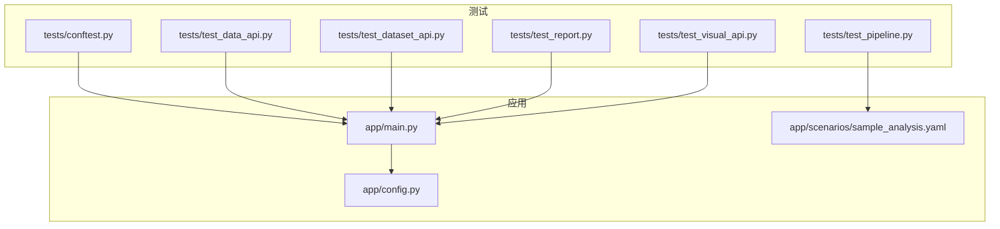
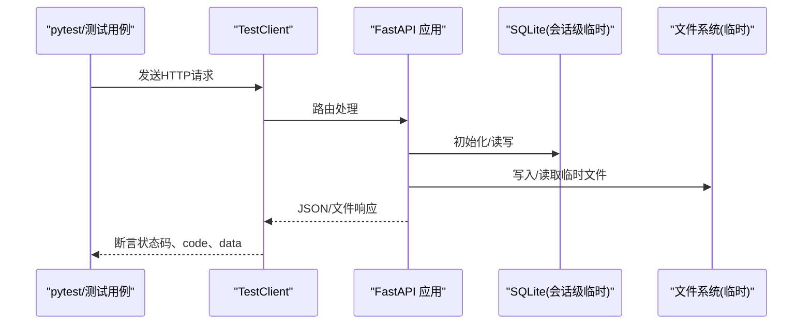
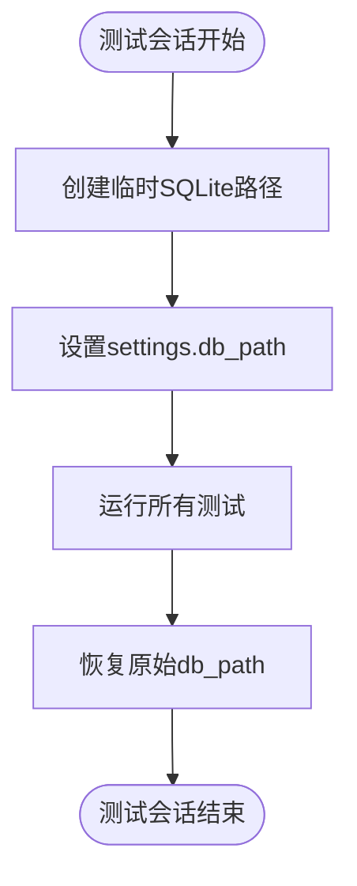
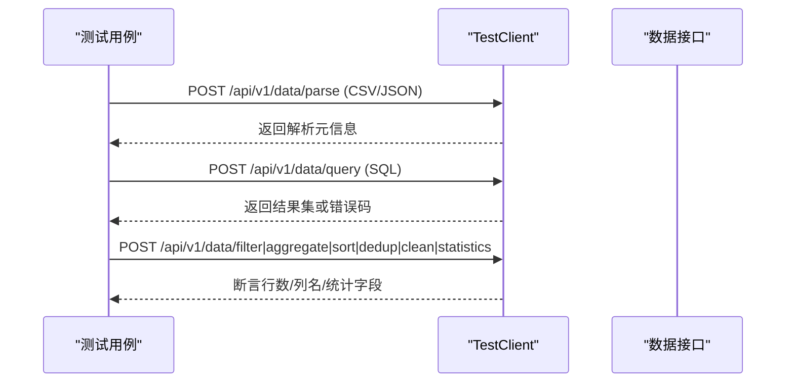
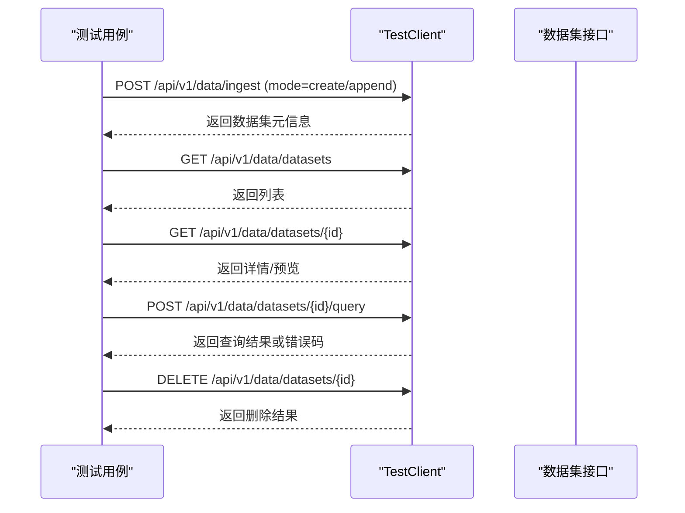
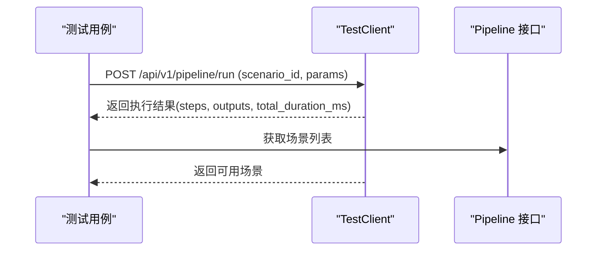
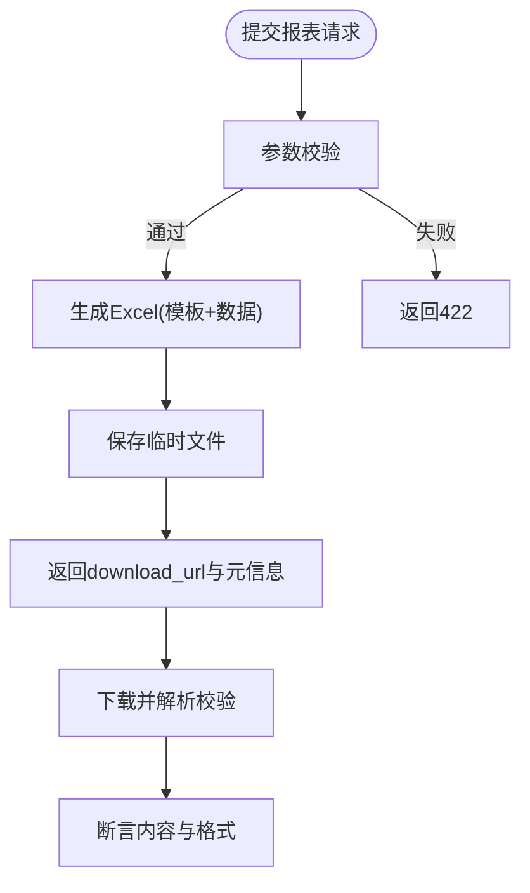
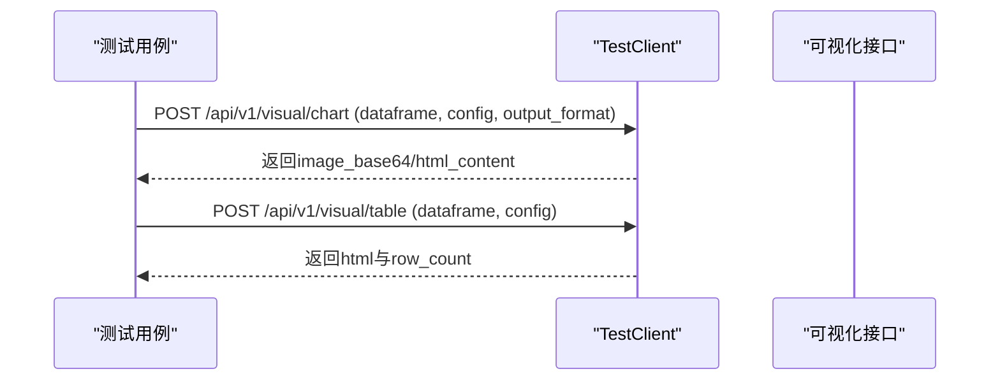
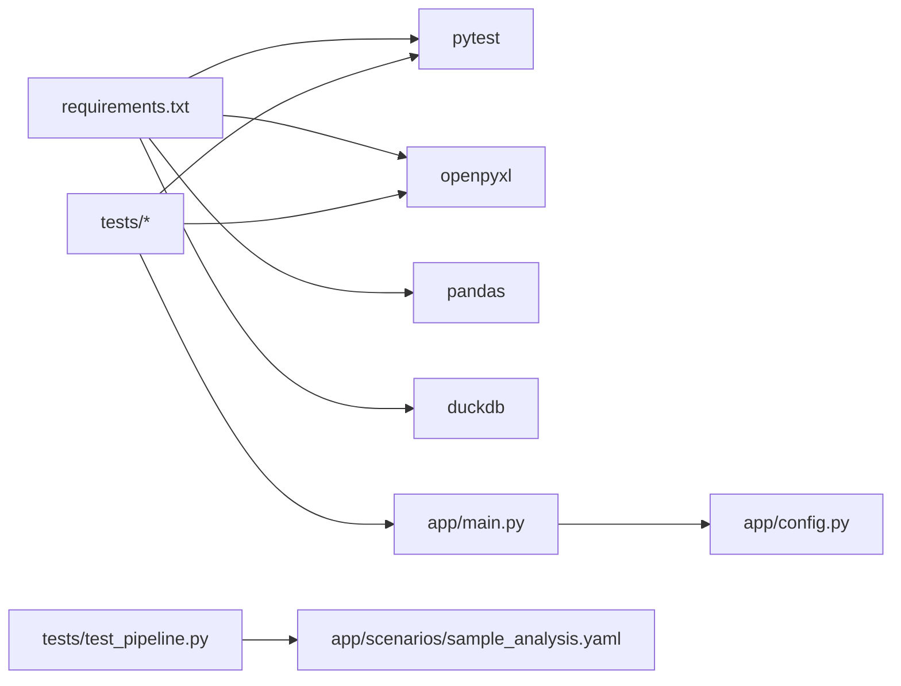

# 测试指南

<cite>
**本文引用的文件**
- [tests/conftest.py](file://tests/conftest.py)
- [tests/test_data_api.py](file://tests/test_data_api.py)
- [tests/test_dataset_api.py](file://tests/test_dataset_api.py)
- [tests/test_pipeline.py](file://tests/test_pipeline.py)
- [tests/test_report.py](file://tests/test_report.py)
- [tests/test_visual_api.py](file://tests/test_visual_api.py)
- [app/main.py](file://app/main.py)
- [app/config.py](file://app/config.py)
- [requirements.txt](file://requirements.txt)
- [app/scenarios/sample_analysis.yaml](file://app/scenarios/sample_analysis.yaml)
</cite>

## 目录
1. [简介](#简介)
2. [项目结构](#项目结构)
3. [核心组件](#核心组件)
4. [架构总览](#架构总览)
5. [详细组件分析](#详细组件分析)
6. [依赖关系分析](#依赖关系分析)
7. [性能考虑](#性能考虑)
8. [故障排查指南](#故障排查指南)
9. [结论](#结论)
10. [附录](#附录)

## 简介
本指南系统性说明项目的测试策略与实现，覆盖单元测试、集成测试与端到端测试的组织方式；解释 pytest 框架的使用与测试夹具配置；提供各类 API 接口的测试示例（正常流程与异常场景）；阐述测试数据的准备与管理策略；并给出覆盖率要求建议与持续集成配置建议。

## 项目结构
测试代码位于 tests 目录，采用按功能域划分的模块：
- conftest.py：全局夹具与共享配置
- test_data_api.py：数据处理相关接口测试（解析、查询、过滤、聚合、排序、去重、清洗、统计）
- test_dataset_api.py：数据集入库、列表、详情、查询、删除等接口测试
- test_pipeline.py：场景加载与 Pipeline 引擎的单元与端到端测试
- test_report.py：报表生成接口测试（Excel 内容校验、动态日期、参数校验、部分填充）
- test_visual_api.py：可视化图表与表格接口测试

应用入口与生命周期在 app/main.py，配置在 app/config.py，场景定义在 app/scenarios/*.yaml。

**图示来源**
- [tests/conftest.py:10-24](file://tests/conftest.py#L10-L24)
- [app/main.py:29-98](file://app/main.py#L29-L98)
- [app/config.py:6-22](file://app/config.py#L6-L22)
- [app/scenarios/sample_analysis.yaml:1-68](file://app/scenarios/sample_analysis.yaml#L1-L68)

**章节来源**
- [tests/conftest.py:1-42](file://tests/conftest.py#L1-L42)
- [app/main.py:1-109](file://app/main.py#L1-L109)
- [app/config.py:1-23](file://app/config.py#L1-L23)
- [app/scenarios/sample_analysis.yaml:1-68](file://app/scenarios/sample_analysis.yaml#L1-L68)

## 核心组件
- 测试客户端与生命周期管理：通过 FastAPI TestClient 包裹应用实例，确保 lifespan 正确执行数据库初始化与后台任务清理。
- 会话级临时数据库：使用 tmp_path_factory 创建独立 SQLite 数据库路径，避免测试污染真实数据。
- 公共请求体夹具：提供标准 DataFrame 输入，用于数据类接口测试复用。
- 业务领域测试集：
  - 数据处理：解析、SQL 查询、过滤、聚合、排序、去重、清洗、统计
  - 数据集：入库（含追加模式）、列表、详情、查询、删除
  - 流水线：场景加载、端到端运行（上传→清洗→统计→输出）
  - 报表：Excel 生成与内容校验、动态日期、参数校验、部分填充
  - 可视化：多种图表类型与 HTML 表格输出

**章节来源**
- [tests/conftest.py:10-42](file://tests/conftest.py#L10-L42)
- [tests/test_data_api.py:7-174](file://tests/test_data_api.py#L7-L174)
- [tests/test_dataset_api.py:24-282](file://tests/test_dataset_api.py#L24-L282)
- [tests/test_pipeline.py:7-108](file://tests/test_pipeline.py#L7-L108)
- [tests/test_report.py:63-284](file://tests/test_report.py#L63-L284)
- [tests/test_visual_api.py:4-166](file://tests/test_visual_api.py#L4-L166)

## 架构总览
测试通过 HTTP 层对 FastAPI 应用发起请求，验证响应状态码、业务 code、数据结构与副作用（如文件下载、数据库变更）。Pipeline 端到端测试串联多个步骤，验证中间产物与最终输出。

**图示来源**
- [tests/conftest.py:10-24](file://tests/conftest.py#L10-L24)
- [app/main.py:29-98](file://app/main.py#L29-L98)

## 详细组件分析

### 测试夹具与公共配置
- 会话级临时数据库 fixture：为整个测试会话创建一个隔离的 SQLite 数据库路径，并在结束后恢复原配置，保证测试间隔离与可重复性。
- TestClient fixture：封装应用实例，确保 lifespan 启动与关闭逻辑生效。
- 示例 DataFrame 输入 fixture：统一构造常用列与行数据，减少重复构造成本。

**图示来源**
- [tests/conftest.py:10-17](file://tests/conftest.py#L10-L17)
- [app/config.py:6-22](file://app/config.py#L6-L22)

**章节来源**
- [tests/conftest.py:10-42](file://tests/conftest.py#L10-L42)
- [app/config.py:6-22](file://app/config.py#L6-L22)

### 数据处理 API 测试
覆盖健康检查、文件解析（CSV/JSON/不支持格式）、SQL 查询（含注入防护）、过滤、聚合、排序、去重、清洗、描述性与相关性统计。

**图示来源**
- [tests/test_data_api.py:16-174](file://tests/test_data_api.py#L16-L174)

**章节来源**
- [tests/test_data_api.py:7-174](file://tests/test_data_api.py#L7-L174)

### 数据集 API 测试
覆盖入库（create/append）、列表、详情（含预览）、查询（含危险 SQL 拦截）、删除。包含多场景：自动表名、描述元数据、追加缺失列、无效 mode、资源不存在等。

**图示来源**
- [tests/test_dataset_api.py:24-282](file://tests/test_dataset_api.py#L24-L282)

**章节来源**
- [tests/test_dataset_api.py:24-282](file://tests/test_dataset_api.py#L24-L282)

### Pipeline 引擎测试
- 单元测试：场景加载与列举，验证场景 ID、名称、数据源数量、步骤数、输出数。
- 端到端测试：上传 CSV → 清洗 → 排序 → 统计 → 输出（表格/文件/摘要），断言步骤成功数、输出结构与耗时。
- 异常场景：运行不存在的场景，返回特定错误码。

**图示来源**
- [tests/test_pipeline.py:7-108](file://tests/test_pipeline.py#L7-L108)
- [app/scenarios/sample_analysis.yaml:1-68](file://app/scenarios/sample_analysis.yaml#L1-L68)

**章节来源**
- [tests/test_pipeline.py:7-108](file://tests/test_pipeline.py#L7-L108)
- [app/scenarios/sample_analysis.yaml:1-68](file://app/scenarios/sample_analysis.yaml#L1-L68)

### 报表 API 测试
- 基本功能：返回下载链接、文件格式、行列数。
- Excel 内容校验：标题合并、动态列头、数据行映射、合计行计算、合并单元格保留。
- 动态日期：不同日期输入下周期范围与工作日的计算。
- 参数校验：必填字段、日期格式、行数限制、字段完整性。
- 部分填充：仅传入部分行时，模板剩余行保持原样且合计仅对已提供数据求和。

**图示来源**
- [tests/test_report.py:63-284](file://tests/test_report.py#L63-L284)

**章节来源**
- [tests/test_report.py:63-284](file://tests/test_report.py#L63-L284)

### 可视化 API 测试
- 图表：柱状图 PNG、折线图 SVG、饼图 PNG、HTML 图表，非法 chart_type 应返回 422。
- 表格：基础表格与带配置的表格（排序、条件样式），断言 HTML 内容与样式。

**图示来源**
- [tests/test_visual_api.py:4-166](file://tests/test_visual_api.py#L4-L166)

**章节来源**
- [tests/test_visual_api.py:4-166](file://tests/test_visual_api.py#L4-L166)

## 依赖关系分析
- 测试依赖 pytest、httpx、openpyxl 等，均在 requirements.txt 中声明。
- 测试通过 TestClient 直接调用应用实例，避免启动外部服务，提升稳定性与速度。
- 场景 YAML 驱动 Pipeline 行为，测试通过加载该配置验证端到端流程。

**图示来源**
- [requirements.txt:1-31](file://requirements.txt#L1-L31)
- [tests/test_pipeline.py:7-108](file://tests/test_pipeline.py#L7-L108)
- [app/main.py:29-98](file://app/main.py#L29-L98)
- [app/config.py:6-22](file://app/config.py#L6-L22)
- [app/scenarios/sample_analysis.yaml:1-68](file://app/scenarios/sample_analysis.yaml#L1-L68)

**章节来源**
- [requirements.txt:1-31](file://requirements.txt#L1-L31)

## 性能考虑
- 使用会话级临时数据库减少 IO 开销与数据污染风险。
- 测试夹具集中化，避免重复构造大数据集。
- 端到端测试尽量精简数据量，聚焦关键路径。
- 对于报表与可视化测试，优先断言关键字段与结构，避免全量比对。

[本节为通用指导，无需具体文件引用]

## 故障排查指南
- 数据库相关：确认测试夹具已切换至临时 db_path；若出现连接失败，检查权限与磁盘空间。
- 文件下载：确认临时文件未被后台清理任务过早删除；必要时调整清理间隔或延长测试等待时间。
- 安全拦截：SQL 注入与危险语句会被拦截，预期返回特定错误码；若未命中，检查白名单与规则。
- 参数校验：422 表示请求体不符合模型约束；根据错误定位缺失或类型错误的字段。
- 场景加载：确保 scenarios_dir 指向有效目录，YAML 语法正确。

**章节来源**
- [tests/conftest.py:10-17](file://tests/conftest.py#L10-L17)
- [app/main.py:29-98](file://app/main.py#L29-L98)
- [tests/test_data_api.py:56-63](file://tests/test_data_api.py#L56-L63)
- [tests/test_dataset_api.py:240-247](file://tests/test_dataset_api.py#L240-L247)
- [tests/test_report.py:201-230](file://tests/test_report.py#L201-L230)

## 结论
本项目测试体系以 pytest 为核心，结合 FastAPI TestClient 进行集成与端到端测试，通过会话级临时数据库与夹具机制保障隔离性与可维护性。测试覆盖了数据处理、数据集管理、Pipeline 引擎、报表生成与可视化等关键能力，包含正常流程与异常场景，具备较好的健壮性与扩展性。建议在后续迭代中补充覆盖率阈值与 CI 流水线，进一步提升质量保障。

[本节为总结性内容，无需具体文件引用]

## 附录

### 测试组织与分类
- 单元测试：场景加载、错误抛出等纯函数/模块行为
- 集成测试：API 层与数据库/文件系统的交互
- 端到端测试：完整业务流程（如 Pipeline run）

**章节来源**
- [tests/test_pipeline.py:7-108](file://tests/test_pipeline.py#L7-L108)
- [tests/test_dataset_api.py:24-282](file://tests/test_dataset_api.py#L24-L282)
- [tests/test_report.py:63-284](file://tests/test_report.py#L63-L284)

### 覆盖率要求建议
- 建议目标：整体覆盖率 ≥ 80%，关键模块（数据处理、数据集、Pipeline、报表）≥ 90%
- 工具：pytest-cov 配合 coverage 报告
- 报告：HTML + XML 输出，便于 CI 归档与趋势分析

[本节为通用建议，无需具体文件引用]

### 持续集成配置建议
- 触发：Push/Pull Request
- 环境：Python 3.x，安装 requirements.txt
- 步骤：
  - 安装依赖
  - 运行测试：pytest --cov=app --cov-report=html --cov-report=xml -v
  - 上传覆盖率报告
  - 缓存依赖以提升构建速度

[本节为通用建议，无需具体文件引用]