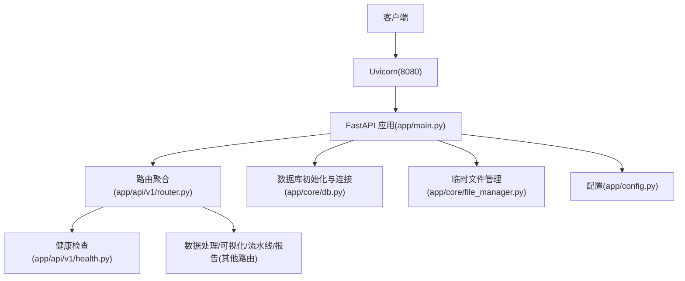
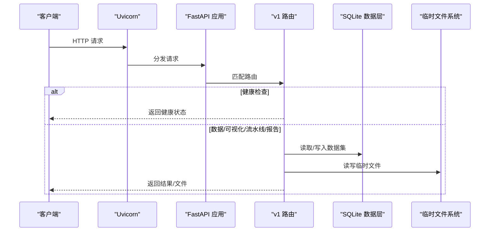
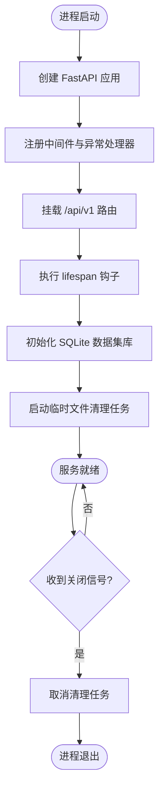
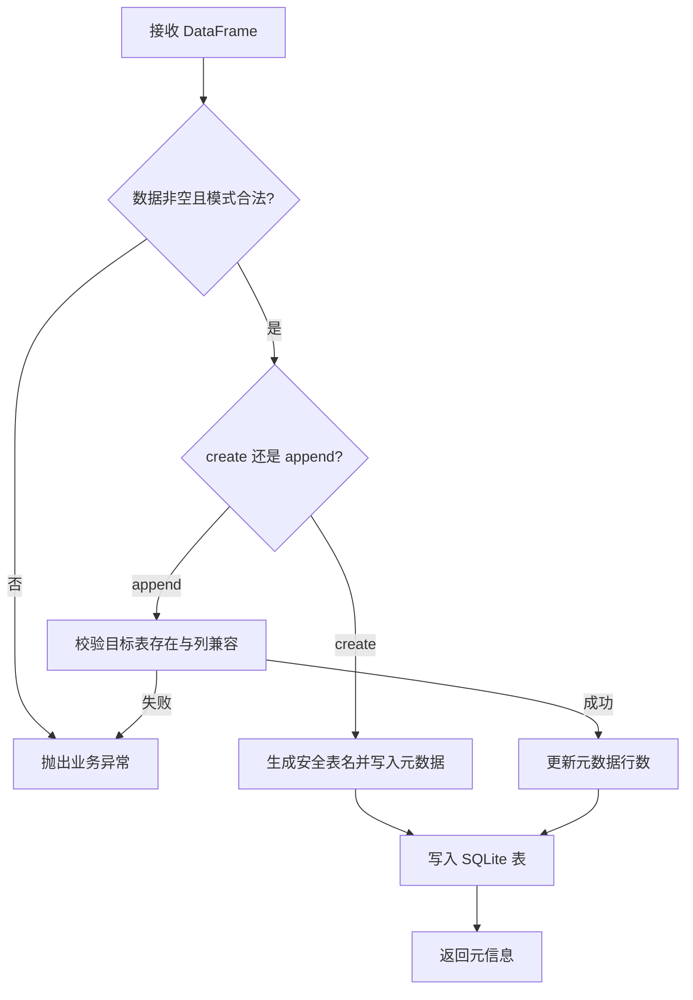
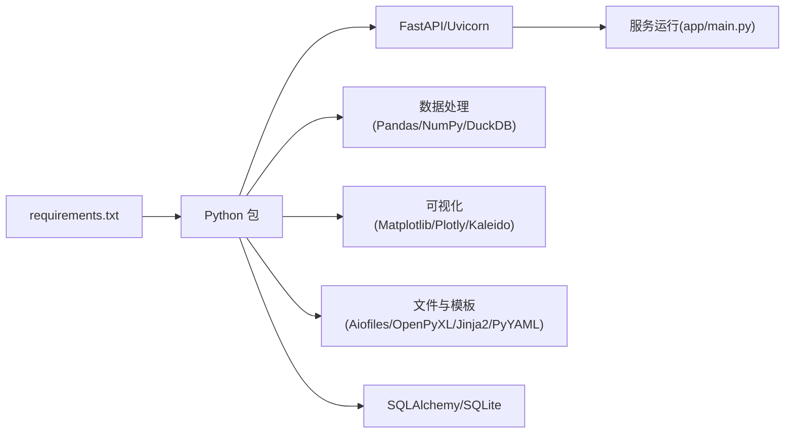
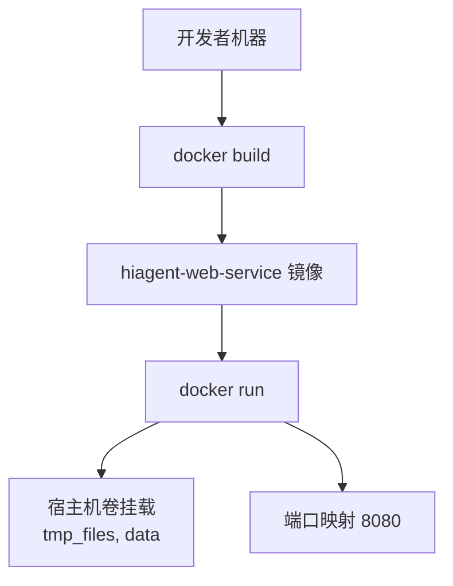

# 部署指南

<cite>
**本文引用的文件**
- [Dockerfile](file://Dockerfile)
- [requirements.txt](file://requirements.txt)
- [app/main.py](file://app/main.py)
- [app/config.py](file://app/config.py)
- [start.sh](file://start.sh)
- [start.ps1](file://start.ps1)
- [app/core/db.py](file://app/core/db.py)
- [app/core/file_manager.py](file://app/core/file_manager.py)
- [app/api/v1/router.py](file://app/api/v1/router.py)
- [app/api/v1/health.py](file://app/api/v1/health.py)
- [app/scenarios/sample_analysis.yaml](file://app/scenarios/sample_analysis.yaml)
</cite>

## 目录
1. [简介](#简介)
2. [项目结构](#项目结构)
3. [核心组件](#核心组件)
4. [架构总览](#架构总览)
5. [详细组件分析](#详细组件分析)
6. [依赖关系分析](#依赖关系分析)
7. [性能与资源调优](#性能与资源调优)
8. [本地开发部署](#本地开发部署)
9. [容器化与编排](#容器化与编排)
10. [生产环境部署](#生产环境部署)
11. [负载均衡、监控告警与日志收集](#负载均衡监控告警与日志收集)
12. [云平台部署示例与最佳实践](#云平台部署示例与最佳实践)
13. [运维监控与故障排查](#运维监控与故障排查)
14. [结论](#结论)

## 简介
本指南面向本地开发、容器化部署与生产环境，提供从镜像构建、服务启动、配置管理到性能调优、负载均衡、监控告警、日志收集以及多云平台部署的完整步骤。服务基于 FastAPI + Uvicorn，使用 SQLite 作为数据集持久化存储，并提供临时文件管理与定时清理能力。

## 项目结构
- Web 入口与生命周期：FastAPI 应用创建、中间件、异常处理、路由挂载、下载接口等。
- 配置管理：通过环境变量或 .env 文件加载配置项（端口、路径、日志级别等）。
- 数据层：SQLite 数据集入库、查询、删除；元数据表维护。
- 文件管理：临时文件保存、获取、删除与过期清理任务。
- API 路由：v1 路由汇总，包含健康检查、数据处理、可视化、流水线、报告等子模块。
- 场景定义：YAML 描述的数据处理流水线场景。

图表来源
- [app/main.py:29-98](file://app/main.py#L29-L98)
- [app/api/v1/router.py:1-18](file://app/api/v1/router.py#L1-L18)
- [app/api/v1/health.py:1-13](file://app/api/v1/health.py#L1-L13)
- [app/core/db.py:59-84](file://app/core/db.py#L59-L84)
- [app/core/file_manager.py:15-78](file://app/core/file_manager.py#L15-L78)
- [app/config.py:6-22](file://app/config.py#L6-L22)

章节来源
- [app/main.py:29-98](file://app/main.py#L29-L98)
- [app/api/v1/router.py:1-18](file://app/api/v1/router.py#L1-L18)
- [app/config.py:6-22](file://app/config.py#L6-L22)

## 核心组件
- 应用生命周期：启动时初始化 SQLite 数据集库并启动后台临时文件清理任务；关闭时取消清理任务。
- 中间件：CORS 允许跨域；请求 ID 注入与回写响应头，便于链路追踪。
- 异常处理：统一业务异常、验证异常与通用异常处理器。
- 配置：支持环境变量与 .env 文件，默认端口 8080、日志级别 INFO、数据存储路径等。
- 数据持久化：SQLite 数据集表与元数据表，支持 create/append 模式入库、只读 SQL 查询、删除数据集。
- 文件管理：临时文件保存、获取、删除与按小时间隔的过期清理。

章节来源
- [app/main.py:29-98](file://app/main.py#L29-L98)
- [app/config.py:6-22](file://app/config.py#L6-L22)
- [app/core/db.py:59-84](file://app/core/db.py#L59-L84)
- [app/core/file_manager.py:47-78](file://app/core/file_manager.py#L47-L78)

## 架构总览
服务采用分层架构：
- 接入层：Uvicorn 监听 8080 端口，承载 HTTP 请求。
- 应用层：FastAPI 负责路由、中间件、异常处理、生命周期管理。
- 领域层：数据处理、可视化、流水线、报告等 API 子模块。
- 基础设施层：SQLite 数据库、临时文件系统、场景 YAML 配置。

图表来源
- [app/main.py:29-98](file://app/main.py#L29-L98)
- [app/api/v1/router.py:1-18](file://app/api/v1/router.py#L1-L18)
- [app/core/db.py:89-189](file://app/core/db.py#L89-L189)
- [app/core/file_manager.py:22-44](file://app/core/file_manager.py#L22-L44)

## 详细组件分析

### 应用启动与生命周期
- 启动流程：创建 FastAPI 实例，注册 CORS、请求 ID 中间件、异常处理器，挂载 v1 路由，提供文件下载接口。
- 生命周期钩子：init_db 初始化 SQLite 元数据表；periodic_cleanup 启动后台清理任务；关闭时取消任务。

图表来源
- [app/main.py:29-98](file://app/main.py#L29-L98)
- [app/core/db.py:59-84](file://app/core/db.py#L59-L84)
- [app/core/file_manager.py:64-78](file://app/core/file_manager.py#L64-L78)

章节来源
- [app/main.py:29-98](file://app/main.py#L29-L98)

### 配置管理
- 配置项：应用名称、文件存储路径、清理间隔、端口、日志级别、场景目录、数据库路径。
- 加载方式：pydantic-settings 支持环境变量与 .env 文件，大小写不敏感。

章节来源
- [app/config.py:6-22](file://app/config.py#L6-L22)

### 数据持久化（SQLite）
- 元数据表：_datasets 记录数据集 id、表名、文件名、描述、行列数、列名、数据类型、文件类型、创建时间。
- 入库模式：create（新建表）、append（追加行），对 append 进行列兼容校验。
- 查询限制：仅允许 SELECT 或 WITH 开头的只读 SQL，防止危险操作。
- 删除：删除元数据与对应表。

图表来源
- [app/core/db.py:89-189](file://app/core/db.py#L89-L189)
- [app/core/db.py:262-296](file://app/core/db.py#L262-L296)
- [app/core/db.py:301-323](file://app/core/db.py#L301-L323)

章节来源
- [app/core/db.py:59-84](file://app/core/db.py#L59-L84)
- [app/core/db.py:89-189](file://app/core/db.py#L89-L189)
- [app/core/db.py:262-296](file://app/core/db.py#L262-L296)
- [app/core/db.py:301-323](file://app/core/db.py#L301-L323)

### 临时文件管理
- 功能：保存、获取、删除临时文件；按小时间隔清理过期文件。
- 清理策略：根据 file_cleanup_interval_hours 计算最大存活时间，遍历目录删除超龄文件。

章节来源
- [app/core/file_manager.py:15-78](file://app/core/file_manager.py#L15-L78)

### API 路由与健康检查
- 路由聚合：/api/v1 下包含 health、data、visual、pipeline、report 等子路由。
- 健康检查：GET /api/v1/health 返回 healthy 状态。

章节来源
- [app/api/v1/router.py:1-18](file://app/api/v1/router.py#L1-L18)
- [app/api/v1/health.py:1-13](file://app/api/v1/health.py#L1-L13)

### 场景定义（Pipeline）
- 示例场景：上传 CSV -> 清洗 -> 排序 -> 统计 -> 输出表格/文件/摘要。
- 参数映射：通过 YAML 声明数据源、步骤、输出，便于扩展与复用。

章节来源
- [app/scenarios/sample_analysis.yaml:1-68](file://app/scenarios/sample_analysis.yaml#L1-L68)

## 依赖关系分析
- 运行时依赖：FastAPI、Uvicorn、Pydantic、Pandas、NumPy、DuckDB、Matplotlib、Plotly、Kaleido、OpenPyXL、Jinja2、PyYAML、SQLAlchemy、Aiofiles、测试框架等。
- 系统依赖：gcc、libffi-dev（为部分 Python 包编译预留）。
- 启动命令：Uvicorn 以 app.main:app 作为入口，监听 0.0.0.0:8080。

图表来源
- [requirements.txt:1-31](file://requirements.txt#L1-L31)
- [Dockerfile:1-24](file://Dockerfile#L1-L24)
- [app/main.py:101-108](file://app/main.py#L101-L108)

章节来源
- [requirements.txt:1-31](file://requirements.txt#L1-L31)
- [Dockerfile:1-24](file://Dockerfile#L1-L24)

## 性能与资源调优
- 并发模型：Uvicorn 默认异步事件循环，适合高并发 I/O；生产建议启用多 worker（如 --workers N）以提升吞吐。
- 内存与 CPU：根据负载调整 worker 数量与单进程资源上限；避免在单进程中执行重型同步阻塞任务。
- 数据库：SQLite 适合轻量级场景；高并发写入需考虑 WAL 模式与锁竞争，必要时迁移至 PostgreSQL/MySQL。
- 文件存储：临时文件目录应置于高性能磁盘；合理设置清理间隔，避免磁盘占用过高。
- 日志级别：生产环境建议调整为 WARNING 或 ERROR，减少 I/O 开销。

[本节为通用指导，无需具体文件引用]

## 本地开发部署
- 前置条件：Python >= 3.10，pip 可用。
- 一键启动脚本：
  - Linux/macOS：./start.sh [--port 8080] [--host 0.0.0.0] [--reload] [--no-check]
  - Windows：.\start.ps1 [-Port 8080] [-Host "0.0.0.0"] [-Reload] [-NoCheck]
- 脚本功能：环境检查、虚拟环境创建、依赖安装、配置文件初始化、端口占用检查、启动 Uvicorn。
- 访问地址：http://localhost:8080/docs（Swagger UI）；健康检查 http://localhost:8080/api/v1/health。

章节来源
- [start.sh:1-240](file://start.sh#L1-L240)
- [start.ps1:1-220](file://start.ps1#L1-L220)
- [app/api/v1/health.py:10-12](file://app/api/v1/health.py#L10-L12)

## 容器化与编排
- Docker 镜像构建：
  - 基础镜像：python:3.10-slim
  - 系统依赖：gcc、libffi-dev
  - Python 依赖：requirements.txt
  - 工作目录：/app
  - 暴露端口：8080
  - 启动命令：uvicorn app.main:app --host 0.0.0.0 --port 8080
- 构建与运行：
  - 构建：docker build -t hiagent-web-service .
  - 运行：docker run -p 8080:8080 -v $(pwd)/tmp_files:/app/tmp_files -v $(pwd)/data:/app/data hiagent-web-service
- 数据持久化：将 tmp_files 与 data 目录挂载到宿主机，确保重启后数据不丢失。
- 环境变量：可通过 -e 或 docker-compose 配置 APP_PORT、FILE_STORAGE_PATH、DB_PATH、LOG_LEVEL 等。

图表来源
- [Dockerfile:1-24](file://Dockerfile#L1-L24)
- [app/config.py:6-22](file://app/config.py#L6-L22)

章节来源
- [Dockerfile:1-24](file://Dockerfile#L1-L24)
- [app/config.py:6-22](file://app/config.py#L6-L22)

## 生产环境部署
- 进程管理：建议使用 systemd、supervisor 或容器编排平台（Kubernetes）管理服务生命周期。
- 反向代理：Nginx/Traefik 作为入口，转发到 Uvicorn 服务，启用 HTTPS、Gzip、缓存策略。
- 多副本与水平扩展：根据 QPS 与资源使用率扩缩容；结合负载均衡器分发流量。
- 配置管理：通过环境变量注入敏感信息与运行参数；避免将 .env 提交到版本库。
- 数据备份：定期备份 SQLite 数据库文件与临时文件目录。
- 安全加固：最小权限原则、网络隔离、输入校验、限流与防抖。

[本节为通用指导，无需具体文件引用]

## 负载均衡、监控告警与日志收集
- 负载均衡：
  - 入口层：Nginx/Traefik 配置 upstream 与健康检查。
  - 应用层：Uvicorn 多 worker；容器编排中多副本自动发现。
- 监控告警：
  - 指标采集：Prometheus 抓取 Uvicorn/FastAPI 指标；自定义业务指标导出。
  - 告警规则：CPU/内存/错误率/延迟阈值触发告警（Alertmanager/PagerDuty 等）。
  - 健康检查：/api/v1/health 用于探针与自检测试。
- 日志收集：
  - 结构化日志：JSON 格式输出，包含 request_id、trace_id。
  - 集中收集：Fluent Bit/Filebeat 采集容器 stdout/stderr 或日志文件，发送至 ELK/Loki。
  - 日志轮转：logrotate 或平台内置机制避免磁盘爆满。

章节来源
- [app/api/v1/health.py:10-12](file://app/api/v1/health.py#L10-L12)
- [app/main.py:64-71](file://app/main.py#L64-L71)

## 云平台部署示例与最佳实践
- AWS：
  - ECS/Fargate：容器镜像推送至 ECR，ECS 任务定义指定端口与环境变量，ALB 暴露 80/443。
  - CloudWatch：日志与指标集成，设置告警。
- Azure：
  - AKS：Helm Chart 部署，Ingress 暴露服务，Application Insights 采集指标。
  - Log Analytics：集中日志与查询。
- GCP：
  - GKE：Deployment/Service/Ingress 配置，Cloud Monitoring 与 Logging 集成。
  - Cloud Load Balancing：外部 LB 与后端服务组。
- 最佳实践：
  - 使用只读根文件系统与最小镜像。
  - 通过 ConfigMap/Secret 管理配置与密钥。
  - 资源请求与限制（CPU/Memory）保障稳定性。
  - 滚动更新与回滚策略。

[本节为通用指导，无需具体文件引用]

## 运维监控与故障排查
- 常见问题：
  - 端口占用：启动脚本已做端口检查；若失败请更换端口或释放占用进程。
  - 依赖缺失：确保 requirements.txt 与系统依赖安装完成。
  - 数据库路径不存在：应用会自动创建 data 目录；确认挂载卷权限。
  - 临时文件未清理：检查 file_cleanup_interval_hours 与清理任务是否运行。
- 诊断步骤：
  - 查看服务日志：Uvicorn 输出与应用日志。
  - 健康检查：curl /api/v1/health。
  - 数据库状态：检查 _datasets 表与 SQLite 文件完整性。
  - 文件目录：确认 tmp_files 与 data 目录内容。
- 恢复措施：
  - 重启服务或容器。
  - 清理过期临时文件。
  - 重建数据库（谨慎操作，先备份）。

章节来源
- [start.sh:175-223](file://start.sh#L175-L223)
- [start.ps1:159-199](file://start.ps1#L159-L199)
- [app/core/db.py:59-84](file://app/core/db.py#L59-L84)
- [app/core/file_manager.py:47-78](file://app/core/file_manager.py#L47-L78)

## 结论
本指南提供了从本地开发到生产环境的完整部署方案，涵盖容器化、编排、性能调优、负载均衡、监控告警与日志收集，并给出多云平台部署的最佳实践。通过合理的配置与运维策略，可确保服务在高可用与高性能状态下稳定运行。