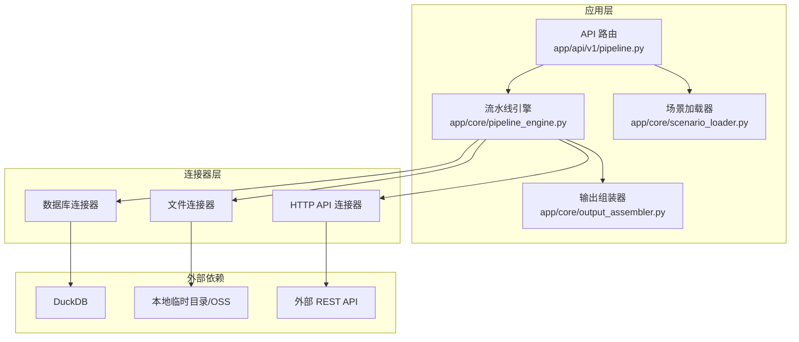
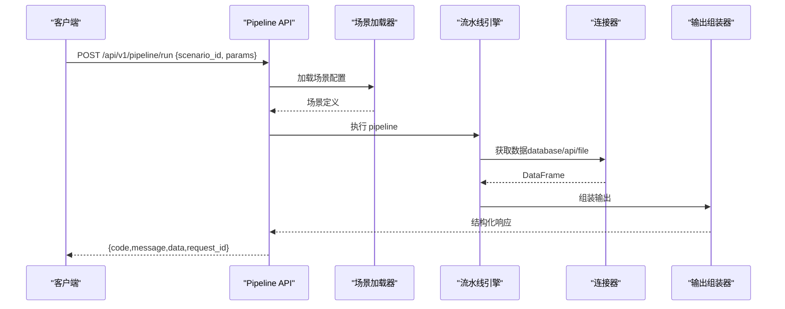
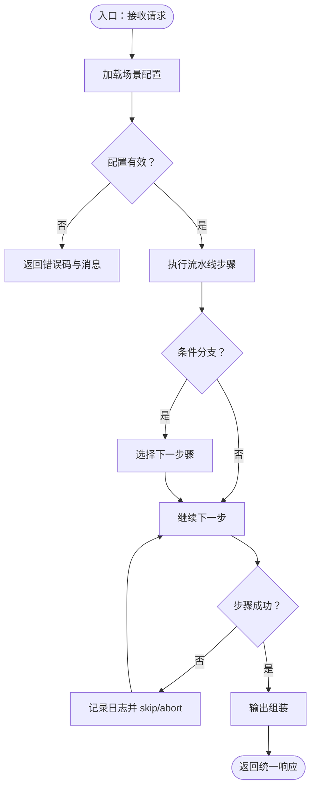
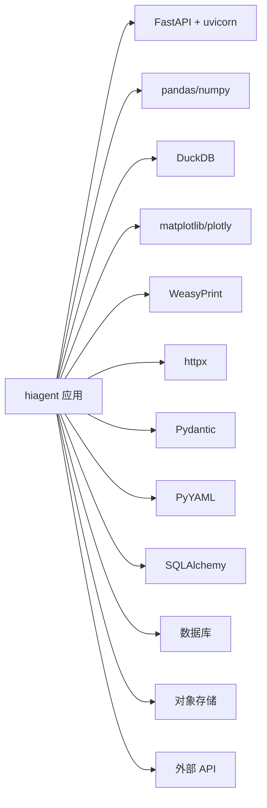

# 部署指南

<cite>
**本文引用的文件**
- [hiagent_辅助_Web_服务需求说明_task-242.md](file://docs\hiagent_辅助_Web_服务需求说明_task-242.md)
</cite>

## 目录
1. [简介](#简介)
2. [项目结构](#项目结构)
3. [核心组件](#核心组件)
4. [架构总览](#架构总览)
5. [详细组件分析](#详细组件分析)
6. [依赖关系分析](#依赖关系分析)
7. [性能与容量规划](#性能与容量规划)
8. [生产环境部署最佳实践](#生产环境部署最佳实践)
9. [监控与日志](#监控与日志)
10. [负载均衡与高可用](#负载均衡与高可用)
11. [多环境配置示例](#多环境配置示例)
12. [安全配置](#安全配置)
13. [健康检查与故障恢复](#健康检查与故障恢复)
14. [常见问题排查](#常见问题排查)
15. [结论](#结论)

## 简介
本指南面向 hiagent 辅助 Web 服务的容器化与生产部署，覆盖 Docker 镜像构建、容器运行、环境变量与配置管理、数据库连接、文件存储、监控与日志、负载均衡与高可用、多环境配置、安全加固、健康检查与故障恢复等主题。内容基于需求说明书中的技术选型与架构设计进行编排，确保在生产环境中可落地执行。

## 项目结构
根据需求说明，项目采用“场景驱动的流水线引擎”架构，关键目录与职责如下：
- app/core/pipeline_engine.py：流水线引擎，负责步骤顺序执行、上下文传递、条件分支与错误处理
- app/core/scenario_loader.py：场景配置加载器，从 YAML 加载场景定义并校验
- app/core/connectors/：数据连接器（database/api/file），统一返回 DataFrame
- app/core/output_assembler.py：输出组装器，生成 chart/table/report/file/summary
- app/scenarios/*.yaml：场景配置文件，描述 data_sources、pipeline、outputs
- app/api/v1/pipeline.py：Pipeline API 路由，提供 /api/v1/pipeline/run 等接口

图表来源
- [hiagent_辅助_Web_服务需求说明_task-242.md:33-68](file://docs\hiagent_辅助_Web_服务需求说明_task-242.md#L33-L68)

章节来源
- [hiagent_辅助_Web_服务需求说明_task-242.md:106-115](file://docs\hiagent_辅助_Web_服务需求说明_task-242.md#L106-L115)

## 核心组件
- 流水线引擎：按 YAML 定义的 pipeline 顺序执行步骤，通过 PipelineContext 传递中间结果，支持条件分支与步骤级错误处理（skip/abort）
- 场景配置加载器：读取 YAML，校验 data_sources、pipeline、outputs 的完整性与类型
- 连接器层：统一抽象 database/api/file 等数据源，凭据从环境变量注入，返回标准 DataFrame
- 输出组装器：将中间结果渲染为 chart/table/report/file/summary，适配不同下游消费方

章节来源
- [hiagent_辅助_Web_服务需求说明_task-242.md:33-68](file://docs\hiagent_辅助_Web_服务需求说明_task-242.md#L33-L68)

## 架构总览
hiagent 提供两种调用模式：
- 模式 A：Pipeline API（POST /api/v1/pipeline/run），传入 scenario_id 与参数，一次完成全流程
- 模式 B：原子 API（/api/v1/data/*、/api/v1/visual/* 等），逐步调用，便于 Agent 自行编排

图表来源
- [hiagent_辅助_Web_服务需求说明_task-242.md:25-31](file://docs\hiagent_辅助_Web_服务需求说明_task-242.md#L25-L31)
- [hiagent_辅助_Web_服务需求说明_task-242.md:65-68](file://docs\hiagent_辅助_Web_服务需求说明_task-242.md#L65-L68)

## 详细组件分析

### 流水线引擎与场景配置
- 输入：YAML 场景定义（data_sources、pipeline、outputs）
- 处理：顺序执行步骤，命名引用传递中间数据，支持条件分支与步骤级错误处理
- 输出：标准化 JSON 响应，包含 code/message/data/request_id

图表来源
- [hiagent_辅助_Web_服务需求说明_task-242.md:33-68](file://docs\hiagent_辅助_Web_服务需求说明_task-242.md#L33-L68)

章节来源
- [hiagent_辅助_Web_服务需求说明_task-242.md:33-68](file://docs\hiagent_辅助_Web_服务需求说明_task-242.md#L33-L68)

### 连接器层
- 数据库连接器：直连 MySQL/PostgreSQL/ClickHouse，使用 SQL 查询与聚合
- API 连接器：调用外部 REST API，支持超时重试、速率限制、鉴权模板
- 文件连接器：上传/下载文件，格式转换，元信息查询，临时文件管理

章节来源
- [hiagent_辅助_Web_服务需求说明_task-242.md:46-55](file://docs\hiagent_辅助_Web_服务需求说明_task-242.md#L46-L55)

### 输出组装器
- 支持 chart/table/report/file/summary 五种输出类型
- summary 专为 Agent 设计，便于后续编排与消费

章节来源
- [hiagent_辅助_Web_服务需求说明_task-242.md:62-64](file://docs\hiagent_辅助_Web_服务需求说明_task-242.md#L62-L64)

## 依赖关系分析
- 运行时依赖：FastAPI、uvicorn、pandas/numpy、DuckDB、matplotlib/plotly、WeasyPrint、httpx、Pydantic、PyYAML、SQLAlchemy
- 外部依赖：数据库（MySQL/PostgreSQL/ClickHouse）、对象存储（可选扩展）、外部 REST API
- 部署依赖：Docker、反向代理（Nginx/Traefik）、监控与日志系统

图表来源
- [hiagent_辅助_Web_服务需求说明_task-242.md:19-21](file://docs\hiagent_辅助_Web_服务需求说明_task-242.md#L19-L21)

章节来源
- [hiagent_辅助_Web_服务需求说明_task-242.md:19-21](file://docs\hiagent_辅助_Web_服务需求说明_task-242.md#L19-L21)

## 性能与容量规划
- 目标性能：简单接口 < 500ms，数据处理 < 3s，Pipeline 全流程 < 10s
- CPU/内存：根据并发与数据规模评估，建议预留 20%-30% 余量
- I/O：文件操作与报表生成可能成为瓶颈，建议使用 SSD 与异步任务
- 缓存：对热点场景可引入 Redis 缓存中间结果或报告

章节来源
- [hiagent_辅助_Web_服务需求说明_task-242.md:97-103](file://docs\hiagent_辅助_Web_服务需求说明_task-242.md#L97-L103)

## 生产环境部署最佳实践
- 服务器配置
  - 操作系统：Linux（推荐 Ubuntu/Debian/CentOS）
  - 内核参数：调整文件句柄数、网络缓冲区
  - 资源限制：通过 cgroups 限制 CPU/内存，避免 OOM
- 容器化
  - 基础镜像：选择精简且安全的 Python 镜像
  - 构建优化：分层缓存、多阶段构建、最小化依赖
  - 运行用户：以非 root 用户运行容器
- 环境变量与配置
  - 所有凭据通过环境变量注入，禁止硬编码
  - 场景配置热加载：支持在不重启的情况下更新 YAML
- 数据库连接
  - 使用连接池，设置最大连接数与超时
  - 读写分离与只读副本用于分析型查询
- 文件存储
  - 初期使用本地临时目录，定期清理
  - 后期可扩展至对象存储（S3/OSS），启用生命周期策略

章节来源
- [hiagent_辅助_Web_服务需求说明_task-242.md:97-103](file://docs\hiagent_辅助_Web_服务需求说明_task-242.md#L97-L103)
- [hiagent_辅助_Web_服务需求说明_task-242.md:142-142](file://docs\hiagent_辅助_Web_服务需求说明_task-242.md#L142-L142)

## 监控与日志
- 应用监控
  - 暴露 /health 端点用于存活与就绪检查
  - 暴露指标端点（如 Prometheus metrics），采集 QPS、延迟、错误率
- 性能指标
  - 步骤耗时、连接器耗时、输出渲染耗时
  - 资源使用：CPU、内存、I/O
- 日志管理
  - 结构化日志：包含 scenario_id、request_id、步骤名、耗时
  - 日志级别：DEBUG/INFO/WARN/ERROR，生产默认 INFO
  - 集中收集：ELK/Loki，保留策略与轮转

章节来源
- [hiagent_辅助_Web_服务需求说明_task-242.md:97-103](file://docs\hiagent_辅助_Web_服务需求说明_task-242.md#L97-L103)

## 负载均衡与高可用
- 负载均衡
  - 使用 Nginx/Traefik 作为反向代理，启用健康检查与权重分配
  - 多实例部署，水平扩展，无状态服务
- 高可用
  - 数据库主从/集群，自动故障转移
  - 对象存储多副本与跨区域复制
  - 配置中心与密钥管理服务（Vault/KMS）
- 弹性伸缩
  - 基于 CPU/内存/队列长度触发扩缩容
  - 预热与优雅启停，避免冷启动抖动

[本节为通用实践，不直接分析具体文件]

## 多环境配置示例
- 开发环境
  - 本地 Docker Compose 启动应用、DuckDB、MinIO（可选）
  - 环境变量：调试开关、日志级别 DEBUG、数据库连接指向本地
- 测试环境
  - 独立命名空间与数据库，自动化测试套件
  - 环境变量：关闭热加载、启用慢查询日志
- 生产环境
  - 多副本部署，反向代理与健康检查
  - 环境变量：生产密钥、连接池大小、超时与重试策略

章节来源
- [hiagent_辅助_Web_服务需求说明_task-242.md:97-103](file://docs\hiagent_辅助_Web_服务需求说明_task-242.md#L97-L103)

## 安全配置
- HTTPS
  - 使用证书管理器（Let's Encrypt）自动续期
  - 强制 HTTPS，启用 HSTS
- 认证授权
  - API Key 认证：通过 X-API-Key Header 校验
  - 细粒度权限控制：按场景与角色限制访问
- 访问控制
  - IP 白名单、WAF 防护
  - 输入校验与 SQL 注入防护
- 凭据管理
  - 环境变量注入，禁止硬编码
  - 密钥轮换与审计

章节来源
- [hiagent_辅助_Web_服务需求说明_task-242.md:25-31](file://docs\hiagent_辅助_Web_服务需求说明_task-242.md#L25-L31)
- [hiagent_辅助_Web_服务需求说明_task-242.md:97-103](file://docs\hiagent_辅助_Web_服务需求说明_task-242.md#L97-L103)

## 健康检查与故障恢复
- 健康检查
  - /health：存活探针，检查依赖（数据库、对象存储）
  - /ready：就绪探针，检查场景配置加载与连接器可用性
- 故障恢复
  - 重试与退避：对外部 API 与数据库连接
  - 熔断与降级：当依赖不可用时返回友好错误
  - 快照与回滚：配置与数据的版本化管理
- 告警与通知
  - 错误率、延迟、资源使用阈值告警
  - 事件驱动的通知渠道（邮件、短信、IM）

章节来源
- [hiagent_辅助_Web_服务需求说明_task-242.md:97-103](file://docs\hiagent_辅助_Web_服务需求说明_task-242.md#L97-L103)

## 常见问题排查
- 场景配置加载失败
  - 检查 YAML 语法与必填字段
  - 验证 data_sources 的连接配置
- 连接器超时或失败
  - 调整超时与重试策略
  - 检查网络与防火墙规则
- 输出渲染缓慢
  - 优化数据量与图表复杂度
  - 启用缓存与异步任务
- 文件清理问题
  - 确认定时任务运行正常
  - 检查磁盘空间与权限

[本节为通用实践，不直接分析具体文件]

## 结论
本指南基于需求说明书的技术选型与架构设计，提供了 hiagent 辅助 Web 服务的容器化与生产部署方案。通过环境变量与场景配置热加载实现灵活部署，结合监控、日志、负载均衡与高可用策略，确保服务在生产环境的稳定性与可观测性。建议在上线前完成多环境演练与安全加固，持续优化性能与成本。