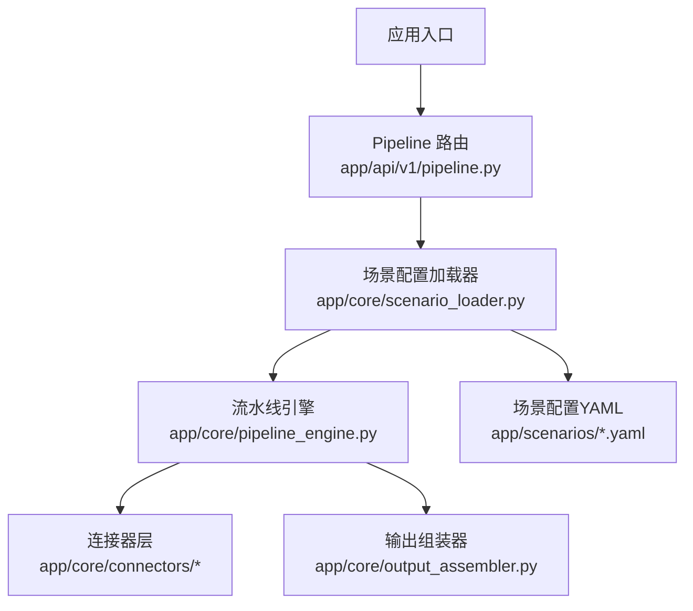
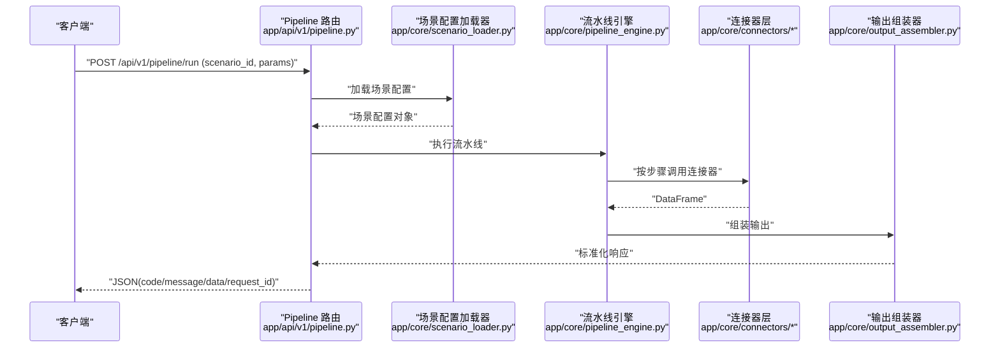
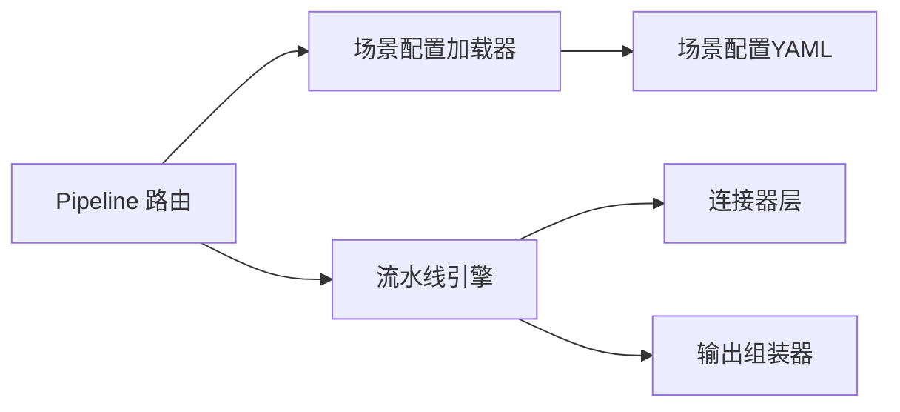

# 配置管理

<cite>
**本文引用的文件**
- [hiagent_辅助_Web_服务需求说明_task-242.md](file://docs/hiagent_辅助_Web_服务需求说明_task-242.md)
</cite>

## 目录
1. [简介](#简介)
2. [项目结构](#项目结构)
3. [核心组件](#核心组件)
4. [架构总览](#架构总览)
5. [详细组件分析](#详细组件分析)
6. [依赖关系分析](#依赖关系分析)
7. [性能考虑](#性能考虑)
8. [故障排查指南](#故障排查指南)
9. [结论](#结论)
10. [附录](#附录)

## 简介
本指南面向 hiagent 辅助 Web 服务的“配置管理”，聚焦以 YAML 驱动的场景化流水线能力。文档基于需求说明书中关于场景配置、连接器、Pipeline 引擎与输出组装器的设计，系统阐述：
- YAML 配置文件的结构与语法（场景配置、连接器配置、环境变量）
- 如何定义新业务场景（Pipeline 步骤、数据源连接、输出格式）
- 配置文件层次结构与继承关系
- 配置验证规则与错误处理
- 不同部署环境的配置示例（开发、测试、生产）
- 配置热重载与动态更新机制

## 项目结构
根据需求说明，项目采用“场景驱动 + 流水线引擎”的架构，关键新增目录与职责如下：
- app/core/pipeline_engine.py：流水线引擎，负责按序执行步骤、上下文传递、条件分支与错误处理
- app/core/scenario_loader.py：场景配置加载器，负责读取 YAML、校验、合并与缓存
- app/core/connectors/：数据连接器集合（数据库、API、文件等），统一返回 DataFrame
- app/core/output_assembler.py：输出组装器，支持 chart/table/report/file/summary
- app/scenarios/*.yaml：场景配置文件目录，每个场景一份 YAML
- app/api/v1/pipeline.py：Pipeline API 路由，暴露 /api/v1/pipeline/run 等接口

**图示来源**
- [hiagent_辅助_Web_服务需求说明_task-242.md:33-68](file://docs/hiagent_辅助_Web_服务需求说明_task-242.md#L33-L68)
- [hiagent_辅助_Web_服务需求说明_task-242.md:106-114](file://docs/hiagent_辅助_Web_服务需求说明_task-242.md#L106-L114)

**章节来源**
- [hiagent_辅助_Web_服务需求说明_task-242.md:33-68](file://docs/hiagent_辅助_Web_服务需求说明_task-242.md#L33-L68)
- [hiagent_辅助_Web_服务需求说明_task-242.md:106-114](file://docs/hiagent_辅助_Web_服务需求说明_task-242.md#L106-L114)

## 核心组件
- 场景配置模型（YAML）
  - data_sources：数据源定义（connector 类型、连接参数、SQL/API 参数、请求参数映射）
  - pipeline：处理流水线步骤（action 调用原子能力、input/output 命名引用）
  - outputs：输出定义（chart/table/report/file/summary，含数据源引用）
- 连接器层（Connector Layer）
  - 类型：database、api、file_upload、file_url、file_s3（扩展）
  - 特性：凭据从环境变量读取；统一返回 DataFrame；注册表模式扩展
- 流水线引擎（Pipeline Engine）
  - 顺序执行、命名上下文传递、条件分支、步骤级错误处理（skip/abort）、每步日志与耗时
- 输出组装器（Output Assembler）
  - 五种输出类型，其中 summary 专为 Agent 设计

**章节来源**
- [hiagent_辅助_Web_服务需求说明_task-242.md:40-64](file://docs/hiagent_辅助_Web_服务需求说明_task-242.md#L40-L64)

## 架构总览
整体流程为：Agent 请求进入 Pipeline API 入口后，由场景配置加载器读取并解析 YAML，随后通过流水线引擎调度连接器获取数据，经多步处理后由输出组装器生成结果，最终返回统一 JSON 响应。

**图示来源**
- [hiagent_辅助_Web_服务需求说明_task-242.md:33-68](file://docs/hiagent_辅助_Web_服务需求说明_task-242.md#L33-L68)

## 详细组件分析

### YAML 配置结构与语法
- 顶层字段
  - scenario_id：场景标识，用于路由与可观测性
  - data_sources：数据源列表，每项包含 connector 类型、连接配置、SQL/API 参数、请求参数映射
  - pipeline：步骤链，每项包含 action、输入输出命名引用、条件与错误策略
  - outputs：输出项列表，每项包含类型（chart/table/report/file/summary）与数据源引用
- 变量与环境
  - 凭据与敏感信息通过环境变量注入，避免硬编码
  - 可在 YAML 中以占位符形式引用环境变量（由加载器解析）
- 继承与复用
  - 建议将通用片段（如公共数据源、通用步骤）抽取为共享片段，通过 include/extends 机制组合（具体实现以加载器为准）
- 校验规则
  - 必填字段校验（scenario_id、pipeline 至少一个步骤、outputs 至少一项）
  - 类型校验（connector 类型白名单、action 名称白名单、输出类型白名单）
  - 引用完整性校验（data_source 引用、output 引用必须存在）
  - 安全校验（SQL 注入防护、外部 URL 白名单、文件大小限制）

**章节来源**
- [hiagent_辅助_Web_服务需求说明_task-242.md:40-64](file://docs/hiagent_辅助_Web_服务需求说明_task-242.md#L40-L64)

### 连接器配置（data_sources）
- 支持的连接器类型
  - database：直连数据库（MySQL/PostgreSQL/ClickHouse）
  - api：调用外部 REST API
  - file_upload：Agent 上传文件
  - file_url：从 URL 下载文件
  - file_s3：对象存储（后期扩展）
- 配置要点
  - 连接参数：主机、端口、库名、认证信息等（通过环境变量注入）
  - SQL/API 参数：查询语句或请求体模板、头部、鉴权方式
  - 请求参数映射：将上游传入参数映射到连接器所需字段
- 行为约定
  - 所有连接器返回统一 DataFrame
  - 失败时抛出明确异常，供 Pipeline 步骤级错误处理捕获

**章节来源**
- [hiagent_辅助_Web_服务需求说明_task-242.md:46-55](file://docs/hiagent_辅助_Web_服务需求说明_task-242.md#L46-L55)

### Pipeline 步骤配置
- 步骤组织
  - 顺序执行，通过命名上下文（PipelineContext）在步骤间传递中间数据
  - 支持条件分支：根据上下文状态决定跳过或继续
  - 步骤级错误处理：skip（跳过后续）或 abort（终止流水线）
- 输入输出
  - input/output 使用命名引用，确保可读性与可维护性
- 可观测性
  - 每步记录日志与耗时，便于定位瓶颈

**章节来源**
- [hiagent_辅助_Web_服务需求说明_task-242.md:57-61](file://docs/hiagent_辅助_Web_服务需求说明_task-242.md#L57-L61)

### 输出配置（outputs）
- 输出类型
  - chart：图表（PNG/SVG/HTML）
  - table：表格（带排序、条件着色）
  - report：报告（Jinja2 HTML 模板、Markdown 转 HTML）
  - file：文件（CSV/Excel/JSON/Markdown/HTML 互转、PDF/Word/Excel/PPT）
  - summary：摘要（专为 Agent 设计）
- 数据源引用
  - 通过引用 pipeline 中间结果或 data_sources 的结果进行组装

**章节来源**
- [hiagent_辅助_Web_服务需求说明_task-242.md:62-64](file://docs/hiagent_辅助_Web_服务需求说明_task-242.md#L62-L64)

### 定义新业务场景的步骤
- 准备阶段
  - 在 app/scenarios 下新建 YAML 文件，填写 scenario_id
  - 在 data_sources 中声明所需的数据源（数据库/API/文件）
- 编排阶段
  - 在 pipeline 中按顺序添加步骤，使用 action 调用原子能力
  - 通过 input/output 命名引用串联数据流
  - 根据需要设置条件分支与错误策略
- 输出阶段
  - 在 outputs 中定义需要的输出类型与数据来源
- 验证与测试
  - 使用 /api/v1/pipeline/run 调用场景，检查返回码与数据
  - 结合结构化日志与步骤耗时定位问题

**章节来源**
- [hiagent_辅助_Web_服务需求说明_task-242.md:33-68](file://docs/hiagent_辅助_Web_服务需求说明_task-242.md#L33-L68)

### 环境变量与凭据管理
- 原则
  - 凭据不硬编码，全部通过环境变量注入
  - 不同环境使用不同的环境变量集（开发、测试、生产）
- 常见变量
  - 数据库连接串、API Key、文件路径、超时与重试参数等
- 安全建议
  - 使用密钥管理服务或容器编排平台注入
  - 最小权限原则，仅暴露必要变量

**章节来源**
- [hiagent_辅助_Web_服务需求说明_task-242.md:55-56](file://docs/hiagent_辅助_Web_服务需求说明_task-242.md#L55-L56)

### 配置层次结构与继承关系
- 层次结构
  - 全局默认配置（框架内置）
  - 环境级配置（开发/测试/生产）
  - 场景级配置（app/scenarios/*.yaml）
- 继承与覆盖
  - 场景配置可继承环境与全局默认值，局部覆盖
  - 推荐将公共片段抽取为共享配置，通过加载器合并
- 变更影响
  - 修改全局/环境配置需评估对现有场景的影响
  - 场景配置变更应独立验证

**章节来源**
- [hiagent_辅助_Web_服务需求说明_task-242.md:102-103](file://docs/hiagent_辅助_Web_服务需求说明_task-242.md#L102-L103)

### 配置验证规则与错误处理
- 验证规则
  - 结构校验：必填字段、类型、枚举值
  - 引用校验：data_source、output 引用必须存在
  - 安全校验：SQL 注入防护、URL 白名单、文件大小限制
- 错误处理
  - 步骤级错误：skip/abort
  - 统一错误码：1xxx 通用、2xxx 数据处理、3xxx 可视化、4xxx 文件文档、5xxx API 编排、6xxx Pipeline 引擎
  - 统一响应格式：code/message/data/request_id

**章节来源**
- [hiagent_辅助_Web_服务需求说明_task-242.md:27-29](file://docs/hiagent_辅助_Web_服务需求说明_task-242.md#L27-L29)
- [hiagent_辅助_Web_服务需求说明_task-242.md:57-61](file://docs/hiagent_辅助_Web_服务需求说明_task-242.md#L57-L61)

### 不同部署环境的配置示例
- 开发环境
  - 使用本地数据库与临时文件目录
  - 放宽超时与重试限制，便于调试
- 测试环境
  - 使用隔离的测试数据库与沙箱文件目录
  - 启用更严格的校验与限流
- 生产环境
  - 使用高可用数据库与对象存储
  - 严格的安全策略、最小权限、审计日志
  - 开启健康检查与监控指标

**章节来源**
- [hiagent_辅助_Web_服务需求说明_task-242.md:102-103](file://docs/hiagent_辅助_Web_服务需求说明_task-242.md#L102-L103)

### 配置热重载与动态更新
- 目标
  - 在不重启服务的情况下，动态加载新的场景配置或更新现有配置
- 机制建议
  - 监听文件系统变化或配置中心事件
  - 增量更新场景缓存，保证并发安全
  - 提供 /api/v1/pipeline/scenarios 列出当前生效场景
- 注意事项
  - 热重载需保证原子切换，避免部分更新导致的不一致
  - 对正在执行的请求保持幂等与一致性

**章节来源**
- [hiagent_辅助_Web_服务需求说明_task-242.md:101-103](file://docs/hiagent_辅助_Web_服务需求说明_task-242.md#L101-L103)

## 依赖关系分析
- 模块耦合
  - Pipeline 路由依赖场景配置加载器与流水线引擎
  - 流水线引擎依赖连接器层与输出组装器
  - 场景配置加载器依赖 YAML 文件与环境变量
- 外部依赖
  - 数据库、REST API、文件系统、对象存储
- 风险点
  - 循环依赖：应避免模块间相互导入
  - 单点故障：连接器与外部依赖需具备降级与重试

**图示来源**
- [hiagent_辅助_Web_服务需求说明_task-242.md:106-114](file://docs/hiagent_辅助_Web_服务需求说明_task-242.md#L106-L114)

**章节来源**
- [hiagent_辅助_Web_服务需求说明_task-242.md:106-114](file://docs/hiagent_辅助_Web_服务需求说明_task-242.md#L106-L114)

## 性能考虑
- 简单接口 < 500ms，数据处理 < 3s，Pipeline 全流程 < 10s
- 优化建议
  - 合理分页与批处理
  - 缓存热点数据与结果
  - 异步化 IO 密集操作
  - 使用高效查询引擎（DuckDB）

**章节来源**
- [hiagent_辅助_Web_服务需求说明_task-242.md:99-100](file://docs/hiagent_辅助_Web_服务需求说明_task-242.md#L99-L100)

## 故障排查指南
- 常见问题
  - 场景未找到：检查 scenario_id 与 YAML 文件是否存在
  - 连接器失败：检查环境变量与网络连通性
  - 步骤报错：查看步骤日志与耗时，确认 skip/abort 策略
  - 输出为空：检查 output 引用与数据源是否有效
- 诊断手段
  - 结构化日志包含 scenario_id 与步骤耗时
  - 使用 /health 与健康检查端点
  - 使用 /api/v1/pipeline/scenarios 查看当前生效场景

**章节来源**
- [hiagent_辅助_Web_服务需求说明_task-242.md:101-102](file://docs/hiagent_辅助_Web_服务需求说明_task-242.md#L101-L102)

## 结论
hiagent 辅助 Web 服务通过 YAML 驱动的场景化流水线，实现了“场景可配置、组件可复用”的目标。借助统一的连接器、灵活的 Pipeline 引擎与丰富的输出能力，能够快速落地多种业务分析场景。配合环境变量、验证规则与热重载机制，可在不同环境中稳定运行并持续演进。

## 附录
- 统一接口规范
  - JSON 响应格式：code/message/data/request_id
  - 错误码分段：1xxx 通用、2xxx 数据处理、3xxx 可视化、4xxx 文件文档、5xxx API 编排、6xxx Pipeline 引擎
- 关键决策
  - 架构：Pipeline + 原子 API 双模式
  - 配置格式：YAML
  - SQL 引擎：DuckDB
  - 连接器模式：注册表模式（BaseConnector）
  - 文件存储：本地临时目录（初期）

**章节来源**
- [hiagent_辅助_Web_服务需求说明_task-242.md:25-31](file://docs/hiagent_辅助_Web_服务需求说明_task-242.md#L25-L31)
- [hiagent_辅助_Web_服务需求说明_task-242.md:134-142](file://docs/hiagent_辅助_Web_服务需求说明_task-242.md#L134-L142)