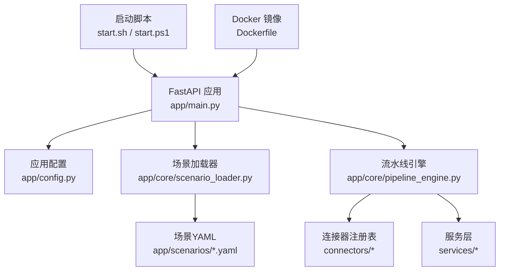
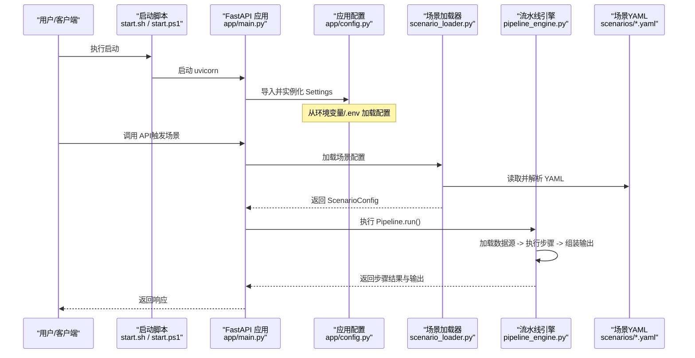
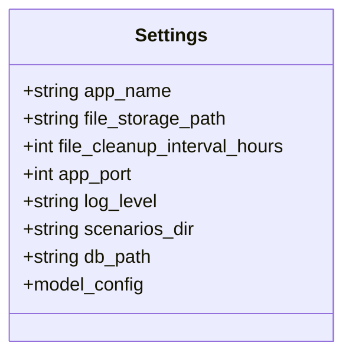
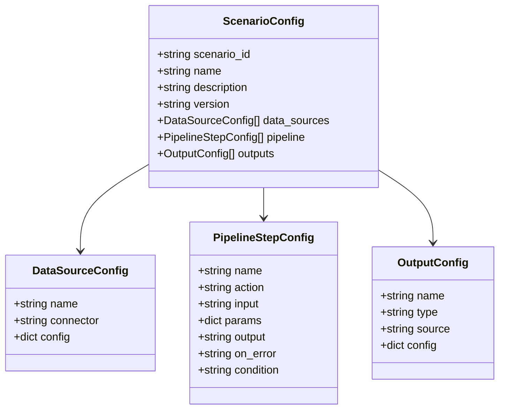
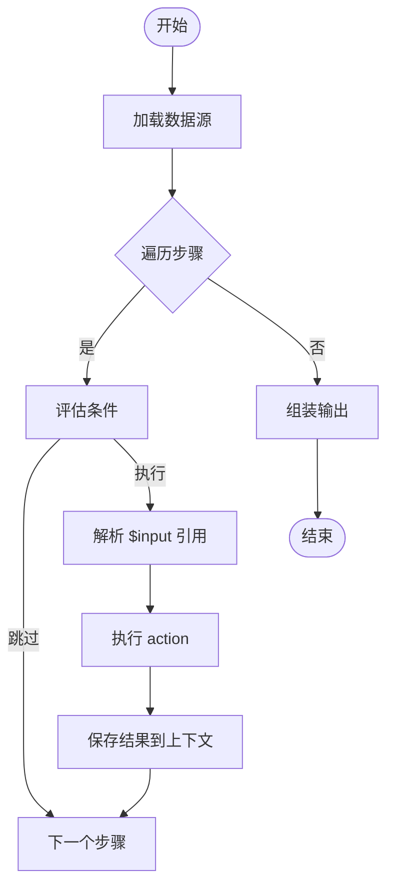
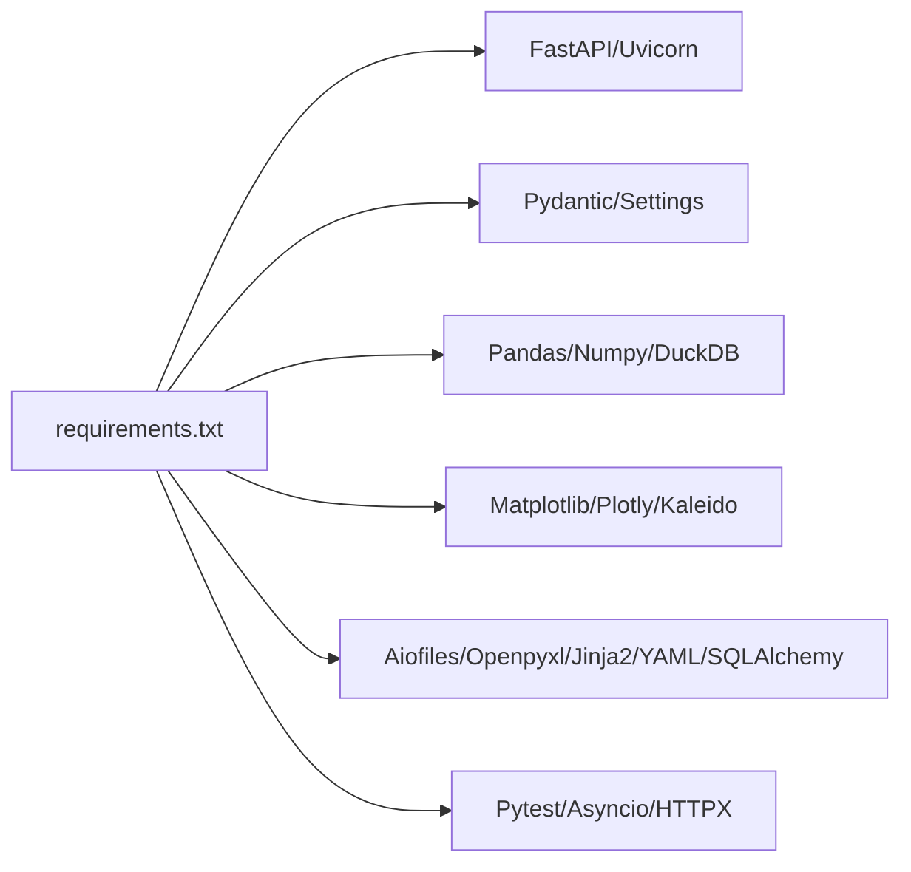

# 配置管理

<cite>
**本文引用的文件**
- [app/config.py](file://app/config.py)
- [app/main.py](file://app/main.py)
- [app/core/scenario_loader.py](file://app/core/scenario_loader.py)
- [app/core/pipeline_engine.py](file://app/core/pipeline_engine.py)
- [app/scenarios/product_increment_analysis.yaml](file://app/scenarios/product_increment_analysis.yaml)
- [app/scenarios/sample_analysis.yaml](file://app/scenarios/sample_analysis.yaml)
- [requirements.txt](file://requirements.txt)
- [Dockerfile](file://Dockerfile)
- [start.sh](file://start.sh)
- [start.ps1](file://start.ps1)
</cite>

## 目录
1. [简介](#简介)
2. [项目结构](#项目结构)
3. [核心组件](#核心组件)
4. [架构总览](#架构总览)
5. [详细组件分析](#详细组件分析)
6. [依赖关系分析](#依赖关系分析)
7. [性能考量](#性能考量)
8. [故障排查指南](#故障排查指南)
9. [结论](#结论)
10. [附录：环境与场景配置示例](#附录环境与场景配置示例)

## 简介
本项目的配置管理系统围绕“环境变量 + Pydantic Settings + YAML 场景配置”构建，提供类型安全的运行时配置加载、校验与使用。系统通过 Pydantic Settings 从环境变量或 .env 文件读取应用级配置；通过 YAML 定义可插拔的数据源、处理步骤和输出格式，实现“零代码”的场景编排。启动脚本负责环境检查、依赖安装、配置文件初始化与运行参数注入，容器化部署则通过 Dockerfile 固化运行环境。

## 项目结构
- 应用入口与生命周期管理位于 app/main.py，统一注册中间件、异常处理器与路由，并在启动时初始化数据库与后台任务。
- 应用级配置集中定义在 app/config.py，基于 pydantic-settings 的 BaseSettings 提供强类型、自动校验的配置模型。
- 场景配置位于 app/scenarios/*.yaml，由 app/core/scenario_loader.py 加载并校验为 Pydantic 模型。
- 流水线引擎 app/core/pipeline_engine.py 根据场景配置执行数据源加载、步骤处理与结果组装。
- 启动脚本 start.sh/start.ps1 负责创建虚拟环境、安装依赖、生成 .env（若不存在）、创建运行时目录并启动服务。
- 容器镜像通过 Dockerfile 固定 Python 版本与依赖，暴露端口并设置默认启动命令。

图表来源
- [app/main.py:29-98](file://app/main.py#L29-L98)
- [app/config.py:6-22](file://app/config.py#L6-L22)
- [app/core/scenario_loader.py:60-127](file://app/core/scenario_loader.py#L60-L127)
- [app/core/pipeline_engine.py:249-356](file://app/core/pipeline_engine.py#L249-L356)

章节来源
- [app/main.py:29-98](file://app/main.py#L29-L98)
- [app/config.py:6-22](file://app/config.py#L6-L22)
- [app/core/scenario_loader.py:60-127](file://app/core/scenario_loader.py#L60-L127)
- [app/core/pipeline_engine.py:249-356](file://app/core/pipeline_engine.py#L249-L356)

## 核心组件
- 应用配置（Pydantic Settings）
  - 通过 BaseSettings 声明字段与默认值，支持从环境变量与 .env 文件加载，大小写不敏感，UTF-8 编码。
  - 关键配置项包括应用名、文件存储路径、清理间隔、端口、日志级别、场景目录、数据库路径等。
- 场景配置加载器
  - 将 YAML 场景解析为 Pydantic 模型，包含数据源、流水线步骤、输出三大部分，并提供错误提示与缺失场景的错误码。
- 流水线引擎
  - 按场景配置顺序执行：加载数据源 -> 条件判断 -> 执行 action -> 保存中间结果 -> 组装输出。
  - 支持 $input.xxx 参数映射、简单条件表达式、on_error 策略（skip/abort）。
- 启动与部署
  - 启动脚本自动创建 .env（若存在 .env.example）、创建 tmp_files 与 data 目录、检查端口占用并启动 uvicorn。
  - Dockerfile 固定基础镜像、安装系统依赖与 Python 依赖、复制代码并暴露端口。

章节来源
- [app/config.py:6-22](file://app/config.py#L6-L22)
- [app/core/scenario_loader.py:19-105](file://app/core/scenario_loader.py#L19-L105)
- [app/core/pipeline_engine.py:77-119](file://app/core/pipeline_engine.py#L77-L119)
- [app/core/pipeline_engine.py:249-356](file://app/core/pipeline_engine.py#L249-L356)
- [start.sh:151-173](file://start.sh#L151-L173)
- [start.ps1:143-157](file://start.ps1#L143-L157)
- [Dockerfile:1-24](file://Dockerfile#L1-L24)

## 架构总览
下图展示了配置在系统中的流转：启动阶段由启动脚本准备环境与配置，应用启动后通过 Pydantic Settings 加载应用配置；请求进入后，场景加载器读取 YAML 并校验为模型；流水线引擎依据场景配置执行数据处理与输出组装。

图表来源
- [start.sh:191-239](file://start.sh#L191-L239)
- [start.ps1:167-219](file://start.ps1#L167-L219)
- [app/main.py:29-98](file://app/main.py#L29-L98)
- [app/config.py:6-22](file://app/config.py#L6-L22)
- [app/core/scenario_loader.py:60-127](file://app/core/scenario_loader.py#L60-L127)
- [app/core/pipeline_engine.py:249-356](file://app/core/pipeline_engine.py#L249-L356)

## 详细组件分析

### 应用配置（Pydantic Settings）
- 设计要点
  - 使用 BaseSettings 声明字段与默认值，便于类型校验与文档生成。
  - 通过 model_config 指定 .env 文件路径、编码与大小写策略。
  - 所有配置项均可被环境变量覆盖，便于多环境部署。
- 关键配置项
  - 应用名、文件存储路径、临时文件清理间隔、服务端口、日志级别、场景目录、数据库路径。
- 使用方式
  - 在应用入口中直接导入 settings 对象，用于 FastAPI 元信息、中间件、路由与启动参数。

图表来源
- [app/config.py:6-22](file://app/config.py#L6-L22)

章节来源
- [app/config.py:6-22](file://app/config.py#L6-L22)
- [app/main.py:46-53](file://app/main.py#L46-L53)
- [app/main.py:101-108](file://app/main.py#L101-L108)

### 场景配置加载器（YAML -> Pydantic 模型）
- 设计要点
  - 将 YAML 根节点解析为字典，再转换为 Pydantic 模型进行严格校验。
  - 提供 list_scenarios 列出可用场景，便于前端展示与选择。
  - 对缺失场景、YAML 解析失败、模型校验失败等错误进行统一封装。
- 模型结构
  - DataSourceConfig：数据源名称、连接器类型、连接器配置。
  - PipelineStepConfig：步骤名称、action、输入、参数、输出、错误策略、条件。
  - OutputConfig：输出名称、类型、数据来源、输出配置。
  - ScenarioConfig：场景标识、名称、描述、版本、数据源列表、步骤列表、输出列表。

图表来源
- [app/core/scenario_loader.py:21-55](file://app/core/scenario_loader.py#L21-L55)

章节来源
- [app/core/scenario_loader.py:60-127](file://app/core/scenario_loader.py#L60-L127)

### 流水线引擎（场景驱动的执行编排）
- 执行流程
  - 初始化上下文，存储输入参数与中间结果。
  - 遍历数据源，通过连接器获取 DataFrame 并写入上下文。
  - 遍历步骤：评估条件、解析 $input 引用、执行 action、保存结果。
  - 完成步骤后，调用输出装配器生成最终输出。
- 参数映射与条件
  - 支持 $input.xxx 动态替换，适用于上传文件、排序列等运行时参数。
  - 支持 has:xxx 与 not_empty:xxx 的简单条件控制。
- 错误处理
  - on_error=skip 继续后续步骤；on_error=abort 终止流程并返回已执行步骤结果。

图表来源
- [app/core/pipeline_engine.py:249-356](file://app/core/pipeline_engine.py#L249-L356)
- [app/core/pipeline_engine.py:77-119](file://app/core/pipeline_engine.py#L77-L119)

章节来源
- [app/core/pipeline_engine.py:77-119](file://app/core/pipeline_engine.py#L77-L119)
- [app/core/pipeline_engine.py:249-356](file://app/core/pipeline_engine.py#L249-L356)

### 场景 YAML 结构与语法
- 数据源（data_sources）
  - 支持 database、file_upload 等连接器；database 需指定 driver、path、sql。
  - file_upload 通过 param_mapping 将输入参数映射到连接器配置。
- 处理步骤（pipeline）
  - action 类型包括 query、filter、aggregate、pivot、sort、dedup、clean、statistics。
  - 每个步骤定义输入、参数、输出、错误策略与可选条件。
- 输出（outputs）
  - 支持 table、file、summary 等输出类型，并可附加标题、行数限制、格式等配置。

章节来源
- [app/scenarios/product_increment_analysis.yaml:18-126](file://app/scenarios/product_increment_analysis.yaml#L18-L126)
- [app/scenarios/sample_analysis.yaml:9-68](file://app/scenarios/sample_analysis.yaml#L9-L68)

### 不同环境的配置示例
- 开发环境
  - 本地运行可通过启动脚本自动创建 .env（若存在 .env.example），并创建 tmp_files 与 data 目录。
  - 建议设置较低日志级别、启用热重载（--reload），使用本地 SQLite 数据库路径。
- 测试环境
  - 通过环境变量覆盖端口、数据库路径、场景目录等，确保隔离与可重复性。
  - 可使用独立的 .env.test 并通过环境变量注入。
- 生产环境
  - 建议使用容器化部署，固定 Python 版本与依赖；通过环境变量注入敏感配置（如数据库路径、端口、日志级别）。
  - 关闭热重载，调整日志级别与清理间隔，确保资源释放与稳定性。

章节来源
- [start.sh:151-173](file://start.sh#L151-L173)
- [start.ps1:143-157](file://start.ps1#L143-L157)
- [Dockerfile:1-24](file://Dockerfile#L1-L24)
- [app/config.py:6-22](file://app/config.py#L6-L22)

## 依赖关系分析
- 外部依赖
  - Web 框架：fastapi、uvicorn、python-multipart。
  - 配置与验证：pydantic、pydantic-settings、python-dotenv。
  - 数据处理：pandas、numpy、duckdb、chardet。
  - 可视化：matplotlib、plotly、kaleido。
  - 文件与模板：aiofiles、openpyxl、jinja2、pyyaml、sqlalchemy。
  - 测试：pytest、pytest-asyncio、httpx。
- 模块耦合
  - main.py 依赖 config、errors、file_manager、db、router。
  - scenario_loader.py 依赖 config、errors、response。
  - pipeline_engine.py 依赖 connectors、errors、response、models、services。

图表来源
- [requirements.txt:1-31](file://requirements.txt#L1-L31)

章节来源
- [requirements.txt:1-31](file://requirements.txt#L1-L31)

## 性能考量
- 数据源加载
  - 数据库连接器应合理编写 SQL，避免全表扫描；必要时增加过滤条件与索引。
- 步骤执行
  - 聚合与统计操作应在合适的数据集上进行，避免不必要的中间结果放大。
- 输出组装
  - summary 类型可限制最大行数，减少传输与渲染开销。
- 资源清理
  - 利用 file_cleanup_interval_hours 定期清理临时文件，防止磁盘占用增长。

[本节为通用指导，无需具体文件引用]

## 故障排查指南
- 常见错误
  - 场景配置不存在：检查 scenario_id 与 YAML 文件名是否一致。
  - YAML 解析失败：确认缩进与语法正确。
  - 模型校验失败：核对字段类型与必填项。
  - 步骤执行失败：查看 on_error 策略与日志信息，定位具体步骤。
- 调试建议
  - 提高日志级别，关注步骤耗时与异常堆栈。
  - 使用 list_scenarios 接口验证场景可用性。
  - 在 pipeline 步骤中逐步缩小问题范围，优先验证数据源加载。

章节来源
- [app/core/scenario_loader.py:68-105](file://app/core/scenario_loader.py#L68-L105)
- [app/core/pipeline_engine.py:317-349](file://app/core/pipeline_engine.py#L317-L349)
- [app/core/errors.py:30-73](file://app/core/errors.py#L30-L73)

## 结论
本项目采用“Pydantic Settings + YAML 场景配置”的组合，实现了类型安全、可扩展且易于维护的配置体系。通过场景驱动的流水线引擎，业务逻辑以声明式 YAML 表达，降低代码复杂度并提升复用性。配合启动脚本与容器化部署，可在多环境中快速交付与稳定运行。

[本节为总结，无需具体文件引用]

## 附录：环境与场景配置示例
- 环境变量与 .env
  - 应用名、文件存储路径、清理间隔、端口、日志级别、场景目录、数据库路径等均可通过环境变量或 .env 配置。
  - 启动脚本会在首次运行时从 .env.example 生成 .env（若存在），并创建必要的运行时目录。
- 场景 YAML 示例
  - 产品增量分析：基于 SQLite 数据源，执行查询、聚合、统计，输出表格与摘要。
  - 示例分析：演示上传 CSV、清洗、排序、统计，输出表格、文件与摘要。

章节来源
- [app/config.py:6-22](file://app/config.py#L6-L22)
- [start.sh:151-173](file://start.sh#L151-L173)
- [start.ps1:143-157](file://start.ps1#L143-L157)
- [app/scenarios/product_increment_analysis.yaml:18-126](file://app/scenarios/product_increment_analysis.yaml#L18-L126)
- [app/scenarios/sample_analysis.yaml:9-68](file://app/scenarios/sample_analysis.yaml#L9-L68)